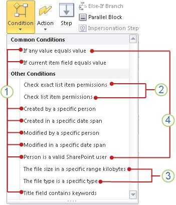

# Краткий справочник по условиям рабочего процесса (платформа рабочих процессов SharePoint 2010)
Узнайте о условий рабочих процессов, доступных в SharePoint 2010 платформы рабочих процессов в Microsoft SharePoint Designer 2013.Use этой статьи *только* при работе в SharePoint Designer 2013, но продолжить использовать SharePoint 2010 Platform.If рабочего процесса требуется использование платформы рабочих процессов SharePoint, [действия рабочего процесса и справочник по действий для SharePoint](workflow-actions-and-activities-reference-for-sharepoint.md)и других статей, перечисленных в разделе «Дополнительные ресурсы», которые описаны новые функции, которые являются доступно в новой платформе. Чтобы приступить к созданию рабочего процесса с помощью платформы рабочих процессов 2010, выберите **Рабочий процесс SharePoint 2010** в поле **Тип платформы** в диалоговом окне **Создать рабочий процесс** .
## Где можно найти условий рабочих процессов

Существует два способа для доступа к меню условий рабочих процессов недоступны.
  
    
    
При редактировании в шаге рабочего процесса выполните одно из следующих действий:
  
    
    

- На вкладке **рабочего процесса** в группе **Вставка** выберите **условия**, чтобы открыть список действий рабочих процессов.
    
  
- Дважды щелкните внутри шаг рабочего процесса. В поле поиска введите текст, который отображается листа условие, которое требуется, например, "Создать" и нажмите клавишу ВВОД. Действия и условия, которые содержат текст, введенный появляется через текстовое поле.
    
  

  
    
    

  
    
    
Какие условия доступны при создании или изменение рабочего процесса зависит от точного контекста, которой вы работаете. В разделе ниже для получения дополнительных сведений.
  
    
    

  
    
    

  
    
    
 Общие условия **1** в SharePoint Designer 2013.
  
    
    
 **2** **Проверьте разрешения для элемента списка точное** и **разрешения для элемента списка**, доступны только в пределах шаг олицетворения.
  
    
    
 **3** **Размер файла находится в конкретном диапазоне Кбайт** и **Тип файла имеет конкретный тип** доступны только в рабочий процесс, связанный с типом контента документа, дочерний тип контента документа или библиотеке.
  
    
    
 **4** **Если любое значение равно указанному значению** и **пользователь является допустимым пользователем SharePoint** являются единственным условий, доступных для создания рабочего процесса сайта.
  
    
    

## Общие условия

В этом разделе описываются условия, которые доступны в SharePoint Designer 2013 для списков и рабочих процессов для повторного использования списков, независимо от того, какой тип списка или типа контента, чтобы сопоставлен рабочий процесс.
  
    
    

### Если любое значение равно указанному значению

Это условие сначала отображается в действии рабочего процесса как **Если любое значение равно указанному значению**. Это условие используется для сравнения одно значение с другим значением. Каждое значение может быть статический текст, динамическую строку или подстановки переменной, сведения о контексте или поля SharePoint.
  
    
    
Можно выбрать из большое число операторов в условие, такие как **содержит** и **больше, чем**. Для этого необходимо установить первое **значение** в условии и затем щелкните **равно**. Операторы, доступные зависят от первого **значение** в условие имеет значение. Например при использовании диалогового окна поиска для первого присваивается **значение** в условии тип данных даты и времени, такие как **Created** **оператор** не из доступных вариантов.
  
    
    
Существует два варианта **равняется** и **содержит** операторы.
  
    
    

- Операторы **равенства** и **содержит** операции присваивания являются с учетом регистра.
    
  
- Операторы **равенства (без учета регистра)** и **содержит (без учета регистра букв)** не учитывают регистр.
    
  
Параметр, выбранный для второе **значение** в условии также зависит от в некоторой степени что первое **значение** задано значение. Предположим, что первое **значение** равно **создано** и затем поиске второе **значение** с помощью переменной, которая является строка, например, **Последние 10 символов**. Возможно, следует возвращать строку **Как даты и времени**, таким образом, сравнение с **Created** возвращал предсказуемые результаты.
  
    
    

> **Примечание:** Можно использовать логические операторы, такие как**||**(или) или ** &amp; ** (и) в условии.
  
    
    

Ниже приведены примеры как может выглядеть условие в действии рабочего процесса:
  
    
    

- Если переменной: недели от измененобольше, чемсегодня
    
  
- Если переменной: имя спецификациясодержит (без учета регистра букв)SharePoint Designer || SPD
    
  
**Если любое значение равно указанному значению** условие — это один из двух условий, доступных при работе в рабочий процесс сайта другое — **пользователь является допустимым пользователем SharePoint**. Дополнительные сведения о рабочих процессов сайта разделе  [Условия доступны в рамках рабочего процесса сайта](workflow-conditions-quick-reference-sharepoint-2010-workflow-platform.md#section5) в этой статье.
  
    
    

### Если текущее поле элемента равно значению

Это условие сначала отображается в действии рабочего процесса как **поля равно указанному значению**. Это условие можно используйте для сравнения значения в поле в текущем элементе (элемент, списка или для повторного использования рабочего процесса списка в настоящее время работает на) с другим значением. Значения может быть статический текст, динамической строки или поиск в переменные, сведения о контексте или другие поля SharePoint.
  
    
    
Щелкните **поле**, чтобы просмотреть список параметров. Доступные параметры для **поля** зависят от типа контента, списка, библиотеки или сайта, к которым связана рабочего процесса. Например рабочего процесса, который связан в библиотеке по умолчанию будут иметь параметров полей, например, **заголовок**, **создано** и **Кем создан**.
  
    
    
Можно выбрать из диапазона операторов в условие, а также **содержит** **больше, чем**. Прежде чем устанавливать оператор, необходимо сначала выбрать значение для **поля** и нажмите кнопку **равно**. Какие операторы доступны зависит от **поля**. Например если диалоговом окне поиска используется для задания **поля** в тип данных даты и времени, например **создано**, **оператор** не указана в качестве параметр.
  
    
    
Существует два варианта **равняется** и **содержит** операторы. Операторы **равенства** и **содержит** зависят от регистра символов, во время **равно (без учета регистра)** и **содержит (без учета регистра букв)** регистр не учитывается. Например если значение **поля** **заголовка** и затем использовать оператор **содержит** и **значение** в вашей условие являетсядокументом, затем условие имеет значение true только в том случае, если название содержит документас заглавной буквы D, а не в том случае, если он содержит только документбез капитала г. Если используется оператор **содержит (без учета регистра букв)** вместо условие имеет значение true для заголовков, содержащийдокументов идокументов либо оба.
  
    
    
Параметр выбирается для **значения** зависит от в некоторой степени какие **поля** задано значение. Например, предположим **, что вы в поле** **создано**, и затем найдите **значение** с помощью переменной, которая является строка, например, **Последние 10 символов**. Возможно, следует возвращать строку **Как даты и времени**, таким образом, сравнение с **Created** возвращал предсказуемые результаты.
  
    
    

> **Примечание:** Можно использовать логические операторы, такие как**||**(или) или ** &amp; ** (и) в условии.
  
    
    

Ниже приведены примеры как может выглядеть условие в действии рабочего процесса. (Обратите внимание, что в первом примере **— меньше, чем** означает «раньше, чем».)
  
    
    

- Если текущего элемента: изменить— меньше, чем1/1/2010 12:00:00 AM
    
  
- Если Текущий элемент: путьсодержит (без учета регистра букв)маркетинга || Общественностью
    
  

### Создан конкретным пользователем

Это условие сначала отображается в действии рабочего процесса как **Если создан конкретным пользователем**. Используйте это условие для обнаружения, был ли создан элемент по указанному пользователю. Можно указать либо введя их пользователя имя или адрес электронной почты вручную пользователя (например, Olivier@contoso.com) или путем выбора пользователя из числа пользователей в списке SharePoint, Exchange или Active Directory.
  
    
    

> **Примечание:** Так как имя пользователя и адрес электронной почты с учетом регистра, рекомендуется использовать последний метод для обеспечения правильного случаев. Если необходимо ввести имя пользователя или адрес электронной почты вручную, нужно незначительно отличаться от случаев. Например, условие **Если созданные contoso\\Ольга** не вычисляет значение true, если учетная запись пользователя в качестве Contoso\\Алексей.
  
    
    

Ниже приведен пример как может выглядеть условие в действии рабочего процесса:
  
    
    

- Если создан с помощью Алексей Орехов
    
  

### Создан в конкретном диапазоне дат

Это условие сначала отображается в действии рабочего процесса как **Если создано между датами и**. Используйте это условие для обнаружения, был ли создан элемент между двумя заданными датами. Можно использовать текущую дату, определенной даты или результатов поиска.
  
    
    
Ниже приведен пример как может выглядеть условие в действии рабочего процесса:
  
    
    

- Если создано между 1/1/2009 и1/1/2010 12:00:00 AM
    
  

### Изменено определенным человеком

Это условие сначала отображается в действии рабочего процесса как **Если изменен конкретным пользователем**. Используйте это условие для обнаружения, был ли элемент изменен с указанного пользователя. Пользователь может указан как адрес электронной почты, например olivier@contoso.com, или выборе от пользователей SharePoint, Exchange и Active Directory.
  
    
    

> **Примечание:** Адрес электронной почты и имя пользователя, с учетом регистра. Рекомендуется выбрать пользователя имя или адрес электронной почты для убедитесь, что используется правильный регистр. При вводе пользователем имя или адрес электронной почты, должен соответствовать регистру учетной записи. Например **Если создателем является contoso\\Ольга** не будет оценивать значение true, если учетная запись пользователя является Contoso\\Алексей.
  
    
    

Ниже приведен пример как может выглядеть условие в действии рабочего процесса:
  
    
    

- Если создателем является Алексей Орехов
    
  

### Изменено в рамках определенного диапазона дат

Это условие сначала отображается в действии рабочего процесса как **Если произошло в период с date до date**. Используйте это условие для обнаружения, был ли элемент изменен между двумя заданными датами. Для каждого из значений даты можно использовать текущую дату, определенной даты или результатов поиска.
  
    
    
Ниже приведен пример как может выглядеть условие в действии рабочего процесса
  
    
    

- Если произошло в период с 1/1/2009 и1/1/2009 г., 12:00:00 AM
    
  

### Пользователь является допустимым пользователем SharePoint

Это условие сначала отображается в действии рабочего процесса как **Если пользователь является допустимым пользователем SharePoint**. Это условие можно используйте для определения, является ли указанный пользователь членом сайта SharePoint.
  
    
    
В SharePoint Designer 2013 может включать людей за пределами корпоративного домена (называемые внешних участников) в рабочих процессах. Например предположим, которым назначен задачи рабочего процесса, внешним участникам. Затем можно использовать эту операцию чтобы сделать пользователя сайта обратитесь к внешним участникам до завершения задачи.
  
    
    
Ниже приведен пример как может выглядеть условие в действии рабочего процесса
  
    
    

- Если Алексей Орехов является допустимым пользователем SharePoint
    
  
Условие **пользователь является допустимым пользователем SharePoint** — это один из двух условий, доступных при работе в рабочий процесс сайта другое — **Если любое значение равно указанному значению**. Дополнительные сведения о рабочих процессов сайта в разделе  [Условия доступны в рамках рабочего процесса сайта](workflow-conditions-quick-reference-sharepoint-2010-workflow-platform.md#section5) в этой статье.
  
    
    

### Поле заголовка содержит ключевые слова

Это условие сначала отображается в действии рабочего процесса как **Если название содержит ключевые слова**. Используйте это условие для обнаружения, содержит ли поле **заголовка** элемента указанный текст. Можно указать текст в Построитель строк (как статические значения, как динамической строки или сочетание двух) или вставить подстановки для поля или переменной.
  
    
    

> **Примечание:** При использовании условие **Название содержит ключевые слова** , не могут поиска для более чем одного ключевые слова. Для поиска нескольких, тексты альтернативный ключевое слово, можно использовать логические операторы таких как**||**(или) и ** &amp; ** (и) в одном из двух следующих условий: **Если любое значение равно указанному значению** и, **Если текущее поле элемента равно указанному значению**. (Используйте последнее условие, если нужно найти в поле **Название** только). Например, увидеть следующее изображение: > 
  
    
    

  
    
    

  
    
    

  
    
    

  
    
    

## Условия доступны только в пределах шаг олицетворения

По умолчанию при запуске рабочего процесса вручную использует разрешения человека, который запускает его. Но что делать, если сотрудник, который запускает его не обладать достаточными правами для одной или нескольких операций, которые следует выполнить рабочий процесс? Например: что делать, если рабочий процесс в некоторых случаях потребуется архивирование документа в библиотеку, для которой сотрудник, который запускает рабочий процесс может иметь только чтения уровень разрешений, который не включает разрешение в архив? 
  
    
    
В таких случаях можно использовать один или несколько олицетворения, описанных в рабочем процессе. Шаг олицетворения использует разрешения пользователя, который последним сохранения шаблона рабочего процесса. Обычно автора шаблон, который будут иметь необходимые разрешения для всех операций рабочего процесса, в том числе в данном случае разрешений в архив документов с соответствующей библиотекой. 
  
    
    

> **Примечание:** Для обоих этих условий *всех* указанных пользователей и групп необходимо передать сравнения условия для принимают значение True. > для оба эти условия не имеет ли указанный разрешения были назначены * явным образом* указанного отдельным пользователям или ли разрешения удерживаемые этих отдельных пользователей только *неявно* (как члены группы, к которой назначены разрешения, например). Для указанной *группы* , с другой стороны, разрешения необходимо назначить *явным образом* и *не* наследуется от родительской группы.
  
    
    

### Проверка разрешений для элемента списка

Это условие сначала отображается в шаг олицетворения как **наличие по крайней мере этих разрешений на элемент в этом списке разрешения для этих пользователей**. 
  
    
    
Используйте это условие для обнаружения ли, для указанного списка или библиотеки,  *отдельные разрешения*  , что каждый указанный пользователь и группа содержит включают все *отдельные разрешения*  , которые включены в уровень безопасности или уровней.
  
    
    
 **Примеры**
  
    
    

- Пользователь или группа имеет только уровень разрешений чтение списка, но условие указывает уровень утвердить. Уровень чтение  *не*  включают все разрешения, которые включены в уровень утвердить, поэтому в данном случае условие как False.
    
  
- Другой пользователь или группа, обладает уровнем разрешений полный доступ для тот же список. Полный доступ уровня  *does*  включает все разрешения, которые включены в уровень утверждение (а также другие разрешения), и поэтому этот раз условие значение true.
    
  
Ниже приведен пример как может выглядеть условие в действии рабочего процесса:
  
    
    

- Если разрешения для Членов Contoso , по крайней меречтения элемента вТекущем элементов
    
  

### Проверка уровней разрешений для элемента списка

Это условие сначала отображается в шаг олицетворения как **наличие по крайней мере эти уровни разрешений на элемент в этом списке уровней разрешений для этих пользователей**. 
  
    
    
Используйте это условие для обнаружения, для указанного списка или библиотеки, каждый указанный пользователь и группа была ли  *явно*  назначить разрешение *уровня или уровней*  . Разрешения предоставлены только *неявно*  (например, с помощью члена группы, назначенных разрешения), *не*  считаются, это условие, а не отдельные разрешения удерживаемые указанных пользователей и групп.
  
    
    
 **Примеры**
  
    
    

- Пользователь явным образом назначена только уровнем разрешений полный доступ для списка, но только на уровне чтения указывает условие. Даже если пользователь  *содержит*  все отдельные разрешения, которые включены в уровень чтение, пользователь не были *явно*  назначить уровень чтение, чтобы условие имеет значение false.
    
  
- Другой пользователь явным образом назначена только уровень разрешений проекта для другого списка, но условие указывает уровень структуры и уровень управления иерархии. Так как пользователь был назначен только один из двух уровней обязательные, условие значение false.
    
  
- Третий список пользователь является членом группы участников и наследует разрешения этой группе. Тем не менее не уровень разрешений не  *явно*  назначенных пользователю. Условие требуются *явные назначения*  участие уровня, так как пользователь удерживает разрешения этого уровня только неявно, еще раз условие значение False.
    
  
Ниже приведен пример как может выглядеть условие в действии рабочего процесса:
  
    
    

- Если уровни разрешений для Членов Contoso , по крайней меречтения элемента вТекущем элементов
    
  

## Условия доступны только в том случае, когда рабочий процесс связан библиотеки или типа контента документа

Условия, **размер файла находится в конкретном диапазоне Кбайт** и **Тип файла имеет конкретный тип** доступны только в том случае, если рабочий процесс связан с библиотеки или типа контента документа.
  
    
    

### Размер файла в конкретный диапазон КБ

Это условие сначала отображается в действии рабочего процесса как **Если размер файла находится между size и size КБ**. Используйте это условие для обнаружения, попадает ли размер файла документа между двумя указанного размера, измеряется в килобайтах. Условие не включает указанного размера в расчет. Для каждого экземпляра **размера** можно ввести номер или использовать подстановки.
  
    
    
Ниже приведен пример как может выглядеть условие в действии рабочего процесса
  
    
    

- Если размер файла находится в пределах 1023 и1048577 килобайт
    
  

> **Примечание:** Указанные верхние и нижние границы не включаются в определенном диапазоне. В приведенном ниже примере, файл размером не 1023 КБ будет интерпретируются как значение false, так как он не между 1023 и 1048577. 
  
    
    

### Файл имеет конкретный тип

Это условие изначально отображается в шаг рабочего процесса как **Если тип файла имеет значение определенного типа**. Используйте это условие для обнаружения, является ли тип файла текущего элемента указанного типа (например, docx. Можно ввести тип файла в виде строки или использовать подстановки.
  
    
    
Ниже приведен пример как может выглядеть условие в действии рабочего процесса:
  
    
    

- Если файл относится к типу docx
    
  

## Условия доступны в рамках рабочего процесса сайта

Рабочие процессы сайта работают на уровне сайта и не связаны с элементом списка. При работе в рабочий процесс сайта доступны только следующие условия. (Все другие условия SharePoint Designer 2013 работают с элементов списка, и поэтому ни один из них работает в рабочие процессы сайта).
  
    
    

- **Если любое значение равно указанному значению**
    
  
- **Пользователь является допустимым пользователем SharePoint**
    
  
Изнутри олицетворение шаг в рабочий процесс сайта:
  
    
    

- **Проверка разрешений для элемента списка**
    
  
- **Проверка уровней разрешений для элемента списка**
    
  
- **Пользователь является допустимым пользователем SharePoint**
    
  
Дополнительные сведения об условиях см в разделе  [Общие условия](workflow-conditions-quick-reference-sharepoint-2010-workflow-platform.md#section2) в этой статье.
  
    
    

## Дополнительные ресурсы

-  [Что нового в рабочих процессах для SharePoint](what-s-new-in-workflows-for-sharepoint.md)
    
  
-  [Общие сведения о рабочих процессах в SharePoint](get-started-with-workflows-in-sharepoint.md)
    
  
-  [Разработка рабочих процессов в SharePoint Designer и Visio](workflow-development-in-sharepoint-designer-and-visio.md)
    
  

  
    
    

