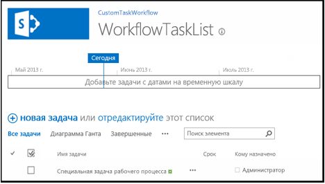
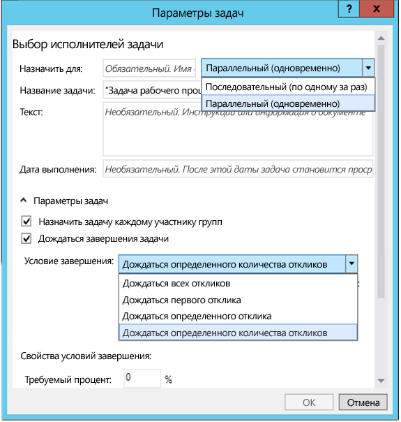
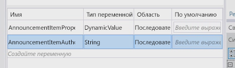
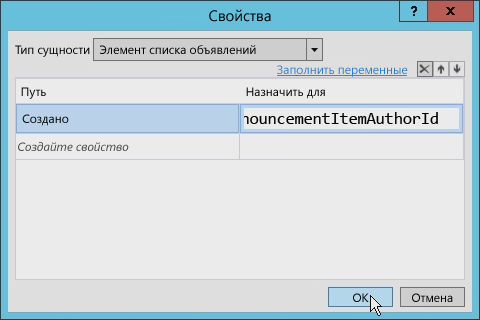
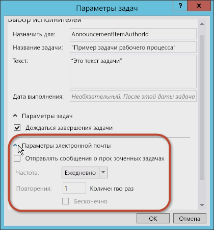
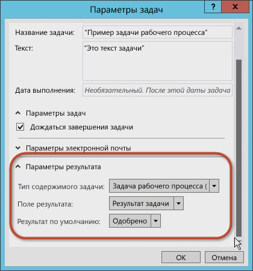
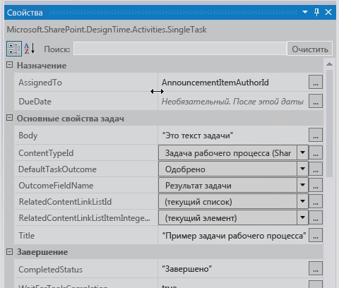
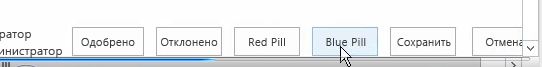
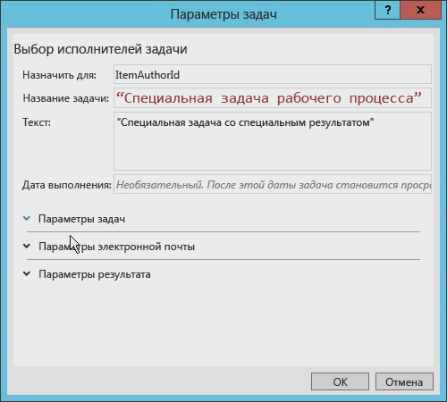
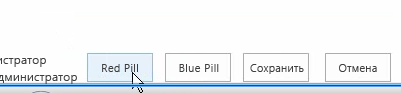

# <a name="working-with-tasks-in-sharepoint-workflows-using-visual-studio-2012"></a><span data-ttu-id="90051-102">Работа с задачами в рабочих процессах SharePoint с помощью Visual Studio 2012</span><span class="sxs-lookup"><span data-stu-id="90051-102">Working with Tasks in SharePoint Workflows using Visual Studio 2012</span></span>
<span data-ttu-id="90051-p101">Сведения о новой и измененной платформе задач рабочего процесса, представленной в SharePoint на базе новой версии Workflow Manager. **Кто предоставил:** [Эндрю Коннелл](http://social.msdn.microsoft.com/profile/andrew%20connell%20%5bmvp%5d/),  [AndrewConnell.com](http://www.andrewconnell.com)</span><span class="sxs-lookup"><span data-stu-id="90051-p101">Learn about the new and revised workflow task framework that was introduced in SharePoint, which is built on the new Workflow Manager. **Provided by:** [Andrew Connell](http://social.msdn.microsoft.com/profile/andrew%20connell%20%5bmvp%5d/),  [AndrewConnell.com](http://www.andrewconnell.com)</span></span>
  
> [!NOTE] 
> <span data-ttu-id="90051-105">К этой статье прилагается пример законченного кода, который можно просматривать во время чтения или брать за основу при создании собственных проектов рабочих процессов SharePoint.</span><span class="sxs-lookup"><span data-stu-id="90051-105">This article is accompanied by an end-to-end code sample that you can use to follow the article, or as a starter for your own SharePoint workflow projects. You can find the downloadable code here: LINK.</span></span> <span data-ttu-id="90051-106">Код можно скачать [здесь](http://assets.andrewconnell.com/media/Default/Downloads/SP2013Wf-CustomTasks.zip).</span><span class="sxs-lookup"><span data-stu-id="90051-106">You can find the downloadable code  [here](http://assets.andrewconnell.com/media/Default/Downloads/SP2013Wf-CustomTasks.zip).</span></span> 
    
<span data-ttu-id="90051-107">Одно из крупнейших преимуществ SharePoint для Windows Workflow Foundation  реализация новой и улучшенной платформы управления задачами, которая включает в себя новую версию Workflow Manager как среду внешнего размещения.</span><span class="sxs-lookup"><span data-stu-id="90051-107">One of the greatest benefits that the SharePoint brings to Windows Workflow Foundation is the implementation of a new and improved task management framework that incorporates the new Workflow Manager as its hosting environment.</span></span>
## <a name="reviewing-workflow-tasks-in-sharepoint-2007-and-sharepoint-2010"></a><span data-ttu-id="90051-108">Просмотр задач рабочего процесса в SharePoint 2007 и SharePoint 2010</span><span class="sxs-lookup"><span data-stu-id="90051-108">Reviewing workflow tasks in SharePoint 2007 and SharePoint 2010</span></span>

<span data-ttu-id="90051-p103">В SharePoint 2007 и SharePoint 2010 задачи рабочего процесса реализованы аналогичным образом. Создавая сопоставление рабочего процесса для списка, типа контента или сайта (в SharePoint 2010), вы назначали определенный список как расположение, где будут создаваться задачи рабочего процесса. Этот список был стандартным списком **Task** (ID = 107) в SharePoint, для которого использовался стандартный тип контента **Task** (ID = 0x0108) в SharePoint. После этого пользователи могли получить доступ к элементам списка, чтобы просматривать, редактировать и выполнять задачу. Экземпляры рабочих процессов отслеживали обновления для элементов задач в списке, если рабочий процесс был настроен соответственно.</span><span class="sxs-lookup"><span data-stu-id="90051-p103">Both SharePoint 2007 and SharePoint 2010 implemented workflow tasks in a similar manner. When you created a workflow association on a list, content type, or site (in SharePoint 2010), you designated a specific list as the location where the workflow tasks would be created. This list was a standard SharePoint **Task** list (ID = 107) that used the standard SharePoint **Task** content type (ID = 0x0108). Users then could access items in the list to view, edit, and complete the task. The workflow instances monitored the task items in the list for updates if the workflow was configured to do so.</span></span>
  
    
    
<span data-ttu-id="90051-p104">Однако отрисовка формы задачи по умолчанию в SharePoint была предварительно определена даже для настраиваемых рабочих процессов. Чтобы можно было использовать все возможности, при создании настраиваемых форм для выполнения задач нужны были  [веб-формы](http://www.asp.net/web-forms)ASP.NET или  [формы InfoPath](http://msdn.microsoft.com/ru-RU/library/ms540731%28v=office.14%29.aspx).</span><span class="sxs-lookup"><span data-stu-id="90051-p104">However, the default rendering of the task form in SharePoint was pre-determined, even for custom workflows. For full flexibility, you needed to use ASP.NET [Web Forms](http://www.asp.net/web-forms) or [InfoPath Forms](http://msdn.microsoft.com/ru-RU/library/ms540731%28v=office.14%29.aspx) when you created custom form solutions to support your tasks.</span></span>
  
    
    

## <a name="whats-new-with-tasks-in-sharepoint"></a><span data-ttu-id="90051-116">Что нового в задачах SharePoint</span><span class="sxs-lookup"><span data-stu-id="90051-116">What's new with tasks in SharePoint</span></span>

<span data-ttu-id="90051-117">Результатом изменения архитектуры SharePoint стал другой способ создания и обработки задач в SharePoint, а также управления ними.</span><span class="sxs-lookup"><span data-stu-id="90051-117">The manner in which tasks are created, managed, and handled in SharePoint has changed due to changes in the SharePoint architecture.</span></span>
  
    
    
<span data-ttu-id="90051-p105">Главное изменение коснулось рабочих процессов  для их обработки и управления ними больше не используется SharePoint. Вместо этого в SharePoint используется новый компонент, Workflow Manager, который запускается извне. В Workflow Manager размещается среда выполнения Windows Workflow Foundation и необходимые для Windows Workflow Foundation службы. Когда публикуется рабочий процесс или запускается новый экземпляр опубликованного рабочего процесса, SharePoint оповещает Workflow Manager, и в результате ведется обработка этапов опубликованного рабочего процесса. Когда рабочему процессу необходимо получить доступ к информации в SharePoint, например свойствам элементов списка или свойствам пользователей, выполняется его аутентификация по стандарту OAuth. После этого он опять обращается к SharePoint через вызовы веб-службы с помощью элементов API REST.</span><span class="sxs-lookup"><span data-stu-id="90051-p105">The central change is that workflows are no longer managed and processed inside of SharePoint. Instead, SharePoint utilizes a new component called Workflow Manager, which runs externally. Workflow Manager hosts the Windows Workflow Foundation runtime and necessary services required by the Windows Workflow Foundation. When a workflow is published or a new instance of a published workflow is started, SharePoint notifies Workflow Manager, which in turn processes the workflow episodes. When a workflow needs to access information in SharePoint, such as list item properties or user properties, it authenticates itself using the OAuth and talks back to SharePoint with web service calls using the REST APIs.</span></span>
  
    
    
<span data-ttu-id="90051-p106">Кроме того, изменилась тенденция индивидуальной настройки платформы SharePoint в SharePoint, хотя эти изменения начались еще с внедрения изолированные решения в SharePoint 2010. Корпорация Майкрософт SharePoint внесла нововведения, благодаря которым настройка выполняется не в SharePoint Server, а в браузере клиента или на внешних ресурсах. Эти изменения включают новую модель приложений SharePoint, возможность назначать удостоверение приложения, аутентификацию по стандарту OAuth, улучшения клиентской объектной модели (CSOM) и использование элементов API REST.</span><span class="sxs-lookup"><span data-stu-id="90051-p106">The overall customization trend for the SharePoint platform also changed in SharePoint, although this change started with the implementation of sandboxed solutions in SharePoint 2010. In SharePoint, Microsoft introduced changes that moved customizations off of SharePoint Server and onto either to the client's browser or to external resources. These changes include the new SharePoint app model, support for assigning app identity, authentication using OAuth, improvements to the client-side object model (CSOM), and the REST APIs.</span></span>
  
    
    

## <a name="architectural-changes-to-workflow-tasks-in-sharepoint"></a><span data-ttu-id="90051-126">Изменения архитектуры, связанные с задачами рабочих процессов в SharePoint</span><span class="sxs-lookup"><span data-stu-id="90051-126">Architectural changes to workflow tasks in SharePoint</span></span>

<span data-ttu-id="90051-p107">Изменения архитектуры SharePoint повлияли на задачи рабочих процессов в основном незначительно. Исключение  работа с настраиваемыми формами задач. Раньше такие формы создавались с помощью InfoPath или веб-форм ASP.NET. А теперь SharePoint использует форму по умолчанию для отрисовки элементов списка в случае задач рабочего процесса.</span><span class="sxs-lookup"><span data-stu-id="90051-p107">How do the architectural changes in SharePoint affect workflow tasks? For workflow tasks, the impact is not significant except when you are working with custom task forms. In the past, you created task forms using InfoPath or ASP.NET Web Forms. SharePoint, on the other hand, uses the default list item rendering form for workflow tasks.</span></span> 
  
    
    
<span data-ttu-id="90051-p108">Иногда вам может понадобиться настроить внешний вид или поведение полей задач. Чтобы сделать это, создайте тип контента настраиваемой задачи, содержащий столбец сайта. Затем для столбца сайта можно будет использовать новую платформу отрисовки в SharePoint на стороне клиента. Для этого потребуется создать файл JavaScript, определяющий внешний вид и поведение этого поля в браузере.</span><span class="sxs-lookup"><span data-stu-id="90051-p108">You may sometimes need to customize the appearance or the behavior of task fields. To do this, create a custom task content type that contains a site column. The site column can then use the new client-side rendering framework in SharePoint, which requires creating a JavaScript file that defines how the field should look and act in the browser.</span></span> 
  
    
    
<span data-ttu-id="90051-134">Дополнительные сведения об отрисовке на стороне клиента см. в статье  [Инструкция. Настройка представления списка в приложениях для SharePoint с использованием способа отображения на стороне клиента](http://msdn.microsoft.com/ru-RU/library/jj220045.aspx).</span><span class="sxs-lookup"><span data-stu-id="90051-134">For more information about using client-side rendering, see  [How To Customize a List View in Apps for SharePoint Using Client-Side Rendering](http://msdn.microsoft.com/ru-RU/library/jj220045.aspx).</span></span>
  
    
    
<span data-ttu-id="90051-p109">В основе отдельных элементов задачи лежат типы контента. Обратите внимание, что в типы контента SharePoint внесены некоторые изменения. В SharePoint 2007 и SharePoint 2010 задачи рабочих процессов создавались с помощью типа контента **Task** (ID = 0x0108). Это тот же тип контента, который позволяет вручную создавать задачи в списках задач, не связанные с рабочими процессами. В SharePoint на смену ему пришел новый тип контента, **Workflow Task (SharePoint)** (ID = 0x0108003365C4474CAE8C42BCE396314E88E51F), который указывает на то, что задачи будут использоваться только для рабочего процесса.</span><span class="sxs-lookup"><span data-stu-id="90051-p109">Individual task items are based on content types. Importantly, there are some changes to content types in SharePoint. In SharePoint 2007 and SharePoint 2010, workflow tasks were created with the **Task** content type (ID = 0x0108). This is the same content type that is used to manually create non-workflow tasks in the task lists. SharePoint changes this by introducing a new content type, **Workflow Task (SharePoint)** (ID = 0x0108003365C4474CAE8C42BCE396314E88E51F), which inherits from the Task content type and which indicates that the tasks are to be used only for workflow.</span></span>
  
    
    
<span data-ttu-id="90051-140">**Workflow Task** отличается от предыдущего типа контента **Task** тем, что в нем есть два новых столбца:</span><span class="sxs-lookup"><span data-stu-id="90051-140">This new **Workflow Task** content type differs from the earlier **Task** content type in that it has two new columns:</span></span>
  
    
    

- <span data-ttu-id="90051-p110">**WorkflowInstanceId**. Содержит ссылку на идентификатор экземпляра рабочего процесса, с помощью которого была создана задача. Она может отображаться, например, на странице состояния экземпляра рабочего процесса. На этой странице такое поле может использоваться для запрашивания всех элементов из сопоставленного списка задач рабочего процесса, столбцы **WorkflowInstanceId** которых содержат указанный идентификатор.</span><span class="sxs-lookup"><span data-stu-id="90051-p110">**WorkflowInstanceId**: Contains a reference to the workflow instance identifier that created the task, which is used in such places as the workflow instance status page. The status page can use this field to query the associated workflow task list for all list items whose **WorkflowInstanceId** column contains the specified ID.</span></span>
    
  
- <span data-ttu-id="90051-p111">**TaskOutcome**. Поле выбора в представлении формы задачи, которое позволяет пользователю выбрать различные параметры условий выполнения. Форма редактирования задач отображает указанные результаты задач рабочего процесса как кнопки внизу, рядом с кнопками **Сохранить** и **Отмена**. Рабочие процессы в SharePoint не ограничены только двумя параметрами **Approved** и **Rejected**, как показано на рисунке 1.</span><span class="sxs-lookup"><span data-stu-id="90051-p111">**TaskOutcome**: A choice field that is used in the presentation of the task form to allow the user to select different completion criteria options. The task edit form presents the specified workflow task outcomes as buttons at the bottom of the form, next to the **Save** and **Cancel** buttons. Workflows in SharePoint are not limited to just the two options **Approved** and **Rejected**, as shown in Figure 1.</span></span>
    
   <span data-ttu-id="90051-146">**Рисунок 1. Результаты задач рабочего процесса**</span><span class="sxs-lookup"><span data-stu-id="90051-146">**Figure 1. Workflow task outcomes**</span></span>

  

  
  

  

  
<span data-ttu-id="90051-p112">Конечно, типы контента  часть задач рабочего процесса. Типы контента просто задают структуру элементов в списке задач. Не менее важен шаблон списка задач, которого также коснулись изменения в SharePoint.</span><span class="sxs-lookup"><span data-stu-id="90051-p112">Of course, content types are a part of workflow tasks. Content types simply dictate the structure of the task list items. Equally important is the task list template, which has also changed in SharePoint.</span></span>
  
    
    
<span data-ttu-id="90051-p113">До появления SharePoint для списка задач рабочего процесса использовался тот же шаблон списка, что и для стандартного списка задач (ID = 107). Это был стандартный список задач SharePoint, который мог также содержать задачи, не относящиеся к рабочему процессу. Но с выходом SharePoint все изменилось  добавлен новый тип списка, иерархический список задач. Он обеспечивает отображение расписания задач благодаря представлению временной шкалы в верхней части страницы, как показано на рисунке 2. Кроме того, с его помощью пользователи могут просматривать зависимости задач.</span><span class="sxs-lookup"><span data-stu-id="90051-p113">Prior to SharePoint, the workflow task list used the same list template as the standard task list (ID = 107). It was a standard SharePoint task list that could also contain non-workflow tasks. But in SharePoint the approach is different in that it introduces a new type of a list. This list, called the hierarchy tasks list, introduces a timeline view at the top of the page to show the scheduling of tasks, as shown in Figure 2. Note that it also lets users view task dependencies.</span></span>
  
    
    

<span data-ttu-id="90051-156">**Рисунок 2. Иерархический список задач**</span><span class="sxs-lookup"><span data-stu-id="90051-156">**Figure 2. Hierarchy tasks list**</span></span>

  
    
    

  
    
    

  
    
    

  
    
    

  
    
    

## <a name="creating-workflow-task-options-in-sharepoint"></a><span data-ttu-id="90051-158">Создание параметров задач рабочего процесса в SharePoint</span><span class="sxs-lookup"><span data-stu-id="90051-158">Creating workflow task options in SharePoint</span></span>

<span data-ttu-id="90051-p114">В SharePoint Designer 2013 и Visual Studio 2012 авторы рабочего процесса могут создавать задачи для него двумя способами. Первый  создание одиночной задачи, которая назначается пользователю или группе. Второй  создание задачи и ее назначение нескольким пользователям. Создавая одиночную задачу в настраиваемом рабочем процессе с помощью Visual Studio 2012, используйте действие **SingleTask**. Оно позволит вам изменить свойства в окне инструментов **Свойства** или с помощью мастера, как показано на рисунке 3.</span><span class="sxs-lookup"><span data-stu-id="90051-p114">Both SharePoint Designer 2013 and Visual Studio 2012 provide workflow authors two ways to create workflow tasks. One is to create a single task that is assigned to a person or a group. The other is to create a task and assign it to multiple people. When creating a single task in a custom workflow using Visual Studio 2012, use the **SingleTask** activity. By using this activity, you can modify the properties either in the **Properties** tool window, or with the wizard, as shown in Figure 3.</span></span>
  
    
    

<span data-ttu-id="90051-164">**Рисунок 3. Мастер одиночных задач**</span><span class="sxs-lookup"><span data-stu-id="90051-164">**Figure 3. Single-task wizard**</span></span>

  
    
    

  
    
    

  
    
    
<span data-ttu-id="90051-p115">В SharePoint вы можете указать способ выполнения нескольких задач (по очереди или параллельно), а также условия их выполнения. Нужно ли, чтобы служба SharePoint ожидала завершения всех задач или какой-либо их части (в процентах) с указанным результатом? Чтобы создать несколько задач в Visual Studio 2012, используйте действие **CompositeTask**. По используемым свойствам и мастеру оно напоминает действие **SingleTask**, как показано на рисунке 4.</span><span class="sxs-lookup"><span data-stu-id="90051-p115">SharePoint lets you specify whether multiple tasks should run serially or in parallel, as well as specifying the criteria for task completion. Should SharePoint wait for all tasks to be completed, or for a percentage of them to be completed with a specific outcome? To create multiple tasks in Visual Studio 2012, use the **CompositeTask** activity, whose wizard and properties resemble the **SingleTask** activity, as shown in Figure 4.</span></span>
  
    
    

<span data-ttu-id="90051-169">**Рисунок 4. Мастер составных задач**</span><span class="sxs-lookup"><span data-stu-id="90051-169">**Figure 4. Composite task wizard**</span></span>

  
    
    

  
    
    

  
    
    

  
    
    

  
    
    

## <a name="how-to-create-and-assign-tasks-in-custom-workflows"></a><span data-ttu-id="90051-171">Инструкции. Создание и назначение задач в настраиваемых рабочих процессах</span><span class="sxs-lookup"><span data-stu-id="90051-171">How to: Create and assign tasks in custom workflows</span></span>

<span data-ttu-id="90051-p116">Ниже приведен обзор, в котором показано создание и назначение задач в настраиваемом рабочем процессе. Перед началом убедитесь, что у вас есть доступ к Сайту разработчика SharePoint.</span><span class="sxs-lookup"><span data-stu-id="90051-p116">Following is a walkthrough that demonstrates how to create and assign tasks in a custom workflow. Before starting, make sure that you have access to a SharePoint developer site.</span></span>
  
    
    

### <a name="1-create-a-new-sharepoint-app-project"></a><span data-ttu-id="90051-174">1. Создание нового проекта приложения SharePoint</span><span class="sxs-lookup"><span data-stu-id="90051-174">1. Create a new SharePoint app project</span></span>


1. <span data-ttu-id="90051-175">Создайте новый проект приложения SharePoint и настройте этот его как Надстройки, размещаемые в SharePoint.</span><span class="sxs-lookup"><span data-stu-id="90051-175">Create a new SharePoint app project and configure the project as a SharePoint-hosted add-in.</span></span>
    
  
2. <span data-ttu-id="90051-p117">Добавьте к этому проекту новый экземпляр списка **Announcement**, который будет использоваться как контейнер для элементов, использующихся для тестирования рабочего процесса.</span><span class="sxs-lookup"><span data-stu-id="90051-p117">To the project, add a new **Announcement** list instance to the project. This will be used as the container for items used to test the workflow.</span></span>
    
  
3. <span data-ttu-id="90051-178">Добавьте к проекту элемент рабочего процесса, щелкнув по значку проекта правой кнопкой мыши в **обозревателе решений** и последовательно выбрав элементы **Добавить** и **Новый элемент**.</span><span class="sxs-lookup"><span data-stu-id="90051-178">Add a workflow item the project by right-clicking the project icon in **Solution Explorer** and selecting **Add**, followed by **New Item**.</span></span>
    
  
4. <span data-ttu-id="90051-179">В диалоговом окне **Добавить новый элемент** выберите элемент проекта **Рабочий процесс** в категории **Office/SharePoint** и назовите его CustomTaskWorkflow, а затем нажмите кнопку **Далее**.</span><span class="sxs-lookup"><span data-stu-id="90051-179">In the **Add New Item** dialog box, select the **Workflow** project item from the **Office/SharePoint** category and name it "CustomTaskWorkflow", and then click **Next**.</span></span>
    
  

### <a name="2-collect-information-on-the-new-announcement-item"></a><span data-ttu-id="90051-180">2. Сбор сведений об элементе нового извещения</span><span class="sxs-lookup"><span data-stu-id="90051-180">2. Collect information on the New Announcement item</span></span>

<span data-ttu-id="90051-p118">В рабочем процессе создайте задачу и назначьте ее пользователю, создавшему элемент списка извещений, который запускает рабочий процесс. Этот элемент списка самостоятельно предоставит сведения для рабочего процесса. Используйте действие **LookupSPListItemProperties**, возвращающее динамическое значение из веб-службы REST, которую оно вызывает в SharePoint. После этого сохраните это значение в новой переменной с именем **AnnouncementItemProperties**, изменив тип ее данных на **DynamicValue**.</span><span class="sxs-lookup"><span data-stu-id="90051-p118">We are going to create a task in our workflow and assign it to the person who created the announcement list item that kicks off the workflow. The list item itself will provide the information to the workflow. We will use a **LookupSPListItemProperties** activity, which returns a dynamic value from the REST web service that it calls in SharePoint. We're then going to store this value in a new variable named **AnnouncementItemProperties**, whose data type we will change to **DynamicValue**.</span></span>
  
    
    

1. <span data-ttu-id="90051-185">Создайте переменную **AnnouncementItemAuthorId** для хранения идентификатора пользователя, создавшего элемент списка, как показано на рисунке 5.</span><span class="sxs-lookup"><span data-stu-id="90051-185">Create an **AnnouncementItemAuthorId** variable to store the ID of the person who created the list item, as shown in Figure 5.</span></span>
    
   <span data-ttu-id="90051-186">**Рисунок 5. Действие LookupSPListItemProperties**</span><span class="sxs-lookup"><span data-stu-id="90051-186">**Figure 5. LookupSPListItemProperties activity**</span></span>

  

  
  

  

  
2. <span data-ttu-id="90051-188">Перетащите действие **LookupSPListItem** в рабочую область конструирования рабочего процесса и задайте для свойства **ListID** значение _(current list)_.</span><span class="sxs-lookup"><span data-stu-id="90051-188">Drop the **LookupSPListItem** activity onto the workflow design surface and set the **ListID** property to _(current list)_.</span></span>
    
  
3. <span data-ttu-id="90051-189">Задайте для параметра **ItemId** значение _(current item)_.</span><span class="sxs-lookup"><span data-stu-id="90051-189">Set the **ItemId** to _(current item)_.</span></span>
    
  
4. <span data-ttu-id="90051-190">Задайте для результата **Result** переменную **AnnouncementItemProperties**, созданную ранее.</span><span class="sxs-lookup"><span data-stu-id="90051-190">Set the **Result** output to the **AnnouncementItemProperties** variable that we created earlier.</span></span>
    
  
5. <span data-ttu-id="90051-p119">Чтобы получить автора элемента из переменной, щелкните ссылку **Получить свойства** в области действия **LookupSPListItem** и добавьте действие **GetDynamicValueProperties** в рабочую область конструирования. Задайте для свойства **Source** результат действия **LookupSPListItem**.</span><span class="sxs-lookup"><span data-stu-id="90051-p119">To get the author of the item from the variable, click the **Get Properties** link in the **LookupSPListItem** activity and add a **GetDynamicValueProperties** activity to the design surface. Set its **Source** property to the output of the **LookupSPListItem** activity.</span></span>
    
  
6. <span data-ttu-id="90051-193">Нажмите кнопку **[...]** на свойстве **Properties**, чтобы открыть диалоговое окно **Свойства**.</span><span class="sxs-lookup"><span data-stu-id="90051-193">Click the **[???]** button on the **Properties** property to bring up the **Properties** dialog box.</span></span>
    
  
7. <span data-ttu-id="90051-194">В диалоговом окне **Свойства** измените значение **Тип сущности** на **Элемент списка объявлений**, как показано на рис. 6.</span><span class="sxs-lookup"><span data-stu-id="90051-194">In the **Properties** dialog box, change the **Entity Type** to **List Item of Announcements**, as shown in Figure 6.</span></span>
    
  
8. <span data-ttu-id="90051-195">Назначьте для свойства пути **Автор** переменную **AnnouncementItemAuthorId**, как показано на рисунке 6.</span><span class="sxs-lookup"><span data-stu-id="90051-195">Assign the **Created By** path to the variable **AnnouncementItemAuthorId**, as shown in Figure 6.</span></span>
    
   <span data-ttu-id="90051-196">**Рисунок 6. Диалоговое окно "Свойства"**</span><span class="sxs-lookup"><span data-stu-id="90051-196">**Figure 6. Properties dialog**</span></span>

  

  
  

  

  

### <a name="3-create-and-assign-the-task"></a><span data-ttu-id="90051-198">3. Создание и назначение задачи</span><span class="sxs-lookup"><span data-stu-id="90051-198">3. Create and Assign the task</span></span>

<span data-ttu-id="90051-199">На этом этапе можно создать и назначить задачу для автора элемента извещения.</span><span class="sxs-lookup"><span data-stu-id="90051-199">At this point we can create and assign the task to the author of the announcement item.</span></span>
  
    
    

1. <span data-ttu-id="90051-200">На панели инструментов добавьте действие **SingleTask** в рабочую область конструирования рабочего процесса.</span><span class="sxs-lookup"><span data-stu-id="90051-200">From the toolbox, add a **SingleTask** activity to the workflow design surface.</span></span>
    
  
2. <span data-ttu-id="90051-201">Щелкните ссылку **Настроить** в области действия, чтобы открыть диалоговое окно **Параметры задачи**.</span><span class="sxs-lookup"><span data-stu-id="90051-201">Click the **Configure** link in the activity to open the **Task Options** dialog box.</span></span>
    
  
3. <span data-ttu-id="90051-202">Задайте для свойства **Кому назначено** переменную, которая используется для хранения идентификатора автора.</span><span class="sxs-lookup"><span data-stu-id="90051-202">Set the **Assigned To** property to the variable used to store the author identifier.</span></span>
    
  
4. <span data-ttu-id="90051-203">Измените заголовок и описание задачи, как показано на рисунке 7.</span><span class="sxs-lookup"><span data-stu-id="90051-203">Modify the title and body of the task, as shown in Figure 7.</span></span>
    
   <span data-ttu-id="90051-204">**Рисунок 7. Диалоговое окно "Параметры задачи"**</span><span class="sxs-lookup"><span data-stu-id="90051-204">**Figure 7. Task Options dialog**</span></span>

  

  
  

  

  
<span data-ttu-id="90051-p120">В диалоговом окне **Параметры задачи** можно задать несколько других параметров. Например, можно настроить рабочий процесс так, чтобы он ожидал завершения задачи, просто установив флажок в этом окне (см. рисунок 7). Чтобы сделать это в предыдущих версиях SharePoint, требовались сложные обходные пути.</span><span class="sxs-lookup"><span data-stu-id="90051-p120">There are several other options that can be set in the **Task Options** dialog box. For example, you can set the workflow to wait for the task to complete by simply checking the box (see Figure 7). Previous versions of SharePoint workflows required a difficult workaround to accomplish this.</span></span>
  
    
    
<span data-ttu-id="90051-p121">Обратите внимание, что на рисунке 8 показаны параметры электронной почты, которые можно задать. Например, можно задать отправку электронных сообщений в случае просроченных задач, а также указать частоту отправки напоминаний.</span><span class="sxs-lookup"><span data-stu-id="90051-p121">Notice in Figure 8 the email options that you can set. Among other options, you can ensure that email messages are sent whenever the task is overdue as well as specifying how often the reminders are sent.</span></span> 
  
    
    

<span data-ttu-id="90051-211">**Рисунок 8. Параметры электронной почты**</span><span class="sxs-lookup"><span data-stu-id="90051-211">**Figure 8. Email Options settings**</span></span>

  
    
    

  
    
    

  
    
    
<span data-ttu-id="90051-p122">Можно также задать параметры результатов задачи. Выберите тип контента для задач рабочего процесса, а также значения для элементов **Поле результата** и **Результат по умолчанию**, как показано на рисунке 9.</span><span class="sxs-lookup"><span data-stu-id="90051-p122">You can also set the task outcome options. You can select the workflow task content type, the **Outcome Field**, and the **Default Outcome**, as shown in Figure 9.</span></span>
  
    
    

<span data-ttu-id="90051-215">**Рисунок 9. Параметры результатов**</span><span class="sxs-lookup"><span data-stu-id="90051-215">**Figure 9. Outcome Options settings**</span></span>

  
    
    

  
    
    

  
    
    

  
    
    

  
    
    

### <a name="4-examine-and-modify-the-task-properties"></a><span data-ttu-id="90051-217">4. Проверка и изменение свойств задачи</span><span class="sxs-lookup"><span data-stu-id="90051-217">4. Examine and modify the task properties</span></span>

<span data-ttu-id="90051-218">Задав значения в диалоговом окне **Параметры задачи**, выберите действие **SingleTask** и изучите сетку свойств **Свойства** (см. рисунок 10).</span><span class="sxs-lookup"><span data-stu-id="90051-218">Once you have accepted values in the **Task Options** dialog box, select the **SingleTask** activity and then inspect the **Properties** property grid (see Figure 10).</span></span>
  
    
    

<span data-ttu-id="90051-219">**Рисунок 10. Окно инструментов "Свойства"**</span><span class="sxs-lookup"><span data-stu-id="90051-219">**Figure 10. Properties tool window**</span></span>

  
    
    

  
    
    

  
    
    
<span data-ttu-id="90051-221">С помощью сетки свойств **Свойства** можно указать, нужно ли ожидать окончания задачи перед продолжением. Вы можете также настроить электронные сообщения, которые создаются при выполнении задачи, включая первоначальное электронное сообщение о назначении, сообщение о просроченной задаче и сообщение об отмене задачи.</span><span class="sxs-lookup"><span data-stu-id="90051-221">Using the **Properties** property grid, you can specify whether you want the task to wait for completion before proceeding, and you can configure the email messages that the task generates, including the initial assignment email message, the overdue email message, and the task cancellation email message.</span></span>
  
    
    
<span data-ttu-id="90051-p123">Обратите внимание, что свойство **Outcome** автоматически создало для задачи переменную с именем **outcome_0**. Чтобы увидеть содержимое этой переменной, добавьте действие **WriteToHistory** в рабочую область конструирования и обновите сообщение, чтобы записывался результат, как показано на рисунке 11.</span><span class="sxs-lookup"><span data-stu-id="90051-p123">Notice that the **Outcome** property automatically created a variable named **outcome_0** for the task. To see what is contained in this variable, add a **WriteToHistory** activity on the design surface and update the message to write out the result, as shown in Figure 11.</span></span>
  
    
    

<span data-ttu-id="90051-224">**Рисунок 11. Значение свойства Outcome**</span><span class="sxs-lookup"><span data-stu-id="90051-224">**Figure 11. Outcome property value**</span></span>

  
    
    

  
    
    

  
    
    

  
    
    

  
    
    

### <a name="5-test-the-workflow"></a><span data-ttu-id="90051-226">5. Тестирование рабочего процесса</span><span class="sxs-lookup"><span data-stu-id="90051-226">5. Test the workflow</span></span>

<span data-ttu-id="90051-227">Чтобы протестировать рабочий процесс:</span><span class="sxs-lookup"><span data-stu-id="90051-227">To test the workflow, do the following:</span></span>
  
    
    

1. <span data-ttu-id="90051-p124">Нажмите клавишу **F5**, чтобы создать и запустить, или кнопку **Начать** в Visual Studio 2012. Если вы тестируете локальную установку SharePoint, Visual Studio 2012 запускает служебную программу Test Service Host в Workflow Manager и выполняет развертывание рабочего процесса на Сайте разработчика. Через некоторое время откроется Сайт разработчика.</span><span class="sxs-lookup"><span data-stu-id="90051-p124">Press **F5** to build and run, or click the **Start** button in Visual Studio 2012. If you are testing in an on-premises installation of SharePoint, Visual Studio 2012 starts the Workflow Manager Test Service Host utility and deploys the workflow to the developer site. After a moment, the developer site opens.</span></span>
    
  
2. <span data-ttu-id="90051-231">Перейдите к списку **Извещения** и создайте элемент списка, а затем запустите настраиваемый рабочий процесс вручную.</span><span class="sxs-lookup"><span data-stu-id="90051-231">Navigate to the **Announcements** list and create a list item, then start the custom workflow manually.</span></span>
    
  
3. <span data-ttu-id="90051-p125">Вернитесь на страницу состояния экземпляра рабочего процесса, чтобы найти задачу, созданную рабочим процессом. Щелкните задачу, чтобы открыть форму. Обратите внимание на поля **Имя задачи** и **Кому назначено**, заданные в рабочем процессе, как показано на рисунке 12.</span><span class="sxs-lookup"><span data-stu-id="90051-p125">Return to the workflow instance status page to find the task that was created by the workflow. Click on the task to see the form. Note the **Task Name** and **Assigned To** fields that were defined in the workflow, as shown in Figure 12.</span></span>
    
   <span data-ttu-id="90051-235">**Рисунок 12. Форма задачи**</span><span class="sxs-lookup"><span data-stu-id="90051-235">**Figure 12. Task form**</span></span>

  

  
  

  

  
4. <span data-ttu-id="90051-p126">Вернитесь к задаче, отредактируйте форму и нажмите кнопку **Утвердить** или **Отклонить**, чтобы завершить задачу. Обратите внимание, что результат задачи для экземпляра рабочего процесса отображается в списке **Журнал рабочего процесса**, как показано на рисунке 13.</span><span class="sxs-lookup"><span data-stu-id="90051-p126">Finally, return to the task, edit the form, and then click the **Approve** or **Reject** to complete the task. Notice that the result of the task is shown in the **Workflow History** list for the workflow instance, as shown in Figure 13.</span></span>
    
   <span data-ttu-id="90051-239">**Рисунок 13. Список "Журнал рабочего процесса"**</span><span class="sxs-lookup"><span data-stu-id="90051-239">**Figure 13. Workflow History list**</span></span>

  

  
  

  

  

## <a name="how-to-create-a-custom-task-type-with-a-custom-outcome"></a><span data-ttu-id="90051-241">Инструкции. Создание настраиваемого типа задачи с настраиваемым результатом</span><span class="sxs-lookup"><span data-stu-id="90051-241">How to: Create a custom task type with a custom outcome</span></span>

<span data-ttu-id="90051-p127">В предыдущем обзоре было описано, как создать простую задачу и настроить ее свойства. Однако иногда параметры по умолчанию могут не отвечать вашим потребностям. Возьмем, к примеру, задачу, в которой от кого-то требуется просмотреть документ. После рассмотрения чернового варианта документа рецензент должен выполнить одно из двух действий: отправить документ назад автору на доработку или переслать документ редактору. К сожалению, ни один из параметров по умолчанию ( **Утвердить** или **Отклонить**) не отвечает потребностям рецензента. Здесь бы больше подошли параметры "Вернуть автору" или "Переслать редактору".</span><span class="sxs-lookup"><span data-stu-id="90051-p127">The previous walkthrough demonstrated how to create a simple task and configure its properties. However, sometimes the default options may not meet your needs. For example, consider a task that asks someone to review a document. Upon reviewing the draft document, the reviewer should exercise one of two options: send the draft document back to the author for revision, or forward the document to the editor. Unfortunately, neither of the default options ( **Approved** and **Rejected**) meets the reviewers needs. More appropriate options would be "Return to Author" and "Proceed to Editor".</span></span>
  
    
    
<span data-ttu-id="90051-p128">При создании рабочих процессов с помощью SharePoint Designer 2013 или Visual Studio 2012 можно создать настраиваемые задачи рабочего процесса, в которые входят настраиваемые результаты задач. Для этого создайте настраиваемую задачу как отдельный тип контента, а затем добавьте настраиваемый столбец сайта, в котором определены желаемые результаты. Настраиваемый столбец можно получить из типа поля с именем **OutcomeChoice** (поля выбора).</span><span class="sxs-lookup"><span data-stu-id="90051-p128">When creating workflows using either SharePoint Designer 2013 or Visual Studio 2012 you can create custom workflow tasks that include custom task outcomes. To do this, you create a custom task as a special content type and then add a custom site column that defines the outcomes you desire. You can derive the custom column from the field type called **OutcomeChoice**, which is a choice field.</span></span>
  
    
    
<span data-ttu-id="90051-p129">Однако такой подход может вызвать затруднение. Оно связано с тем, настраиваемая задача создается на основе типа контента **Workflow Task (SharePoint)**, включающего столбец сайта **TaskOutcome** по умолчанию с параметрами **Утверждено** и **Отклонено**. Однако этот параметр по умолчанию можно обойти, удалив столбец **TaskOutcome** из типа контента настраиваемой задачи и убедившись в его отсутствии в списке задач рабочего процесса. Иначе будут отображаться несколько параметров. Возьмем, к примеру, настраиваемый результат, в котором два параметра: "Реальные данные" и "Желаемые данные". Если не удалить результат по умолчанию, то пользователи, выполняющие эту задачу, увидят все доступные параметры результата, как показано на рисунке 14, даже если они неприменимы.</span><span class="sxs-lookup"><span data-stu-id="90051-p129">This approach can pose a challenge, however, in that the content type that the custom task is derived from is the **Workflow Task (SharePoint)** content type, which includes the default **TaskOutcome** site column that contains the **Approved** and **Rejected** options. However, you can work around the default setting by removing the **TaskOutcome** column from the custom task content type and ensure it is not present in the workflow task list. Otherwise, it would result in showing multiple options. For example, consider a custom outcome that had two options, "Red Pill" and "Blue Pill." If the default outcome is not removed, then the users completing the task would be presented with all available outcome options, as shown in Figure 14, even if those outcome options do not apply.</span></span>
  
    
    

<span data-ttu-id="90051-256">**Рисунок 14. Параметры результата**</span><span class="sxs-lookup"><span data-stu-id="90051-256">**Figure 14. Outcome options**</span></span>

  
    
    

  
    
    

  
    
    
<span data-ttu-id="90051-258">Рекомендуем для каждого типа создаваемой задачи создать свой список задач рабочего процесса.</span><span class="sxs-lookup"><span data-stu-id="90051-258">As a best practice, you want to create a different workflow task list for each type of task that you create.</span></span> 
  
    
    

### <a name="create-a-sharepoint-app-project"></a><span data-ttu-id="90051-259">Создание проекта приложения SharePoint</span><span class="sxs-lookup"><span data-stu-id="90051-259">Create a SharePoint app project</span></span>

<span data-ttu-id="90051-260">Прежде чем приступать к пошаговому руководству по созданию настраиваемой задачи рабочего процесса с помощью Visual Studio 2012, получите доступ к Сайту разработчика SharePoint.</span><span class="sxs-lookup"><span data-stu-id="90051-260">To begin the walkthrough for creating a custom workflow task using Visual Studio 2012, you first want to ensure that you have access to a SharePoint developer site.</span></span> 
  
    
    

1. <span data-ttu-id="90051-261">В Visual Studio 2012 создайте проект приложения SharePoint, настроенный как Надстройки, размещаемые в SharePoint.</span><span class="sxs-lookup"><span data-stu-id="90051-261">In Visual Studio 2012, create a new SharePoint app project that is configured as a SharePoint-hosted add-in.</span></span>
    
  
2. <span data-ttu-id="90051-p130">Добавьте к этому проекту новый экземпляр списка **Announcement**. Вы будете использовать его как контейнер для элементов, позволяющих протестировать рабочий процесс.</span><span class="sxs-lookup"><span data-stu-id="90051-p130">To the project, add a new **Announcement** list instance. You will use this as the container for items used to test the workflow.</span></span>
    
  
3. <span data-ttu-id="90051-264">Добавьте к проекту элемент рабочего процесса, щелкнув по значку проекта правой кнопкой мыши в **обозревателе решений** и последовательно выбрав элементы **Добавить** и **Новый элемент**.</span><span class="sxs-lookup"><span data-stu-id="90051-264">Next, add a workflow item the project by right-clicking the project icon in the **Solution Explorer** and selecting **Add**, followed by **New Item**.</span></span>
    
  
4. <span data-ttu-id="90051-265">В диалоговом окне **Добавить новый элемент** выберите элемент проекта **Рабочий процесс** в категории **Office/SharePoint** и назовите его CustomTaskWorkflow, а затем нажмите кнопку **Далее**.</span><span class="sxs-lookup"><span data-stu-id="90051-265">In the **Add New Item** dialog box, select the **Workflow** project item from the **Office/SharePoint** category and name it "CustomTaskWorkflow"; then click **Next**.</span></span>
    
  

### <a name="create-the-custom-outcome-column"></a><span data-ttu-id="90051-266">Создание столбца настраиваемого результата</span><span class="sxs-lookup"><span data-stu-id="90051-266">Create the custom outcome column</span></span>

<span data-ttu-id="90051-267">Создав список **Announcements**, создайте настраиваемый тип контента, содержащий настраиваемую задачу и столбец сайта для поля настраиваемого результата.</span><span class="sxs-lookup"><span data-stu-id="90051-267">Once we have the **Announcements** list created, we next want to create the custom content type that will contain the custom task and the site column for the custom outcome field.</span></span>
  
    
    

1. <span data-ttu-id="90051-268">Щелкните проект правой кнопкой мыши и последовательно выберите элементы **Добавить** и **Новый элемент**.</span><span class="sxs-lookup"><span data-stu-id="90051-268">Right-click the project and select **Add**, followed by **New Item**.</span></span>
    
  
2. <span data-ttu-id="90051-p131">Выберите шаблон элемента проекта **Столбец сайта** и задайте для имени этого поля значение CustomOutcomeColumn. В шаблон столбца сайта не нужно вносить много изменений.</span><span class="sxs-lookup"><span data-stu-id="90051-p131">Now choose the **Site Column** project item template and set the name of this field to "CustomOutcomeColumn". Within the template for the site column there are a few changes that need to be made.</span></span>
    
  
3. <span data-ttu-id="90051-271">Задайте типу поля для столбца значение **OutcomeChoice** (обязательный для заполнения тип поля для столбца результата).</span><span class="sxs-lookup"><span data-stu-id="90051-271">Set the field type of the column to **OutcomeChoice**, which is the required field type for an outcome column.</span></span>
    
  
4. <span data-ttu-id="90051-272">Удалите столбец **Обязательно**.</span><span class="sxs-lookup"><span data-stu-id="90051-272">Remove the **Required** column.</span></span>
    
  
5. <span data-ttu-id="90051-273">Так как в основе типа поля **OutcomeChoice** лежит тип поля выбора, вы можете добавить несколько своих вариантов.</span><span class="sxs-lookup"><span data-stu-id="90051-273">Next, because the **OutcomeChoice** field type is based on the choice field type, add a few choices of your own.</span></span>
    
  
<span data-ttu-id="90051-274">Ниже приведена разметка нового настраиваемого столбца сайта.</span><span class="sxs-lookup"><span data-stu-id="90051-274">The new custom site column markup should now look like the following:</span></span>
  
    
    


```XML

<?xml version="1.0" encoding="utf-8"?>
<Elements xmlns="http://schemas.microsoft.com/sharepoint/">  
  <Field
       ID="{7b7edd9e-f5d1-4558-a2c8-e733dcfb0a5e}"
       Name="CustomSiteColumn"
       DisplayName="Better State"
       Type="OutcomeChoice"
       Required="FALSE"
       Group="Custom Site Columns">
       <CHOICES>
         <CHOICE>Florida</CHOICE>
         <CHOICE>Georgia</CHOICE>
       </CHOICES>
       <Default>Florida</Default>
  </Field>
</Elements>
```


### <a name="create-a-custom-task-content-type"></a><span data-ttu-id="90051-275">Создание типа контента настраиваемой задачи</span><span class="sxs-lookup"><span data-stu-id="90051-275">Create a custom task content type</span></span>

<span data-ttu-id="90051-276">Создав столбец сайта, создайте специальный тип контента для настраиваемой задачи.</span><span class="sxs-lookup"><span data-stu-id="90051-276">After creating the site column, the next step is to create a specialized content type for the custom task.</span></span>
  
    
    

1. <span data-ttu-id="90051-277">Добавьте элемент проекта нового типа контента в проект с именем **CustomTaskContentType**.</span><span class="sxs-lookup"><span data-stu-id="90051-277">Add a new content type project item to the project with the name **CustomTaskContentType**.</span></span>
    
  
2. <span data-ttu-id="90051-278">Когда отобразится запрос о выборе типа контента в качестве основы, выберите **Workflow Task (SharePoint)**.</span><span class="sxs-lookup"><span data-stu-id="90051-278">When prompted to select which content type this is based on, select the **Workflow Task (SharePoint)** content type.</span></span>
    
  
3. <span data-ttu-id="90051-279">Затем добавьте столбец настраиваемого результата к списку доступных столбцов и удалите столбец результата по умолчанию, чтобы разметка типа контента выглядела так, как показано ниже.</span><span class="sxs-lookup"><span data-stu-id="90051-279">Next, add the custom outcome column to the list of available columns and also remove the default outcome column so the markup of the content type looks like the following example.</span></span>
    
```XML
  
<?xml version="1.0" encoding="utf-8"?>
<Elements xmlns="http://schemas.microsoft.com/sharepoint/">
  <!-- Parent ContentType: Workflow Task (SharePoint) (0x0108003365C4474CAE8C42BCE396314E88E51F) -->
  <ContentType 
      ID="0x0108003365C4474CAE8C42BCE396314E88E51F00D368DFB2B31A447BB184BA1334E5119E" 
      Name="CustomContentType" 
      Group="Custom Content Types" 
      Description="My Content Type" 
      Inherits="TRUE" Version="0">
      <FieldRefs>
         <FieldRef 
            ID="{7b7edd9e-f5d1-4558-a2c8-e733dcfb0a5e}" 
            DisplayName="Better State" 
            Required="FALSE" 
            Name="CustomSiteColumn" />
            <RemoveFieldRef 
               ID="{55B29417-1042-47F0-9DFF-CE8156667F96}" 
               Name="TaskOutcome" />
      </FieldRefs>
  </ContentType>
</Elements>
```


### <a name="create-a-workflow"></a><span data-ttu-id="90051-280">Создание рабочего процесса</span><span class="sxs-lookup"><span data-stu-id="90051-280">Create a workflow</span></span>

<span data-ttu-id="90051-281">Теперь создайте рабочий процесс, чтобы протестировать настраиваемый столбец сайта и тип контента.</span><span class="sxs-lookup"><span data-stu-id="90051-281">Now we create a workflow so we can test the custom site column and content type.</span></span> 
  
    
    

1. <span data-ttu-id="90051-282">Добавьте рабочий процесс к проекту и настройте его как рабочий процесс списка.</span><span class="sxs-lookup"><span data-stu-id="90051-282">Add a workflow to our project configure it to be a list workflow.</span></span>
    
  
2. <span data-ttu-id="90051-283">Добавьте сопоставление с этим рабочим процессом, используя ранее созданный список **Извещения**.</span><span class="sxs-lookup"><span data-stu-id="90051-283">Create an association with this workflow using the **Announcements** list that we created earlier.</span></span>
    
  
3. <span data-ttu-id="90051-284">Создайте новую переменную типа **DynamicValue** и назовите ее ItemProperties. Мы будем использовать эту переменную для хранения элемента, который запускает свойства рабочего процесса.</span><span class="sxs-lookup"><span data-stu-id="90051-284">Create a new variable of type **DynamicValue** and name it "ItemProperties"; we are going to use this variable to store the item that kicks off the workflow's properties.</span></span>
    
  
4. <span data-ttu-id="90051-285">Создайте переменную **Int32** и назовите ее ItemAuthorId, как показано на рисунке 15.</span><span class="sxs-lookup"><span data-stu-id="90051-285">Create an **Int32** variable and name it "ItemAuthorId", as shown in Figure 15.</span></span>
    
   <span data-ttu-id="90051-286">**Рисунок 15. Создание переменной рабочего процесса**</span><span class="sxs-lookup"><span data-stu-id="90051-286">**Figure 15. Creating a workflow variable**</span></span>

  

  
  

  

  

### <a name="collect-the-list-item-properties"></a><span data-ttu-id="90051-288">Сбор свойств элементов списка</span><span class="sxs-lookup"><span data-stu-id="90051-288">Collect the list item properties</span></span>

<span data-ttu-id="90051-289">Теперь соберите свойства элементов списка.</span><span class="sxs-lookup"><span data-stu-id="90051-289">Now we collect the list item properties.</span></span>
  
    
    

1. <span data-ttu-id="90051-290">Перетащите действие **LookupSPListItem** в рабочую область конструирования и задайте для свойства **ListID** значение _(current list)_, а для свойства **ItemId**  значение _(current item)_.</span><span class="sxs-lookup"><span data-stu-id="90051-290">Drop the **LookupSPListItem** activity onto the design surface and set the **ListID** property to _(current list)_ and the **ItemId** property to _(current item)_.</span></span> 
    
  
2. <span data-ttu-id="90051-291">Далее задайте для результата **Result** переменную **ItemProperties** **DynamicValue**, созданную ранее.</span><span class="sxs-lookup"><span data-stu-id="90051-291">Now set the **Result** output to the **ItemProperties** **DynamicValue** variable that we created a moment ago.</span></span>
    
  
3. <span data-ttu-id="90051-292">Чтобы получить автора элемента из переменной, щелкните ссылку **Получить свойства** в области действия **LookupSPListItem** и добавьте действие **GetDynamicValueProperties** в рабочую область конструирования.</span><span class="sxs-lookup"><span data-stu-id="90051-292">To get the author of the item from the variable, click the **Get Properties** link in the **LookupSPListItem** activity and add a **GetDynamicValueProperties** activity on the design surface.</span></span>
    
  
4. <span data-ttu-id="90051-293">Задайте для свойства **Source** выходное значение действия **LookupSPListItem**.</span><span class="sxs-lookup"><span data-stu-id="90051-293">Set the item's **Source** property to the output of the **LookupSPListItem** activity automatically.</span></span>
    
  
5. <span data-ttu-id="90051-294">Нажмите кнопку **[…]** на свойстве **Properties**, чтобы открыть диалоговое окно **Свойства**.</span><span class="sxs-lookup"><span data-stu-id="90051-294">Click the **[???]** button on the **Properties** property to display the **Properties** dialog box.</span></span>
    
  
6. <span data-ttu-id="90051-295">Задайте для поля **Entity Type** значение **List Item of Announcements**, чтобы создать контекст для диалогового окна, и назначьте для свойства пути **Created By** переменную **ItemAuthorId**, как показано на рисунке 16.</span><span class="sxs-lookup"><span data-stu-id="90051-295">Change the **Entity Type** to **List Item of Announcements** to give the dialog box a context and assign the **Created By** path to the variable **ItemAuthorId**, as shown in Figure 16.</span></span>
    
   <span data-ttu-id="90051-296">**Рисунок 16. Диалоговое окно "Свойства"**</span><span class="sxs-lookup"><span data-stu-id="90051-296">**Figure 16. Properties dialog**</span></span>

  

  
  

  

  

### <a name="create-a-single-task"></a><span data-ttu-id="90051-298">Создание одиночной задачи</span><span class="sxs-lookup"><span data-stu-id="90051-298">Create a single task</span></span>

<span data-ttu-id="90051-299">Теперь можно создать одиночную задачу.</span><span class="sxs-lookup"><span data-stu-id="90051-299">Now we can create the single task.</span></span> 
  
    
    

1. <span data-ttu-id="90051-300">Добавьте действие **SingleTask** в рабочую область конструирования.</span><span class="sxs-lookup"><span data-stu-id="90051-300">Add a **SingleTask** activity to the design surface.</span></span>
    
  
2. <span data-ttu-id="90051-301">Щелкните ссылку **Настроить** в области действия, чтобы открыть диалоговое окно **Параметры задачи**.</span><span class="sxs-lookup"><span data-stu-id="90051-301">Click the **Configure** link in the activity to open the **Task Options** dialog box.</span></span>
    
  
3. <span data-ttu-id="90051-302">Введите для поля **Основная часть** любую строку, а затем задайте для свойства **Кому назначено** переменную, которая используется для хранения идентификатора автора (в нашем случае это **ItemAuthorId**).</span><span class="sxs-lookup"><span data-stu-id="90051-302">Set the **Body** field to some string (it doesn't matter what), then set the **Assigned To** property to the variable you are using to store the author identifier (in our case, **ItemAuthorId**).</span></span>
    
  
4. <span data-ttu-id="90051-303">Измените заголовок задачи, как показано на рисунке 17.</span><span class="sxs-lookup"><span data-stu-id="90051-303">Change the title of the task, as shown in Figure 17.</span></span>
    
   <span data-ttu-id="90051-304">**Рисунок 17. Определение заголовка задачи**</span><span class="sxs-lookup"><span data-stu-id="90051-304">**Figure 17. Task Title setting**</span></span>

  

  
  

  

  
5. <span data-ttu-id="90051-306">Настройте раздел **Параметры результата** так, чтобы использовать новый настраиваемый тип контента и столбец настраиваемого результата.</span><span class="sxs-lookup"><span data-stu-id="90051-306">Finally, set the **Outcome Options** to use the new custom content type and custom outcome column.</span></span>
    
    <span data-ttu-id="90051-307">В этом диалоговом окне определяются доступные варианты с учетом всех типов контента, созданных на основе типа контента **Workflow Task (SharePoint)**, как показано на рисунке 18.</span><span class="sxs-lookup"><span data-stu-id="90051-307">The dialog box determines what is available by looking at all the content types that are derived from the **Workflow Task (SharePoint)** content type, as shown in Figure 18.</span></span>
    

   <span data-ttu-id="90051-308">**Рисунок 18. Настройки раздела "Параметры результата"**</span><span class="sxs-lookup"><span data-stu-id="90051-308">**Figure 18. Outcome Options settings**</span></span>

  

  
  

  

  

### <a name="update-the-assignedto-field"></a><span data-ttu-id="90051-310">Обновление поля AssignedTo</span><span class="sxs-lookup"><span data-stu-id="90051-310">Update the AssignedTo field</span></span>

<span data-ttu-id="90051-p132">Чтобы продолжить, обновите поле **AssignedTo** для действия **SingleTask**, так как пока в него можно ввести строку, а не целое число. Чтобы исправить это, добавьте **ToString()** в конце выражения.</span><span class="sxs-lookup"><span data-stu-id="90051-p132">Before we go any further, we need to update the **AssignedTo** field on the **SingleTask** activity because it is expecting a string, not an integer. To remedy this, add **ToString()** to the end of the expression.</span></span>
  
    
    
<span data-ttu-id="90051-p133">Кроме того, обратите внимание, что свойство **Outcome** автоматически создало переменную с именем **outcome_0**. Чтобы увидеть содержимое переменной, добавьте действие **WriteToHistory** в рабочую область конструирования и обновите сообщение для отображения результата.</span><span class="sxs-lookup"><span data-stu-id="90051-p133">Also, notice that the **Outcome** property automatically created a variable named **outcome_0**. To see what is in this variable, add a **WriteToHistory** activity on the design surface and update the message to write out the result.</span></span>
  
    
    

### <a name="update-the-workflow-task-list"></a><span data-ttu-id="90051-315">Обновление списка задач рабочего процесса</span><span class="sxs-lookup"><span data-stu-id="90051-315">Update the workflow task list</span></span>

<span data-ttu-id="90051-p134">Последний этап  настройка списка задач рабочего процесса. По умолчанию список задач, создаваемый приложением, допускает только тип контента **Workflow Task (SharePoint)**. Этот рабочий процесс использует настраиваемый тип контента для настраиваемого результата. Откройте файл  `Elements.xml` для списка задач рабочего процесса и измените атрибут **ContentTypeId** для элемента **<ContentTypeBinding>** так, чтобы он соответствовал типу контента в проекте, как показано в примере кода ниже.</span><span class="sxs-lookup"><span data-stu-id="90051-p134">The final step is to configure the workflow task list. By default, the task list that the app creates only accepts the content type **Workflow Task (SharePoint)**. This workflow uses a custom content type for the custom outcome. Open the  `Elements.xml` file for the workflow task list and change the **<ContentTypeBinding>** element's **ContentTypeId** attribute to match the content type in the project, as shown in the code example following.</span></span>
  
    
    

```XML

<?xml version="1.0" encoding="utf-8" ?>
<Elements xmlns="http://schemas.microsoft.com/sharepoint/">
  <ListInstance 
      FeatureId="{f9ce21f8-f437-4f7e-8bc6-946378c850f0}"
      TemplateType="171"
      Title="WorkflowTaskList"
      Description="This list instance is used for workflow Task items."
      Url="Lists/WorkflowTaskList"
      RootWebOnly="FALSE" />
  <!-- CustomContentType -->
  <ContentTypeBinding 
      ListUrl="Lists/WorkflowTaskList"
      RootWebOnly="FALSE"
      ContentTypeId="0x0108003365C4474CAE8C42BCE396314E88E51F00D368DFB2B31A447BB184BA1334E5119E"/>
</Elements>
```


### <a name="test-the-custom-content-task-with-a-custom-task-outcome"></a><span data-ttu-id="90051-320">Тестирование задачи с настраиваемым контентом и настраиваемого результата задачи</span><span class="sxs-lookup"><span data-stu-id="90051-320">Test the custom content task with a custom task outcome</span></span>

<span data-ttu-id="90051-321">Теперь протестируйте рабочий процесс.</span><span class="sxs-lookup"><span data-stu-id="90051-321">Now let's test the workflow.</span></span> 
  
    
    

1. <span data-ttu-id="90051-p135">В Visual Studio 2012 нажмите клавишу **F5**, а затем  кнопку **Начать**. Если тестируется локальная установка SharePoint, Visual Studio 2012 запустит служебную программу Test Service Host в Workflow Manager и выполнит развертывание рабочего процесса на Сайте разработчика. Через некоторое время откроется Сайт разработчика.</span><span class="sxs-lookup"><span data-stu-id="90051-p135">In Visual Studio 2012, press **F5** or click the **Start** button. If testing in an on-premises local install of SharePoint, Visual Studio 2012 will start the Workflow Manager Test Service Host utility and deploy the workflow to the developer site. After a moment, the developer site will open.</span></span>
    
  
2. <span data-ttu-id="90051-p136">Перейдите к списку **Извещения** и создайте элемент, а затем запустите настраиваемый рабочий процесс вручную.</span><span class="sxs-lookup"><span data-stu-id="90051-p136">Navigate to the **Announcements** list and create a new item. After creating the item, start the custom workflow manually.</span></span>
    
  
3. <span data-ttu-id="90051-327">После этого вернитесь на страницу состояния экземпляра рабочего процесса, чтобы найти задачу, созданную рабочим процессом.</span><span class="sxs-lookup"><span data-stu-id="90051-327">Next, return to the workflow instance's status page to find the task that was created by the workflow.</span></span>
    
  
4. <span data-ttu-id="90051-p137">Выберите задачу и переключитесь в режим редактирования, нажав кнопку **Редактировать** на ленте. В нижней части формы должны быть четыре кнопки. Первые две кнопки  кнопки настраиваемого результата, с нажатием которых задача помечается как завершенная. Вторые две кнопки  кнопки **Сохранить** и **Отмена** по умолчанию, которые позволяют обновить элемент списка, не завершая задачу, как показано на рисунке 19.</span><span class="sxs-lookup"><span data-stu-id="90051-p137">Click on the task and, using the **Edit** button in the ribbon, switch to edit mode. At the bottom of the form there should be four buttons. The first two buttons are the custom outcome buttons that, when pressed, will mark the task as complete. The second two buttons are the default **Save** and **Cancel** buttons that simply update the list item without completing the task, as shown in Figure 19.</span></span>
    
   <span data-ttu-id="90051-332">**Рисунок 19. Кнопки настраиваемого результата**</span><span class="sxs-lookup"><span data-stu-id="90051-332">**Figure 19. Custom outcome buttons**</span></span>

  

  
  

  

  

## <a name="conclusion"></a><span data-ttu-id="90051-334">Заключение</span><span class="sxs-lookup"><span data-stu-id="90051-334">Conclusion</span></span>

<span data-ttu-id="90051-p138">Корпорация Майкрософт представила рабочие процессы в платформе SharePoint 2007, и в SharePoint 2010 они практически не изменились (это касается и архитектуры, внедрения или процесса). То же самое можно сказать и о задачах в рабочих процессах SharePoint. Однако с выходом SharePoint было внесено много изменений в архитектуру и внедрение рабочих процессов.</span><span class="sxs-lookup"><span data-stu-id="90051-p138">Microsoft introduced workflows into the SharePoint 2007 platform, and they remained mostly unchanged in SharePoint 2010 in architecture, implementation, or process. This was also true for tasks in SharePoint workflows. However, SharePoint has introduced many changes to workflows in architecture and implementation.</span></span>
  
    
    
<span data-ttu-id="90051-p139">Эта статья содержит описание изменений в задачах рабочих процессов, вызванных изменениями в рабочих процессах SharePoint. В ней показано, как создать простой рабочий процесс, использующий задачи в SharePoint благодаря Visual Studio 2012. Такие типы задач подходят для многих разработчиков, хотя иногда нужны настраиваемые задачи и результаты, которых можно добиться с помощью Visual Studio 2012, как было показано выше.</span><span class="sxs-lookup"><span data-stu-id="90051-p139">This article discussed the changes related to workflow tasks that were driven from changes to the workflow story in SharePoint. It demonstrated how to create a simple workflow that leveraged tasks in SharePoint using Visual Studio 2012. These types of tasks are suitable for many developers, although at times custom tasks and custom outcomes are desired, which can be accomplished using Visual Studio 2012 as has been shown.</span></span>
  
    
    

## <a name="see-also"></a><span data-ttu-id="90051-341">См. также</span><span class="sxs-lookup"><span data-stu-id="90051-341">See also</span></span>
<span data-ttu-id="90051-342"><a name="bk_addresources"> </a></span><span class="sxs-lookup"><span data-stu-id="90051-342"><a name="bk_addresources"> </a></span></span>


-  [<span data-ttu-id="90051-343">Рабочие процессы в SharePoint</span><span class="sxs-lookup"><span data-stu-id="90051-343">Workflows in SharePoint</span></span>](http://msdn.microsoft.com/ru-RU/library/jj163986.aspx)
    
  
-  [<span data-ttu-id="90051-344">Авторизация и проверка подлинности приложений для SharePoint</span><span class="sxs-lookup"><span data-stu-id="90051-344">Authorization and authentication for apps in SharePoint</span></span>](http://msdn.microsoft.com/ru-RU/library/office/fp142384.aspx)
    
  
-  [<span data-ttu-id="90051-345">Инструкция. Настройка представления списка в приложениях для SharePoint с использованием способа отображения на стороне клиента</span><span class="sxs-lookup"><span data-stu-id="90051-345">How To Customize a List View in Apps for SharePoint Using Client-Side Rendering</span></span>](http://msdn.microsoft.com/ru-RU/library/jj220045.aspx)
    
  

