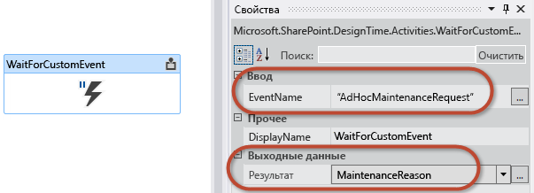

# <a name="working-with-the-sharepoint-workflow-services-client-side-object-model"></a>Работа с клиентской объектной моделью для служб рабочих процессов SharePoint
Демонстрация использования API клиентской объектной модели SharePoint (CSOM) для создания определений и экземпляров рабочих процессов Workflow Manager 1.0, а также управления ими. **Автор:** [Эндрю Коннелл (Andrew Connell)](http://social.msdn.microsoft.com/profile/andrew%20connell%20%5bmvp%5d/),  [AndrewConnell.com](http://www.andrewconnell.com)
  
    
    


## <a name="working-with-the-sharepoint-workflow-services-client-side-object-model"></a>Работа с клиентской объектной моделью для служб рабочих процессов SharePoint

Реализация рабочих процессов в SharePoint 2007 и SharePoint 2010 практически не менялась от версии к версии. Корпорация Майкрософт добавила в SharePoint 2010 некоторые функции, например возможность связывать рабочие процессы с сайтами, а также улучшила средства создания рабочих процессов, SharePoint Designer 2010 и Visual Studio 2010, по сравнению с их предшественниками. Тем не менее, реализация задач, форм и серверных интерфейсов API рабочих процессов осталась практически без изменений. 
  
    
    
В SharePoint 2010 корпорация Майкрософт добавила функции и возможности, которые поощряли перенос настроек в изолированные решения. Они работали в изолированном процессе и были совместимы с обоими типами развертываний SharePoint: локальными, где SharePoint устанавливается на серверах компании, и облачными, в частности Office 365. 
  
    
    
В SharePoint добавила еще больше возможностей. Эти обновления были ориентированы на облачные развертывания. В частности, появилась новая модель приложений SharePoint, которая превзошла изолированные решения, поскольку, в отличие от изолированные решения, эти приложения в явной форме блокировали выполнение серверного кода в процессе SharePoint. Кроме того, корпорация Майкрософт усовершенствовала имеющиеся технологии SharePoint, например клиентскую объектную модель (CSOM), и добавила новые возможности, например поддержку удостоверений приложений с использованием  [OAuth](http://msdn.microsoft.com/library/office/fp142382.aspx).
  
    
    
Затем, с выпуском SharePoint, корпорация Майкрософт создала совершенно новые архитектуру и платформу рабочих процессов, которые отражали фундаментальные изменения в направлении развития продукта. 
  
    
    
Наиболее заметное изменение — это новая архитектура, в которой рабочие процессы SharePoint больше не выполняются в SharePoint. Вместо этого SharePoint использует совершенно новый обработчик выполнения: Workflow Manager 1.0. В Workflow Manager размещаются среда выполнения и все необходимые службы для платформы Windows Workflow. При публикации рабочего процесса или запуске нового экземпляра опубликованного рабочего процесса SharePoint сообщает об этом компоненту Workflow Manager, который затем обрабатывает эпизоды рабочего процесса. Если рабочий процесс получает доступ к данным в SharePoint, например свойствам элементов списков или пользователей, он проходит проверку подлинности с помощью протокола OAuth и работает с новыми, улучшенными интерфейсами REST API.
  
    
    
Эти изменения архитектуры рабочих процессов оказывали значительное влияние на некоторые сферы, например настраиваемые формы рабочих процессов, как упоминается в статье "Инструкции. Создание настраиваемых форм рабочих процессов SharePoint с помощью Visual Studio 2012" на сайте MSDN. В этой статье упоминается одно из нововведений в SharePoint, связанных поддержкой нового стиля создания настраиваемых форм рабочих процессов: улучшения модели CSOM и добавление API CSOM служб рабочих процессов.
  
    
    

## <a name="introduction-to-the-workflow-services-csom-api-in-sharepoint"></a>Общие сведения об API CSOM служб рабочих процессов в SharePoint

В SharePoint 2007 и SharePoint 2010 API рабочих процессов использовался только в серверной объектной модели. В SharePoint по-прежнему присутствует этот API рабочих процессов, поскольку SharePoint включает старую подсистему выполнения рабочих процессов в SharePoint для обратной совместимости. 
  
    
    
Тем не менее, новая и предпочитаемая архитектура рабочих процессов, которая появилась в SharePoint и использует Workflow Manager, включает совершенно новый серверный API. В SharePoint корпорация Майкрософт расширила CSOM, добавив надежный API для новой архитектуры рабочих процессов. Обратите внимание, что это дополнение к CSOM применяется только к новой архитектуры рабочих процессов SharePoint и Workflow Manager 1.0, а не старой версии, которая еще размещается в SharePoint.
  
    
    
API CSOM служб рабочих процессов, как и другие компоненты CSOM, реализуется как в управляемом API .NET Silverlight, так и в API JavaScript, известном как объектная модель JavaScript (JSOM). Разработчики должны использовать JSOM при создании пользовательских форм рабочих процессов, так как эти формы должны быть веб-формами ASP.NET, которые не содержат код на стороне сервера. Следовательно, API JSOM служб рабочих процессов используется в пользовательских формах сопоставления для создания сопоставлений рабочих процессов, а также в формах запуска для создания экземпляров рабочих процессов.
  
    
    
Тем не менее, возможности этим не ограничиваются. CSOM и JSOM служб рабочих процессов очень надежны и позволяют разработчикам выполнять практически любые действия с рабочими процессами в SharePoint. Разработчики могут не только создавать сопоставления и экземпляры рабочих процессов, но и программным образом развертывать новые определения рабочих процессов, а также связываться с запущенными экземплярами рабочих процессов из CSOM и JSOM, как описано далее в этой статье.
  
    
    
В этой статье основное внимание уделяется формам рабочих процессов в контексте SharePoint Server 2013. При написании этой статьи использовались Инструменты разработчика Office для Visual Studio 2013 и SharePoint с общедоступным обновлением за март 2013 г. Все представленные в этой статье сведения применимы как к локальным развертываниям SharePoint, так и к Office 365.
  
    
    

## <a name="workflow-services-csom-and-jsom-api-components"></a>Компоненты модели CSOM служб рабочих процессов и API JSOM

Эта статья посвящена API CSOM служб рабочих процессов, а значит и API JSOM, но в ней не рассматривается серверный API служб рабочих процессов. CSOM служб рабочих процессов состоит нескольких разных служб, которые используются для выполнения различных задач. Все они описываются в последующих разделах. 
  
    
    

> **Примечание.** Есть еще одна служба, отсутствующая в модели CSOM, но включенная в API на стороне сервера. Это служба обмена сообщениями, используемая для управления добавлением сообщений в очередь и транспортировкой сообщений. 
  
    
    

Чтобы работать с API CSOM и JSOM разработчики должны добавить необходимые ссылки на свои проекты (в случае CSOM) и страницы (в случае JSOM). Обе реализации имеют одинаковые требования:
  
    
    

- Добавьте ссылки на основные библиотеки CSOM и JSOM SharePoint:
    
  - Microsoft.SharePoint.Client.dll
    
  
  - Microsoft.SharePoint.Client.Runtime.dll
    
  
  - Microsoft.SharePoint.Client.WorkflowServices.dll
    
  

- Добавьте ссылки на библиотеки CSOM и JSOM служб рабочих процессов:
    
  - SP.js
    
  
  - SP.Runtime.js
    
  
  - SP.WorkflowServices.js
    
  

### <a name="workflow-service-manager"></a>Диспетчер службы рабочих процессов

Управлять всеми службами, включенными в API CSOM служб рабочих процессов, позволяет диспетчер службы рабочих процессов. Разработчики используют этот объект, чтобы получать экземпляры всех остальных служб, описанных в следующих разделах. Подобно остальным реализациям API CSOM,  [WorkflowServicesManager](https://msdn.microsoft.com/library/Microsoft.SharePoint.WorkflowServices.WorkflowServicesManager.aspx) имеет зависимость на основную клиентскую объектную модель SharePoint, поэтому на сайт SharePoint, к которому требуется подключиться, нужно передать правильные контекст клиента и ссылку, как показано в следующих примерах кода CSOM и JSOM.
  
    
    

#### <a name="csom-creating-a-workflowservicesmanager-instance"></a>CSOM: создание экземпляра объекта WorkflowServicesManager


```

var clientContext = new ClientContext(siteCollectionUrl);
var workflowServicesManager = new WorkflowServicesManager(clientContext, clientContext.Web); 

```


#### <a name="jsom-creating-a-workflowservicesmanager-instance"></a>JSOM: создание экземпляра объекта WorkflowServicesManager


```

var clientContext = SP.ClientContext.get_current();
var workflowServicesManager = SP.WorkflowServices.WorkflowServicesManager.newObject(context, context.get_web()); 

```


### <a name="deployment-service"></a>Служба развертывания

При создании пользовательских рабочих процессов с помощью Visual Studio 2012, используя пакет решения (*.wsp) или приложение SharePoint (*.app), вы создаете определения рабочих процессов. Определение  это рабочий процесс, а также все бизнес-правила и атрибуты, определенные в нем, например расположение пользовательских форм сопоставления и запуска. Сами по себе эти определения не очень полезны, поскольку их невозможно запускать вне контекста сопоставления с сайтом, списком или библиотекой документов. Определения рабочих процессов, опубликованные и доступные на сайте, можно найти на странице создания сопоставления рабочего процесса, как показано на следующем рисунке.
  
    
    

**Рисунок 1. Добавление сопоставления рабочего процесса**

  
    
    

  
    
    

  
    
    
Коллекция опубликованных определений рабочих процессов доступна через службу развертывания. Эта служба позволяет получить список всех сохраненных и опубликованных на данный момент на сайте определений, а также публиковать сохраненные и новые определения, удалять имеющиеся определения и определять, какие действия доступны для рабочих процессов, созданных в SharePoint Designer 2013.
  
    
    
Объект **WorkflowDeploymentService** доступен через класс **WorkflowServicesManager**, как показано в следующих примерах кода.
  
    
    

#### <a name="csom-obtaining-a-workflowdeploymentservice-instance"></a>CSOM: получение экземпляра объекта WorkflowDeploymentService


```

var clientContext = new ClientContext(siteCollectionUrl);
var workflowServicesManager = new WorkflowServicesManager(clientContext, clientContext.Web);
var workflowDeploymentService = workflowServicesManager.GetWorkflowDeploymentService(); 

```


#### <a name="jsom-obtaining-a-workflowdeploymentservice-instance"></a>JSOM: получение экземпляра объекта WorkflowDeploymentService


```

var clientContext = SP.ClientContext.get_current();
var workflowServicesManager = SP.WorkflowServices.WorkflowServicesManager.newObject(context, context.get_web()); 
var workflowDeploymentService = workflowServicesManager.getWorkflowDeploymentService();

```


### <a name="subscription-service"></a>Служба подписки

В предыдущих разделах описывались создание и публикация рабочих процессов в SharePoint в виде определений. Чтобы использовать эти определения, пользователь должен создать сопоставление, которое связывает определение с конкретными сайтом, списком или библиотекой документов SharePoint, а также дополнительными метаданными. В целом этот процесс работает аналогичным образом в SharePoint 2010, но реализация в SharePoint во многом отличается. Workflow Manager 1.0 использует преимущества экземпляра шины обслуживания Microsoft Azure версии 1.0.
  
    
    
Шина обслуживания необходима, поскольку она поддерживает службу публикации и подписки (также называемую PubSub). Это асинхронная платформа обмена сообщениями, которая поддерживает отправку сообщений в беседы, сохраненные в шине обслуживания. Любому количеству подписчиков может быть отправлено уведомление, когда в беседе публикуется сообщение, соответствующее определенным условиям. 
  
    
    
В SharePoint и Workflow Manager 1.0 для создания сопоставлений используется модель PubSub. Сопоставления рабочих процессов создаются как подписки на беседы. Например, сопоставление с определением рабочего процесса можно создать в списке и настроить для автоматического запуска при добавлении элементов в этот список. Когда в список добавляется элемент, SharePoint публикует в Workflow Manager 1.0 событие, которое затем отсылается в беседу шины обслуживания. Сообщение оценивается, а зарегистрированные подписки получают уведомления о событии. Находится подписанное сопоставление, и запускается рабочий процесс. Дополнительные сведения об этом процессе см. в статье MSDN  [Основные сведения о рабочих процессах в SharePoint](sharepoint-workflow-fundamentals.md). 
  
    
    
Теперь вам должно быть понятно, почему сопоставления рабочих процессов теперь называются подписками в API (то есть "под капотом"). Вы можете использовать службу подписки в CSOM служб рабочих процессов, чтобы изучать существующие сопоставления и подписки, создавать и удалять их, а также запрашивать уведомления о событиях.
  
    
    
Объект  [WorkflowSubscriptionService](https://msdn.microsoft.com/library/Microsoft.SharePoint.WorkflowServices.WorkflowSubscriptionService.aspx) доступен через класс **WorkflowServicesManager**, как показано в следующих примерах кода.
  
    
    

#### <a name="csom-obtaining-a-workflowsubscriptionservice-instance"></a>CSOM: получение экземпляра объекта WorkflowSubscriptionService


```

var clientContext = new ClientContext(siteCollectionUrl);
var workflowServicesManager = new WorkflowServicesManager(clientContext, clientContext.Web);
var workflowSubscriptionService = workflowServicesManager.GetWorkflowSubscriptionService();

```


#### <a name="jsom-obtaining-a-workflowsubscriptionservice-instance"></a>JSOM: получение экземпляра объекта WorkflowSubscriptionService


```

var clientContext = SP.ClientContext.get_current();
var workflowServicesManager = SP.WorkflowServices.WorkflowServicesManager.newObject(context, context.get_web()); 
var workflowSubscriptionService = workflowServicesManager.getWorkflowSubscriptionService();

```


### <a name="instance-service"></a>Служба экземпляров

Последняя служба, которую мы рассмотрим  служба экземпляров. Вы можете использовать эту службу для выполнения нескольких задач, например запуска, приостановки, возобновления, удаления и отмены экземпляров рабочих процессов. Вы также можете использовать ее, чтобы собирать данные отладки, а также перечислять все запущенные на данный момент рабочие процессы. Наконец, вы можете использовать эту службу для публикации событий в запущенных рабочих процессах, как будет показано далее в этой статье.
  
    
    
Объект  [WorkflowInstanceService](https://msdn.microsoft.com/library/Microsoft.SharePoint.WorkflowServices.WorkflowInstanceService.aspx) доступен через класс **WorkflowServicesManager**, как показано в следующих примерах кода.
  
    
    

#### <a name="csom-obtaining-a-workflowinstanceservice-instance"></a>CSOM: получение экземпляра объекта WorkflowInstanceService


```

var clientContext = new ClientContext(siteCollectionUrl);
var workflowServicesManager = new WorkflowServicesManager(clientContext, clientContext.Web);
var workflowInstanceService = workflowServicesManager.GetWorkflowInstanceService();

```


#### <a name="jsom-obtaining-a-workflowinstanceservice-instance"></a>JSOM: получение экземпляра объекта WorkflowInstanceService


```

var clientContext = SP.ClientContext.get_current();
var workflowServicesManager = SP.WorkflowServices.WorkflowServicesManager.newObject(context, context.get_web()); 
var workflowInstanceService = workflowServicesManager.getWorkflowInstanceService();

```


### <a name="interop-service"></a>Служба взаимодействия

В предыдущих версиях SharePoint, в частности SharePoint 2007 и SharePoint 2010, размещалась среда выполнения Windows Workflow Foundation. Как описывалось ранее, корпорация Майкрософт отказалась от этого подхода в SharePoint, добавив зависимость от Workflow Manager 1.0, в которой размещается среда выполнения рабочих процессов за пределами SharePoint. Следовательно, выполнение рабочих процессов и управление ими больше не выполняются в SharePoint. Вместо этого SharePoint передает управление рабочими процессами и обязанности по выполнению серверу Workflow Manager 1.0.
  
    
    
Тем не менее, для обеспечения обратной совместимости корпорация Майкрософт сохранила устаревшую модель размещения рабочих процессов в стиле SharePoint в SharePoint, сохранив подсистему среды выполнения Windows Workflow Foundation. Следовательно, все рабочие процессы, созданные в SharePoint 2010, будут выполняться в среде SharePoint как обычно. Кроме того, корпорация Майкрософт добавила новое действие, **InvokeSharePointWorkflow**, которое можно использовать в рабочем процессе SharePoint для запуска существующего рабочего процесса на узле SharePoint 2010, включенном в SharePoint. Это позволяет пользоваться преимуществами существующих инвестиций в рабочие процессы, перенесенные из предыдущих версий.
  
    
    

> **Примечание.** Действие **InvokeSharePointWorkflow** является оболочкой метода CSOM [StartWorkflow](https://msdn.microsoft.com/library/Microsoft.SharePoint.Client.WorkflowServices.InteropService.StartWorkflow.aspx).
  
    
    

CSOM служб рабочих процессов SharePoint также включает специальную службу, которая позволяет разработчикам взаимодействовать с устаревшими рабочими процессами.  [InteropService](https://msdn.microsoft.com/library/Microsoft.SharePoint.Client.WorkflowServices.InteropService.aspx) позволяет запускать и останавливать рабочие процессы, а также включать и отключать уведомления о событиях для запущенных рабочих процессов.
  
    
    
Объект  [WorkflowDeploymentService](https://msdn.microsoft.com/library/Microsoft.SharePoint.Client.WorkflowServices.WorkflowDeploymentService.aspx) доступен через класс **WorkflowServicesManager**, как показано в следующих примерах кода CSOM и JSOM.
  
    
    

#### <a name="csom-obtaining-an-interopservice-instance"></a>CSOM: получение экземпляра объекта InteropService


```

var clientContext = new ClientContext(siteCollectionUrl);
var workflowServicesManager = new WorkflowServicesManager(clientContext, clientContext.Web);
var workflowInteropService = workflowServicesManager.GetWorkflowInteropService();

```


#### <a name="jsom-obtaining-an-interopservice-instance"></a>JSOM: получение экземпляра объекта InteropService


```

var clientContext = SP.ClientContext.get_current();
var workflowServicesManager = SP.WorkflowServices.WorkflowServicesManager.newObject(context, context.get_web()); 
var workflowInteropService = serviceManager.getWorkflowInteropService();

```


## <a name="example-workflow-services-csom-scenarios"></a>Пример. Сценарии CSOM служб рабочих процессов

В следующих разделах описывается использование разных служб в CSOM служб рабочих процессов для выполнения распространенных задач в пользовательских решениях. 
  
    
    

### <a name="get-all-workflows-installed"></a>Получение всех установленных рабочих процессов

Большинство других служб в CSOM служб рабочих процессов требуют, чтобы вы получали ссылки на ранее опубликованное определение рабочего процесса. Как правило, для ссылок на определения рабочих процессов используются их идентификаторы, то есть GUID. 
  
    
    
Чтобы получить список всех опубликованных определений рабочих процессов, сначала получите экземпляр службы развертывания с помощью метода  [GetWorkflowDeploymentService](https://msdn.microsoft.com/library/Microsoft.SharePoint.Client.WorkflowServices.WorkflowServicesManager.GetWorkflowDeploymentService.aspx) . Затем получите коллекцию всех определений рабочих процессов с помощью метода [EnumerateDefinitions(Boolean)](https://msdn.microsoft.com/library/Microsoft.SharePoint.Client.WorkflowServices.WorkflowDeploymentService.EnumerateDefinitions.aspx) . Ниже приводится пример кода:
  
    
    


```

// connect to the workflow services via a CSOM client context
var clientContext = new ClientContext(siteCollectionUrl);
var workflowServicesManager = new WorkflowServicesManager(clientContext, clientContext.Web);

// connect to the deployment service 
var workflowDeploymentService = workflowServicesManager.GetWorkflowDeploymentService();

// get all installed workflows
var publishedWorkflowDefinitions = workflowDeploymentService.EnumerateDefinitions(true);
clientContext.Load(publishedWorkflowDefinitions);
clientContext.ExecuteQuery();

// display list of all installed workflows
foreach (var workflowDefinition in publishedWorkflowDefinitions) {
  Console.WriteLine("{0} - {1}", workflowDefinition.Id.ToString(), workflowDefinition.DisplayName);
}

```


### <a name="get-all-associations-and-subscriptions"></a>Получение всех сопоставлений и подписок

Чтобы запустить новый экземпляр рабочего процесса, необходимо сначала получить ссылку на существующее сопоставление рабочего процесса. Следующий пример кода, основанный на предыдущем, демонстрирует, как получить список всех сопоставлений рабочих процессов для заданного определения на сайте. 
  
    
    
Получив определение рабочего процесса с помощью приведенного выше примера, используйте метод  [GetWorkflowSubscriptionService](https://msdn.microsoft.com/library/Microsoft.SharePoint.Client.WorkflowServices.WorkflowServicesManager.GetWorkflowSubscriptionService.aspx) для создания экземпляра службы подписки. Затем используйте метод [EnumerateSubscriptionsByDefinition](https://msdn.microsoft.com/library/Microsoft.SharePoint.Client.WorkflowServices.WorkflowSubscriptionService.EnumerateSubscriptionsByDefinition.aspx) (передав идентификатор определения рабочего процесса), чтобы получить список всех сопоставлений для указанного рабочего процесса. Обратите внимание, что доступно несколько методов получения рабочих процессов, включая следующие:
  
    
    

-  [EnumerateSubscriptions](https://msdn.microsoft.com/library/Microsoft.SharePoint.Client.WorkflowServices.WorkflowSubscriptionService.EnumerateSubscriptions.aspx)
    
  
-  [EnumerateSubscriptionsByDefinition](https://msdn.microsoft.com/library/Microsoft.SharePoint.Client.WorkflowServices.WorkflowSubscriptionService.EnumerateSubscriptionsByDefinition.aspx)
    
  
-  [EnumerateSubscriptionsByEventSource](https://msdn.microsoft.com/library/Microsoft.SharePoint.Client.WorkflowServices.WorkflowSubscriptionService.EnumerateSubscriptionsByEventSource.aspx)
    
  
-  [EnumerateSubscriptionsByList](https://msdn.microsoft.com/library/Microsoft.SharePoint.Client.WorkflowServices.WorkflowSubscriptionService.EnumerateSubscriptionsByList.aspx)
    
  
Следующий пример кода демонстрирует получение сопоставлений и подписок.
  
    
    


```

// connect to the workflow services via a CSOM client context
var clientContext = new ClientContext(siteCollectionUrl);
var workflowServicesManager = new WorkflowServicesManager(clientContext, clientContext.Web);

// connect to the deployment service
var workflowDeploymentService = workflowServicesManager.GetWorkflowDeploymentService();

// get all installed workflows
var publishedWorkflowDefinitions = workflowDeploymentService.EnumerateDefinitions(true);
clientContext.Load(publishedWorkflowDefinitions);
clientContext.ExecuteQuery();

// find the first workflow definition
var firstWorkflowDefinition = publishedWorkflowDefinitions.First();

// connect to the subscription service
var workflowSubscriptionService = workflowServicesManager.GetWorkflowSubscriptionService();

// get all workflow associations
var workflowAssociations = workflowSubscriptionService.EnumerateSubscriptionsByDefinition(firstWorkflowDefinition.Id);
clientContext.Load(workflowAssociations);
clientContext.ExecuteQuery();

foreach (var association in workflowAssociations) {
  Console.WriteLine("{0} - {1}",
    association.Id, association.Name);
}

```


### <a name="creating-a-workflow-association"></a>Создание сопоставления рабочего процесса

Для создания нового сопоставления рабочего процесса, на которое также можно ссылаться как на подписку, необходимы дополнительные действия, прежде чем вы сможете опубликовать сопоставление в SharePoint. Это вызвано тем, что каждая подписка должна включать дополнительные сведения, которые обычно собираются на странице сопоставления. Эти метаданные включают следующие сведения:
  
    
    

- Идентификатор определения рабочего процесса, на котором основано сопоставление.
    
  
- Идентификатор сайта, списка или библиотеки документов SharePoint, где создано сопоставление.
    
  
- Отображаемое имя сопоставления. 
    
  
- Параметры запуска (ручной или автоматический запуск при добавлении или изменении элемента).
    
  
- Идентификатор списка, в котором будут храниться все сообщения списка журнала для этого сопоставления.
    
  
- Идентификатор списка, в котором будут храниться все задачи для этого сопоставления.
    
  
- Коллекция пар "имя-значение", которые следует отправлять в рабочий процесс (необязательно). Эти поля обычно передаются из пользовательской формы сопоставления.
    
  

### <a name="creating-a-custom-workflow-association"></a>Создание пользовательского сопоставления рабочего процесса


1. Чтобы создать пользовательское сопоставление, сначала воспользуйтесь методом  [GetWorkflowSubscriptionService](https://msdn.microsoft.com/library/Microsoft.SharePoint.Client.WorkflowServices.WorkflowServicesManager.GetWorkflowSubscriptionService.aspx) , чтобы получить ссылку на службу подписки.
    
```
  
// connect to the deployment service
var workflowDeploymentService = workflowServicesManager.GetWorkflowDeploymentService();

// get all installed workflows
var publishedWorkflowDefinitions = workflowDeploymentService.EnumerateDefinitions(true);
clientContext.Load(publishedWorkflowDefinitions);
clientContext.ExecuteQuery();

// find the first workflow definition
var firstWorkflowDefinition = publishedWorkflowDefinitions.First();

// connect to the subscription service
var workflowSubscriptionService = workflowServicesManager.GetWorkflowSubscriptionService();

```

2. Создайте новый экземпляр объекта для класса  [WorkflowSubscription](https://msdn.microsoft.com/library/Microsoft.SharePoint.Client.WorkflowServices.WorkflowSubscription.aspx) .
    
  
3. Задайте необходимые свойства объекта **WorkflowSubscription**, как показано в следующем примере кода. В комментариях к этому примеру описывается каждый из параметров свойств. Обратите внимание, что некоторые свойства, которые не связаны со службами рабочих процессов CSOM, не включены в пример для удобочитаемости. Пропущены следующие свойства:
    
1. **listId**. Идентификатор списка, в котором создано сопоставление.
    
  
2. **historyListId**. Идентификатор списка, в котором хранятся все сообщения списка журнала для сопоставления.
    
  
3. **taskListId**. Идентификатор списка, в котором будут храниться все задачи для сопоставления.
    
  
4. После создания подписки ее необходимо опубликовать в SharePoint с помощью метода  [PublishSubscriptionForList](https://msdn.microsoft.com/library/Microsoft.SharePoint.Client.WorkflowServices.WorkflowSubscriptionService.PublishSubscriptionForList.aspx) , как показано в следующем примере кода:
    
```
  
// create a new association / subscription
WorkflowSubscription newSubscription = new WorkflowSubscription(clientContext) {
  DefinitionId = firstWorkflowDefinition.Id,
  Enabled = true,
  Name = "New Workflow Association"
};


var startupOptions = new List<string>();
// automatic start
startupOptions.Add("ItemAdded");
startupOptions.Add("ItemUpdated");
// manual start
startupOptions.Add("WorkflowStart");

// set the workflow start settings
newSubscription.EventTypes = startupOptions;


// set the associated task and history lists
newSubscription.SetProperty("HistoryListId", workflowHistoryListId.ToString());
newSubscription.SetProperty("TaskListId", workflowTaskListId.ToString());

// OPTIONAL: add any association form values
newSubscription.SetProperty("Prop1","Value1");
newSubscription.SetProperty("Prop2","Value2");

// create the association
workflowSubscriptionService.PublishSubscriptionForList(newSubscription, listId);
clientContext.ExecuteQuery();

```


### <a name="get-all-workflow-instances"></a>Получение всех экземпляров рабочих процессов

Вы также можете использовать службу экземпляров служб рабочих процессов, чтобы просматривать все экземпляры рабочих процессов, запущенные на сайте, в списке или в библиотеке документов SharePoint. Возвращаемый объект экземпляра содержит сведения об экземпляре, например время последнего обновления, текущее состояние и все ошибки, которые могли возникнуть во время предыдущих запусков. Кроме того, он предоставляет коллекцию пар "имя-значение", которые были отправлены рабочему процессу из пользовательской формы запуска.
  
    
    
Для этого сначала используйте метод  [GetWorkflowInstanceService](https://msdn.microsoft.com/library/Microsoft.SharePoint.Client.WorkflowServices.WorkflowServicesManager.GetWorkflowInstanceService.aspx) , чтобы получить ссылку на службу экземпляров. Обратите внимание, что [WorkflowInstanceService](https://msdn.microsoft.com/library/Microsoft.SharePoint.Client.WorkflowServices.WorkflowInstanceService.aspx) предоставляет несколько методов для получения коллекции запущенных экземпляров рабочих процессов:
  
    
    

-  [Enumerate](https://msdn.microsoft.com/library/Microsoft.SharePoint.Client.WorkflowServices.WorkflowInstanceService.Enumerate.aspx) . Принимает сопоставление рабочего процесса (то есть подписку) в качестве параметра, и его можно использовать для получения всех созданных экземпляров по указанному сопоставлению.
    
  
-  [EnumerateInstancesForSite](https://msdn.microsoft.com/library/Microsoft.SharePoint.Client.WorkflowServices.WorkflowInstanceService.EnumerateInstancesForSite.aspx) . Получает список всех экземпляров рабочих процессов, запущенных на сайте SharePoint, заданном при создании объекта **WorkflowServiceManager**.
    
  
-  [EnumerateInstancesForListItem](https://msdn.microsoft.com/library/Microsoft.SharePoint.Client.WorkflowServices.WorkflowInstanceService.EnumerateInstancesForListItem.aspx) . Принимает идентификаторы списка и элементы: используйте этот метод, чтобы получить все экземпляры рабочих процессов, созданные в определенном элементе списка.
    
  
У каждого из этих методов также есть альтернативный метод ***WithOffset()** (например, [EnumerateWithOffset](https://msdn.microsoft.com/library/Microsoft.SharePoint.Client.WorkflowServices.WorkflowInstanceService.EnumerateWithOffset.aspx) ). Эти альтернативные методы позволяют получить подмножество экземпляров рабочего процесса в тех случаях, когда работать со всей коллекцией неудобно. Чтобы получить количество экземпляров рабочих процессов, используйте метод [CountInstances](https://msdn.microsoft.com/library/Microsoft.SharePoint.Client.WorkflowServices.WorkflowInstanceService.CountInstances.aspx) или [CountInstancesWithStatus](https://msdn.microsoft.com/library/Microsoft.SharePoint.Client.WorkflowServices.WorkflowInstanceService.CountInstancesWithStatus.aspx) .
  
    
    
Следующий пример кода иллюстрирует получение экземпляров рабочих процессов:
  
    
    


```

// connect to the instance service
var workflowInstanceService = workflowServicesManager.GetWorkflowInstanceService();

// get all instances
var workflowInstances = workflowInstanceService.EnumerateInstancesForListItem(listId, listItemId);
foreach (var instance in workflowInstances)
{
  Console.WriteLine("{0} - {1} - {2}",
                    instance.Id.ToString(),
                    instance.LastUpdated,
                    instance.Status.ToString());
}
```


### <a name="start-a-workflow-instance"></a>Запуск экземпляра рабочего процесса

Чтобы запустить экземпляр сопоставления рабочего процесса, необходимо повторить многие из действий, показанных в предыдущих примерах. Чтобы запустить рабочий процесс для элемента в списке или библиотеке документов, сначала получите ссылку на сопоставление рабочего процесса и идентификатор элемента в списке. Коллекцию пар "имя-значение" можно отправить рабочему процессу при его запуске. Это происходит, если для сбора данных пользователя, запускающего рабочий процесс, используется пользовательская форма запуска. Затем при запуске необходимо передать коллекцию, даже если она пустая, иначе рабочий процесс не запустится и возвратит ошибку.
  
    
    
Отталкиваясь от предыдущих примеров, используйте метод  [GetWorkflowInstanceService](https://msdn.microsoft.com/library/Microsoft.SharePoint.Client.WorkflowServices.WorkflowServicesManager.GetWorkflowInstanceService.aspx) , чтобы получить экземпляр службы экземпляров рабочих процессов. Затем запустите рабочий процесс, вызвав один из двух методов. Один запускает рабочие процессы на сайте, а другой  в элементе списка.
  
    
    

-  [StartWorkflow](https://msdn.microsoft.com/library/Microsoft.SharePoint.Client.WorkflowServices.WorkflowInstanceService.StartWorkflow.aspx) . Запускает рабочий процесс на сайте SharePoint, заданном при создании исходного объекта [WorkflowServicesManager](https://msdn.microsoft.com/library/Microsoft.SharePoint.Client.WorkflowServices.WorkflowServicesManager.aspx) . При использовании этого метода необходимо передать сопоставление рабочего процесса и все дополнительные свойства, присутствующие в форме запуска.
    
  
-  [StartWorkflowOnListItem](https://msdn.microsoft.com/library/Microsoft.SharePoint.Client.WorkflowServices.WorkflowInstanceService.StartWorkflowOnListItem.aspx) . Запускает рабочий процесс для определенного элемента списка. При использовании этого метода необходимо передать идентификатор нужного элемента списка помимо значений других параметров, необходимых методу **StartWorkflow**.
    
  
Следующий пример кода демонстрирует, как запустить экземпляр рабочего процесса.
  
    
    


```

// connect to the deployment service
var workflowDeploymentService = workflowServicesManager.GetWorkflowDeploymentService();

// get all installed workflows
var publishedWorkflowDefinitions = workflowDeploymentService.EnumerateDefinitions(true);
clientContext.Load(publishedWorkflowDefinitions);
clientContext.ExecuteQuery();

// find the first workflow definition
var firstWorkflowDefinition = publishedWorkflowDefinitions.First();

// connect to the subscription service
var workflowSubscriptionService = workflowServicesManager.GetWorkflowSubscriptionService();

// get all workflow associations
var workflowAssociations = workflowSubscriptionService.EnumerateSubscriptionsByDefinition(firstWorkflowDefinition.Id);
clientContext.Load(workflowAssociations);
clientContext.ExecuteQuery();

// find the first association
var firstWorkflowAssociation = workflowAssociations.First();

// connect to the instance service
var workflowInstanceService = workflowServicesManager.GetWorkflowInstanceService();

// start the workflow
var startParameters = new Dictionary<string, object>();
workflowInstanceService.StartWorkflowOnListItem(firstWorkflowAssociation, listItemId, startParameters);
clientContext.ExecuteQuery();

```


### <a name="publishing-messages-and-events-to-running-workflows"></a>Публикация сообщений и событий в запущенных рабочих процессах

Еще одна полезная функция, добавленная в SharePoint,  возможность публиковать пользовательские события в запущенных экземплярах рабочих процессов. Эти рабочие процессы могут включать действие **WaitForCustomEvent**, которое ожидает публикации определенного события в рабочем процессе. Событие также может содержать строку в виде части сообщения, которую действие может сохранить как переменную.
  
    
    
Чтобы опубликовать событие из клиента с помощью CSOM службы рабочих процессов, сначала необходимо сослаться на определенный экземпляр рабочего процесса, в котором нужно опубликовать событие. Затем опубликуйте событие с помощью службы экземпляров, используя метод  [PublishCustomEvent](https://msdn.microsoft.com/library/Microsoft.SharePoint.Client.WorkflowServices.WorkflowInstanceService.PublishCustomEvent.aspx) . При использовании этого метода необходимо передать нужный экземпляр, имя события и, при необходимости, полезную нагрузку, как показано в следующем примере кода.
  
    
    


```

// connect to the instance service
var workflowInstanceService = workflowServicesManager.GetWorkflowInstanceService();

// get all instances
var workflowInstances = workflowInstanceService.EnumerateInstancesForListItem(listId, listItemId);

var targetInstance = workflowInstances.First();

// publish custom event
instanceService.PublishCustomEvent(targetInstance, "AdHocMaintenanceRequest", "Flat Tire");
clientContext.ExecuteQuery();
```

Чтобы получить сообщение в рабочем процессе, добавьте действие **WaitForCustomEvent**, а затем в окне **Свойства** задайте в свойстве **EventName** имя события, которое ожидает действие (в приведенном выше примере это строка "AdHocMaintenanceRequest"). Затем задайте для свойства **Result** значение переменной, в которой хранится полезная нагрузка события, как показано на рисунке 2.
  
    
    

**Рисунок 2. Входной параметр EventName и значение Result**

  
    
    

  
    
    

  
    
    
Эта техника публикации пользовательского события демонстрируется в примере кода MSDN "SharePoint: маршрутизация рабочих процессов к состояниям в зависимости от действий и событий".
  
    
    

## <a name="conclusion"></a>Заключение

Корпорация Майкрософт добавила рабочие процессы на платформу SharePoint 2007, а платформа рабочих процессов практически не изменилась в SharePoint 2010. Это относится и к пользовательским формам в рабочих процессах SharePoint. В SharePoint, с другой стороны, произошло много изменений платформы и архитектуры рабочих процессов.
  
    
    
Одно из основных улучшений рабочих процессов в SharePoint  расширение CSOM с добавлением полноценного API служб рабочих процессов. Это позволяет разработчикам взаимодействовать с определениями, сопоставлениями и подписками рабочих процессов, а также создавать экземпляры этих рабочих процессов и работать с ними.
  
    
    

## <a name="additional-resources"></a>Дополнительные ресурсы
<a name="bk_addresources"> </a>


-  [Рабочие процессы в SharePoint](http://msdn.microsoft.com/ru-RU/library/jj163986.aspx)
    
  
-  [Что такое Workflow Manager 1.0?](http://msdn.microsoft.com/ru-RU/library/windowsazure/jj193471%28v=azure.10%29.aspx)
    
  

