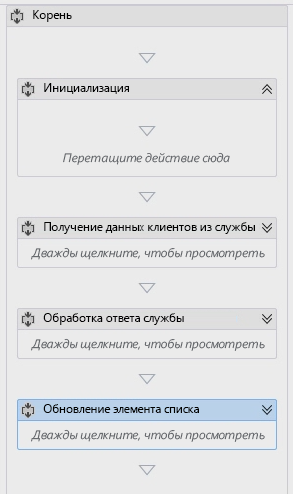
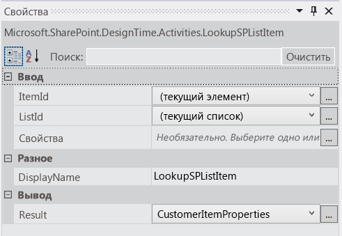
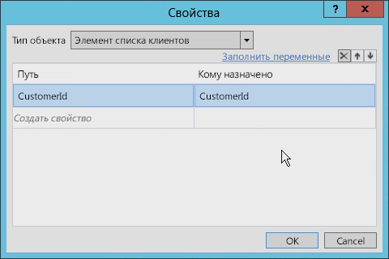
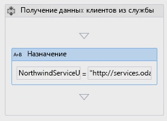
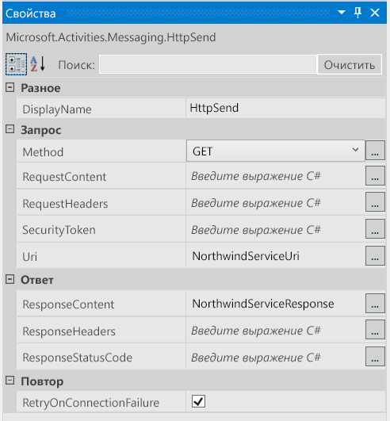
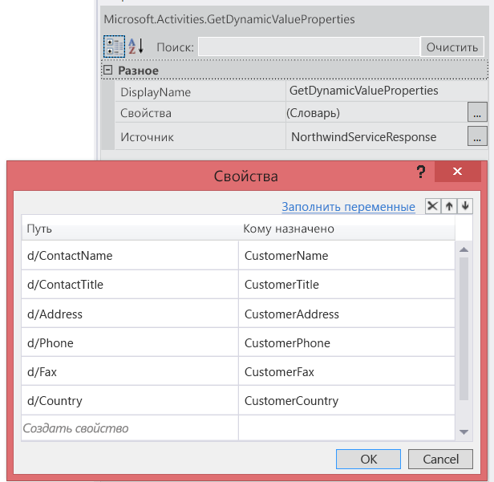
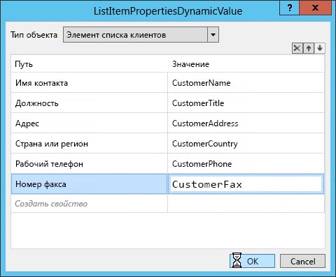
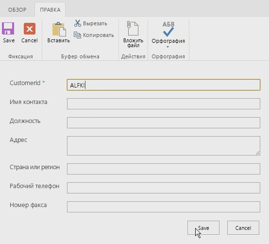
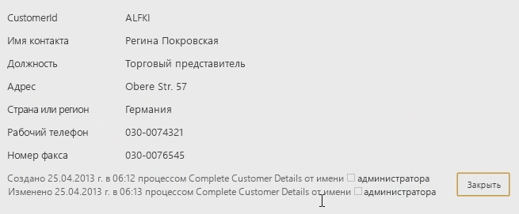

# Работа с веб-службами в рабочих процессах SharePoint с помощью Visual Studio 2012Working with Web Services in SharePoint Workflows using Visual Studio 2012
Узнайте, как использовать веб-службы в рабочих процессах SharePoint с помощью Visual Studio 2012. **Автор:** [Эндрю Коннел (Andrew Connell)](http://social.msdn.microsoft.com/profile/andrew%20connell%20%5bmvp%5d/), [AndrewConnell.com](http://www.andrewconnell.com)Demonstrates how to use web services in SharePoint workflows using Visual Studio 2012. **Provided by:** [Andrew Connell](http://social.msdn.microsoft.com/profile/andrew%20connell%20%5bmvp%5d/),  [AndrewConnell.com](http://www.andrewconnell.com)
  
> [!NOTE] 
> К этой статье прилагается пример законченного кода, который можно просматривать во время чтения или брать за основу при создании собственных проектов рабочих процессов SharePoint.This article is accompanied by an end-to-end code sample that you can use to follow the article, or as a starter for your own SharePoint workflow projects. You can find the downloadable code here: LINK. Вы можете скачать код из коллекции кода MSDN на странице [Работа с веб-службами в рабочих процессах SharePoint с помощью Visual Studio 2012](http://code.msdn.microsoft.com/Working-with-Web-in-46148199).You can find the downloadable code in the MSDN Code Gallery, here:  [Working with Web Services in SharePoint Workflows using Visual Studio 2012](http://code.msdn.microsoft.com/Working-with-Web-in-46148199). 
  
    
    

  
    
    
В SharePoint корпорация Майкрософт существенно изменила подход к рабочим процессам.Microsoft has taken a very different approach to workflow in SharePoint than in previous versions of SharePoint. Команда разработчиков рабочих процессов в сотрудничестве с командой разработчиков Azure создала новый продукт под названием Workflow Manager.The workflow team worked with the Azure team to create a new product called Workflow Manager. Workflow Manager служит для размещения последней версии среды выполнения Windows Workflow Foundation (версии 4) и всех необходимых служб с высоким уровнем доступности и масштабируемости.Workflow Manager serves the role of hosting the latest version of the Windows Workflow Foundation (version 4) runtime and all the necessary services in a highly available and scalable way. Производительность и масштабируемость обеспечивает служебная шина Microsoft Azure. Этот диспетчер работает абсолютно одинаково в локальном развертывании и облаке.It takes advantage of Microsoft Azure Service Bus for performance and scalability, and when deployed, it runs the same whether in an on-premises deployment or a deployment in the cloud. Затем SharePoint подключается и настраивается, чтобы поручить выполнение рабочих процессов и все связанные с этим задачи ферме Workflow Manager. Одно из самых важных изменений в новой архитектуре рабочих процессов заключается в том, что все настраиваемые рабочие процессы в SharePoint (в том числе созданные с помощью Visual Studio 2012) являются полностью декларативными.SharePoint is then connected and configured to hand off all workflow execution and related tasks to the Workflow Manager farm.One of the more important changes in the new workflow architecture is that all custom workflows in SharePoint completely declarative, including those built using Visual Studio 2012. В предыдущих версиях SharePoint рабочие процессы, созданные в Visual Studio 2012, не были исключительно декларативными.In previous versions of SharePoint, workflows developed with Visual Studio 2012 were not exclusively declarative. Они представляли собой сочетание декларативного кода XAML со скомпилированной сборкой.Instead, they were a pairing of declarative XAML with a compiled assembly. Управляемая сборка содержала бизнес-логику рабочего процесса. У опытных разработчиков SharePoint может возникнуть следующий вопрос: "Как реализовать пользовательскую бизнес-логику без скомпилированной сборки?".The managed assembly contained the workflow's business logic.This might come as a shock to seasoned SharePoint developers who may be asking, "so how do I implement my custom business logic without a compiled assembly?". Корпорация Майкрософт предлагает вместо этого создать настраиваемую веб-службу (в идеале — WCF, OData или RESTful), которая возвращает данные в формате нотации объектов JavaScript (JSON), и использовать некоторые новые действия и объекты в этой новой версии.Microsoft suggests that instead you create a custom web service, ideally a WCF, OData, or RESTful web service that returns data in the JavaScript Object Notation (JSON) format, and to use some of the new activities and objects in this new version. 
## Сценарии использования веб-служб в рабочих процессах SharePointScenarios for using web services in SharePoint workflows

Не сложно представить сценарии, в которых используются настраиваемые веб-службы в рабочем процессе SharePoint. Разработчики, которые создавали рабочие процессы в SharePoint 2007 или SharePoint 2010, привыкли работать с собственным кодом, так как эти рабочие процессы по своей природе были программными. В эти рабочие процессы не требовалось добавлять собственный код, но разработчики часто делали это.It is not difficult to conceive of scenarios where you would leverage a custom web services in a SharePoint workflow. Developers who authored workflows using SharePoint 2007 or SharePoint 2010 are accustomed to working with custom code, since these workflows were inherently programmatic. You were not required to add custom code to these workflows, but doing so was quite common.
  
    
    
Так как рабочие процессы SharePoint являются полностью декларативными, теперь часто, вместо того чтобы писать собственный код, необходимо использовать код, созданный во внешней веб-службе, которая вызывается и используется рабочим процессом.With SharePoint workflows to being purely declarative, many cases where you may have written custom code must now be handled with code written in an external web service that is called and consumed by the workflow. 
  
    
    
Рабочие процессы SharePoint могут использовать любые веб-службы. Тем не менее рабочим процессам проще всего взаимодействовать с веб-службами, которые передают данные по протоколу Open Data ( **OData** ) в форматах **Atom** или **json**. OData  это наиболее подходящий вариант, так как его полностью поддерживают средства разработки рабочих процессов SharePoint (как SharePoint Designer 2013, так и Visual Studio 2012).SharePoint workflows can consume any sort of web service. That said, it is easiest for workflows to interact with web services that pass data using the Open Data protocol ( **OData** ), as provided in either of the formats **Atom** or **json**. OData is the best approach because it is fully supported by the SharePoint workflow authoring tools (both SharePoint Designer 2013 and Visual Studio 2012).
  
    
    
Кроме того, поддерживаются как анонимные веб-службы, так и веб-службы, использующие различные типы проверки подлинности. На самом деле, вы полностью контролируете запросы и ответы при каждом вызове службы. Таким образом, например, с помощью ряда действий в рабочем процессе можно сначала выполнить проверку подлинности, используя одну службу для получения токена OAuth, а затем включить этот токен в последующие запросы к службам, защищенные с помощью  [OAuth 2.0](http://oauth.net/2/).In addition, both anonymous web services as well as those protected with different types of authentication are supported. In fact, you have full control over the request and response handling for each service call. Thus, for example, you can use a series of activities within a workflow to first authenticate using one service to obtain an OAuth token, and then include that token in future requests to services secured using  [OAuth 2.0](http://oauth.net/2/).
  
    
    

## Использование веб-служб в рабочих процессахLeveraging web services in workflows

Работа с веб-службами в рабочих процессах SharePoint включает два этапа. Первый  вызов веб-службы с помощью нового действия **HttpSend**, представленного в SharePoint. Действие **HttpSend** позволяет вызывать простейшие веб-службы, а также предоставляет HTTP-команды и определенные заголовки HTTP для более сложных задач. На рис. 1 показан ряд свойств действия **HttpSend**.Working with web services in SharePoint workflows involves two stages. The first is simply calling the web service, which you do by using a new **HttpSend** activity introduced with SharePoint. **HttpSend** lets you call into the simplest web services or, for more complex tasks, provides HTTP verbs and provides specific HTTP headers. Figure 1 shows many of the properties that are available on the **HttpSend** activity.
  
    
    

**Рис. 1. Окно "Свойства" для действия HttpSend****Figure 1. Properties Tool Window for the HttpSend Activity**

  
    
    

  
    
    

  
    
    
Также необходимо указать тип метода, который вы хотите использовать в запросе на обслуживание. Обратите внимание, что на рисунке 1 в блоке **Запрос** можно указать тип метода (в этом случае  **GET**). Доступны (среди прочих) следующие типы: **GET**, **PUT**, **POST** и **DELETE**. Это основной способ определения действий, которые веб-службы, в частности службы RESTful, должны выполнять с ресурсами, определенными в универсальном коде ресурса (URI) действия.You must also specify the method type you wish to use in the service request. Notice in Figure 1 that in the **Request** block you can specify the method type (in this case, **GET**). Available options include **GET**, **PUT**, **POST**, and **DELETE** (although there are others). This is the primary way to tell web services, specifically RESTful services, what to do on the resource defined in the URI of the activity.
  
    
    
Например, чтобы получить все свойства определенного элемента, **Uri** должен содержать уникальный адрес элемента, а в качестве метода необходимо задать **GET**. Чтобы удалить элемент, в качестве **Uri** используется тот же уникальный адрес элемента, только при этом задается метод **DELETE**. Это же касается и обновления элемента, при котором используется метод **POST**. При создании элемента **Uri** должен указывать на уникальный адрес коллекции, в которой будет создан элемент, а в качестве метода нужно задать **POST**. При создании или обновлении элементов службам обычно нужны данные, которые передаются в запросе и указываются с помощью свойства **RequestContent** в действии **HttpSend**.For instance, to get all the properties of a specific item, the **Uri** would contain the unique address of the item, and the method would be set to **GET**. To delete the item, the **Uri** would remain the same unique address of the item but the method would be set to **DELETE**. The same is true for updating an item except the method would be set to **POST**. In creating an item, the **Uri** would point to the unique address of the collection where the item is to be created, and the method would be set to **POST**. When creating or updating items, services require the data to use what is passed along as content in the request, indicated using the **RequestContent** property on the **HttpSend** activity.
  
    
    
Второй этап работы с веб-службами, который мы рассмотрим, включает отправку или получение данных из веб-службы. Независимо от того, какое свойство используется в действии **HttpSend** ( **RequestContent** или **ResponseContent**), данные можно передавать в виде сложной структуры в формате строк Нотация объектов JavaScript (JSON). Вам не придется создавать эти строки json и управлять ими вручную. Корпорация Майкрософт предоставляет новый тип объекта:  [DynamicValue](http://msdn.microsoft.com/ru-RU/library/windowsazure/jj193446%28v=azure.10%29.aspx), который значительно упрощает эту задачу.The second stage of working with web services that we're going to cover involves submitting or receiving data from a web service. Regardless of whether you use the **RequestContent** or **ResponseContent** properties on the **HttpSend** activity) you can pass the data as a complex structure, which are formatted as JavaScript Object Notation (JSON) strings. The good news is, you don't have to create and manipulate these json strings manually. Instead, Microsoft gives you a new object type, the [DynamicValue](http://msdn.microsoft.com/ru-RU/library/windowsazure/jj193446%28v=azure.10%29.aspx), that makes your task much easier. 
  
    
    
 Объекты **DynamicValue** могут хранить иерархические данные, а также ответ веб-службы. Кроме того, с объектами **DynamicValue** связан ряд действий, с помощью которых можно подсчитать количество элементов в ответе, извлечь значения из ответа либо создать структуру для обновления или создания элементов.**DynamicValue** objects can store hierarchal data as well as store the response of a web service call. Furthermore, there is a series of activities associated with **DynamicValue** objects that you can use to count the number of items in the response, extract values from the response, or build up a new structure for updating or creating items.
  
    
    

## Создание веб-служб для рабочих процессов SharePointCreating web services for SharePoint workflows

Так как добавлена поддержка вызова веб-служб и прекращена поддержка пользовательского кода в рабочих процессах, разработчики теперь должны знать, как создавать службы. Настраиваемые веб-службы для использования в рабочих процессах SharePoint можно создавать по-разному. Действие **HttpSend** и тип данных **DynamicValue** лучше всего подходят для служб RESTful и служб, которые соответствуют протоколу OData.With the support for calling web services and the lack of supporting custom code within workflows, developers will now need to know how to create services. There are plenty of options for creating custom web services for use in SharePoint workflows. The **HttpSend** activity and **DynamicValue** data type are best suited for RESTful services and those that conform to the OData Protocol.
  
    
    
OData  это протокол для создания и использования данных на основе принципов служб REST. Он разработан для стандартизации обмена данными с использованием проверенного и надежного протокола HTTP. После создания спецификации OData различные организации реализовали протокол в собственных технологических стеках. Корпорация Майкрософт реализовала собственную версию OData под названием  [Windows Communication Foundation (WCF) Data Services 5.0](http://msdn.microsoft.com/ru-RU/library/hh487257%28v=vs.103%29.aspx).OData is a protocol for creating and consuming data based on the principles of REST services. It was developed in an effort to standardize exchanging data using the mature, reliable, and robust HTTP protocol. Once the OData specification was complete, different organizations implemented the protocol on their own technology stacks. Microsoft implemented its own version of OData and branded it  [Windows Communication Foundation (WCF) Data Services 5.0](http://msdn.microsoft.com/ru-RU/library/hh487257%28v=vs.103%29.aspx).
  
    
    
Службы RESTful, реализованные в SharePoint, поддерживают протокол OData, так как они разработаны с помощью WCF Data Services, а именно WCF Data Services 5.0, которые используют спецификацию OData 3.0.The RESTful services implemented by SharePoint actually support OData because they were built using WCF Data Services, specifically WCF Data Services 5.0, which implements the OData 3.0 specification.
  
    
    

### Реализация операций CRUD-Q службы ODataImplement OData Service CRUD-Q operations

Веб-службы обычно используются для простых операций по созданию, чтению, обновлению, удалению и отправке запросов (CRUD-Q) с данными в базе данных. WCF позволяет создать службу OData для использования с рабочим процессом SharePoint. При наличии базы данных необходимо выполнить четыре простых действия, почти не требующих написания кода.A common use for web services is performing simple create, read, update, delete, and query (CRUD-Q) operations on data within a database. Creating an OData service for use with a SharePoint workflow is quite simple using WCF. Assuming you have an existing database there are four short steps that require very little coding:
  
    
    

1. Создайте модель базы данных с помощью платформы  [Entity Framework](http://msdn.microsoft.com/ru-RU/library/bb399567%28v=vs.110%29.aspx). При этом не требуется писать код (в Visual Studio доступен мастер).Create a model of your database using the  [Entity Framework](http://msdn.microsoft.com/ru-RU/library/bb399567%28v=vs.110%29.aspx). There is no code required (Visual Studio, provides a wizard).
    
  
2. Создайте службу данных WCF. При этом не требуется писать код (в Visual Studio доступен мастер).Create a new WCF data service. There is no code required (Visual Studio provides a wizard).
    
  
3. В файле кода службы укажите источник службы в качестве имени модели объекта (созданной на шаге 1), а затем настройте параметры доступа и разрешения для объектов в модели. Для этого требуется написать всего две строки кода.In the service code file, set the name of the entity model (created in step #1) to the source of the service, then set the accessibility and permission for the entities in the model. Both steps require as little as two lines of code.
    
  
4. Опубликуйте службу в расположении, доступном Workflow Manager.Publish the service to a location that Workflow Manager can access.
    
  

### Реализация операций службы ODataImplement OData service operations

Другая задача, для которой используются веб-службы,  реализация бизнес-логики, которая выходит за рамки модели CRUD-Q. Например, рассмотрим службу OData, которая поддерживает операции CRUD-Q для создания банковских кредитов. Предположим, что эта служба также поддерживает вызов со стороны клиентов и предоставление кредитного рейтинга для определения текущей процентной ставки по кредиту. Этот тип задачи выходит за рамки модели CRUD-Q, поскольку включает вызов метода и передачу целого числа для получения ответа.Another task you'll want to accomplish using web services is running business logic that may not fit into the CRUDQ model. For example, consider an OData service that supports CRUD-Q operations for creating new bank loans. Suppose this service also supports consumers calling the service and providing a credit score to retrieve a current interest rate for a prospective loan. This type of task does not fall into the CRUDQ model, since it calls a method and passes in an integer to receive a response.
  
    
    
Службы данных OData и WCF поддерживают этот сценарий с помощью  [операций службы](http://msdn.microsoft.com/ru-RU/library/cc668788%28v=vs.110%29.aspx). Операции службы широко распространены и даже используются в службах SharePoint (например, для получения определенного списка с помощью адреса  `http://[..]/_api/web/lists/GetByTitle('ListTitle')`). Метод **GetByTitle**  это оператор службы, созданный командой SharePoint. Разработчики создают собственные операции службы в настраиваемых веб-службах, созданных с помощью WCF Data Services.OData and WCF data services support this scenario by providing you with  [service operations](http://msdn.microsoft.com/ru-RU/library/cc668788%28v=vs.110%29.aspx). Service operations are common and are even used within SharePoint services, for instance, when retrieving a specific list using the address  `http://[..]/_api/web/lists/GetByTitle('ListTitle')`. The **GetByTitle** method is a service operator the SharePoint team created. Developers create their own custom service operations in custom web services created using WCF Data Services.
  
    
    

## Пошаговое руководство. Создание рабочего процесса с помощью Visual Studio 2012Walkthrough: Create a workflow with Visual Studio 2012

В этом пошаговом руководстве показано, как создать собственный рабочий процесс, который вызывает веб-службу OData в базе данных Northwind. База данных Northwind размещается по адресу  [OData.org](http://www.odata.org).The following walkthrough demonstrates how to create a custom workflow that calls an OData web service on the Northwind database. You can find the Northwind database hosted at  [OData.org](http://www.odata.org). 
  
    
    
После завершения пользователи введут код идентификатор клиента, а затем запустят рабочий процесс. При запуске рабочий процесс получает дополнительные сведения о клиенте и обновляет элемент списка собранными данными.When the workflow is completed, users will enter a customer ID, then start the workflow. When started, the workflow retrieves additional customer information and updates the list item with the data it has retrieved.
  
    
    

1. Запустите Visual Studio 2012 и создайте проект приложения, размещенного в SharePoint.Start Visual Studio 2012 and create a new SharePoint-hosted app project.
    
  
2. В этом проекте создайте настраиваемый список и присвойте ему имя Customers.In this project, create a new custom list and name it "Customers".
    
  
3. В этом новом списке создайте перечисленные ниже поля. Для каждого поля оставьте тип данных по умолчанию **string**.In this new list, create the following fields. Leave the default data type for each field as **string**:
    
  - Идентификатор клиента (переименованное поле Title, используемое по умолчанию)CustomerId (renamed from the default "Title" field)
    
  
  - Имя клиентаCustomer Name
    
  
  - ДолжностьJob Title
    
  
  - АдресAddress
    
  
  - Страна или регионCountry/Region
    
  
  - Рабочий телефонBusiness Phone
    
  
  - Номер факсаFax Number
    
  
4. Теперь добавьте в проект рабочий процесс. Для этого в **обозревателе решений** выберите **Добавить** > **Новый элемент**, а затем в диалоговом окне **Добавление нового элемента** выберите элемент проекта **Рабочий процесс** в категории **Office/SharePoint**.Now, add a workflow to the project by clicking in **Solution Explorer** on **Add** > **New Item**; then, in the **Add New Item** dialog box, select the **Workflow** project item from the **Office/SharePoint** category.
    
  
5. Присвойте рабочему процессу имя CompleteCustomerDetails и нажмите кнопку **Далее**.Name the workflow "CompleteCustomerDetails" and click **Next**.
    
  
6. Когда появится запрос **мастера настройки**, присвойте рабочему процессу имя Complete Customer Details и задайте для него тип **Список**. Нажмите кнопку **Далее**.When prompted by the **Customization wizard**, name the workflow "Complete Customer Details" and set it to be a **List** workflow. Cick **Next**.
    
  
7. На следующей странице мастера установите флажок, чтобы создать связь, выберите список **Клиент**, а затем команду **Создать новый** для журнала рабочих процессов и списков задач. Нажмите кнопку **Далее**.On the next wizard page, check the box to create an association, select the **Customer** list, then select **Create New** for the workflow history and task lists. Click **Next**.
    
  
8. На последней странице мастера установите флажок, чтобы запустить рабочий процесс вручную. **Не** устанавливайте флажок автоматического запуска. Нажмите кнопку **Готово**.On the final wizard page, check the box to start the workflow manually; leave the option to start automatically **un** -checked. Click **Finish**.
    
  
9. На этом этапе в Visual Studio отображается рабочая область конструирования рабочих процессов, содержащая одно действие **Sequence**.At this point, Visual Studio displays the workflow designer surface that contains a single **Sequence** activity.
    
  
10. Измените имя действия **Sequence** на **Root**.Change the name of the **Sequence** activity to **Root**.
    
  
11. Добавьте еще четыре действия **Sequence** внутри действия Root и назовите их, как показано ниже.Add four more **Sequence** activities inside the Root activity and name them as follows:
    
  - ИнициализацияInit
    
  
  - Получение данных клиентов из службыGet Customer Data From Service
    
  
  - Обработка ответа службыProcess Service Response
    
  
  - Обновление элемента спискаUpdate List Item
  
    
    

    
  
12. На этом этапе рабочий процесс выглядит, как показано на рис. 2.At this point, the workflow will appear as shown in Figure 2.
    
   **Рис. 2. Рабочий процесс Complete Customer Details с четырьмя пустыми последовательностями****Figure 2. Complete Customer Details Workflow with Four Empty Sequences**

  

  
  

  

  

### Получение идентификатора клиента, введенного пользователемGet the customer ID entered by the user

Рабочий процесс в первую очередь должен получить идентификатор клиента, введенный пользователем. Для этого необходимо создать две переменные.The first thing the workflow needs to do is retrieve the customer ID, as entered by the user. To do this, you need to create two variable.
  
    
    

1. Перейдите на вкладку **Переменные** в нижней части конструктора рабочих процессов и создайте две переменные.Click the **Variables** tab at near the bottom of the workflow designer and create two variables
    
  - **CustomerItemProperties** (тип данных = **DynamicValue**; область = **Init**). Эта переменная используется для хранения результирующего набора, возвращаемого действием, которое получает все свойства из элемента списка.**CustomerItemProperties** (data type = **DynamicValue**; scope = **Init**). Use this variable to store the result set returned by the activity that gets all properties from the list item.
    
    > [!NOTE] 
    > Тип данных **DynamicValue** не отображается по умолчанию.Note: The **DynamicValue** data type is not shown by default. Чтобы найти его, выберите **Выбор типов** в столбце **Тип переменной**.To find it, select the **Browse for Types** option in the **Variable Type** column. В поле поиска в верхней части диалогового окна введите **DynamicValue**, а затем выберите **Microsoft.Activities.DynamicValue**.In the search box at the top of the dialog, enter **DynamicValue**, and then select the **Microsoft.Activities.DynamicValue**. 

  - **CustomerId** (тип данных — **String**, область — **Root**): эта переменная используется для хранения идентификатора клиента, указанного пользователем.**CustomerId** (data type = **String**; scope = **Root**): Use this variable to store the customer ID entered by the user.
    
  
2. Найдите действие **LookupSpListItem** в разделе панели элементов **SharePoint  список** и перетащите его в последовательность **Инициализация**. Задайте свойства действия, как показано на рис. 3.Locate the **LookupSpListItem** activity in the **SP - List** section of the toolbox and drag it to the **Init** sequence. Set the activity properties as shown in Figure 3.
    
   **Рис. 3. Окно инструментов "Свойства" для действия LookupSPListItem****Figure 3. Properties Tool Window for the LookupSPListItem Activity**

  

  
  

    Это действие для Workflow Manager определяет получение свойств текущего элемента списка с помощью REST API SharePoint и хранение ответа **JSON** в только что созданной переменной **DynamicValue**.This activity tells Workflow Manager to use the SharePoint REST API to retrieve the properties of the current list item and to store the **JSON** response in the **DynamicValue** variable that you just created.
    
  
3. Извлеките идентификатор клиента из элемента списка. Для этого щелкните ссылку Получить свойства в действии **LookupSpListItem**. При этом действие **GetDynamicValueProperties** добавляется в рабочую область конструирования.Retrieve the customer ID from the list item by clicking the Get Properties link in the **LookupSpListItem** activity. Doing this adds a **GetDynamicValueProperties** activity to the design surface.
    
  
4. В диалоговом окне **Свойства** нажмите многоточие (**...**), чтобы открыть окно "Свойства", как показано на рис. 4.In the **Properties** dialog box, click the ellipsis ( **???**) to open the Property selector, shown in Figure 4. В мастере для параметра **Тип объекта** задайте значение **Элемент списка клиентов**, а затем добавьте одно свойство CustomerId, задав в столбце "Путь" значение CustomerId, а в столбце "Назначить" — значение CustomerId (ранее созданную переменную), как показано на рисунке ниже.In the wizard, set the **Entity Type** to **List Item of Customers**, then add a single property, CustomerId, with the Path set to CustomerId and Assign To set to CustomerId (the variable previously created), as shown in the following figure.
    
  
5. Нажмите кнопку **Создать свойство** и введите **CustomerId** в столбце **Путь**.Click **Create Property** and enter **CustomerId** in the **Path** column.
    
  
6. В столбце **Кому назначить** введите **CustomerId** (ранее созданную переменную). На рис. 4 показано заполненное диалоговое окно **Свойства**.In the **Assign To** column, enter **CustomerId**, which is the variable we created earlier. Figure 4 shows the completed **Properties** dialog box.
    
   **Рис. 4. Диалоговое окно "Свойства" для действия GetDynamicValueProperties.****Figure 4. Properties dialog for the GetDynamicValueProperties Activity.**

  

  
  

  

  

### Вызов веб-службы Northwind ODataCall the Northwind OData web service

Теперь рабочий процесс содержит ссылку на идентификатор клиента, поэтому следующим шагом является вызов веб-службы. Для этого мы в основном будем работать с последовательностью **Получение данных клиентов из службы**.The workflow now has a reference to the customer ID, so the next step is to call the web service. To do this, we'll be working primarily with the **Get Customer Data from Service** sequence.
  
    
    

1. Выберите последовательность **Получение данных клиентов из службы** и создайте две переменные.Select the **Get Customer Data from Service** sequence and create two new variables:
    
  - **NorthwindServiceUri** (тип данных = **String**; область = **Получение данных клиентов из службы**). В этой переменной хранится универсальный код ресурса (URI), который используется для запроса веб-службы.**NorthwindServiceUri** (data type = **String**; scope = **Get Customer Data from Service**). This variable stores the URI that is used to query the web service.
    
  
  - **NorthwindServiceResponse** (тип данных = **DynamicValue**; область = **Root**). В этой переменной будет храниться ответ веб-службы.**NorthwindServiceResponse** (data type = **DynamicValue**; scope = **Root**): This variable will store the web service response.
    
  
2. Чтобы создать URL-адрес для запроса веб-службы, сначала найдите действие **Назначить** на панели элементов рабочего процесса, а затем перетащите его в последовательность **Получение данных клиентов из службы**. Обратите внимание, что действие **Назначить** состоит из двух частей, представляющий собой пару "имя-значение".To create the URL to query the web service, start by locating an **Assign** activity in the workflow toolbox and drag it to the **Get Customer Data from Service** sequence. Notice that the **Assign** activity has two parts representing a name-value pair.
    
  
3. В левой части действия **Назначить** укажите **NorthwindServiceUri**.Set the left portion of the **Assign** activity to **NorthwindServiceUri**.
    
  
4. В правой части действия введите строку  `"http://services.odata.org/Northwind/Northwind.svc/Customers('" + CustomerId + "')?$format=json"`. Завершенное действие показано на рис. 5.Set the right portion of the activity to the string  `"http://services.odata.org/Northwind/Northwind.svc/Customers('" + CustomerId + "')?$format=json"`. Figure 5 shows the completed activity.
    
   **Рис. 5. Действие "Назначить", используемое для задания переменной со службой OData****Figure 5. Assign Activity Used to Set a Variable Containing the OData Service**

  

  
  

  

  
5. Перетащите действие **HttpSend** с панели элементов в последовательность **Получение данных клиентов из службы** и поместите его сразу под действием **Назначить**.Drag an **HttpSend** activity from the toolbox to the **Get Customer Data from Service** sequence, immediately following the **Assign** activity.
    
  
6. Задайте для свойств действия **HttpSend** значения, показанные на рис. 6.Set the properties on the **HttpSend** activity using the values shown in Figure 6.
    
   **Рис. 6. Свойства HttpSend****Figure 6. HttpSend Properties**

  

  
  

  

  

### Обработка ответа веб-службы Northwind ODataProcess the Northwind OData web service response

Следующим шагом после запроса веб-службы и сохранения результатов в локальной переменной является обработка ответа. Каждое значение в ответе необходимо добавить в отдельную переменную.Once the web service request has been made and the results are stored in a local variable, the next step is to process the response. Each value in the response needs to be added to a different variable. 
  
    
    

1. Создайте переменную для каждого из полей, созданных в начале этого пошагового руководства (кроме поля "Идентификатор клиента"), которые показаны ниже.Create a variable for each of the fields that we created at the start of this walkthrough (except the customer ID field), shown here:
    
  - Имя клиентаCustomer Name
    
  
  - ДолжностьJob Title
    
  
  - АдресAddress
    
  
  - Страна или регионCountry/Region
    
  
  - Рабочий телефонBusiness Phone
    
  
  - Номер факсаFax Number
    
  
2. Назовите каждую из этих переменных в соответствии с именем поля.Name each of these variables according to its respective field name.
    
  
3. Для всех переменных необходимо задать тип **String** и область **Root**.All of the variables should be of type **String**; all of the variables should be scoped to **Root**.
    
  
4. Добавьте действие **GetDynamicValueProperties** в последовательность **Обработка ответа службы**.Add a **GetDynamicValueProperties** activity to the **Process Service Request** sequence.
    
  
5. В окне **Свойства** задайте для свойства **Source** значение **NorthwindServiceResponse**, как показано на рис. 7.In the **Properties** window, set the **Source** value to **NorthwindServiceResponse**, as shown in Figure 7.
    
  
6. Нажмите многоточие (**...**) в окне **Свойства**, а затем укажите значения в столбцах **Путь** и **Назначить**, как показано на рис. 7.Click the ellipsis button ( **???**) button on the **Properties** property and then provide values in the **Path** and **Assign To** columns as shown in Figure 7. Обратите внимание, что значения в столбце **Назначить** являются переменными, созданными для каждого из полей списка **Клиенты**.Notice that the values in the **Assign To** column are the variable you created for each of the **Customers** list fields.
    
   **Рис. 7. Окно инструментов "Свойства" для действия GetDynamicValueProperties и содержимое диалогового окна "Свойства"****Figure 7. Properties tool window for GetDynamicValueProperties and contents for Properties dialog**

  

  
  

  

  

### Обновление элемента списка клиентовUpdate the customer list item

Вам остается лишь обновить элемент списка.The last step is to update the list item. 
  
    
    

1. Добавьте действие **UpdateListItem** в последовательность **Обновление элемента списка** и задайте следующие значения в окне **Свойства**:Add an **UpdateListItem** activity to the **Update List Item** sequence and use the **Properties** window to set the following values:
    
  - **ListId**: (текущий список);**ListId**: (current list)
    
  
  - **ItemId**: (текущий элемент).**ItemId**: (current item)
    
  
2. Нажмите многоточие (**...**) для свойства **ListItemPropertiesDynamicValues** и в появившемся диалоговом окне задайте для параметра **Тип объекта** значение **Элемент списка клиентов**.Click the ellipsis button ( **???**) button on the **ListItemPropertiesDynamicValues** property and in the resulting dialog box, set **Entity Type** to **List Item of Customers**. 
    
  
3. Наконец, для каждого из значений элементов списка, извлеченных из веб-службы, задайте переменные в рабочем процессе, как показано на рис. 8.Finally, for each of the values extracted from the web service, set the values on the list item to the variables in the workflow, as shown in Figure 8.
    
   **Рис. 8. Диалоговое окно ListItemPropertiesDynamicValue с заданными значениями****Figure 8. ListItemPropertiesDynamicValue Dialog with Values Set**

  

  
  

  

  

### Проверка рабочего процессаTest the workflow

Рабочий процесс готов и должен работать. Чтобы убедиться в его стабильности, его следует проверить.The workflow is now complete and should function properly. To confirm its stability, you should test it.
  
    
    

1. Нажмите клавишу **F5**, чтобы начать отладку. В Visual Studio будет создано и развернуто приложение, размещенное в SharePoint.Press **F5** to start debugging; Visual Studio builds and deploys the SharePoint-hosted app.
    
  
2. Когда откроется браузер, перейдите к списку **Клиенты**, создайте одну запись клиента с **идентификатором** ALFKI, как показано на рис. 9, а затем сохраните этот элемент.When the browser opens, navigate to the **Customers** list, create a single customer record with a **Customer Id** of "ALFKI", as shown in Figure 9, and then save the item.
    
   **Рис. 9. Новый элемент списка****Figure 9. New List Item**

  

  
  

  

  
3. После этого вручную запустите рабочий процесс и вернитесь к элементу списка. Обновите страницу, чтобы увидеть элемент списка, обновленный рабочим процессом, как показано на рис. 10.Next, manually start the workflow and then go back to the list item. Keep refreshing the page to see the workflow update the list item, as shown in Figure 10
    
   **Рис. 10. Обновленный элемент списка****Figure 10. Updated List Item**

  

  
  

    Обратите внимание, что элемент списка обновлен приложением, размещенным в SharePoint, от имени пользователя, который запустил рабочий процесс. Однако в этом пошаговом руководстве его запустил администратор.Notice that the list item was updated by the SharePoint hosted app on behalf of the person who started the workflow. In this walkthrough, however, it was started by the administrator.
    
  

## ЗаключениеConclusion

В SharePoint представлена новая архитектура рабочих процессов на основе нового продукта: Workflow Manager 1.0. Чтобы все пользовательские рабочие процессы работали независимо от типа развертывания SharePoint (локального или путем размещения в Office 365), все рабочие процессы теперь на 100 % декларативные. Пользовательская бизнес-логика, которая в предыдущих версиях SharePoint реализовывалась в виде пользовательского кода в рабочих процессах, созданных с помощью Visual Studio, больше не поддерживается.SharePoint introduced a new workflow architecture facilitated by a new product: Workflow Manager 1.0. To ensure that all custom workflows worked regardless of the SharePoint deployment choice, either on-premises or hosted in Office 365, all workflows are now 100-percent declarative. Therefore, custom business logic previously implemented as custom code in Visual Studio-authored workflows in previous versions of SharePoint are no longer supported. 
  
    
    
 Корпорация Майкрософт добавила поддержку вызова веб-служб в Workflow Manager с помощью нового действия **HttpSend**. Кроме того, в Workflow Manager появилась поддержка создания структур для отправки в веб-службы, а также использования их ответов с помощью типа данных **DynamicValue**. Используйте этот тип данных и связанные действия, чтобы упростить создание и использование надежных бизнес-процессов в рабочих процессах SharePoint с помощью внешних веб-служб.Microsoft introduced support for calling web services in Workflow Manager using the new **HttpSend** activity. Workflow Manager also introduced support for creating structures to submit to web services as well as consuming their responses called the **DynamicValue** data type. When creating workflows, use this data type and associated actions to facilitate creating and leveraging robust business processes in SharePoint workflows by using external web services.
  
    
    

## См. такжеSee also

-  [Работа со сложными данными в рабочем процессеWorking with complex data in a workflow](http://msdn.microsoft.com/ru-RU/library/windowsazure/jj193446%28v=azure.10%29.aspx)
    
  
-  [Рабочие процессы в SharePointWorkflows in SharePoint](http://msdn.microsoft.com/ru-RU/library/jj163986.aspx)
    
  

