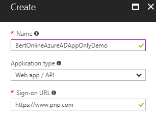
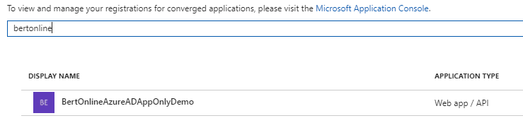
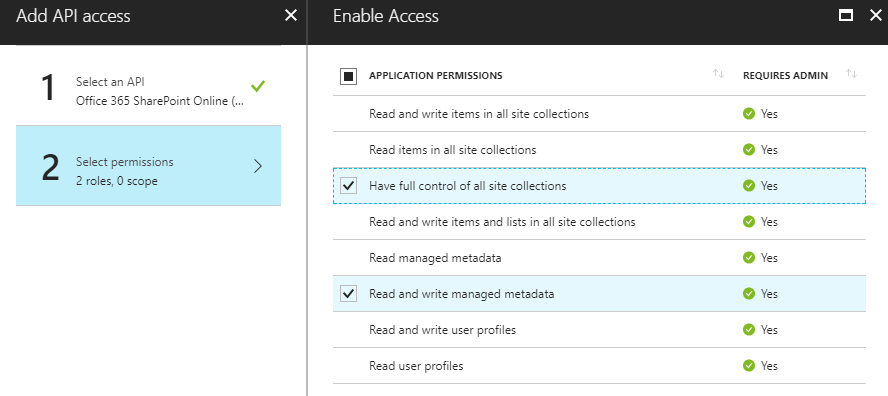
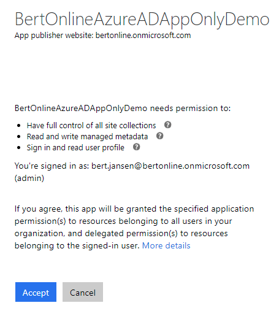

# <a name="granting-access-via-azure-ad-app-only"></a>Предоставление доступа с помощью Azure AD только для приложений
При использовании SharePoint Online можно определять приложения в Azure AD и эти приложения могут быть предоставлены разрешения для SharePoint, но и для всех других служб в Office 365. Эта модель является предпочтительным в случае, если вы используете SharePoint Online, если вы используете SharePoint необходимо использовать модель SharePoint только через локальную основе Azure ACS описанные [здесь](security-apponly-azureacs.md "ссылка на статью только приложения Azure ACS").

## <a name="setting-up-an-azure-ad-app-for-app-only-access"></a>Настройка приложения Azure AD для доступа только для приложений
В Azure AD при выполнении только приложения обычно используется сертификат для запроса доступа: отправляя сертификата и его закрытого ключа можно использовать приложение и разрешения для приложения. Шаги, описанные ниже описывают настройки этой модели.

Теперь все готово для настройки приложения Azure AD для вызова SharePoint Online с маркером только приложения. Для этого необходимо создать и настроить самозаверяющий сертификат X.509, который будет использоваться для проверки подлинности приложения с Azure AD, во время разрешения на запрос маркера доступа приложения только. Сначала необходимо создать самозаверяющий сертификат X.509, который может быть создан с помощью средства makecert.exe, доступные в пакете SDK Windows или с помощью предоставленного сценарий PowerShell, которые не имеют зависимости makecert. С помощью скрипта PowerShell является предпочтительным и описываются в данной главе.

> [!IMPORTANT]
> Важно выполнить ниже сценарии с правами администратора.

Чтобы создать самостоятельно подпись сертификата с помощью этого сценария:

```powershell
.\Create-SelfSignedCertificate.ps1 -CommonName "MyCompanyName" -StartDate 2017-10-01 -EndDate 2019-10-01
```

> [!NOTE]
> Даты приведены в формат даты США: гггг-мм дд

Здесь можно скопировать сценарий:

```powershell
<#
.SYNOPSIS
Creates a Self Signed Certificate for use in server to server authentication
.DESCRIPTION
.EXAMPLE
PS C:\> .\Create-SelfSignedCertificate.ps1 -CommonName "MyCert" -StartDate 2015-11-21 -EndDate 2017-11-21
This will create a new self signed certificate with the common name "CN=MyCert". During creation you will be asked to provide a password to protect the private key.
.EXAMPLE
PS C:\> .\Create-SelfSignedCertificate.ps1 -CommonName "MyCert" -StartDate 2015-11-21 -EndDate 2017-11-21 -Password (ConvertTo-SecureString -String "MyPassword" -AsPlainText -Force)
This will create a new self signed certificate with the common name "CN=MyCert". The password as specified in the Password parameter will be used to protect the private key
.EXAMPLE
PS C:\> .\Create-SelfSignedCertificate.ps1 -CommonName "MyCert" -StartDate 2015-11-21 -EndDate 2017-11-21 -Force
This will create a new self signed certificate with the common name "CN=MyCert". During creation you will be asked to provide a password to protect the private key. If there is already a certificate with the common name you specified, it will be removed first.
#>
Param(

   [Parameter(Mandatory=$true)]
   [string]$CommonName,

   [Parameter(Mandatory=$true)]
   [DateTime]$StartDate,
   
   [Parameter(Mandatory=$true)]
   [DateTime]$EndDate,

   [Parameter(Mandatory=$false, HelpMessage="Will overwrite existing certificates")]
   [Switch]$Force,

   [Parameter(Mandatory=$false)]
   [SecureString]$Password
)

# DO NOT MODIFY BELOW

function CreateSelfSignedCertificate(){
    
    #Remove and existing certificates with the same common name from personal and root stores
    #Need to be very wary of this as could break something
    if($CommonName.ToLower().StartsWith("cn="))
    {
        # Remove CN from common name
        $CommonName = $CommonName.Substring(3)
    }
    $certs = Get-ChildItem -Path Cert:\LocalMachine\my | Where-Object{$_.Subject -eq "CN=$CommonName"}
    if($certs -ne $null -and $certs.Length -gt 0)
    {
        if($Force)
        {
        
            foreach($c in $certs)
            {
                remove-item $c.PSPath
            }
        } else {
            Write-Host -ForegroundColor Red "One or more certificates with the same common name (CN=$CommonName) are already located in the local certificate store. Use -Force to remove them";
            return $false
        }
    }

    $name = new-object -com "X509Enrollment.CX500DistinguishedName.1"
    $name.Encode("CN=$CommonName", 0)

    $key = new-object -com "X509Enrollment.CX509PrivateKey.1"
    $key.ProviderName = "Microsoft RSA SChannel Cryptographic Provider"
    $key.KeySpec = 1
    $key.Length = 2048 
    $key.SecurityDescriptor = "D:PAI(A;;0xd01f01ff;;;SY)(A;;0xd01f01ff;;;BA)(A;;0x80120089;;;NS)"
    $key.MachineContext = 1
    $key.ExportPolicy = 1 # This is required to allow the private key to be exported
    $key.Create()

    $serverauthoid = new-object -com "X509Enrollment.CObjectId.1"
    $serverauthoid.InitializeFromValue("1.3.6.1.5.5.7.3.1") # Server Authentication
    $ekuoids = new-object -com "X509Enrollment.CObjectIds.1"
    $ekuoids.add($serverauthoid)
    $ekuext = new-object -com "X509Enrollment.CX509ExtensionEnhancedKeyUsage.1"
    $ekuext.InitializeEncode($ekuoids)

    $cert = new-object -com "X509Enrollment.CX509CertificateRequestCertificate.1"
    $cert.InitializeFromPrivateKey(2, $key, "")
    $cert.Subject = $name
    $cert.Issuer = $cert.Subject
    $cert.NotBefore = $StartDate
    $cert.NotAfter = $EndDate
    $cert.X509Extensions.Add($ekuext)
    $cert.Encode()

    $enrollment = new-object -com "X509Enrollment.CX509Enrollment.1"
    $enrollment.InitializeFromRequest($cert)
    $certdata = $enrollment.CreateRequest(0)
    $enrollment.InstallResponse(2, $certdata, 0, "")
    return $true
}

function ExportPFXFile()
{
    if($CommonName.ToLower().StartsWith("cn="))
    {
        # Remove CN from common name
        $CommonName = $CommonName.Substring(3)
    }
    if($Password -eq $null)
    {
        $Password = Read-Host -Prompt "Enter Password to protect private key" -AsSecureString
    }
    $cert = Get-ChildItem -Path Cert:\LocalMachine\my | where-object{$_.Subject -eq "CN=$CommonName"}
    
    Export-PfxCertificate -Cert $cert -Password $Password -FilePath "$($CommonName).pfx"
    Export-Certificate -Cert $cert -Type CERT -FilePath "$CommonName.cer"
}

function RemoveCertsFromStore()
{
    # Once the certificates have been been exported we can safely remove them from the store
    if($CommonName.ToLower().StartsWith("cn="))
    {
        # Remove CN from common name
        $CommonName = $CommonName.Substring(3)
    }
    $certs = Get-ChildItem -Path Cert:\LocalMachine\my | Where-Object{$_.Subject -eq "CN=$CommonName"}
    foreach($c in $certs)
    {
        remove-item $c.PSPath
    }
}

if(CreateSelfSignedCertificate)
{
    ExportPFXFile
    RemoveCertsFromStore
}
```

Будет предложено предоставить пароль для шифрования закрытого ключа и другое. PFX-файл и. CER-файл экспортируется в текущую папку. 

Следующим шагом Регистрация приложения Azure AD в Azure Active Directory для клиентов, связанного с клиента Office 365. Для этого откройте центра администрирования Office 365 (https://portal.office.com) с помощью учетной записи пользователя члена группы «Администраторы» глобального клиента. Щелкните ссылку «Azure AD», который доступен в группе «Центра администрирования» в левой части treeview центра администрирования Office 365. На вкладке новый браузер, который будет открыт вы найдете портала управления Microsoft Azure. Если он установлен в первый раз, доступ к портала управления Azure с помощью учетной записи, необходимо зарегистрировать новую подписку Azure, предоставляя сведения и данные о банковской карте для применения оплаты. Но не выполнения для воспроизведения с Azure AD и для регистрации приложения Office 365 будет не что-либо оплаты. На самом деле это бесплатное возможности. Один раз возможность доступа к портала управления Azure, выберите в разделе «Active Directory» и выберите параметр «Регистрации приложения». В разделе ниже для получения дополнительной информации.


На вкладке «Регистрации приложения» вы найдете список Azure AD приложения, зарегистрированные в вашего клиента. Нажмите кнопку «Новый регистрации приложения» в левой верхней части blade. После этого укажите имя для вашего приложения, выберите параметр «веб-приложение / API» и заполните поля в «Входа URL-адрес» URL-адрес (не существует, например https://www.pnp.com). Щелкните «Создать», чтобы создать приложение Azure AD.



Один раз созданные необходимо выполнять поиск еще раз приложения Azure AD и откройте его:



> [!IMPORTANT]
> После открытия приложения скопируйте код приложения, как он потребуется позже.

Теперь щелкните «Необходимые разрешения» и нажмите кнопку «Добавить» будет отображаться новые blade. Необходимо настроить следующие разрешения:
 - Office 365 SharePoint Online (разрешений приложения)
     - Чтение и запись управляемых метаданных
     - Полный доступ все семейства веб-сайтов

Приложение» разрешения «— это списки предоставленных приложению при запуске приложения только.



Последний этап «подключение» сертификат, созданный ранее в приложение. Необходимо выполнить сценарий Get-SelfSignedCertificateInformation.ps1. 

```powershell
.\Get-SelfSignedCertificateInformation.ps1 | clip
```

Здесь можно скопировать сценарий:

```powershell
$certPath = Read-Host "Enter certificate path (.cer)"
$cert = New-Object System.Security.Cryptography.X509Certificates.X509Certificate2
$cert.Import($certPath)
$rawCert = $cert.GetRawCertData()
$base64Cert = [System.Convert]::ToBase64String($rawCert)
$rawCertHash = $cert.GetCertHash()
$base64CertHash = [System.Convert]::ToBase64String($rawCertHash)
$KeyId = [System.Guid]::NewGuid().ToString()

$keyCredentials = 
'"keyCredentials": [
    {
      "customKeyIdentifier": "'+ $base64CertHash + '",
      "keyId": "' + $KeyId + '",
      "type": "AsymmetricX509Cert",
      "usage": "Verify",
      "value":  "' + $base64Cert + '"
     }
  ],'
$keyCredentials

Write-Host "Certificate Thumbprint:" $cert.Thumbprint
```

Будет необходимо указать полный путь. Файл CER, созданный при создании сертификата для конфигурации AppOnly контекста. Команда будет копировать в буфер обмена фрагмент JSON, который будет использоваться в Предстоящие действия. Вставка содержимого буфера обмена в надежном месте (например, новым новый файл "Блокнот").

Вернитесь в Azure AD приложение, созданное на предыдущем шаге и нажмите кнопку «Манифест» в верхней части blade, а затем нажмите кнопку Изменить ". Поиск свойства **keyCredentials** и замените фрагмент, созданный перед, это может быть следующим:

```JSON
  "keyCredentials": [
    {
      "customKeyIdentifier": "<$base64CertHash>",
      "keyId": "<$KeyId>",
      "type": "AsymmetricX509Cert",
      "usage": "Verify",
      "value":  "<$base64Cert>"
     }
  ],
```

После завершения этого шага нажмите кнопку Сохранить.

В этом примере разрешения приложения Sites.FullControl.All требуются разрешения администратора в клиент перед его можно использовать. Создайте URL-адрес согласия следующим образом:

```
https://login.microsoftonline.com/<tenant>/adminconsent?client_id=<application id>&state=<something>
```

С помощью идентификатора приложения из Мое приложение Azure AD и соглашаетесь приложения из моих contoso.onmicrosoft.com клиента, URL-адрес выглядит следующим образом:

```
https://login.microsoftonline.com/contoso.onmicrosoft.com/adminconsent?client_id=6e4433ca-7011-4a11-85b6-1195b0114fea&state=12345
```

Просмотра для созданного URL-адреса и вход как администратор клиента и разрешения для приложения. Вы видите на экране подтверждения показывать имя приложения, а также области разрешений, которые вы настроили.



> [!NOTE]
> После нажатия кнопки «Accept» будет перенаправлен на вход URL-адрес указан более ранних (https://www.pnp.com в нашем случае).. .if, недопустимый URL-адрес перенаправления завершится с ошибкой, но предоставление было выполнено успешно, поэтому nothing заниматься.


## <a name="using-this-principal-in-your-application-using-the-sharepoint-pnp-sites-core-library"></a>Использование участника в приложении с помощью библиотеки PnP основных сайтах SharePoint
На первом шаге, добавьте пакет nuget библиотеки SharePointPnPCoreOnline: https://www.nuget.org/packages/SharePointPnPCoreOnline. После этого можно использовать ниже конструкцию кода:

```C#
using OfficeDevPnP.Core;
using System;

namespace AzureADCertAuth
{
    class Program
    {
        static void Main(string[] args)
        {
            string siteUrl = "https://contoso.sharepoint.com/sites/demo";
            using (var cc = new AuthenticationManager().GetAzureADAppOnlyAuthenticatedContext(siteUrl, "<application id>", "contoso.onmicrosoft.com", @"C:\BertOnlineAzureADAppOnly.pfx", "<password>"))
            {
                cc.Load(cc.Web, p => p.Title);
                cc.ExecuteQuery();
                Console.WriteLine(cc.Web.Title);
            };
        }
    }
}
```

## <a name="faq"></a>Вопросы и ответы
### <a name="can-i-use-other-means-besides-certificates-for-realizing-app-only-access-for-my-azure-ad-app"></a>Можно использовать другие означает, что помимо сертификаты для реализации доступ только для приложений для приложения Azure AD
Нет, все другие параметры являются заблокированных и по SharePoint Online и приведет к сообщение об отказе в доступе.

