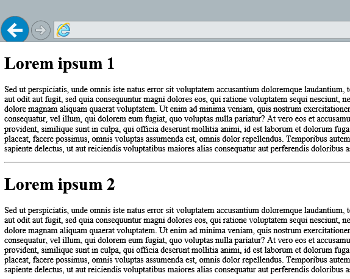

# <a name="access-sharepoint-data-from-add-ins-using-the-cross-domain-library"></a><span data-ttu-id="46211-103">Обращение к данным SharePoint из надстроек с помощью междоменной библиотеки</span><span class="sxs-lookup"><span data-stu-id="46211-103">Access SharePoint data from add-ins using the cross-domain library</span></span>

<span data-ttu-id="46211-104">При создании надстроек SharePoint обычно требуется внедрять данные из различных источников.</span><span class="sxs-lookup"><span data-stu-id="46211-104">When you build SharePoint Add-ins, you usually have to incorporate data from various sources.</span></span> <span data-ttu-id="46211-105">Однако из [соображений безопасности](https://msdn.microsoft.com/library/cc709423.aspx) защитные механизмы блокируют одновременный обмен данными с несколькими доменами.</span><span class="sxs-lookup"><span data-stu-id="46211-105">But for [security reasons](https://msdn.microsoft.com/library/cc709423.aspx), blocking mechanisms prevent communication with more than one domain at a time.</span></span> <span data-ttu-id="46211-106">Такие механизмы реализованы в большинстве браузеров, что затрудняет или делает невозможным вызов ресурсов в разных доменах.</span><span class="sxs-lookup"><span data-stu-id="46211-106">These security mechanisms are implemented in most browsers, making it difficult or impossible to accomplish client-side calls across domains.</span></span>

<span data-ttu-id="46211-107">Когда пользователь запрашивает страницу из домена надстройки, обмен данными на стороне клиента привязывается к этому домену.</span><span class="sxs-lookup"><span data-stu-id="46211-107">When a user requests a page from your add-in domain, the client-side communication is bound only to that domain.</span></span> <span data-ttu-id="46211-108">Надстройка может вызывать со страницы только другие ресурсы в том же домене.</span><span class="sxs-lookup"><span data-stu-id="46211-108">Your add-in can issue client-side calls from the page only to other resources in the same domain.</span></span> <span data-ttu-id="46211-109">Однако для выполнения своих функций надстройкам обычно необходимы ресурсы из других доменов, например домена SharePoint.</span><span class="sxs-lookup"><span data-stu-id="46211-109">However, add-ins usually require resources from other domains, such as the SharePoint domain, to fulfill their scenarios.</span></span> <span data-ttu-id="46211-110">Запросы ресурсов в домене SharePoint, реализованные в коде страницы, блокируются браузером.</span><span class="sxs-lookup"><span data-stu-id="46211-110">In the code on your page, you may try to issue a request to the SharePoint domain, which is blocked by the browser.</span></span> <span data-ttu-id="46211-111">Как правило, при этом возникает ошибка **Отказано в доступе**.</span><span class="sxs-lookup"><span data-stu-id="46211-111">You usually see an **Access is denied** error.</span></span> <span data-ttu-id="46211-112">Она не означает, что у вас нет разрешений на запрашиваемые ресурсы. Скорее всего, вы просто не можете их запрашивать.</span><span class="sxs-lookup"><span data-stu-id="46211-112">The error doesn't imply that you don't have permissions to the requested resources but, most likely, you can't even issue a request to the mentioned resources.</span></span>
 
<span data-ttu-id="46211-113">При использовании междоменной библиотеки веб-страницы надстройки могут получать доступ к данным на доменах надстройки и SharePoint.</span><span class="sxs-lookup"><span data-stu-id="46211-113">When you use the cross-domain library, the webpages in your add-in can access data in your add-in domain and the SharePoint domain.</span></span> <span data-ttu-id="46211-114">Междоменная библиотека — это клиентская альтернатива в форме файла JavaScript (SP.RequestExecutor.js), размещенного на веб-сайте SharePoint, на который вы можете ссылаться в своей удаленной надстройке.</span><span class="sxs-lookup"><span data-stu-id="46211-114">Cross-domain library: A client-side alternative in the form of a JavaScript file (SP.RequestExecutor.js) hosted in the SharePoint website that you can reference in your remote add-in.</span></span> <span data-ttu-id="46211-115">Междоменная библиотека позволяет взаимодействовать с несколькими доменами на удаленной странице надстройки через прокси-сервер.</span><span class="sxs-lookup"><span data-stu-id="46211-115">The cross-domain library allows you to interact with more than one domain in your remote add-in page through a proxy.</span></span> <span data-ttu-id="46211-116">Это отличный вариант, если вы предпочитаете, чтобы код надстройки выполнялся в клиенте, а не на сервере, или если между SharePoint и удаленной инфраструктурой существуют препятствия для подключения, такие как брандмауэры.</span><span class="sxs-lookup"><span data-stu-id="46211-116">This is a good option if you prefer your add-in code to run in the client rather than in the server, or if there are connectivity barriers, such as firewalls, between SharePoint and your remote infrastructure.</span></span> 

<span data-ttu-id="46211-117">Вы можете получать доступ к данным на хост-сайте, например спискам, с которыми пользователи работают вне надстройки.</span><span class="sxs-lookup"><span data-stu-id="46211-117">You can access data in the host web—for example, you can access lists that end users interact with regardless of your add-in.</span></span> <span data-ttu-id="46211-118">Вы также можете получать доступ к данным на сайте надстройки, например специально подготовленным для нее спискам.</span><span class="sxs-lookup"><span data-stu-id="46211-118">Or you can access data in the add-in web, such as lists specifically provisioned for your add-in.</span></span> <span data-ttu-id="46211-119">Надстройки также могут получать доступ к другим сайтам и семействам веб-сайтов при наличии разрешения на уровне клиента и развертывании путем пакетной установки с помощью каталога надстроек.</span><span class="sxs-lookup"><span data-stu-id="46211-119">Add-ins can also access other site collections and websites as long as the add-in has tenant-scoped permissions and it has been deployed as a batch installation by using the add-in catalog.</span></span>
 
> [!NOTE] 
> <span data-ttu-id="46211-120">В этой статье под **доменом надстройки** подразумевается домен, на котором размещаются страницы надстройки.</span><span class="sxs-lookup"><span data-stu-id="46211-120">In this topic, **add-in domain** refers to the domain that hosts the add-in pages.</span></span> <span data-ttu-id="46211-121">Это может быть домен удаленного веб-приложения в надстройке с размещением у поставщика, но страницы надстройки также могут находиться в SharePoint на сайте надстройки и вызывать домен хост-сайта.</span><span class="sxs-lookup"><span data-stu-id="46211-121">Note  In this topic,  add-in domain refers to the domain that hosts the add-in pages. This can be the domain of a remote web application in a provider-hosted, but add-in pages can also be on SharePoint in the add-in web and make calls to the host web domain. In the latter scenario, the add-in domain is the domain of the add-in web.</span></span> <span data-ttu-id="46211-122">В последнем случае доменом надстройки будет домен ее сайта.</span><span class="sxs-lookup"><span data-stu-id="46211-122">In the latter scenario, the add-in domain is the domain of the add-in web.</span></span>

<span data-ttu-id="46211-123">В главном примере из этой статьи показано, как создать надстройку, которая считывает данные с сайта надстройки и отображает их на веб-странице.</span><span class="sxs-lookup"><span data-stu-id="46211-123">The main example in this article shows how to build an add-in that reads data on the add-in web and displays it in a webpage. The  Next steps section shows more scenarios that build on top of the main example.</span></span> <span data-ttu-id="46211-124">В разделе [Дальнейшие действия](#SP15Accessdatafromremoteapp_Next) показаны другие сценарии, которые основываются на главном примере.</span><span class="sxs-lookup"><span data-stu-id="46211-124">The [Next steps](#SP15Accessdatafromremoteapp_Next) section shows more scenarios that build on top of the main example.</span></span>
 

<span data-ttu-id="46211-125"><a name="SP15Accessdatafromremoteapp_Prereq"> </a></span><span class="sxs-lookup"><span data-stu-id="46211-125"></span></span>

## <a name="prerequisites"></a><span data-ttu-id="46211-126">Необходимые компоненты</span><span class="sxs-lookup"><span data-stu-id="46211-126">Prerequisites</span></span>

<span data-ttu-id="46211-127">Чтобы воспользоваться примерами, приведенными в этой статье, вам потребуется следующее:</span><span class="sxs-lookup"><span data-stu-id="46211-127">To follow the examples in this article, you need the following:</span></span>

- <span data-ttu-id="46211-128">Среда [Visual Studio](https://docs.microsoft.com/ru-RU/visualstudio/install/install-visual-studio), установленная либо удаленно, либо на одном компьютере с SharePoint.</span><span class="sxs-lookup"><span data-stu-id="46211-128">[Visual Studio 2012](https://docs.microsoft.com/ru-RU/visualstudio/install/install-visual-studio) installed either remotely or on the computer where you installed SharePoint.</span></span>
    
- <span data-ttu-id="46211-129">Visual Studio включает **Инструменты разработчика Microsoft Office для Visual Studio**.</span><span class="sxs-lookup"><span data-stu-id="46211-129">Visual Studio includes the **Microsoft Office Developer Tools for Visual Studio**.</span></span> <span data-ttu-id="46211-130">Иногда выпуск новой версии этих инструментов не совпадает с выходом обновлений Visual Studio.</span><span class="sxs-lookup"><span data-stu-id="46211-130">Sometimes a version of the tools is released between updates of Visual Studio.</span></span> <span data-ttu-id="46211-131">Чтобы убедиться, что у вас установлена последняя версия этих инструментов, запустите [установщик набора "Инструменты разработчика Office для Visual Studio 2013"](http://aka.ms/OfficeDevToolsForVS2013) или [установщик набора "Инструменты разработчика Office для Visual Studio 2015"](http://aka.ms/OfficeDevToolsForVS2015).</span><span class="sxs-lookup"><span data-stu-id="46211-131">To be sure that you have the latest version of the tools, run the [installer for Office Developer Tools for Visual Studio 2013](http://aka.ms/OfficeDevToolsForVS2013), or the [installer for Office Developer Tools for Visual Studio 2015](http://aka.ms/OfficeDevToolsForVS2015).</span></span>  
    
- <span data-ttu-id="46211-132">Локальная среда разработки SharePoint.</span><span class="sxs-lookup"><span data-stu-id="46211-132">An on-premises SharePoint development environment.</span></span> <span data-ttu-id="46211-133">[Как настроить](set-up-an-on-premises-development-environment-for-sharepoint-add-ins.md)</span><span class="sxs-lookup"><span data-stu-id="46211-133">An on-premises SharePoint development environment. See  [Set up an on-premises development environment for SharePoint Add-ins](set-up-an-on-premises-development-environment-for-sharepoint-add-ins.md).</span></span>


<span data-ttu-id="46211-134"><a name="SP15Accessdatafromremoteapp_Codeexample"> </a></span><span class="sxs-lookup"><span data-stu-id="46211-134"></span></span>

## <a name="read-data-on-the-add-in-web-using-the-cross-domain-library"></a><span data-ttu-id="46211-135">Чтение данных с сайта надстройки с помощью междоменной библиотеки</span><span class="sxs-lookup"><span data-stu-id="46211-135">Read data on the add-in web using the cross-domain library</span></span>

<span data-ttu-id="46211-136">В этом примере за пределами SharePoint размещена простая страница, которая использует конечную точку REST для чтения данных на веб-сайте SharePoint (сайте надстройки).</span><span class="sxs-lookup"><span data-stu-id="46211-136">In this example, there is a simple page hosted outside of SharePoint that uses a Representational State Transfer (REST) endpoint to read data in a SharePoint website (the add-in web). Since the cross-domain library requires an add-in web, it makes sense to start with this scenario.</span></span> <span data-ttu-id="46211-137">Так как междоменной библиотеке необходим сайт надстройки, будет логично начать с этого сценария.</span><span class="sxs-lookup"><span data-stu-id="46211-137">Because the cross-domain library requires an add-in web, it makes sense to start with this scenario.</span></span>

<span data-ttu-id="46211-138">Для чтения данных с сайта надстройки вы должны сделать следующее:</span><span class="sxs-lookup"><span data-stu-id="46211-138">To read data from the add-in web, you must do the following:</span></span>

1. <span data-ttu-id="46211-139">Создайте надстройку SharePoint и веб-проекты.</span><span class="sxs-lookup"><span data-stu-id="46211-139">Create a SharePoint Add-in and web projects.</span></span>

2. <span data-ttu-id="46211-140">Создайте элементы списка на сайте надстройки.</span><span class="sxs-lookup"><span data-stu-id="46211-140">Create list items on the add-in web</span></span> <span data-ttu-id="46211-141">Этот шаг также гарантирует создание сайта при развертывании надстройки.</span><span class="sxs-lookup"><span data-stu-id="46211-141">Create list items in the add-in web. This step also ensures that an add-in web is created when users deploy the add-in.</span></span>

3. <span data-ttu-id="46211-142">Создайте страницу надстройки, которая использует междоменную библиотеку для чтения элементов списка.</span><span class="sxs-lookup"><span data-stu-id="46211-142">Create an add-in page that uses the cross-domain library to read the list items.</span></span>
    
<span data-ttu-id="46211-143">Ниже показана веб-страница, на которой отображаются данные с сайта надстройки.</span><span class="sxs-lookup"><span data-stu-id="46211-143">Figure 2 shows a webpage that displays the data on the add-in web.</span></span>


 

### <a name="to-create-a-sharepoint-add-in-and-web-projects"></a><span data-ttu-id="46211-145">Создание надстройки SharePoint и веб-проектов</span><span class="sxs-lookup"><span data-stu-id="46211-145">To create a SharePoint Add-in and web projects</span></span>

1. <span data-ttu-id="46211-146">Откройте Visual Studio от имени администратора.</span><span class="sxs-lookup"><span data-stu-id="46211-146">Open Visual Studio 2015 as administrator.</span></span> <span data-ttu-id="46211-147">Для этого щелкните правой кнопкой мыши значок Visual Studio в меню **Пуск** и выберите **Запуск от имени администратора**.</span><span class="sxs-lookup"><span data-stu-id="46211-147">(To do this, right-click the Visual Studio 2015 icon on the **Start** menu, and select **Run as administrator**.)</span></span>
    
2. <span data-ttu-id="46211-148">Создайте новый проект с помощью шаблона **Надстройка для SharePoint**.</span><span class="sxs-lookup"><span data-stu-id="46211-148">Create a new project using the  **Add-in for SharePoint** template.</span></span> <span data-ttu-id="46211-149">Шаблон **Надстройка для SharePoint** в Visual Studio находится в области **Шаблоны** > **Visual C#** > **Office SharePoint** > **Надстройки**.</span><span class="sxs-lookup"><span data-stu-id="46211-149">The **Add-in for SharePoint** template in Visual Studio is located under **Templates** > **Visual C#** > **Office SharePoint** > **Add-ins**.</span></span>
     
3. <span data-ttu-id="46211-150">Укажите URL-адрес веб-сайта SharePoint, который требуется использовать для отладки.</span><span class="sxs-lookup"><span data-stu-id="46211-150">Provide the SharePoint website URL that you want to use for debugging.</span></span>   
 
4. <span data-ttu-id="46211-151">Выберите для надстройки вариант размещения **Размещено у поставщика**.</span><span class="sxs-lookup"><span data-stu-id="46211-151">Select **Provider-hosted** as the hosting option for your add-in.</span></span>
    
    > [!NOTE] 
    > <span data-ttu-id="46211-152">Вы также можете использовать междоменную библиотеку в надстройке с размещением в SharePoint.</span><span class="sxs-lookup"><span data-stu-id="46211-152">You can also use the cross-domain library in a SharePoint-hosted add-in.</span></span> <span data-ttu-id="46211-153">Однако страница надстройки с размещением в SharePoint уже находится на ее сайте, то есть для чтения элементов списка не нужна междоменная библиотека.</span><span class="sxs-lookup"><span data-stu-id="46211-153">However, in a SharePoint-hosted add-in, the add-in page is already on the add-in web, in which case it wouldn't need the cross-domain library to read the list items.</span></span> <span data-ttu-id="46211-154">Пример надстройки с размещением в SharePoint, считывающей данные с хост-сайта, см. на странице [Использование междоменной библиотеки в надстройке с размещением в SharePoint (REST)](https://code.msdn.microsoft.com/SharePoint-2013-Use-the-00c37814) или в разделе [Доступ к данным с хост-сайта](#SP15Accessdatafromremoteapp_Hostweb) далее в этой статье.</span><span class="sxs-lookup"><span data-stu-id="46211-154">Note  You can also use the cross-domain library in a SharePoint-hosted add-in. However, in a SharePoint-hosted add-in the add-in page is already in the add-in web, in which case it wouldn't need the cross-domain library to read the list items. For a SharePoint-hosted add-in sample that reads data in the host web, see  [Use the cross-domain library in a SharePoint-hosted add-in (REST)](https://code.msdn.microsoft.com/SharePoint-2013-Use-the-00c37814) or see [Access data from the host web](#SP15Accessdatafromremoteapp_Hostweb) later in this article.</span></span>


### <a name="to-create-list-items-on-the-add-in-web"></a><span data-ttu-id="46211-155">Создание элементов списка на сайте надстройки</span><span class="sxs-lookup"><span data-stu-id="46211-155">To create a list on the add-in web</span></span>

1. <span data-ttu-id="46211-156">Щелкните правой кнопкой мыши проект надстройки SharePoint в **обозревателе решений**.</span><span class="sxs-lookup"><span data-stu-id="46211-156">Right-click the SharePoint Add-in project in **Solution Explorer**.</span></span> <span data-ttu-id="46211-157">Выберите **Добавить** > **Новый элемент**.</span><span class="sxs-lookup"><span data-stu-id="46211-157">Select **Add** > **New Item**.</span></span>    
 
2. <span data-ttu-id="46211-158">Выберите **Элементы Visual C#** > **Office/SharePoint** > **Список**.</span><span class="sxs-lookup"><span data-stu-id="46211-158">Select **Visual C# Items** > **Office/SharePoint** > **List**.</span></span> <span data-ttu-id="46211-159">Укажите имя списка **Объявления**.</span><span class="sxs-lookup"><span data-stu-id="46211-159">Choose  Visual C# ItemsOffice/SharePointList. Set the name of your list to  **Announcements**.</span></span>

3. <span data-ttu-id="46211-160">Дважды щелкните узлы **Объявления** > **Elements.xml**.</span><span class="sxs-lookup"><span data-stu-id="46211-160">Double-click **Announcements** > **Elements.xml**.</span></span> <span data-ttu-id="46211-161">Вставьте приведенные ниже узлы XML в качестве дочерних объектов элемента **ListInstance**.</span><span class="sxs-lookup"><span data-stu-id="46211-161">Double click Announcements**>**Elements.xml. Paste the following XML nodes as children of the ListInstance element.</span></span>
        
    ```XML
    <Data>
        <Rows>
            <Row>
                <Field Name="Title">Lorem ipsum 1</Field>
                <Field Name="Body">Sed ut perspiciatis, unde omnis iste...</Field>
            </Row>
            <Row>
                <Field Name="Title">Lorem ipsum 2</Field>
                <Field Name="Body">Sed ut perspiciatis, unde omnis iste...</Field>
            </Row>
        </Rows>
    </Data>
    ```


### <a name="to-create-an-add-in-page-that-uses-the-cross-domain-library"></a><span data-ttu-id="46211-162">Создание страницы надстройки, использующей междоменную библиотеку</span><span class="sxs-lookup"><span data-stu-id="46211-162">To create an add-in page that uses the cross-domain library</span></span>

1. <span data-ttu-id="46211-163">Дважды щелкните файл **Default.aspx** в веб-проекте в **обозревателе решений**.</span><span class="sxs-lookup"><span data-stu-id="46211-163">Double-click **Default.aspx** in the web project in **Solution Explorer**.</span></span>
    
2. <span data-ttu-id="46211-p117">Скопируйте следующий код и вставьте его в файл Default.aspx. Этот код выполняет следующие задачи.</span><span class="sxs-lookup"><span data-stu-id="46211-p117">Copy the following code and paste it in the Default.aspx file. The code performs the following tasks:</span></span>
    
    - <span data-ttu-id="46211-166">Загружает библиотеку jQuery из сети CDN Майкрософт.</span><span class="sxs-lookup"><span data-stu-id="46211-166">Loads the jQuery library from the Microsoft CDN.</span></span>
        
    - <span data-ttu-id="46211-167">Задает заполнитель для результатов.</span><span class="sxs-lookup"><span data-stu-id="46211-167">Provides a placeholder for the result.</span></span>
        
    - <span data-ttu-id="46211-168">Извлекает URL-адрес сайта надстройки из строки запроса.</span><span class="sxs-lookup"><span data-stu-id="46211-168">Extracts the add-in web URL from the query string.</span></span>
        
    - <span data-ttu-id="46211-169">Загружает междоменную библиотеку JavaScript с помощью функции **getScript** в jQuery.</span><span class="sxs-lookup"><span data-stu-id="46211-169">Loads the cross-domain library JavaScript using the  **getScript** function in jQuery.</span></span>
        
        <span data-ttu-id="46211-170">Функция загружает необходимые ресурсы и переходит к указанной функции, обеспечивая загрузку междоменной библиотеке и предоставляя к ней доступ последующему коду.</span><span class="sxs-lookup"><span data-stu-id="46211-170">The function loads the required resources and then continues to the specified function, ensuring that the cross-domain library is loaded and available to use by the subsequent code.</span></span>
        
    - <span data-ttu-id="46211-p118">Создает экземпляр объекта **RequestExecutor**. По умолчанию RequestExecutor использует сайт надстройки как сайт контекста.</span><span class="sxs-lookup"><span data-stu-id="46211-p118">Instantiates the **RequestExecutor** object. By default, RequestExecutor uses the add-in web as the context site.</span></span>
        
        > [!NOTE] 
        > <span data-ttu-id="46211-173">(REST) или объект (JSOM).</span><span class="sxs-lookup"><span data-stu-id="46211-173">(REST) or object (JSOM).</span></span> <span data-ttu-id="46211-174">Дополнительные сведения об AppContextSite см. в разделе [Доступ к данным с хост-сайта](#SP15Accessdatafromremoteapp_Hostweb) далее в этой статье.</span><span class="sxs-lookup"><span data-stu-id="46211-174">To learn more about AppContextSite, see [Access data from the host web](#SP15Accessdatafromremoteapp_Hostweb) later in this article.</span></span>

    - <span data-ttu-id="46211-175">Вызывает конечную точку REST с элементами списка.</span><span class="sxs-lookup"><span data-stu-id="46211-175">Issues a REST call to the list items endpoint.</span></span>
        
    - <span data-ttu-id="46211-176">Обрабатывает успешное выполнение с отображением элементов списка на веб-странице.</span><span class="sxs-lookup"><span data-stu-id="46211-176">Handles successful completion, displaying the list items on the webpage.</span></span>   
    
    - <span data-ttu-id="46211-177">Обрабатывает ошибки с отображением сообщения об ошибке на веб-странице.</span><span class="sxs-lookup"><span data-stu-id="46211-177">Handles errors, displaying the error message on the webpage.</span></span>
    
 

```HTML
  
<html>
    <head>
        <title>Cross-domain sample</title>
    </head>
    <body>
        <!-- This is the placeholder for the announcements -->
        <div id="renderAnnouncements"></div>
        <script 
            type="text/javascript" 
            src="//ajax.aspnetcdn.com/ajax/jQuery/jquery-1.7.2.min.js">
        </script>
        <script type="text/javascript">
          var hostweburl;
          var appweburl;

          // Load the required SharePoint libraries
          $(document).ready(function () {
            //Get the URI decoded URLs.
            hostweburl =
                decodeURIComponent(
                    getQueryStringParameter("SPHostUrl")
            );
            appweburl =
                decodeURIComponent(
                    getQueryStringParameter("SPAppWebUrl")
            );

            // resources are in URLs in the form:
            // web_url/_layouts/15/resource
            var scriptbase = hostweburl + "/_layouts/15/";

            // Load the js files and continue to the successHandler
            $.getScript(scriptbase + "SP.RequestExecutor.js", execCrossDomainRequest);
          });

          // Function to prepare and issue the request to get
          //  SharePoint data
          function execCrossDomainRequest() {
            // executor: The RequestExecutor object
            // Initialize the RequestExecutor with the add-in web URL.
            var executor = new SP.RequestExecutor(appweburl);

            // Issue the call against the add-in web.
            // To get the title using REST we can hit the endpoint:
            //      appweburl/_api/web/lists/getbytitle('listname')/items
            // The response formats the data in the JSON format.
            // The functions successHandler and errorHandler attend the
            //      sucess and error events respectively.
            executor.executeAsync(
                {
                  url:
                      appweburl +
                      "/_api/web/lists/getbytitle('Announcements')/items",
                  method: "GET",
                  headers: { "Accept": "application/json; odata=verbose" },
                  success: successHandler,
                  error: errorHandler
                }
            );
          }

          // Function to handle the success event.
          // Prints the data to the page.
          function successHandler(data) {
            var jsonObject = JSON.parse(data.body);
            var announcementsHTML = "";

            var results = jsonObject.d.results;
            for (var i = 0; i < results.length; i++) {
              announcementsHTML = announcementsHTML +
                  "<p><h1>" + results[i].Title +
                  "</h1>" + results[i].Body +
                  "</p><hr>";
            }

            document.getElementById("renderAnnouncements").innerHTML =
                announcementsHTML;
          }

          // Function to handle the error event.
          // Prints the error message to the page.
          function errorHandler(data, errorCode, errorMessage) {
            document.getElementById("renderAnnouncements").innerText =
                "Could not complete cross-domain call: " + errorMessage;
          }

          // Function to retrieve a query string value.
          // For production purposes you may want to use
          //  a library to handle the query string.
          function getQueryStringParameter(paramToRetrieve) {
            var params =
                document.URL.split("?")[1].split("&amp;");
            var strParams = "";
            for (var i = 0; i < params.length; i = i + 1) {
              var singleParam = params[i].split("=");
              if (singleParam[0] == paramToRetrieve)
                return singleParam[1];
            }
          }
        </script>
    </body>
</html>
```

<br/>

### <a name="to-build-and-run-the-solution"></a><span data-ttu-id="46211-178">Сборка и запуск решения</span><span class="sxs-lookup"><span data-stu-id="46211-178">To build and run the solution</span></span>

1. <span data-ttu-id="46211-179">Нажмите клавишу F5.</span><span class="sxs-lookup"><span data-stu-id="46211-179">Select the F5 key.</span></span>
    
    > [!NOTE] 
    > <span data-ttu-id="46211-180">При нажатии клавиши F5 Visual Studio выполняет сборку решения, развертывает надстройку и открывает для нее страницу разрешений.</span><span class="sxs-lookup"><span data-stu-id="46211-180">Note  When you press F5, Visual Studio builds the solution, deploys the add-in, and opens the permissions page for the add-in.</span></span>

2. <span data-ttu-id="46211-181">Нажмите кнопку **Доверять**.</span><span class="sxs-lookup"><span data-stu-id="46211-181">Select the **Trust It** button.</span></span>    
 
3. <span data-ttu-id="46211-182">Выберите значок надстройки на странице **Содержимое сайта**.</span><span class="sxs-lookup"><span data-stu-id="46211-182">Choose the add-in icon on the  **Site Contents** page.</span></span>
    
<span data-ttu-id="46211-183">Вы можете скачать примеры кода по теме на следующих страницах:</span><span class="sxs-lookup"><span data-stu-id="46211-183">If you prefer downloadable code samples, you can get the following from the code gallery:</span></span>

- [<span data-ttu-id="46211-184">SharePoint-Add-in-REST-OData-CrossDomain</span><span class="sxs-lookup"><span data-stu-id="46211-184">SharePoint-Add-in-REST-OData-CrossDomain</span></span>](https://github.com/OfficeDev/SharePoint-Add-in-REST-OData-CrossDomain)
- <span data-ttu-id="46211-185">[SharePoint-Add-in-JSOM-CrossDomain](https://github.com/OfficeDev/SharePoint-Add-in-JSOM-CrossDomain).</span><span class="sxs-lookup"><span data-stu-id="46211-185">[SharePoint-Add-in-JSOM-CrossDomain](https://github.com/OfficeDev/SharePoint-Add-in-JSOM-CrossDomain)</span></span>
 

#### <a name="troubleshooting-the-solution"></a><span data-ttu-id="46211-186">Устранение неполадок в решении</span><span class="sxs-lookup"><span data-stu-id="46211-186">Table 2. Troubleshooting the solution</span></span>


|<span data-ttu-id="46211-187">**Сообщение об ошибке**</span><span class="sxs-lookup"><span data-stu-id="46211-187">**If you see this error message…**</span></span>|<span data-ttu-id="46211-188">**Возможное решение**</span><span class="sxs-lookup"><span data-stu-id="46211-188">**Try…**</span></span>|
|:-----|:-----|
|<span data-ttu-id="46211-189">"К сожалению, у нас возникли проблемы с доступом к сайту". Кроме того, появляется кнопка, предназначенная для исправления ошибки, но она не устраняет проблему.</span><span class="sxs-lookup"><span data-stu-id="46211-189">Error message: Sorry, we had some trouble accessing your site.There is also a button to fix the error, but it doesn't correct the problem.</span></span>|<span data-ttu-id="46211-190">Возможно, вы столкнулись с проблемой с зонами безопасности в Internet Explorer. См. статью [Работа с междоменной библиотекой в различных зонах безопасности Internet Explorer в надстройках SharePoint](work-with-the-cross-domain-library-across-different-internet-explorer-security-z.md).</span><span class="sxs-lookup"><span data-stu-id="46211-190">You may have hit a known problem with security zones in Internet Explorer, see  [Work with the cross-domain library across different Internet Explorer security zones in SharePoint Add-ins](work-with-the-cross-domain-library-across-different-internet-explorer-security-z.md).</span></span>|
|<span data-ttu-id="46211-191">"Ваш браузер не поддерживает необходимые функциональные возможности.</span><span class="sxs-lookup"><span data-stu-id="46211-191">"The required functionalities are not supported by your browser.</span></span> <span data-ttu-id="46211-192">Вам следует использовать IE 8 или более поздней версии либо другой современный браузер.</span><span class="sxs-lookup"><span data-stu-id="46211-192">Please make sure you are using IE 8 or above, or other modern browser.</span></span> <span data-ttu-id="46211-193">Убедитесь в том, что для мета-тега X-UA-Compatible установлено значение IE=8 или выше".</span><span class="sxs-lookup"><span data-stu-id="46211-193">Please make sure the 'X-UA-Compatible' meta tag is set to be 'IE=8' or above."</span></span>|<span data-ttu-id="46211-194">Для использования междоменной библиотеке необходим режим документов **IE8** или более поздней версии.</span><span class="sxs-lookup"><span data-stu-id="46211-194">The cross-domain library requires a document mode of **IE8** or later.</span></span> <span data-ttu-id="46211-195">В некоторых случаях по умолчанию выбран режим документов **IE7**.</span><span class="sxs-lookup"><span data-stu-id="46211-195">In some scenarios, the document mode is set to **IE7** by default.</span></span> <span data-ttu-id="46211-196">Вы можете использовать средства разработчика Internet Explorer, чтобы определить и изменить режим документов страницы.</span><span class="sxs-lookup"><span data-stu-id="46211-196">You can use the Internet Explorer developer tools to determine and change the document mode of your page.</span></span> <span data-ttu-id="46211-197">Дополнительные сведения см. в статье [Определение совместимости документов](https://msdn.microsoft.com/library/cc288325.aspx).</span><span class="sxs-lookup"><span data-stu-id="46211-197">For more information, see [Defining Document Compatibility](https://msdn.microsoft.com/library/cc288325.aspx).</span></span>|
|<span data-ttu-id="46211-198">"Поле Type не определено.</span><span class="sxs-lookup"><span data-stu-id="46211-198">"'Type' is undefined.</span></span> <span data-ttu-id="46211-199">Кроме того, ваша надстройка использует объектную модель JavaScript (JSOM)".</span><span class="sxs-lookup"><span data-stu-id="46211-199">Additionally, your add-in uses the JavaScript Object Model (JSOM).</span></span> |<span data-ttu-id="46211-p123">JSOM использует метод **Type.registerNamespace** в библиотеке Microsoft Ajax для регистрации пространства имен **SP**. Используйте следующий код, чтобы добавить ссылку на библиотеку Microsoft Ajax на вашей странице: </span><span class="sxs-lookup"><span data-stu-id="46211-p123">The JSOM uses the **Type.registerNamespace** method in the Microsoft Ajax library to register the **SP** namespace. Use the following code to add a reference to the Microsoft Ajax library from your page:</span></span><br/><br/>```HTML <script  type="text/javascript"  src="//ajax.aspnetcdn.com/ajax/4.0/1/MicrosoftAjax.js"></script>```|


<span data-ttu-id="46211-202"><a name="SP15Accessdatafromremoteapp_Next"> </a></span><span class="sxs-lookup"><span data-stu-id="46211-202"></span></span>

## <a name="next-steps-more-cross-domain-library-scenarios"></a><span data-ttu-id="46211-203">Дальнейшие действия: другие сценарии с использованием междоменной библиотеки</span><span class="sxs-lookup"><span data-stu-id="46211-203">Next steps: more cross-domain library scenarios</span></span>

<span data-ttu-id="46211-p124">В этой статье показано, как отправить запрос конечной точке REST для чтения данных с сайта надстройки с помощью страницы надстройки, не размещенной в SharePoint. Вы также можете изучить следующие сценарии и сведения о междоменной библиотеке.</span><span class="sxs-lookup"><span data-stu-id="46211-p124">This article shows how to query a REST endpoint to read data from the add-in web by using an add-in page that is not hosted on SharePoint. You can also explore the following scenarios and details about the cross-domain library.</span></span>
 
<span data-ttu-id="46211-206"><a name="SP15Accessdatafromremoteapp_JSOM"> </a></span><span class="sxs-lookup"><span data-stu-id="46211-206"></span></span>
 
### <a name="use-the-jsom-to-read-data-from-the-add-in-web"></a><span data-ttu-id="46211-207">Использование JSOM для чтения данных с сайта надстройки</span><span class="sxs-lookup"><span data-stu-id="46211-207">Use the JSOM to read data from the add-in web</span></span>

<span data-ttu-id="46211-p125">В зависимости от ваших предпочтений вы можете использовать JSOM вместо REST для запроса данных с сайта надстройки. Чтобы использовать междоменную библиотеку с JSOM, необходимо выполнить дополнительные задачи:</span><span class="sxs-lookup"><span data-stu-id="46211-p125">Depending on your preference, you might want to use the JSOM instead of REST to query data from the add-in web. You must complete additional tasks to use the cross-domain library with JSOM:</span></span>

- <span data-ttu-id="46211-210">Добавить ссылку на SharePoint JSOM на страницу надстройки.</span><span class="sxs-lookup"><span data-stu-id="46211-210">Reference the SharePoint JSOM in your add-in page.</span></span>

- <span data-ttu-id="46211-211">Инициализировать объект **ProxyWebRequestExecutorFactory** и сделать его фабрикой объекта контекста.</span><span class="sxs-lookup"><span data-stu-id="46211-211">Initialize the **ProxyWebRequestExecutorFactory** object and set it as the factory of the context object.</span></span>

- <span data-ttu-id="46211-212">Получить доступ к объектам SharePoint для чтения данных из списка.</span><span class="sxs-lookup"><span data-stu-id="46211-212">Access the SharePoint objects to read the data from the list.</span></span>

- <span data-ttu-id="46211-213">Загрузить объекты в контекст и выполнить запрос.</span><span class="sxs-lookup"><span data-stu-id="46211-213">Load the objects in the context and execute the query.</span></span>

<span data-ttu-id="46211-214">Пример кода, иллюстрирующий выполнение этих задач: [SharePoint-Add-in-JSOM-CrossDomain](https://github.com/OfficeDev/SharePoint-Add-in-JSOM-CrossDomain).</span><span class="sxs-lookup"><span data-stu-id="46211-214">For a code sample that shows how to perform the tasks, see [SharePoint-Add-in-JSOM-CrossDomain](https://github.com/OfficeDev/SharePoint-Add-in-JSOM-CrossDomain).</span></span> 

<span data-ttu-id="46211-215">Дополнительные сведения об использовании модели JSOM в надстройках SharePoint см. в [этой статье](https://blogs.msdn.microsoft.com/officeapps/2012/09/04/using-the-javascript-object-model-jsom-in-apps-for-sharepoint/).</span><span class="sxs-lookup"><span data-stu-id="46211-215">For more information about how to use the JSOM, see [Using the JavaScript object model (JSOM) in add-ins for SharePoint](https://blogs.msdn.microsoft.com/officeapps/2012/09/04/using-the-javascript-object-model-jsom-in-apps-for-sharepoint/).</span></span>
 

<span data-ttu-id="46211-216"><a name="SP15Accessdatafromremoteapp_Hostweb"> </a></span><span class="sxs-lookup"><span data-stu-id="46211-216"></span></span> 

### <a name="access-data-from-the-host-web"></a><span data-ttu-id="46211-217">Доступ к данным с хост-сайта</span><span class="sxs-lookup"><span data-stu-id="46211-217">Access data from the host web</span></span>

<span data-ttu-id="46211-218">В примере на этой странице показано, как считывать данные с сайта надстройки.</span><span class="sxs-lookup"><span data-stu-id="46211-218">The example on this page shows how to read data from the add-in web.</span></span> <span data-ttu-id="46211-219">Он подходит в качестве отправной точки, так как междоменная библиотека изначально использует надстройку в качестве сайта контекста.</span><span class="sxs-lookup"><span data-stu-id="46211-219">This works fine as the starting example because the cross-domain library initially uses the add-in as the context site.</span></span> <span data-ttu-id="46211-220">Однако во многих случаях требуется получить доступ к данным на хост-сайте.</span><span class="sxs-lookup"><span data-stu-id="46211-220">However, there are many scenarios where you want to access data on the host web.</span></span> <span data-ttu-id="46211-221">Для этого необходимо выполнить несколько задач.</span><span class="sxs-lookup"><span data-stu-id="46211-221">A few tasks are required to access data on the host web:</span></span> 

- <span data-ttu-id="46211-222">Сделать хост-сайт сайтом контекста для междоменной библиотеки.</span><span class="sxs-lookup"><span data-stu-id="46211-222">Set the host web as the context site for the cross-domain library.</span></span>

- <span data-ttu-id="46211-223">Задать необходимые разрешения для надстройки.</span><span class="sxs-lookup"><span data-stu-id="46211-223">Provide appropriate permissions to the add-in.</span></span>

<span data-ttu-id="46211-224">Вы можете изменить сайт контекста, используя конечную точку **AppContextSite** (REST) или объект (JSOM).</span><span class="sxs-lookup"><span data-stu-id="46211-224">You can change the context site by using the  **AppContextSite** endpoint (REST) or object (JSOM). The following example shows how to change the context site using the REST endpoint:</span></span> <span data-ttu-id="46211-225">В следующем примере показано, как изменить сайт контекста с помощью конечной точки REST:</span><span class="sxs-lookup"><span data-stu-id="46211-225">You can change the context site by using the  AppContextSite endpoint (REST) or object (JSOM). The following example shows how to change the context site using the REST endpoint:</span></span>

```
executor.executeAsync(
    {
        url:
            appweburl +
            "/_api/SP.AppContextSite(@target)/web/title?@target='" +
            hostweburl + "'",
        method: "GET",
        headers: { "Accept": "application/json; odata=verbose" },
        success: successHandler,
        error: errorHandler
    }
);
```

<span data-ttu-id="46211-226">В следующем примере кода показано, как изменить сайт контекста с помощью JSOM:</span><span class="sxs-lookup"><span data-stu-id="46211-226">The following code example shows how to change the context site using JSOM:</span></span>

```js
context = new SP.ClientContext(appweburl);
factory = new SP.ProxyWebRequestExecutorFactory(appweburl);
context.set_webRequestExecutorFactory(factory);
appContextSite = new SP.AppContextSite(context, hostweburl);

this.web = appContextSite.get_web();
context.load(this.web);
```

<span data-ttu-id="46211-p128">По умолчанию у вашей надстройки есть разрешения для сайта надстройки, но не для хост-сайта. В следующем примере показан раздел манифеста, в котором объявляется запрос разрешений для чтения данных с хост-сайта:</span><span class="sxs-lookup"><span data-stu-id="46211-p128">By default, your add-in has permissions to the add-in web, but not to the host web. The following example shows a manifest section that declares a permission request to read data from the host web:</span></span>

```XML
<AppPermissionRequests>
    <AppPermissionRequest 
        Scope="http://sharepoint/content/sitecollection/web" 
        Right="Read" />
</AppPermissionRequests>
```

<span data-ttu-id="46211-229">Создайте ресурс на сайте надстройки (например, пустую страницу или список), чтобы принудительно подготовить сайт надстройки, так как это необходимо для использования междоменной библиотеки.</span><span class="sxs-lookup"><span data-stu-id="46211-229">Make sure that you create a resource on the add-in web (like an empty page or list) to force the provisioning of the add-in web, which is required to use the cross-domain library.</span></span>
 

<span data-ttu-id="46211-230"><a name="SP15Accessdatafromremoteapp_TenantScope"> </a></span><span class="sxs-lookup"><span data-stu-id="46211-230"></span></span> 

### <a name="access-data-across-site-collections"></a><span data-ttu-id="46211-231">Доступ к данным на нескольких семействах веб-сайтов</span><span class="sxs-lookup"><span data-stu-id="46211-231">Access data across site collections</span></span>

<span data-ttu-id="46211-p129">С помощью междоменной библиотеки можно получать доступ к данным на нескольких семействах веб-сайтов в одном клиенте. Для этого необходимо выполнить несколько задач:</span><span class="sxs-lookup"><span data-stu-id="46211-p129">With the cross-domain library, you can access data across site collections in the same tenant. There are some tasks that you need to complete to access data across site collections:</span></span>

- <span data-ttu-id="46211-234">Добавить запрос разрешений для доступа к данным в клиенте.</span><span class="sxs-lookup"><span data-stu-id="46211-234">Add a permission request to access data in the tenant.</span></span>

- <span data-ttu-id="46211-235">Заменить сайт контекста на семейства сайтов, к которым нужно выполнить запрос, в коде.</span><span class="sxs-lookup"><span data-stu-id="46211-235">In your code, switch the context site to the site collections that you want to query.</span></span>

- <span data-ttu-id="46211-236">Добавить надстройку в каталог надстроек.</span><span class="sxs-lookup"><span data-stu-id="46211-236">Add the add-in to the add-in catalog.</span></span>

- <span data-ttu-id="46211-237">Развернуть надстройку на веб-сайте, предоставив ей разрешения на уровне клиента.</span><span class="sxs-lookup"><span data-stu-id="46211-237">Deploy the add-in as a tenant-scoped add-in to a website.</span></span> <span data-ttu-id="46211-238">Пример развертывания надстройки с разрешениями на уровне клиента представлен в описании образца кода [Использование междоменной библиотеки в надстройке с разрешениями на уровне клиента (REST)](http://code.msdn.microsoft.com/SharePoint-2013-Use-the-6b3e4c1e).</span><span class="sxs-lookup"><span data-stu-id="46211-238">Deploy the add-in as a tenant-scoped add-in to a website. For an example on how to deploy as a tenant-scoped add-in, see the description of the  [Use the cross-domain library in a tenant-scoped add-in (REST)](http://code.msdn.microsoft.com/SharePoint-2013-Use-the-6b3e4c1e) code sample.</span></span>

<span data-ttu-id="46211-p131">Надстройке также требуются разрешения для доступа к данным клиента. В следующем примере показан раздел манифеста, в котором объявляется запрос разрешений для чтения данных клиента:</span><span class="sxs-lookup"><span data-stu-id="46211-p131">Your add-in also needs permission to access data from the tenant. The following example shows a manifest section that declares a permission request to read data from the tenant:</span></span>

```XML
<AppPermissionRequests>
  <AppPermissionRequest 
    Scope="http://sharepoint/content/tenant" 
    Right="Read" />
</AppPermissionRequests>
```

<span data-ttu-id="46211-241">Чтобы заменить сайт контекста в коде, используйте конечную точку **AppContextSite** (REST) или объект (JSOM), как в разделе [Доступ к данным с хост-сайта](#SP15Accessdatafromremoteapp_Hostweb).</span><span class="sxs-lookup"><span data-stu-id="46211-241">To switch the context site in your code, use the **AppContextSite** endpoint (REST) or object (JSOM), just like in the [Access data from the host web](#SP15Accessdatafromremoteapp_Hostweb) section. Here is a reminder of the REST endpoint:</span></span> 

<span data-ttu-id="46211-242">Напоминание о конечной точке REST: /_api/SP.AppContextSite(@target)/web/title?@target='weburl'. Пример создания экземпляра объекта в JSOM: `appContextSite = new SP.AppContextSite(context, weburl);`.</span><span class="sxs-lookup"><span data-stu-id="46211-242">To switch the context site in your code, use the  AppContextSite endpoint (REST) or object (JSOM), just like in the Access data from the host web section. Here is a reminder of the REST endpoint: /_api/SP.AppContextSite(@target)/web/title?@target='weburl', and an example on how to instantiate the object in JSOM: `appContextSite = new SP.AppContextSite(context, weburl);`.</span></span>
 
<span data-ttu-id="46211-243">Как разработчик, вы можете развертывать надстройки с разрешениями на уровне клиента только из каталога надстроек.</span><span class="sxs-lookup"><span data-stu-id="46211-243">As a developer, you can only deploy tenant-scoped add-ins from the add-in catalog.</span></span> <span data-ttu-id="46211-244">Вы можете подготовить к работе каталог надстроек в локальной среде или SharePoint Online.</span><span class="sxs-lookup"><span data-stu-id="46211-244">You can provision an add-in catalog to your on-premises or SharePoint Online environments.</span></span> <span data-ttu-id="46211-245">Отправить надстройку в каталог так же просто, как загрузить файл в библиотеку документов.</span><span class="sxs-lookup"><span data-stu-id="46211-245">Uploading your add-in to the add-in catalog is as simple as uploading a file to a document library.</span></span> <span data-ttu-id="46211-246">Подробные инструкции см. в статье [Использование каталога приложений для развертывания пользовательских бизнес-приложений в среде SharePoint Online](https://support.office.com/en-us/article/Use-the-App-Catalog-to-make-custom-business-apps-available-for-your-SharePoint-Online-environment-0b6ab336-8b83-423f-a06b-bcc52861cba0?CorrelationId=94979966-ff7b-4e00-985a-5c9e614b35c9&ui=en-US&rs=en-US&ad=US&ocmsassetID=HA102772362).</span><span class="sxs-lookup"><span data-stu-id="46211-246">For detailed instructions, see [Use the app catalog to make custom business apps available for your SharePoint Online environment](https://support.office.com/en-us/article/Use-the-App-Catalog-to-make-custom-business-apps-available-for-your-SharePoint-Online-environment-0b6ab336-8b83-423f-a06b-bcc52861cba0?CorrelationId=94979966-ff7b-4e00-985a-5c9e614b35c9&ui=en-US&rs=en-US&ad=US&ocmsassetID=HA102772362).</span></span>

<span data-ttu-id="46211-247">Из каталога надстроек вы можете развернуть надстройку на одном или нескольких веб-сайтах в клиенте.</span><span class="sxs-lookup"><span data-stu-id="46211-247">From the add-in catalog, you can deploy the add-in to one or more websites in the tenant.</span></span> <span data-ttu-id="46211-248">Так как у надстройки есть разрешения на доступ к данным в клиенте, развертывание на одном веб-сайте обеспечивает доступ к данным со всего клиента.</span><span class="sxs-lookup"><span data-stu-id="46211-248">Because your add-in has permissions to access data in the tenant, you only have to deploy to one website to access data on the whole tenant.</span></span> <span data-ttu-id="46211-249">Инструкции по развертыванию надстройки из каталога надстроек см. в [этой статье](https://support.office.com/en-us/article/Use-the-App-Catalog-to-make-custom-business-apps-available-for-your-SharePoint-Online-environment-0b6ab336-8b83-423f-a06b-bcc52861cba0?CorrelationId=94979966-ff7b-4e00-985a-5c9e614b35c9&ui=en-US&rs=en-US&ad=US&ocmsassetID=HA102772362)</span><span class="sxs-lookup"><span data-stu-id="46211-249">For instructions on how to deploy an add-in from the add-in catalog, see [Deploy a custom add-in](https://support.office.com/en-us/article/Use-the-App-Catalog-to-make-custom-business-apps-available-for-your-SharePoint-Online-environment-0b6ab336-8b83-423f-a06b-bcc52861cba0?CorrelationId=94979966-ff7b-4e00-985a-5c9e614b35c9&ui=en-US&rs=en-US&ad=US&ocmsassetID=HA102772362)</span></span> 

<span data-ttu-id="46211-250">Скачать пример кода, в котором показано, как получить доступ к данным на разных семействах веб-сайтов, можно на странице [Использование междоменной библиотеки в надстройке с разрешениями на уровне клиента (REST)](http://code.msdn.microsoft.com/SharePoint-2013-Use-the-6b3e4c1e).</span><span class="sxs-lookup"><span data-stu-id="46211-250">To download a code sample that shows how to access data across site collections, see  [Use the cross-domain library in a tenant-scoped add-in (REST)](http://code.msdn.microsoft.com/SharePoint-2013-Use-the-6b3e4c1e).</span></span>
 

<span data-ttu-id="46211-251"><a name="SP15Accessdatafromremoteapp_IEZones"> </a></span><span class="sxs-lookup"><span data-stu-id="46211-251"></span></span> 

### <a name="issuing-calls-across-different-security-zones"></a><span data-ttu-id="46211-252">Отправка вызовов в разные зоны безопасности</span><span class="sxs-lookup"><span data-stu-id="46211-252">Issuing calls across different security zones</span></span>

<span data-ttu-id="46211-253">Для обмена данными междоменная библиотека использует прокси-страницу, размещаемую в объекте **IFrame** на странице надстройки.</span><span class="sxs-lookup"><span data-stu-id="46211-253">The cross-domain library uses a proxy page that is hosted in an **IFrame** on the add-in page to enable communication.</span></span> <span data-ttu-id="46211-254">Если страница надстройки и веб-сайт SharePoint находятся в разных зонах безопасности, то отправлять cookie-файлы авторизации невозможно.</span><span class="sxs-lookup"><span data-stu-id="46211-254">When the add-in page and SharePoint website are in different security zones, authorization cookies can't be sent.</span></span> <span data-ttu-id="46211-255">Если cookie-файлов авторизации нет, а элемент IFrame пытается загрузить прокси-страницу, он перенаправляется на страницу входа в SharePoint.</span><span class="sxs-lookup"><span data-stu-id="46211-255">If there are no authorization cookies, and the IFrame tries to load the proxy page, it is redirected to the SharePoint sign-in page.</span></span> <span data-ttu-id="46211-256">Из соображений безопасности страницу входа в SharePoint невозможно заключить в объект IFrame.</span><span class="sxs-lookup"><span data-stu-id="46211-256">The SharePoint sign-in page can't be contained in an IFrame for security reasons.</span></span> <span data-ttu-id="46211-257">В таких случаях библиотека не может загрузить прокси-страницу, и обмен данными с SharePoint невозможен.</span><span class="sxs-lookup"><span data-stu-id="46211-257">In these scenarios, the library cannot load the proxy page, and communication with SharePoint is not possible.</span></span>

<span data-ttu-id="46211-p135">Однако для этих сценариев существует решение. Это **шаблон apphost**, который создает оболочку для страниц надстройки на странице, размещенной на сайте надстройки. Рекомендуется использовать шаблон apphost в надстройках, которые используют междоменную библиотеку, даже если очевидных границ безопасности нет. Дополнительные сведения см. в статье [Работа с междоменной библиотекой в различных зонах безопасности Internet Explorer в надстройках SharePoint](work-with-the-cross-domain-library-across-different-internet-explorer-security-z.md).</span><span class="sxs-lookup"><span data-stu-id="46211-p135">However, there is a solution for these scenarios. The solution is the **apphost pattern**, which consists in wrapping the add-in pages in a page hosted in the add-in web. It's a good idea to use the apphost pattern in add-ins that use the cross-domain library, even if there are no evident security boundaries. For more information, see [Work with the cross-domain library across different Internet Explorer security zones in SharePoint Add-ins](work-with-the-cross-domain-library-across-different-internet-explorer-security-z.md).</span></span>
 
<span data-ttu-id="46211-262"><a name="SP15Accessdatafromremoteapp_SPhosted"> </a></span><span class="sxs-lookup"><span data-stu-id="46211-262"></span></span> 

### <a name="access-data-from-an-additional-remote-host-in-a-sharepoint-hosted-add-in"></a><span data-ttu-id="46211-263">Доступ к данным на дополнительном удаленном узле в надстройках с размещением в SharePoint</span><span class="sxs-lookup"><span data-stu-id="46211-263">Access data from an additional remote host in a SharePoint-hosted add-in</span></span>

<span data-ttu-id="46211-p136">По умолчанию Надстройки, размещаемые в SharePoint разрешено выполнять междоменные вызовы для хост-сайта, если у него есть необходимые разрешения. Однако Надстройки, размещаемые в SharePoint также может указать удаленный узел в атрибуте **AllowedRemoteHostUrl****AppPrincipal**. Это позволяет эффективно выполнять междоменные вызовы из сайта надстройки и других узлов.</span><span class="sxs-lookup"><span data-stu-id="46211-p136">By default, a SharePoint-hosted add-in is allowed to issue cross-domain calls to the host web, provided that it has proper permissions. However, a SharePoint-hosted add-in can also specify a remote host in the **AllowedRemoteHostUrl** attribute of its **AppPrincipal**. This effectively lets you issue cross-domain calls from the add-in web and from another host elsewhere.</span></span>

<span data-ttu-id="46211-267">Скачать пример надстройки с размещением в SharePoint, использующей междоменную библиотеку, можно [здесь](http://code.msdn.microsoft.com/SharePoint-2013-Use-the-00c37814).</span><span class="sxs-lookup"><span data-stu-id="46211-267">To download a sample of a SharePoint-hosted add-in that uses the cross-domain library, see  [Code sample: Use the cross-domain library in a SharePoint-hosted add-in (REST)](http://code.msdn.microsoft.com/SharePoint-2013-Use-the-00c37814).</span></span>

## <a name="see-also"></a><span data-ttu-id="46211-268">См. также</span><span class="sxs-lookup"><span data-stu-id="46211-268">See also</span></span>
<span data-ttu-id="46211-269"><a name="SP15Accessdatafromremoteapp_Addresources"> </a></span><span class="sxs-lookup"><span data-stu-id="46211-269"></span></span>

- [<span data-ttu-id="46211-270">Пример кода: запрос названия хост-сайта с помощью междоменной библиотеки (REST)</span><span class="sxs-lookup"><span data-stu-id="46211-270">Code sample: Get the host web title using the cross-domain library (REST)</span></span>](http://code.msdn.microsoft.com/SharePoint-2013-Get-the-0ec36bb6)
- [<span data-ttu-id="46211-271">Пример кода: запрос названия хост-сайта с помощью междоменной библиотеки (JSOM)</span><span class="sxs-lookup"><span data-stu-id="46211-271">Code sample: Get the host web title using the cross-domain library (JSOM)</span></span>](http://code.msdn.microsoft.com/office/SharePoint-2013-Get-the-563f2a3d)
- [<span data-ttu-id="46211-272">Пример кода: использование элемента управления хрома и междоменной библиотеки (REST)</span><span class="sxs-lookup"><span data-stu-id="46211-272">Code sample: Use the chrome control and the cross-domain library (REST)</span></span>](http://code.msdn.microsoft.com/SharePoint-2013-Use-the-a759e9f8)
- [<span data-ttu-id="46211-273">Пример кода: использование элемента управления хрома и междоменной библиотеки (JSOM)</span><span class="sxs-lookup"><span data-stu-id="46211-273">Code sample: Use the chrome control and the cross-domain library (JSOM)</span></span>](http://code.msdn.microsoft.com/SharePoint-2013-Use-the-97c30a2e)
- [<span data-ttu-id="46211-274">Пример кода: использование дополнительных действий и междоменной библиотеки для заказа книг</span><span class="sxs-lookup"><span data-stu-id="46211-274">Code sample: Use custom actions and the cross-domain library to order books</span></span>](http://code.msdn.microsoft.com/SharePoint-2013-Open-a-36d1598d)
- [<span data-ttu-id="46211-275">Безопасный доступ к данным и клиентские объектные модели для надстроек SharePoint</span><span class="sxs-lookup"><span data-stu-id="46211-275">Secure data access and client object models for SharePoint Add-ins</span></span>](secure-data-access-and-client-object-models-for-sharepoint-add-ins.md) 
- [<span data-ttu-id="46211-276">Создание пользовательской страницы прокси для междоменной библиотеки в SharePoint</span><span class="sxs-lookup"><span data-stu-id="46211-276">Create a custom proxy page for the cross-domain library in SharePoint</span></span>](create-a-custom-proxy-page-for-the-cross-domain-library-in-sharepoint.md)
- [<span data-ttu-id="46211-277">Отправка запросов удаленной службе с помощью веб-прокси в SharePoint</span><span class="sxs-lookup"><span data-stu-id="46211-277">Query a remote service using the web proxy in SharePoint</span></span>](query-a-remote-service-using-the-web-proxy-in-sharepoint.md)
- [<span data-ttu-id="46211-278">Создание надстроек SharePoint, использующих междоменную библиотеку</span><span class="sxs-lookup"><span data-stu-id="46211-278">Creating SharePoint Add-ins that use the cross-domain library</span></span>](creating-sharepoint-add-ins-that-use-the-cross-domain-library.md)
- [<span data-ttu-id="46211-279">Авторизация и аутентификация надстроек SharePoint</span><span class="sxs-lookup"><span data-stu-id="46211-279">Authorization and authentication of SharePoint Add-ins</span></span>](authorization-and-authentication-of-sharepoint-add-ins.md)
