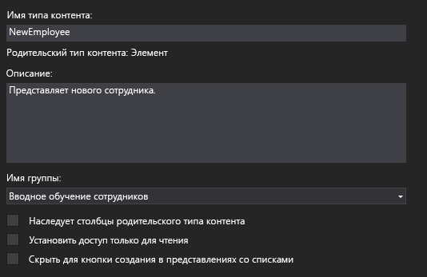

# <a name="add-a-custom-content-type-to-a-sharepoint-hosted-sharepoint-add-in"></a>Добавление собственного типа контента в надстройку с размещением в SharePoint

Это четвертая часть серии статей, посвященной основам разработки надстроек SharePoint, размещаемых в SharePoint. Для начала вам следует ознакомиться со статьей [Надстройки SharePoint](sharepoint-add-ins.md) и предыдущими статьями этой серии, представленными в разделе [Знакомство с созданием надстроек SharePoint, размещаемых в SharePoint](get-started-creating-sharepoint-hosted-sharepoint-add-ins.md#Nextsteps). 
    
> [!NOTE]
> Если вы изучали предыдущие статьи этой серии о надстройках, размещаемых в SharePoint, то у вас уже есть решение для Visual Studio, которое можно использовать для работы с этой статьей. Вы можете также скачать репозиторий на веб-странице [SharePoint_SP-hosted_Add-Ins_Tutorials](https://github.com/OfficeDev/SharePoint_SP-hosted_Add-Ins_Tutorials) и открыть файл BeforeContentType.sln.

В этой статье описано, как добавить настраиваемый тип контента в надстройку SharePoint Employee Orientation (Адаптация сотрудников).
 

## <a name="create-the-custom-content-type"></a>Создание настраиваемого типа контента

1. В **обозревателе решений** щелкните проект правой кнопкой мыши и выберите пункты **Добавить** > **Новая папка**. Присвойте папке имя **Content Types** (Типы контента).
     
2. Щелкните новую папку правой кнопкой мыши и выберите пункты **Добавить** > **Новый элемент**. В узле **Office/SharePoint** откроется диалоговое окно **Добавление нового элемента**.
     
3. Выберите **Тип контента** и присвойте ему имя **NewEmployee**, а затем нажмите кнопку **Добавить**. При запросе мастера выбрать базовый тип содержимого щелкните **Элемент**, и нажмите кнопку **Готово**.   
 
4. Если конструктор типов контента не открылся автоматически, откройте его самостоятельно, выбрав тип контента **NewEmployee** в **обозревателе решений**.
    
5. В конструкторе откройте вкладку **Тип контента** и заполните текстовые поля так:
    
   -  **Имя типа контента**: NewEmployee
   -  **Описание**: "Представляет нового сотрудника"
   -  **Имя группы**: "Адаптация сотрудников"
 
6. Убедитесь, что на вкладке не установлен *ни один* флажок. Флажок **Наследует столбцы родительского типа содержимого** может быть установлен по умолчанию. *Обязательно снимите его.*  Теперь вкладка должна выглядеть так:
    
    *Рис. 1. Вкладка "Тип контента"*

    
 
7. Откройте вкладку конструктора **Столбцы**.
     
8. В таблице выберите **Щелкните здесь, чтобы добавить столбец** и добавьте столбец **Подразделение**. Для этого выберите пункт **Подразделение** в раскрывающемся списке. Так же добавьте столбец **Этап адаптации**. (Если этих пунктов нет в списке, это значит, что вы используете неправильное решение Visual Studio. Начните с файла BeforeContentType.sln.) По завершении таблица должна выглядеть так:
    
    *Рис. 2. Вкладка "Столбцы"*

    

9. Сохраните файл и закройте конструктор.

### <a name="modify-the-elementsxml-file"></a>Изменение файла elements.xml

1. На следующем этапе вам потребуется работать непосредственно с необработанным кодом XML типа контента, поэтому в **обозревателе решений** необходимо выбрать дочерний файл elements.xml типа контента **NewEmployee**.
    
2. В файле двух добавленных вами столбцов уже есть элементы **FieldRef**. Добавьте элементы **FieldRef** для двух встроенных столбцов SharePoint, которые будут равнозначны двум уже имеющимся. Ниже приведена разметка для элементов. *Необходимо использовать эти же идентификаторы GUID для атрибута ID, так как это встроенные типы полей с фиксированными ID.* Добавьте их *над* двумя элементами **FieldRef** настраиваемых столбцов сайта. Обратите внимание, что этим полям присвоено отображаемое имя **Сотрудник**.
    
    ```
      <FieldRef Name="LinkTitle" ID="{82642ec8-ef9b-478f-acf9-31f7d45fbc31}" DisplayName="Employee" />
      <FieldRef Name="Title" ID="{fa564e0f-0c70-4ab9-b863-0177e6ddd247}" DisplayName="Employee" />
    ```
 
3. Сохраните и закройте файл.
 
###  <a name="modify-content-type-settings"></a>Изменение параметров типа контента

1. Разверните узел **Lists** (Списки) в **обозревателе решений** и выберите список **NewEmployeeOrientation**, чтобы открыть конструктор типов списка.
    
2. Откройте вкладку **Столбцы** конструктора и нажмите кнопку **Типы контента**.
    
3. В диалоговом окне **Параметры типа контента** добавьте тип контента **NewEmployee**.
    
4. Выберите тип контента **NewEmployee** в списке типов контента, а затем нажмите кнопку **По умолчанию**.
 
5. Выберите тип контента **Item**, щелкните правой кнопкой мыши маленькую стрелку слева от имени типа контента и выберите пункт **Удалить**.
    
6. Повторите предыдущий этап для типа контента **Folder**, чтобы в списке остался только тип контента **NewEmployee**. Диалоговое окно должно выглядеть так:
    
    *Рис. 3. Диалоговое окно "Параметры типа контента"*

    
 
7.  Нажмите кнопку **ОК**, чтобы закрыть диалоговое окно, а затем сохраните и закройте файл.

### <a name="modify-the-schemaxml-file-and-elementxml-file"></a>Изменение файлов schema.xml и element.xml

1. Откройте файл schema.xml.
    
2. Найдите элемент **Fields**. В нем должны быть три элемента **Field**: **Title**, **Division** и **OrientationStage**. (В созданном файле эти элементы могут быть в одной строке. Если это так, разделите их с помощью разрывов строк.)
 
3. Не закрывайте файл, а затем в **обозревателе решений** разверните папку **Site Columns** (Столбцы сайта) и узел **Division**, а затем откройте файл elements.xml узла **Division**. Элемент **Field** узла **Division** в файле schema.xml должен точно дублировать элемент **Field** узла **Division** в файле elements.xml. Если совпадение не точное, скопируйте элемент **Field** из файла elements.xml в столбце сайта и вставьте его вместо элемента **Field** в файле schema.xml. Закройте файл element.xml.
    
4. Откройте файл elements.xml элемента **OrientationStage**. При этом также должно быть точное совпадение элементов **Field** в двух файлах элемента **OrientationStage**, включая все дочерние элементы, например **CHOICES** (ВАРИАНТЫ) и **MAPPINGS** (СОПОСТАВЛЕНИЯ). Если совпадение не точное, скопируйте элемент **Field** из файла elements.xml в столбце сайта и вставьте его вместо элемента **Field** в файле schema.xml. Закройте файл element.xml.
 
5. Не закрывая файл schema.xml, в элементе **View**, значение **BaseViewID** которого равно "1", найдите дочерний элемент **ViewFields**, а затем добавьте два приведенных ниже элемента **FieldRef** в качестве его дочерних объектов. Возможно, они уже существуют, но не содержат атрибута **ID**. В таком случае добавьте атрибут ID.
    
    ```
      <FieldRef Name="Division" ID="{GUID from the Field element}" />
      <FieldRef Name="OrientationStage" ID="{GUID from the Field element}" />

    ```

6. Замените заполнители значений двух атрибутов **ID** на идентификаторы GUID из соответствующих элементов **Field** в элементе **ContentType** для типа **NewEmployee**, расположенном выше в файле schema.xml. Не забудьте добавить фигурные скобки: {}. Ниже показано, как должен выглядеть элемент **ViewFields** для элемента **View** с идентификатором "1" (у вас могут быть другие идентификаторы GUID).

    ```
      <ViewFields>
        <FieldRef Name="LinkTitle" ID="{82642ec8-ef9b-478f-acf9-31f7d45fbc31}" DisplayName="Employee" />
        <FieldRef Name="Division" ID="{509d2d67-9a96-4596-9b3b-58449cdcc6ff}" />
        <FieldRef Name="OrientationStage" ID="{38a3b54c-acf3-4ddf-b748-55c7c28d4cc2}" />        
      </ViewFields>
    ```

7. Не закрывая файл schema.xml, найдите элемент **View**, значение **BaseViewID** которого равно "0". Найдите в нем элемент **ViewFields**.

8. Скопируйте весь раздел **ViewFields** элемента View "1" и вставьте его вместо раздела **ViewFields** элемента View "0". Два представления теперь должны иметь одинаковые разделы **ViewFields**.
    
9. Сохраните и закройте файл schema.xml.

10. В папке **Lists** (Списки) разверните узел **NewEmployeeOrientation** и его дочерний экземпляр списка **NewEmployeesInSeattle**. Вы должны отличить файл elements.xml шаблона от файла elements.xml экземпляра. Откройте файл elements.xml экземпляра. 
    
11. Добавьте два элемента **Field** в первый элемент **Row**, чтобы элемент **Row** выглядел, как показано ниже.
    
    ``` 
    <Row>
      <Field Name="Title">Tom Higginbotham</Field>
      <Field Name="Division">Manufacturing</Field>
      <Field Name="OrientationStage">Tour of building</Field>
    </Row>
    ```

12. Сохраните и закройте файл.
    

## <a name="run-and-test-the-add-in"></a>Запуск и тестирование надстройки

1. Нажмите клавишу F5, чтобы развернуть и запустить надстройку. Visual Studio выполнит временную установку надстройки на тестовом сайте SharePoint и сразу же запустит ее. 
     
2. Когда откроется страница надстройки по умолчанию, щелкните ссылку **New Employees in Seattle** (Новые сотрудники в Сиэтле), чтобы открыть экземпляр настраиваемого списка.
 
3. Откроется список со столбцами **Division** и **OrientationStage**. Пользователю не обязательно добавлять их вручную, так как они являются частью типа контента списка. Верхний элемент содержит добавленные вами данные.
    
    *Рис. 4. Список "Новые сотрудники в Сиэтле"*

     
 
4. Попробуйте добавлять к списку новые элементы и редактировать существующие.
    
5. Чтобы завершить сеанс отладки, закройте окно браузера или остановите отладку в Visual Studio. При каждом нажатии клавиши F5 Visual Studio будет отзывать предыдущую версию надстройки и устанавливать последнюю.
    
6. Вы будете работать с этой надстройкой и решением Visual Studio при изучении других статей, поэтому при перерывах в работе рекомендуется отзывать надстройку. В **обозревателе решений** щелкните проект правой кнопкой мыши и выберите пункт **Отозвать**.

## <a name="next-steps"></a>Дальнейшие действия
<a name="Nextsteps"> </a>

В следующей статье этой серии описано, как [добавить веб-часть на страницу в надстройке SharePoint, размещаемой в SharePoint](add-a-web-part-to-a-page-in-a-sharepoint-hosted-sharepoint-add-in.md).
