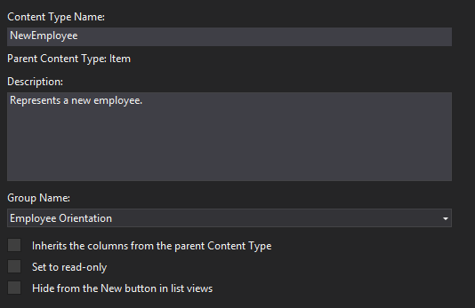
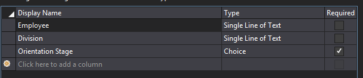

# <a name="add-a-custom-content-type-to-a-sharepoint-hosted-sharepoint-add-in"></a>Добавление пользовательского типа контента в надстройку, размещаемую в SharePoint
В этой статье рассказывается, как добавлять пользовательские типы контента в надстройки SharePoint.
 

 **Примечание.** В настоящее время идет процесс замены названия "приложения для SharePoint" названием "надстройки SharePoint". Во время этого процесса в документации и пользовательском интерфейсе некоторых продуктов SharePoint и средств Visual Studio может по-прежнему использоваться термин "приложения для SharePoint". Дополнительные сведения см. в статье [Новое название приложений для Office и SharePoint](new-name-for-apps-for-sharepoint#bk_newname).
 

Эта четвертая часть серии статей, посвященной основам разработки надстроек SharePoint, размещаемых в SharePoint. Для начала следует ознакомиться со статьей [Надстройки SharePoint](sharepoint-add-ins) и другими статьями из этой серии:
 

-  [Знакомство с созданием надстроек SharePoint с размещением в SharePoint](get-started-creating-sharepoint-hosted-sharepoint-add-ins)
    
 
-  [Развертывание и установка надстроек SharePoint, размещаемых в SharePoint](deploy-and-install-a-sharepoint-hosted-sharepoint-add-in)
    
 
-  [Добавление настраиваемых столбцов в надстройки, размещаемые в SharePoint](add-custom-columns-to-a-sharepoint-hostedsharepoint-add-in)
    
 

 **Примечание.** Если вы уже изучали предыдущие статьи серии о надстройках с размещением в SharePoint, то у вас уже есть решение Visual Studio, которое можно использовать для работы с данной статьей. Вы также можете скачать репозиторий [SharePoint_SP-hosted_Add-Ins_Tutorials](https://github.com/OfficeDev/SharePoint_SP-hosted_Add-Ins_Tutorials) и открыть файл BeforeContentType.sln.
 

В этой статье описывается добавление пользовательского типа контента в надстройку "Обучение сотрудников".
 

## <a name="create-the-custom-content-type"></a>Создание пользовательского типа контента

1. В **обозревателе решений** щелкните проект правой кнопкой мыши и выберите пункты **Добавить** > **Новая папка**. Задайте для папки имя "Столбцы сайта".
    
 
2. Щелкните новую папку правой кнопкой мыши и выберите пункты **Добавить** > **Создать элемент**. Откроется диалоговое окно **Добавление нового элемента** для узла **BeforeContentType**.
    
 
3. Выберите **Тип контента** и задайте для него имя NewEmployee, а затем нажмите **Добавить**. Когда мастер предложит выбрать базовый тип содержимого, выберите **Элемент**, а затем нажмите кнопку **Готово**.
    
 
4. Если конструктор типа контента не откроется автоматически, выберите тип контента **NewEmployee** в **обозревателе решений**, чтобы открыть его.
    
 
5. Откройте вкладку **Тип контента** в конструкторе и заполните текстовые поля следующим образом:
    
      -  **Имя типа контента**: NewEmployee
    
 
  -  **Описание**: "Представляет нового сотрудника".
    
 
  -  **Имя группы**: "Обучение сотрудников"
    
 
6. Убедитесь, что *ни один* из флажков на вкладке не установлен. Флажок **Наследует столбцы родительского типа содержимого** может быть установлен по умолчанию. *Обязательно снимите его.* Теперь вкладка должна выглядеть так:
    
    **Вкладка "Тип контента"**

  
 
 
7. Откройте вкладку **Столбцы** конструктора.
     
8. В таблице нажмите надпись **Щелкните, чтобы добавить столбец**, чтобы открыть раскрывающийся список столбцов, и добавьте столбец **Division**. В раскрывающемся списке он обозначен отображаемым именем: **Подразделение**. Повторите эти действия для столбца **Этап обучения**. Если эти столбцы не отображаются, возможно, вы начали не с того решения Visual Studio. Начните с файла BeforeContentType.sln. По завершении таблица должна выглядеть примерно так:
    
    **Вкладка "Столбцы"**

    
 
 
9. Сохраните файл и закройте конструктор.
    
 
10. На следующем этапе вам потребуется работать непосредственно с необработанным кодом XML типа контента, поэтому в **обозревателе решений** необходимо выбрать дочерний файл elements.xml типа контента **NewEmployee**.
    
 
11. Для двух добавленных вами столбцов в файле уже есть элементы **FieldRef**. Добавьте аналогичные им элементы **FieldRef** для двух встроенных столбцов SharePoint. Ниже представлена маркировка элементов. *Для атрибута ID необходимо использовать те же идентификаторы GUID, так как это встроенные типы полей с фиксированными идентификаторами.* Добавьте их *над* двумя имеющимися элементами **FieldRef** для настраиваемых столбцов сайтов.
    
```
  <FieldRef Name="LinkTitle" ID="{82642ec8-ef9b-478f-acf9-31f7d45fbc31}" DisplayName="Employee" />
<FieldRef Name="Title" ID="{fa564e0f-0c70-4ab9-b863-0177e6ddd247}" DisplayName="Employee" />
```


    Note that we have given these fields a custom display name:  **Employee**.
    
 
12. Сохраните и закройте файл.
    
 
13. Разверните узел **Списки** в **обозревателе решений** и выберите список **NewEmployeeOrientation**, чтобы открыть конструктора типа списка.
    
 
14. Откройте вкладку **Столбцы** конструктора и нажмите кнопку **Типы контента**.
    
 
15. В диалоговом окне **Параметры типа содержимого** добавьте тип контента **NewEmployee**.
    
 
16. Выберите тип контента **NewEmployee** в списке типов контента, а затем нажмите кнопку **По умолчанию**.
    
 
17. Выберите тип контента **Элемент**, щелкните правой кнопкой мыши маленькую стрелку слева от имени типа контента и выберите пункт **Удалить**.
    
 
18. Повторите предыдущий этап для типа контента **Папка**, чтобы в списке остался только тип контента **ActingRole**. Теперь диалоговое окно должно выглядеть так:
    
    **Диалоговое окно "Параметры типа содержимого"**

    
 
19.  Нажмите кнопку **ОК**, чтобы закрыть диалоговое окно, а затем сохраните и закройте файл.
    
20. Откройте файл schema.xml.
    
21. Найдите элемент **Fields**. Он должен включать три элемента **Field**: **Title**, Division и OrientationStage. Эти элементы могут находиться в одной строке файла. Если это так, разделите их разрывами строки.
 
22. Оставьте файл открытым и в **обозревателе решений** разверните папку **Столбцы сайта** и узел Division, а затем откройте файл elements.xml для этого столбца. Элемент **Field** для столбца Division в файле schema.xml должен в точности совпадать с элементом **Field** в файле elements.xml столбца Division. Если между ними нет точного совпадения, скопируйте элемент **Field** из файла elements.xml столбца сайта и вставьте его вместо несоответствующего элемента **Field** в файле schema.xml. Затем закройте файл element.xml.
    
23. Откройте файл elements.xml для столбца OrientationStage. В этом случае элементы **Field** в двух файлах для столбца OrientationStage тоже должны полностью совпадать (включая все дочерние элементы, например **CHOICES** и **MAPPINGS**). Если они не совпадают, скопируйте элемент **Field** из файла elements.xml и вставьте его вместо несоответствующего элемента **Field** в файле schema.xml. Затем закройте файл element.xml.
 
24. Не закрывая файл schema.xml, в элементе **View**, значение **BaseViewID** которого равно "1", найдите дочерний элемент **ViewFields**, а затем добавьте два приведенных ниже элемента **FieldRef** в качестве его дочерних объектов. Возможно, они уже существуют, но не содержат атрибута **ID**. В таком случае добавьте атрибут ID.
    
```
  <FieldRef Name="Division" ID="{GUID from the Field element}" />
<FieldRef Name="OrientationStage" ID="{GUID from the Field element}" />

```

25. Замените заполнители значений двух атрибутов **ID** на идентификаторы GUID из соответствующих элементов **Field** в элементе **ContentType** для типа **NewEmployee**, расположенном выше в файле schema.xml. Не забудьте добавить фигурные скобки: {}.
    
    Ниже показано, как должен выглядеть элемент **ViewFields** для элемента **View** с идентификатором "1" (у вас могут быть другие идентификаторы GUID).
    


```
  <ViewFields>
   <FieldRef Name="LinkTitle" ID="{82642ec8-ef9b-478f-acf9-31f7d45fbc31}" DisplayName="Employee" />
   <FieldRef Name="Division" ID="{509d2d67-9a96-4596-9b3b-58449cdcc6ff}" />
   <FieldRef Name="OrientationStage" ID="{38a3b54c-acf3-4ddf-b748-55c7c28d4cc2}" />        
</ViewFields>
```

26. Не закрывая файл schema.xml, найдите элемент **View**, значение **BaseViewID** которого равно "0". Найдите в нем элемент **ViewFields**.
    
 
27. Полностью скопируйте раздел **ViewFields** из элемента View с идентификатором "1" в раздел **ViewFields** элемента View с идентификатором "0". Разделы **ViewFields** этих двух представлений не должны быть идентичными.
    
 
28. Сохраните и закройте файл schema.xml.
    
 
29. В папке **Списки** разверните узел **NewEmployeeOrientation** и его дочерний экземпляр списка **NewEmployeesInSeattle**. Разница между файлами elements.xml для шаблона и экземпляра должна быть очевидна. Откройте файл для экземпляра. 
    
 
30. Добавьте два элемента **Field** в первый элемент **Row**, чтобы элемент **Row** выглядел, как показано ниже.
    
```
  
<Row>
  <Field Name="Title">Tom Higginbotham</Field>
  <Field Name="Division">Manufacturing</Field>
  <Field Name="OrientationStage">Tour of building</Field>
</Row>
   
```

31. Сохраните и закройте файл.
    
 

## <a name="run-and-test-the-add-in"></a>Запуск и тестирование надстройки

1. Нажмите клавишу F5, чтобы развернуть и запустить надстройку. Visual Studio выполнит временную установку надстройки на тестовом сайте SharePoint и сразу же запустит ее. 
     
2. Когда откроется страница надстройки, используемая по умолчанию, щелкните ссылку **Новые сотрудники в Москве**, чтобы открыть экземпляр настраиваемого списка.
 
3. Откроется страница списка со столбцами Division и OrientationStage. Пользователю необязательно добавлять их вручную, так как они входят в состав типа контента списка. Верхний элемент содержит добавленные вами данные.
    
    **Список "Новые сотрудники в Москве"**

     
 
4. Попробуйте добавлять к списку новые элементы и редактировать существующие.
    
 
5. Чтобы завершить сеанс отладки, закройте окно браузера или остановите отладку в Visual Studio. При каждом нажатии клавиши F5 Visual Studio будет отзывать предыдущую версию надстройки и устанавливать ее последнюю версию.
    
 
6. Эти надстройка и решение Visual Studio будут рассматриваться и в других статьях, поэтому при перерывах в работе рекомендуется отзывать надстройку. В **обозревателе решений** щелкните проект правой кнопкой мыши и выберите пункт **Отозвать**.

## 
<a name="Nextsteps"> </a>

В следующей статье этой серии описывается добавление веб-части представления списка на страницу по умолчанию для надстройки SharePoint: [Добавление веб-части на страницу в надстройке, размещенной в SharePoint](add-a-web-part-to-a-page-in-a-sharepoint-hosted-sharepoint-add-in).
