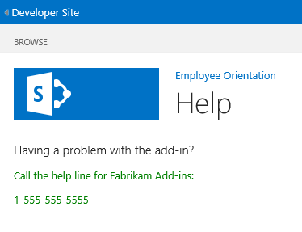

# <a name="add-a-custom-page-and-style-to-a-sharepoint-hosted-sharepoint-add-in"></a><span data-ttu-id="06271-101">Добавление настраиваемых страниц и стилей в надстройки, размещенные в SharePoint</span><span class="sxs-lookup"><span data-stu-id="06271-101">Add a custom page and style to a SharePoint-hosted SharePoint Add-in</span></span>
<span data-ttu-id="06271-102">Узнайте, как включать настраиваемые страницы и CSS-файлы в надстройки SharePoint.</span><span class="sxs-lookup"><span data-stu-id="06271-102">Learn how to include a custom page and CSS file in an SharePoint Add-ins.</span></span>
 

 <span data-ttu-id="06271-p101">**Примечание.** Название "приложения для SharePoint" меняется на "надстройки SharePoint". Пока изменения не будут внесены полностью, в документации и пользовательском интерфейсе некоторых продуктов SharePoint и средств Visual Studio по-прежнему может встречаться термин "приложение". Дополнительные сведения см. в разделе [Новое название приложений для Office и SharePoint](new-name-for-apps-for-sharepoint#bk_newname).</span><span class="sxs-lookup"><span data-stu-id="06271-p101">The name "apps for SharePoint" is changing to "SharePoint Add-ins". During the transition, the documentation and the UI of some SharePoint products and Visual Studio tools might still use the term "apps for SharePoint". For details, see [New name for apps for Office and SharePoint](new-name-for-apps-for-sharepoint#bk_newname).</span></span>
 

<span data-ttu-id="06271-p102">Эта седьмая часть серии статей, посвященной основам разработки надстроек, размещаемых в SharePoint. Для начала следует ознакомиться со статьей [Надстройки SharePoint](sharepoint-add-ins) и предыдущими статьями из этой серии:</span><span class="sxs-lookup"><span data-stu-id="06271-p102">Learn how to customize the installation of a provider-hosted SharePoint Add-in. This is the seventh in a series of articles about the basics of developing provider-hosted SharePoint Add-ins. You should first be familiar with  [SharePoint Add-ins](sharepoint-add-ins) and the previous articles in this series:</span></span>
 

-  [<span data-ttu-id="06271-108">Знакомство с созданием надстроек SharePoint с размещением в SharePoint</span><span class="sxs-lookup"><span data-stu-id="06271-108">Get started creating SharePoint-hosted SharePoint Add-ins</span></span>](get-started-creating-sharepoint-hosted-sharepoint-add-ins)
    
 
-  [<span data-ttu-id="06271-109">Развертывание и установка размещаемых в SharePoint надстроек SharePoint</span><span class="sxs-lookup"><span data-stu-id="06271-109">Deploy and install a SharePoint-hosted SharePoint Add-in</span></span>](deploy-and-install-a-sharepoint-hosted-sharepoint-add-in)
    
 
-  [<span data-ttu-id="06271-110">Добавление настраиваемых столбцов в надстройки, размещенные в SharePoint</span><span class="sxs-lookup"><span data-stu-id="06271-110">Add custom columns to a SharePoint-hostedSharePoint Add-in</span></span>](add-custom-columns-to-a-sharepoint-hostedsharepoint-add-in)
    
 
-  [<span data-ttu-id="06271-111">Добавление настраиваемого типа контента в надстройки, размещенные в SharePoint</span><span class="sxs-lookup"><span data-stu-id="06271-111">Add a custom content type to a SharePoint-hostedSharePoint Add-in</span></span>](add-a-custom-content-type-to-a-sharepoint-hostedsharepoint-add-in)
    
 
-  [<span data-ttu-id="06271-112">Добавление веб-части на страницу в надстройке, размещенной в SharePoint</span><span class="sxs-lookup"><span data-stu-id="06271-112">Add a Web Part to a page in a SharePoint-hosted SharePoint Add-in</span></span>](add-a-web-part-to-a-page-in-a-sharepoint-hosted-sharepoint-add-in)
    
 
-  [<span data-ttu-id="06271-113">Добавление рабочего процесса к надстройке, размещенной в SharePoint</span><span class="sxs-lookup"><span data-stu-id="06271-113">Add a workflow to a SharePoint-hosted SharePoint Add-in</span></span>](add-a-workflow-to-a-sharepoint-hosted-sharepoint-add-in)
    
 

 <span data-ttu-id="06271-p103">**Примечание.** Если вы изучали предыдущие статьи этой серии о надстройках, размещаемых в SharePoint, то у вас уже есть решение для Visual Studio, которое можно использовать для работы с данной статьей. Кроме того, вы можете скачать репозиторий [SharePoint_SP-hosted_Add-Ins_Tutorials](https://github.com/OfficeDev/SharePoint_SP-hosted_Add-Ins_Tutorials) и открыть файл BeforePage.sln.</span><span class="sxs-lookup"><span data-stu-id="06271-p103">**Note** If you have been working through this series about SharePoint-hosted add-ins, then you have a Visual Studio solution that you can use to continue with this topic. You can also download the repository at  [SharePoint_SP-hosted_Add-Ins_Tutorials](https://github.com/OfficeDev/SharePoint_SP-hosted_Add-Ins_Tutorials) and open the BeforeColumns.sln file.</span></span>
 

<span data-ttu-id="06271-116">В этой статье описано, как добавить страницу справки в надстройку SharePoint "Employee Orientation" (Обучение сотрудников) и настроить ее на использование специальной таблицы стилей CSS.</span><span class="sxs-lookup"><span data-stu-id="06271-116">In this article you add a help page to the Employee Orientation SharePoint Add-in and configure it to use a custom CSS stylesheet.</span></span> 
 

## <a name="add-a-page"></a><span data-ttu-id="06271-117">Добавление страницы</span><span class="sxs-lookup"><span data-stu-id="06271-117">Add a Web Part to a page</span></span>


1. <span data-ttu-id="06271-p104">В **обозревателе решений** щелкните правой кнопкой мыши папку **Страницы** и выберите **Добавить** > **Новый элемент**. Откроется диалоговое окно **Добавление нового элемента** для узла **Office/SharePoint**.</span><span class="sxs-lookup"><span data-stu-id="06271-p104">In  **Solution Explorer**, right-click the  **Pages** folder and choose **Add** > **New Item**. The  **Add New Item** dialog opens to the **Office/SharePoint** node.</span></span>
    
 
2. <span data-ttu-id="06271-120">Выберите элемент **Страница** и задайте для него имя nameHelp.aspx.</span><span class="sxs-lookup"><span data-stu-id="06271-120">Choose  **Page** and give it the nameHelp.aspx.</span></span> 
    
 
3. <span data-ttu-id="06271-121">Найдите в файле два элемента **asp:Content** и добавьте между ними приведенную ниже часть кода, заключенную в тег **asp:Content**.</span><span class="sxs-lookup"><span data-stu-id="06271-121">Find the two  **asp:Content** elements in the file, and add the following third **asp:Content** markup in between them.</span></span>
    
```HTML
  <asp:Content ContentPlaceHolderID="PlaceHolderPageTitleInTitleArea" runat="server">
    Help
</asp:Content> 
```

4. <span data-ttu-id="06271-122">Найдите элемент **asp:Content** с идентификатором **PlaceholderAdditionalPageHead** и добавьте к нему приведенную ниже часть кода.</span><span class="sxs-lookup"><span data-stu-id="06271-122">Find the  **asp:Content** element with the ID of **PlaceholderAdditionalPageHead**, and add the following markup to it.</span></span>
    
```HTML
  <link rel="Stylesheet" type="text/css" href="../Content/App.css" />
```

5. <span data-ttu-id="06271-123">Найдите элемент **asp:Content** с идентификатором **PlaceHolderMain** и удалите из него все дочерние элементы.</span><span class="sxs-lookup"><span data-stu-id="06271-123">Find the  **asp:Content** element with the ID of **PlaceHolderMain**, and remove any child elements in it.</span></span>
    
 
6. <span data-ttu-id="06271-124">Добавьте к элементу **asp:Content** приведенное ниже содержимое.</span><span class="sxs-lookup"><span data-stu-id="06271-124">Add the following as content to the same  **asp:Content** element.</span></span>
    
```HTML
  <H3>Having a problem with the add-in?</H3>
<p> Call the help line for Fabrikam Add-ins:</p>
<p>1-555-555-5555</p>
```

7. <span data-ttu-id="06271-125">Сохраните и закройте файл.</span><span class="sxs-lookup"><span data-stu-id="06271-125">Save and close the file.</span></span>
    
 
8. <span data-ttu-id="06271-126">Откройте файл Default.aspx.</span><span class="sxs-lookup"><span data-stu-id="06271-126">Open the Default.aspx file.</span></span>
    
 
9. <span data-ttu-id="06271-127">Найдите элемент **asp:Content** с идентификатором **PlaceHolderMain**, а затем добавьте в конце его содержимого приведенную ниже часть кода.</span><span class="sxs-lookup"><span data-stu-id="06271-127">Find the  **asp:Content** element with the ID of **PlaceHolderMain**, and then add the following markup to the end of it.</span></span> 
    
```HTML
  <p><asp:HyperLink runat="server" NavigateUrl="JavaScript:window.location = _spPageContextInfo.webAbsoluteUrl + '/Pages/Help.aspx';" 
    Text="Get help for the Employee Orientation add-in" /></p>

```

10. <span data-ttu-id="06271-128">Сохраните и закройте файл.</span><span class="sxs-lookup"><span data-stu-id="06271-128">Save and close the file.</span></span>
    
 

## <a name="add-a-style-class-to-the-stylesheet"></a><span data-ttu-id="06271-129">Добавление класса стиля к таблице стилей</span><span class="sxs-lookup"><span data-stu-id="06271-129">Add a style class to the stylesheet</span></span>


 

 

1. <span data-ttu-id="06271-130">В **обозревателе решений** откройте файл app.css из папки **Содержимое** и добавьте в этот файл приведенную ниже строку.</span><span class="sxs-lookup"><span data-stu-id="06271-130">In  **Solution Explorer**, open the app.css file in the  **Contents** folder, and then add the following line to the file.</span></span>
    
```
  p {color: green;}
```

2. <span data-ttu-id="06271-131">Сохраните и закройте файл.</span><span class="sxs-lookup"><span data-stu-id="06271-131">Save and close the file.</span></span>
    
 

## <a name="run-and-test-the-add-in"></a><span data-ttu-id="06271-132">Запуск и тестирование надстройки</span><span class="sxs-lookup"><span data-stu-id="06271-132">Run and test the add-in</span></span>


 

 

1. <span data-ttu-id="06271-p105">Нажмите клавишу F5, чтобы развернуть и запустить надстройку. Visual Studio выполнит временную установку надстройки на тестовом сайте SharePoint и сразу же запустит ее.</span><span class="sxs-lookup"><span data-stu-id="06271-p105">Use the F5 key to deploy and run your add-in. Visual Studio makes a temporary installation of the add-in on your test SharePoint site and immediately runs the add-in.</span></span> 
    
 
2. <span data-ttu-id="06271-135">Когда откроется страница надстройки по умолчанию, перейдите по ссылке **Get help for the Employee Orientation add-in** (Вызов справки для надстройки, посвященной обучению сотрудников), чтобы открыть страницу **Help** (Справка).</span><span class="sxs-lookup"><span data-stu-id="06271-135">When the add-in's default page opens, click the  **Get help for the Employee Orientation add-in** link to open the **Help** page.</span></span>
    
    <span data-ttu-id="06271-136">Откроется настраиваемая страница. Две строки, заключенные в</span><span class="sxs-lookup"><span data-stu-id="06271-136">Your custom page opens and the two lines that you put in</span></span> <p> <span data-ttu-id="06271-137">теги, выделяются зеленым цветом.</span><span class="sxs-lookup"><span data-stu-id="06271-137">tags are green.</span></span>
    

    <span data-ttu-id="06271-138">**Страница справки**</span><span class="sxs-lookup"><span data-stu-id="06271-138">**Help page**</span></span>

 

  
 

    
    
 
3. <span data-ttu-id="06271-p107">Чтобы завершить сеанс отладки, закройте окно браузера или остановите отладку в Visual Studio. При каждом нажатии клавиши F5 Visual Studio будет отзывать предыдущую версию надстройки и устанавливать ее последнюю версию.</span><span class="sxs-lookup"><span data-stu-id="06271-p107">To end the debugging session, close the browser window or stop debugging in Visual Studio. Each time that you press F5, Visual Studio will retract the previous version of the add-in and install the latest one.</span></span>
    
 
4. <span data-ttu-id="06271-p108">Эти надстройка и решение Visual Studio будут рассматриваться и в других статьях, поэтому при перерывах в работе рекомендуем отзывать надстройку. В **обозревателе решений** щелкните проект правой кнопкой мыши и выберите пункт **Отозвать**.</span><span class="sxs-lookup"><span data-stu-id="06271-p108">You will work with this add-in and Visual Studio solution in other articles, and it's a good practice to retract the add-in one last time when you are done working with it for a while. Right-click the project in **Solution Explorer** and choose **Retract**.</span></span>
    
 

## 
<span data-ttu-id="06271-145"><a name="Nextsteps"> </a></span><span class="sxs-lookup"><span data-stu-id="06271-145"></span></span>

<span data-ttu-id="06271-146">В следующей статье этой серии, [Добавление пользовательского кода клиентской обработки к надстройке SharePoint, размещенной в SharePoint](add-custom-client-side-rendering-to-a-sharepoint-hosted-sharepoint-add-in), рассматривается добавление пользовательского кода клиентской обработки для столбца списка в надстройке SharePoint.</span><span class="sxs-lookup"><span data-stu-id="06271-146">In the next article in this series, you'll add a custom client-side rendering to a list column in a SharePoint Add-in:  [Add custom client-side rendering to a SharePoint-hosted SharePoint Add-in](add-custom-client-side-rendering-to-a-sharepoint-hosted-sharepoint-add-in).</span></span>
 

 

