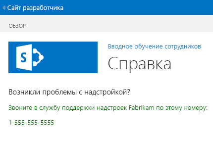

# <a name="add-a-custom-page-and-style-to-a-sharepoint-hosted-sharepoint-add-in"></a><span data-ttu-id="1407a-103">Добавление пользовательских страницы и стиля в надстройку SharePoint, размещаемую в SharePoint</span><span class="sxs-lookup"><span data-stu-id="1407a-103">Add a custom page and style to a SharePoint-hosted SharePoint Add-in</span></span>

<span data-ttu-id="1407a-104">Это седьмая часть серии статей, посвященных основам разработки надстроек SharePoint, размещаемых в SharePoint. Для начала следует ознакомиться со статьей [Надстройки SharePoint](sharepoint-add-ins.md) и предыдущими статьями из этой серии.</span><span class="sxs-lookup"><span data-stu-id="1407a-104">This is the seventh in a series of articles about the basics of developing SharePoint-hosted SharePoint Add-ins. You should first be familiar with  [SharePoint Add-ins](sharepoint-add-ins.md) and the previous articles in this series:</span></span>

-  [<span data-ttu-id="1407a-105">Начало работы по созданию надстроек SharePoint, размещаемых в SharePoint</span><span class="sxs-lookup"><span data-stu-id="1407a-105">Get started creating SharePoint-hosted SharePoint Add-ins</span></span>](get-started-creating-sharepoint-hosted-sharepoint-add-ins.md)
-  [<span data-ttu-id="1407a-106">Развертывание и установка надстроек SharePoint, размещаемых в SharePoint</span><span class="sxs-lookup"><span data-stu-id="1407a-106">Deploy and install a SharePoint-hosted SharePoint Add-in</span></span>](deploy-and-install-a-sharepoint-hosted-sharepoint-add-in.md)
-  [<span data-ttu-id="1407a-107">Добавление настраиваемых столбцов в надстройку SharePoint, размещаемую в SharePoint</span><span class="sxs-lookup"><span data-stu-id="1407a-107">Add custom columns to a SharePoint-hosted SharePoint Add-in</span></span>](add-custom-columns-to-a-sharepoint-hosted-sharepoint-add-in.md)
-  [<span data-ttu-id="1407a-108">Добавление пользовательского типа контента в надстройку SharePoint, размещаемую в SharePoint</span><span class="sxs-lookup"><span data-stu-id="1407a-108">Add a custom content type to a SharePoint-hosted SharePoint Add-in</span></span>](add-a-custom-content-type-to-a-sharepoint-hosted-sharepoint-add-in.md)
-  [<span data-ttu-id="1407a-109">Добавление веб-части на страницу в надстройке SharePoint, размещаемой в SharePoint</span><span class="sxs-lookup"><span data-stu-id="1407a-109">Add a Web Part to a page in a SharePoint-hosted SharePoint Add-in</span></span>](add-a-web-part-to-a-page-in-a-sharepoint-hosted-sharepoint-add-in.md)
-  [<span data-ttu-id="1407a-110">Добавление рабочего процесса в надстройку SharePoint, размещаемую в SharePoint</span><span class="sxs-lookup"><span data-stu-id="1407a-110">Add a workflow to a SharePoint-hosted SharePoint Add-in</span></span>](add-a-workflow-to-a-sharepoint-hosted-sharepoint-add-in.md)
    
> [!NOTE]
> <span data-ttu-id="1407a-111">Если вы изучали предыдущие статьи этой серии о надстройках, размещаемых в SharePoint, то у вас уже есть решение для Visual Studio, которое можно использовать для работы с этой статьей.</span><span class="sxs-lookup"><span data-stu-id="1407a-111">Note  If you have been working through this series about SharePoint-hosted add-ins, then you have a Visual Studio solution that you can use to continue with this topic. You can also download the repository at  SharePoint_SP-hosted_Add-Ins_Tutorials and open the BeforeClientRenderedControl.sln file.</span></span> <span data-ttu-id="1407a-112">Кроме того, вы можете скачать репозиторий на веб-странице [SharePoint_SP-hosted_Add-Ins_Tutorials](https://github.com/OfficeDev/SharePoint_SP-hosted_Add-Ins_Tutorials) и открыть файл BeforePage.sln.</span><span class="sxs-lookup"><span data-stu-id="1407a-112">You can also download the repository at [SharePoint_SP-hosted_Add-Ins_Tutorials](https://github.com/OfficeDev/SharePoint_SP-hosted_Add-Ins_Tutorials) and open the BeforePage.sln file.</span></span>

<span data-ttu-id="1407a-113">Работая с этой статьей, вы добавите страницу справки в надстройку SharePoint "Employee Orientation" (Обучение сотрудников) и настроите ее так, чтобы в ней использовалась специальная таблица стилей CSS.</span><span class="sxs-lookup"><span data-stu-id="1407a-113">In this article you add a help page to the Employee Orientation SharePoint Add-in and configure it to use a custom CSS stylesheet.</span></span> 

## <a name="add-a-page"></a><span data-ttu-id="1407a-114">Добавление страницы</span><span class="sxs-lookup"><span data-stu-id="1407a-114">Add a page</span></span>

1. <span data-ttu-id="1407a-115">В **обозревателе решений** щелкните правой кнопкой мыши папку **Pages** (Страницы) и выберите пункты **Добавить** > **Новый элемент**.</span><span class="sxs-lookup"><span data-stu-id="1407a-115">In  **Solution Explorer**, right-click the  **Pages** folder and choose **Add** > **New Item**. The  Add New Item dialog opens to the Office/SharePoint node.</span></span> <span data-ttu-id="1407a-116">Откроется диалоговое окно **Добавление нового элемента** для узла **Office/SharePoint**.</span><span class="sxs-lookup"><span data-stu-id="1407a-116">Right-click the new folder and choose  AddNew Item. The  **Add New Item** dialog opens to the **Office/SharePoint** node.</span></span>

2. <span data-ttu-id="1407a-117">Выберите **Page** (Страница) и задайте имя **Help.aspx**.</span><span class="sxs-lookup"><span data-stu-id="1407a-117">Select **Page** and give it the name **Help.aspx**.</span></span> 

3. <span data-ttu-id="1407a-118">Найдите в файле два элемента **asp:Content** и добавьте между ними указанную ниже часть кода **asp:Content**.</span><span class="sxs-lookup"><span data-stu-id="1407a-118">Find the two  **asp:Content** elements in the file, and add the following third **asp:Content** markup in between them.</span></span>
    
    ```HTML
      <asp:Content ContentPlaceHolderID="PlaceHolderPageTitleInTitleArea" runat="server">
        Help
      </asp:Content> 
    ```

4. <span data-ttu-id="1407a-119">Найдите элемент **asp:Content** с идентификатором **PlaceholderAdditionalPageHead** и добавьте к нему указанную ниже часть кода.</span><span class="sxs-lookup"><span data-stu-id="1407a-119">Find the  **asp:Content** element with the ID of **PlaceholderAdditionalPageHead**, and add the following markup to it.</span></span>
    
    ```HTML
      <link rel="Stylesheet" type="text/css" href="../Content/App.css" />
    ```

5. <span data-ttu-id="1407a-120">Найдите элемент **asp:Content** с идентификатором **PlaceHolderMain** и удалите из него все дочерние элементы.</span><span class="sxs-lookup"><span data-stu-id="1407a-120">Find the  **asp:Content** element with the ID of **PlaceHolderMain**, and remove any child elements in it.</span></span>

6. <span data-ttu-id="1407a-121">Добавьте указанное ниже содержимое в тот же элемент **asp:Content**.</span><span class="sxs-lookup"><span data-stu-id="1407a-121">Add the following as content to the same  **asp:Content** element.</span></span>
    
    ```HTML
      <H3>Having a problem with the add-in?</H3>
      <p>Call the help line for Fabrikam Add-ins:</p>
      <p>1-555-555-5555</p>
    ```

7. <span data-ttu-id="1407a-122">Сохраните и закройте файл.</span><span class="sxs-lookup"><span data-stu-id="1407a-122">Save and close the file.</span></span>

8. <span data-ttu-id="1407a-123">Откройте файл Default.aspx.</span><span class="sxs-lookup"><span data-stu-id="1407a-123">Open the Default.aspx file.</span></span>

9. <span data-ttu-id="1407a-124">Найдите элемент **asp:Content** с идентификатором **PlaceHolderMain**, а затем добавьте указанную ниже часть кода в конец элемента.</span><span class="sxs-lookup"><span data-stu-id="1407a-124">Find the  **asp:Content** element with the ID of **PlaceHolderMain**, and then add the following markup to the end of it.</span></span> 
    
    ```HTML
      <p><asp:HyperLink runat="server" NavigateUrl="JavaScript:window.location = _spPageContextInfo.webAbsoluteUrl + '/Pages/Help.aspx';" 
        Text="Get help for the Employee Orientation add-in" /></p>
    ```

10. <span data-ttu-id="1407a-125">Сохраните и закройте файл.</span><span class="sxs-lookup"><span data-stu-id="1407a-125">Save and close the file.</span></span>

## <a name="add-a-style-class-to-the-stylesheet"></a><span data-ttu-id="1407a-126">Добавление класса стиля в таблицу стилей</span><span class="sxs-lookup"><span data-stu-id="1407a-126">Add a style class to the stylesheet</span></span>

1. <span data-ttu-id="1407a-127">В **обозревателе решений** откройте файл app.css в папке **Contents** (Содержимое) и добавьте в этот файл указанную ниже строку.</span><span class="sxs-lookup"><span data-stu-id="1407a-127">In  **Solution Explorer**, open the app.css file in the  **Contents** folder, and then add the following line to the file.</span></span>
    
    ```
      p {color: green;}
    ```

2. <span data-ttu-id="1407a-128">Сохраните и закройте файл.</span><span class="sxs-lookup"><span data-stu-id="1407a-128">Save and close the file.</span></span>

## <a name="run-and-test-the-add-in"></a><span data-ttu-id="1407a-129">Запуск и тестирование надстройки</span><span class="sxs-lookup"><span data-stu-id="1407a-129">Run and test the add-in</span></span>

1. <span data-ttu-id="1407a-p103">Нажмите клавишу F5, чтобы развернуть и запустить надстройку. Visual Studio выполнит временную установку надстройки на тестовом сайте SharePoint и сразу же запустит ее.</span><span class="sxs-lookup"><span data-stu-id="1407a-p103">Use the F5 key to deploy and run your add-in. Visual Studio makes a temporary installation of the add-in on your test SharePoint site and immediately runs the add-in.</span></span> 

2. <span data-ttu-id="1407a-132">Когда откроется страница надстройки, используемая по умолчанию, перейдите по ссылке **Get help for the Employee Orientation add-in** (Получить справку для надстройки Employee Orientation). Откроется страница **Help** (Справка).</span><span class="sxs-lookup"><span data-stu-id="1407a-132">When the add-in's default page opens, click the  **Get help for the Employee Orientation add-in** link to open the **Help** page.</span></span>
    
   <span data-ttu-id="1407a-133">Откроется ваша пользовательская страница, и две строки, которые вы поместили между тегами `<p>`, будут иметь зеленый цвет.</span><span class="sxs-lookup"><span data-stu-id="1407a-133">Your custom page opens and the two lines that you put in</span></span>

   <span data-ttu-id="1407a-134">*Рис. 1. Страница "Help" (Справка)*</span><span class="sxs-lookup"><span data-stu-id="1407a-134">*Figure 1. Help page*</span></span>

   

3. <span data-ttu-id="1407a-137">Чтобы завершить сеанс отладки, закройте окно браузера или остановите отладку в Visual Studio.</span><span class="sxs-lookup"><span data-stu-id="1407a-137">To end the debugging session, close the browser window or stop debugging in Visual Studio. Each time that you press F5, Visual Studio will retract the previous version of the add-in and install the latest one.</span></span> <span data-ttu-id="1407a-138">При каждом нажатии клавиши F5 Visual Studio будет отзывать предыдущую версию надстройки и устанавливать ее последнюю версию.</span><span class="sxs-lookup"><span data-stu-id="1407a-138">To end the debugging session, close the browser window or stop debugging in Visual Studio. Each time that you press F5, Visual Studio will retract the previous version of the add-in and install the latest one.</span></span>

4. <span data-ttu-id="1407a-139">Вы будете работать с этой надстройкой и решением Visual Studio при изучении других статей, поэтому при перерывах в работе рекомендуется отзывать надстройку.</span><span class="sxs-lookup"><span data-stu-id="1407a-139">You will work with this add-in and Visual Studio solution in other articles, and it's a good practice to retract the add-in one last time when you are done working with it for a while. Right-click the project in  Solution Explorer and choose Retract.</span></span> <span data-ttu-id="1407a-140">В **обозревателе решений** щелкните проект правой кнопкой мыши и выберите пункт **Отозвать**.</span><span class="sxs-lookup"><span data-stu-id="1407a-140">Right-click the project in  **Solution Explorer** and choose **Retract**.</span></span>

## <a name="next-steps"></a><span data-ttu-id="1407a-141">Дальнейшие действия</span><span class="sxs-lookup"><span data-stu-id="1407a-141">Next steps</span></span>
<span data-ttu-id="1407a-142"><a name="Nextsteps"> </a></span><span class="sxs-lookup"><span data-stu-id="1407a-142"></span></span>

<span data-ttu-id="1407a-143">В следующей статье этой серии показано [добавление пользовательской клиентской обработки в надстройку SharePoint, размещаемую в SharePoint](add-custom-client-side-rendering-to-a-sharepoint-hosted-sharepoint-add-in.md).</span><span class="sxs-lookup"><span data-stu-id="1407a-143">In the next article in this series, you'll add a custom client-side rendering to a list column in a SharePoint Add-in:  [Add custom client-side rendering to a SharePoint-hosted SharePoint Add-in](add-custom-client-side-rendering-to-a-sharepoint-hosted-sharepoint-add-in.md).</span></span>
 

 

