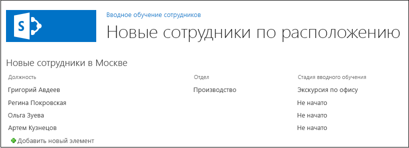

# <a name="add-a-web-part-to-a-page-in-a-sharepoint-hosted-sharepoint-add-in"></a>Добавление веб-части на страницу в надстройке SharePoint, размещаемой в SharePoint

Это пятая часть серии статей, посвященной основам разработки надстроек SharePoint, размещаемых в SharePoint. Для начала вам следует ознакомиться со статьей [Надстройки SharePoint](sharepoint-add-ins.md) и указанными ниже предыдущими статьями из этой серии.

-  [Знакомство с созданием надстроек SharePoint с размещением в SharePoint](get-started-creating-sharepoint-hosted-sharepoint-add-ins.md)
-  [Развертывание и установка надстроек SharePoint, размещаемых в SharePoint](deploy-and-install-a-sharepoint-hosted-sharepoint-add-in.md)
-  [Добавление настраиваемых столбцов в надстройку SharePoint, размещаемую в SharePoint](add-custom-columns-to-a-sharepoint-hosted-sharepoint-add-in.md)
-  [Добавление пользовательского типа контента в надстройку SharePoint, размещаемую в SharePoint](add-a-custom-content-type-to-a-sharepoint-hosted-sharepoint-add-in.md)
    
> [!NOTE]
> Если вы изучали предыдущие статьи этой серии о надстройках, размещаемых в SharePoint, то у вас уже есть решение для Visual Studio, которое можно использовать для работы с этой статьей. Кроме того, вы можете скачать репозиторий на веб-странице [SharePoint_SP-hosted_Add-Ins_Tutorials](https://github.com/OfficeDev/SharePoint_SP-hosted_Add-Ins_Tutorials) и открыть файл BeforeWebPart.sln.

В этой статье рассказывается, как добавить веб-часть на страницу, используемую по умолчанию, в надстройке SharePoint Employee Orientation (Обучение сотрудников).

## <a name="add-a-web-part-to-a-page"></a>Добавление веб-части на страницу

1. В **обозревателе решений** откройте файл Default.aspx. 

2. Так как мы будем добавлять веб-часть представления списка на страницу, на которой отображается список New Employees in Seattle (Новые сотрудники в Сиэтле), нам больше не нужна ссылка на страницу представления списка для списка. Удалите элемент **<asp:HyperLink>** из элемента **<asp:Content>**, у которого параметр **ContentPlaceHolderId** имеет значение `PlaceHolderMain`. 

3. Внутри того же элемента **<asp:Content>** добавьте указанный ниже элемент **WebPartZone**. 
    
    ```XML
      <WebPartPages:WebPartZone runat="server" FrameType="TitleBarOnly" 
          ID="HomePage1" Title="loc:full" />
    ```

4. Сохраните и закройте файл.

5. В **обозревателе решений** откройте файл elements.xml страницы в узле **Страницы**.

6. Если элемент **File** — самозакрывающийся, удалите из него символ / и добавьте закрывающий тег `</File>`.

7. В элементе **File** добавьте дочерний элемент **AllUsersWebPart**, а для его атрибута **WebPartZoneID** укажите идентификатор зоны веб-частей, созданной на странице. Теперь содержимое файла должно выглядеть примерно так, как показано ниже. Эта разметка сообщает SharePoint, что необходимо вставить элемент **AllUsersWebPart** в зону веб-частей с именем HomePage1 (Домашняя страница 1).
    
    ```
    <Elements xmlns="http://schemas.microsoft.com/sharepoint/">
      <Module Name="Pages">
        <File Path="Pages\Default.aspx" Url="Pages/Default.aspx" ReplaceContent="TRUE" >
          <AllUsersWebPart WebPartZoneID="HomePage1" WebPartOrder="1">

          </AllUsersWebPart>
        </File>
      </Module>
    </Elements>

    ```

8. Добавьте элемент **CDATA** в качестве дочернего элемента для элемента **AllUsersWebPart**. Затем добавьте элемент **webParts** в качестве дочернего элемента для элемента **CDATA**, как показано в разметке ниже. 
    
    ```
    <AllUsersWebPart WebPartZoneID="HomePage1" WebPartOrder="1">
      <![CDATA[
        <webParts>

        </webParts>
      ]]>
    </AllUsersWebPart>
    ```

9. Добавьте указанную ниже разметку **webPart** в качестве дочернего элемента для элемента **webParts**. Эта разметка добавляет элемент **XsltListViewWebPart** и сообщает веб-части, что необходимо отобразить список **New Employees in Seattle** (Новые сотрудники в Сиэтле). Обратите внимание, что для свойства **ViewContentTypeId** используется значение `0x`, а не фактический идентификатор типа контента **NewEmployee**.
    
    ```
      <webPart xmlns="http://schemas.microsoft.com/WebPart/v3">
        <metaData>
          <type name="Microsoft.SharePoint.WebPartPages.XsltListViewWebPart, 
                       Microsoft.SharePoint, Version=15.0.0.0, Culture=neutral, 
                       PublicKeyToken=71e9bce111e9429c" />
        </metaData>
        <data>
          <properties>
            <property name="ListUrl">Lists/NewEmployeesInSeattle</property>
            <property name="IsIncluded">True</property>
            <property name="NoDefaultStyle">True</property>
            <property name="Title">New Employees in Seattle</property>
            <property name="PageType">PAGE_NORMALVIEW</property>
            <property name="Default">False</property>
            <property name="ViewContentTypeId">0x</property>
          </properties>
        </data>
      </webPart>
    ```


## <a name="run-and-test-the-add-in"></a>Запуск и тестирование надстройки

1. Нажмите клавишу F5, чтобы развернуть и запустить надстройку. Visual Studio выполнит временную установку надстройки на тестовом сайте SharePoint и сразу же запустит ее. 

2. Когда откроется страница надстройки, используемая по умолчанию, на ней будет веб-часть представления списка и, соответственно, будет отображаться список. 
    
   *Рис. 1. Страница, используемая по умолчанию, с веб-частью представления списка*

   

3. Попробуйте добавлять к списку новые элементы и редактировать существующие.

4. Чтобы завершить сеанс отладки, закройте окно браузера или остановите отладку в Visual Studio. При каждом нажатии клавиши F5 Visual Studio будет отзывать предыдущую версию надстройки и устанавливать ее последнюю версию.

5. Вы будете работать с этой надстройкой и решением Visual Studio при изучении других статей, поэтому при перерывах в работе рекомендуется отзывать надстройку. В **обозревателе решений** щелкните проект правой кнопкой мыши и выберите пункт **Отозвать**.


## <a name="next-steps"></a>Дальнейшие действия 
<a name="Nextsteps"> </a>

В следующей статье этой серии вы [добавите рабочий процесс в надстройку SharePoint, размещаемую в SharePoint](add-a-workflow-to-a-sharepoint-hosted-sharepoint-add-in.md).
 

 

