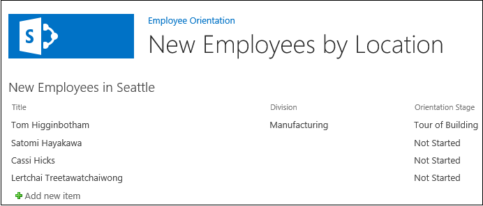

# <a name="add-a-web-part-to-a-page-in-a-sharepoint-hosted-sharepoint-add-in"></a><span data-ttu-id="e6805-101">Добавление веб-части на страницу в надстройках SharePoint, размещаемых в SharePoint</span><span class="sxs-lookup"><span data-stu-id="e6805-101">Add a Web Part to a page in a SharePoint-hosted SharePoint Add-in</span></span>
<span data-ttu-id="e6805-102">Узнайте, как добавлять веб-части на страницу в надстройках SharePoint.</span><span class="sxs-lookup"><span data-stu-id="e6805-102">Learn how to include Web Parts in a page in an SharePoint Add-ins.</span></span>
 

 <span data-ttu-id="e6805-p101">**Примечание.** Название "приложения для SharePoint" меняется на "надстройки SharePoint". Пока изменения не будут внесены полностью, в документации и пользовательском интерфейсе некоторых продуктов SharePoint и средств Visual Studio по-прежнему может встречаться термин "приложение". Дополнительные сведения см. в разделе [Новое название приложений для Office и SharePoint](new-name-for-apps-for-sharepoint#bk_newname).</span><span class="sxs-lookup"><span data-stu-id="e6805-p101">The name "apps for SharePoint" is changing to "SharePoint Add-ins". During the transition, the documentation and the UI of some SharePoint products and Visual Studio tools might still use the term "apps for SharePoint". For details, see [New name for apps for Office and SharePoint](new-name-for-apps-for-sharepoint#bk_newname).</span></span>
 

<span data-ttu-id="e6805-p102">Эта пятая часть серии статей, посвященной основам разработки надстроек SharePoint, размещаемых в SharePoint. Для начала следует ознакомиться со статьей [Надстройки SharePoint](sharepoint-add-ins) и предыдущими статьями из этой серии:</span><span class="sxs-lookup"><span data-stu-id="e6805-p102">Learn how to give your provider-hosted SharePoint Add-ins the look and feel of SharePoint. This is the second in a series of articles about the basics of developing provider-hosted SharePoint Add-ins. You should first be familiar with  [SharePoint Add-ins](sharepoint-add-ins) and the previous articles in this series:</span></span>
 

-  [<span data-ttu-id="e6805-108">Знакомство с созданием надстроек SharePoint с размещением в SharePoint</span><span class="sxs-lookup"><span data-stu-id="e6805-108">Get started creating SharePoint-hosted SharePoint Add-ins</span></span>](get-started-creating-sharepoint-hosted-sharepoint-add-ins)
    
 
-  [<span data-ttu-id="e6805-109">Развертывание и установка размещаемых в SharePoint надстроек SharePoint</span><span class="sxs-lookup"><span data-stu-id="e6805-109">Deploy and install a SharePoint-hosted SharePoint Add-in</span></span>](deploy-and-install-a-sharepoint-hosted-sharepoint-add-in)
    
 
-  [<span data-ttu-id="e6805-110">Добавление настраиваемых столбцов в надстройки, размещенные в SharePoint</span><span class="sxs-lookup"><span data-stu-id="e6805-110">Add custom columns to a SharePoint-hostedSharePoint Add-in</span></span>](add-custom-columns-to-a-sharepoint-hostedsharepoint-add-in)
    
 
-  [<span data-ttu-id="e6805-111">Добавление настраиваемого типа контента в надстройки, размещенные в SharePoint</span><span class="sxs-lookup"><span data-stu-id="e6805-111">Add a custom content type to a SharePoint-hostedSharePoint Add-in</span></span>](add-a-custom-content-type-to-a-sharepoint-hostedsharepoint-add-in)
    
 

 <span data-ttu-id="e6805-p103">**Примечание.** Если вы изучали предыдущие статьи этой серии о надстройках, размещаемых в SharePoint, то у вас уже есть решение для Visual Studio, которое можно использовать для работы с данной статьей. Кроме того, вы можете скачать репозиторий [SharePoint_SP-hosted_Add-Ins_Tutorials](https://github.com/OfficeDev/SharePoint_SP-hosted_Add-Ins_Tutorials) и открыть файл BeforeWebPart.sln.</span><span class="sxs-lookup"><span data-stu-id="e6805-p103">**Note** If you have been working through this series about SharePoint-hosted add-ins, then you have a Visual Studio solution that you can use to continue with this topic. You can also download the repository at  [SharePoint_SP-hosted_Add-Ins_Tutorials](https://github.com/OfficeDev/SharePoint_SP-hosted_Add-Ins_Tutorials) and open the BeforeColumns.sln file.</span></span>
 

<span data-ttu-id="e6805-114">В этой статье описывается добавление веб-части на страницу по умолчанию в надстройке SharePoint "Employee Orientation" (Обучение сотрудников).</span><span class="sxs-lookup"><span data-stu-id="e6805-114">In this article you add a Web Part to the default page of the Employee Orientation SharePoint Add-in.</span></span>
 

## <a name="add-a-web-part-to-a-page"></a><span data-ttu-id="e6805-115">Добавление веб-части на страницу</span><span class="sxs-lookup"><span data-stu-id="e6805-115">Add a Web Part to a page</span></span>


 

 

1. <span data-ttu-id="e6805-116">В **обозревателе решений** откройте файл Default.aspx.</span><span class="sxs-lookup"><span data-stu-id="e6805-116">In Solution Explorer, open the Web.config file.</span></span> 
    
 
2. <span data-ttu-id="e6805-p104">Мы добавим на страницу веб-часть представления списка, в которой отображается список "New Employees in Seattle" (Новые сотрудники в Сиэтле), поэтому нам больше не требуется ссылка на страницу соответствующего представления. Удалите элемент **<asp:HyperLink>** из элемента **<asp:Content>**, где для параметра **ContentPlaceHolderId** задано значение `PlaceHolderMain`.</span><span class="sxs-lookup"><span data-stu-id="e6805-p104">We'll be adding a list view Web Part to the page that surfaces the New Employees in Seattle list, so there's no longer a need to have a link to the list view page for the list. Remove the **<asp:HyperLink>** element from the **<asp:Content>** element whose **ContentPlaceHolderId** is `PlaceHolderMain`.</span></span> 
    
 
3. <span data-ttu-id="e6805-119">Добавьте в элемент **<asp:Content>** приведенный ниже параметр **WebPartZone**.</span><span class="sxs-lookup"><span data-stu-id="e6805-119">Inside the same  **<asp:Content>** element, add the following **WebPartZone**.</span></span> 
    
```XML
  <WebPartPages:WebPartZone runat="server" FrameType="TitleBarOnly" 
      ID="HomePage1" Title="loc:full" />

```

4. <span data-ttu-id="e6805-120">Сохраните и закройте файл.</span><span class="sxs-lookup"><span data-stu-id="e6805-120">Save and close the file.</span></span>
    
 
5. <span data-ttu-id="e6805-121">В **обозревателе решений** откройте файл elements.xml страницы в узле **Страницы**.</span><span class="sxs-lookup"><span data-stu-id="e6805-121">In  **Solution Explorer**, open the elements.xml file for the page in the  **Pages** node.</span></span>
    
 
6. <span data-ttu-id="e6805-122">Если элемент **File** является самозакрывающимся, удалите из него символ "/" и добавьте закрывающий тег `</File>`.</span><span class="sxs-lookup"><span data-stu-id="e6805-122">If the  **File** element is self-closing, remove the "/" character from it and add the end tag `</File>`.</span></span>
    
 
7. <span data-ttu-id="e6805-p105">В элементе **File** добавьте дочерний элемент **AllUsersWebPart** и задайте для его свойства **WebPartZoneID** значение идентификатора зоны веб-частей, созданной на странице. Теперь содержимое файла должно выглядеть так, как показано ниже. Эта часть кода указывает среде SharePoint, что необходимо вставить объект **AllUsersWebPart** в зону веб-частей с именем HomePage1.</span><span class="sxs-lookup"><span data-stu-id="e6805-p105">In the  **File** element, add a child **AllUsersWebPart** element and set its **WebPartZoneID** to the ID of the Web Part zone that you created on the page. The file's contents should now look like the following. This markup tells SharePoint to insert an **AllUsersWebPart** into the Web Part zone that is named "HomePage1".</span></span>
    
```
  <Elements xmlns="http://schemas.microsoft.com/sharepoint/">
  <Module Name="Pages">
    <File Path="Pages\Default.aspx" Url="Pages/Default.aspx" ReplaceContent="TRUE" >
      <AllUsersWebPart WebPartZoneID="HomePage1" WebPartOrder="1">

      </AllUsersWebPart>
    </File>
  </Module>
</Elements>

```

8. <span data-ttu-id="e6805-126">Добавьте элемент **CDATA** в качестве дочернего для элемента **AllUsersWebPart**. Затем добавьте элемент **webParts** в качестве дочернего для элемента **CDATA**, как в приведенной ниже части кода.</span><span class="sxs-lookup"><span data-stu-id="e6805-126">Add a **CDATA** element as a child of the **AllUsersWebPart**, then add a **webParts** element as a child of the **CDATA**, as shown in this example.</span></span> 
    
```
  <AllUsersWebPart WebPartZoneID="HomePage1" WebPartOrder="1">
  <![CDATA[
    <webParts>

    </webParts>
  ]]>
</AllUsersWebPart>
```

9. <span data-ttu-id="e6805-p106">Добавьте приведенную ниже часть кода, заключенную в тег **webPart**, в элемент **webParts** как дочерний элемент. Эта часть кода добавляет объект **XsltListViewWebPart** и сообщает веб-части, что требуется показать список "New Employees in Seattle" (Новые сотрудники в Сиэтле). Обратите внимание, что для нового свойства **ViewContentTypeId** задано значение "0x", а не фактический идентификатор типа контента theNewEmployee.</span><span class="sxs-lookup"><span data-stu-id="e6805-p106">Add the following  **webPart** markup as a child of the **webParts** element. This markup adds an **XsltListViewWebPart** and tells the Web Part to show theNew Employees in Seattle list. Note that the **ViewContentTypeId** property value is just "0x", not the actual ID of theNewEmployee content type.</span></span>
    
```
  
  <webPart xmlns="http://schemas.microsoft.com/WebPart/v3">
    <metaData>
      <type name="Microsoft.SharePoint.WebPartPages.XsltListViewWebPart, 
                   Microsoft.SharePoint, Version=15.0.0.0, Culture=neutral, 
                   PublicKeyToken=71e9bce111e9429c" />
    </metaData>
    <data>
      <properties>
        <property name="ListUrl">Lists/NewEmployeesInSeattle</property>
        <property name="IsIncluded">True</property>
        <property name="NoDefaultStyle">True</property>
        <property name="Title">New Employees in Seattle</property>
        <property name="PageType">PAGE_NORMALVIEW</property>
        <property name="Default">False</property>
        <property name="ViewContentTypeId">0x</property>
      </properties>
    </data>
  </webPart>
```


## <a name="run-and-test-the-add-in"></a><span data-ttu-id="e6805-130">Запуск и тестирование надстройки</span><span class="sxs-lookup"><span data-stu-id="e6805-130">Run and test the add-in</span></span>


 

 

1. <span data-ttu-id="e6805-p107">Нажмите клавишу F5, чтобы развернуть и запустить надстройку. Visual Studio выполнит временную установку надстройки на тестовом сайте SharePoint и сразу же запустит ее.</span><span class="sxs-lookup"><span data-stu-id="e6805-p107">Use the F5 key to deploy and run your add-in. Visual Studio makes a temporary installation of the add-in on your test SharePoint site and immediately runs the add-in.</span></span> 
    
 
2. <span data-ttu-id="e6805-133">Когда откроется страница надстройки по умолчанию, на ней будет отображаться веб-часть представления списка.</span><span class="sxs-lookup"><span data-stu-id="e6805-133">When the add-in's default page opens, the list view Web Part is on it and the list is displayed.</span></span> 
    
    <span data-ttu-id="e6805-134">**Страница по умолчанию с веб-частью представления списка**</span><span class="sxs-lookup"><span data-stu-id="e6805-134">**Default page with list view Web part**</span></span>

 

     
 

    
    
 
3. <span data-ttu-id="e6805-136">Попробуйте добавлять к списку новые элементы и редактировать существующие.</span><span class="sxs-lookup"><span data-stu-id="e6805-136">Try adding new items to the list and editing existing items.</span></span>
    
 
4. <span data-ttu-id="e6805-p108">Чтобы завершить сеанс отладки, закройте окно браузера или остановите отладку в Visual Studio. При каждом нажатии клавиши F5 Visual Studio будет отзывать предыдущую версию надстройки и устанавливать ее последнюю версию.</span><span class="sxs-lookup"><span data-stu-id="e6805-p108">To end the debugging session, close the browser window or stop debugging in Visual Studio. Each time that you press F5, Visual Studio will retract the previous version of the add-in and install the latest one.</span></span>
    
 
5. <span data-ttu-id="e6805-p109">Эти надстройка и решение Visual Studio будут рассматриваться и в других статьях, поэтому при перерывах в работе рекомендуем отзывать надстройку. В **обозревателе решений** щелкните проект правой кнопкой мыши и выберите пункт **Отозвать**.</span><span class="sxs-lookup"><span data-stu-id="e6805-p109">You will work with this add-in and Visual Studio solution in other articles, and it's a good practice to retract the add-in one last time when you are done working with it for a while. Right-click the project in **Solution Explorer** and choose **Retract**.</span></span>
    
 

## 
<span data-ttu-id="e6805-141"><a name="Nextsteps"> </a></span><span class="sxs-lookup"><span data-stu-id="e6805-141"></span></span>

<span data-ttu-id="e6805-142">В следующей статье этой серии, [Добавление рабочего процесса к надстройке, размещенной в SharePoint](add-a-workflow-to-a-sharepoint-hosted-sharepoint-add-in), описано добавление рабочего процесса к надстройке SharePoint.</span><span class="sxs-lookup"><span data-stu-id="e6805-142">In the next article in this series, you'll add  a custom page and style to the spappsing: Add a custom page and styles to a SharePoint-hosted Add-in.</span></span>
 

 

