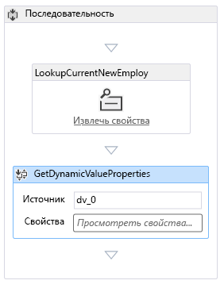
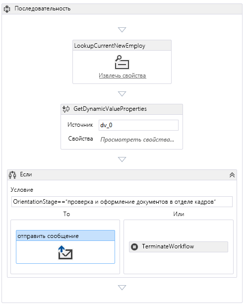

# Добавление рабочего процесса в надстройку SharePoint, размещаемую в SharePoint

Это шестая статья серии статей, посвященных основам разработки надстроек SharePoint, размещаемых в SharePoint. Для начала вам следует ознакомиться со статьей [Надстройки SharePoint](sharepoint-add-ins.md) и предыдущими статьями из этой серии.
 
- [Начало работы по созданию надстроек SharePoint, размещаемых в SharePoint](get-started-creating-sharepoint-hosted-sharepoint-add-ins.md)
- [Развертывание и установка надстроек SharePoint, размещаемых в SharePoint](deploy-and-install-a-sharepoint-hosted-sharepoint-add-in.md)
- [Добавление настраиваемых столбцов в надстройку SharePoint, размещаемую в SharePoint](add-custom-columns-to-a-sharepoint-hosted-sharepoint-add-in.md)
- [Добавление пользовательского типа контента в надстройку SharePoint, размещаемую в SharePoint](add-a-custom-content-type-to-a-sharepoint-hosted-sharepoint-add-in.md)
- [Добавление веб-части на страницу в надстройке SharePoint, размещаемой в SharePoint](add-a-web-part-to-a-page-in-a-sharepoint-hosted-sharepoint-add-in.md)

> [!NOTE]
> Если вы изучали предыдущие статьи этой серии о надстройках, размещаемых в SharePoint, то у вас уже есть решение для Visual Studio, которое можно использовать для работы с этой статьей. Кроме того, вы можете скачать репозиторий на веб-странице [SharePoint_SP-hosted_Add-Ins_Tutorials](https://github.com/OfficeDev/SharePoint_SP-hosted_Add-Ins_Tutorials) и открыть файл BeforeWorkflow.sln.

Работая с этой статьей, вы добавите рабочий процесс в надстройку SharePoint "Employee Orientation" (Обучение сотрудников). Этот рабочий процесс уведомляет отдел кадров, что новый сотрудник готов заполнить документы, необходимые для отдела кадров.

## Добавление рабочего процесса в надстройку

1. В **обозревателе решений** щелкните правой кнопкой мыши проект и пункты **Добавить** > **Новая папка**. Присвойте папке имя **Workflows** (Рабочие процессы).
    
2. Щелкните правой кнопкой мыши новую папку и выберите пункты **Добавить** > **Новый элемент**. Откроется диалоговое окно **Добавление нового элемента** для узла **Office/SharePoint**.
    
3. Выберите **рабочий процесс** и присвойте ему имя **HR_Intake**. Когда отобразится соответствующий запрос, выберите тип рабочего процесса, щелкните **Рабочий процесс списка**, а затем нажмите кнопку **Далее**. 
 
4. На следующей странице мастера включите параметр **Да, связать…** и выберите в раскрывающихся списках указанные ниже значения.
    
   -  **Библиотека или список, связываемые с рабочим процессом**: New Employees in Seattle (Новые сотрудники в Сиэтле).
   -  **Список журнала**: `<create new>`.
   -  **Список задач**: `<create new>`.

5. Нажмите кнопку **Далее**.
    
6. На последней странице мастера выберите *только* вариант автоматического запуска рабочего процесса при *изменении* элемента.
    
7. Нажмите кнопку **Готово**.
    
   После этого набор "Инструменты разработчика Office для Visual Studio" выполнит указанные ниже действия.
      - Создаст рабочий процесс HR_Intake в папке **Workflow** (Рабочий процесс) с дочерним файлом Workflow.xaml, который открыт в конструкторе рабочих процессов.
      - Создаст экземпляр списка **WorkflowTaskList**, в котором создаются и обновляются задачи, входящие в рабочий процесс.
      - Создаст экземпляр списка **WorkflowHistoryList**, в который записываются различные действия при выполнении рабочего процесса.
    
8. Перетащите два новых экземпляра списка в папку **Lists** (Списки).
    
## Разработка рабочего процесса

Рабочий процесс отправляет электронное письмо, чтобы уведомить сотрудника отдела кадров о том, что новый сотрудник прошел этап обучения **Tour of building** (Тур по зданию) и готов заполнить необходимые бумаги для отдела кадров. Любое изменение существующего элемента в списке **New Employees in Seattle** (Новые сотрудники в Сиэтле) активирует рабочий процесс, но рабочий процесс не делает ничего за исключением случаев, когда в поле **Orientation Stage** (Этап обучения) элемента списка указано значение **HR paperwork** (Документы для отдела кадров). Если указано это значение, электронное письмо будет отправлено сотруднику отдела кадров, и задача для этого сотрудника будет добавлена в объект **WorkflowTaskList**. 

 > [!NOTE]
 > При создании рабочего процесса на одном или нескольких элементах в конструкторе рабочих процессов будет появляться синий ромб с восклицательным знаком ( ). Он свидетельствует о временных ошибках. (Наведите курсор на символ, чтобы отобразить краткое сообщение, или просмотрите подробные сведения в **списке ошибок** в Visual Studio.) Это побочные эффекты незавершенности рабочего процесса. Они должны исчезнуть, когда вы полностью выполните эту процедуру.

1. Откройте область **Панель элементов** в Visual Studio, разверните узел **SP — Список**, а затем перетащите элемент **LookupSPListItem** в элемент **Последовательность** в конструкторе.
    
2. Выберите элемент **LookupSPListItem**. Его свойства отобразятся в области **Свойства** в Visual Studio. Задайте для свойств указанные ниже значения.
    
   -  **ItemID:** (текущий элемент).
   -  **ListID:** (текущий список)
   -  **DisplayName:** LookupCurrentNewEmployee.

   Теперь область**Свойства** должна выглядеть так, как показано ниже.
   
    *Рис. 1. Область "Свойства" для элемента LookupSPListItem*

    
 

3. Чтобы сохранить внесенные изменения, щелкните в любом месте за пределами области. Теперь рабочая область конструктора должна выглядеть так, как показано ниже.
    
    *Рис. 2. Поле "Последовательность" в конструкторе рабочих процессов*

    

4. Щелкните ссылку **Получить свойства** для недавно переименованного действия **LookupCurrentNewEmployee** в конструкторе. В результате в последовательность будет добавлено действие **GetDynamicValueProperties**.
    
5. Щелкните текст **Определить…** в действии **GetDynamicValueProperties**. Откроется диалоговое окно **Свойства**.
    
6. Присвойте параметру **Тип сущности** значение **Элемент списка** _имя_экземпляра_списка_, где _имя_экземпляра_списка_ — текст **New Employees in Seattle** (Новые сотрудники в Сиэтле).
    
7. В столбце **Путь** щелкните верхнюю ячейку и в раскрывающемся списке выберите пункт **Orientation Stage** (Этап обучения).
 
8. Щелкните ячейку, расположенную ниже, и в раскрывающемся списке выберите пункт **Title (Title)** (Название).
 
9. Щелкните ссылку **Populate Variables** (Заполнить переменные). В результате будут созданы переменные с именами **OrientationStage** и **Title** (Название). Кроме того, все значения будут назначены соответствующим полям в текущем элементе списка **New Employees in Seattle** (Новые сотрудники в Сиэтле). Теперь диалоговое окно **Свойства** должно выглядеть так, как показано ниже.
    
   *Рис. 3. Диалоговое окно "Свойства" действия рабочего процесса*

   
 

10. Нажмите кнопку **ОК**. Теперь рабочая область конструктора должна выглядеть так, как показано ниже.
    
    *Рис. 4. Конструктор рабочих процессов*

    

11. Откройте область **Панель элементов** в Visual Studio, разверните узел **Поток управления**, а затем перетащите элемент **If** в нижнюю часть поля **Последовательность** под элементом **GetDynamicValueProperties**.
 
12. В поле **Условие** элемента **If** введите **OrientationStage=="HR paperwork"**.
    
13. Откройте область **Панель элементов** в Visual Studio, разверните узел **SP — Utilities**, а затем перетащите элемент **Электронная почта** в поле **Then** действия **If**.
    
14. Выберите действие **Электронная почта**. В области **Свойства** области задайте необходимые значения для свойств **Основной текст**, **Тема** и **Кому**. В любом случае нажмите кнопку **. . .** на выноске для свойства и с помощью открывшегося **редактора выражений** задайте значения свойств, как показано в таблице ниже. Ниже указаны строковые выражения для языка C#, поэтому используйте кавычки, точно так, как показано в таблице. Здесь `Title` — переменная, которую вы назначили ранее полю **Title** (Название) элемента списка (в котором содержится имя сотрудника).
    
    -  **Основной текст:** `Title + " is waiting in the lobby to fill out benefits and employment forms."`.
    -  **Тема:** `Title + " is ready for HR paperwork"`
    -  **Кому:** `new System.Collections.ObjectModel.Collection<string>() {"your_O365_email"}`.
    
    Замените заполнитель *your_O365_email* идентификатором, который вы используете для входа в свою учетную запись разработчика в Office 365, например `*alias*@*O365domain*.sharepoint.com`. Это строка на языке C#, поэтому она должна быть заключена в кавычки.
    
15. Откройте область **Панель элементов** в Visual Studio, разверните узел **Среда выполнения**, а затем перетащите элемент **TerminateWorkflow** в поле **Else** действия **If**.
    
16. Выберите действие **TerminateWorkflow** и в области **Свойства** введите в поле **Причина** следующее значение (*включая кавычки*): `"Not at HR paperwork stage."`. Теперь конструктор должен выглядеть так, как показано ниже.
    
    *Рис. 5. Конструктор рабочих процессов после завершения рабочего процесса*

    
 

## Запуск и тестирование надстройки

1. Нажмите клавишу F5, чтобы развернуть и запустить надстройку. Visual Studio выполняет временную установку надстройки на вашем тестовом сайте SharePoint и сразу же запускает ее. Кроме того, откроется консоль **Узел тестовой службы** диспетчера рабочих процессов.
    
2. Когда откроется страница надстройки, используемая по умолчанию, откройте один из элементов для редактирования и присвойте параметру **Orientation Stage** (Этап обучения) значение **HR paperwork** (Оформление документов для отдела кадров). 
    
   На консоли **Узел службы тестирования** отобразится индикатор того, что рабочий процесс запущен. Вскоре после этого отобразится индикатор того, что рабочий процесс завершен. Ниже приведен пример.
 
   *Рис. 6. Консоль "Узел службы тестирования"*

   
 
    > [!NOTE]
    > Если консоль **Узел службы тестирования** не откроется, вам, возможно, потребуется включить функцию отладки рабочего процесса. Щелкните правой кнопкой мыши имя проекта в **обозревателе решений** и выберите пункт **Свойства**. Откройте вкладку **SharePoint** в области **Свойства** и установите флажок **Включить отладку рабочего процесса**.

3. Перейдите в папку "Входящие" (Outlook) вашей учетной записи разработчика в Office 365. В ней будет электронное письмо с темой "*Employee* is ready for HR paperwork" (Сотрудник готов к оформлению документов для отдела кадров), в котором вместо слова *Employee* (Сотрудник) будет имя сотрудника, элемент которого вы изменили. Текст электронного письма с фразой "*Employee* is waiting in the lobby to fill out benefits and employment forms" (Сотрудник ожидает в холле, чтобы заполнить формы для трудоустройства). Ниже приведен пример.
    
   *Рис. 7. Электронное письмо, отправленное рабочим процессом*

   

   > [!TIP]
   > Если рабочий процесс начинается, но никогда не завершается и не отправляет электронное письмо, попробуйте завершить сеанс отладки и нажмите клавишу F5 еще несколько раз, прежде чем сделать вывод, что в коде что-то не так. Иногда проблема заключается в SharePoint Online. Если у вас по-прежнему возникают проблемы, попробуйте добавить тип контента с именем **ListFieldsContentType**, если его еще не существует, в раздел **ContentTypes** файла schema.xml. Ниже приведен пример части кода. 
   
   > `<ContentType ID="0x0100781dd48170b94fdc9706313c82b3d04c" Name="ListFieldsContentType" Hidden="TRUE"></ContentType>`
   
   > Скопируйте весь раздел **FieldRefs** типа контента **NewEmployee** в этот новый тип контента. Сохраните проект, отзовите его и еще раз нажмите клавишу F5.

4. Чтобы завершить сеанс отладки, закройте окно браузера или остановите отладку в Visual Studio. При каждом нажатии клавиши F5 Visual Studio будет отзывать предыдущую версию надстройки и устанавливать ее последнюю версию.
    
5. Вы будете работать с этой надстройкой и решением Visual Studio при изучении других статей, поэтому при перерывах в работе рекомендуется отзывать надстройку. В **обозревателе решений** щелкните проект правой кнопкой мыши и выберите пункт **Отозвать**.
    

## Дальнейшие действия

В следующей статье этой серии вы [добавите пользовательскую страницу в надстройку SharePoint, размещаемую в SharePoint](add-a-custom-page-and-style-to-a-sharepoint-hosted-sharepoint-add-in.md).
 

 

