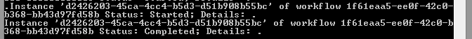

# Добавление рабочего процесса в надстройку с размещением в SharePoint
Узнайте, как добавить рабочий процесс в надстройку SharePoint.
 

 **Примечание.** Название "приложения для SharePoint" меняется на "надстройки SharePoint". В процессе перехода с одного названия на другое в документации и пользовательском интерфейсе некоторых продуктов SharePoint и средств Visual Studio по-прежнему может встречаться термин "приложения для SharePoint". Дополнительные сведения см. в статье [Новое название приложений для Office и SharePoint](new-name-for-apps-for-sharepoint#bk_newname).
 

Это шестая статья о разработке надстроек с размещением в SharePoint. Для начала вам следует ознакомиться со статьей [Надстройки SharePoint](sharepoint-add-ins) и предыдущими статьями из этой серии:
 

-  [Знакомство с созданием надстроек SharePoint с размещением в SharePoint](get-started-creating-sharepoint-hosted-sharepoint-add-ins)
    
 
-  [Развертывание и установка надстроек SharePoint, размещаемых в SharePoint](deploy-and-install-a-sharepoint-hosted-sharepoint-add-in)
    
 
-  [Добавление настраиваемых столбцов в надстройки, размещаемые в SharePoint](add-custom-columns-to-a-sharepoint-hostedsharepoint-add-in)
    
 
-  [Добавление настраиваемого типа контента в надстройки, размещаемые в SharePoint](add-a-custom-content-type-to-a-sharepoint-hostedsharepoint-add-in)
    
 
-  [Добавление веб-части на страницу в надстройке с размещением в SharePoint](add-a-web-part-to-a-page-in-a-sharepoint-hosted-sharepoint-add-in)
    
 

 **Примечание.** Если вы выполняли действия из предыдущих статей этой серии, у вас уже есть решение Visual Studio, которое можно использовать для работы с этой статьей. Вы также можете скачать репозиторий [SharePoint_SP-hosted_Add-Ins_Tutorials](https://github.com/OfficeDev/SharePoint_SP-hosted_Add-Ins_Tutorials) и открыть файл BeforeWorkflow.sln.
 

В этой статье в надстройку SharePoint добавляется рабочий процесс, который уведомляет отдел кадров о том, что новый сотрудник готов к заполнению документов.
 

## Добавление рабочего процесса в надстройку

 

 

1. В **обозревателе решений** щелкните проект правой кнопкой мыши и выберите **Добавить** > **Новая папка**. Назовите папку "Рабочие процессы".
    
 
2. Щелкните новую папку правой кнопкой мыши и выберите **Добавить** > **Новый элемент**. Откроется диалоговое окно **Добавление нового элемента** (узел **Office/SharePoint**).
    
 
3. Выберите **Рабочий процесс** и присвойте ему имя HR_Intake. Выберите **Рабочий процесс списка** в качестве типа рабочего процесса и нажмите **Далее**.
    
 
4. На следующей странице мастера включите параметр **Да, связать...** и выберите в раскрывающихся списках следующие значения:
    
      -  **Библиотека или список, связываемые с рабочим процессом**
    
    Новые сотрудники в Москве
    
 
  -  **Список журналов...**
    
    <create new>
    
 
  -  **Список задач...**
    
    <create new>
    
 

    Нажмите **Далее**.
    
 
5. На последней странице мастера включите *только* автоматический запуск рабочего процесса при *изменении* элемента.
    
 
6. Нажмите **Готово**.
    
    После этого Инструменты разработчика Office для Visual Studio сделают следующее:
    
      - создадут рабочий процесс HR_Intake в папке **Рабочий процесс** с дочерним файлом Workflow.xaml, который открыт в конструкторе рабочих процессов;
    
 
  - создадут экземпляр списка **WorkflowTaskList**, в котором создаются и обновляются задачи, входящие в рабочий процесс;
    
 
  - создадут экземпляр списка **WorkflowHistoryList**, в который записываются различные этапы выполнения рабочего процесса.
    
 
7. Перетащите два новых экземпляра списка в папку **Списки**.
    
 

## Создание рабочего процесса

Рабочий процесс отправляет в отдел кадров уведомление о том, что новый сотрудник завершил этап ориентации **Экскурсия по офису** и готов к заполнению бумаг. Рабочий процесс запускают любые изменения в элементе списка "Новые сотрудники в Москве", но он работает, только если в поле "Этап ориентации" указано значение "Оформление документов в отделе кадров". В этом случае сотруднику отделку кадров отправляется сообщение, и в **WorkflowTaskList** добавляется соответствующая задача. 
 

 

 **Примечание.** При создании рабочего процесса на одном или нескольких элементах в конструкторе рабочих процессов будет появляться синий ромб с восклицательным знаком. 
 

 
Он указывает на временные ошибки. (Наведите указатель на символ, чтобы просмотреть краткое описание или откройте **список ошибок** в Visual Studio, чтобы узнать больше). Это побочные эффекты незавершенности рабочего процесса. Все они исчезнут после завершения этой процедуры.
 

1. Откройте панель элементов в Visual Studio, разверните узел **SharePoint — список** и перетащите **LookupSPListItem** в **Последовательность** в конструкторе.
    
 
2. Выберите элемент **LookupSPListItem**, чтобы его свойства появились в области **Свойства** Visual Studio. Присвойте свойствам следующие значения:
    
      -  **ItemID:** (текущий элемент)
    
 
  -  **ListID:** (текущий список)
    
 
  -  **DisplayName:** LookupCurrentNewEmployee
    
 

    Теперь область **Свойства** должна выглядеть следующим образом:
    

    **Область свойств LookupSPListItem**

 

  
 

    Щелкните в любом месте за пределами области, чтобы сохранить изменения. Теперь рабочая область конструктора должна выглядеть следующим образом.
    

    **Последовательность в конструкторе рабочих процессов**

 

  
 

    
    
 
3. Щелкните ссылку **Получить свойства** внутри переименованного действия LookupCurrentNewEmployee в конструкторе. После этого в последовательность будет добавлено действие **GetDynamicValueProperties**.
    
 
4. Щелкните текст **Определить...** в действии **GetDynamicValueProperties**. После того откроется диалоговое окно **Свойства**.
    
 
5. В поле **Тип сущности** выберите **Элемент списка** _имя_экземпляра_списка_, где _имя_экземпляра_списка_ — это "Новые сотрудники в Москве".
    
 
6. В столбце **Путь** щелкните верхнюю ячейку и выберите "Этап ориентации" из раскрывающегося списка.
    
 
7. Щелкните ячейку, расположенную ниже, и выберите **Обращение (Обращение)** из раскрывающегося списка.
    
 
8. Щелкните **Заполнить переменные**. Будут созданы переменные OrientationStage и **Title**, которые будут присвоены соответствующим полям в текущего элементе списка "Новые сотрудники в Москве". Диалоговое окно **Свойства** теперь должно выглядеть следующим образом:
    
    **Диалоговое окно свойств действия рабочего процесса**

 

  
 

 

 
9. Нажмите **ОК**. Рабочая область конструктора теперь должна выглядеть следующим образом:
    
    **Конструктор рабочих процессов**

 

  
 

    
    
 
10. Откройте панель элементов в Visual Studio, разверните узел **Поток управления** и перетащите элемент **Если** в нижнюю часть области **Последовательность** под элемент **GetDynamicValueProperties**.
    
 
11. В поле **Условие** элемента **Если** введите OrientationStage=="Оформление документов в отделе кадров".
    
 
12. Откройте панель элементов в Visual Studio, разверните узел **SharePoint — служебные программы** и перетащите элемент **Электронная почта** в поле **То** действия **Если**.
    
 
13. Выберите действие **Электронная почта**. В области **Свойства** задайте значения свойств "Основной текст", "Тема" и "Кому". В каждом случае нажимайте кнопку выноски **. . .** и используйте открывшийся **редактор выражений**, чтобы ввести значение свойства, как показано в таблице ниже. Это строковые выражения C#, поэтому необходимо использовать кавычки именно так, как показано. `Title` здесь — это переменная, присвоенная ранее полю **Title** элемента списка (оно содержит имя сотрудника).
    
      -  **Основной текст:** `Title + " is waiting in the lobby to fill out benefits and employment forms."`
    
 
  -  **Тема:** `Title + " is ready for HR paperwork"`
    
 
  -  **Кому:** `new System.Collections.ObjectModel.Collection<string>() {"your_O365_email"}`
    
    Замените заполнитель *your_O365_email* идентификатором, который вы используете для входа в свою учетную запись разработчика Office 365, например *псевдоним*  @ *доменO365*  .sharepoint.com. Это строка C#, поэтому она должна быть в кавычках.
    
 
14. Откройте панель элементов в Visual Studio, разверните узел **Среда выполнения** и перетащите элемент **TerminateWorkflow** в поле **Иначе** действия **Если**.
    
 
15. Выберите действие **TerminateWorkflow** в области **Свойства** и введите в поле **Причина** следующее значение, включая кавычки: "Не на этапе оформления документов в отделе кадров". Теперь конструктор должен выглядеть следующим образом:
    
    **Конструктор рабочих процессов после завершения рабочего процесса**

 

  
 

 

 

## Запуск и тестирование надстройки

 

 

1. Нажмите клавишу F5, чтобы развернуть и запустить надстройку. Visual Studio установит надстройку на вашем тестовом сайте SharePoint и немедленно запустит её. Кроме того, откроется консоль **Узел службы тестирования** диспетчера рабочих процессов.
    
 
2. Когда откроется страница надстройки по умолчанию, откройте один из элементов для редактирования и присвойте параметру "Этап ориентации" значение "Оформление документов в отделе кадров". 
    
    В консоли **Узел службы тестирования** появится индикатор запуска рабочего процесса. Вскоре после этого появится индикатор завершения рабочего процесса. Ниже приведен пример:
    

    **Консоль "Узел службы тестирования"**

 

  
 

    
    
    
     **Примечание.** Если консоль **Узел службы тестирования** не открывается, включите отладку рабочего процесса. Щелкните правой кнопкой мыши имя проекта в **обозревателе решений** и выберите **Свойства**. Откройте вкладку **SharePoint** в области **Свойства** и установите флажок **Включить отладку рабочего процесса**.
3. Перейдите в папку "Входящие" (Outlook) вашей учетной записи разработчика Office 365. В ней будет сообщение с темой "*Сотрудник* готов к оформлению документов в отделе кадров", где *Сотрудник* — имя сотрудника, чей элемент вы изменили. Текст сообщения будет таким: "*Сотрудник* ожидает в вестибюле для заполнения заявлений на соцобеспечение и трудоустройство". Ниже приведен пример:
    
    **Письмо, отправленное рабочим процессом**

 

  
 

    
    
    
     **Совет.** Если рабочий процесс начинает, но не завершает работу, и письмо не отправляется, завершите сеанс отладки и повторите запуск (F5) еще несколько раз, прежде чем решать, что в коде ошибка. Иногда проблема заключается в SharePoint Online. Если проблемы не исчезают, добавьте тип контента ** ListFieldsContentType **, если он еще не добавлен, в раздел **ContentTypes** файла schema.xml. Ниже приведен пример разметки. `<ContentType ID="0x0100781dd48170b94fdc9706313c82b3d04c" Name="ListFieldsContentType" Hidden="TRUE">`
 
 `</ContentType>`Скопируйте весь раздел **FieldRefs** типа контента **NewEmployee** в этот новый тип контента. Сохраните проект, выполните отзыв и повторите запуск (F5).
4. Чтобы завершить сеанс отладки, закройте окно браузера или остановите отладку в Visual Studio. При каждом нажатии клавиши F5 Visual Studio будет отзывать предыдущую версию надстройки и устанавливать ее последнюю версию.
    
 
5. Эти надстройка и решение Visual Studio будут рассматриваться и в других статьях, поэтому при перерывах в работе рекомендуется отзывать надстройку. В **обозревателе решений** щелкните проект правой кнопкой мыши и выберите пункт **Отозвать**.
    
 

## 

Следующая статья серии: [Добавление пользовательских страницы и стиля в надстройку с размещением в SharePoint](add-a-custom-page-and-style-to-a-sharepoint-hosted-sharepoint-add-in).
 

 

