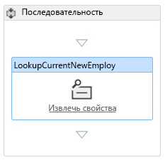
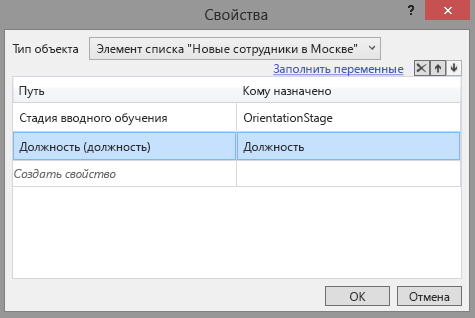

# Добавление рабочего процесса в надстройку с размещением в SharePointAdd a workflow to a SharePoint-hosted SharePoint Add-in

Это шестая часть серии статей, посвященной основам разработки надстроек SharePoint, размещаемых в SharePoint. Для начала вам следует ознакомиться со статьей [Надстройки SharePoint](sharepoint-add-ins.md) и предыдущими статьями этой серии, представленными в разделе [Знакомство с созданием надстроек SharePoint, размещаемых в SharePoint](get-started-creating-sharepoint-hosted-sharepoint-add-ins.md#Nextsteps).This is the sixth in a series of articles about the basics of developing SharePoint-hosted SharePoint Add-ins. You should first be familiar with [SharePoint Add-ins](sharepoint-add-ins.md) and the previous articles in this series: 

> [!NOTE]
> Если вы изучали предыдущие статьи этой серии о надстройках, размещаемых в SharePoint, то у вас уже есть решение для Visual Studio, которое можно использовать для работы с этой статьей.If you have been working through this series about SharePoint-hosted add-ins, you have a Visual Studio solution that you can use to continue with this topic. Кроме того, вы можете скачать репозиторий на веб-странице [SharePoint_SP-hosted_Add-Ins_Tutorials](https://github.com/OfficeDev/SharePoint_SP-hosted_Add-Ins_Tutorials) и открыть файл BeforeWorkflow.sln.You can also download the repository at [SharePoint_SP-hosted_Add-Ins_Tutorials](https://github.com/OfficeDev/SharePoint_SP-hosted_Add-Ins_Tutorials) and open the BeforeWorkflow.sln file.

Работая с этой статьей, вы добавите рабочий процесс в надстройку SharePoint "Employee Orientation" (Обучение сотрудников). Этот рабочий процесс уведомляет отдел кадров, что новый сотрудник готов заполнить документы, необходимые для отдела кадров.In this article, you add a workflow in the Employee Orientation SharePoint Add-in that notifies the Human Resources (HR) department that a new employee is ready to fill out the HR paperwork.

## Добавление рабочего процесса в надстройкуAdd a workflow to an add-in

1. В **обозревателе решений** щелкните правой кнопкой мыши проект и пункты **Добавить** > **Новая папка**.In **Solution Explorer**, right-click the project, and select **Add** > **New Folder**. Присвойте папке имя **Workflows** (Рабочие процессы).Name the folder **Workflows**.
    
2. Щелкните правой кнопкой мыши новую папку и выберите пункты **Добавить** > **Новый элемент**.Right-click the new folder, and select **Add** > **New Item**. Откроется диалоговое окно **Добавление нового элемента** для узла **Office/SharePoint**.The **Add New Item** dialog opens to the **Office/SharePoint** node.
    
3. Выберите **рабочий процесс** и присвойте ему имя **HR_Intake**.Select **Workflow** and give it the name **HR_Intake**. Когда отобразится соответствующий запрос, выберите тип рабочего процесса, щелкните **Рабочий процесс списка**, а затем нажмите кнопку **Далее**.When prompted to select the type of workflow, select **List Workflow**, and then select **Next**. 
 
4. На следующей странице мастера включите параметр **Да, связать…** и выберите в раскрывающихся списках указанные ниже значения.On the next page of the wizard, enable the **Yes, associate ...** option, and then set the drop-down controls to the following values:
    
   -  **Библиотека или список, связываемые с рабочим процессом**: New Employees in Seattle (Новые сотрудники в Сиэтле).**The library or list to associate your workflow with**: New Employees in Seattle
   -  **Список журнала**: `<create new>`.**The history list**: `<create new>`
   -  **Список задач**: `<create new>`.**The Task list**: `<create new>`

5. Нажмите кнопку **Далее**.Select **Next**.
    
6. На последней странице мастера выберите *только* вариант автоматического запуска рабочего процесса при *изменении* элемента.On the last page of the wizard, enable *only* the option to start the workflow automatically when an item is *changed*.
    
7. Нажмите кнопку **Готово**.Select **Finish**.
    
   После этого набор "Инструменты разработчика Office для Visual Studio" выполнит указанные ниже действия.The Office Developer Tools for Visual Studio then does the following:
      - Создаст рабочий процесс HR_Intake в папке **Workflow** (Рабочий процесс) с дочерним файлом Workflow.xaml, который открыт в конструкторе рабочих процессов.Creates an HR_Intake workflow in the **Workflow** folder, with a child Workflow.xaml file that is open in the workflow designer.
      - Создаст экземпляр списка **WorkflowTaskList**, в котором создаются и обновляются задачи, входящие в рабочий процесс.Creates a **WorkflowTaskList** list instance where tasks that are part of the workflow are created and updated.
      - Создаст экземпляр списка **WorkflowHistoryList**, в который записываются различные действия при выполнении рабочего процесса.Creates a **WorkflowHistoryList** list instance, which is a log of the various steps in each execution of the workflow as they occur.
    
8. Перетащите два новых экземпляра списка в папку **Lists** (Списки).Drag the two new list instances into the **Lists** folder.
    
## Разработка рабочего процессаDesign the workflow

Рабочий процесс отправляет электронное письмо, чтобы уведомить сотрудника отдела кадров о том, что новый сотрудник прошел этап обучения **Tour of building** (Тур по зданию) и готов заполнить необходимые бумаги для отдела кадров.The workflow sends an email to notify an HR staffer that the new employee has finished the **Tour of building** stage of orientation and is ready to fill out the HR intake paperwork. Любое изменение существующего элемента в списке **New Employees in Seattle** (Новые сотрудники в Сиэтле) активирует рабочий процесс, но рабочий процесс не делает ничего за исключением случаев, когда в поле **Orientation Stage** (Этап обучения) элемента списка указано значение **HR paperwork** (Документы для отдела кадров).Any change in an existing item on the **New Employees in Seattle** list triggers the workflow, but the workflow does nothing unless the **Orientation Stage** field of the list item is set to **HR paperwork**. Если указано это значение, электронное письмо будет отправлено сотруднику отдела кадров, и задача для этого сотрудника будет добавлена в объект **WorkflowTaskList**.If it is, an email is sent to an HR staffer and a task for that employee is added to the **WorkflowTaskList**. 

 > [!NOTE]
 > При создании рабочего процесса на одном или нескольких элементах в конструкторе рабочих процессов будет появляться синий ромб с восклицательным знаком (At various times when designing your workflow, a blue diamond symbol with an exclamation mark in it (  ).) will appear on one or more items in the workflow designer. Он свидетельствует о временных ошибках.These report temporary errors. (Наведите курсор на символ, чтобы отобразить краткое сообщение, или просмотрите подробные сведения в **списке ошибок** в Visual Studio.) Это побочные эффекты незавершенности рабочего процесса.(Hover the cursor over the symbol to see a brief message, or look in the Visual Studio  **Error List** for details.) These are side effects of the incompleteness of the workflow. Они должны исчезнуть, когда вы полностью выполните эту процедуру.They should all be gone when you have finished this procedure.

1. Откройте область **Панель элементов** в Visual Studio, разверните узел **SP — Список**, а затем перетащите элемент **LookupSPListItem** в элемент **Последовательность** в конструкторе.Open the **Toolbox** pane in Visual Studio, expand the **SP - List** node, and then drag **LookupSPListItem** into the **Sequence** in the designer.
    
2. Выберите элемент **LookupSPListItem**. Его свойства отобразятся в области **Свойства** в Visual Studio.Select the **LookupSPListItem** so that its properties appear in the Visual Studio **Properties** pane. Задайте для свойств указанные ниже значения.Set the following properties to these values:
    
   -  **ItemID:** (текущий элемент).**ItemID:** (current item)
   -  **ListID:** (текущий список)**ListID:** (current list)
   -  **DisplayName:** LookupCurrentNewEmployee.**DisplayName:** LookupCurrentNewEmployee

   Теперь область**Свойства** должна выглядеть так, как показано ниже.The **Properties** pane should now look like the following:
   
    *Рис. 1. Область "Свойства" для элемента LookupSPListItem**Figure 1. Properties pane of LookupSPListItem*

    
 

3. Чтобы сохранить внесенные изменения, щелкните в любом месте за пределами области.Select anywhere outside the pane to save your changes. Теперь рабочая область конструктора должна выглядеть так, как показано ниже.The designer surface should now look like this.
    
    *Рис. 2. Поле "Последовательность" в конструкторе рабочих процессов**Figure 2. Sequence in the workflow designer*

    

4. Щелкните ссылку **Получить свойства** для недавно переименованного действия **LookupCurrentNewEmployee** в конструкторе.Select the **Get Properties** link inside the (newly renamed) **LookupCurrentNewEmployee** activity in the designer. В результате в последовательность будет добавлено действие **GetDynamicValueProperties**.This adds a **GetDynamicValueProperties** activity to the sequence.
    
5. Щелкните текст **Определить…**Select the **Define…** в действии **GetDynamicValueProperties**.text in the **GetDynamicValueProperties** activity. Откроется диалоговое окно **Свойства**.This will open the **Properties** dialog.
    
6. Присвойте параметру **Тип сущности** значение **Элемент списка** _имя_экземпляра_списка_, где _имя_экземпляра_списка_ — текст **New Employees in Seattle** (Новые сотрудники в Сиэтле).Set the **Entity Type** to **List Item of** _list_instance_name_, where _list_instance_name_ is **New Employees in Seattle**.
    
7. В столбце **Путь** щелкните верхнюю ячейку и в раскрывающемся списке выберите пункт **Orientation Stage** (Этап обучения).In the **Path** column, select the top cell, and then select **Orientation Stage** from the drop-down.
 
8. Щелкните ячейку, расположенную ниже, и в раскрывающемся списке выберите пункт **Title (Title)** (Название).Select the cell under it, and then select **Title (Title)** from the drop-down.
 
9. Щелкните ссылку **Populate Variables** (Заполнить переменные).Select **Populate Variables**. В результате будут созданы переменные с именами **OrientationStage** и **Title** (Название). Кроме того, все значения будут назначены соответствующим полям в текущем элементе списка **New Employees in Seattle** (Новые сотрудники в Сиэтле).This creates variables named **OrientationStage** and **Title** and assigns each of the values of the corresponding fields in the current item of the **New Employees in Seattle** list. Теперь диалоговое окно **Свойства** должно выглядеть так, как показано ниже.The **Properties** dialog should now look like the following:
    
   *Рис. 3. Диалоговое окно "Свойства" действия рабочего процесса**Figure 3. Properties dialog of workflow activity*

   
 

10. Нажмите кнопку **ОК**.Select **OK**. Теперь рабочая область конструктора должна выглядеть так, как показано ниже.The designer surface should now look like the following:
    
    *Рис. 4. Конструктор рабочих процессов**Figure 4. Workflow designer*

    

11. Откройте область **Панель элементов** в Visual Studio, разверните узел **Поток управления**, а затем перетащите элемент **If** в нижнюю часть поля **Последовательность** под элементом **GetDynamicValueProperties**.Open the **Toolbox** pane in Visual Studio, expand the **Control Flow** node, and then drag **If** into the bottom of the **Sequence** under the **GetDynamicValueProperties**.
 
12. В поле **Условие** элемента **If** введите **OrientationStage=="HR paperwork"**.In the **Condition** box of the **If**, enter **OrientationStage=="HR paperwork"**.
    
13. Откройте область **Панель элементов** в Visual Studio, разверните узел **SP — Utilities**, а затем перетащите элемент **Электронная почта** в поле **Then** действия **If**.Open the **Toolbox** pane in Visual Studio, expand the **SP - Utilities** node, and then drag **Email** into the **Then** box of the **If** activity.
    
14. Выберите действие **Электронная почта**.Select the **Email** activity. В области **Свойства** области задайте необходимые значения для свойств **Основной текст**, **Тема** и **Кому**.In the **Properties** pane, set the values of the **Body**, **Subject**, and **To** properties. В любом случае нажмите кнопку **. . .** на выноскеIn each case, choose the callout button **. . .** для свойства и с помощью открывшегося **редактора выражений** задайте значения свойств, как показано в таблице ниже.for the property and use the **Expression Editor** that opens to set the property's value as in the following table. Ниже указаны строковые выражения для языка C#, поэтому используйте кавычки, точно так, как показано в таблице.These are C# string expressions, so use quotation marks exactly as shown. Здесь `Title` — переменная, которую вы назначили ранее полю **Title** (Название) элемента списка (в котором содержится имя сотрудника).The `Title` here is a variable that you assigned earlier to the **Title** field of the list item (which holds the name of the employee).
    
    -  **Основной текст:** `Title + " is waiting in the lobby to fill out benefits and employment forms."`.**Body:** `Title + " is waiting in the lobby to fill out benefits and employment forms."`
    -  **Тема:** `Title + " is ready for HR paperwork"`**Subject:** `Title + " is ready for HR paperwork"`
    -  **Кому:** `new System.Collections.ObjectModel.Collection<string>() {"your_O365_email"}`.**To:** `new System.Collections.ObjectModel.Collection<string>() {"your_O365_email"}`
    
    Замените заполнитель *your_O365_email* идентификатором, который вы используете для входа в свою учетную запись разработчика в Office 365, например `*alias*@*O365domain*.sharepoint.com`.Replace the placeholder, *your_O365_email*, with the identity that you use to sign in to your Office 365 developer account, such as `*alias*@*O365domain*.sharepoint.com`. Это строка на языке C#, поэтому она должна быть заключена в кавычки.This is a C# string so it must be in quotation marks.
    
15. Откройте область **Панель элементов** в Visual Studio, разверните узел **Среда выполнения**, а затем перетащите элемент **TerminateWorkflow** в поле **Else** действия **If**.Open the **Toolbox** pane in Visual Studio, expand the **Runtime** node, and then drag **TerminateWorkflow** into the **Else** box of the **If** activity.
    
16. Выберите действие **TerminateWorkflow** и в области **Свойства** введите в поле **Причина** следующее значение (*включая кавычки*): `"Not at HR paperwork stage."`.Select the **TerminateWorkflow** activity and in the **Properties** pane, set the **Reason** to the following, *including the quotation marks*: `"Not at HR paperwork stage."`. Теперь конструктор должен выглядеть так, как показано ниже.The designer should now look the following:
    
    *Рис. 5. Конструктор рабочих процессов после завершения рабочего процесса**Figure 5. Workflow designer when the workflow is complete*

    
 

## Запуск и тестирование надстройкиRun and test the add-in

1. Нажмите клавишу F5, чтобы развернуть и запустить надстройку.Use the F5 key to deploy and run your add-in. Visual Studio выполняет временную установку надстройки на вашем тестовом сайте SharePoint и сразу же запускает ее.Visual Studio makes a temporary installation of the add-in on your test SharePoint site and immediately runs the add-in. Кроме того, откроется консоль **Узел тестовой службы** диспетчера рабочих процессов.The Workflow Manager's **Test Service Host** console also opens.
    
2. Когда откроется страница надстройки, используемая по умолчанию, откройте один из элементов для редактирования и присвойте параметру **Orientation Stage** (Этап обучения) значение **HR paperwork** (Оформление документов для отдела кадров).When the add-in's default page opens, open one of the items for editing, and set the value of **Orientation Stage** to **HR paperwork**. 
    
   На консоли **Узел службы тестирования** отобразится индикатор того, что рабочий процесс запущен.In the **Test Service Host** console, an indication appears that the workflow has started. Вскоре после этого отобразится индикатор того, что рабочий процесс завершен.Shortly after, there is an indication that the workflow has completed. Ниже приведен пример.The following is an example:
 
   *Рис. 6. Консоль "Узел службы тестирования"**Figure 6. Test Service Host console*

   
 
    > [!NOTE]
    > Если консоль **Узел службы тестирования** не откроется, вам, возможно, потребуется включить функцию отладки рабочего процесса.If the  **Test Service Host** console does not open, you may need to enable workflow debugging. Щелкните правой кнопкой мыши имя проекта в **обозревателе решений** и выберите пункт **Свойства**.Right-click the project name in **Solution Explorer** and select **Properties**. Откройте вкладку **SharePoint** в области **Свойства** и установите флажок **Включить отладку рабочего процесса**.Open the **SharePoint** tab on the **Properties** pane and select the **Enable Workflow debugging** check box.

3. Перейдите в папку "Входящие" (Outlook) вашей учетной записи разработчика в Office 365.Go to the email inbox (Outlook) of your Office 365 developer account. В ней будет электронное письмо с темой "*Employee* is ready for HR paperwork" (Сотрудник готов к оформлению документов для отдела кадров), в котором вместо слова *Employee* (Сотрудник) будет имя сотрудника, элемент которого вы изменили.There is an email with the subject "*Employee* is ready for HR paperwork" where *Employee* is the name of the employee whose item you edited. Текст электронного письма с фразой "*Employee* is waiting in the lobby to fill out benefits and employment forms" (Сотрудник ожидает в холле, чтобы заполнить формы для трудоустройства).The body of the email says "*Employee* is waiting in the lobby to fill out benefits and employment forms." Ниже приведен пример.The following is an example:
    
   *Рис. 7. Электронное письмо, отправленное рабочим процессом**Figure 7. Email sent by workflow*

   

   > [!TIP]
   > Если рабочий процесс начинается, но никогда не завершается и не отправляет электронное письмо, попробуйте завершить сеанс отладки и нажмите клавишу F5 еще несколько раз, прежде чем сделать вывод, что в коде что-то не так.If the workflow begins but never completes, and the email is not sent, try ending the debugging session and trying F5 again a few times before you conclude there is something wrong in your code. Иногда проблема заключается в SharePoint Online.Sometimes the problem is in SharePoint Online. Если у вас по-прежнему возникают проблемы, попробуйте добавить тип контента с именем **ListFieldsContentType**, если его еще не существует, в раздел **ContentTypes** файла schema.xml.If you are still having problems, try adding a content type called **ListFieldsContentType**, if there isn't one already, to the **ContentTypes** section of the schema.xml file. Ниже приведен пример части кода.The following is an example of the markup: 
   
   > `<ContentType ID="0x0100781dd48170b94fdc9706313c82b3d04c" Name="ListFieldsContentType" Hidden="TRUE"></ContentType>`
   
   > Скопируйте весь раздел **FieldRefs** типа контента **NewEmployee** в этот новый тип контента.Copy the entire **FieldRefs** section of the **NewEmployee** content type into this new content type. Сохраните проект, отзовите его и еще раз нажмите клавишу F5.Save the project, retract, and try F5 again.

4. Чтобы завершить сеанс отладки, закройте окно браузера или остановите отладку в Visual Studio.To end the debugging session, close the browser window or stop debugging in Visual Studio. При каждом нажатии клавиши F5 Visual Studio будет отзывать предыдущую версию надстройки и устанавливать ее последнюю версию.Each time that you select F5, Visual Studio retracts the previous version of the add-in and installs the latest one.
    
5. Вы будете работать с этой надстройкой и решением Visual Studio при изучении других статей, поэтому при перерывах в работе рекомендуем отзывать надстройку.You will work with this add-in and Visual Studio solution in other articles, and it's a good practice to retract the add-in one last time when you are done working with it for a while. В **обозревателе решений** щелкните проект правой кнопкой мыши и выберите пункт **Отозвать**.Right-click the project in **Solution Explorer** and select **Retract**.
    

## Дальнейшие действияNext steps

В следующей статье этой серии вы [добавите пользовательскую страницу в надстройку SharePoint, размещаемую в SharePoint](add-a-custom-page-and-style-to-a-sharepoint-hosted-sharepoint-add-in.md).In the next article in this series, you'll [add a custom page and style to a SharePoint-hosted SharePoint Add-in](add-a-custom-page-and-style-to-a-sharepoint-hosted-sharepoint-add-in.md).
 

 

