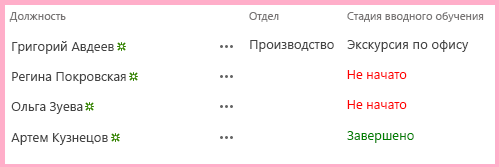

# <a name="add-custom-client-side-rendering-to-a-sharepoint-hosted-sharepoint-add-in"></a>Добавление собственной клиентской обработки в надстройку с размещением в SharePoint
 
Это восьмая часть серии статей, посвященной основам разработки надстроек SharePoint, размещаемых в SharePoint. Для начала вам следует ознакомиться со статьей [Надстройки SharePoint](sharepoint-add-ins.md) и предыдущими статьями этой серии, представленными в разделе [Знакомство с созданием надстроек SharePoint, размещаемых в SharePoint](get-started-creating-sharepoint-hosted-sharepoint-add-ins.md#Nextsteps). 

> [!NOTE]
> Если вы изучали предыдущие статьи этой серии о надстройках, размещаемых в SharePoint, то у вас уже есть решение для Visual Studio, которое можно использовать для работы с этой статьей. Кроме того, вы можете скачать репозиторий на веб-странице [SharePoint_SP-hosted_Add-Ins_Tutorials](https://github.com/OfficeDev/SharePoint_SP-hosted_Add-Ins_Tutorials) и открыть файл BeforeClientRenderedControl.sln.
 
Вы можете использовать небольшой фрагмент клиентского кода JavaScript для настройки отрисовки веб-частей, большинства типов полей (столбцов) и некоторых других элементов управления, назначив файл JavaScript в качестве свойства **JSLink** элемента управления, например **SPField.JSLink**. Кроме того, таким способом вы можете добавить логику проверки на стороне клиента. Работая с этой статьей, вы настроите отрисовку поля в списке надстройки SharePoint Employee Orientation (Обучение сотрудников) с помощью функции клиентской обработки.
 
> [!NOTE]
> - Если в браузере пользователя отключен JavaScript, то SharePoint будет использовать серверные функции отрисовки и проверки.
> - Свойство JSLink не поддерживается в списках Survey (Опрос) или Events (События). Календарь SharePoint представляет собой список Events (События).

## <a name="create-and-register-the-javascript"></a>Создание и регистрация файлов JavaScript

1. В **обозревателе решений** щелкните правой кнопкой мыши узел **Скрипты** и выберите **Добавить** > **Новый элемент** > **Интернет**. 

2. Выберите **файл JavaScript** и присвойте ему имя **OrientationStageRendering.js**. 

3. Созданная вами пользовательская отрисовка поля должна выполняться автоматически, поэтому используйте указанный ниже код, чтобы добавить анонимный метод в код JavaScript, который запускается автоматически при загрузке файла:

    ```
      (function () {

      })();
    ```

4. В тексте этого метода (между символами { и }) добавьте указанный ниже код, чтобы создать объекты JSON (Javascript Object Notation) для отрисовки контекста переопределения, шаблонов в контексте и шаблонов для полей.
    
    ```
      var customRenderingOverride = {};
    customRenderingOverride.Templates = {};
    customRenderingOverride.Templates.Fields = {

    }
    ```

5. В тексте объекта шаблона **Fields** (Поля) добавьте указанный ниже объект JSON.

    ```
      "OrientationStage": { "View": renderOrientationStage }
    ```

   - Имя свойства `OrientationStage` идентифицирует поле, для которого имеется пользовательская отрисовка. 
   - Значение свойства представляет собой еще один объект JSON. 
   - Свойство `View` идентифицирует контекст страницы, в котором применяется пользовательская отрисовка. В этом случае объект сообщает SharePoint, что для представлений списков необходимо использовать пользовательскую отрисовку. (Другие варианты предназначены для форм Edit [Редактирование], New [Создание] и Display [Отображение].) 
   - Значение свойства `renderOrientationStage` — это имя метода пользовательской отрисовки, который вы создадите на одном из последующих этапов.

6. Последнее, что должен сделать анонимный метод, сообщить диспетчеру шаблонов SharePoint о переопределении отрисовки. Добавьте указанную ниже строку в конец раздела body метода.
    
    ```
      SPClientTemplates.TemplateManager.RegisterTemplateOverrides(customRenderingOverride);
    ```

   Теперь метод должен выглядеть примерно так, как показано ниже.
    
    ```
      (function () {
        var customRenderingOverride = {};
        customRenderingOverride.Templates = {};
        customRenderingOverride.Templates.Fields = {
            "OrientationStage": { "View": renderOrientationStage }
        }

        SPClientTemplates.TemplateManager.RegisterTemplateOverrides(customRenderingOverride);
    })();
    ```

7. Добавьте указанный ниже метод в файл. Он задает красный цвет для значения столбца **Orientation Stage** (Этап обучения), когда это значение равно `Not Started`, и зеленый цвет, когда значение равно `Completed`. (Объект `ctx` представляет собой объект контекста клиента, объявленный встроенным скриптом SharePoint.)
    
    ```
      function renderOrientationStage(ctx) {
        var orientationStageValue = ctx.CurrentItem[ctx.CurrentFieldSchema.Name];
        if (orientationStageValue == "Not Started")  {
            return "<span style='color:red'>" + orientationStageValue + "</span>"
        }
        else if (orientationStageValue == "Completed") {
            return "<span style='color:green'>" + orientationStageValue + "</span>"
        }
        else {
            return orientationStageValue;
        }
    }
    ```

8. В **обозревателе решений** разверните узел **Столбцы сайта**, а затем — **OrientationStage** (Этап обучения). После этого откройте файл elements.xml. 

9. Чтобы сообщить SharePoint, что необходимо использовать ваш пользовательский код JavaScript, добавьте новый атрибут **JSLink** в элемент **Field** (Поле), а затем в качестве его значения укажите следующий URL-адрес: `~site/Scripts/OrientationStageRendering.js`.
    
   > [!NOTE]
   > Значение свойства **JSLink** всегда представляет собой файл, а не метод. Не существует способа сообщить SharePoint, какой метод необходимо запустить. Именно поэтому файл содержит метод, который запускается автоматически.

   Теперь тег start для элемента **Field** (Поле) будет выглядеть указанным ниже образом.
    
    ```
      <Field
           ID="{some_guid_here}"
           Name="OrientationStage"
           Title="OrientationStage"
           DisplayName="Orientation Stage"
           Description="The current orientation stage of the employee."
           Type="Choice"
           Required="TRUE"
           Group="Employee Orientation" 
           JSLink="~site/Scripts/OrientationStageRendering.js">
    <!-- child elements and end tag omitted -->
    ```

10. Откройте страницу Default.aspx и добавьте указанный ниже код в качестве последнего дочернего элемента для элемента **asp:Content**, у которого **ContentPlaceHolderID** имеет значение **PlaceHolderMain**. 
    
    ```XML
      <p><asp:HyperLink runat="server" NavigateUrl="JavaScript:window.location = _spPageContextInfo.webAbsoluteUrl + '/Lists/NewEmployeesInSeattle/AllItems.aspx';" 
        Text="List View Page for New Employees in Seattle" /></p>

    ```

## <a name="run-and-test-the-add-in"></a>Запуск и тестирование надстройки

1. Нажмите клавишу F5, чтобы развернуть и запустить надстройку. Visual Studio выполнит временную установку надстройки на тестовом сайте SharePoint и сразу же запустит ее. 
 
2. Настроенная вами клиентская обработка влияет на отрисовку поля только на странице представления списка, а не в веб-части представления списка, которую мы поместили на домашнюю страницу. Это связано с тем, что по умолчанию веб-часть использует обработку на сервере. Существуют способы изменить это, но они слишком сложны, чтобы использовать их в этом простом примере. Таким образом, чтобы посмотреть, как работает клиентская обработка, щелкните ссылку в нижней части страницы **List View Page for New Employees in Seattle** (Страница представления списка для новых сотрудников в Сиэтле).
 
3. Чтобы посмотреть, как работает настраиваемая отрисовка цвета, когда откроется страница представления списка, для некоторых элементов присвойте полю **Orientation Stage** (Этап вводного обучения) значение **Not Started** (Не начат), а для других значение **Completed** (Завершен).
    
   *Рис. 1. Список с настраиваемой клиентской обработкой*

   
  
4. Чтобы завершить сеанс отладки, закройте окно браузера или остановите отладку в Visual Studio. При каждом нажатии клавиши F5 Visual Studio будет отзывать предыдущую версию надстройки и устанавливать последнюю.
    
5. Вы будете работать с этой надстройкой и решением Visual Studio при изучении других статей, поэтому при перерывах в работе рекомендуется отзывать надстройку. В **обозревателе решений** щелкните проект правой кнопкой мыши и выберите пункт **Отозвать**.

## <a name="next-steps"></a>Дальнейшие действия
<a name="Nextsteps"> </a>

Работая со следующей статьей этой серии, вы [создадите настраиваемую кнопку ленты на хост-сайте надстройки SharePoint](create-a-custom-ribbon-button-in-the-host-web-of-a-sharepoint-add-in.md).
 
