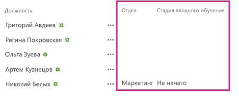

# <a name="add-custom-columns-to-a-sharepoint-hosted-sharepoint-add-in"></a><span data-ttu-id="0d588-103">Добавление настраиваемых столбцов в надстройку SharePoint, размещаемую в SharePoint</span><span class="sxs-lookup"><span data-stu-id="0d588-103">Add custom columns to a SharePoint-hosted SharePoint Add-in</span></span>

<span data-ttu-id="0d588-104">Это третья часть серии статей, посвященной основам разработки надстроек, размещаемых в SharePoint. Для начала вам следует ознакомиться со статьей [Надстройки SharePoint](sharepoint-add-ins.md) и предыдущими статьями этой серии.</span><span class="sxs-lookup"><span data-stu-id="0d588-104">This is the ninth in a series of articles about the basics of developing SharePoint-hosted SharePoint Add-ins. You should first be familiar with  [SharePoint Add-ins](sharepoint-add-ins.md) and the previous articles in this series:</span></span>

-  [<span data-ttu-id="0d588-105">Знакомство с созданием надстроек SharePoint с размещением в SharePoint</span><span class="sxs-lookup"><span data-stu-id="0d588-105">Get started creating SharePoint-hosted SharePoint Add-ins</span></span>](get-started-creating-sharepoint-hosted-sharepoint-add-ins.md)  
-  [<span data-ttu-id="0d588-106">Развертывание и установка надстроек SharePoint, размещаемых в SharePoint</span><span class="sxs-lookup"><span data-stu-id="0d588-106">Deploy and install a SharePoint-hosted SharePoint Add-in</span></span>](deploy-and-install-a-sharepoint-hosted-sharepoint-add-in.md)
    
> [!NOTE]
> <span data-ttu-id="0d588-107">Если вы изучали предыдущие статьи этой серии о надстройках, размещаемых в SharePoint, то у вас уже есть решение для Visual Studio, которое можно использовать для работы с этой статьей.</span><span class="sxs-lookup"><span data-stu-id="0d588-107">Note  If you have been working through this series about SharePoint-hosted add-ins, then you have a Visual Studio solution that you can use to continue with this topic. You can also download the repository at  SharePoint_SP-hosted_Add-Ins_Tutorials and open the BeforeClientRenderedControl.sln file.</span></span> <span data-ttu-id="0d588-108">Кроме того, вы можете скачать репозиторий на веб-странице [SharePoint_SP-hosted_Add-Ins_Tutorials](https://github.com/OfficeDev/SharePoint_SP-hosted_Add-Ins_Tutorials) и открыть файл BeforeColumns.sln.</span><span class="sxs-lookup"><span data-stu-id="0d588-108">You can also download the repository at [SharePoint_SP-hosted_Add-Ins_Tutorials](https://github.com/OfficeDev/SharePoint_SP-hosted_Add-Ins_Tutorials) and open the BeforeColumns.sln file.</span></span>

<span data-ttu-id="0d588-109">В этой статье мы вернемся к программированию и добавим несколько столбцов сайта в надстройку SharePoint Employee Orientation (Адаптация сотрудников).</span><span class="sxs-lookup"><span data-stu-id="0d588-109">In this article we get back to coding by adding some site columns to the Employee Orientation SharePoint Add-in.</span></span>
 
## <a name="create-custom-column-types"></a><span data-ttu-id="0d588-110">Создание настраиваемых типов столбцов</span><span class="sxs-lookup"><span data-stu-id="0d588-110">Create custom column types</span></span>

1. <span data-ttu-id="0d588-111">В **обозревателе решений** щелкните проект правой кнопкой мыши и выберите пункты **Добавить** > **Новая папка**.</span><span class="sxs-lookup"><span data-stu-id="0d588-111">In **Solution Explorer**, right-click the project and select **Add** > **New Folder**.</span></span> <span data-ttu-id="0d588-112">Присвойте папке имя **Site Columns** (Столбцы сайта).</span><span class="sxs-lookup"><span data-stu-id="0d588-112">Name the folder **Site Columns**.</span></span>    
 
2. <span data-ttu-id="0d588-113">Щелкните правой кнопкой мыши новую папку и выберите пункты **Добавить** > **Новый элемент**.</span><span class="sxs-lookup"><span data-stu-id="0d588-113">Right-click the new folder, and select **Add** > **New Item**.</span></span> <span data-ttu-id="0d588-114">В узле **Office/SharePoint** откроется диалоговое окно **Добавление нового элемента**.</span><span class="sxs-lookup"><span data-stu-id="0d588-114">Right-click the new folder and choose  AddNew Item. The  **Add New Item** dialog opens to the **Office/SharePoint** node.</span></span>
     
3. <span data-ttu-id="0d588-115">Выберите пункт **Site Column** (Столбец сайта), присвойте столбцу имя **Division** (Подразделение) и нажмите кнопку**Добавить**.</span><span class="sxs-lookup"><span data-stu-id="0d588-115">Choose  **Site Column**, give it the name Division, and choose  **Add**.</span></span>
    
4. <span data-ttu-id="0d588-116">В файле elements.xml нового столбца сайта измените элемент **Field** так, чтобы он содержал атрибуты и значения, указанные в примере ниже. ***Не** следует изменять идентификатор GUID* атрибута **ID** (т. е удалять значение, созданное Visual Studio), *поэтому будьте внимательны при копировании и вставке*.</span><span class="sxs-lookup"><span data-stu-id="0d588-116">In the elements.xml file for the new site column, edit the  **Field** element so that it has the attributes and values shown in the following example, except that *you should  **not** change the GUID*  for the **ID** attribute from the value that Visual Studio generated for it, *so be careful if you are using copy-and-paste*  .</span></span>
    
    ```
      <Field ID="{generated GUID}" 
           Name="Division" 
           Title="Division" 
           DisplayName="Division" 
           Description="The division of the company where the employee works." 
           Group="Employee Orientation" 
           Type="Text" 
           Required ="FALSE">
    </Field>
    ```
    
    <br/>

5. <span data-ttu-id="0d588-117">Добавьте другой **столбец сайта** с именем **OrientationStage** (Этап адаптации) в ту же папку.</span><span class="sxs-lookup"><span data-stu-id="0d588-117">Add another **Site Column** to the same folder named OrientationStage.</span></span>
    
6. <span data-ttu-id="0d588-118">В файле elements.xml нового столбца сайта измените элемент **Field** так, чтобы он содержал атрибуты и значения, указанные в примере ниже, однако не меняйте GUID атрибута **ID**. Оставьте для него значение, созданное Visual Studio.</span><span class="sxs-lookup"><span data-stu-id="0d588-118">In the elements.xml file for the new site column, edit the  **Field** element so that it has the attributes and values shown in the following example, except that you should not change the GUID for the **ID** attribute from the value that Visual Studio generated for it.</span></span>
    
    ```
      <Field ID="{generated GUID}" 
           Name="OrientationStage" 
           Title="OrientationStage"
           DisplayName="Orientation Stage" 
           Group="Employee Orientation" 
           Description="The current orientation stage of the employee." 
           Type="Choice"
           Required ="TRUE">
    </Field>
    ```
    
    <br/>

7. <span data-ttu-id="0d588-119">Так как это поле является полем выбора (Choice), необходимо указать возможные варианты и порядок их отображения в раскрывающемся списке перед пользователем, который должен сделать выбор.</span><span class="sxs-lookup"><span data-stu-id="0d588-119">Because this is a Choice field, you must specify the possible choices, the order in which they should appear in the drop-down list when a user is making a choice, and the default choice. Add the following child markup to the Field element.</span></span> <span data-ttu-id="0d588-120">Так как это поле обязательно для заполнения, необходимо указать значение по умолчанию.</span><span class="sxs-lookup"><span data-stu-id="0d588-120">Because it is a required field, you must specify a default value.</span></span> <span data-ttu-id="0d588-121">Добавьте приведенную ниже дочернюю разметку в элемент **Field**, а затем сохраните все файлы.</span><span class="sxs-lookup"><span data-stu-id="0d588-121">Add the following child markup to the **Field** element, and then save all the files.</span></span>
    
    ```
      <CHOICES>
          <CHOICE>Not Started</CHOICE>
          <CHOICE>Tour of building</CHOICE>
          <CHOICE>HR paperwork</CHOICE>
          <CHOICE>Corporate network access</CHOICE>
          <CHOICE>Completed</CHOICE>
    </CHOICES>
    <MAPPINGS>
          <MAPPING Value="1">Not Started</MAPPING>
          <MAPPING Value="2">Tour of building</MAPPING>
          <MAPPING Value="3">HR paperwork</MAPPING>
          <MAPPING Value="4">Corp network access</MAPPING>
          <MAPPING Value="5">Completed</MAPPING>
    </MAPPINGS>
    <Default>Not Started</Default>
    ```

    </br>
    
## <a name="run-the-add-in-and-test-the-columns"></a><span data-ttu-id="0d588-122">Запуск надстройки и тестирование столбцов</span><span class="sxs-lookup"><span data-stu-id="0d588-122">Run the add-in and test the columns</span></span>

1. <span data-ttu-id="0d588-p105">Нажмите клавишу F5, чтобы развернуть и запустить надстройку. Visual Studio выполнит временную установку надстройки на тестовом сайте SharePoint и сразу же запустит ее.</span><span class="sxs-lookup"><span data-stu-id="0d588-p105">Use the F5 key to deploy and run your add-in. Visual Studio makes a temporary installation of the add-in on your test SharePoint site and immediately runs the add-in.</span></span>  
 
2. <span data-ttu-id="0d588-125">Когда откроется страница надстройки по умолчанию, щелкните ссылку **New Employees in Seattle** (Новые сотрудники в Сиэтле), чтобы открыть экземпляр настраиваемого списка.</span><span class="sxs-lookup"><span data-stu-id="0d588-125">When the add-in's default page opens, choose the  **New Employees in Seattle** link to open the custom list instance.</span></span>
 
3. <span data-ttu-id="0d588-126">Откройте страницу **Параметры** списка и добавьте в него два столбца, выполнив указанные ниже действия.</span><span class="sxs-lookup"><span data-stu-id="0d588-126">Open the list's  **Settings** page and add the two columns to it with these steps.</span></span>
    
    1. <span data-ttu-id="0d588-127">Нажмите кнопку выноски **· · ·** сразу над списком и выберите пункт **Создать представление**.</span><span class="sxs-lookup"><span data-stu-id="0d588-127">Click the callout button,  **· · ·**, just above the list, and then choose  **Create View**.</span></span>
    2. <span data-ttu-id="0d588-128">Откроется страница **Тип представления** со структурой строки навигации **Параметры > Тип представления** рядом с верхней границей страницы.</span><span class="sxs-lookup"><span data-stu-id="0d588-128">The  **View Type** page opens, with the breadcrumb structure **Settings > View Type** near the top. Click the Settings breadcrumb.</span></span> <span data-ttu-id="0d588-129">Выберите **Параметры**.</span><span class="sxs-lookup"><span data-stu-id="0d588-129">Select the **Settings** breadcrumb.</span></span>
    
        <span data-ttu-id="0d588-130">*Рис. 1. Открытие страницы параметров списка*</span><span class="sxs-lookup"><span data-stu-id="0d588-130">*Steps to open the list settings page*</span></span>

        
 
    3. <span data-ttu-id="0d588-133">На странице **Параметры** щелкните ссылку **Добавить из существующих столбцов сайта** слева, примерно посередине страницы.</span><span class="sxs-lookup"><span data-stu-id="0d588-133">On the  **Settings** page, open the **Add from existing site columns** link on the left about halfway down the page.</span></span>
    
        <span data-ttu-id="0d588-134">*Рис. 2. Страница "Параметры списка"*</span><span class="sxs-lookup"><span data-stu-id="0d588-134">*Figure 2. List settings page*</span></span>

        

    4. <span data-ttu-id="0d588-136">На странице **Добавление столбцов из столбцов веб-сайта** в раскрывающемся списке **Выбрать столбцы сайта из** щелкните **Employee Orientation** (Адаптация сотрудников).</span><span class="sxs-lookup"><span data-stu-id="0d588-136">On the  **Add Columns from Site Columns** page, choose **Employee Orientation** on the **Select site columns from** drop down list.</span></span>
    
        <span data-ttu-id="0d588-137">*Рис. 3. Добавление столбцов из столбцов веб-сайта*</span><span class="sxs-lookup"><span data-stu-id="0d588-137">*Figure 3. Add Columns from Site Columns page*</span></span>

        

    5. <span data-ttu-id="0d588-139">Добавьте столбцы **Division** (Подразделение) и **OrientationStage** (Этап адаптации) в поле **Столбцы для добавления**.</span><span class="sxs-lookup"><span data-stu-id="0d588-139">Add the  **Division** and **OrientationStage** columns to the **Columns to add** box.</span></span>

    6. <span data-ttu-id="0d588-140">Нажмите кнопку **ОК**, чтобы вернуться на страницу **Параметры**, а затем щелкните **New Employees in Seattle** (Новые сотрудники в Сиэтле) в верхней части страницы.</span><span class="sxs-lookup"><span data-stu-id="0d588-140">Choose  **OK** to return to the **Settings** page, and then click the **New Employees in Seattle** breadcrumb near the top of the page.</span></span>
    
4. <span data-ttu-id="0d588-141">Новые столбцы теперь находятся в списке.</span><span class="sxs-lookup"><span data-stu-id="0d588-141">The new columns are now on the list.</span></span> <span data-ttu-id="0d588-142">Добавление нового элемента в список.</span><span class="sxs-lookup"><span data-stu-id="0d588-142">Add a new item to the project</span></span> <span data-ttu-id="0d588-143">В форме редактирования поле **Этап адаптации** будет иметь значение по умолчанию **Не начато**.</span><span class="sxs-lookup"><span data-stu-id="0d588-143">On the edit form, the **Orientation Stage** field will already have the default value **Not Started**.</span></span> <span data-ttu-id="0d588-144">(Существующие элементы в этом поле будут пустыми, так как они были созданы до того, как поле появилось в списке.)</span><span class="sxs-lookup"><span data-stu-id="0d588-144">(The existing items will be blank in this field because they were created before the field was on the list.)</span></span>
    
    <span data-ttu-id="0d588-145">*Рис. 4. Список с новыми столбцами*</span><span class="sxs-lookup"><span data-stu-id="0d588-145">*The list with new columns*</span></span>

    
 
5. <span data-ttu-id="0d588-147">Чтобы завершить сеанс отладки, закройте окно браузера или остановите отладку в Visual Studio.</span><span class="sxs-lookup"><span data-stu-id="0d588-147">To end the debugging session, close the browser window or stop debugging in Visual Studio. Each time that you press F5, Visual Studio will retract the previous version of the add-in and install the latest one.</span></span> <span data-ttu-id="0d588-148">При каждом нажатии клавиши F5 Visual Studio будет отзывать предыдущую версию надстройки и устанавливать последнюю.</span><span class="sxs-lookup"><span data-stu-id="0d588-148">To end the debugging session, close the browser window or stop debugging in Visual Studio. Each time that you press F5, Visual Studio will retract the previous version of the add-in and install the latest one.</span></span>
    
6. <span data-ttu-id="0d588-149">Вы будете работать с этой надстройкой и решением Visual Studio при изучении других статей, поэтому при перерывах в работе рекомендуется отзывать надстройку.</span><span class="sxs-lookup"><span data-stu-id="0d588-149">You will work with this add-in and Visual Studio solution in other articles, and it's a good practice to retract the add-in one last time when you are done working with it for a while. Right-click the project in  Solution Explorer and choose Retract.</span></span> <span data-ttu-id="0d588-150">В **обозревателе решений** щелкните проект правой кнопкой мыши и выберите пункт **Отозвать**.</span><span class="sxs-lookup"><span data-stu-id="0d588-150">Right-click the project in  **Solution Explorer** and choose **Retract**.</span></span>
    

## <a name="next-steps"></a><span data-ttu-id="0d588-151">Дальнейшие действия</span><span class="sxs-lookup"><span data-stu-id="0d588-151">Next steps</span></span>
<span data-ttu-id="0d588-152"><a name="Nextsteps"> </a></span><span class="sxs-lookup"><span data-stu-id="0d588-152"></span></span>

<span data-ttu-id="0d588-153">На самом деле пользователям будет не очень удобно вручную добавлять настраиваемые столбцы в список, поэтому в следующей статье ([Добавление настраиваемого типа контента в надстройку, размещаемую в SharePoint](add-a-custom-content-type-to-a-sharepoint-hosted-sharepoint-add-in.md)) этой серии описано, как создать настраиваемый тип контента, который включает в себя настраиваемые столбцы и автоматически сопоставляется с шаблоном списка New Employees (Новые сотрудники).</span><span class="sxs-lookup"><span data-stu-id="0d588-153">You don't really want your users to have to manually add the custom columns to the list, so in the next article in this series, you'll create a custom content type that includes the custom columns and is automatically associated with the New Employees list template:  [Add a custom content type to a SharePoint-hostedSharePoint Add-in](add-a-custom-content-type-to-a-sharepoint-hosted-sharepoint-add-in.md).</span></span> 
 

 

