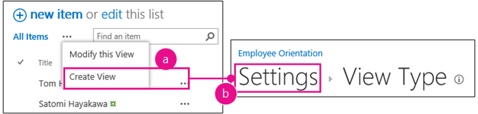
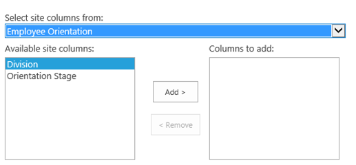

# <a name="add-custom-columns-to-a-sharepoint-hostedsharepoint-add-in"></a>Добавление настраиваемых столбцов в надстройку SharePoint, размещаемую в SharePoint
В этой статье рассказывается, как добавить настраиваемый столбец в надстройку SharePoint.
 

 **Примечание.** В настоящее время идет процесс замены названия "приложения для SharePoint" названием "надстройки SharePoint". Во время этого процесса в документации и пользовательском интерфейсе некоторых продуктов SharePoint и средств Visual Studio может по-прежнему использоваться термин "приложения для SharePoint". Дополнительные сведения см. в статье [Новое название приложений для Office и SharePoint](new-name-for-apps-for-sharepoint#bk_newname).
 

Это третья часть серии статей, посвященной основам разработки надстроек, размещаемых в SharePoint. Для начала вам следует ознакомиться со статьей [Надстройки SharePoint](sharepoint-add-ins) и предыдущими статьями из этой серии.
 

-  [Знакомство с созданием надстроек SharePoint с размещением в SharePoint](get-started-creating-sharepoint-hosted-sharepoint-add-ins)
    
 
-  [Развертывание и установка надстроек SharePoint, размещаемых в SharePoint](deploy-and-install-a-sharepoint-hosted-sharepoint-add-in)
    
 

 **Примечание.** Если вы изучали предыдущие статьи этой серии о надстройках, размещаемых в SharePoint, то у вас уже есть решение Visual Studio, которое можно использовать для работы с данной статьей. Кроме того, вы можете скачать репозиторий [SharePoint_SP-hosted_Add-Ins_Tutorials](https://github.com/OfficeDev/SharePoint_SP-hosted_Add-Ins_Tutorials) и открыть файл BeforeColumns.sln.
 

В этой статье мы вернемся к программированию и добавим несколько столбцов сайта в надстройку SharePoint Employee Orientation (Вводное обучение для сотрудников).
 

## <a name="create-custom-column-types"></a>Создание настраиваемых типов столбцов


 

 

1. В **обозревателе решений** щелкните проект правой кнопкой мыши и выберите пункты **Добавить** > **Новая папка**. Присвойте папке имя Site Columns (Столбцы сайта).
    
 
2. Щелкните новую папку правой кнопкой мыши и выберите пункты **Добавить** > **Новый элемент**. Откроется диалоговое окно **Добавление нового элемента** (узел **Office SharePoint**).
    
 
3. Выберите пункт **Site Column** (Столбец сайта), присвойте столбцу имя Division (Подразделение) и нажмите кнопку **Добавить**.
    
 
4. В файле elements.xml для нового столбца сайта измените элемент **Field** так, чтобы он содержал атрибуты и значения, указанные в следующем примере. ***Не** изменяйте GUID* атрибута **ID** (не удаляйте значение атрибута, созданное Visual Studio), *соответственно будьте осторожны при копировании и вставке*.
    
```
  <Field ID="{generated GUID}" 
       Name="Division" 
       Title="Division" 
       DisplayName="Division" 
       Description="The division of the company where the employee works." 
       Group="Employee Orientation" 
       Type="Text" 
       Required ="FALSE">
</Field>
```

5. Добавьте еще один **столбец сайта** c именем OrientationStage (Этап вводного обучения) в ту же папку.
    
 
6. В файле elements.xml нового столбца сайта измените элемент **Field** так, чтобы он содержал атрибуты и значения, указанные в примере ниже, однако не меняйте GUID атрибута **ID**. Оставьте для него значение, созданное Visual Studio.
    
```
  <Field ID="{generated GUID}" 
       Name="OrientationStage" 
       Title="OrientationStage"
       DisplayName="Orientation Stage" 
       Group="Employee Orientation" 
       Description="The current orientation stage of the employee." 
       Type="Choice"
       Required ="TRUE">
</Field>
```

7. Так как это поле является полем выбора, необходимо указать возможные варианты, порядок их отображения в раскрывающемся списке для пользователя, который должен сделать выбор. Так как это обязательное поле, необходимо указать значение, используемое по умолчанию. Добавьте указанную ниже дочернюю разметку в элемент **Field**.
    
```
  <CHOICES>
      <CHOICE>Not Started</CHOICE>
      <CHOICE>Tour of building</CHOICE>
      <CHOICE>HR paperwork</CHOICE>
      <CHOICE>Corporate network access</CHOICE>
      <CHOICE>Completed</CHOICE>
</CHOICES>
<MAPPINGS>
      <MAPPING Value="1">Not Started</MAPPING>
      <MAPPING Value="2">Tour of building</MAPPING>
      <MAPPING Value="3">HR paperwork</MAPPING>
      <MAPPING Value="4">Corp network access</MAPPING>
      <MAPPING Value="5">Completed</MAPPING>
</MAPPINGS>
<Default>Not Started</Default>
```

8. Сохраните все файлы.
    
 

## <a name="run-the-add-in-and-test-the-columns"></a>Запуск надстройки и тестирование столбцов


 

 

1. Нажмите клавишу F5, чтобы развернуть и запустить надстройку. Visual Studio выполнит временную установку надстройки на тестовом сайте SharePoint и сразу же запустит ее. 
    
 
2. Когда откроется страница надстройки, используемая по умолчанию, щелкните ссылку **Новые сотрудники в Москве**, чтобы открыть экземпляр настраиваемого списка.
    
 
3. Откройте страницу **Параметры** списка и добавьте в него два столбца, выполнив указанные ниже действия.
    
      1. Нажмите кнопку выноски **· · ·** сразу над списком, а затем щелкните **Создать представление**.
    
 
  2. Откроется страница **Тип представления** со структурой строки навигации **Параметры > Тип представления** рядом с верхней границей страницы. Щелкните **Параметры**.
    
    **Действия, которые необходимо выполнить, чтобы открыть страницу параметров списка**

 

  
 

    
    
 
  3. На странице **Параметры** щелкните ссылку **Добавить из существующих столбцов сайта** слева, примерно посередине страницы.
    
    **Страница "Параметры списка"**

 

  
 

    
    
 
  4. На странице **Добавление столбцов из столбцов веб-сайта** в раскрывающемся списке **Выбрать столбцы сайта из** щелкните **Employee Orientation** (Вводное обучение для сотрудника).
    
    **Добавление столбцов на странице столбцов сайта**

 

  
 

    
    
 
  5. В поле **Столбцы для добавления** добавьте столбцы **Division** (Подразделение) и **OrientationStage** (Этап вводного обучения).
    
 
  6. Нажмите кнопку **ОК**, чтобы вернуться на страницу **Параметры**, а затем щелкните **New Employees in Seattle** (Новые сотрудники в Сиэтле) в верхней части страницы.
    
 
4. Теперь новые столбцы включены в список. Добавьте новый элемент в список. На форме для редактирования поле **Orientation Stage** (Этап вводного обучения) уже будет содержать значение Not Started (Не начат), используемое по умолчанию. (Существующие элементы в этом поле будут пустыми, так как они были созданы до добавления поля в список.)
    
    **Список с новыми столбцами**

 

  
 

    
    
 
5. Чтобы завершить сеанс отладки, закройте окно браузера или остановите отладку в Visual Studio. При каждом нажатии клавиши F5 Visual Studio будет отзывать предыдущую версию надстройки и устанавливать ее последнюю версию.
    
 
6. Эти надстройка и решение Visual Studio будут рассматриваться и в других статьях, поэтому при перерывах в работе рекомендуется отзывать надстройку. В **обозревателе решений** щелкните проект правой кнопкой мыши и выберите пункт **Отозвать**.
    
 

## 
<a name="Nextsteps"> </a>

На самом деле пользователям будет не очень удобно вручную добавлять настраиваемые столбцы в список, поэтому в следующей статье ([Добавление настраиваемого типа контента в надстройку, размещаемую в SharePoint](add-a-custom-content-type-to-a-sharepoint-hostedsharepoint-add-in)) этой серии вы создадите настраиваемый тип контента, который включает в себя настраиваемые столбцы и автоматически сопоставляется с шаблоном списка New Employees (Новые сотрудники). 
 

 

