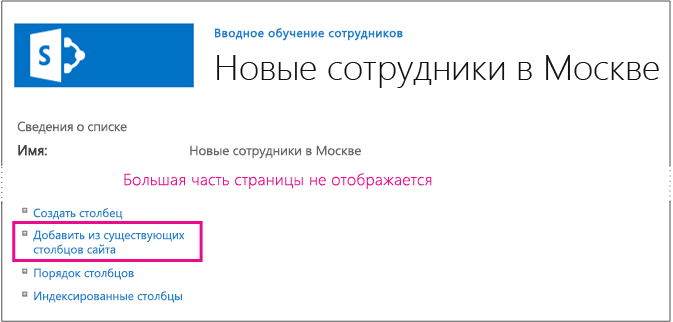

# <a name="add-custom-columns-to-a-sharepoint-hostedsharepoint-add-in"></a><span data-ttu-id="22a45-102">Добавление настраиваемых столбцов в надстройку с размещением в SharePoint</span><span class="sxs-lookup"><span data-stu-id="22a45-102">Add custom columns to a SharePoint-hostedSharePoint Add-in</span></span>
<span data-ttu-id="22a45-103">В этой статье рассказывается, как добавить настраиваемый столбец в надстройку SharePoint.</span><span class="sxs-lookup"><span data-stu-id="22a45-103">Learn how to include custom columns in an SharePoint Add-ins.</span></span>

<span data-ttu-id="22a45-104">Это третья часть серии статей, посвященной основам разработки надстроек, размещаемых в SharePoint. Для начала вам следует ознакомиться со статьей [Надстройки SharePoint](sharepoint-add-ins.md) и предыдущими статьями из этой серии.</span><span class="sxs-lookup"><span data-stu-id="22a45-104">This is the third in a series of articles about the basics of developing SharePoint-hosted SharePoint Add-ins. You should first be familiar with  [SharePoint Add-ins](sharepoint-add-ins.md) and the pervious articles in this series:</span></span>
 

-  [<span data-ttu-id="22a45-105">Знакомство с созданием надстроек SharePoint с размещением в SharePoint</span><span class="sxs-lookup"><span data-stu-id="22a45-105">Get started creating SharePoint-hosted SharePoint Add-ins</span></span>](get-started-creating-sharepoint-hosted-sharepoint-add-ins.md)
    
 
-  [<span data-ttu-id="22a45-106">Развертывание и установка надстроек SharePoint, размещаемых в SharePoint</span><span class="sxs-lookup"><span data-stu-id="22a45-106">Deploy and install a SharePoint-hosted SharePoint Add-in</span></span>](deploy-and-install-a-sharepoint-hosted-sharepoint-add-in.md)
    
 

> [!NOTE] 
> <span data-ttu-id="22a45-107">Если вы изучали предыдущие статьи этой серии о надстройках, размещаемых в SharePoint, то у вас уже есть решение для Visual Studio, которое можно использовать для работы с этой статьей.</span><span class="sxs-lookup"><span data-stu-id="22a45-107">If you have been working through this series about SharePoint-hosted add-ins, you have a Visual Studio solution that you can use to continue with this topic.</span></span> <span data-ttu-id="22a45-108">Кроме того, вы можете скачать репозиторий [SharePoint_SP-hosted_Add-Ins_Tutorials](https://github.com/OfficeDev/SharePoint_SP-hosted_Add-Ins_Tutorials) и открыть файл BeforeColumns.sln.</span><span class="sxs-lookup"><span data-stu-id="22a45-108">You can also download the repository at [SharePoint_SP-hosted_Add-Ins_Tutorials](https://github.com/OfficeDev/SharePoint_SP-hosted_Add-Ins_Tutorials) and open the BeforeColumns.sln file.</span></span>
 

<span data-ttu-id="22a45-109">В этой статье мы вернемся к программированию и добавим несколько столбцов сайта в надстройку SharePoint Employee Orientation (Вводное обучение для сотрудников).</span><span class="sxs-lookup"><span data-stu-id="22a45-109">In this article we get back to coding by adding some site columns to the Employee Orientation SharePoint Add-in.</span></span>
 

## <a name="create-custom-column-types"></a><span data-ttu-id="22a45-110">Создание настраиваемых типов столбцов</span><span class="sxs-lookup"><span data-stu-id="22a45-110">Create custom column types</span></span>


 

 

1. <span data-ttu-id="22a45-p102">В **обозревателе решений** щелкните проект правой кнопкой мыши и выберите пункты **Добавить** > **Новая папка**. Присвойте папке имя Site Columns (Столбцы сайта).</span><span class="sxs-lookup"><span data-stu-id="22a45-p102">In  **Solution Explorer**, right-click the project and choose  **Add** > **New Folder**. Name the folder Site Columns.</span></span>
    
 
2. <span data-ttu-id="22a45-p103">Щелкните новую папку правой кнопкой мыши и выберите пункты **Добавить** > **Новый элемент**. Откроется диалоговое окно **Добавление нового элемента** (узел **Office SharePoint**).</span><span class="sxs-lookup"><span data-stu-id="22a45-p103">Right-click the new folder and choose  **Add** > **New Item**. The  **Add New Item** dialog opens to the **Office/SharePoint** node.</span></span>
    
 
3. <span data-ttu-id="22a45-115">Выберите пункт **Site Column** (Столбец сайта), присвойте столбцу имя Division (Подразделение) и нажмите кнопку **Добавить**.</span><span class="sxs-lookup"><span data-stu-id="22a45-115">Choose  **Site Column**, give it the name Division, and choose  **Add**.</span></span>
    
 
4. <span data-ttu-id="22a45-116">В файле elements.xml для нового столбца сайта измените элемент **Field** так, чтобы он содержал атрибуты и значения, указанные в следующем примере. ***Не** изменяйте GUID* атрибута **ID** (не удаляйте значение атрибута, созданное Visual Studio), *соответственно будьте осторожны при копировании и вставке*.</span><span class="sxs-lookup"><span data-stu-id="22a45-116">In the elements.xml file for the new site column, edit the  **Field** element so that it has the attributes and values shown in the following example, except that *you should  **not** change the GUID*  for the **ID** attribute from the value that Visual Studio generated for it, *so be careful if you are using copy-and-paste*  .</span></span>
    
```
  <Field ID="{generated GUID}" 
       Name="Division" 
       Title="Division" 
       DisplayName="Division" 
       Description="The division of the company where the employee works." 
       Group="Employee Orientation" 
       Type="Text" 
       Required ="FALSE">
</Field>
```

5. <span data-ttu-id="22a45-117">Добавьте еще один **столбец сайта** c именем OrientationStage (Этап вводного обучения) в ту же папку.</span><span class="sxs-lookup"><span data-stu-id="22a45-117">Add another  **Site Column** to the same folder namedOrientationStage.</span></span>
    
 
6. <span data-ttu-id="22a45-118">В файле elements.xml нового столбца сайта измените элемент **Field** так, чтобы он содержал атрибуты и значения, указанные в примере ниже, однако не меняйте GUID атрибута **ID**. Оставьте для него значение, созданное Visual Studio.</span><span class="sxs-lookup"><span data-stu-id="22a45-118">In the elements.xml file for the new site column, edit the  **Field** element so that it has the attributes and values shown in the following example, except that you should not change the GUID for the **ID** attribute from the value that Visual Studio generated for it.</span></span>
    
```
  <Field ID="{generated GUID}" 
       Name="OrientationStage" 
       Title="OrientationStage"
       DisplayName="Orientation Stage" 
       Group="Employee Orientation" 
       Description="The current orientation stage of the employee." 
       Type="Choice"
       Required ="TRUE">
</Field>
```

7. <span data-ttu-id="22a45-p104">Так как это поле является полем выбора, необходимо указать возможные варианты, порядок их отображения в раскрывающемся списке для пользователя, который должен сделать выбор. Так как это обязательное поле, необходимо указать значение, используемое по умолчанию. Добавьте указанную ниже дочернюю разметку в элемент **Field**.</span><span class="sxs-lookup"><span data-stu-id="22a45-p104">Because this is a Choice field, you must specify the possible choices and the order in which they should appear in the drop-down list when a user is making a choice. And because it is a required field, you must specify a default value. Add the following child markup to the  **Field** element.</span></span>
    
```
  <CHOICES>
      <CHOICE>Not Started</CHOICE>
      <CHOICE>Tour of building</CHOICE>
      <CHOICE>HR paperwork</CHOICE>
      <CHOICE>Corporate network access</CHOICE>
      <CHOICE>Completed</CHOICE>
</CHOICES>
<MAPPINGS>
      <MAPPING Value="1">Not Started</MAPPING>
      <MAPPING Value="2">Tour of building</MAPPING>
      <MAPPING Value="3">HR paperwork</MAPPING>
      <MAPPING Value="4">Corp network access</MAPPING>
      <MAPPING Value="5">Completed</MAPPING>
</MAPPINGS>
<Default>Not Started</Default>
```

8. <span data-ttu-id="22a45-122">Сохраните все файлы.</span><span class="sxs-lookup"><span data-stu-id="22a45-122">Save all files.</span></span>
    
 

## <a name="run-the-add-in-and-test-the-columns"></a><span data-ttu-id="22a45-123">Запуск надстройки и тестирование столбцов</span><span class="sxs-lookup"><span data-stu-id="22a45-123">Run the add-in and test the columns</span></span>


 

 

1. <span data-ttu-id="22a45-p105">Нажмите клавишу F5, чтобы развернуть и запустить надстройку. Visual Studio выполнит временную установку надстройки на тестовом сайте SharePoint и сразу же запустит ее.</span><span class="sxs-lookup"><span data-stu-id="22a45-p105">Use the F5 key to deploy and run your add-in. Visual Studio makes a temporary installation of the add-in on your test SharePoint site and immediately runs the add-in.</span></span> 
    
 
2. <span data-ttu-id="22a45-126">Когда откроется страница надстройки, используемая по умолчанию, щелкните ссылку **Новые сотрудники в Москве**, чтобы открыть экземпляр настраиваемого списка.</span><span class="sxs-lookup"><span data-stu-id="22a45-126">When the add-in's default page opens, choose the  **New Employees in Seattle** link to open the custom list instance.</span></span>
    
 
3. <span data-ttu-id="22a45-127">Откройте страницу **Параметры** списка и добавьте в него два столбца, выполнив указанные ниже действия.</span><span class="sxs-lookup"><span data-stu-id="22a45-127">Open the list's  **Settings** page and add the two columns to it with these steps.</span></span>
    
      1. <span data-ttu-id="22a45-128">Нажмите кнопку выноски **· · ·** сразу над списком, а затем щелкните **Создать представление**.</span><span class="sxs-lookup"><span data-stu-id="22a45-128">Click the callout button,  **· · ·**, just above the list, and then choose  **Create View**.</span></span>
    
 
  2. <span data-ttu-id="22a45-p106">Откроется страница **Тип представления** со структурой строки навигации **Параметры > Тип представления** рядом с верхней границей страницы. Щелкните **Параметры**.</span><span class="sxs-lookup"><span data-stu-id="22a45-p106">The  **View Type** page opens, with the breadcrumb structure **Settings > View Type** near the top. Click the **Settings** breadcrumb.</span></span>
    
    <span data-ttu-id="22a45-131">**Действия, которые необходимо выполнить, чтобы открыть страницу параметров списка**</span><span class="sxs-lookup"><span data-stu-id="22a45-131">**Steps to open the list settings page**</span></span>

 

  
 

    
    
 
  3. <span data-ttu-id="22a45-134">На странице **Параметры** щелкните ссылку **Добавить из существующих столбцов сайта** слева, примерно посередине страницы.</span><span class="sxs-lookup"><span data-stu-id="22a45-134">On the  **Settings** page, open the **Add from existing site columns** link on the left about halfway down the page.</span></span>
    
    <span data-ttu-id="22a45-135">**Страница "Параметры списка"**</span><span class="sxs-lookup"><span data-stu-id="22a45-135">**List settings page**</span></span>

 

  
 

    
    
 
  4. <span data-ttu-id="22a45-137">На странице **Добавление столбцов из столбцов веб-сайта** в раскрывающемся списке **Выбрать столбцы сайта из** щелкните **Employee Orientation** (Вводное обучение для сотрудника).</span><span class="sxs-lookup"><span data-stu-id="22a45-137">On the  **Add Columns from Site Columns** page, choose **Employee Orientation** on the **Select site columns from** drop down list.</span></span>
    
    <span data-ttu-id="22a45-138">**Добавление столбцов на странице столбцов сайта**</span><span class="sxs-lookup"><span data-stu-id="22a45-138">**Add Columsn from Site Columns page**</span></span>

 

  
 

    
    
 
  5. <span data-ttu-id="22a45-140">В поле **Столбцы для добавления** добавьте столбцы **Division** (Подразделение) и **OrientationStage** (Этап вводного обучения).</span><span class="sxs-lookup"><span data-stu-id="22a45-140">Add the  **Division** and **OrientationStage** columns to the **Columns to add** box.</span></span>
    
 
  6. <span data-ttu-id="22a45-141">Нажмите кнопку **ОК**, чтобы вернуться на страницу **Параметры**, а затем щелкните **New Employees in Seattle** (Новые сотрудники в Сиэтле) в верхней части страницы.</span><span class="sxs-lookup"><span data-stu-id="22a45-141">Choose  **OK** to return to the **Settings** page, and then click the **New Employees in Seattle** breadcrumb near the top of the page.</span></span>
    
 
4. <span data-ttu-id="22a45-p108">Теперь новые столбцы включены в список. Добавьте новый элемент в список. На форме для редактирования поле **Orientation Stage** (Этап вводного обучения) уже будет содержать значение Not Started (Не начат), используемое по умолчанию. (Существующие элементы в этом поле будут пустыми, так как они были созданы до добавления поля в список.)</span><span class="sxs-lookup"><span data-stu-id="22a45-p108">The new columns are now on the list. Add a new item to the list. On the edit form, the  **Orientation Stage** field will already have the default valueNot Started. (The existing items will be blank in this field because they were created before the field was on the list.)</span></span>
    
    <span data-ttu-id="22a45-146">**Список с новыми столбцами**</span><span class="sxs-lookup"><span data-stu-id="22a45-146">**The list with new columns**</span></span>

 

  
 

    
    
 
5. <span data-ttu-id="22a45-p109">Чтобы завершить сеанс отладки, закройте окно браузера или остановите отладку в Visual Studio. При каждом нажатии клавиши F5 Visual Studio будет отзывать предыдущую версию надстройки и устанавливать ее последнюю версию.</span><span class="sxs-lookup"><span data-stu-id="22a45-p109">To end the debugging session, close the browser window or stop debugging in Visual Studio. Each time that you press F5, Visual Studio will retract the previous version of the add-in and install the latest one.</span></span>
    
 
6. <span data-ttu-id="22a45-p110">Эти надстройка и решение Visual Studio будут рассматриваться и в других статьях, поэтому при перерывах в работе рекомендуется отзывать надстройку. В **обозревателе решений** щелкните проект правой кнопкой мыши и выберите пункт **Отозвать**.</span><span class="sxs-lookup"><span data-stu-id="22a45-p110">You will work with this add-in and Visual Studio solution in other articles, and it's a good practice to retract the add-in one last time when you are done working with it for a while. Right-click the project in  **Solution Explorer** and choose **Retract**.</span></span>
    
 

## 
<span data-ttu-id="22a45-152"><a name="Nextsteps"> </a></span><span class="sxs-lookup"><span data-stu-id="22a45-152"></span></span>

<span data-ttu-id="22a45-153">На самом деле пользователям будет не очень удобно вручную добавлять настраиваемые столбцы в список, поэтому в следующей статье ([Добавление настраиваемого типа контента в надстройку, размещаемую в SharePoint](add-a-custom-content-type-to-a-sharepoint-hostedsharepoint-add-in.md)) этой серии вы создадите настраиваемый тип контента, который включает в себя настраиваемые столбцы и автоматически сопоставляется с шаблоном списка New Employees (Новые сотрудники).</span><span class="sxs-lookup"><span data-stu-id="22a45-153">You don't really want your users to have to manually add the custom columns to the list, so in the next article in this series, you'll create a custom content type that includes the custom columns and is automatically associated with the New Employees list template:  [Add a custom content type to a SharePoint-hostedSharePoint Add-in](add-a-custom-content-type-to-a-sharepoint-hostedsharepoint-add-in.md).</span></span> 
 

 

