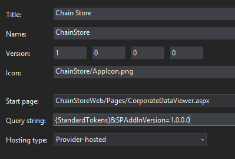

# <a name="add-first-run-logic-to-the-provider-hosted-add-in"></a>Добавление логики первого запуска в надстройку, размещенную у поставщика
Узнайте, как добавить код, выполняемый при первом запуске, в надстройку SharePoint, размещенную у поставщика.
 

 **Примечание.** В настоящее время идет процесс замены названия "приложения для SharePoint" названием "надстройки SharePoint". Во время этого процесса в документации и пользовательском интерфейсе некоторых продуктов SharePoint и средств Visual Studio может по-прежнему использоваться термин "приложения для SharePoint". Дополнительные сведения см. в статье [Новое название приложений для Office и SharePoint](new-name-for-apps-for-sharepoint#bk_newname).
 

Это восьмая часть серии статей, посвященной основам разработки надстроек, размещаемых у поставщика. Для начала вам следует ознакомиться со статьей [Надстройки SharePoint](sharepoint-add-ins) и предыдущими статьями из этой серии.
 

-  [Знакомство с созданием надстроек SharePoint с размещением у поставщика](get-started-creating-provider-hosted-sharepoint-add-ins)
    
 
-  [Настройка внешнего вида надстройки SharePoint, размещенной у поставщика](give-your-provider-hosted-add-in-the-sharepoint-look-and-feel)
    
 
-  [Добавление настраиваемой кнопки в надстройку, размещенную у поставщика](include-a-custom-button-in-the-provider-hosted-add-in)
    
 
-  [Краткий обзор объектной модели SharePoint](get-a-quick-overview-of-the-sharepoint-object-model)
    
 
-  [Добавление операций записи SharePoint в надстройку, размещенную у поставщика](add-sharepoint-write-operations-to-the-provider-hosted-add-in)
    
 
-  [Добавление веб-части надстройки в надстройку, размещенную у поставщика](include-an-add-in-part-in-the-provider-hosted-add-in)
    
 
-  [Обработка событий надстройки, размещенной у поставщика](handle-add-in-events-in-the-provider-hosted-add-in)
    
 

 **Примечание.** Если вы изучали предыдущие статьи этой серии о надстройках, размещенных в SharePoint, то у вас уже есть решение для Visual Studio, которое можно использовать для работы с данной статьей. Кроме того, вы можете скачать репозиторий [SharePoint_SP-hosted_Add-Ins_Tutorials](https://github.com/OfficeDev/SharePoint_Provider-hosted_Add-ins_Tutorials) и открыть файл BeforeFirstRunLogic.sln.
 

В этой статье рассматривается добавление на начальную страницу надстройки SharePoint "Сеть магазинов" такого кода, который проверяет, первый ли это запуск текущего экземпляра надстройки. Если это так, код развернет список **Местные сотрудники** и пользовательскую кнопку ленты.
 

## <a name="create-the-basic-class-for-deploying-sharepoint-components"></a>Создание базового класса для развертывания компонентов SharePoint


 

 

 **Примечание.** Параметры запускаемых проектов в Visual Studio обычно возвращаются к значениям по умолчанию каждый раз, когда вы заново открываете решение. Открывая пример решения, рассматриваемый в этой серии статей, всегда выполняйте следующие действия: щелкните правой кнопкой мыши узел решения в **обозревателе решений** и выберите пункт **Назначить запускаемые проекты**, а затем убедитесь, что для всех трех проектов в столбце **Действие** задано значение **Запуск**.
 


1. В проекте **ChainStoreWeb** в **обозревателе решений** щелкните правой кнопкой мыши папку **Утилиты** и выберите пункты **Добавить | Существующий элемент**.
    
 
2. В открывшемся окне **проводника** перейдите к папке решения (**ChainStoreWeb**) и откройте папку **Utilities**.
    
 
3. Выберите файл SharePointComponentDeployer.cs и нажмите кнопку **Добавить**.
    
 
4. Откройте файл SharePointComponentDeployer.cs. Он содержит статический класс и два статических метода, которые получают и задают версию надстройки в таблице **Клиенты** из корпоративной базы данных. Мы не будем рассматривать эти методы, так как эта серия статей не посвящена программированию на ASP.NET или SQL Server/Azure.
    
 
5. Добавьте указанные ниже операторы **using** в начале файла.
    
```
  using System.Web;
using System.Linq;
using System.Collections.Generic;
using Microsoft.SharePoint.Client;
```

6. В начале класса  `SharePointComponentDeployer` добавьте два указанных ниже статических поля. Инициализация обеих полей будет выполняться в методе **Page_Load** начальной страницы надстройки. Вы добавите этот код на одном из следующих этапов. В первом поле будет храниться объект **SharePointContext**, необходимый для выполнения операций CRUD в SharePoint. Во втором поле номер версии надстройки, установленной на хост-сайте. Изначально (когда обработчик установки регистрирует клиент) это значение будет отличаться от значения, используемого по умолчанию ( **0000.0000.0000.0000** ) и записанного в корпоративной таблице **Tenants** (Клиенты). Например, номер первой версии надстройки будет выглядеть следующим образом: **1.0.0.0**.
    
```C#
  internal static SharePointContext sPContext;
internal static Version localVersion;
```

7. Создайте приведенное ниже статическое свойство, в котором будет храниться версия надстройки, которая в текущий момент зарегистрирована в корпоративной таблице **Tenants** (Клиенты). Чтобы получать и задавать это значение, используются два метода, которые уже определены в файле.
    
```C#
  internal static Version RemoteTenantVersion
{
    get
    {
        return GetTenantVersion();
    }
    set
    {
        SetTenantVersion(value);
    }
}
```

8. Теперь создайте приведенное ниже свойство `IsDeployed`. Обратите внимание на указанные ниже особенности этого кода.
    
      - Метод **Page_Load** начальной страницы надстройки будет использовать значение этого свойства, чтобы определить, первый ли это запуск надстройки. Значение **false** указывает, что надстройку раньше не запускали, поэтому необходимо развернуть ее компоненты.
    
 
  - Проверка выполняется путем сравнения номера версии, зарегистрированного в таблице **Tenants** (Клиенты) с номером установленной версии. При первом запуске надстройки первое значение будет меньше. Код, который вы напишете на одном из следующих этапов, задает в таблице **Tenants** номер фактически установленной версии, поэтому при повторном запуске надстройки метод `IsDeployed` вернет значение **true**, что позволит предотвратить повторное выполнение кода, отвечающего за развертывание.
    
 

```C#
  public static bool IsDeployed
{
    get
    {
        if (RemoteTenantVersion < localVersion)
            return false; 
        else
            return true; 
    }
}
```

9. Добавьте указанный ниже метод в класс  `SharePointComponentDeployer`. Обратите внимание, что последнее, что делает метод, обновляет версию зарегистрированного клиента в базе данных предприятия ( **0000.0000.0000.0000** ), чтобы она соответствовала фактической версии надстройки на хост-сайте ( **1.0.0.0** ). Вы закончите этот метод на одном из следующих этапов.
    
```C#
  internal static void DeployChainStoreComponentsToHostWeb(HttpRequest request)
{
    // TODO4: Deployment code goes here.

    RemoteTenantVersion = localVersion;
}
```


 **Примечание.** Вас может удивить, что надстройка сравнивает номера версий, чтобы определить ответ на простой логический вопрос: запущена ли надстройка впервые? Ведь мы с таким же успехом могли бы добавить в таблицу **Tenants** простое строковое поле со значением "еще не запускалась" в обработчике установки, а затем изменить его на "уже запускалось" в коде, выполняемом при первом запуске, после развертывания компонентов SharePoint. Для надстройки "Сеть магазинов" простой проверки было бы достаточно. Однако в общем случае рекомендуется использовать номера версий. Это связано с тем, что в будущем надстройки, используемые в рабочей среде, скорее всего будут обновляться "на месте", то есть уже после их установки. В этом случае коду надстройки будет недостаточно двух вариантов: "еще не запускалась" и "уже запускалась". Предположим, что при обновлении надстройки с версии 1.0.0.0 до версии 2.0.0.0 вы хотите добавить новый список на хост-сайт. Вы могли бы сделать это в обработчике событий обновления или в коде, выполняемом при первом запуске после обновления. В любом случае коду, выполняемому при развертывании, потребуется развернуть новые компоненты. Кроме того, ему потребуется не развертывать компоненты, которые были развернуты в предыдущей версии надстройки. Номер версии 1.0.0.0 станет сигналом, указывающим, что компоненты версии 1.0.0.0 уже развернуты, но код, выполняемый при первом запуске после обновления, еще не выполнялся.
 


## <a name="add-the-basic-startup-logic"></a>Добавьте базовой логики запуска


 

 

1. Хост-сайт SharePoint должен сообщить удаленному веб-приложению номер версии установленной на нем надстройки. Для этого мы используем параметр запроса. Откройте файл AppManifest.xml в проекте **ChainStore**. В конструкторе вы увидите, что в качестве значения поля **Строка запроса** используется заполнитель **{StandardTokens}**. Добавьте строку &amp;SPAddInVersion=1.0.0.0 в конец файла. Конструктор манифеста должен выглядеть примерно так, как показано ниже. *Обратите внимание, что номер версии, который вы передаете в строке запроса, должен совпадать со значением в поле **Версия** в конструкторе.* (Если вы когда-либо будете обновлять надстройку, вам потребуется увеличить эти два значения и обеспечить их совпадение.)
    
  
 

 

 
2. Откройте файл CorporateDataViewer.aspx.cs и добавьте приведенный ниже код в метод **Page_Load** сразу же после строки, в которой выполняется инициализация объекта `spContext`. Обратите внимание на указанные ниже особенности этого кода.
    
      - Он начинается с задания двух статических полей в статическом классе  `SharePointComponentDeployer`. Он передает объект **SharePointContext**, так как код в  `SharePointComponentDeployer` будет вызываться в SharePoint, и использует параметр запроса, который вы добавили, чтобы задать свойство `localVersion`.
    
 
  - Он ничего не делает, если  `IsDeployed` имеет значение true, то есть если код, выполняемый при первом запуске, уже был запущен. В противном случае он вызывает метод развертывания и передает объект запроса ASP.NET.
    
 

```C#
  SharePointComponentDeployer.sPContext = spContext;
SharePointComponentDeployer.localVersion = new Version(Request.QueryString["SPAddInVersion"]);

if (!SharePointComponentDeployer.IsDeployed)
{
    SharePointComponentDeployer.DeployChainStoreComponentsToHostWeb(Request);
}
```


## <a name="programmatically-deploy-a-sharepoint-list"></a>Развертывание списка SharePoint программным способом


 

 

1. В файле SharePointComponentDeployer.cs замените строку `TODO4` на приведенный ниже код. Этот метод создается на следующем этапе.
    
```C#
  CreateLocalEmployeesList();
```

2. Добавьте приведенный ниже метод в класс `SharePointComponentDeployer`. Обратите внимание на указанные ниже особенности этого кода.
    
      - Он содержит два вызова метода **ExecuteQuery**. Первый необходим, чтобы определить, существует ли список. Второй выполняет действия по созданию списка.
    
 
  - Метод **ClientContext.LoadQuery** похож на метод **ClientContext.Load**, но вместо объекта, например списка, он передает клиенту перечислимые результаты запроса.
    
 

```C#
  private static void CreateLocalEmployeesList()
{
    using (var clientContext = sPContext.CreateUserClientContextForSPHost())
    {
        var query = from list in clientContext.Web.Lists
                    where list.Title == "Local Employees"
                    select list;
        IEnumerable<List> matchingLists = clientContext.LoadQuery(query);
        clientContext.ExecuteQuery();

        if (matchingLists.Count() == 0)
        {
           // TODO5: Create the list 

           // TODO6: Rename the Title field on the list 

           // TODO7: Add "Added to Corporate DB" field to the list 

           clientContext.ExecuteQuery();
        }
    }
}
```

3. Замените строку `TODO5` на приведенный ниже код. Обратите внимание на указанные ниже особенности этого кода.
    
      - Класс **ListCreationInformation** похож на класс **ListItemCreationInformation**, который уже встречался в одной из предыдущих статей этой серии. Это упрощенный класс, более подходящий для отправки данных из веб-приложения в SharePoint, чем полноценный класс **List**.
    
 
  - Существует много типов шаблонов списков, например тип Tasks для списка дел и тип Events для календаря. Список **Местные сотрудники** основан на самом простом типе Generic.
    
 
  - В свойстве **ListCreationInformation.Url** хранится URL-адрес списка *относительно* хост-сайта. Указывая адрес Lists/LocalEmployees, код задает полный URL-адрес списка: https://*{Домен_SharePoint}*/hongkong/_layouts/15/start.aspx#/Lists/Local%20Employees.
    
 

```C#
  ListCreationInformation listInfo = new ListCreationInformation();
listInfo.Title = "Local Employees";
listInfo.TemplateType = (int)ListTemplateType.GenericList;
listInfo.Url = "Lists/Local Employees";
List localEmployeesList = clientContext.Web.Lists.Add(listInfo);
```

4. Замените  `TODO6` указанным ниже кодом, который изменяет общедоступное имя поля (столбца) Title (Название) на Name (Имя). Это то, что вы делали на странице **List Settings** (Параметры списка), когда создавали список вручную.
    
```C#
  Field field = localEmployeesList.Fields.GetByInternalNameOrTitle("Title");
field.Title = "Name";
field.Update();
```

5. Кроме того, вы вручную создали поле с именем **Добавлен в корпоративную базу данных**. Чтобы сделать это программным способом, добавьте приведенный ниже код вместо строки `TODO7`. Обратите внимание на указанные ниже особенности этого кода.
    
      - Ключевые свойства этого поля задаются с помощью большого двоичного объекта XML. Это связано с архитектурой SharePoint: веб-сайты, списки, поля, типы содержимого и большая часть других типов компонентов SharePoint определяются в виде XML. В данном случае мы указываем для поля отображаемое имя, тип данных и имя, используемое по умолчанию.
    
 
  - Второй параметр указывает, должно ли поле отображаться в представлении списка, используемом по умолчанию. Мы присвоим ему значение **true**. 
    
 
  - Третий параметр можно использовать для определения типов контента, к которым следует добавлять это поле. Если передать значение **DefaultValue**, поле будет добавляться в заданный по умолчанию тип контента для списка.
    
 

```C#
  localEmployeesList.Fields.AddFieldAsXml("<Field DisplayName='Added to Corporate DB'"
                                         +"Type='Boolean'>"
                                         + "<Default>FALSE</Default></Field>",
                                         true,
                                         AddFieldOptions.DefaultValue);
```

6. Вспомним, что по умолчанию для поля **Добавлен в корпоративную базу данных** задано значение **Нет**, то есть false, но после добавления сотрудника в базу данных предприятия настраиваемая кнопка ленты в надстройке присваивает полю значение **Да**. Эта система работает безупречно, только если у пользователей нет возможности менять значение поля вручную. Чтобы у пользователей гарантированно не было такой возможности, сделайте поле невидимым в формах создания и редактирования элементов в списке **Местные сотрудники**. Для этого мы добавим два дополнительных атрибута в первый параметр, как показано ниже.
    
```C#
  localEmployeesList.Fields.AddFieldAsXml("<Field DisplayName='Added to Corporate DB'" 
                                         + " Type='Boolean'"  
                                         + " ShowInEditForm='FALSE' "
                                         + " ShowInNewForm='FALSE'>"
                                         + "<Default>FALSE</Default></Field>",
                                         true,
                                         AddFieldOptions.DefaultValue);
```


    The entire  `CreateLocalEmployeesList` should now look like the following.
    


```C#
  private static void CreateLocalEmployeesList()
{
    using (var clientContext = sPContext.CreateUserClientContextForSPHost())
    {
        var query = from list in clientContext.Web.Lists
                    where list.Title == "Local Employees"
                    select list;
        IEnumerable<List> matchingLists = clientContext.LoadQuery(query);
        clientContext.ExecuteQuery();

        if (matchingLists.Count() == 0)
        {
            ListCreationInformation listInfo = new ListCreationInformation();
            listInfo.Title = "Local Employees";
            listInfo.TemplateType = (int)ListTemplateType.GenericList;
            listInfo.Url = "LocalEmployees";
            List localEmployeesList = clientContext.Web.Lists.Add(listInfo);

            Field field = localEmployeesList.Fields.GetByInternalNameOrTitle("Title");
            field.Title = "Name";
            field.Update();

            localEmployeesList.Fields.AddFieldAsXml("<Field DisplayName='Added to Corporate DB'" 
                                                    + " Type='Boolean'"  
                                                   + " ShowInEditForm='FALSE' "
                                                   + " ShowInNewForm='FALSE'>"
                                                   + "<Default>FALSE</Default></Field>",
                                                    true,
                                                    AddFieldOptions.DefaultValue);
            clientContext.ExecuteQuery();
        }
    }
}
```


## <a name="temporarily-remove-the-custom-button-from-the-project"></a>Временное удаление настраиваемой кнопки из проекта

По техническим причинам, которые мы рассмотрим в следующей статье, созданную нами настраиваемую кнопку не удастся установить без изменений, если необходимо разместить ее на ленте списка, который развернут программным способом. Мы временно удалим ее из проекта, чтобы можно было протестировать код, выполняемый при первом запуске. Мы вернем ее в следующей статье.
 

 
В **обозревателе решений** в проекте **ChainStore** щелкните правой кнопкой мыши узел **AddEmployeeToCorpDB** и выберите пункт **Исключить из проекта**.
 

 

## <a name="request-permission-to-manage-lists-on-the-host-web"></a>Запрос разрешения на управление списками на хост-сайте

Так как теперь надстройка добавляет список на хост-сайт, а не только элементы в существующий список, нам необходимо расширить разрешения для надстройки с "Запись" до "Управление". Выполните указанные ниже действия.
 

 

1. В **обозревателе решений** откройте файл AppManifest.xml проекта **ChainStore**.
    
 
2. Откройте вкладку **Разрешения**. Для поля **Область** оставьте значение "Интернет", а в поле **Разрешение** выберите в раскрывающемся списке пункт **Управление**.
    
 
3. Сохраните файл.
    
 

## <a name="run-the-add-in-and-test-the-first-run-logic"></a>Запуск надстройки и тестирование кода для первого запуска


 

 

1. Откройте страницу **Содержимое сайта** для веб-сайта магазина в Гонконге *и удалите список **Местные сотрудники**.* 
    
 
2. Нажмите клавишу F5, чтобы развернуть и запустить вашу надстройку. Visual Studio размещает удаленное веб-приложение в IIS Express, а базу данных SQL в SQL Express. Кроме того, он создает временную установку надстройки на вашем тестовом сайте SharePoint и сразу же запускает ее. Прежде чем откроется начальная страница надстройки, вам будет предложено предоставить необходимые для надстройки разрешения.
    
 
3. Когда откроется начальная страница надстройки, нажмите кнопку **Вернуться на сайт** на размещенном в верхней части элементе управления хрома.
    
 
4. Перейдите на страницу **Содержимое сайта**. Список **Местные сотрудники** отображается, потому что его добавил код, выполняемый при первом запуске.
    
     **Примечание.** Если список не отображается или имеются другие признаки того, что код для первого запуска не выполняется, это может быть вызвано тем, что таблица **Tenants** (Клиенты) не очищается при нажатии клавиши F5. Как правило, это связано с тем, что проект **ChainCorporateDB** больше не задан в качестве запускаемого проекта в Visual Studio. В начале этой статьи есть примечание о том, как это исправить. Кроме того, убедитесь, что база данных настроена на повторное создание, как описано в разделе [Настройка Visual Studio на повторное создание корпоративной базы данных в каждом сеансе отладки](give-your-provider-hosted-add-in-the-sharepoint-look-and-feel#Rebuild).
5. Откройте список и добавьте в него элемент. Обратите внимание, что на новой форме элемента больше нет поля **Добавлен в корпоративную базу данных**, поэтому его значение невозможно задать вручную. Это справедливо и для формы редактирования элемента.
    
  
 

 

 
6. Вернитесь на начальную страницу надстройки с помощью кнопки "Назад" в браузере.
    
 
7. Нажмите значок шестеренки в элементе управления хрома сверху, а затем выберите пункт **Параметры учетной записи**.
    
 
8. На странице **Учетные записи** нажмите кнопку **Показать версию надстройки**. Появится номер версии **1.0.0.0**, так как код, выполняемый при первом запуске, изменил ее.
    
  
 

 

 
9. Чтобы завершить сеанс отладки, закройте окно браузера или остановите отладку в Visual Studio. При каждом нажатии клавиши F5 Visual Studio будет отзывать предыдущую версию надстройки и устанавливать ее последнюю версию.
    
 
10. Эти надстройка и решение Visual Studio будут рассматриваться и в других статьях, поэтому при перерывах в работе рекомендуется отзывать надстройку. В **обозревателе решений** щелкните проект правой кнопкой мыши и выберите пункт **Отозвать**.
    
 

## 
<a name="Nextsteps"> </a>

 В следующей статье вы узнаете, как вернуть в надстройку настраиваемую кнопку для ленты **Local Employee** (Местный сотрудник), когда развертывание списка выполняется программным путем: [Программное развертывание настраиваемой кнопки в надстройке, размещаемой у поставщика](programmatically-deploy-a-custom-button-in-the-provider-hosted-add-in)
 

 

