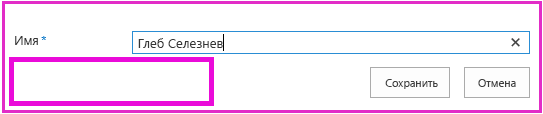

# <a name="add-first-run-logic-to-the-provider-hosted-add-in"></a><span data-ttu-id="61483-103">Добавление логики первого запуска в надстройку с размещением у поставщика</span><span class="sxs-lookup"><span data-stu-id="61483-103">Add first-run logic to the provider-hosted add-in</span></span>

<span data-ttu-id="61483-104">Это восьмая часть серии статей, посвященной основам разработки надстроек SharePoint, размещаемых у поставщика. Для начала вам следует ознакомиться со статьей [Надстройки SharePoint](sharepoint-add-ins.md) и предыдущими статьями этой серии, представленными в разделе [Знакомство с созданием надстроек SharePoint, размещаемых у поставщика](get-started-creating-provider-hosted-sharepoint-add-ins.md#SP15createprovider_nextsteps).</span><span class="sxs-lookup"><span data-stu-id="61483-104">This is the eighth in a series of articles about the basics of developing provider-hosted SharePoint Add-ins. You should first be familiar with [SharePoint Add-ins](sharepoint-add-ins.md) and the previous articles in this series:</span></span> 

> [!NOTE]
> <span data-ttu-id="61483-105">Если вы изучали предыдущие статьи этой серии о размещаемых у поставщика надстройках, то у вас уже есть решение Visual Studio, которое можно использовать для работы с данной статьей.</span><span class="sxs-lookup"><span data-stu-id="61483-105">If you have been working through this series about provider-hosted add-ins, you have a Visual Studio solution that you can use to continue with this topic.</span></span> <span data-ttu-id="61483-106">Кроме того, вы можете скачать репозиторий [SharePoint_Provider-hosted_Add-Ins_Tutorials](https://github.com/OfficeDev/SharePoint_Provider-hosted_Add-ins_Tutorials) и открыть файл BeforeFirstRunLogic.sln.</span><span class="sxs-lookup"><span data-stu-id="61483-106">You can also download the repository at [SharePoint_Provider-hosted_Add-Ins_Tutorials](https://github.com/OfficeDev/SharePoint_Provider-hosted_Add-ins_Tutorials) and open the BeforeFirstRunLogic.sln file.</span></span>

<span data-ttu-id="61483-107">В этой статье рассматривается добавление на начальную страницу надстройки SharePoint "Chain Store" такого кода, который проверяет, первый ли это запуск текущего экземпляра надстройки.</span><span class="sxs-lookup"><span data-stu-id="61483-107">In this article, you add code to the start page of the Chain Store SharePoint Add-in that checks to see if the current instance of the add-in is being run for the first time.</span></span> <span data-ttu-id="61483-108">Если это так, код развернет список **Local Employees** (Местные сотрудники) и специальную кнопку на ленте.</span><span class="sxs-lookup"><span data-stu-id="61483-108">If it is the first time, your code deploys the **Local Employees** list and the custom ribbon button.</span></span>

## <a name="create-the-basic-class-for-deploying-sharepoint-components"></a><span data-ttu-id="61483-109">Создание базового класса для развертывания компонентов SharePoint</span><span class="sxs-lookup"><span data-stu-id="61483-109">Create the basic class for deploying SharePoint components</span></span>

> [!NOTE]
> <span data-ttu-id="61483-110">Когда решение открывается повторно, для параметров раздела "Запускаемые проекты" в Visual Studio обычно возвращаются значения по умолчанию.</span><span class="sxs-lookup"><span data-stu-id="61483-110">The settings for Startup Projects in Visual Studio tend to revert to defaults whenever the solution is reopened.</span></span> <span data-ttu-id="61483-111">После повторного открытия примера решения, который рассматривается в этой серии статей, всегда выполняйте указанные ниже действия.</span><span class="sxs-lookup"><span data-stu-id="61483-111">Always take these steps immediately after reopening the sample solution in this series of articles:</span></span> 
> 1. <span data-ttu-id="61483-112">В верхней части **обозревателя решений** щелкните узел решения правой кнопкой мыши и выберите пункт **Назначить запускаемые проекты**.</span><span class="sxs-lookup"><span data-stu-id="61483-112">Right-click the solution node at the top of **Solution Explorer**, and then select **Set startup projects**.</span></span>  
> 2. <span data-ttu-id="61483-113">Убедитесь, что в столбце **Действие** для всех трех проектов задано значение **Запуск**.</span><span class="sxs-lookup"><span data-stu-id="61483-113">Ensure that all three projects are set to **Start** in the **Action** column.</span></span>

1. <span data-ttu-id="61483-114">В проекте **ChainStoreWeb** в **обозревателе решений** щелкните правой кнопкой мыши папку **Utilities** и выберите **Добавить** > **Существующий элемент**.</span><span class="sxs-lookup"><span data-stu-id="61483-114">In the **ChainStoreWeb** project in **Solution Explorer**, right-click the **Utilities** folder, and then select **Add** > **Existing Item**.</span></span>
    
2. <span data-ttu-id="61483-115">В открывшемся окне **проводника** выберите папку решения (**ChainStoreWeb**) и откройте папку **Utilities**.</span><span class="sxs-lookup"><span data-stu-id="61483-115">In **File Explorer**, go to the solution folder, the **ChainStoreWeb** folder, and then open the **Utilities** folder.</span></span>

3. <span data-ttu-id="61483-116">Выберите файл SharePointComponentDeployer.cs и нажмите кнопку **Добавить**.</span><span class="sxs-lookup"><span data-stu-id="61483-116">Select SharePointComponentDeployer.cs, and then select **Add**.</span></span>

4. <span data-ttu-id="61483-p104">Откройте файл SharePointComponentDeployer.cs. В нем есть статический класс и два статических метода, которые получают и задают версию надстройки в таблице **Tenants** (Клиенты) корпоративной базы данных. Мы не будем рассматривать эти методы, так как эта серия статей не предназначена для обучения программированию для ASP.NET или SQL Server/Azure.</span><span class="sxs-lookup"><span data-stu-id="61483-p104">Open the file SharePointComponentDeployer.cs. It has a static class and two static methods that get and set the add-in's version in the **Tenants** table of the corporate database. We won't discuss these methods because this series of articles is not intended to teach ASP.NET or SQL Server/Azure programming.</span></span>

5. <span data-ttu-id="61483-120">Добавьте указанные ниже операторы **using** в начало файла.</span><span class="sxs-lookup"><span data-stu-id="61483-120">Add the following **using** statements to the top of the file.</span></span>
    
    ```C#
      using System.Web;
      using System.Linq;
      using System.Collections.Generic;
      using Microsoft.SharePoint.Client;
    ```

6. <span data-ttu-id="61483-121">В начале определения класса `SharePointComponentDeployer` добавьте два указанных ниже статических поля.</span><span class="sxs-lookup"><span data-stu-id="61483-121">At the top of the `SharePointComponentDeployer` class, add the following two static fields.</span></span> <span data-ttu-id="61483-122">Оба поля инициализируются в методе **Page_Load** начальной страницы надстройки (вы добавите этот код на одном из последующих этапов).</span><span class="sxs-lookup"><span data-stu-id="61483-122">Both of these are initialized in the **Page_Load** method of the add-in's start page (you add that code in a later step).</span></span> 

    ```C#
      internal static SharePointContext sPContext;
      internal static Version localVersion;
    ```

   <span data-ttu-id="61483-123">Обратите внимание на указанные ниже особенности этого кода.</span><span class="sxs-lookup"><span data-stu-id="61483-123">Note the following about this code:</span></span>
   
   - <span data-ttu-id="61483-124">В первом поле будет храниться объект `SharePointContext`, который необходим для выполнения операций CRUD в SharePoint.</span><span class="sxs-lookup"><span data-stu-id="61483-124">The first field holds the `SharePointContext` object that is needed to make CRUD operations on SharePoint.</span></span> 
   
   - <span data-ttu-id="61483-125">Во втором поле будет храниться номер версии надстройки, установленной на хост-сайте.</span><span class="sxs-lookup"><span data-stu-id="61483-125">The second field holds the version number of the add-in that is installed on the host web.</span></span> <span data-ttu-id="61483-126">Это значение изначально отличается от значения, используемого по умолчанию (**0000.0000.0000.0000**) и записанного в корпоративной таблице **Клиенты** при регистрации клиента обработчиком установки.</span><span class="sxs-lookup"><span data-stu-id="61483-126">This value is initially different from the default value (**0000.0000.0000.0000**) that is recorded in the corporate **Tenants** table when the installation handler registers the tenant.</span></span> <span data-ttu-id="61483-127">Например, номером первой версии надстройки будет **1.0.0.0**.</span><span class="sxs-lookup"><span data-stu-id="61483-127">For example, the first version of the add-in will be **1.0.0.0**.</span></span>

7. <span data-ttu-id="61483-p107">Создайте указанное ниже статическое свойство, в котором будет храниться номер версии надстройки, которая в текущий момент зарегистрирована в корпоративной таблице **Tenants** (Клиенты). Для получения и задания этого значения оно использует два метода, которые уже имелись в файле.</span><span class="sxs-lookup"><span data-stu-id="61483-p107">Create the following static property to hold the version of the add-in that is currently recorded in the corporate **Tenants** table. It uses the two methods that were already in the file to get and set this value.</span></span>
    
    ```C#
      internal static Version RemoteTenantVersion
    {
        get
        {
            return GetTenantVersion();
        }
        set
        {
            SetTenantVersion(value);
        }
    }
    ```

8. <span data-ttu-id="61483-130">Теперь создайте свойство `IsDeployed`.</span><span class="sxs-lookup"><span data-stu-id="61483-130">Now create the following `IsDeployed` property.</span></span> 

    ```C#
      public static bool IsDeployed
    {
        get
        {
            if (RemoteTenantVersion < localVersion)
                return false; 
            else
                return true; 
        }
    }
    ```

   <span data-ttu-id="61483-131">Обратите внимание на указанные ниже особенности этого кода.</span><span class="sxs-lookup"><span data-stu-id="61483-131">Note the following about this code:</span></span>

   - <span data-ttu-id="61483-132">Метод **Page_Load** начальной страницы надстройки использует значение этого свойства, чтобы определить, в первый ли раз запущена надстройка.</span><span class="sxs-lookup"><span data-stu-id="61483-132">The **Page_Load** method of the add-in's start page uses the value of this property to determine whether the add-in is running for the first time.</span></span> <span data-ttu-id="61483-133">Значение **false** указывает на то, что надстройку раньше не запускали на текущем хост-сайте, поэтому необходимо развернуть ее компоненты.</span><span class="sxs-lookup"><span data-stu-id="61483-133">A **false** value signals that the add-in has not run before on the current host web, so its components need to be deployed.</span></span>

   - <span data-ttu-id="61483-134">Проверка выполняется путем сравнения номера версии, зарегистрированного в таблице **Клиенты**, с номером установленной версии.</span><span class="sxs-lookup"><span data-stu-id="61483-134">The criterion is whether the version number registered in the **Tenants** table is lower than the version actually installed.</span></span> <span data-ttu-id="61483-135">При первом запуске надстройки первое значение будет меньше.</span><span class="sxs-lookup"><span data-stu-id="61483-135">The first time the add-in runs, it is lower.</span></span> <span data-ttu-id="61483-136">Код, который вы напишете на одном из последующих этапов, задает в таблице **Клиенты** номер фактически установленной версии, поэтому при повторном запуске надстройки `IsDeployed` вернет значение **true**, а логика развертывания не будет выполняться повторно.</span><span class="sxs-lookup"><span data-stu-id="61483-136">Code that you write in a later step sets the version in the **Tenants** table to the same version as is actually installed, so when the add-in runs again, `IsDeployed` returns **true** and the deployment logic does not execute again.</span></span>
 
9. <span data-ttu-id="61483-137">Добавьте приведенный ниже метод в класс `SharePointComponentDeployer`.</span><span class="sxs-lookup"><span data-stu-id="61483-137">Add the following method to the `SharePointComponentDeployer` class.</span></span> <span data-ttu-id="61483-138">Обратите внимание на то, что в последнюю очередь метод обновляет зарегистрированную версию клиента в корпоративной базе данных (**0000.0000.0000.0000**), чтобы она соответствовала фактической версии надстройки на хост-сайте (**1.0.0.0**).</span><span class="sxs-lookup"><span data-stu-id="61483-138">Note that the last thing the method does is update the registered tenant version in the corporate database (**0000.0000.0000.0000**) to match the actual version of the add-in on the host web (**1.0.0.0**).</span></span> <span data-ttu-id="61483-139">Вы допишете код этого метода на одном из последующих этапов.</span><span class="sxs-lookup"><span data-stu-id="61483-139">You will complete this method in a later step.</span></span>
    
    ```C#
      internal static void DeployChainStoreComponentsToHostWeb(HttpRequest request)
    {
        // TODO4: Deployment code goes here.

        RemoteTenantVersion = localVersion;
    }
    ```

> [!NOTE]
> <span data-ttu-id="61483-140">Вас может удивить, что для определения ответа на вопрос о первом запуске надстройки, на который можно было бы ответить просто "да" или "нет", надстройка сравнивает номера версий.</span><span class="sxs-lookup"><span data-stu-id="61483-140">You may wonder now why the add-in uses version numbers and a "less than" test to determine the answer to a simple yes/no question: "Is the add-in running for the first time?"</span></span> <span data-ttu-id="61483-141">Можно было бы добавить в таблицу **Клиенты** простое строковое поле, для которого задано значение *Еще не запускалась* в обработчике установки, а затем заменить это значение на *Уже запускалась* с помощью логики первого запуска после развертывания компонентов SharePoint.</span><span class="sxs-lookup"><span data-stu-id="61483-141">We could just as well have a simple string field in the **Tenants** table that is set to *not-yet-run* in the installation handler, and then changed to *already-run-once* by the first-run logic after the SharePoint components are deployed.</span></span> 

> <span data-ttu-id="61483-142">Для надстройки Chain Store было бы достаточно такой простой проверки.</span><span class="sxs-lookup"><span data-stu-id="61483-142">For the Chain Store add-in, a simple test would work.</span></span> <span data-ttu-id="61483-143">Но обычно рекомендуется обрабатывать номера версий, так как в будущем надстройка, используемая в рабочей среде, скорее всего, будет обновляться "на месте", то есть уже после установки.</span><span class="sxs-lookup"><span data-stu-id="61483-143">However, it is generally a good practice to use version numbers because a production add-in is likely to be updated-in-place in the future; that is, updated after it is already installed.</span></span> <span data-ttu-id="61483-144">В таком случае для логики надстройки будет недостаточно вариантов *Еще не запускалась* и *Уже запускалась*.</span><span class="sxs-lookup"><span data-stu-id="61483-144">When that time comes, your add-in logic needs to be sensitive to more than the two possibilities *not-yet-run* and *already-run-once*.</span></span> 

> <span data-ttu-id="61483-145">Предположим, что вы хотите добавить дополнительный список на хост-сайт при обновлении надстройки версии 1.0.0.0 до 2.0.0.0.</span><span class="sxs-lookup"><span data-stu-id="61483-145">Suppose, for example, that you want to add an additional list to the host web in the upgrade from version 1.0.0.0 to 2.0.0.0.</span></span> <span data-ttu-id="61483-146">Это можно было бы сделать с помощью логики первого запуска после обновления или обработчика событий обновления.</span><span class="sxs-lookup"><span data-stu-id="61483-146">You could do this in an update event handler, or in first-run-after-update logic.</span></span> <span data-ttu-id="61483-147">В любом случае логике развертывания потребуется развернуть новые компоненты и избежать повторного развертывания компонентов предыдущей версии надстройки.</span><span class="sxs-lookup"><span data-stu-id="61483-147">Either way, your deployment logic needs to deploy new components, but it also needs to avoid trying to redeploy components that were deployed in a previous version of the add-in.</span></span> <span data-ttu-id="61483-148">Номер версии 1.0.0.0 будет указывать на то, что компоненты версии 1.0.0.0 уже развернуты, но логика первого запуска после обновления пока не выполнялась.</span><span class="sxs-lookup"><span data-stu-id="61483-148">A version number of 1.0.0.0 signals that the components of version 1.0.0.0 have been deployed, but that the first-run-after-update logic has not yet run.</span></span>

## <a name="add-the-basic-startup-logic"></a><span data-ttu-id="61483-149">Добавление базовой логики запуска</span><span class="sxs-lookup"><span data-stu-id="61483-149">Add the basic startup logic</span></span>

<span data-ttu-id="61483-150">Хост-сайт SharePoint должен сообщить удаленному веб-приложению номер версии установленной на нем надстройки.</span><span class="sxs-lookup"><span data-stu-id="61483-150">The SharePoint host web needs to tell the remote web application what version of the add-in it has installed.</span></span> <span data-ttu-id="61483-151">Для этого мы используем параметр запроса.</span><span class="sxs-lookup"><span data-stu-id="61483-151">We use a query parameter to do this.</span></span> 

1. <span data-ttu-id="61483-152">Откройте файл AppManifest.xml в проекте **ChainStore**.</span><span class="sxs-lookup"><span data-stu-id="61483-152">Open the AppManifest.xml file in the **ChainStore** project.</span></span> <span data-ttu-id="61483-153">В конструкторе вы увидите, что заполнитель *{StandardTokens}* используется в качестве значения поля **Строка запроса**.</span><span class="sxs-lookup"><span data-stu-id="61483-153">In the designer, you see the placeholder *{StandardTokens}* as the value of the **Query string** box.</span></span> <span data-ttu-id="61483-154">В конец добавьте строку `"&amp;SPAddInVersion=1.0.0.0"`.</span><span class="sxs-lookup"><span data-stu-id="61483-154">Add the string `"&amp;SPAddInVersion=1.0.0.0"` to the end.</span></span> 

   <span data-ttu-id="61483-155">Конструктор манифеста должен выглядеть примерно так, как показано ниже.</span><span class="sxs-lookup"><span data-stu-id="61483-155">The manifest designer should look similar to the following.</span></span> <span data-ttu-id="61483-156">*Обратите внимание на то, что номер версии, который передается в строке запроса, должен совпадать со значением в поле __Версия__ конструктора.*</span><span class="sxs-lookup"><span data-stu-id="61483-156">*Notice that the version number you pass in the query string has to match the value in the __Version__ box of the designer.*</span></span> <span data-ttu-id="61483-157">Если вы когда-либо будете обновлять надстройку, вам потребуется увеличить эти два значения и проследить, чтобы они совпадали.</span><span class="sxs-lookup"><span data-stu-id="61483-157">If you ever update the add-in, one of your tasks is to raise these two values and keep them the same.</span></span>

   <span data-ttu-id="61483-158">*Рис. 1. Вкладка "Общие" в конструкторе манифеста*</span><span class="sxs-lookup"><span data-stu-id="61483-158">*Figure 1. General tab of the manifest designer*</span></span>

   

2. <span data-ttu-id="61483-162">Откройте файл CorporateDataViewer.aspx.cs и добавьте приведенный ниже код в метод **Page_Load** сразу же после строки, с помощью которой выполняется инициализация объекта `spContext`.</span><span class="sxs-lookup"><span data-stu-id="61483-162">Open the CorporateDataViewer.aspx.cs file and add the following code to the **Page_Load** method, just under the line that initializes the `spContext` object.</span></span> 

    ```C#
     SharePointComponentDeployer.sPContext = spContext;
     SharePointComponentDeployer.localVersion = new Version(Request.QueryString["SPAddInVersion"]);

     if (!SharePointComponentDeployer.IsDeployed)
     {
         SharePointComponentDeployer.DeployChainStoreComponentsToHostWeb(Request);
     }
    ```

   <span data-ttu-id="61483-163">Обратите внимание на указанные ниже особенности этого кода.</span><span class="sxs-lookup"><span data-stu-id="61483-163">Note the following about this code:</span></span>

   - <span data-ttu-id="61483-164">Он начинается с задания двух статических полей в статическом классе `SharePointComponentDeployer`.</span><span class="sxs-lookup"><span data-stu-id="61483-164">It begins by setting the two static fields in the static `SharePointComponentDeployer` class.</span></span> <span data-ttu-id="61483-165">Он передает объект **SharePointContext**, так как код в `SharePointComponentDeployer` вызывает SharePoint, и использует добавленный вами параметр запроса, чтобы задать свойство `localVersion`.</span><span class="sxs-lookup"><span data-stu-id="61483-165">It passes the **SharePointContext** object because the code in the `SharePointComponentDeployer` calls into SharePoint, and it uses the query parameter that you added to set the `localVersion` property.</span></span>  

   - <span data-ttu-id="61483-166">Он ничего не делает, если `IsDeployed` имеет значение true, то есть если логика первого запуска уже выполнялась.</span><span class="sxs-lookup"><span data-stu-id="61483-166">It does nothing if `IsDeployed` is true; that is, if the first-run logic has already run.</span></span> <span data-ttu-id="61483-167">В противном случае он вызывает метод развертывания и передает объект **Request** ASP.NET.</span><span class="sxs-lookup"><span data-stu-id="61483-167">Otherwise, it calls the deployment method and passes the ASP.NET **Request** object.</span></span>

## <a name="programmatically-deploy-a-sharepoint-list"></a><span data-ttu-id="61483-168">Развертывание списка SharePoint программным способом</span><span class="sxs-lookup"><span data-stu-id="61483-168">Programmatically deploy a SharePoint list</span></span>

1. <span data-ttu-id="61483-169">В файле SharePointComponentDeployer.cs замените `TODO4` приведенной ниже строкой (этот метод создается на следующем этапе).</span><span class="sxs-lookup"><span data-stu-id="61483-169">In the SharePointComponentDeployer.cs file, replace the `TODO4` with the following line (you create this method in the next step).</span></span>
    
    ```C#
      CreateLocalEmployeesList();
    ```

2. <span data-ttu-id="61483-170">Добавьте приведенный ниже метод в класс `SharePointComponentDeployer`.</span><span class="sxs-lookup"><span data-stu-id="61483-170">Add the following method to the `SharePointComponentDeployer` class.</span></span> 

    ```C#
      private static void CreateLocalEmployeesList()
    {
        using (var clientContext = sPContext.CreateUserClientContextForSPHost())
        {
            var query = from list in clientContext.Web.Lists
                        where list.Title == "Local Employees"
                        select list;
            IEnumerable<List> matchingLists = clientContext.LoadQuery(query);
            clientContext.ExecuteQuery();

            if (matchingLists.Count() == 0)
            {
               // TODO5: Create the list 

               // TODO6: Rename the Title field on the list 

               // TODO7: Add "Added to Corporate DB" field to the list 

               clientContext.ExecuteQuery();
            }
        }
    }
    ```

   <span data-ttu-id="61483-171">Обратите внимание на указанные ниже особенности этого кода.</span><span class="sxs-lookup"><span data-stu-id="61483-171">Note the following about this code:</span></span>

   - <span data-ttu-id="61483-p120">В нем имеется два вызова **ExecuteQuery**. Первый необходим, чтобы определить, существует ли список. Второй выполняет действия, необходимые для создания списка.</span><span class="sxs-lookup"><span data-stu-id="61483-p120">It has two calls of **ExecuteQuery**. The first is needed to determine if the list already exists. The second does the work of creating the list.</span></span>

   - <span data-ttu-id="61483-175">Метод **ClientContext.LoadQuery** похож на метод **ClientContext.Load**, но вместо объекта, например списка, он передает клиенту перечислимые результаты запроса.</span><span class="sxs-lookup"><span data-stu-id="61483-175">The **ClientContext.LoadQuery** method is similar to the **ClientContext.Load** method except that instead of bringing an entity such as a list down to the client, it brings down the enumerable results of a query.</span></span>

3. <span data-ttu-id="61483-176">Замените `TODO5` на приведенный ниже код.</span><span class="sxs-lookup"><span data-stu-id="61483-176">Replace `TODO5` with the following code.</span></span> 

    ```C#
      ListCreationInformation listInfo = new ListCreationInformation();
      listInfo.Title = "Local Employees";
      listInfo.TemplateType = (int)ListTemplateType.GenericList;
      listInfo.Url = "Lists/Local Employees";
      List localEmployeesList = clientContext.Web.Lists.Add(listInfo);
    ```

   <span data-ttu-id="61483-177">Обратите внимание на указанные ниже особенности этого кода.</span><span class="sxs-lookup"><span data-stu-id="61483-177">Note the following about this code:</span></span>

   - <span data-ttu-id="61483-178">Класс **ListCreationInformation** похож на класс **ListItemCreationInformation**, который уже встречался в одной из предыдущих статей этой серии.</span><span class="sxs-lookup"><span data-stu-id="61483-178">The **ListCreationInformation** class is similar to the **ListItemCreationInformation** class that you saw in an earlier article in this series.</span></span> <span data-ttu-id="61483-179">Это упрощенный класс, который больше подходит для отправки данных из веб-приложения в SharePoint, чем полноценный класс **List**.</span><span class="sxs-lookup"><span data-stu-id="61483-179">It is a lightweight class more suitable for sending information from the web application to SharePoint than the full **List** class.</span></span>

   - <span data-ttu-id="61483-p122">Существует много типов шаблонов списков, например тип Tasks для списка "список дел" и тип Events для календаря. Список **Local Employees** (Местные сотрудники) основан на самом простом типе Generic.</span><span class="sxs-lookup"><span data-stu-id="61483-p122">There are many types of list templates, such as the Tasks type for a "to do" list and the Events type for a calendar. The **Local Employees** list is based on the simplest: the Generic type.</span></span>

   - <span data-ttu-id="61483-182">В свойстве **ListCreationInformation.Url** хранится URL-адрес списка, указанный *относительно* хост-сайта.</span><span class="sxs-lookup"><span data-stu-id="61483-182">The **ListCreationInformation.Url** property holds the URL of the list *relative* to the host web.</span></span> <span data-ttu-id="61483-183">При указании `"Lists/LocalEmployees"` код задает полный URL-адрес списка: `https://{SharePointDomain}/hongkong/_layouts/15/start.aspx#/Lists/Local%20Employees`.</span><span class="sxs-lookup"><span data-stu-id="61483-183">By specifying `"Lists/LocalEmployees"`, the code is setting the full URL of the list to `https://{SharePointDomain}/hongkong/_layouts/15/start.aspx#/Lists/Local%20Employees`.</span></span>

4. <span data-ttu-id="61483-184">Замените `TODO6` приведенным ниже кодом, который заменяет общедоступное имя поля (столбца) "Title" (Название) на "Name" (Имя).</span><span class="sxs-lookup"><span data-stu-id="61483-184">Replace `TODO6` with the following code, which changes the public name of the "Title" field (column) from "Title" to "Name."</span></span> <span data-ttu-id="61483-185">Это то, что вы делали на странице **List Settings** (Параметры списка) при создании списка вручную.</span><span class="sxs-lookup"><span data-stu-id="61483-185">This is what you did on the **List Settings** page when you created the list manually.</span></span>
    
    ```C#
      Field field = localEmployeesList.Fields.GetByInternalNameOrTitle("Title");
      field.Title = "Name";
      field.Update();
    ```

5. <span data-ttu-id="61483-186">Кроме того, вы вручную создали поле **Added to Corporate DB** (Добавлено в корпоративную базу данных).</span><span class="sxs-lookup"><span data-stu-id="61483-186">You also manually created a field named **Added to Corporate DB**.</span></span> <span data-ttu-id="61483-187">Чтобы сделать это программным способом, добавьте приведенный ниже код вместо `TODO7`.</span><span class="sxs-lookup"><span data-stu-id="61483-187">To do that programmatically, add the following code in place of  `TODO7`.</span></span> 

    ```C#
          localEmployeesList.Fields.AddFieldAsXml("<Field DisplayName='Added to Corporate DB'"
                                                 +"Type='Boolean'>"
                                                 + "<Default>FALSE</Default></Field>",
                                                 true,
                                                 AddFieldOptions.DefaultValue);
    ```

   <span data-ttu-id="61483-188">Обратите внимание на указанные ниже особенности этого кода.</span><span class="sxs-lookup"><span data-stu-id="61483-188">Note the following about this code:</span></span>

   - <span data-ttu-id="61483-189">Ключевые свойства этого поля задаются с помощью большого двоичного объекта XML.</span><span class="sxs-lookup"><span data-stu-id="61483-189">The key properties of the field are specified with an XML blob.</span></span> <span data-ttu-id="61483-190">Это связано с архитектурой SharePoint, где веб-сайты, списки, поля, типы контента и большая часть других компонентов SharePoint определяются как XML.</span><span class="sxs-lookup"><span data-stu-id="61483-190">This is a legacy of SharePoint's architecture, where websites, lists, fields, content types, and most other kinds of SharePoint components are defined as XML.</span></span> <span data-ttu-id="61483-191">В этом случае мы указываем отображаемое имя, тип данных, а также значение по умолчанию для поля.</span><span class="sxs-lookup"><span data-stu-id="61483-191">In this case, we specify the display name, data type, and default value of the field.</span></span>

   - <span data-ttu-id="61483-192">Второй параметр указывает, должно ли поле отображаться в представлении списка, используемом по умолчанию.</span><span class="sxs-lookup"><span data-stu-id="61483-192">The second parameter determines whether the field is visible in the default view of the list.</span></span> <span data-ttu-id="61483-193">Мы присвоим ему значение **true**.</span><span class="sxs-lookup"><span data-stu-id="61483-193">We set it to **true**.</span></span> 

   - <span data-ttu-id="61483-194">Третий параметр определяет типы контента, к которым добавляется это поле.</span><span class="sxs-lookup"><span data-stu-id="61483-194">The third parameter determines what content types the field is added to.</span></span> <span data-ttu-id="61483-195">Если передать **DefaultValue**, поле будет добавляться только к заданному по умолчанию типу контента для списка.</span><span class="sxs-lookup"><span data-stu-id="61483-195">Passing **DefaultValue** means that it is only added to the list's default content type.</span></span>


6. <span data-ttu-id="61483-196">Вспомним, что по умолчанию для поля **Added to Corporate DB** (Добавлено в корпоративную базу данных) задано значение **No** (Нет), то есть false, но после добавления сотрудника в корпоративную базу данных специальная кнопка ленты в надстройке присваивает полю значение **Yes** (Да).</span><span class="sxs-lookup"><span data-stu-id="61483-196">Recall that the **Added to Corporate DB** is **No** (that is, false) by default, but the custom ribbon button in the add-in sets it to **Yes** after it adds the employee to the corporate database.</span></span> <span data-ttu-id="61483-197">Эта система работает безупречно, только если пользователи не могут менять значение поля вручную.</span><span class="sxs-lookup"><span data-stu-id="61483-197">This system works best only if users cannot manually change the value of the field.</span></span> <span data-ttu-id="61483-198">Чтобы у пользователей гарантированно не было такой возможности, сделайте поле невидимым в формах создания и редактирования элементов в списке **Local Employees** (Местные сотрудники).</span><span class="sxs-lookup"><span data-stu-id="61483-198">To ensure that they don't, make the field invisible in the forms for creating and editing items on the **Local Employees** list.</span></span> <span data-ttu-id="61483-199">Для этого мы добавим два дополнительных атрибута в первый параметр, как показано в приведенном ниже коде.</span><span class="sxs-lookup"><span data-stu-id="61483-199">We do this by adding two more attributes to the first parameter, as shown in the following code.</span></span>
    
     ```C#
       localEmployeesList.Fields.AddFieldAsXml("<Field DisplayName='Added to Corporate DB'" 
                                              + " Type='Boolean'"  
                                              + " ShowInEditForm='FALSE' "
                                              + " ShowInNewForm='FALSE'>"
                                              + "<Default>FALSE</Default></Field>",
                                              true,
                                              AddFieldOptions.DefaultValue);
     ```
     
     
7. <span data-ttu-id="61483-200">Весь метод `CreateLocalEmployeesList` теперь должен выглядеть так, как показано ниже.</span><span class="sxs-lookup"><span data-stu-id="61483-200">The entire `CreateLocalEmployeesList` should now look like the following.</span></span>

    ```C#
           private static void CreateLocalEmployeesList()
         {
             using (var clientContext = sPContext.CreateUserClientContextForSPHost())
             {
                 var query = from list in clientContext.Web.Lists
                             where list.Title == "Local Employees"
                             select list;
                 IEnumerable<List> matchingLists = clientContext.LoadQuery(query);
                 clientContext.ExecuteQuery();

                 if (matchingLists.Count() == 0)
                 {
                     ListCreationInformation listInfo = new ListCreationInformation();
                     listInfo.Title = "Local Employees";
                     listInfo.TemplateType = (int)ListTemplateType.GenericList;
                     listInfo.Url = "LocalEmployees";
                     List localEmployeesList = clientContext.Web.Lists.Add(listInfo);

                     Field field = localEmployeesList.Fields.GetByInternalNameOrTitle("Title");
                     field.Title = "Name";
                     field.Update();

                     localEmployeesList.Fields.AddFieldAsXml("<Field DisplayName='Added to Corporate DB'" 
                                                             + " Type='Boolean'"  
                                                            + " ShowInEditForm='FALSE' "
                                                            + " ShowInNewForm='FALSE'>"
                                                            + "<Default>FALSE</Default></Field>",
                                                             true,
                                                             AddFieldOptions.DefaultValue);
                     clientContext.ExecuteQuery();
                 }
             }
         }
    ```

## <a name="temporarily-remove-the-custom-button-from-the-project"></a><span data-ttu-id="61483-201">Временное удаление специальной кнопки из проекта</span><span class="sxs-lookup"><span data-stu-id="61483-201">Temporarily remove the custom button from the project</span></span>

<span data-ttu-id="61483-202">По техническим причинам, которые мы рассмотрим в следующей статье, созданную специальную кнопку не удастся установить без изменений, если необходимо разместить ее на ленте списка, который развернут программным способом.</span><span class="sxs-lookup"><span data-stu-id="61483-202">For technical reasons that we'll discuss in the next article, the custom button we created cannot be installed without modification when it is being put on the ribbon of a list that is programmatically deployed.</span></span> <span data-ttu-id="61483-203">Мы временно удалим ее из проекта, чтобы можно было протестировать логику первого запуска.</span><span class="sxs-lookup"><span data-stu-id="61483-203">We'll remove it temporarily from the project so that we can test our first-run logic.</span></span> <span data-ttu-id="61483-204">Мы вернем ее при выполнении действий, указанных в следующей статье.</span><span class="sxs-lookup"><span data-stu-id="61483-204">We'll bring it back in the next article.</span></span>

- <span data-ttu-id="61483-205">В **обозревателе решений** щелкните правой кнопкой мыши узел **AddEmployeeToCorpDB** в проекте **ChainStore**, а затем выберите пункт **Исключить из проекта**.</span><span class="sxs-lookup"><span data-stu-id="61483-205">In **Solution Explorer**, in the **ChainStore** project, right-click the **AddEmployeeToCorpDB** node, and then select **Exclude from Project**.</span></span>

## <a name="request-permission-to-manage-lists-on-the-host-web"></a><span data-ttu-id="61483-206">Запрашивание разрешения на управление списками на хост-сайте</span><span class="sxs-lookup"><span data-stu-id="61483-206">Request permission to manage lists on the host web</span></span>

<span data-ttu-id="61483-207">Так как теперь надстройка добавляет список на хост-сайт, а не просто элементы в существующий список, нам необходимо расширить разрешения, которые она запрашивает, указав Manage вместо Write.</span><span class="sxs-lookup"><span data-stu-id="61483-207">Because the add-in now adds a list to the host web, not just items to an existing list, we need to escalate the permissions that the add-in requests from Write to Manage:</span></span>

1. <span data-ttu-id="61483-208">В **обозревателе решений** откройте файл AppManifest.xml в проекте **ChainStore**.</span><span class="sxs-lookup"><span data-stu-id="61483-208">In **Solution Explorer**, open the AppManifest.xml file in the **ChainStore** project.</span></span>

2. <span data-ttu-id="61483-209">Откройте вкладку **Разрешения**. В столбце **Область** оставьте значение "Интернет", а в столбце **Разрешение** выберите из раскрывающегося списка пункт **Manage**.</span><span class="sxs-lookup"><span data-stu-id="61483-209">On the **Permissions** tab, leave the **Scope** value at Web, but in the **Permission** field, select **Manage** from the drop-down.</span></span>
 
3. <span data-ttu-id="61483-210">Сохраните файл.</span><span class="sxs-lookup"><span data-stu-id="61483-210">Save the file.</span></span>

## <a name="run-the-add-in-and-test-the-first-run-logic"></a><span data-ttu-id="61483-211">Запуск надстройки и тестирование логики первого запуска</span><span class="sxs-lookup"><span data-stu-id="61483-211">Run the add-in and test the first-run logic</span></span>

1. <span data-ttu-id="61483-212">Откройте страницу **Содержимое сайта** на веб-сайте магазина в Гонконге и удалите список **Local Employees** (Местные сотрудники).</span><span class="sxs-lookup"><span data-stu-id="61483-212">Open the **Site Contents** page of the Hong Kong store's website, and then remove the **Local Employees** list.</span></span> 

2. <span data-ttu-id="61483-213">Нажмите клавишу F5, чтобы развернуть и запустить надстройку.</span><span class="sxs-lookup"><span data-stu-id="61483-213">Use the F5 key to deploy and run your add-in.</span></span> <span data-ttu-id="61483-214">Редактор Visual Studio размещает удаленное веб-приложение в IIS Express, а базу данных SQL — в SQL Express.</span><span class="sxs-lookup"><span data-stu-id="61483-214">Visual Studio hosts the remote web application in IIS Express and hosts the SQL database in SQL Express.</span></span> <span data-ttu-id="61483-215">Кроме того, он выполняет временную установку надстройки на вашем тестовом сайте SharePoint и сразу же запускает ее.</span><span class="sxs-lookup"><span data-stu-id="61483-215">It also makes a temporary installation of the add-in on your test SharePoint site and immediately runs the add-in.</span></span> <span data-ttu-id="61483-216">Прежде чем откроется начальная страница надстройки, вам будет предложено предоставить надстройке необходимые разрешения.</span><span class="sxs-lookup"><span data-stu-id="61483-216">You are prompted to grant permissions to the add-in before its start page opens.</span></span>

3. <span data-ttu-id="61483-217">Когда откроется начальная страница надстройки, перейдите по ссылке **Вернуться на сайт** на размещенном в верхней части элементе управления хрома.</span><span class="sxs-lookup"><span data-stu-id="61483-217">When the add-in's start page opens, select the **Back to Site** link on the chrome control at the top.</span></span>

4. <span data-ttu-id="61483-218">Перейдите на страницу **Содержимое сайта**.</span><span class="sxs-lookup"><span data-stu-id="61483-218">Go to the **Site Contents** page.</span></span> <span data-ttu-id="61483-219">На ней будет список **Local Employees** (Местные сотрудники), так как его добавила логика первого запуска.</span><span class="sxs-lookup"><span data-stu-id="61483-219">The **Local Employees** list is present because your first-run logic added it.</span></span>
    
   > [!NOTE]
   > <span data-ttu-id="61483-220">Если списка там нет или имеются другие признаки того, что код первого запуска не выполняется, может быть, при нажатии клавиши F5 таблица **Клиенты** не очищается.</span><span class="sxs-lookup"><span data-stu-id="61483-220">If the list is not there or you have other indications that the first-run code is not executing, it may be that the **Tenants** table is not being reverted to an empty state when you select F5.</span></span> <span data-ttu-id="61483-221">Как правило, это связано с тем, что проект **ChainCorporateDB** больше не задан в качестве запускаемого в Visual Studio.</span><span class="sxs-lookup"><span data-stu-id="61483-221">The most common cause of this is that the **ChainCorporateDB** project is no longer set as a startup project in Visual Studio.</span></span> <span data-ttu-id="61483-222">См. [примечание в начале этой статьи](#create-the-basic-class-for-deploying-sharepoint-components) о том, как устранить эту проблему.</span><span class="sxs-lookup"><span data-stu-id="61483-222">See the [note near the top of this article](#create-the-basic-class-for-deploying-sharepoint-components) for how to fix this.</span></span> <span data-ttu-id="61483-223">Кроме того, убедитесь, что настроили базу данных так, чтобы она перестраивалась, как описано в разделе [Настройка Visual Studio для перестройки корпоративной базы данных при каждом сеансе отладки](give-your-provider-hosted-add-in-the-sharepoint-look-and-feel.md#Rebuild).</span><span class="sxs-lookup"><span data-stu-id="61483-223">Also be sure that you've configured the database to be rebuilt as described in [Configure Visual Studio to rebuild the corporate database with each debugging session](give-your-provider-hosted-add-in-the-sharepoint-look-and-feel.md#Rebuild).</span></span>

5. <span data-ttu-id="61483-p134">Откройте список и добавьте в него элемент. Обратите внимание, что на новой форме элемента больше нет поля **Added to Corporate DB** (Добавлен в корпоративную базу данных), поэтому нет возможности задать его значение вручную. Это справедливо и для формы изменения элемента.</span><span class="sxs-lookup"><span data-stu-id="61483-p134">Open the list and add an item. Note that on the new item form, the **Added to Corporate DB** field is no longer present, so it cannot be manually set. This is true of the edit item form as well.</span></span>
    
   <span data-ttu-id="61483-227">*Рис. 2. Форма создания элемента для списка "Local Employees" (Местные сотрудники)*</span><span class="sxs-lookup"><span data-stu-id="61483-227">*Figure 2. New item form for the Local Employees list*</span></span>

   

6. <span data-ttu-id="61483-230">Нажмите кнопку "Назад" в браузере, чтобы вернуться на начальную страницу надстройки.</span><span class="sxs-lookup"><span data-stu-id="61483-230">Use the browser's back button to go back to the add-in's start page.</span></span>

7. <span data-ttu-id="61483-231">Выберите значок шестеренки на размещенном сверху элементе управления хрома, а затем — **Настройка учетной записи**.</span><span class="sxs-lookup"><span data-stu-id="61483-231">Select the gear icon on the chrome control at the top, and then select **Account settings**.</span></span>

8. <span data-ttu-id="61483-232">На странице **Настройка учетной записи** нажмите кнопку **Показать версию надстройки**.</span><span class="sxs-lookup"><span data-stu-id="61483-232">On the **Account settings** page, select the **Show Add-in Version** button.</span></span> <span data-ttu-id="61483-233">Отобразится номер версии **1.0.0.0**, так как логика первого запуска изменила его.</span><span class="sxs-lookup"><span data-stu-id="61483-233">The version shows as **1.0.0.0** because the first-run logic changed it.</span></span>
  
   <span data-ttu-id="61483-234">*Рис. 3. Страница "Настройка учетной записи"*</span><span class="sxs-lookup"><span data-stu-id="61483-234">*Figure 3. Account settings page*</span></span>

   

9. <span data-ttu-id="61483-236">Чтобы завершить сеанс отладки, закройте окно браузера или остановите отладку в Visual Studio.</span><span class="sxs-lookup"><span data-stu-id="61483-236">To end the debugging session, close the browser window or stop debugging in Visual Studio.</span></span> <span data-ttu-id="61483-237">При каждом нажатии клавиши F5 Visual Studio отзывает предыдущую версию надстройки и устанавливает ее последнюю версию.</span><span class="sxs-lookup"><span data-stu-id="61483-237">Each time you select F5, Visual Studio retracts the previous version of the add-in and installs the latest one.</span></span>

10. <span data-ttu-id="61483-238">Вы будете работать с этой надстройкой и решением Visual Studio при изучении других статей, поэтому при перерывах в работе рекомендуем отзывать надстройку.</span><span class="sxs-lookup"><span data-stu-id="61483-238">You will work with this add-in and Visual Studio solution in other articles, and it's a good practice to retract the add-in one last time when you are done working with it for a while.</span></span> <span data-ttu-id="61483-239">В **обозревателе решений** щелкните проект правой кнопкой мыши и выберите пункт **Отозвать**.</span><span class="sxs-lookup"><span data-stu-id="61483-239">Right-click the project in **Solution Explorer** and select **Retract**.</span></span>

## <a name="next-steps"></a><span data-ttu-id="61483-240">Дальнейшие действия</span><span class="sxs-lookup"><span data-stu-id="61483-240">Next steps</span></span>
<span data-ttu-id="61483-241"><a name="Nextsteps"> </a></span><span class="sxs-lookup"><span data-stu-id="61483-241"></span></span>

<span data-ttu-id="61483-242">Как вернуть специальную кнопку на ленту **Local Employee** (Местный сотрудник) надстройки, когда развертывание списка выполняется программным способом, показано в статье [Программное развертывание специальной кнопки в надстройке, размещаемой у поставщика](programmatically-deploy-a-custom-button-in-the-provider-hosted-add-in.md).</span><span class="sxs-lookup"><span data-stu-id="61483-242">In the next article, you'll see how to get the custom button for the **Local Employee** ribbon back into the add-in now that the list is being deployed programmatically: [Programmatically deploy a custom button in the provider-hosted add-in](programmatically-deploy-a-custom-button-in-the-provider-hosted-add-in.md).</span></span>
 

 

