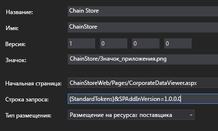

# <a name="add-first-run-logic-to-the-provider-hosted-add-in"></a>Добавление логики первого запуска в надстройку, размещаемую у поставщика

Это восьмая часть серии статей, посвященной основам разработки надстроек SharePoint, размещаемых у поставщика. Для начала вам следует ознакомиться со статьей [Надстройки SharePoint](sharepoint-add-ins.md) и предыдущими статьями из этой серии.

-  [Знакомство с созданием надстроек SharePoint, размещаемых у поставщика](get-started-creating-provider-hosted-sharepoint-add-ins.md)
-  [Настройка внешнего вида надстройки SharePoint, размещенной у поставщика](give-your-provider-hosted-add-in-the-sharepoint-look-and-feel.md)
-  [Добавление настраиваемой кнопки в надстройку, размещенную у поставщика](include-a-custom-button-in-the-provider-hosted-add-in.md)
-  [Краткий обзор объектной модели SharePoint](get-a-quick-overview-of-the-sharepoint-object-model.md)
-  [Добавление операций записи SharePoint в надстройку, размещенную у поставщика](add-sharepoint-write-operations-to-the-provider-hosted-add-in.md)
-  [Добавление веб-части надстройки в надстройку, размещенную у поставщика](include-an-add-in-part-in-the-provider-hosted-add-in.md)
-  [Обработка событий в надстройке, размещаемой у поставщика](handle-add-in-events-in-the-provider-hosted-add-in.md)

> [!NOTE]
> Если вы изучали предыдущие статьи этой серии о размещаемых у поставщика надстройках, то у вас уже есть решение Visual Studio, которое можно использовать для работы с данной статьей. Кроме того, вы можете скачать репозиторий [SharePoint_Provider-hosted_Add-Ins_Tutorials](https://github.com/OfficeDev/SharePoint_Provider-hosted_Add-ins_Tutorials) и открыть файл BeforeFirstRunLogic.sln.

В этой статье рассматривается добавление на начальную страницу надстройки SharePoint "Chain Store" такого кода, который проверяет, первый ли это запуск текущего экземпляра надстройки. Если это так, код развернет список **Local Employees** (Местные сотрудники) и специальную кнопку на ленте.

## <a name="create-the-basic-class-for-deploying-sharepoint-components"></a>Создание базового класса для развертывания компонентов SharePoint

> [!NOTE]
> Когда решение открывается повторно, для параметров раздела "Запускаемые проекты" в Visual Studio обычно возвращаются значения по умолчанию. После повторного открытия примера решения, который рассматривается в этой серии статей, всегда выполняйте указанные ниже действия. 
> 1. В верхней части **обозревателя решений** щелкните узел решения правой кнопкой мыши и выберите пункт **Назначить запускаемые проекты**.  
> 2. Убедитесь, что в столбце **Действие** для всех трех проектов задано значение **Запуск**.

1. В проекте **ChainStoreWeb** в **обозревателе решений** щелкните правой кнопкой мыши папку **Utilities** и выберите **Добавить** > **Существующий элемент**.
    
2. В открывшемся окне **проводника** выберите папку решения (**ChainStoreWeb**) и откройте папку **Utilities**.

3. Выберите файл SharePointComponentDeployer.cs и нажмите кнопку **Добавить**.

4. Откройте файл SharePointComponentDeployer.cs. В нем есть статический класс и два статических метода, которые получают и задают версию надстройки в таблице **Tenants** (Клиенты) корпоративной базы данных. Мы не будем рассматривать эти методы, так как эта серия статей не предназначена для обучения программированию для ASP.NET или SQL Server/Azure.

5. Добавьте указанные ниже операторы **using** в начало файла.
    
    ```C#
      using System.Web;
      using System.Linq;
      using System.Collections.Generic;
      using Microsoft.SharePoint.Client;
    ```

6. В начале определения класса `SharePointComponentDeployer` добавьте два указанных ниже статических поля. Оба поля инициализируются в методе **Page_Load** начальной страницы надстройки (вы добавите этот код на одном из последующих этапов). 

    ```C#
      internal static SharePointContext sPContext;
      internal static Version localVersion;
    ```

   Обратите внимание на указанные ниже особенности этого кода.
   
   - В первом поле будет храниться объект `SharePointContext`, который необходим для выполнения операций CRUD в SharePoint. 
   
   - Во втором поле будет храниться номер версии надстройки, установленной на хост-сайте. Это значение изначально отличается от значения, используемого по умолчанию (**0000.0000.0000.0000**) и записанного в корпоративной таблице **Клиенты** при регистрации клиента обработчиком установки. Например, номером первой версии надстройки будет **1.0.0.0**.

7. Создайте указанное ниже статическое свойство, в котором будет храниться номер версии надстройки, которая в текущий момент зарегистрирована в корпоративной таблице **Tenants** (Клиенты). Для получения и задания этого значения оно использует два метода, которые уже имелись в файле.
    
    ```C#
      internal static Version RemoteTenantVersion
    {
        get
        {
            return GetTenantVersion();
        }
        set
        {
            SetTenantVersion(value);
        }
    }
    ```

8. Теперь создайте свойство `IsDeployed`. 

    ```C#
      public static bool IsDeployed
    {
        get
        {
            if (RemoteTenantVersion < localVersion)
                return false; 
            else
                return true; 
        }
    }
    ```

   Обратите внимание на указанные ниже особенности этого кода.

   - Метод **Page_Load** начальной страницы надстройки использует значение этого свойства, чтобы определить, в первый ли раз запущена надстройка. Значение **false** указывает на то, что надстройку раньше не запускали на текущем хост-сайте, поэтому необходимо развернуть ее компоненты.

   - Проверка выполняется путем сравнения номера версии, зарегистрированного в таблице **Клиенты**, с номером установленной версии. При первом запуске надстройки первое значение будет меньше. Код, который вы напишете на одном из последующих этапов, задает в таблице **Клиенты** номер фактически установленной версии, поэтому при повторном запуске надстройки `IsDeployed` вернет значение **true**, а логика развертывания не будет выполняться повторно.
 
9. Добавьте приведенный ниже метод в класс `SharePointComponentDeployer`. Обратите внимание на то, что в последнюю очередь метод обновляет зарегистрированную версию клиента в корпоративной базе данных (**0000.0000.0000.0000**), чтобы она соответствовала фактической версии надстройки на хост-сайте (**1.0.0.0**). Вы допишете код этого метода на одном из последующих этапов.
    
    ```C#
      internal static void DeployChainStoreComponentsToHostWeb(HttpRequest request)
    {
        // TODO4: Deployment code goes here.

        RemoteTenantVersion = localVersion;
    }
    ```

> [!NOTE]
> Вас может удивить, что для определения ответа на вопрос о первом запуске надстройки, на который можно было бы ответить просто "да" или "нет", надстройка сравнивает номера версий. Можно было бы добавить в таблицу **Клиенты** простое строковое поле, для которого задано значение *Еще не запускалась* в обработчике установки, а затем заменить это значение на *Уже запускалась* с помощью логики первого запуска после развертывания компонентов SharePoint. 

> Для надстройки Chain Store было бы достаточно такой простой проверки. Но обычно рекомендуется обрабатывать номера версий, так как в будущем надстройка, используемая в рабочей среде, скорее всего, будет обновляться "на месте", то есть уже после установки. В таком случае для логики надстройки будет недостаточно вариантов *Еще не запускалась* и *Уже запускалась*. 

> Предположим, что вы хотите добавить дополнительный список на хост-сайт при обновлении надстройки версии 1.0.0.0 до 2.0.0.0. Это можно было бы сделать с помощью логики первого запуска после обновления или обработчика событий обновления. В любом случае логике развертывания потребуется развернуть новые компоненты и избежать повторного развертывания компонентов предыдущей версии надстройки. Номер версии 1.0.0.0 будет указывать на то, что компоненты версии 1.0.0.0 уже развернуты, но логика первого запуска после обновления пока не выполнялась.

## <a name="add-the-basic-startup-logic"></a>Добавление базовой логики запуска

Хост-сайт SharePoint должен сообщить удаленному веб-приложению номер версии установленной на нем надстройки. Для этого мы используем параметр запроса. 

1. Откройте файл AppManifest.xml в проекте **ChainStore**. В конструкторе вы увидите, что заполнитель *{StandardTokens}* используется в качестве значения поля **Строка запроса**. В конец добавьте строку `"&amp;SPAddInVersion=1.0.0.0"`. 

   Конструктор манифеста должен выглядеть примерно так, как показано ниже. *Обратите внимание на то, что номер версии, который передается в строке запроса, должен совпадать со значением в поле __Версия__ конструктора.* Если вы когда-либо будете обновлять надстройку, вам потребуется увеличить эти два значения и проследить, чтобы они совпадали.

   *Рис. 1. Вкладка "Общие" в конструкторе манифеста*

   

2. Откройте файл CorporateDataViewer.aspx.cs и добавьте приведенный ниже код в метод **Page_Load** сразу же после строки, с помощью которой выполняется инициализация объекта `spContext`. 

    ```C#
     SharePointComponentDeployer.sPContext = spContext;
     SharePointComponentDeployer.localVersion = new Version(Request.QueryString["SPAddInVersion"]);

     if (!SharePointComponentDeployer.IsDeployed)
     {
         SharePointComponentDeployer.DeployChainStoreComponentsToHostWeb(Request);
     }
    ```

   Обратите внимание на указанные ниже особенности этого кода.

   - Он начинается с задания двух статических полей в статическом классе `SharePointComponentDeployer`. Он передает объект **SharePointContext**, так как код в `SharePointComponentDeployer` вызывает SharePoint, и использует добавленный вами параметр запроса, чтобы задать свойство `localVersion`.  

   - Он ничего не делает, если `IsDeployed` имеет значение true, то есть если логика первого запуска уже выполнялась. В противном случае он вызывает метод развертывания и передает объект **Request** ASP.NET.

## <a name="programmatically-deploy-a-sharepoint-list"></a>Развертывание списка SharePoint программным способом

1. В файле SharePointComponentDeployer.cs замените `TODO4` приведенной ниже строкой (этот метод создается на следующем этапе).
    
    ```C#
      CreateLocalEmployeesList();
    ```

2. Добавьте приведенный ниже метод в класс `SharePointComponentDeployer`. 

    ```C#
      private static void CreateLocalEmployeesList()
    {
        using (var clientContext = sPContext.CreateUserClientContextForSPHost())
        {
            var query = from list in clientContext.Web.Lists
                        where list.Title == "Local Employees"
                        select list;
            IEnumerable<List> matchingLists = clientContext.LoadQuery(query);
            clientContext.ExecuteQuery();

            if (matchingLists.Count() == 0)
            {
               // TODO5: Create the list 

               // TODO6: Rename the Title field on the list 

               // TODO7: Add "Added to Corporate DB" field to the list 

               clientContext.ExecuteQuery();
            }
        }
    }
    ```

   Обратите внимание на указанные ниже особенности этого кода.

   - В нем имеется два вызова **ExecuteQuery**. Первый необходим, чтобы определить, существует ли список. Второй выполняет действия, необходимые для создания списка.

   - Метод **ClientContext.LoadQuery** похож на метод **ClientContext.Load**, но вместо объекта, например списка, он передает клиенту перечислимые результаты запроса.

3. Замените `TODO5` на приведенный ниже код. 

    ```C#
      ListCreationInformation listInfo = new ListCreationInformation();
      listInfo.Title = "Local Employees";
      listInfo.TemplateType = (int)ListTemplateType.GenericList;
      listInfo.Url = "Lists/Local Employees";
      List localEmployeesList = clientContext.Web.Lists.Add(listInfo);
    ```

   Обратите внимание на указанные ниже особенности этого кода.

   - Класс **ListCreationInformation** похож на класс **ListItemCreationInformation**, который уже встречался в одной из предыдущих статей этой серии. Это упрощенный класс, который больше подходит для отправки данных из веб-приложения в SharePoint, чем полноценный класс **List**.

   - Существует много типов шаблонов списков, например тип Tasks для списка "список дел" и тип Events для календаря. Список **Local Employees** (Местные сотрудники) основан на самом простом типе Generic.

   - В свойстве **ListCreationInformation.Url** хранится URL-адрес списка, указанный *относительно* хост-сайта. При указании `"Lists/LocalEmployees"` код задает полный URL-адрес списка: `https://{SharePointDomain}/hongkong/_layouts/15/start.aspx#/Lists/Local%20Employees`.

4. Замените `TODO6` приведенным ниже кодом, который заменяет общедоступное имя поля (столбца) "Title" (Название) на "Name" (Имя). Это то, что вы делали на странице **List Settings** (Параметры списка) при создании списка вручную.
    
    ```C#
      Field field = localEmployeesList.Fields.GetByInternalNameOrTitle("Title");
      field.Title = "Name";
      field.Update();
    ```

5. Кроме того, вы вручную создали поле **Added to Corporate DB** (Добавлено в корпоративную базу данных). Чтобы сделать это программным способом, добавьте приведенный ниже код вместо `TODO7`. 

    ```C#
          localEmployeesList.Fields.AddFieldAsXml("<Field DisplayName='Added to Corporate DB'"
                                                 +"Type='Boolean'>"
                                                 + "<Default>FALSE</Default></Field>",
                                                 true,
                                                 AddFieldOptions.DefaultValue);
    ```

   Обратите внимание на указанные ниже особенности этого кода.

   - Ключевые свойства этого поля задаются с помощью большого двоичного объекта XML. Это связано с архитектурой SharePoint, где веб-сайты, списки, поля, типы контента и большая часть других компонентов SharePoint определяются как XML. В этом случае мы указываем отображаемое имя, тип данных, а также значение по умолчанию для поля.

   - Второй параметр указывает, должно ли поле отображаться в представлении списка, используемом по умолчанию. Мы присвоим ему значение **true**. 

   - Третий параметр определяет типы контента, к которым добавляется это поле. Если передать **DefaultValue**, поле будет добавляться только к заданному по умолчанию типу контента для списка.


6. Вспомним, что по умолчанию для поля **Added to Corporate DB** (Добавлено в корпоративную базу данных) задано значение **No** (Нет), то есть false, но после добавления сотрудника в корпоративную базу данных специальная кнопка ленты в надстройке присваивает полю значение **Yes** (Да). Эта система работает безупречно, только если пользователи не могут менять значение поля вручную. Чтобы у пользователей гарантированно не было такой возможности, сделайте поле невидимым в формах создания и редактирования элементов в списке **Local Employees** (Местные сотрудники). Для этого мы добавим два дополнительных атрибута в первый параметр, как показано в приведенном ниже коде.
    
     ```C#
       localEmployeesList.Fields.AddFieldAsXml("<Field DisplayName='Added to Corporate DB'" 
                                              + " Type='Boolean'"  
                                              + " ShowInEditForm='FALSE' "
                                              + " ShowInNewForm='FALSE'>"
                                              + "<Default>FALSE</Default></Field>",
                                              true,
                                              AddFieldOptions.DefaultValue);
     ```
     
     
7. Весь метод `CreateLocalEmployeesList` теперь должен выглядеть так, как показано ниже.

    ```C#
           private static void CreateLocalEmployeesList()
         {
             using (var clientContext = sPContext.CreateUserClientContextForSPHost())
             {
                 var query = from list in clientContext.Web.Lists
                             where list.Title == "Local Employees"
                             select list;
                 IEnumerable<List> matchingLists = clientContext.LoadQuery(query);
                 clientContext.ExecuteQuery();

                 if (matchingLists.Count() == 0)
                 {
                     ListCreationInformation listInfo = new ListCreationInformation();
                     listInfo.Title = "Local Employees";
                     listInfo.TemplateType = (int)ListTemplateType.GenericList;
                     listInfo.Url = "LocalEmployees";
                     List localEmployeesList = clientContext.Web.Lists.Add(listInfo);

                     Field field = localEmployeesList.Fields.GetByInternalNameOrTitle("Title");
                     field.Title = "Name";
                     field.Update();

                     localEmployeesList.Fields.AddFieldAsXml("<Field DisplayName='Added to Corporate DB'" 
                                                             + " Type='Boolean'"  
                                                            + " ShowInEditForm='FALSE' "
                                                            + " ShowInNewForm='FALSE'>"
                                                            + "<Default>FALSE</Default></Field>",
                                                             true,
                                                             AddFieldOptions.DefaultValue);
                     clientContext.ExecuteQuery();
                 }
             }
         }
    ```

## <a name="temporarily-remove-the-custom-button-from-the-project"></a>Временное удаление специальной кнопки из проекта

По техническим причинам, которые мы рассмотрим в следующей статье, созданную специальную кнопку не удастся установить без изменений, если необходимо разместить ее на ленте списка, который развернут программным способом. Мы временно удалим ее из проекта, чтобы можно было протестировать логику первого запуска. Мы вернем ее при выполнении действий, указанных в следующей статье.

- В **обозревателе решений** щелкните правой кнопкой мыши узел **AddEmployeeToCorpDB** в проекте **ChainStore**, а затем выберите пункт **Исключить из проекта**.

## <a name="request-permission-to-manage-lists-on-the-host-web"></a>Запрашивание разрешения на управление списками на хост-сайте

Так как теперь надстройка добавляет список на хост-сайт, а не просто элементы в существующий список, нам необходимо расширить разрешения, которые она запрашивает, указав Manage вместо Write.

1. В **обозревателе решений** откройте файл AppManifest.xml в проекте **ChainStore**.

2. Откройте вкладку **Разрешения**. В столбце **Область** оставьте значение "Интернет", а в столбце **Разрешение** выберите из раскрывающегося списка пункт **Manage**.
 
3. Сохраните файл.

## <a name="run-the-add-in-and-test-the-first-run-logic"></a>Запуск надстройки и тестирование логики первого запуска

1. Откройте страницу **Содержимое сайта** на веб-сайте магазина в Гонконге и удалите список **Local Employees** (Местные сотрудники). 

2. Нажмите клавишу F5, чтобы развернуть и запустить надстройку. Редактор Visual Studio размещает удаленное веб-приложение в IIS Express, а базу данных SQL — в SQL Express. Кроме того, он выполняет временную установку надстройки на вашем тестовом сайте SharePoint и сразу же запускает ее. Прежде чем откроется начальная страница надстройки, вам будет предложено предоставить надстройке необходимые разрешения.

3. Когда откроется начальная страница надстройки, перейдите по ссылке **Вернуться на сайт** на размещенном в верхней части элементе управления хрома.

4. Перейдите на страницу **Содержимое сайта**. На ней будет список **Local Employees** (Местные сотрудники), так как его добавила логика первого запуска.
    
   > [!NOTE]
   > Если списка там нет или имеются другие признаки того, что код первого запуска не выполняется, может быть, при нажатии клавиши F5 таблица **Клиенты** не очищается. Как правило, это связано с тем, что проект **ChainCorporateDB** больше не задан в качестве запускаемого в Visual Studio. См. [примечание в начале этой статьи](#create-the-basic-class-for-deploying-sharepoint-components) о том, как устранить эту проблему. Кроме того, убедитесь, что настроили базу данных так, чтобы она перестраивалась, как описано в разделе [Настройка Visual Studio для перестройки корпоративной базы данных при каждом сеансе отладки](give-your-provider-hosted-add-in-the-sharepoint-look-and-feel.md#Rebuild).

5. Откройте список и добавьте в него элемент. Обратите внимание, что на новой форме элемента больше нет поля **Added to Corporate DB** (Добавлен в корпоративную базу данных), поэтому нет возможности задать его значение вручную. Это справедливо и для формы изменения элемента.
    
   *Рис. 2. Форма создания элемента для списка "Local Employees" (Местные сотрудники)*

   

6. Нажмите кнопку "Назад" в браузере, чтобы вернуться на начальную страницу надстройки.

7. Выберите значок шестеренки на размещенном сверху элементе управления хрома, а затем — **Настройка учетной записи**.

8. На странице **Настройка учетной записи** нажмите кнопку **Показать версию надстройки**. Отобразится номер версии **1.0.0.0**, так как логика первого запуска изменила его.
  
   *Рис. 3. Страница "Настройка учетной записи"*

   

9. Чтобы завершить сеанс отладки, закройте окно браузера или остановите отладку в Visual Studio. При каждом нажатии клавиши F5 Visual Studio отзывает предыдущую версию надстройки и устанавливает ее последнюю версию.

10. Вы будете работать с этой надстройкой и решением Visual Studio при изучении других статей, поэтому при перерывах в работе рекомендуем отзывать надстройку. В **обозревателе решений** щелкните проект правой кнопкой мыши и выберите пункт **Отозвать**.

## <a name="next-steps"></a>Дальнейшие действия
<a name="Nextsteps"> </a>

Как вернуть специальную кнопку на ленту **Local Employee** (Местный сотрудник) надстройки, когда развертывание списка выполняется программным способом, показано в статье [Программное развертывание специальной кнопки в надстройке, размещаемой у поставщика](programmatically-deploy-a-custom-button-in-the-provider-hosted-add-in.md).
 

 

