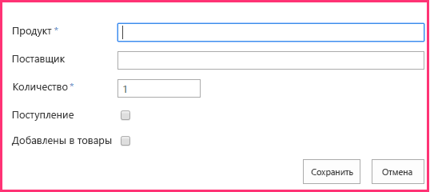

# <a name="add-sharepoint-write-operations-to-the-provider-hosted-add-in"></a>Добавление операций записи SharePoint в надстройку с размещением у поставщика

Это пятая часть серии статей, посвященных основам разработки надстроек SharePoint, размещаемых у поставщика. Для начала вам следует ознакомиться со статьей [Надстройки SharePoint](sharepoint-add-ins.md) и предыдущими статьями из этой серии.

-  [Знакомство с созданием надстроек SharePoint с размещением у поставщика](get-started-creating-provider-hosted-sharepoint-add-ins.md)
-  [Настройка внешнего вида надстройки SharePoint, размещенной у поставщика](give-your-provider-hosted-add-in-the-sharepoint-look-and-feel.md)
-  [Добавление настраиваемой кнопки в надстройку, размещенную у поставщика](include-a-custom-button-in-the-provider-hosted-add-in.md)
-  [Краткий обзор объектной модели SharePoint](get-a-quick-overview-of-the-sharepoint-object-model.md)

> [!NOTE]
> Если вы изучали предыдущие статьи из этой серии о надстройках, размещаемых у поставщика, то у вас уже есть решение для Visual Studio, которое можно использовать для работы с этой статьей. Кроме того, вы можете скачать репозиторий [SharePoint_Provider-hosted_Add-Ins_Tutorials](https://github.com/OfficeDev/SharePoint_Provider-hosted_Add-ins_Tutorials) и открыть файл BeforeSharePointWriteOps.sln.

В этой статье мы вернемся к написанию кода и добавим несколько функций, которые записывают данные в надстройку SharePoint Chain Store.

## <a name="change-a-column-value-on-a-sharepoint-list-item"></a>Изменение значения столбца в элементе списка SharePoint

В нашей надстройке есть настраиваемая кнопка ленты, добавляющая сотрудника из списка **Local Employees** (Местные сотрудники) магазина в Гонконге в корпоративную базу данных. Тем не менее пользователю приходится вручную изменять значение поля **Added to Corporate DB** (Добавлен в корпоративную базу данных) на **Yes** (Да). Давайте добавим код, который будет делать это автоматически.

> [!NOTE]
> Когда решение открывается повторно, для параметров раздела "Запускаемые проекты" в Visual Studio обычно возвращаются значения по умолчанию. Сразу же после повторного открытия примера решения согласно инструкциям из этой серии статей всегда делайте вот что: 

> 1. В верхней части **обозревателя решений** щелкните узел решения правой кнопкой мыши и выберите пункт **Назначить запускаемые проекты**.  
> 2. Убедитесь, что в столбце **Действие** для всех трех проектов указано значение **Запуск**.

1. В **обозревателе решений** откройте файл EmployeeAdder.cs.

2. Добавьте указанную ниже строку в метод **Page_Load** между вызовами методов `AddLocalEmployeeToCorpDB` и `Response.Redirect`. Вы создадите метод **SetLocalEmployeeSyncStatus** на следующем этапе.
    
    ```C#
       // Write to SharePoint 
     SetLocalEmployeeSyncStatus();
    ```

3. Добавьте указанный ниже новый метод в класс `EmployeeAdder`. 

    ```C#
       private void SetLocalEmployeeSyncStatus()
     {
         using (var clientContext = spContext.CreateUserClientContextForSPHost())
         {
             List localEmployeesList = clientContext.Web.Lists.GetByTitle("Local Employees");
             ListItem selectedLocalEmployee = localEmployeesList.GetItemById(listItemID);
             selectedLocalEmployee["Added_x0020_to_x0020_Corporate_x"] = true;
             selectedLocalEmployee.Update();
             clientContext.ExecuteQuery();
         }
     }
    ```

   Обратите внимание на следующие особенности этого кода:
    
   - Внутреннее имя поля **Added to Corporate DB** (Добавлен в корпоративную базу данных) выглядит довольно странно. Это связано с тем, что внутренние имена полей не должны содержать пробелы. Когда пользователь создает поле с пробелами в отображаемом имени, при задании внутреннего имени SharePoint заменяет каждый пробел строкой _x0020_. Из-за этого строка Added to Employee DB превратилась в строку Added_x0020_to_x0020_Corporate_x0020_DB. Длина внутренних имен не должна превышать 32 символов, поэтому имя усечено до строки Added_x0020_to_x0020_Corporate_x.

   - Хотя в пользовательском интерфейсе SharePoint столбец **Added to Corporate DB** (Добавлен в корпоративную базу данных) называется полем **Yes/No** (Да или нет), на самом деле он имеет логический тип, поэтому его значение — **true**, а не **Yes** (Да).

   - Для фиксации изменений в базе данных контента SharePoint доложен вызвать метод **Update** класса **ListItem**. Существует общее, но не совсем универсальное правило, согласно которому при изменении значения свойства объекта, хранящегося в базах данных SharePoint, необходимо вызвать метод **Update** объекта.

## <a name="request-permission-to-write-to-the-host-web-list"></a>Запрос разрешения на запись в список хост-сайта

Так как теперь надстройка не только считывает данные из списка, но и записывает их туда, нам необходимо расширить разрешения для надстройки с "Чтение" до "Запись". Сделайте вот что:

1. В **обозревателе решений** в проекте **ChainStore** откройте файл AppManifest.xml.

2. Откройте вкладку **Разрешения** и в поле **Разрешение** в раскрывающемся списке выберите **Запись**.

3. Сохраните файл. 

## <a name="run-the-add-in-and-test-the-button"></a>Запуск надстройки и тестирование кнопки

1. Нажмите клавишу F5, чтобы развернуть и запустить надстройку. Редактор Visual Studio размещает удаленное веб-приложение в IIS Express, а базу данных SQL — в SQL Express. Кроме того, он временно устанавливает надстройку на вашем тестовом сайте SharePoint и сразу же запускает ее. Прежде чем откроется начальная страница надстройки, вам будет предложено предоставить надстройке необходимые разрешения. 

2. В форме разрешений выберите в списке пункт **Local Employees** (Локальные сотрудники), а затем щелкните **Доверять**.

3. Когда откроется начальная страница, на размещенном в верхней части элементе управления хрома нажмите кнопку **Вернуться на сайт**.

4. На домашней странице веб-сайта выберите **Site Contents**(Содержание сайта) > **Local Employees** (Местные сотрудники). Откроется страница представления списка.

5. Если в списке нет сотрудников, для которых в столбце **Added to Corporate DB** (Добавлен в корпоративную базу данных) указано значение **No** (Нет), добавьте в список еще одного сотрудника и *не устанавливайте флажок __Added to Corporate DB__ (Добавлен в корпоративную базу данных).* 

6. На ленте откройте вкладку **Элементы**. В разделе **Действия** вкладки есть специальная кнопка **Add to Corporate DB** (Добавить в корпоративную базу данных).

7. В списке выберите сотрудника, для которого в столбце **Added to Corporate DB** (Добавлен в корпоративную базу данных) задано значение **No** (Нет).

8. Нажмите кнопку **Add to Corporate DB** (Добавить в корпоративную базу данных). (Сначала необходимо выбрать элемент.)

9. Вам покажется, что страница перезагружается, так как метод **Page_Load** страницы EmployeeAdder выполняет перенаправление на нее. В итоге значение поля **Added to Corporate DB** (Добавлен в корпоративную базу данных) для сотрудника изменится на **Yes** (Да).
    
   > [!NOTE]
   > Что-нибудь мешает пользователю вручную изменить значение поля **Added to Corporate DB** (Добавлен в корпоративную базу данных) и рассогласовать данные в списке и корпоративной базе данных? Нет. Мы решим эту проблему в одной из следующих статей серии.

10. Чтобы завершить сеанс отладки, закройте окно браузера или остановите отладку в Visual Studio. При каждом нажатии клавиши F5 Visual Studio отзывает предыдущую версию надстройки и устанавливает ее последнюю версию.

11. В **обозревателе решений** щелкните проект правой кнопкой мыши и выберите пункт **Отозвать**.

## <a name="create-a-new-custom-list-on-the-host-website"></a>Создание настраиваемого списка на хост-сайте

Теперь нам необходимо усовершенствовать надстройку Chain Store — сделать так, чтобы можно было создавать элементы, а не просто изменять поля существующих элементов. В частности, при размещении нового заказа на корпоративном уровне в списке SharePoint должен автоматически создаваться элемент, который предупредит местных сотрудников о предстоящей отгрузке. Этот список называется **Expected Shipments** (Ожидаемые отгрузки). Вы создадите его, выполнив указанные ниже действия. В одной из следующих статей этой серии вы узнаете, как программным способом добавить настраиваемый список на хост-сайт, но сейчас вы добавите его вручную.

1. На начальной странице магазина Fabrikam в Гонконге выберите пункты **Site Contents**(Содержание сайта) > **Add an add-in**(Добавить надстройку) > **Custom List** (Настраиваемый список). 

2. В диалоговом окне **Добавление настраиваемого списка** укажите имя **Expected Shipments** (Ожидаемые отгрузки) и нажмите кнопку **Создать**. 

3. На странице **Site Contents** (Содержание сайта) откройте список **Expected Shipments** (Ожидаемые отгрузки).

4. Откройте вкладку **Список** на ленте, а затем нажмите кнопку **Параметры списка**.

5. В разделе **Столбцы** на странице **Параметры списка** выберите столбец **Название**.

6. Откроется форма **Изменение столбца**. В поле **Имя столбца** измените значение с **Title** (Название) на **Product** (Продукт), а затем нажмите кнопку **OK**.

7. На странице **Параметры** выберите команду **Создать столбец**.

8. В предыдущей статье этой серии вы узнали, как создавать настраиваемые столбцы для списка. Добавьте четыре столбца для списка **Expected Shipments** (Ожидаемые отгрузки), используя значения из указанной ниже таблицы. Для всех остальных параметров оставьте значения, используемые по умолчанию.

   |**Имя столбца**|**Тип**|**Обязательный?**|**Значение, используемое по умолчанию**|
   |:-----|:-----|:-----|:-----|
   |"Supplier" (Поставщик)|**Однострочный текст**|Не требуется|Нет|
   |"Quantity" (Количество)|**Число**|Обязательный|1|
   |"Arrived" (Доставлено)|**Yes/No** (Да или нет)|Не требуется|No (Нет)|
   |"Added to Inventory" (Добавлено в инвентарь)|**Yes/No** (Да или нет)|Не требуется|No (Нет)|

9. После создания столбцов на странице параметров списка выберите **Site Contents** (Содержание сайта). Откроется страница **Site Contents** (Содержание сайта). Откройте список **Expected Shipments** (Ожидаемые отгрузки).

10. Нажмите кнопку **Создать элемент**. Форма создания элемента должна иметь точно такой же вид, как показано ниже, включая две звездочки, обозначающие обязательные поля.

   *Рис. 1. Форма создания элемента для списка Expected Shipments (Ожидаемые отгрузки)*

   

11. Мы не будем создавать элементы этого списка вручную, поэтому нажмите кнопку **Отмена**.

## <a name="insert-an-item-into-a-sharepoint-list"></a>Вставка элемента в список SharePoint

Теперь добавьте в надстройку функцию, которая при размещении заказа для магазина в Гонконге на корпоративном уровне создает элемент в списке **Expected Shipments** (Ожидаемые отгрузки).

1. В **обозревателе решений** откройте файл OrderForm.aspx.cs.

2. В начало файла добавьте оператор **using** для **Microsoft.SharePoint.Client**.

3. В методе **btnCreateOrder_Click** добавьте указанную ниже строку сразу же после вызова `CreateOrder`. Вы создадите метод **CreateExpectedShipment** на следующем этапе.
    
    ```C#
      CreateExpectedShipment(txtBoxSupplier.Text, txtBoxItemName.Text, quantity);
    ```

4. Добавьте указанный ниже метод в класс `OrderForm`. 

    ```C#
      private void CreateExpectedShipment(string supplier, string product, UInt16 quantity)
    {
        using (var clientContext = spContext.CreateUserClientContextForSPHost())
        {
            List expectedShipmentsList = clientContext.Web.Lists.GetByTitle("Expected Shipments");
            ListItemCreationInformation itemCreateInfo = new ListItemCreationInformation();
            ListItem newItem = expectedShipmentsList.AddItem(itemCreateInfo);
            newItem["Title"] = product;
            newItem["Supplier"] = supplier;
            newItem["Quantity"] = quantity;
            newItem.Update();
            clientContext.ExecuteQuery();
        }
    }
    ```

   Обратите внимание на следующие особенности этого кода:

   - Для создания объекта **ListItem** не используется конструктор. Это связано с соображениями производительности. Объект **ListItem** имеет ряд свойств (со значениями по умолчанию). Если используется конструктор, весь объект будет включен в сообщение XML, которое метод **ExecuteQuery** отправляет на сервер. 
   
   - **ListItemCreationInformation** — это "легковесный" объект, содержащий только минимальное количество значений, не используемых по умолчанию, которые необходимы серверу для создания объекта **ListItem**. Кроме того, может присутствовать строка, которая создает объект **ListItem**, но при вызове этой строки происходит только добавление XML-разметки в сообщение, отправляемое на сервер. Объект **ListItem** создается на сервере.

   - Нет необходимости отправлять объект **ListItem** обратно клиенту, поэтому метод **ClientContext.Load** не вызывается.

   - В коде не нужно явно задавать значения полей **Arrived** (Прибыл) или **Added to Inventory** (Добавлен в запасы), так как им присвоено значение **No** (Нет), используемое по умолчанию, то есть именно то, что нам нужно.

## <a name="check-for-deleted-components"></a>Проверка на наличие удаленных компонентов

Любой пользователь с привилегиями владельца списка SharePoint может удалить этот список. Если список развернут надстройкой на хост-сайте, то его может удалить и владелец хост-сайта. Это может случиться, если владелец решит, что ему не нужна функциональность, предоставляемая списком. (Если затем владелец изменит свое решение, то можно будет восстановить список из корзины SharePoint.) 

Работа метода **CreateExpectedShipment** зависит от того, существует ли список **Expected Shipments** (Ожидаемые отгрузки). Предположим, что владелец веб-сайта решил удалить список. Позже, при добавлении заказа с помощью **формы заказа** надстройки, вызывается метод **CreateExpectedShipment**, который создаст исключение с сообщением о том, что на веб-сайте SharePoint нет списка **Expected Shipments** (Ожидаемые отгрузки).

Вам может потребоваться, чтобы перед какими-либо действиями со списком `expectedShipmentsList` метод проверял, не пуст ли он. Когда вы работаете с CSOM, вам *не* удастся выполнить эту проверку с помощью простой структуры, например вот такой:

`if (expectedShipmentsList != null) { ... }`
 
Вместо этого вам придется использовать особый класс CSOM, который называется **ConditionalScope**. Причины этого связаны с системой пакетной обработки CSOM, о которой мы упоминали в предыдущей статье этой серии (см. раздел [Среда выполнения и пакетная обработка в клиенте](get-a-quick-overview-of-the-sharepoint-object-model.md#CSOMBatching)). **ConditionalScope** и система пакетной обработки — это более сложные темы, которые выходят за рамки данной серии статей для начинающих, но после изучения этой серии вам следует ознакомиться с документацией MSDN по этим темам.

Наличие списка можно проверить по-другому: вместо получения ссылки на список с помощью метода **GetByTitle** вы можете проверить, имеется ли список с указанным именем в "списке списков" веб-сайта. Это можно сделать с помощью кода, аналогичного указанному ниже.

```C#
var query = from list in clientContext.Web.Lists 
             where list.Title == "Expected Shipments" 
             select list; 
IEnumerable<List> matchingLists = clientContext.LoadQuery(query); 
clientContext.ExecuteQuery(); 
if (matchingLists.Count() != 0) 
{ 
    List expectedShipmentsList = matchingLists.Single(); 
    // Do something with the list. 
}
clientContext.ExecuteQuery(); 
```

Предыдущий код имеет одно преимущество: он позволяет вам не усложнять класс **ConditionalScope**. Мы будем использовать этот код во всех статьях этой серии. Но есть и недостаток: для этого кода необходим дополнительный вызов **ExecuteQuery**, только чтобы получить значение, которое вы хотите проверить в операторе **if**. 

Если мы используем этот способ в методе **CreateExpectedShipment**, чтобы проверить наличие списка, то этот метод получит два вызова **ExecuteQuery**, каждый из которых выполняет HTTP-запрос с удаленного веб-сервера в SharePoint. Эти запросы потребляют большую часть времени в любом методе CSOM, поэтому их рекомендуется использовать как можно реже.

Мы не будем изменять метод **CreateExpectedShipment**, но при разработке надстройки для рабочей среды вам придется обдумать, что должен делать ваш код, если компонент, на который он ссылается, удален. Один из вариантов — программное восстановление списка из корзины, но это будет раздражать пользователей, которые удалили список намеренно. 

Кроме того, может оказаться, что лучший вариант — это ничего не делать для предотвращения исключения. Исключение, полученное из SharePoint, будет предупреждать пользователей, что удаление списка нарушило работу части надстройки, причем пользователь, удаливший список, может и не осознавать этого. После этого пользователь может попытаться восстановить список из корзины или продолжить работу без некоторых функций надстройки, которые больше не работают.

## <a name="request-permission-to-manage-the-website"></a>Запрос разрешения на управление веб-сайтом

Вспомним, что когда надстройка запрашивает разрешение "Чтение" или "Запись" с областью "Список", SharePoint предлагает пользователю сделать надстройку доверенной. При этом диалоговое окно содержит раскрывающийся список, в котором пользователь может выбрать список, доступ к которому следует предоставить надстройке. Можно выбрать только один список. Но сейчас надстройка Chain Store записывает данные в два разных списка. Чтобы получить доступ к нескольким спискам, надстройке необходимо запросить разрешение с областью "Интернет". Сделайте вот что:

1. В **обозревателе решений** в проекте **ChainStore** откройте файл AppManifest.xml.

2. Откройте вкладку **Разрешения** и в поле **Область** в раскрывающемся списке выберите **Интернет**.

3. В поле **Разрешение** в раскрывающемся списке выберите пункт **Запись**.

4. Сохраните файл. 

## <a name="run-the-add-in-and-test-the-item-creation"></a>Запуск надстройки и тестирование функции создания элемента

1. Нажмите клавишу F5, чтобы развернуть и запустить надстройку. Редактор Visual Studio размещает удаленное веб-приложение в IIS Express, а базу данных SQL — в SQL Express. Кроме того, он временно устанавливает надстройку на вашем тестовом сайте SharePoint и сразу же запускает ее. Прежде чем откроется начальная страница надстройки, вам будет предложено предоставить надстройке необходимые разрешения. 

2. Когда откроется начальная страница надстройки, в нижней части страницы щелкните ссылку **Order Form** (Форма заказа).

3. Введите необходимые значения в форму и нажмите кнопку **Place Order** (Разместить заказ).

4. С помощью кнопки "Назад" в браузере вернитесь на начальную страницу, а затем вверху на элементе управления хрома щелкните **Вернуться на сайт**.

5. На начальной странице магазина в Гонконге выберите **Site Contents** (Содержание сайта) и откройте список **Expected Shipments** (Ожидаемые отгрузки). Теперь в списке есть элемент, соответствующий заказу. Ниже показан снимок экрана с примером.
  
   *Рис. 2. Список Expected Shipments (Ожидаемые отгрузки) с одним элементом*

   

6. Чтобы завершить сеанс отладки, закройте окно браузера или остановите отладку в Visual Studio. При каждом нажатии клавиши F5 Visual Studio будет отзывать предыдущую версию надстройки и устанавливать ее последнюю версию.

7. В **обозревателе решений** щелкните проект правой кнопкой мыши и выберите пункт **Отозвать**.

## <a name="next-steps"></a>Дальнейшие действия
<a name="Nextsteps"> </a>

В следующей статье вы узнаете, как придать удаленной форме заказа вид веб-части на странице SharePoint: [Добавление веб-части надстройки в надстройку, размещаемую у поставщика](include-an-add-in-part-in-the-provider-hosted-add-in.md)
 

 

