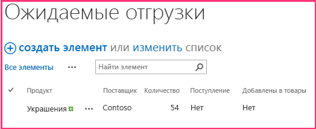

# <a name="add-sharepoint-write-operations-to-the-provider-hosted-add-in"></a><span data-ttu-id="5fec4-103">Добавление операций записи SharePoint в надстройку с размещением у поставщика</span><span class="sxs-lookup"><span data-stu-id="5fec4-103">Add SharePoint write operations to the provider-hosted add-in</span></span>

<span data-ttu-id="5fec4-104">Это пятая часть серии статей, посвященных основам разработки надстроек SharePoint, размещаемых у поставщика. Для начала вам следует ознакомиться со статьей [Надстройки SharePoint](sharepoint-add-ins.md) и предыдущими статьями из этой серии.</span><span class="sxs-lookup"><span data-stu-id="5fec4-104">This is the fourth in a series of articles about the basics of developing provider-hosted SharePoint Add-ins. You should first be familiar with  [SharePoint Add-ins](sharepoint-add-ins.md) and the previous articles in this series:</span></span>

-  [<span data-ttu-id="5fec4-105">Знакомство с созданием надстроек SharePoint с размещением у поставщика</span><span class="sxs-lookup"><span data-stu-id="5fec4-105">Get started creating provider-hosted SharePoint Add-ins</span></span>](get-started-creating-provider-hosted-sharepoint-add-ins.md)
-  [<span data-ttu-id="5fec4-106">Настройка внешнего вида надстройки SharePoint, размещенной у поставщика</span><span class="sxs-lookup"><span data-stu-id="5fec4-106">Give your provider-hosted add-in the SharePoint look-and-feel</span></span>](give-your-provider-hosted-add-in-the-sharepoint-look-and-feel.md)
-  [<span data-ttu-id="5fec4-107">Добавление настраиваемой кнопки в надстройку, размещенную у поставщика</span><span class="sxs-lookup"><span data-stu-id="5fec4-107">Include a custom button in the provider-hosted add-in</span></span>](include-a-custom-button-in-the-provider-hosted-add-in.md)
-  [<span data-ttu-id="5fec4-108">Краткий обзор объектной модели SharePoint</span><span class="sxs-lookup"><span data-stu-id="5fec4-108">Get a quick overview of the SharePoint object model</span></span>](get-a-quick-overview-of-the-sharepoint-object-model.md)

> [!NOTE]
> <span data-ttu-id="5fec4-109">Если вы изучали предыдущие статьи из этой серии о надстройках, размещаемых у поставщика, то у вас уже есть решение для Visual Studio, которое можно использовать для работы с этой статьей.</span><span class="sxs-lookup"><span data-stu-id="5fec4-109">Note If you have been working through this series about provider-hosted add-ins, then you have a Visual Studio solution that you can use to continue with this topic. You can also download the repository at  SharePoint_Provider-hosted_Add-Ins_Tutorials and open the BeforeSharePointWriteOps.sln file.</span></span> <span data-ttu-id="5fec4-110">Кроме того, вы можете скачать репозиторий [SharePoint_Provider-hosted_Add-Ins_Tutorials](https://github.com/OfficeDev/SharePoint_Provider-hosted_Add-ins_Tutorials) и открыть файл BeforeSharePointWriteOps.sln.</span><span class="sxs-lookup"><span data-stu-id="5fec4-110">You can also download the repository at [SharePoint_Provider-hosted_Add-Ins_Tutorials](https://github.com/OfficeDev/SharePoint_Provider-hosted_Add-ins_Tutorials) and open the BeforeSharePointWriteOps.sln file.</span></span>

<span data-ttu-id="5fec4-111">В этой статье мы вернемся к написанию кода и добавим несколько функций, которые записывают данные в надстройку SharePoint Chain Store.</span><span class="sxs-lookup"><span data-stu-id="5fec4-111">In this article we get back to coding by adding some functions that write data to the Chain Store SharePoint Add-in.</span></span>

## <a name="change-a-column-value-on-a-sharepoint-list-item"></a><span data-ttu-id="5fec4-112">Изменение значения столбца в элементе списка SharePoint</span><span class="sxs-lookup"><span data-stu-id="5fec4-112">Change a column value on a SharePoint list item</span></span>

<span data-ttu-id="5fec4-113">В нашей надстройке есть настраиваемая кнопка ленты, добавляющая сотрудника из списка **Local Employees** (Местные сотрудники) магазина в Гонконге в корпоративную базу данных.</span><span class="sxs-lookup"><span data-stu-id="5fec4-113">Our add-in has a custom ribbon button that adds an employee from the Hong Kong store's  **Local Employees** list to the corporate database. But the user has to remember to manually change the value of the Added to Corporate DB field toYes. Let's add code to do that automatically.</span></span> <span data-ttu-id="5fec4-114">Тем не менее пользователю приходится вручную изменять значение поля **Added to Corporate DB** (Добавлен в корпоративную базу данных) на **Yes** (Да).</span><span class="sxs-lookup"><span data-stu-id="5fec4-114">But the user has to remember to manually change the value of the **Added to Corporate DB** field to **Yes**.</span></span> <span data-ttu-id="5fec4-115">Давайте добавим код, который будет делать это автоматически.</span><span class="sxs-lookup"><span data-stu-id="5fec4-115">Let's add code to do that automatically.</span></span>

> [!NOTE]
> <span data-ttu-id="5fec4-116">Когда решение открывается повторно, для параметров раздела "Запускаемые проекты" в Visual Studio обычно возвращаются значения по умолчанию.</span><span class="sxs-lookup"><span data-stu-id="5fec4-116">Note  The settings for Startup Projects in Visual Studio tend to revert to defaults whenever the solution is reopened. Always take these steps immediately after reopening the sample solution in this series of articles:</span></span> <span data-ttu-id="5fec4-117">Сразу же после повторного открытия примера решения согласно инструкциям из этой серии статей всегда делайте вот что:</span><span class="sxs-lookup"><span data-stu-id="5fec4-117">Note  The settings for Startup Projects in Visual Studio tend to revert to defaults whenever the solution is reopened. Always take these steps immediately after reopening the sample solution in this series of articles:</span></span> 

> 1. <span data-ttu-id="5fec4-118">В верхней части **обозревателя решений** щелкните узел решения правой кнопкой мыши и выберите пункт **Назначить запускаемые проекты**.</span><span class="sxs-lookup"><span data-stu-id="5fec4-118">Right-click the solution node at the top of  **Solution Explorer** and select **Set startup projects**.</span></span>  
> 2. <span data-ttu-id="5fec4-119">Убедитесь, что в столбце **Действие** для всех трех проектов указано значение **Запуск**.</span><span class="sxs-lookup"><span data-stu-id="5fec4-119">Make sure all three projects are set to **Start** in the **Action** column.</span></span>

1. <span data-ttu-id="5fec4-120">В **обозревателе решений** откройте файл EmployeeAdder.cs.</span><span class="sxs-lookup"><span data-stu-id="5fec4-120">In **Solution Explorer**, open the EmployeeAdder.cs file.</span></span>

2. <span data-ttu-id="5fec4-121">Добавьте указанную ниже строку в метод **Page_Load** между вызовами методов `AddLocalEmployeeToCorpDB` и `Response.Redirect`.</span><span class="sxs-lookup"><span data-stu-id="5fec4-121">Add the following line to the Page_Load method between the call of AddLocalEmployeeToCorpDB and the call of Response.Redirect. You will create the SetLocalEmployeeSyncStatus method in the next step.</span></span> <span data-ttu-id="5fec4-122">Вы создадите метод **SetLocalEmployeeSyncStatus** на следующем этапе.</span><span class="sxs-lookup"><span data-stu-id="5fec4-122">In the next step, you create the **SetLocalEmployeeSyncStatus** method.</span></span>
    
    ```C#
       // Write to SharePoint 
     SetLocalEmployeeSyncStatus();
    ```

3. <span data-ttu-id="5fec4-123">Добавьте указанный ниже новый метод в класс `EmployeeAdder`.</span><span class="sxs-lookup"><span data-stu-id="5fec4-123">Add the following method to the  `EmployeeAdder` class.</span></span> 

    ```C#
       private void SetLocalEmployeeSyncStatus()
     {
         using (var clientContext = spContext.CreateUserClientContextForSPHost())
         {
             List localEmployeesList = clientContext.Web.Lists.GetByTitle("Local Employees");
             ListItem selectedLocalEmployee = localEmployeesList.GetItemById(listItemID);
             selectedLocalEmployee["Added_x0020_to_x0020_Corporate_x"] = true;
             selectedLocalEmployee.Update();
             clientContext.ExecuteQuery();
         }
     }
    ```

   <span data-ttu-id="5fec4-124">Обратите внимание на следующие особенности этого кода:</span><span class="sxs-lookup"><span data-stu-id="5fec4-124">Note the following about this code:</span></span>
    
   - <span data-ttu-id="5fec4-p105">Внутреннее имя поля **Added to Corporate DB** (Добавлен в корпоративную базу данных) выглядит довольно странно. Это связано с тем, что внутренние имена полей не должны содержать пробелы. Когда пользователь создает поле с пробелами в отображаемом имени, при задании внутреннего имени SharePoint заменяет каждый пробел строкой _x0020_. Из-за этого строка Added to Employee DB превратилась в строку Added_x0020_to_x0020_Corporate_x0020_DB. Длина внутренних имен не должна превышать 32 символов, поэтому имя усечено до строки Added_x0020_to_x0020_Corporate_x.</span><span class="sxs-lookup"><span data-stu-id="5fec4-p105">The internal name for the **Added to Corporate DB** field is odd-looking. Internal field names cannot contain spaces, so when a user creates a field with spaces in its display name, SharePoint substitutes the string "_x0020_" for each space when it sets the internal name. This turns "Added to Employee DB" into "Added_x0020_to_x0020_Corporate_x0020_DB". Internal names cannot be more than 32 characters, so the name is truncated to just "Added_x0020_to_x0020_Corporate_x".</span></span>

   - <span data-ttu-id="5fec4-129">Хотя в пользовательском интерфейсе SharePoint столбец **Added to Corporate DB** (Добавлен в корпоративную базу данных) называется полем **Yes/No** (Да или нет), на самом деле он имеет логический тип, поэтому его значение — **true**, а не **Yes** (Да).</span><span class="sxs-lookup"><span data-stu-id="5fec4-129">Although the Added to Corporate DB column is called a "Yes/No" field in the SharePoint UI, it is really a boolean, so its value is set to true, not "Yes".</span></span>

   - <span data-ttu-id="5fec4-p106">Для фиксации изменений в базе данных контента SharePoint доложен вызвать метод **Update** класса **ListItem**. Существует общее, но не совсем универсальное правило, согласно которому при изменении значения свойства объекта, хранящегося в базах данных SharePoint, необходимо вызвать метод **Update** объекта.</span><span class="sxs-lookup"><span data-stu-id="5fec4-p106">The **Update** method of the **ListItem** class must be called to commit the changes to SharePoint's content database. It is a general, but not quite universal, rule that when you change a property value of an object that is stored in the SharePoint databases, you must call the object's **Update** method.</span></span>

## <a name="request-permission-to-write-to-the-host-web-list"></a><span data-ttu-id="5fec4-132">Запрос разрешения на запись в список хост-сайта</span><span class="sxs-lookup"><span data-stu-id="5fec4-132">Request permission to write to the host web list</span></span>

<span data-ttu-id="5fec4-133">Так как теперь надстройка не только считывает данные из списка, но и записывает их туда, нам необходимо расширить разрешения для надстройки с "Чтение" до "Запись".</span><span class="sxs-lookup"><span data-stu-id="5fec4-133">Since the add-in is now writing to the list as well as reading it, we need to escalate the permissions that the add-in requests from Read to Write. Follow these steps.</span></span> <span data-ttu-id="5fec4-134">Сделайте вот что:</span><span class="sxs-lookup"><span data-stu-id="5fec4-134">Follow these steps.</span></span>

1. <span data-ttu-id="5fec4-135">В **обозревателе решений** в проекте **ChainStore** откройте файл AppManifest.xml.</span><span class="sxs-lookup"><span data-stu-id="5fec4-135">In **Solution Explorer**, open the AppManifest.xml file in the **ChainStore** project.</span></span>

2. <span data-ttu-id="5fec4-136">Откройте вкладку **Разрешения** и в поле **Разрешение** в раскрывающемся списке выберите **Запись**.</span><span class="sxs-lookup"><span data-stu-id="5fec4-136">Open the **Permissions** tab and in the **Permission** field, select **Write** from the drop down.</span></span>

3. <span data-ttu-id="5fec4-137">Сохраните файл.</span><span class="sxs-lookup"><span data-stu-id="5fec4-137">Save the file.</span></span> 

## <a name="run-the-add-in-and-test-the-button"></a><span data-ttu-id="5fec4-138">Запуск надстройки и тестирование кнопки</span><span class="sxs-lookup"><span data-stu-id="5fec4-138">Run the add-in and test the button</span></span>

1. <span data-ttu-id="5fec4-139">Нажмите клавишу F5, чтобы развернуть и запустить надстройку.</span><span class="sxs-lookup"><span data-stu-id="5fec4-139">Use the F5 key to deploy and run your add-in.</span></span> <span data-ttu-id="5fec4-140">Редактор Visual Studio размещает удаленное веб-приложение в IIS Express, а базу данных SQL — в SQL Express.</span><span class="sxs-lookup"><span data-stu-id="5fec4-140">Visual Studio hosts the remote web application in IIS Express and hosts the SQL database in SQL Express.</span></span> <span data-ttu-id="5fec4-141">Кроме того, он временно устанавливает надстройку на вашем тестовом сайте SharePoint и сразу же запускает ее.</span><span class="sxs-lookup"><span data-stu-id="5fec4-141">Use the F5 key to deploy and run your add-in. Visual Studio makes a temporary installation of the add-in on your test SharePoint site and immediately runs the add-in.</span></span> <span data-ttu-id="5fec4-142">Прежде чем откроется начальная страница надстройки, вам будет предложено предоставить надстройке необходимые разрешения.</span><span class="sxs-lookup"><span data-stu-id="5fec4-142">You are prompted to grant permissions to the add-in before its start page opens.</span></span> 

2. <span data-ttu-id="5fec4-143">В форме разрешений выберите в списке пункт **Local Employees** (Локальные сотрудники), а затем щелкните **Доверять**.</span><span class="sxs-lookup"><span data-stu-id="5fec4-143">On the permission form, choose **Local Employees** from the list and then click **Trust it**.</span></span>

3. <span data-ttu-id="5fec4-144">Когда откроется начальная страница, на размещенном в верхней части элементе управления хрома нажмите кнопку **Вернуться на сайт**.</span><span class="sxs-lookup"><span data-stu-id="5fec4-144">When the add-in's start page opens, click **Back to Site** on the chrome control at the top.</span></span>

4. <span data-ttu-id="5fec4-145">На домашней странице веб-сайта выберите **Site Contents**(Содержание сайта) > **Local Employees** (Местные сотрудники).</span><span class="sxs-lookup"><span data-stu-id="5fec4-145">From the website's home page, go to **Site Contents** > **Local Employees**.</span></span> <span data-ttu-id="5fec4-146">Откроется страница представления списка.</span><span class="sxs-lookup"><span data-stu-id="5fec4-146">The list view page opens.</span></span>

5. <span data-ttu-id="5fec4-147">Если в списке нет сотрудников, для которых в столбце **Added to Corporate DB** (Добавлен в корпоративную базу данных) указано значение **No** (Нет), добавьте в список еще одного сотрудника и *не устанавливайте флажок __Added to Corporate DB__ (Добавлен в корпоративную базу данных).*</span><span class="sxs-lookup"><span data-stu-id="5fec4-147">If there are no employees on the list with  **No** in the **Added to Corporate DB** column, add an employee to the list, and *do not check the  __Added to Corporate DB__ checkbox.*</span></span> 

6. <span data-ttu-id="5fec4-148">На ленте откройте вкладку **Элементы**. В разделе **Действия** вкладки есть специальная кнопка **Add to Corporate DB** (Добавить в корпоративную базу данных).</span><span class="sxs-lookup"><span data-stu-id="5fec4-148">On the ribbon, open the **Items** tab. In the **Actions** section of the tab, is the custom button **Add to Corporate DB**.</span></span>

7. <span data-ttu-id="5fec4-149">В списке выберите сотрудника, для которого в столбце **Added to Corporate DB** (Добавлен в корпоративную базу данных) задано значение **No** (Нет).</span><span class="sxs-lookup"><span data-stu-id="5fec4-149">Select an employee on the list that has **No** in the **Added to Corporate DB** column.</span></span>

8. <span data-ttu-id="5fec4-150">Нажмите кнопку **Add to Corporate DB** (Добавить в корпоративную базу данных).</span><span class="sxs-lookup"><span data-stu-id="5fec4-150">Select the **Add to Corporate DB** button.</span></span> <span data-ttu-id="5fec4-151">(Сначала необходимо выбрать элемент.)</span><span class="sxs-lookup"><span data-stu-id="5fec4-151">(You must select an item first.)</span></span>

9. <span data-ttu-id="5fec4-152">Вам покажется, что страница перезагружается, так как метод **Page_Load** страницы EmployeeAdder выполняет перенаправление на нее.</span><span class="sxs-lookup"><span data-stu-id="5fec4-152">The page will seem to reload because the  **Page_Load** method of the EmployeeAdder page redirects back to it.</span></span> <span data-ttu-id="5fec4-153">В итоге значение поля **Added to Corporate DB** (Добавлен в корпоративную базу данных) для сотрудника изменится на **Yes** (Да).</span><span class="sxs-lookup"><span data-stu-id="5fec4-153">The value of the **Added to Corporate DB** field for the employee changes to **Yes**.</span></span>
    
   > [!NOTE]
   > <span data-ttu-id="5fec4-154">Что-нибудь мешает пользователю вручную изменить значение поля **Added to Corporate DB** (Добавлен в корпоративную базу данных) и рассогласовать данные в списке и корпоративной базе данных?</span><span class="sxs-lookup"><span data-stu-id="5fec4-154">Note  What prevents a user from manually changing the value  **Added to Corporate DB** in a way that makes the list and the corporate database inconsistent? Nothing does at the moment. You'll get the solution to this problem in a later article of this series.</span></span> <span data-ttu-id="5fec4-155">Нет.</span><span class="sxs-lookup"><span data-stu-id="5fec4-155">Nothing does at the moment.</span></span> <span data-ttu-id="5fec4-156">Мы решим эту проблему в одной из следующих статей серии.</span><span class="sxs-lookup"><span data-stu-id="5fec4-156">You'll get the solution to this problem in a later article of this series.</span></span>

10. <span data-ttu-id="5fec4-157">Чтобы завершить сеанс отладки, закройте окно браузера или остановите отладку в Visual Studio.</span><span class="sxs-lookup"><span data-stu-id="5fec4-157">To end the debugging session, close the browser window or stop debugging in Visual Studio. Each time that you press F5, Visual Studio will retract the previous version of the add-in and install the latest one.</span></span> <span data-ttu-id="5fec4-158">При каждом нажатии клавиши F5 Visual Studio отзывает предыдущую версию надстройки и устанавливает ее последнюю версию.</span><span class="sxs-lookup"><span data-stu-id="5fec4-158">Each time you select F5, Visual Studio retracts the previous version of the add-in and installs the latest one.</span></span>

11. <span data-ttu-id="5fec4-159">В **обозревателе решений** щелкните проект правой кнопкой мыши и выберите пункт **Отозвать**.</span><span class="sxs-lookup"><span data-stu-id="5fec4-159">Right-click the project in  **Solution Explorer** and choose **Retract**.</span></span>

## <a name="create-a-new-custom-list-on-the-host-website"></a><span data-ttu-id="5fec4-160">Создание настраиваемого списка на хост-сайте</span><span class="sxs-lookup"><span data-stu-id="5fec4-160">Create a new custom list on the host website</span></span>

<span data-ttu-id="5fec4-161">Теперь нам необходимо усовершенствовать надстройку Chain Store — сделать так, чтобы можно было создавать элементы, а не просто изменять поля существующих элементов.</span><span class="sxs-lookup"><span data-stu-id="5fec4-161">The next improvement to the Chain Store add-in is to create new items in a list, instead of merely changing a field in an existing item.</span></span> <span data-ttu-id="5fec4-162">В частности, при размещении нового заказа на корпоративном уровне в списке SharePoint должен автоматически создаваться элемент, который предупредит местных сотрудников о предстоящей отгрузке.</span><span class="sxs-lookup"><span data-stu-id="5fec4-162">Specifically, when a new order is placed at the corporate level, an item is automatically created in a SharePoint list that alerts local employees to expect a shipment.</span></span> <span data-ttu-id="5fec4-163">Этот список называется **Expected Shipments** (Ожидаемые отгрузки). Вы создадите его, выполнив указанные ниже действия.</span><span class="sxs-lookup"><span data-stu-id="5fec4-163">The list is called **Expected Shipments** and you create it with the following steps.</span></span> <span data-ttu-id="5fec4-164">В одной из следующих статей этой серии вы узнаете, как программным способом добавить настраиваемый список на хост-сайт, но сейчас вы добавите его вручную.</span><span class="sxs-lookup"><span data-stu-id="5fec4-164">The custom button is going to be on the ribbon of a specific list that records the employees of the local store. In a later article in this series, you'll learn how to programmatically add a custom list to a host website, but for now you'll add one manually.</span></span>

1. <span data-ttu-id="5fec4-165">На начальной странице магазина Fabrikam в Гонконге выберите пункты **Site Contents**(Содержание сайта) > **Add an add-in**(Добавить надстройку) > **Custom List** (Настраиваемый список).</span><span class="sxs-lookup"><span data-stu-id="5fec4-165">From the home page of the Fabrikam Hong Kong Store, navigate to  Site Contents | add an add-in | Custom List.</span></span> 

2. <span data-ttu-id="5fec4-166">В диалоговом окне **Добавление настраиваемого списка** укажите имя **Expected Shipments** (Ожидаемые отгрузки) и нажмите кнопку **Создать**.</span><span class="sxs-lookup"><span data-stu-id="5fec4-166">In the Adding Custom List dialog, specifyExpected Shipments as the name and press Create.</span></span> 

3. <span data-ttu-id="5fec4-167">На странице **Site Contents** (Содержание сайта) откройте список **Expected Shipments** (Ожидаемые отгрузки).</span><span class="sxs-lookup"><span data-stu-id="5fec4-167">On the **Site Contents** page, open the **Expected Shipments** list.</span></span>

4. <span data-ttu-id="5fec4-168">Откройте вкладку **Список** на ленте, а затем нажмите кнопку **Параметры списка**.</span><span class="sxs-lookup"><span data-stu-id="5fec4-168">On the **List** tab on the ribbon, select **List Settings**.</span></span>

5. <span data-ttu-id="5fec4-169">В разделе **Столбцы** на странице **Параметры списка** выберите столбец **Название**.</span><span class="sxs-lookup"><span data-stu-id="5fec4-169">In the  **Columns** section of the **List Settings** page, click the **Title** column.</span></span>

6. <span data-ttu-id="5fec4-170">Откроется форма **Изменение столбца**. В поле **Имя столбца** измените значение с **Title** (Название) на **Product** (Продукт), а затем нажмите кнопку **OK**.</span><span class="sxs-lookup"><span data-stu-id="5fec4-170">In the  Edit Column form, change the Column name from Title toProduct; and then click  OK.</span></span>

7. <span data-ttu-id="5fec4-171">На странице **Параметры** выберите команду **Создать столбец**.</span><span class="sxs-lookup"><span data-stu-id="5fec4-171">On the **Settings** page, click **Create column**.</span></span>

8. <span data-ttu-id="5fec4-p115">В предыдущей статье этой серии вы узнали, как создавать настраиваемые столбцы для списка. Добавьте четыре столбца для списка **Expected Shipments** (Ожидаемые отгрузки), используя значения из указанной ниже таблицы. Для всех остальных параметров оставьте значения, используемые по умолчанию.</span><span class="sxs-lookup"><span data-stu-id="5fec4-p115">In a previous article of this series, you learned how to create custom columns for a list. For the **Expected Shipments** list, add four columns, using the values in the following table. Leave all other settings at their defaults.</span></span>

   |<span data-ttu-id="5fec4-175">**Имя столбца**</span><span class="sxs-lookup"><span data-stu-id="5fec4-175">**Column name**</span></span>|<span data-ttu-id="5fec4-176">**Тип**</span><span class="sxs-lookup"><span data-stu-id="5fec4-176">**Type**</span></span>|<span data-ttu-id="5fec4-177">**Обязательный?**</span><span class="sxs-lookup"><span data-stu-id="5fec4-177">**Required?**</span></span>|<span data-ttu-id="5fec4-178">**Значение, используемое по умолчанию**</span><span class="sxs-lookup"><span data-stu-id="5fec4-178">**Default value**</span></span>|
   |:-----|:-----|:-----|:-----|
   |<span data-ttu-id="5fec4-179">"Supplier" (Поставщик)</span><span class="sxs-lookup"><span data-stu-id="5fec4-179">Supplier</span></span>|<span data-ttu-id="5fec4-180">**Однострочный текст**</span><span class="sxs-lookup"><span data-stu-id="5fec4-180">**Single line of text**</span></span>|<span data-ttu-id="5fec4-181">Не требуется</span><span class="sxs-lookup"><span data-stu-id="5fec4-181">not required</span></span>|<span data-ttu-id="5fec4-182">Нет</span><span class="sxs-lookup"><span data-stu-id="5fec4-182">None</span></span>|
   |<span data-ttu-id="5fec4-183">"Quantity" (Количество)</span><span class="sxs-lookup"><span data-stu-id="5fec4-183">Quantity</span></span>|<span data-ttu-id="5fec4-184">**Число**</span><span class="sxs-lookup"><span data-stu-id="5fec4-184">**Number**</span></span>|<span data-ttu-id="5fec4-185">Обязательный</span><span class="sxs-lookup"><span data-stu-id="5fec4-185">Required</span></span>|<span data-ttu-id="5fec4-186">1</span><span class="sxs-lookup"><span data-stu-id="5fec4-186">1</span></span>|
   |<span data-ttu-id="5fec4-187">"Arrived" (Доставлено)</span><span class="sxs-lookup"><span data-stu-id="5fec4-187">Arrived</span></span>|<span data-ttu-id="5fec4-188">**Yes/No** (Да или нет)</span><span class="sxs-lookup"><span data-stu-id="5fec4-188">**Yes/No**</span></span>|<span data-ttu-id="5fec4-189">Не требуется</span><span class="sxs-lookup"><span data-stu-id="5fec4-189">not required</span></span>|<span data-ttu-id="5fec4-190">No (Нет)</span><span class="sxs-lookup"><span data-stu-id="5fec4-190">No</span></span>|
   |<span data-ttu-id="5fec4-191">"Added to Inventory" (Добавлено в инвентарь)</span><span class="sxs-lookup"><span data-stu-id="5fec4-191">Added to Inventory</span></span>|<span data-ttu-id="5fec4-192">**Yes/No** (Да или нет)</span><span class="sxs-lookup"><span data-stu-id="5fec4-192">**Yes/No**</span></span>|<span data-ttu-id="5fec4-193">Не требуется</span><span class="sxs-lookup"><span data-stu-id="5fec4-193">not required</span></span>|<span data-ttu-id="5fec4-194">No (Нет)</span><span class="sxs-lookup"><span data-stu-id="5fec4-194">No</span></span>|

9. <span data-ttu-id="5fec4-195">После создания столбцов на странице параметров списка выберите **Site Contents** (Содержание сайта). Откроется страница **Site Contents** (Содержание сайта).</span><span class="sxs-lookup"><span data-stu-id="5fec4-195">After you have created the columns, on the list settings page, click  **Site Contents** to open the **Site Contents** page. Open the Expected Shipments list.</span></span> <span data-ttu-id="5fec4-196">Откройте список **Expected Shipments** (Ожидаемые отгрузки).</span><span class="sxs-lookup"><span data-stu-id="5fec4-196">Open the **Expected Shipments** list.</span></span>

10. <span data-ttu-id="5fec4-197">Нажмите кнопку **Создать элемент**.</span><span class="sxs-lookup"><span data-stu-id="5fec4-197">Select **new item**.</span></span> <span data-ttu-id="5fec4-198">Форма создания элемента должна иметь точно такой же вид, как показано ниже, включая две звездочки, обозначающие обязательные поля.</span><span class="sxs-lookup"><span data-stu-id="5fec4-198">Click  new item. The item creation form should look exactly like the following, including the two asterisks that indicate required fields.:</span></span>

   <span data-ttu-id="5fec4-199">*Рис. 1. Форма создания элемента для списка Expected Shipments (Ожидаемые отгрузки)*</span><span class="sxs-lookup"><span data-stu-id="5fec4-199">*Figure 1. Item creation form for the Expected Shipments list*</span></span>

   

11. <span data-ttu-id="5fec4-203">Мы не будем создавать элементы этого списка вручную, поэтому нажмите кнопку **Отмена**.</span><span class="sxs-lookup"><span data-stu-id="5fec4-203">We don't want to manually create items on this list, so click  **Cancel**.</span></span>

## <a name="insert-an-item-into-a-sharepoint-list"></a><span data-ttu-id="5fec4-204">Вставка элемента в список SharePoint</span><span class="sxs-lookup"><span data-stu-id="5fec4-204">Insert an item into a SharePoint list</span></span>

<span data-ttu-id="5fec4-205">Теперь добавьте в надстройку функцию, которая при размещении заказа для магазина в Гонконге на корпоративном уровне создает элемент в списке **Expected Shipments** (Ожидаемые отгрузки).</span><span class="sxs-lookup"><span data-stu-id="5fec4-205">Now you add a function to the add-in that creates an item in the **Expected Shipments** list whenever an order for the Hong Kong store is placed at the corporate level.</span></span>

1. <span data-ttu-id="5fec4-206">В **обозревателе решений** откройте файл OrderForm.aspx.cs.</span><span class="sxs-lookup"><span data-stu-id="5fec4-206">In **Solution Explorer**, open the OrderForm.aspx.cs file.</span></span>

2. <span data-ttu-id="5fec4-207">В начало файла добавьте оператор **using** для **Microsoft.SharePoint.Client**.</span><span class="sxs-lookup"><span data-stu-id="5fec4-207">Add a **using** statement for **Microsoft.SharePoint.Client** to the top of the file.</span></span>

3. <span data-ttu-id="5fec4-208">В методе **btnCreateOrder_Click** добавьте указанную ниже строку сразу же после вызова `CreateOrder`.</span><span class="sxs-lookup"><span data-stu-id="5fec4-208">In the btnCreateOrder_Click method, add the following line just below the call to CreateOrder. You'll create the CreateExpectedShipment method in the next step.</span></span> <span data-ttu-id="5fec4-209">Вы создадите метод **CreateExpectedShipment** на следующем этапе.</span><span class="sxs-lookup"><span data-stu-id="5fec4-209">In the   method, add the following line just below the call to . You'll create the CreateExpectedShipment method in the next step.</span></span>
    
    ```C#
      CreateExpectedShipment(txtBoxSupplier.Text, txtBoxItemName.Text, quantity);
    ```

4. <span data-ttu-id="5fec4-210">Добавьте указанный ниже метод в класс `OrderForm`.</span><span class="sxs-lookup"><span data-stu-id="5fec4-210">Add the following method to the  `OrderForm` class.</span></span> 

    ```C#
      private void CreateExpectedShipment(string supplier, string product, UInt16 quantity)
    {
        using (var clientContext = spContext.CreateUserClientContextForSPHost())
        {
            List expectedShipmentsList = clientContext.Web.Lists.GetByTitle("Expected Shipments");
            ListItemCreationInformation itemCreateInfo = new ListItemCreationInformation();
            ListItem newItem = expectedShipmentsList.AddItem(itemCreateInfo);
            newItem["Title"] = product;
            newItem["Supplier"] = supplier;
            newItem["Quantity"] = quantity;
            newItem.Update();
            clientContext.ExecuteQuery();
        }
    }
    ```

   <span data-ttu-id="5fec4-211">Обратите внимание на следующие особенности этого кода:</span><span class="sxs-lookup"><span data-stu-id="5fec4-211">Note the following about this code:</span></span>

   - <span data-ttu-id="5fec4-212">Для создания объекта **ListItem** не используется конструктор.</span><span class="sxs-lookup"><span data-stu-id="5fec4-212">A  **ListItem** object is not created with a constructor.</span></span> <span data-ttu-id="5fec4-213">Это связано с соображениями производительности.</span><span class="sxs-lookup"><span data-stu-id="5fec4-213">This is for performance reasons.</span></span> <span data-ttu-id="5fec4-214">Объект **ListItem** имеет ряд свойств (со значениями по умолчанию).</span><span class="sxs-lookup"><span data-stu-id="5fec4-214">A **ListItem** object has many properties (with default values).</span></span> <span data-ttu-id="5fec4-215">Если используется конструктор, весь объект будет включен в сообщение XML, которое метод **ExecuteQuery** отправляет на сервер.</span><span class="sxs-lookup"><span data-stu-id="5fec4-215">If a constructor is used, the entire object would be included in the XML message that the **ExecuteQuery** method sends to the server.</span></span> 
   
   - <span data-ttu-id="5fec4-216">**ListItemCreationInformation** — это "легковесный" объект, содержащий только минимальное количество значений, не используемых по умолчанию, которые необходимы серверу для создания объекта **ListItem**.</span><span class="sxs-lookup"><span data-stu-id="5fec4-216">The **ListItemCreationInformation** object is a lightweight object that only contains the minimal non-default values that the server needs to create a **ListItem** object.</span></span> <span data-ttu-id="5fec4-217">Кроме того, может присутствовать строка, которая создает объект **ListItem**, но при вызове этой строки происходит только добавление XML-разметки в сообщение, отправляемое на сервер.</span><span class="sxs-lookup"><span data-stu-id="5fec4-217">It may appear that there is a line that creates a **ListItem** object, but recall that this line only adds some XML markup to a message that is sent to the server.</span></span> <span data-ttu-id="5fec4-218">Объект **ListItem** создается на сервере.</span><span class="sxs-lookup"><span data-stu-id="5fec4-218">The **ListItem** object is created there on the server.</span></span>

   - <span data-ttu-id="5fec4-219">Нет необходимости отправлять объект **ListItem** обратно клиенту, поэтому метод **ClientContext.Load** не вызывается.</span><span class="sxs-lookup"><span data-stu-id="5fec4-219">There is no need to bring the  **ListItem** object back down to the client, so there is no call to **ClientContext.Load** method.</span></span>

   - <span data-ttu-id="5fec4-220">В коде не нужно явно задавать значения полей **Arrived** (Прибыл) или **Added to Inventory** (Добавлен в запасы), так как им присвоено значение **No** (Нет), используемое по умолчанию, то есть именно то, что нам нужно.</span><span class="sxs-lookup"><span data-stu-id="5fec4-220">The code does not need to explicitly set the  Arrived or Added to Inventory fields because they have default values of "No", which is what we want.</span></span>

## <a name="check-for-deleted-components"></a><span data-ttu-id="5fec4-221">Проверка на наличие удаленных компонентов</span><span class="sxs-lookup"><span data-stu-id="5fec4-221">Checking for deleted components</span></span>

<span data-ttu-id="5fec4-p122">Любой пользователь с привилегиями владельца списка SharePoint может удалить этот список. Если список развернут надстройкой на хост-сайте, то его может удалить и владелец хост-сайта. Это может случиться, если владелец решит, что ему не нужна функциональность, предоставляемая списком. (Если затем владелец изменит свое решение, то можно будет восстановить список из корзины SharePoint.)</span><span class="sxs-lookup"><span data-stu-id="5fec4-p122">Anyone with list owner privileges for a SharePoint list can delete the list. And if the list is deployed to the host web by an add-in, the website owner of the host web can delete it. That may happen if the owner decides to do without the functionality provided by the list. (It can be restored from the SharePoint Recycle Bin if the owner changes his mind.)</span></span> 

<span data-ttu-id="5fec4-226">Работа метода **CreateExpectedShipment** зависит от того, существует ли список **Expected Shipments** (Ожидаемые отгрузки).</span><span class="sxs-lookup"><span data-stu-id="5fec4-226">The **CreateExpectedShipment** method depends on the existence of the **Expected Shipments** list.</span></span> <span data-ttu-id="5fec4-227">Предположим, что владелец веб-сайта решил удалить список.</span><span class="sxs-lookup"><span data-stu-id="5fec4-227">Suppose a website owner decided to delete the list.</span></span> <span data-ttu-id="5fec4-228">Позже, при добавлении заказа с помощью **формы заказа** надстройки, вызывается метод **CreateExpectedShipment**, который создаст исключение с сообщением о том, что на веб-сайте SharePoint нет списка **Expected Shipments** (Ожидаемые отгрузки).</span><span class="sxs-lookup"><span data-stu-id="5fec4-228">The **CreateExpectedShipment** method depends on the existence of the **Expected Shipments** list. Suppose a website owner decided to delete the list. Later, when an order is added with the add-in's **Order Form**, the CreateExpectedShipment is called and will throw an exception whose message says that there's no Expected Shipments list on the SharePoint website.</span></span>

<span data-ttu-id="5fec4-229">Вам может потребоваться, чтобы перед какими-либо действиями со списком `expectedShipmentsList` метод проверял, не пуст ли он.</span><span class="sxs-lookup"><span data-stu-id="5fec4-229">You might want the method to check the  `expectedShipmentsList` for nullity before it does anything with it. When you are working with CSOM, you can not  make this check with a simple structure like this:</span></span> <span data-ttu-id="5fec4-230">Когда вы работаете с CSOM, вам *не* удастся выполнить эту проверку с помощью простой структуры, например вот такой:</span><span class="sxs-lookup"><span data-stu-id="5fec4-230">You might want the method to check the   for nullity before it does anything with it. When you are working with CSOM, you can *not*  make this check with a simple structure like this:</span></span>

`if (expectedShipmentsList != null) { ... }`
 
<span data-ttu-id="5fec4-231">Вместо этого вам придется использовать особый класс CSOM, который называется **ConditionalScope**.</span><span class="sxs-lookup"><span data-stu-id="5fec4-231">Instead, you need to use a special CSOM class called **ConditionalScope**.</span></span> <span data-ttu-id="5fec4-232">Причины этого связаны с системой пакетной обработки CSOM, о которой мы упоминали в предыдущей статье этой серии (см. раздел [Среда выполнения и пакетная обработка в клиенте](get-a-quick-overview-of-the-sharepoint-object-model.md#CSOMBatching)).</span><span class="sxs-lookup"><span data-stu-id="5fec4-232">The reasons for this are connected to CSOM's batching system, which was mentioned in the previous article in this series (see [Client-side runtime and batching](get-a-quick-overview-of-the-sharepoint-object-model.md#CSOMBatching)).</span></span> <span data-ttu-id="5fec4-233">**ConditionalScope** и система пакетной обработки — это более сложные темы, которые выходят за рамки данной серии статей для начинающих, но после изучения этой серии вам следует ознакомиться с документацией MSDN по этим темам.</span><span class="sxs-lookup"><span data-stu-id="5fec4-233">Instead, you need to use a special CSOM class called  **ConditionalScope**. The reasons for this are connected to CSOM's batching system, which was mentioned in the previous article in this series. (See  Client-side runtime and batching).  ConditionalScope and the batching system are advanced topics that are outside the scope of this getting started series, but you should see MSDN's documentation of them after you have completed this series of tutorials.</span></span>

<span data-ttu-id="5fec4-234">Наличие списка можно проверить по-другому: вместо получения ссылки на список с помощью метода **GetByTitle** вы можете проверить, имеется ли список с указанным именем в "списке списков" веб-сайта. Это можно сделать с помощью кода, аналогичного указанному ниже.</span><span class="sxs-lookup"><span data-stu-id="5fec4-234">There is an alternative way to check for the existence of a list: instead of using the  **GetByTitle** method to get a reference to the list, you can check to see if a list with the specified name is in the website's "list of lists" with code like the following.</span></span>

```C#
var query = from list in clientContext.Web.Lists 
             where list.Title == "Expected Shipments" 
             select list; 
IEnumerable<List> matchingLists = clientContext.LoadQuery(query); 
clientContext.ExecuteQuery(); 
if (matchingLists.Count() != 0) 
{ 
    List expectedShipmentsList = matchingLists.Single(); 
    // Do something with the list. 
}
clientContext.ExecuteQuery(); 
```

<span data-ttu-id="5fec4-235">Предыдущий код имеет одно преимущество: он позволяет вам не усложнять класс **ConditionalScope**. Мы будем использовать этот код во всех статьях этой серии.</span><span class="sxs-lookup"><span data-stu-id="5fec4-235">The preceding code has the advantage of allowing you to avoid the complications of the **ConditionalScope** class, and we use exactly this code elsewhere in this series of articles.</span></span> <span data-ttu-id="5fec4-236">Но есть и недостаток: для этого кода необходим дополнительный вызов **ExecuteQuery**, только чтобы получить значение, которое вы хотите проверить в операторе **if**.</span><span class="sxs-lookup"><span data-stu-id="5fec4-236">But there is a disadvantage too: this code requires an extra call of **ExecuteQuery** solely to get the value you want to check in the **if** statement.</span></span> 

<span data-ttu-id="5fec4-237">Если мы используем этот способ в методе **CreateExpectedShipment**, чтобы проверить наличие списка, то этот метод получит два вызова **ExecuteQuery**, каждый из которых выполняет HTTP-запрос с удаленного веб-сервера в SharePoint.</span><span class="sxs-lookup"><span data-stu-id="5fec4-237">If we use this technique in the **CreateExpectedShipment** method to check for the existence of the list, that method will have two calls of **ExecuteQuery**, each of which makes an HTTP request from the remote web server to SharePoint.</span></span> <span data-ttu-id="5fec4-238">Эти запросы потребляют большую часть времени в любом методе CSOM, поэтому их рекомендуется использовать как можно реже.</span><span class="sxs-lookup"><span data-stu-id="5fec4-238">These requests are the most time-consuming part of any CSOM method, so it is generally a good practice to minimize them.</span></span>

<span data-ttu-id="5fec4-239">Мы не будем изменять метод **CreateExpectedShipment**, но при разработке надстройки для рабочей среды вам придется обдумать, что должен делать ваш код, если компонент, на который он ссылается, удален.</span><span class="sxs-lookup"><span data-stu-id="5fec4-239">We will leave the **CreateExpectedShipment** method as is, but in a production add-in, you need to think about how your code is going to work if a component that it references is deleted.</span></span> <span data-ttu-id="5fec4-240">Один из вариантов — программное восстановление списка из корзины, но это будет раздражать пользователей, которые удалили список намеренно.</span><span class="sxs-lookup"><span data-stu-id="5fec4-240">Programmatically restoring the list from the Recycle Bin is one option, but that would annoy users who intentionally decided to delete the list.</span></span> 

<span data-ttu-id="5fec4-241">Кроме того, может оказаться, что лучший вариант — это ничего не делать для предотвращения исключения.</span><span class="sxs-lookup"><span data-stu-id="5fec4-241">You should also consider that doing nothing at all to prevent the exception might be the best choice.</span></span> <span data-ttu-id="5fec4-242">Исключение, полученное из SharePoint, будет предупреждать пользователей, что удаление списка нарушило работу части надстройки, причем пользователь, удаливший список, может и не осознавать этого.</span><span class="sxs-lookup"><span data-stu-id="5fec4-242">An exception from SharePoint would alert users that the deletion of the list has broken part of the add-in, which is something the person who deleted it might not have realized.</span></span> <span data-ttu-id="5fec4-243">После этого пользователь может попытаться восстановить список из корзины или продолжить работу без некоторых функций надстройки, которые больше не работают.</span><span class="sxs-lookup"><span data-stu-id="5fec4-243">A user can then decide whether to restore the list from the Recycle Bin or do without the part of the add-in functionality that no longer works.</span></span>

## <a name="request-permission-to-manage-the-website"></a><span data-ttu-id="5fec4-244">Запрос разрешения на управление веб-сайтом</span><span class="sxs-lookup"><span data-stu-id="5fec4-244">Request permission to manage the website</span></span>

<span data-ttu-id="5fec4-245">Вспомним, что когда надстройка запрашивает разрешение "Чтение" или "Запись" с областью "Список", SharePoint предлагает пользователю сделать надстройку доверенной. При этом диалоговое окно содержит раскрывающийся список, в котором пользователь может выбрать список, доступ к которому следует предоставить надстройке.</span><span class="sxs-lookup"><span data-stu-id="5fec4-245">Recall that when an add-in requests Read or Write permission with the scope of List, SharePoint prompts the user to trust the add-in and the dialog contains a drop down list where the user selects the list to which the add-in should have access. Only one list can be selected. But the Chain Store add-in now writes to two different lists. To gain access to multiple lists, the add-in has to request permission with the scope of Web. Follow these steps:</span></span> <span data-ttu-id="5fec4-246">Можно выбрать только один список.</span><span class="sxs-lookup"><span data-stu-id="5fec4-246">Only one item can be selected (default).</span></span> <span data-ttu-id="5fec4-247">Но сейчас надстройка Chain Store записывает данные в два разных списка.</span><span class="sxs-lookup"><span data-stu-id="5fec4-247">But the Chain Store add-in now writes to two different lists.</span></span> <span data-ttu-id="5fec4-248">Чтобы получить доступ к нескольким спискам, надстройке необходимо запросить разрешение с областью "Интернет".</span><span class="sxs-lookup"><span data-stu-id="5fec4-248">To gain access to multiple lists, the add-in has to request permission with the scope of Web.</span></span> <span data-ttu-id="5fec4-249">Сделайте вот что:</span><span class="sxs-lookup"><span data-stu-id="5fec4-249">Follow these steps:</span></span>

1. <span data-ttu-id="5fec4-250">В **обозревателе решений** в проекте **ChainStore** откройте файл AppManifest.xml.</span><span class="sxs-lookup"><span data-stu-id="5fec4-250">In **Solution Explorer**, open the AppManifest.xml file in the **ChainStore** project.</span></span>

2. <span data-ttu-id="5fec4-251">Откройте вкладку **Разрешения** и в поле **Область** в раскрывающемся списке выберите **Интернет**.</span><span class="sxs-lookup"><span data-stu-id="5fec4-251">Open the **Permissions** tab and in the **Scope** field, select **Web** from the drop down.</span></span>

3. <span data-ttu-id="5fec4-252">В поле **Разрешение** в раскрывающемся списке выберите пункт **Запись**.</span><span class="sxs-lookup"><span data-stu-id="5fec4-252">In the  **Permission** field, select **Write** from the drop down.</span></span>

4. <span data-ttu-id="5fec4-253">Сохраните файл.</span><span class="sxs-lookup"><span data-stu-id="5fec4-253">Save the file.</span></span> 

## <a name="run-the-add-in-and-test-the-item-creation"></a><span data-ttu-id="5fec4-254">Запуск надстройки и тестирование функции создания элемента</span><span class="sxs-lookup"><span data-stu-id="5fec4-254">Run the add-in and test the item creation</span></span>

1. <span data-ttu-id="5fec4-255">Нажмите клавишу F5, чтобы развернуть и запустить надстройку.</span><span class="sxs-lookup"><span data-stu-id="5fec4-255">Use the F5 key to deploy and run your add-in.</span></span> <span data-ttu-id="5fec4-256">Редактор Visual Studio размещает удаленное веб-приложение в IIS Express, а базу данных SQL — в SQL Express.</span><span class="sxs-lookup"><span data-stu-id="5fec4-256">Visual Studio hosts the remote web application in IIS Express and hosts the SQL database in SQL Express.</span></span> <span data-ttu-id="5fec4-257">Кроме того, он временно устанавливает надстройку на вашем тестовом сайте SharePoint и сразу же запускает ее.</span><span class="sxs-lookup"><span data-stu-id="5fec4-257">Use the F5 key to deploy and run your add-in. Visual Studio makes a temporary installation of the add-in on your test SharePoint site and immediately runs the add-in.</span></span> <span data-ttu-id="5fec4-258">Прежде чем откроется начальная страница надстройки, вам будет предложено предоставить надстройке необходимые разрешения.</span><span class="sxs-lookup"><span data-stu-id="5fec4-258">You are prompted to grant permissions to the add-in before its start page opens.</span></span> 

2. <span data-ttu-id="5fec4-259">Когда откроется начальная страница надстройки, в нижней части страницы щелкните ссылку **Order Form** (Форма заказа).</span><span class="sxs-lookup"><span data-stu-id="5fec4-259">When the add-in's start page opens, click the  **Order Form** link at the bottom of the page.</span></span>

3. <span data-ttu-id="5fec4-260">Введите необходимые значения в форму и нажмите кнопку **Place Order** (Разместить заказ).</span><span class="sxs-lookup"><span data-stu-id="5fec4-260">Enter some values in the form and press  **Place Order**.</span></span>

4. <span data-ttu-id="5fec4-261">С помощью кнопки "Назад" в браузере вернитесь на начальную страницу, а затем вверху на элементе управления хрома щелкните **Вернуться на сайт**.</span><span class="sxs-lookup"><span data-stu-id="5fec4-261">Use the browser's back button to navigate back to the start page, and then click  **Back to Site** on the chrome control at the top.</span></span>

5. <span data-ttu-id="5fec4-262">На начальной странице магазина в Гонконге выберите **Site Contents** (Содержание сайта) и откройте список **Expected Shipments** (Ожидаемые отгрузки).</span><span class="sxs-lookup"><span data-stu-id="5fec4-262">From the home page of the Hong Kong store, navigate to the  **Site Contents** page and open the **Expected Shipments** list.</span></span> <span data-ttu-id="5fec4-263">Теперь в списке есть элемент, соответствующий заказу.</span><span class="sxs-lookup"><span data-stu-id="5fec4-263">There is now an item on the list corresponding to the order.</span></span> <span data-ttu-id="5fec4-264">Ниже показан снимок экрана с примером.</span><span class="sxs-lookup"><span data-stu-id="5fec4-264">The following is an example:</span></span>
  
   <span data-ttu-id="5fec4-265">*Рис. 2. Список Expected Shipments (Ожидаемые отгрузки) с одним элементом*</span><span class="sxs-lookup"><span data-stu-id="5fec4-265">*Figure 2. Expected Shipments list with a single item*</span></span>

   

6. <span data-ttu-id="5fec4-270">Чтобы завершить сеанс отладки, закройте окно браузера или остановите отладку в Visual Studio.</span><span class="sxs-lookup"><span data-stu-id="5fec4-270">To end the debugging session, close the browser window or stop debugging in Visual Studio. Each time that you press F5, Visual Studio will retract the previous version of the add-in and install the latest one.</span></span> <span data-ttu-id="5fec4-271">При каждом нажатии клавиши F5 Visual Studio будет отзывать предыдущую версию надстройки и устанавливать ее последнюю версию.</span><span class="sxs-lookup"><span data-stu-id="5fec4-271">Each time that you select F5, Visual Studio retracts the previous version of the add-in and installs the latest one.</span></span>

7. <span data-ttu-id="5fec4-272">В **обозревателе решений** щелкните проект правой кнопкой мыши и выберите пункт **Отозвать**.</span><span class="sxs-lookup"><span data-stu-id="5fec4-272">Right-click the project in  **Solution Explorer** and choose **Retract**.</span></span>

## <a name="next-steps"></a><span data-ttu-id="5fec4-273">Дальнейшие действия</span><span class="sxs-lookup"><span data-stu-id="5fec4-273">Next steps</span></span>
<span data-ttu-id="5fec4-274"><a name="Nextsteps"> </a></span><span class="sxs-lookup"><span data-stu-id="5fec4-274"></span></span>

<span data-ttu-id="5fec4-275">В следующей статье вы узнаете, как придать удаленной форме заказа вид веб-части на странице SharePoint: [Добавление веб-части надстройки в надстройку, размещаемую у поставщика](include-an-add-in-part-in-the-provider-hosted-add-in.md)</span><span class="sxs-lookup"><span data-stu-id="5fec4-275">In the next article, you'll learn how to surface the remote Order Form as a Web Part in a SharePoint page: [Include an add-in part in the provider-hosted add-in](include-an-add-in-part-in-the-provider-hosted-add-in.md)</span></span>
 

 

