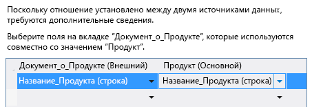
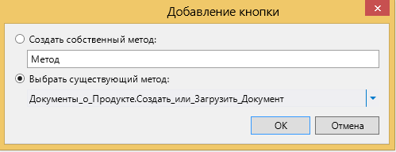

# Сопоставление библиотеки документов с объектомAssociate a document library with an entity
Используя библиотеки документов в SharePoint, можно создавать и загружать документы, связанные с определенными элементами списка или объекта. Например, в библиотеке можно хранить литературу по продажам и руководства по использованию для каждого продукта в списке. В облачной бизнес-надстройке библиотеку документов можно связать с объектом, создав отношение.By using the document library feature in SharePoint, you can create or upload documents associated with individual items in a list or entity. For example, you might use a document library to store sales literature and product manuals for each product in a list. In a Cloud Business Add-in, you can associate a document library with an entity by creating a relationship.
 

 **Примечание.** В настоящее время идет процесс замены названия "приложения для SharePoint" названием "надстройки SharePoint". Во время этого процесса в документации и пользовательском интерфейсе некоторых продуктов SharePoint и средств Visual Studio может по-прежнему использоваться термин "приложения для SharePoint". Дополнительные сведения см. в статье [Новое название приложений для Office и SharePoint](new-name-for-apps-for-sharepoint.md#bk_newname).**Note**  The name "apps for SharePoint" is changing to "SharePoint Add-ins". During the transition, the documentation and the UI of some SharePoint products and Visual Studio tools might still use the term "apps for SharePoint". For details, see  [New name for apps for Office and SharePoint](new-name-for-apps-for-sharepoint.md#bk_newname).
 

## Сопоставление библиотеки документовAssociating a Document Library

Процесс привязки библиотеки документов с объектом состоит из трех этапов:The process of associating a document library with an entity involves three steps:
 

 

1. Добавьте библиотеку документов SharePoint в свой проект в качестве источника данных.Add a SharePoint document library to your project as a data source.
    
     **Важно!** Сначала вам потребуется создать библиотеку документов на своем сайте SharePoint. Она должна содержать настраиваемый столбец, сопоставленный с уникальным полем в объекте.**Important**  You must first create a document library on your SharePoint site. It must contain a custom column that maps to a unique field in your entity.
2. Создание отношения между библиотекой документов и объектом.Create a relationship between the document library and an entity.
    
 
3. Добавить библиотеку документов на экран. Процесс зависит от того, создается ли новый экран или добавляется ли библиотека документов на существующий экран.Add the document library to a screen. The process differs depending on whether you're creating a new screen or adding it to an existing screen.
    
 

### Добавление библиотеки документовTo add a document library

1. В **обозревателе решений** откройте контекстное меню узла **Источники данных** и выберите пункт **Добавить источник данных**.In  **Solution Explorer**, open the shortcut menu for the  **Data Sources** node and choose **Add Data Source**.
    
 
2. В **мастере подключения к источнику данных** щелкните значок **SharePoint** и нажмите кнопку **Далее**.In the  **Attach Data Source Wizard**, choose the  **SharePoint** icon, and then choose the **Next** button.
    
 
3. На странице **Ввод сведений для подключения** в текстовом поле **Укажите адрес сайта SharePoint** введите URL-адрес сайта разработчика SharePoint и нажмите кнопку **Далее**.On the  **Enter Connection Information** page, in the **Specify the SharePoint site address** text box, enter the URL for your SharePoint developer site, and then choose the **Next** button.
    
 
4. На странице **Выбор элементов SharePoint** в левой области выберите элемент списка **Библиотеки документов**, а в правой области установите флажок для библиотеки документов, как показано на рис. 1.On the  **Choose your SharePoint Items** page, in the left pane, choose the **Document Libraries** list item, and in the right pane, select the checkbox for your document library as shown in Figure 1.
    
    **Рис. 1. Выбор библиотеки документов****Figure 1. Selecting the document library**

 

  
 

    На рис. 2 показана библиотека документов на сайте SharePoint.Figure 2 shows the document library on the SharePoint site.
    

    **Рис. 2. Обратите внимание на настраиваемый столбец ProductName (Название продукта)****Figure 2. Note the custom ProductName column**

 

  
 

    
     **Важно!** Библиотека документов должна уже существовать и содержать настраиваемый столбец, сопоставленный с уникальным полем в вашем объекте.**Important**  The document library must already exist and must contain a custom column that maps to a unique field in your entity.
5. Введите имя в поле **Укажите имя источника данных** и нажмите кнопку **Готово**.In the  **Specify the name of the data source**, enter a name, and then choose the  **Finish** button.
    
 

### Создание отношенияTo create a relationship

1. В **обозревателе решений** откройте объект библиотеки документов и на панели **Перспектива** откройте вкладку **Сервер**.In  **Solution Explorer**, open the document library entity, and then on the  **Perspective** bar, choose the **Server** tab.
    
 
2. На панели инструментов щелкните **Отношение**.On the toolbar, choose  **Relationship**.
    
 
3. В диалоговом окне **Добавление нового отношения** в раскрывающемся списке **К:** выберите объект, с которым нужно создать отношение, как показано на рис. 3.In the  **Add New Relationship** dialog box, in the **To** dropdown list, choose the entity that you want to associate, as shown in Figure 3.
    
    **Рис. 3. Создание отношения****Figure 3. Creating a relationship.**

 

  
 

 

 
4. В раскрывающемся списке **Внешний ключ** выберите настраиваемый столбец в библиотеке документов.In the  **Foreign** key dropdown list, choose the custom column from your document library.
    
 
5. В раскрывающемся списке **Первичный ключ** выберите поле объекта, которое необходимо сопоставить с настраиваемым столбцом в библиотеке документов, а затем нажмите кнопку **ОК**. Например, для настраиваемого столбца ProductName (Название продукта) выберите поле ProductName (Название продукта), как показано на рис. 4.In the  **Primary** key dropdown list, choose the field from your entity that maps to the custom column in the document library, and then choose the **OK** button. For example, for a ProductName custom column, choose the ProductName field, as shown in Figure 4.
    
    **Рис. 4. Связанные внешний и первичный ключи****Figure 4. Related foreign and primary keys**

 

  
 

    
     **Примечание.** Поле должно иметь такой же тип данных, что и поле **Внешний ключ**.**Note**  The field must be of the same data type as the  **Foreign** key field.

### Добавление библиотеки документов на новый набор экрановTo add a document library to a new screen set

1. В **обозревателе решений** откройте объект, сопоставленный с библиотекой документов, и на панели **Перспектива** откройте вкладку **HTMLClient**.In  **Solution Explorer**, open the entity that is associated with a document library, and then on the  **Perspective** bar, choose the **HTMLClient** tab.
    
 
2. На панели инструментов щелкните **Экран**.On the toolbar, choose  **Screen**.
    
 
3. В диалоговом окне **Добавление экрана** в текстовом поле **Имя набора экранов** введите имя набора экранов.In the  **Add New Screen** dialog box, in the **Screen Set Name** text box, enter a name for the screen set.
    
 
4. В списке **Данные экрана** выберите ваш объект.In the  **Screen Data** list, choose your entity.
    
 
5. В списке **Включить дополнительные данные** установите флажок для вашей библиотеки документов и нажмите кнопку **ОК**.In the  **Additional Data to Include** list, select the checkbox for your document library, and then choose the **OK** button.
    
    На рис. 5 показан набор экранов для объекта Product (Продукт).Figure 5 shows a screen set for a Product entity.
    

    **Рис. 5. Набор экранов Product (Продукт)****Figure 5. Products screen set**

 

  
 

    Экран **просмотра**, созданный для объекта, содержит вкладку **Documents** (Документы) и кнопку **Add Document** (Добавить документ). При ее нажатии отображается всплывающее окно для добавления или отправки документов.The  **View** screen that is created for the entity contains a **Documents** tab with an **Add Document** button. The button displays a Popup for adding or uploading documents.
    
 

### Добавление библиотеки документов на существующий экранTo add a document library to an existing screen

1. В **обозревателе решений** откройте контекстное меню для экрана, который вы хотите сопоставить с библиотекой документов, и нажмите кнопку **Открыть**.In  **Solution Explorer**, open the shortcut menu for the screen that you want to associate with a document library and choose  **Open**.
    
 
2. В конструкторе экрана выберите узел **Вкладки**, как показано на рис. 6, а затем узел **Добавить вкладку**.In the screen designer, choose the  **Tabs** node as shown in Figure 6, and then choose the **Add Tab** node.
    
    **Рис. 6. Узел "Вкладки"****Figure 6. The Tabs node**

 

  
 

 

 
3. В окне **Свойства** выберите свойство **Отображаемое имя** и введите понятное имя для добавленной вкладки. Например, Documents (Документы).In the  **Properties** window, choose the **Display Name** property and enter a meaningful name for the newly added tab. For example,Documents.
    
 
4. В левой области конструктора экрана щелкните ссылку **Add** _DocumentLibraryName_ (Добавить имя библиотеки документов), как показано на рис. 7, где _DocumentLibraryName_ — имя вашей библиотеки документов.In the left pane of the screen designer, choose the  **Add** _DocumentLibraryName_ link as shown in Figure 7, where _DocumentLibraryName_ is the name of your document library.
    
    **Рис. 7. Ссылка Add ProductDocuments (Добавить документы, связанные с продуктом)****Figure 7. The Add ProductDocuments link**

 

  
 

 

 
5. В центральной области выберите узел новой вкладки, раскройте список **Добавить** и выберите _DocumentLibraryName_ (Имя библиотеки документов).In the center pane, choose the node for the new tab, expand the  **Add** list, and then choose _DocumentLibraryName_.
    
 
6. Разверните узел **Панель команд** для новой вкладки, как показано на рис. 8, и нажмите кнопку **Добавить**.Expand the  **Command Bar** node for the new tab as shown in Figure 8 and choose **Add**.
    
    **Рис. 8. Узел "Панель команд"****Figure 8. The Command Bar node**

 

  
 

 

 
7. В диалоговом окне **Добавление кнопки** примите настройки, используемые по умолчанию, и нажмите кнопку **ОК**.In the  **Add Button** dialog box, accept the default choices and choose the **OK** button.
    
    На рис. 9 показано диалоговое окно **Добавление кнопки** с методом **createOrUploadDocument**, используемым по умолчанию.Figure 9 shows the  **Add Button** dialog box with the default method, **createOrUploadDocument**.
    

    **Рис. 9. Диалоговое окно "Добавление кнопки"****Figure 9. The Add Button dialog box**

 

  
 

 

 
8. В окне **Свойства** выберите свойство **Отображаемое имя** и введите понятное имя кнопки, например Add Document (Добавить документ).In the  **Properties** window, choose the **Display Name** property and enter a meaningful name for the button. For example,Add Document.
    
    Теперь на экране есть вкладка **Documents** (Документы) с кнопкой на панели команд. При нажатии кнопки отображается всплывающее окно для добавления или отправки документов.The screen now contains a  **Documents** tab with a button on the command bar. The button displays a Popup for adding or uploading documents.
    
 

## Дополнительные ресурсыAdditional resources

-  [Разработка облачных бизнес-надстроекDevelop cloud business add-ins](develop-cloud-business-add-ins.md)
    
 
-  [Диспетчер инцидентов: руководство по созданию облачной бизнес-надстройкиIncident manager: A cloud business add-in tutorial](incident-manager-a-cloud-business-add-in-tutorial.md)
    
 

