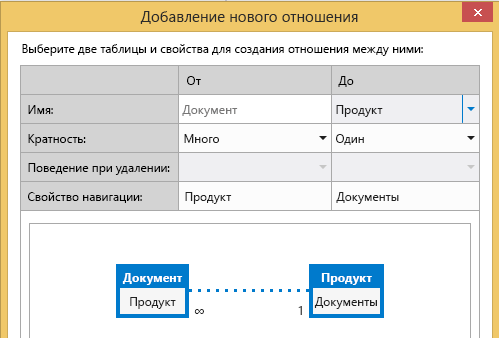
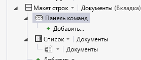

# Сопоставление библиотеки документов с объектом
Используя библиотеки документов в SharePoint, можно создавать и загружать документы, связанные с определенными элементами списка или объекта. Например, в библиотеке можно хранить литературу по продажам и руководства по использованию для каждого продукта в списке. В облачной бизнес-надстройке библиотеку документов можно связать с объектом, создав отношение.
 

 **Примечание.** В настоящее время идет процесс замены названия "приложения для SharePoint" названием "надстройки SharePoint". Во время этого процесса в документации и пользовательском интерфейсе некоторых продуктов SharePoint и средств Visual Studio может по-прежнему использоваться термин "приложения для SharePoint". Дополнительные сведения см. в статье [Новое название приложений для Office и SharePoint](new-name-for-apps-for-sharepoint.md#bk_newname).
 

## Сопоставление библиотеки документов

Процесс привязки библиотеки документов с объектом состоит из трех этапов:
 

 

1. Добавьте библиотеку документов SharePoint в свой проект в качестве источника данных.
    
     **Важно!** Сначала вам потребуется создать библиотеку документов на своем сайте SharePoint. Она должна содержать настраиваемый столбец, сопоставленный с уникальным полем в объекте.
2. Создание отношения между библиотекой документов и объектом.
    
 
3. Добавить библиотеку документов на экран. Процесс зависит от того, создается ли новый экран или добавляется ли библиотека документов на существующий экран.
    
 

### Добавление библиотеки документов

1. В **обозревателе решений** откройте контекстное меню узла **Источники данных** и выберите пункт **Добавить источник данных**.
    
 
2. В **мастере подключения к источнику данных** щелкните значок **SharePoint** и нажмите кнопку **Далее**.
    
 
3. На странице **Ввод сведений для подключения** в текстовом поле **Укажите адрес сайта SharePoint** введите URL-адрес сайта разработчика SharePoint и нажмите кнопку **Далее**.
    
 
4. На странице **Выбор элементов SharePoint** в левой области выберите элемент списка **Библиотеки документов**, а в правой области установите флажок для библиотеки документов, как показано на рис. 1.
    
    **Рис. 1. Выбор библиотеки документов**

 

  
 

    На рис. 2 показана библиотека документов на сайте SharePoint.
    

    **Рис. 2. Обратите внимание на настраиваемый столбец ProductName (Название продукта)**

 

  
 

    
     **Важно!** Библиотека документов должна уже существовать и содержать настраиваемый столбец, сопоставленный с уникальным полем в вашем объекте.
5. Введите имя в поле **Укажите имя источника данных** и нажмите кнопку **Готово**.
    
 

### Создание отношения

1. В **обозревателе решений** откройте объект библиотеки документов и на панели **Перспектива** откройте вкладку **Сервер**.
    
 
2. На панели инструментов щелкните **Отношение**.
    
 
3. В диалоговом окне **Добавление нового отношения** в раскрывающемся списке **К:** выберите объект, с которым нужно создать отношение, как показано на рис. 3.
    
    **Рис. 3. Создание отношения**

 

  
 

 

 
4. В раскрывающемся списке **Внешний ключ** выберите настраиваемый столбец в библиотеке документов.
    
 
5. В раскрывающемся списке **Первичный ключ** выберите поле объекта, которое необходимо сопоставить с настраиваемым столбцом в библиотеке документов, а затем нажмите кнопку **ОК**. Например, для настраиваемого столбца ProductName (Название продукта) выберите поле ProductName (Название продукта), как показано на рис. 4.
    
    **Рис. 4. Связанные внешний и первичный ключи**

 

  
 

    
     **Примечание.** Поле должно иметь такой же тип данных, что и поле **Внешний ключ**.

### Добавление библиотеки документов на новый набор экранов

1. В **обозревателе решений** откройте объект, сопоставленный с библиотекой документов, и на панели **Перспектива** откройте вкладку **HTMLClient**.
    
 
2. На панели инструментов щелкните **Экран**.
    
 
3. В диалоговом окне **Добавление экрана** в текстовом поле **Имя набора экранов** введите имя набора экранов.
    
 
4. В списке **Данные экрана** выберите ваш объект.
    
 
5. В списке **Включить дополнительные данные** установите флажок для вашей библиотеки документов и нажмите кнопку **ОК**.
    
    На рис. 5 показан набор экранов для объекта Product (Продукт).
    

    **Рис. 5. Набор экранов Product (Продукт)**

 

  
 

    Экран **просмотра**, созданный для объекта, содержит вкладку **Documents** (Документы) и кнопку **Add Document** (Добавить документ). При ее нажатии отображается всплывающее окно для добавления или отправки документов.
    
 

### Добавление библиотеки документов на существующий экран

1. В **обозревателе решений** откройте контекстное меню для экрана, который вы хотите сопоставить с библиотекой документов, и нажмите кнопку **Открыть**.
    
 
2. В конструкторе экрана выберите узел **Вкладки**, как показано на рис. 6, а затем узел **Добавить вкладку**.
    
    **Рис. 6. Узел "Вкладки"**

 

  
 

 

 
3. В окне **Свойства** выберите свойство **Отображаемое имя** и введите понятное имя для добавленной вкладки. Например, Documents (Документы).
    
 
4. В левой области конструктора экрана щелкните ссылку **Add** _DocumentLibraryName_ (Добавить имя библиотеки документов), как показано на рис. 7, где _DocumentLibraryName_ — имя вашей библиотеки документов.
    
    **Рис. 7. Ссылка Add ProductDocuments (Добавить документы, связанные с продуктом)**

 

  
 

 

 
5. В центральной области выберите узел новой вкладки, раскройте список **Добавить** и выберите _DocumentLibraryName_ (Имя библиотеки документов).
    
 
6. Разверните узел **Панель команд** для новой вкладки, как показано на рис. 8, и нажмите кнопку **Добавить**.
    
    **Рис. 8. Узел "Панель команд"**

 

  
 

 

 
7. В диалоговом окне **Добавление кнопки** примите настройки, используемые по умолчанию, и нажмите кнопку **ОК**.
    
    На рис. 9 показано диалоговое окно **Добавление кнопки** с методом **createOrUploadDocument**, используемым по умолчанию.
    

    **Рис. 9. Диалоговое окно "Добавление кнопки"**

 

  
 

 

 
8. В окне **Свойства** выберите свойство **Отображаемое имя** и введите понятное имя кнопки, например Add Document (Добавить документ).
    
    Теперь на экране есть вкладка **Documents** (Документы) с кнопкой на панели команд. При нажатии кнопки отображается всплывающее окно для добавления или отправки документов.
    
 

## Дополнительные ресурсы

-  [Разработка облачных бизнес-надстроек](develop-cloud-business-add-ins.md)
    
 
-  [Диспетчер инцидентов: руководство по созданию облачной бизнес-надстройки](incident-manager-a-cloud-business-add-in-tutorial.md)
    
 

