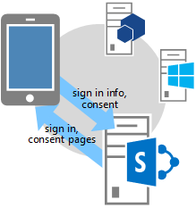
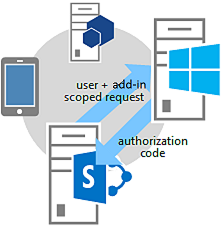

# <a name="authorization-code-oauth-flow-for-sharepoint-add-ins"></a>Поток кода авторизации OAuth для надстроек SharePoint
Сведения о потоке авторизации OAuth для надстроек, запрашивающих разрешение на доступ к ресурсам SharePoint во время работы, а также об использовании страницы OAuthAuthorize.aspx и URI перенаправления SharePoint.
 

 **Примечание.** В настоящее время идет процесс замены названия "приложения для SharePoint" названием "надстройки SharePoint". Во время этого процесса в документации и пользовательском интерфейсе некоторых продуктов SharePoint и средств Visual Studio может по-прежнему использоваться термин "приложения для SharePoint". Дополнительные сведения см. в статье [Новое название приложений для Office и SharePoint](new-name-for-apps-for-sharepoint#bk_newname).
 


## <a name="get-an-overview-of-add-ins-that-request-access-permission-from-sharepoint-on-the-fly"></a>Общие сведения о надстройках, запрашивающих разрешение на доступ из SharePoint во время выполнения
<a name="Overview"> </a>


 **Примечание.** В этой статье предполагается, что вы ознакомились со статьей [Создание надстроек SharePoint, использующих авторизацию с низким уровнем доверия](creating-sharepoint-add-ins-that-use-low-trust-authorization) и основными понятиями и принципами протокола OAuth. Дополнительные сведения об OAuth см. на сайте [OAuth.net](http://oauth.net/) и в описании [протокол авторизации в Интернете (oauth)](http://datatracker.ietf.org/doc/active/#oauth).
 

В некоторых случаях надстройка может запрашивать разрешение на доступ к ресурсам SharePoint во время выполнения (т. е. **надстройка может запрашивать разрешение на доступ к ресурсам SharePoint динамически во время выполнения**, а не установки). Такие надстройки не обязательно должны запускаться из среды SharePoint или даже быть установленными в ней. Например, это может быть собственная надстройка устройства, надстройка, запускаемая на любом веб-сайте, или надстройка Office, запускаемая из приложения Office, которому требуется доступ к ресурсам SharePoint во время выполнения.
 

 

 **Примечание.** Надстройки этого типа могут запускать только пользователи с разрешениями "Управление" для всех ресурсов, к которым надстройка запрашивает доступ. Например, если надстройка запрашивает только разрешение на чтение веб-сайта, то пользователь, у которого есть права на чтение, но нет прав на управление для этого веб-сайта, не сможет запустить надстройку.
 

Чтобы вызывать SharePoint, такие **надстройки сначала нужно зарегистрировать** с помощью Панели мониторинга продаж или на странице appregnew.aspx. Дополнительные сведения о регистрации надстроек с помощью Панели мониторинга продаж и на странице appregnew.aspx см. в статье [Регистрация надстроек SharePoint 2013](register-sharepoint-add-ins-2013).
 

 
После регистрации надстройка станет  *субъектом безопасности*  и получит удостоверение, как и в случае с пользователями и группами. Такое удостоверение называетсясубъектом надстройки. Как и пользователи и группы, субъект надстройки имеет определенные разрешения. Подробнее о субъектах надстроек см. в статье  [Регистрация надстроек для SharePoint](register-sharepoint-add-ins-2013).
 

 
После регистрации надстройки вы получите идентификатор и секрет клиента, домен надстройки и URI перенаправления для субъекта надстройки. Эти сведения регистрируются на сервере авторизации Служба контроля доступа Microsoft Azure (ACS).
 

 

## <a name="understand-the-oauth-flow-for-add-ins-that-request-permissions-on-the-fly"></a>Общие сведения о потоке OAuth для надстроек, запрашивающих разрешения во время выполнения
<a name="Flow"> </a>

В этом разделе приведена сводная информация о потоке проверки подлинности и авторизации OAuth для надстройки SharePoint, запрашивающей разрешения во время выполнения. Такой поток называется **потоком кода проверки подлинности**. Здесь объясняется, как надстройка, запущенная вне SharePoint, может обращаться к ресурсам в SharePoint.
 

 

 **Примечание.** Поток ** представляет собой серию операций взаимодействия между надстройкой, SharePoint, сервером авторизации (сервером управления доступом) и пользователем** во время выполнения. Таким образом, для взаимодействия с ACS потоку требуется SharePoint Online или ферма SharePoint, подключенная к Интернету. Фермы SharePoint, не подключенные к Интернету, должны использовать [систему авторизации с высоким уровнем доверия](creating-sharepoint-add-ins-that-use-high-trust-authorization).
 

Требуется веб-приложение или служба, размещаемая отдельно от SharePoint. Даже надстройке для устройства требуется URL-адрес веб-приложения или службы, который можно зарегистрировать в службе контроля доступа (см. выше), даже если веб-компонент ни для чего больше не используется. Для простоты в этой статье в качестве примера надстройки рассмотрим веб-приложение Contoso.com. В нем используется клиентская объектная модель (CSOM) SharePoint или SharePoint REST API для вызовов SharePoint. Когда приложение впервые пытается получить доступ к SharePoint, SharePoint запрашивает код авторизации у службы контроля доступа, который она может отправить приложению Contoso.com. Затем приложение использует код авторизации для запроса маркера доступа из службы контроля доступа. Получив маркер доступа, приложение Contoso.com включает его во все свои запросы к SharePoint.
 

 

### <a name="see-a-detailed-example-of-the-flow"></a>Подробный пример потока
<a name="Fly"> </a>

Предположим, что компания Contoso предоставляет веб-службу фотопечати. Пользователь хочет распечатать фотографии. Для этого ему необходимо предоставить службе Contoso разрешение на доступ и печать фотографий из библиотек на сайте SharePoint Online,  `fabrikam.sharepoint.com`.
 

 

 

 
Надстройка фотопечати зарегистрировано, поэтому у него уже есть идентификатор и секрет клиента, а также URI перенаправления. URI перенаправления, предоставленный Contoso при регистрации надстройки:  `https://contoso.com/RedirectAccept.aspx`. Сведения об идентификаторе и секрете клиента сохраняются в файле web.config надстройки фотопечати. Вот пример записи идентификатора и секрета клиента в файл web.config.
 

 


```XML
<configuration>
  <appSettings>
    <add key="ClientId" value="c78d058c-7f82-44ca-a077-fba855e14d38 "/>
    <add key="ClientSecret" value="SbALAKghPXTjbBiLQZP+GnbmN+vrgeCMMvptbgk7T6w= "/>

  </appSettings>

</configuration>
```

Ниже перечислены этапы потока кода авторизации.
 

 

    
 **Совет.** Эти действия ссылаются на методы в файле TokenHelper (с расширением CS или VB). Этот управляемый код не компилируется, поэтому для него нет справочных статей. Однако сам файл подробно прокомментирован с описанием каждого класса, параметра и возвращаемого значения. Вы можете открыть его копию, чтобы сверяться с ней по мере чтения данного руководства.
 


|**Этап**||**Описание**|
|:-----|:-----|:-----|
|**1**||**Клиент открывает приложение и направляет его на сайт SharePoint для получения данных.** Пользователь переходит на веб-сайт фотопечати компании Contoso, где пользовательский интерфейс показывает, что пользователь может печатать фотографии, хранящиеся на любом сайте SharePoint Online. В этом примере используется URL-адрес `https://contoso.com/print/home.aspx`. Надстройка для фотопечати предлагает пользователю указать URL-адрес коллекции фотографий. Пользователь указывает URL-адрес, указывающий на сайт SharePoint Online: `https://fabrikam.sharepoint.com/`.|
|**2**||**Надстройка выполняет перенаправление на URL-адрес авторизации для сайта SharePoint.** Когда пользователь нажимает кнопку для получения фотографий, надстройка фотопечати Contoso направляет браузер по адресу `https://fabrikam.sharepoint.com/`. При этом возвращается отклик перенаправления HTTP 302. Если вы используете Microsoft .NET, то **Response.Redirect** — это не единственный способ выполнить перенаправление из кода. С помощью файла TokenHelper (с расширением CS или VB) проекта код может вызвать перегруженный метод **GetAuthorizationUrl** (используя перегрузку с тремя аргументами). Этот метод автоматически составляет URL-адрес перенаправления на страницу OAuthAuthorize.aspx. Кроме того, URL-адрес можно составлять вручную. Например, если вызвать метод **GetAuthorizationUrl** для составления URL-адреса перенаправления на страницу OAuthAuthorize.aspx в файле TokenHelper (с расширением CS или VB) проекта, то код будет выглядеть так: `Response.Redirect(TokenHelper.GetAuthorizationUrl(` `sharePointSiteUrl.ToString(),` `"Web.Read List.Write",` `"https://contoso.com/RedirectAccept.aspx"));` Изучив перегрузку метода **GetAuthorizationUrl** в файле TokenHelper (с расширением CS или VB) с тремя параметрами, вы увидите, что второй параметр — это параметр области разрешений, представляющий собой разделенный пробелами список запрашиваемых надстройкой разрешений в сокращенном формате. Дополнительные сведения об областях разрешений см. в разделе [Общие сведения о псевдонимах областей разрешений и использовании страницы OAuthAuthorize.aspx](#Scope). В качестве третьего параметра необходимо указать тот же URI перенаправления, что и при регистрации надстройки. Дополнительные сведения о регистрации см. в статье [Регистрация надстроек SharePoint 2013](register-sharepoint-add-ins-2013). Вы также увидите, что возвращаемая строка представляет собой URL-адрес, включающий параметры строки запроса. При желании вы можете вручную составить URL-адрес перенаправления на страницу OAuthAuthorize.aspx. Например, в данном случае надстройка фотопечати Contoso направляет пользователя на следующий URL-адрес: `https://fabrikam.sharepoint.com/_layouts/15/OAuthAuthorize.aspx?client_id=client_GUID&amp;scope=app_permissions_list&amp;response_type=code&amp;redirect_uri=redirect_uri` Как видно из примеров, надстройка фотопечати Contoso отправляет код клиента OAuth и URI перенаправления на сайт Fabrikam в виде параметров строки запроса. Ниже представлен пример запроса GET со значениями строки запроса. Разрывы строк добавлены для наглядности. Фактический URL-адрес представляет собой одну строку. `GET /authcode HTTP/1.1` `Host: fabrikam.sharepoint.com` `/oauthauthorize.aspx` `?client_id= c78d058c-7f82-44ca-a077-fba855e14d38` `&amp;scope=list.read` `&amp;response_type=code` `&amp;redirect_uri= https%3A%2F%2Fcontoso%2Ecom%2Fredirectaccept.aspx` Чтобы создать отдельное всплывающее диалоговое окно согласия, вы можете добавить к URL-адресу параметр запроса **IsDlg=1**, как показано здесь: `/oauthauthorize.aspx?IsDlg=1&amp;client_id= c78d058c-7f82-44ca-a077-fba855e14d38&amp;scope=list.read&amp;response_type=code&amp;redirect_uri= https%3A%2F%2Fcontoso%2Ecom%2Fredirectaccept.aspx`|
|**3**||**В SharePoint отображается страница согласия, чтобы пользователь мог предоставить надстройке разрешения.** Если пользователь еще не вошел на сайт SharePoint Online компании Fabrikam, ему будет предложено войти. Когда пользователь выполнит вход, в SharePoint появится HTML-страница согласия. На этой странице пользователю предлагается предоставить надстройке фотопечати Contoso запрашиваемые разрешения (или отказать в их предоставлении). В этом случае пользователь предоставляет надстройке разрешение на чтение библиотеки фотографий пользователя на сайте Fabrikam.|
|**4**||**SharePoint запрашивает временный код авторизации из ACS.** Сайт SharePoint Online компании Fabrikam отправляет в ACS запрос на создание кода авторизации с коротким сроком действия (примерно 5 минут), уникального для этого сочетания пользователя и надстройки. ACS отправляет код авторизации на сайт Fabrikam.|
|**5**||**Сайт SharePoint Online выполняет перенаправление на зарегистрированный URI перенаправления, передавая код авторизации надстройке.**Сайт Fabrikam SharePoint Online перенаправляет браузер обратно в Contoso с помощью отклика HTTP 302. В соответствующем URL-адресе используется URI перенаправления, указанный при регистрации надстройки фотопечати, а также строка запроса кода авторизации. Структура URL-адреса перенаправления выглядит так: `https://contoso.com/RedirectAccept.aspx?code=<authcode>`|
|**6**||**С помощью кода авторизации надстройка запрашивает маркер доступа с сервера управления доступом, который проверяет запрос, аннулирует код авторизации, а затем отправляет маркер доступа и обновления надстройке.** Contoso получает код авторизации из параметра запроса, а затем включает его (вместе с идентификатором и секретом клиента) в запрос маркера доступа из ACS. Если вы используете управляемый код и SharePoint CSOM, файл TokenHelper (с расширением CS или VB), то запрос к ACS отправляется с помощью метода **GetClientContextWithAuthorizationCode**. В этом случае код выглядит примерно так (где `authCode` — это переменная, которой присвоен код авторизации): `TokenHelper.GetClientContextWithAuthorizationCode(` `"https://fabrikam.sharepoint.com/",` `"00000003-0000-0ff1-ce00-000000000000",` `authCode,` `"1ee82b34-7c1b-471b-b27e-ff272accd564",` `new Uri(Request.Url.GetLeftPart(UriPartial.Path)));` В файле TokenHelper (с расширением CS или VB) второй параметр метода **GetClientContextWithAuthorizationCode** — это `targetPrincipalName`. Это значение всегда равно `00000003-0000-0ff1-ce00-000000000000` в надстройке, получающей доступ к SharePoint. Отследив иерархию вызовов из метода **GetClientContextWithAuthorizationCode**, вы увидите, что он также получает код и секрет клиента из файла web.config. ACS получает запрос от Contoso и проверяет идентификатор клиента, секрет клиента, URI перенаправления и код авторизации. Если все они действительны, ACS аннулирует код авторизации (его можно использовать только один раз) и создает маркеры обновления и доступа, а затем возвращает их надстройке Contoso. Приложение Contoso может кэшировать этот маркер доступа для повторного использования в последующих запросах. По умолчанию срок действия маркеров доступа составляет примерно 12 часов. Каждый маркер доступа связан с учетной записью пользователя, указанной в первоначальном запросе на авторизацию, и предоставляет доступ только к тем службам, которые указаны в этом запросе. Надстройка должна надежно сохранить маркер доступа. Приложение Contoso также может кэшировать маркер обновления. По умолчанию срок действия маркеров обновления составляет 6 месяцев. Маркер обновления можно обменять на новый маркер доступа из ACS по истечении срока действия маркера доступа. Дополнительные сведения о маркерах см. в статье [Обработка маркеров безопасности в надстройках SharePoint с низким уровнем доверия, размещенных у поставщика](handle-security-tokens-in-provider-hosted-low-trust-sharepoint-add-ins).|
|**7**||**Теперь надстройка может использовать маркер доступа, чтобы запрашивать с сайта SharePoint данные, которые можно показать пользователю.** Надстройка Contoso включает маркер доступа для отправки вызова REST API или запроса CSOM в SharePoint, передавая маркер доступа OAuth в заголовке HTTP **Authorization**. SharePoint возвращает сведения, запрашиваемые надстройкой Contoso. Дополнительные сведения о том, как отправляется этот запрос, см. в статье [Обработка маркеров безопасности в надстройках SharePoint с низким уровнем доверия, размещенных у поставщика](handle-security-tokens-in-provider-hosted-low-trust-sharepoint-add-ins).|

## <a name="understand-permission-scope-aliases-and-the-use-of-the-oauthauthorizeaspx-page"></a>Общие сведения о псевдонимах областей разрешений и использовании страницы OAuthAuthorize.aspx
<a name="Scope"> </a>

В этом разделе предполагается, что вы ознакомились со статьей  [Разрешения для надстроек в SharePoint](add-in-permissions-in-sharepoint-2013). В таблице 1 показаны URI областей запросов разрешений надстроек, описанные в этой статье, а также дополнительный столбец ( **Псевдоним области** ). Право FullControl недоступно в столбце **Доступные права**, так как надстройка, запрашивающая разрешение на доступ к ресурсам SharePoint во время выполнения, не может запросить право на полный доступ.
 

 
Значения в столбце **Псевдоним области** — это сокращенные версии значений из столбца **URI области**. Эти псевдонимы могут использовать только надстройки, запрашивающие разрешение на доступ к ресурсам SharePoint во время выполнения. (Значения URI области используются в манифестах надстроек, которые запускаются из SharePoint. Эти надстройки запрашивают доступ при установке.)
 

 
Псевдонимы областей используются только в контексте использования страницы перенаправления OAuthAuthorize.aspx. Как показано на этапе 2 потока OAuth в предыдущем разделе, если надстройка использует управляемый код, псевдонимы применяются при вызове метода **GetAuthorizationUrl** из файла TokenHelper (с расширением CS или VB) в проекте. Вот еще один пример:
 

 


```C#
Response.Redirect(TokenHelper.GetAuthorizationUrl(
    sharePointSiteUrl.ToString(), 
    "Web.Read List.Write ", 
    "https://contoso.com/RedirectAccept.aspx "));
```

Значение параметра  _scope_,  `Web.Read List.Write` это пример запроса разрешений по псевдониму области. Параметр _scope_ это набор запросов областей разрешений и прав с разделителями-пробелами.
 

 
Если вы не используете управляемый код, в поле области URL-адреса перенаправления используются псевдонимы областей. Пример:
 

 
 `https://fabrikam.sharepoint.com/_layout/15/OAuthAuthorize.aspx?client_id=c78d058c-7f82-44ca-a077-fba855e14d38&amp;scope=list.write&amp;response_type=code&amp;redirect_uri=https%3A%2F%2Fcontoso%2Ecom%2Fredirectaccept.aspx`
 

 

 **Примечание.** Описание областей см. в статье [Разрешения для надстроек в SharePoint](add-in-permissions-in-sharepoint-2013).
 


**Таблица 1. URI областей разрешений для надстроек SharePoint и соответствующие псевдонимы**

|**URI области**|**Псевдоним области**|**Доступные права**|
|:-----|:-----|:-----|
|http://sharepoint/content/sitecollection|Сайт|Чтение, запись, управление|
|http://sharepoint/content/sitecollection/web|Веб|Чтение, запись, управление|
|http://sharepoint/content/sitecollection/web/list|Перечисление|Чтение, запись, управление|
|http://sharepoint/content/tenant|AllSites|Чтение, запись, управление|
|http://sharepoint/bcs/connection|Нет (сейчас не поддерживается)|Чтение|
|http://sharepoint/search|Поиск|QueryAsUserIgnoreAppPrincipal|
|http://sharepoint/projectserver|ProjectAdmin |Управление|
|http://sharepoint/projectserver/projects|Проекты|Чтение, запись|
|http://sharepoint/projectserver/projects/project|Project |Чтение, запись|
|http://sharepoint/projectserver/enterpriseresources|ProjectResources|Чтение, запись|
|http://sharepoint/projectserver/statusing|ProjectStatusing|SubmitStatus|
|http://sharepoint/projectserver/reporting|ProjectReporting|Чтение|
|http://sharepoint/projectserver/workflow|ProjectWorkflow|Повышение прав|
|http://sharepoint/social/tenant|AllProfiles|Чтение, запись, управление|
|http://sharepoint/social/core|Сообщество|Чтение, запись, управление|
|http://sharepoint/social/microfeed|Microfeed|Чтение, запись, управление|
|http://sharepoint/taxonomy|TermStore|Чтение, запись|

## <a name="learn-how-to-use-a-redirect-uri-and-see-a-sample-redirect-page"></a>Сведения о том, как использовать URI-перенаправления, и пример таблицы перенаправления
<a name="RedirectURI"> </a>


 

 
**URI перенаправления**, используемый надстройками, которые запрашивают разрешения во время выполнения, — **это URI, на который SharePoint перенаправляет браузер после получения согласия** (с кодом авторизации, указанным в качестве параметра запроса). На этапе 2 представленного выше описания потока приводится пример, где URI жестко задан в вызове метода **GetAuthorizationUrl**. При необходимости надстройка ASP.NET также может сохранить URI перенаправления в файле web.config, как показано в следующем примере:
 

 


```XML
<configuration>
  <appSettings>
    <add key="RedirectUri" value="https://contoso.com/RedirectAccept.aspx" />
  </appSettings>
<configuration>
```

Это значение можно получить, вызвав метод `WebConfigurationManager.AppSettings.Get("RedirectUri")`.
 

 
**Конечная точка в URI перенаправления получает код авторизации из параметра запроса и получает с его помощью маркер доступа**, который затем можно использовать для доступа к SharePoint. Как правило, конечной точкой является та же страница либо тот же метод контроллера или веб-метод, которые изначально пытались получить доступ к SharePoint. Однако это может быть страница или метод, которые только получают маркер авторизации, а затем выполняют перенаправление к другой странице или другому методу. Специальная страница или метод могут передать маркер авторизации или кэшировать его (срок действия этого маркера составляет примерно 5 минут). Кроме того, они могут получить маркер доступа с помощью маркера авторизации и кэшировать его.
 

 
Ниже приведен пример кода такой страницы в приложении ASP.NET. Обратите внимание на указанные ниже особенности этого кода.
 

 

- В нем используется файл TokenHelper.cs, который создают Инструменты разработчика Office для Visual Studio.
    
 
- В коде предполагается, что существует параметр запроса "code", содержащий код авторизации. Это безопасно, так как страницу вызывает только SharePoint и только при передаче кода авторизации.
    
 
- В нем используется клиентский объект контекста CSOM для доступа к SharePoint, но можно также просто кэшировать этот объект на сервере и перейти на другую страницу.
    
 
- Метод **GetClientContextWithAuthorizationCode** получает код доступа с помощью кода авторизации. Затем он создает объект контекста клиента SharePoint и меняет обработчик объекта для события **ExecutingWebRequest** так, чтобы обработчик включал маркер доступа во всех запросах к SharePoint. По сути, маркер доступа кэшируется в объекте.
    
 
- Метод **GetClientContextWithAuthorizationCode** отправляет службе контроля доступа URL-адрес перенаправления в параметре `rUrl`, но ACS использует его для идентификации в случае кражи кода авторизации. ACS не использует его для повторного перенаправления, поэтому не создает бесконечный цикл, перенаправляя на самого себя.
    
 
- В коде не предусмотрена возможность работы с маркером доступа с истекшим сроком действия. После создания клиентского объекта контекста он продолжает использоваться тот же маркер доступа. Маркер обновления вообще не используется. Это правильная стратегия для надстроек, используемых только в сеансах, которые длятся менее времени существования маркера доступа.
    
 
Более сложный пример использования маркера обновления для получения нового маркера доступа см. в следующем разделе.
 

 


```C#
public partial class RedirectAccept : System.Web.UI.Page
{
    protected void Page_Load(object sender, EventArgs e)
    {
        string authCode = Request.QueryString["code"];
        Uri rUri = new Uri("https://contoso.com/RedirectAccept.aspx");

        using (ClientContext context = TokenHelper.GetClientContextWithAuthorizationCode(
            "https://fabrikam.sharepoint.com/", 
            "00000003-0000-0ff1-ce00-000000000000",
            authCode,
            "1ee82b34-7c1b-471b-b27e-ff272accd564".
            rUri))
       {
           context.Load(context.Web);
           context.ExecuteQuery();

           Response.Write("<p>" + context.Web.Title + "</p>");
       }
    }
}

```


## <a name="get-sample-code-behind-for-a-page-that-accesses-sharepoint"></a>Пример кода страницы, получающей доступ к SharePoint
<a name="Default"> </a>

Ниже показан код программной части страницы Default.aspx. Предполагается, что страница Default служит начальной страницей надстройки и является зарегистрированным URL-адресом перенаправления для надстройки. Обратите внимание на следующие особенности этого кода.
 

 

- Метод **Page_Load** сначала проверяет код авторизации в строке запроса. Он присутствует, если браузер был перенаправлен на страницу средой SharePoint. Если такой код есть, он используется для получения нового маркера обновления, который заносится в кэш, сохраняемый между сеансами.
    
 
- Затем метод проверяет наличие маркера обновления в кэше. 
    
      - Если такого маркера нет, метод получает его, передавая SharePoint требуемые разрешения (разрешение на запись в области веб-сайтов) и запрашивая код авторизации у SharePoint. Пользователю предлагается предоставить разрешение. Если пользователь его предоставит, SharePoint получит код авторизации от службы контроля доступа и отправит его как параметр запроса в перенаправлении на эту же страницу.
    
 
  - Если кэшированный маркер доступа есть, с его помощью метод получает маркер доступа напрямую от службы контроля доступа. Как и в примере в конце предыдущего раздела, маркер доступа используется для создания объекта контекста клиента SharePoint. При использовании кэшированного маркера обновления для получения маркера доступа напрямую от службы контроля доступа не требуется дополнительный сетевой вызов SharePoint при запуске сеанса, поэтому повторный запуск надстройки в течение срока действия маркера обновления будет выполняться быстрее.
    
 
- Как и в примере в конце предыдущего раздела, в этом коде не предусмотрена возможность работы с просроченным маркером доступа. После создания объекта контекста клиента он продолжает использовать тот же маркер доступа. Один из способов защиты от истечения срока действия маркера доступа — кэшировать маркер доступа вместе с маркером обновления. Затем необходимо изменить представленный ниже код таким образом, чтобы он вызывал метод **GetAccessToken** только при отсутствии действительного маркера доступа в кэше. Хотя хранить маркер обновления можно в кэше клиента (например, в файле cookie), из соображений безопасности маркер доступа следует хранить только в серверном кэше. Маркер обновления шифруется и может быть расшифрован только службой контроля доступа. При этом маркер доступа лишь кодируется (Base 64) и легко поддается раскодированию в ходе активного вмешательства в соединение.
    
 
- Ниже представлено определение класса **TokenCache**, на который ссылается этот код.
    
 

```C#
using System;
using System.Collections.Generic;
using System.Linq;
using System.Web;
using System.Web.UI;
using System.Web.UI.WebControls;
using Microsoft.SharePoint.Samples;
using Microsoft.SharePoint.Client;

namespace DynamicAppPermissionRequest
{
    public partial class Default : System.Web.UI.Page
    {
        protected void Page_Load(object sender, EventArgs e)
        {
            Uri sharePointSiteUrl = new Uri("https://fabrikam.sharpoint.com/print/");

            if (Request.QueryString["code"] != null)
            {
                TokenCache.UpdateCacheWithCode(Request, Response, sharePointSiteUrl);
            }

            if (!TokenCache.IsTokenInCache(Request.Cookies))
            {
                Response.Redirect(TokenHelper.GetAuthorizationUrl(sharePointSiteUrl.ToString(), 
                                                                  "Web.Write"));
            }
            else
            {
                string refreshToken = TokenCache.GetCachedRefreshToken(Request.Cookies);
                string accessToken = 
                TokenHelper.GetAccessToken(
                           refreshToken, 
                           "00000003-0000-0ff1-ce00-000000000000", 
                           sharePointSiteUrl.Authority, 
                           TokenHelper.GetRealmFromTargetUrl(sharePointSiteUrl)).AccessToken;

                using (ClientContext context = 
                       TokenHelper.GetClientContextWithAccessToken(sharePointSiteUrl.ToString(), 
                                                                   accessToken))
                {
                    context.Load(context.Web);
                    context.ExecuteQuery();

                    Response.Write("<p>" + context.Web.Title + "</p>");
                }
            }
        }
    }
}
```

Далее приведен пример кода для модуля кэширования маркеров, который вызывает предыдущий пример кода. В качестве кэша он использует файлы cookie. Существуют и другие варианты кэширования. Дополнительные сведения см. в статье  [Обработка маркеров безопасности в надстройках с низким уровнем доверия для SharePoint, размещаемых у поставщика](handle-security-tokens-in-provider-hosted-low-trust-sharepoint-add-ins).
 

 


```C#
using System;
using System.Collections.Generic;
using System.Linq;
using System.Web;
using Microsoft.SharePoint.Samples;

namespace DynamicAppPermissionRequest
{
    public static class TokenCache
    {
        private const string REFRESH_TOKEN_COOKIE_NAME = "RefreshToken";

        public static void UpdateCacheWithCode(HttpRequest request, 
                                               HttpResponse response, 
                                               Uri targetUri)
        {
            string refreshToken = 
                TokenHelper.GetAccessToken(
                    request.QueryString["code"], 
                    "00000003-0000-0ff1-ce00-000000000000", 
                    targetUri.Authority, 
                    TokenHelper.GetRealmFromTargetUrl(targetUri), 
                    new Uri(request.Url.GetLeftPart(UriPartial.Path)))
                   .RefreshToken;
            SetRefreshTokenCookie(response.Cookies, refreshToken);
            SetRefreshTokenCookie(request.Cookies, refreshToken);
        }

        internal static string GetCachedRefreshToken(HttpCookieCollection requestCookies)
        {
            return GetRefreshTokenFromCookie(requestCookies);
        }

        internal static bool IsTokenInCache(HttpCookieCollection requestCookies)
        {
            return requestCookies[REFRESH_TOKEN_COOKIE_NAME] != null;
        }

        private static string GetRefreshTokenFromCookie(HttpCookieCollection cookies)
        {
            if (cookies[REFRESH_TOKEN_COOKIE_NAME] != null)
            {
                return cookies[REFRESH_TOKEN_COOKIE_NAME].Value;
            }
            else
            {
                return null;
            }
        }

        private static void SetRefreshTokenCookie(HttpCookieCollection cookies, 
                                                  string refreshToken)
        {
            if (cookies[REFRESH_TOKEN_COOKIE_NAME] != null)
            {
                cookies[REFRESH_TOKEN_COOKIE_NAME].Value = refreshToken;
            }
            else
            {
                HttpCookie cookie = new HttpCookie(REFRESH_TOKEN_COOKIE_NAME, 
                                                   refreshToken);
                cookie.Expires = DateTime.Now.AddDays(30);
                cookies.Add(cookie);
            }
        }
    }
}

```


## <a name="additional-resources"></a>Дополнительные ресурсы
<a name="AR"> </a>


-  [Авторизация и проверка подлинности надстроек SharePoint](authorization-and-authentication-of-sharepoint-add-ins)
    
 
-  [Создание надстроек SharePoint, использующих авторизацию с низким уровнем доверия](creating-sharepoint-add-ins-that-use-low-trust-authorization)
    
 
-  [Надстройки SharePoint](sharepoint-add-ins)
    
 
-  [Настройка локальной среды разработки для надстроек SharePoint](set-up-an-on-premises-development-environment-for-sharepoint-add-ins)
    
 
-  [Знакомство с созданием надстроек SharePoint с размещением у поставщика](get-started-creating-provider-hosted-sharepoint-add-ins)
    
 
