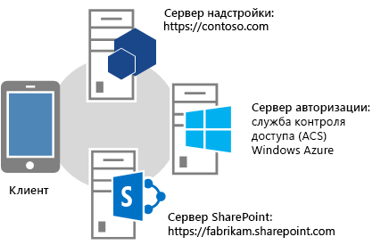
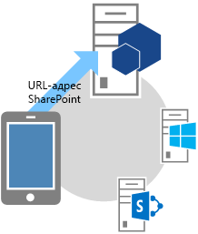
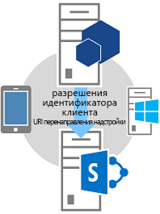
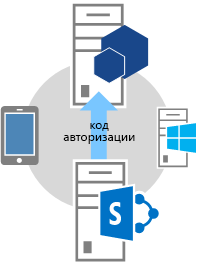
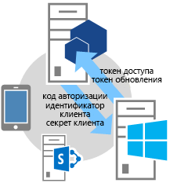
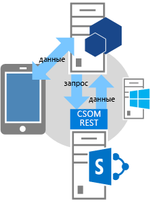

# <a name="authorization-code-oauth-flow-for-sharepoint-add-ins"></a><span data-ttu-id="a1598-103">Поток кода авторизации OAuth для надстроек SharePoint</span><span class="sxs-lookup"><span data-stu-id="a1598-103">Authorization Code OAuth flow for SharePoint Add-ins</span></span>

> [!NOTE] 
> <span data-ttu-id="a1598-104">В этой статье предполагается, что вы ознакомились со статьей [Создание надстроек SharePoint, использующих авторизацию с низким уровнем доверия](creating-sharepoint-add-ins-that-use-low-trust-authorization.md) и основными понятиями и принципами протокола OAuth.</span><span class="sxs-lookup"><span data-stu-id="a1598-104">Note  This article assumes that you are familiar with  [Creating SharePoint Add-ins that use low-trust authorization](creating-sharepoint-add-ins-that-use-low-trust-authorization.md) and with the concepts and principles behind OAuth. For more information about OAuth, see OAuth.net and Web Authorization Protocol (oauth).</span></span> <span data-ttu-id="a1598-105">Дополнительные сведения об OAuth см. на сайте [OAuth.net](http://oauth.net/) и в [описании протокола веб-авторизации (OAuth)](http://datatracker.ietf.org/doc/active/#oauth).</span><span class="sxs-lookup"><span data-stu-id="a1598-105">For more information about OAuth, see [OAuth.net](http://oauth.net/) and [Web Authorization Protocol (oauth)](http://datatracker.ietf.org/doc/active/#oauth).</span></span>

<span data-ttu-id="a1598-106">В некоторых случаях надстройка может запрашивать разрешение на доступ к ресурсам SharePoint во время работы (динамически), а не во время установки.</span><span class="sxs-lookup"><span data-stu-id="a1598-106">In some scenarios, an add-in can request permission to access SharePoint resources on the fly; that is, an add-in can request permission to access SharePoint resources dynamically at runtime, instead of at add-in installation time.</span></span> <span data-ttu-id="a1598-107">Такие надстройки не обязательно запускать из среды SharePoint или даже устанавливать в ней.</span><span class="sxs-lookup"><span data-stu-id="a1598-107">This type of add-in does not have to be launched from, or even installed on, SharePoint.</span></span> <span data-ttu-id="a1598-108">Например, надстройка может быть встроена в устройство, запущена с какого-либо веб-сайта или из приложения Office, и ей может требоваться доступ к ресурсам SharePoint во время выполнения.</span><span class="sxs-lookup"><span data-stu-id="a1598-108">For example, it could be a native device add-in, an add-in that is launched from any website, or an Office Add-in launched from an Office application that wants to access resources on SharePoint on the fly.</span></span>

> [!NOTE] 
> <span data-ttu-id="a1598-p103">Этот тип надстройки может быть запущен только пользователями с разрешениями "Управление" на всех ресурсах, к которым надстройка запрашивает доступ. Например, если надстройка запрашивает у веб-сайта только разрешение на чтение, пользователь, у которого для веб-сайта есть права на "чтение", но не "управление", не может запускать надстройку.</span><span class="sxs-lookup"><span data-stu-id="a1598-p103">This type of add-in can only be run by users who have Manage permissions to the resources the add-in wants to access. For example, if an add-in requests only Read permission to a website, a user who has Read, but not Manage, rights to the website cannot run the add-in.</span></span>

<span data-ttu-id="a1598-111">Чтобы вызывать SharePoint, такая надстройка должна быть зарегистрирована на Панели мониторинга продаж или странице appregnew.aspx.</span><span class="sxs-lookup"><span data-stu-id="a1598-111">To be able to call into SharePoint, this type of  add-in must first be registered through the Seller Dashboard or the appregnew.aspx page. For more information about registering add-ins via the Seller Dashboard or appregnew.aspx, see Register SharePoint Add-ins 2013.</span></span> <span data-ttu-id="a1598-112">Дополнительные сведения о регистрации надстроек на Панели мониторинга продаж и странице appregnew.aspx см. в статье [Регистрация надстроек SharePoint](register-sharepoint-add-ins.md).</span><span class="sxs-lookup"><span data-stu-id="a1598-112">For more information about registering add-ins via the Seller Dashboard or appregnew.aspx, see [Register SharePoint Add-ins](register-sharepoint-add-ins.md).</span></span>

<span data-ttu-id="a1598-113">После регистрации надстройка становится *субъектом безопасности*, у которого есть удостоверение, как у пользователей и групп.</span><span class="sxs-lookup"><span data-stu-id="a1598-113">After you've registered your add-in, it is a *security principal* and has an identity just as users and groups do.</span></span> <span data-ttu-id="a1598-114">Это удостоверение называется субъектом надстройки.</span><span class="sxs-lookup"><span data-stu-id="a1598-114">This identity is referred to as an add-in principal.</span></span> <span data-ttu-id="a1598-115">Как и у пользователей и групп, у субъекта надстройки есть определенные разрешения.</span><span class="sxs-lookup"><span data-stu-id="a1598-115">Like users and groups, an add-in principal has certain permissions.</span></span> <span data-ttu-id="a1598-116">Дополнительные сведения о субъектах надстроек см. в статье [Регистрация надстроек SharePoint](register-sharepoint-add-ins.md).</span><span class="sxs-lookup"><span data-stu-id="a1598-116">For more information about add-in principals, see [Register SharePoint Add-ins](register-sharepoint-add-ins.md).</span></span>

<span data-ttu-id="a1598-117">После регистрации надстройки вы получите идентификатор и секрет клиента, домен надстройки и URI перенаправления для субъекта надстройки.</span><span class="sxs-lookup"><span data-stu-id="a1598-117">When you register the add-in, you'll get a client id, client secret, add-in domain, and redirect URI for the add-in principal. This information is registered with the authorization server, winazureacslong.</span></span> <span data-ttu-id="a1598-118">Эти сведения регистрируются на сервере авторизации — службе контроля доступа Microsoft Azure (ACS).</span><span class="sxs-lookup"><span data-stu-id="a1598-118">This information is registered with the authorization server, Microsoft Azure Access Control Service (ACS).</span></span>
 
<span data-ttu-id="a1598-119"><a name="Flow"> </a></span><span class="sxs-lookup"><span data-stu-id="a1598-119"></span></span>
 
## <a name="authorization-code-oauth-flow-for-add-ins-that-request-permissions-on-the-fly"></a><span data-ttu-id="a1598-120">Поток OAuth кода авторизации для надстроек, запрашивающих разрешения во время выполнения</span><span class="sxs-lookup"><span data-stu-id="a1598-120">Understand the OAuth flow for add-ins that request permissions on the fly</span></span>

<span data-ttu-id="a1598-121">В этом разделе представлена сводка потока проверки подлинности и авторизации OAuth для надстроек SharePoint, запрашивающих разрешения во время работы.</span><span class="sxs-lookup"><span data-stu-id="a1598-121">This section summarizes the OAuth authentication and authorization flow for a SharePoint add-in requesting permissions on the fly.</span></span> <span data-ttu-id="a1598-122">Этот поток называется **потоком кода аутентификации**.</span><span class="sxs-lookup"><span data-stu-id="a1598-122">The flow is called the **Authentication Code flow**.</span></span> <span data-ttu-id="a1598-123">Эта последовательность иллюстрирует, как надстройка, запущенная не из SharePoint, может получать доступ к ресурсам в SharePoint.</span><span class="sxs-lookup"><span data-stu-id="a1598-123">The sequence describes how an add-in that is not launched from within SharePoint can access resources in SharePoint.</span></span>

> [!NOTE] 
> <span data-ttu-id="a1598-124">Поток включает ряд взаимодействий между надстройкой, SharePoint, сервером авторизации (ACS) и пользователем во время работы.</span><span class="sxs-lookup"><span data-stu-id="a1598-124">The flow involves a series of interactions between your add-in, SharePoint, the authorization server (which is ACS), and the end user at runtime.</span></span> <span data-ttu-id="a1598-125">Таким образом, в этом потоке необходима ферма SharePoint Online или SharePoint, подключенная к Интернету, для взаимодействия с ACS.</span><span class="sxs-lookup"><span data-stu-id="a1598-125">So the flow requires either SharePoint Online or a SharePoint farm that is connected to the Internet, so it can communicate with ACS.</span></span> <span data-ttu-id="a1598-126">На фермах SharePoint, не подключенных к Интернету, следует использовать [систему авторизации с высоким уровнем доверия](creating-sharepoint-add-ins-that-use-high-trust-authorization.md).</span><span class="sxs-lookup"><span data-stu-id="a1598-126">SharePoint farms that are not connected to the Internet must use [the high-trust authorization system](creating-sharepoint-add-ins-that-use-high-trust-authorization.md).</span></span>
 
<span data-ttu-id="a1598-127">Необходимы приложение или служба, размещенные отдельно от SharePoint.</span><span class="sxs-lookup"><span data-stu-id="a1598-127">There has to be a web application or service that is hosted separately from SharePoint.</span></span> <span data-ttu-id="a1598-128">Даже если надстройка привязана к устройству, ей необходим URL-адрес веб-приложения или службы, который можно зарегистрировать в ACS, даже если веб-компонент не используется для других целей.</span><span class="sxs-lookup"><span data-stu-id="a1598-128">Even if the add-in is a device add-in, it has to have a web application or service URL that can be registered with ACS, even if the web component is used for nothing else.</span></span> 

<span data-ttu-id="a1598-129">Для простоты в этой статье предполагается, что надстройка представляет собой веб-приложение под названием Contoso.com. Приложение использует клиентскую объектную модель SharePoint (CSOM) или интерфейсы REST API SharePoint для отправки вызовов среде SharePoint.</span><span class="sxs-lookup"><span data-stu-id="a1598-129">For simplicity, this article assumes that the add-in is a web application called Contoso.com. The application uses the SharePoint client object model (CSOM) or the SharePoint REST APIs to make calls to SharePoint.</span></span> <span data-ttu-id="a1598-130">Когда приложение впервые пытается получить доступ к среде SharePoint, последняя запрашивает из ACS код авторизации, который можно отправить приложению Contoso.com.</span><span class="sxs-lookup"><span data-stu-id="a1598-130">When the application first attempts to access SharePoint, SharePoint requests an authorization code from ACS that it can send to the Contoso.com application.</span></span> <span data-ttu-id="a1598-131">Затем приложение использует этот код авторизации, чтобы запросить маркер доступа из ACS.</span><span class="sxs-lookup"><span data-stu-id="a1598-131">The application then uses the authorization code to request an access token from ACS.</span></span> <span data-ttu-id="a1598-132">Получив маркер доступа, приложение Contoso.com включает его во все свои запросы к SharePoint.</span><span class="sxs-lookup"><span data-stu-id="a1598-132">After it has the access token, the Contoso.com application includes it in all its requests to SharePoint.</span></span>
 

<span data-ttu-id="a1598-133"><a name="Fly"> </a></span><span class="sxs-lookup"><span data-stu-id="a1598-133"></span></span> 

### <a name="detailed-example-of-the-flow"></a><span data-ttu-id="a1598-134">Подробный пример потока</span><span class="sxs-lookup"><span data-stu-id="a1598-134">Detailed example of the flow</span></span>

<span data-ttu-id="a1598-135">Допустим, компания Contoso предоставляет услуги фотопечати в Интернете.</span><span class="sxs-lookup"><span data-stu-id="a1598-135">Suppose that Contoso provides a photo-printing service online.</span></span> <span data-ttu-id="a1598-136">Пользователю нужно распечатать фотографии.</span><span class="sxs-lookup"><span data-stu-id="a1598-136">A user wants to print some photos.</span></span> <span data-ttu-id="a1598-137">Для этого он должен предоставить службе Contoso разрешение на доступ к фотографиям из библиотек на сайте SharePoint Online `fabrikam.sharepoint.com` и их печать.</span><span class="sxs-lookup"><span data-stu-id="a1598-137">Suppose that Contoso provides a photo-printing service online. A user wants to print some photos. The user wants to give consent to a Contoso photo-printing service to access and print photos from a set of photo libraries that the user keeps on an SharePoint Online site,  `fabrikam.sharepoint.com`.</span></span>


 
<span data-ttu-id="a1598-139">Приложение для фотопечати зарегистрировано, поэтому у него есть идентификатор и секрет клиента, а также URI перенаправления.</span><span class="sxs-lookup"><span data-stu-id="a1598-139">The photo-printing application is registered, so it has a client ID, client secret, and redirect URI.</span></span> <span data-ttu-id="a1598-140">URI перенаправления, предоставленный компанией Contoso при регистрации надстройки, — `https://contoso.com/RedirectAccept.aspx`.</span><span class="sxs-lookup"><span data-stu-id="a1598-140">The redirect URI that Contoso provided when it registered the add-in is `https://contoso.com/RedirectAccept.aspx`.</span></span> <span data-ttu-id="a1598-141">Идентификатор и секрет клиента хранятся в файле web.config приложения для фотопечати.</span><span class="sxs-lookup"><span data-stu-id="a1598-141">The client ID and client secret information are stored in the photo-printing application's web.config file.</span></span> <span data-ttu-id="a1598-142">Ниже представлен пример того, как идентификатор и секрет клиента вводятся в файле web.config.</span><span class="sxs-lookup"><span data-stu-id="a1598-142">The following is an example of how the client ID and client secret are entered in the web.config file.</span></span>

```XML
    <configuration>
    <appSettings>
        <add key="ClientId" value="c78d058c-7f82-44ca-a077-fba855e14d38 "/>
        <add key="ClientSecret" value="SbALAKghPXTjbBiLQZP+GnbmN+vrgeCMMvptbgk7T6w= "/>
    </appSettings>
    </configuration>
```

### <a name="authentication-code-flow-steps"></a><span data-ttu-id="a1598-143">Этапы потока кода аутентификации</span><span class="sxs-lookup"><span data-stu-id="a1598-143">Authentication Code flow steps</span></span>

<span data-ttu-id="a1598-144">Ниже перечислены этапы потока кода аутентификации.</span><span class="sxs-lookup"><span data-stu-id="a1598-144">The following are the steps in the Authentication Code Flow.</span></span>
 
> [!TIP] 
> <span data-ttu-id="a1598-p113">Следующие действия ссылаются на методы в файле TokenHelper.cs (или TokenHelper.vb). Этот управляемый код не компилируется, поэтому для него справочные разделы недоступны. Однако сам файл подробно прокомментирован с описанием каждого класса, параметра члена и возвращаемого значения. Вы можете открыть его копию для справки при чтении следующих инструкций.</span><span class="sxs-lookup"><span data-stu-id="a1598-p113">These steps refer to methods in the TokenHelper.cs (or .vb) file. This managed code is not compiled, so there are no reference topics for it. However, the file itself is fully commented with descriptions of every class, member parameter, and return value. Consider having a copy of it open to refer to as you read these steps.</span></span>

#### <a name="step-1-client-opens-an-application-and-then-directs-it-to-a-sharepoint-site-for-data"></a><span data-ttu-id="a1598-149">Этап 1. Клиент открывает приложение, а затем переходит на сайт SharePoint для получения данных</span><span class="sxs-lookup"><span data-stu-id="a1598-149">Client opens an application and then directs it to a SharePoint site for data.</span></span>



<span data-ttu-id="a1598-151">Пользователь открывает веб-сайт фотопечати Contoso. В его пользовательском интерфейсе указывается, что пользователь может печатать фотографии, хранящиеся на любом сайте SharePoint Online.</span><span class="sxs-lookup"><span data-stu-id="a1598-151">A user browses to the Contoso photo-printing website, where the UI indicates that the user can print photos that are kept in any SharePoint Online site. Inn this example the URL is  .</span></span>

<span data-ttu-id="a1598-152">В этом примере используется URL-адрес `https://contoso.com/print/home.aspx`.</span><span class="sxs-lookup"><span data-stu-id="a1598-152">In this example case, the URL would be `https://contoso.com/print/home.aspx`.</span></span>

<span data-ttu-id="a1598-153">Надстройка для фотопечати предлагает пользователю ввести URL-адрес коллекции фотографий.</span><span class="sxs-lookup"><span data-stu-id="a1598-153">The photo-printing add-in asks the user to enter the URL of the photo collection. The user enters a URL pointing to the SharePoint Online site:  .</span></span> <span data-ttu-id="a1598-154">Пользователь вводит URL-адрес, указывающий на сайт SharePoint Online: `https://fabrikam.sharepoint.com/`.</span><span class="sxs-lookup"><span data-stu-id="a1598-154">The photo-printing add-in asks the user to enter the URL of the photo collection. The user enters a URL pointing to the SharePoint Online site:  `https://fabrikam.sharepoint.com/`.</span></span>

<span data-ttu-id="a1598-155"><a name="FlowStep2"> </a></span><span class="sxs-lookup"><span data-stu-id="a1598-155"></span></span> 

#### <a name="step-2-the-add-in-redirects-to-the-sharepoint-site-authorization-url"></a><span data-ttu-id="a1598-156">Этап 2. Надстройка перенаправляется на URL-адрес авторизации сайта SharePoint</span><span class="sxs-lookup"><span data-stu-id="a1598-156">The add-in redirects to the SharePoint site authorization URL.</span></span>



<span data-ttu-id="a1598-158">Когда пользователь нажимает кнопку для получения фотографий, надстройка фотопечати Contoso перенаправляет браузер на URL-адрес `https://fabrikam.sharepoint.com/`. Это отклик HTTP 302 Redirect.</span><span class="sxs-lookup"><span data-stu-id="a1598-158">When the user clicks the button to get the photos, the Contoso photo-printing add-in redirects the browser to  `https://fabrikam.sharepoint.com/`. This redirect is a HTTP 302 Redirect Response.</span></span>

<span data-ttu-id="a1598-p115">Если вы используете Microsoft .NET, **Response.Redirect** лишь один из нескольких способов перенаправления, которые можно использовать в коде. Используя файл TokenHelper (с расширением CS или VB) в проекте, ваш код может вызвать перегруженный метод **GetAuthorizationUrl** (используя перегрузку с тремя аргументами). Он создает URL-адрес перенаправления OAuthAuthorize.aspx автоматически. С помощью вашего кода также можно сформировать URL-адрес вручную. </span><span class="sxs-lookup"><span data-stu-id="a1598-p115">If you're using Microsoft .NET, **Response.Redirect** is one of several ways you can do the redirect from your code. Using the TokenHelper.cs (or .vb) file in your project, your code can call the overloaded **GetAuthorizationUrl** method (using the overload with three arguments). This method constructs the OAuthAuthorize.aspx redirect URL for you. Or, your code can manually construct the URL.</span></span>

<span data-ttu-id="a1598-163">Например, если вы вызываете метод **GetAuthorizationUrl** для создания URL-адреса OAuthAuthorize.aspx, используя файл TokenHelper.cs (или TokenHelper.vb) в проекте, код будет следующим: `Response.Redirect(TokenHelper.GetAuthorizationUrl(` `sharePointSiteUrl.ToString(), "Web.Read List.Write", "https://contoso.com/RedirectAccept.aspx"));`.</span><span class="sxs-lookup"><span data-stu-id="a1598-163">For example, if you choose to call the **GetAuthorizationUrl** method to construct the OAuthAuthorize.aspx redirect URL for you, using the TokenHelper.cs (or .vb) in your project, the code is as follows:</span></span>

<span data-ttu-id="a1598-164">Взглянув на перегрузку метода **GetAuthorizationUrl** с тремя параметрами в файле TokenHelper.cs (или TokenHelper.vb), вы увидите, что второй параметр задает область разрешений — разделенный пробелами список разрешений, запрашиваемых надстройкой, в сокращенном формате.</span><span class="sxs-lookup"><span data-stu-id="a1598-164">If you look at the three-parameter overload of the **GetAuthorizationUrl** method in TokenHelper.cs (or .vb), you see that the second parameter is a permission scope parameter, which is a space-delimited list of permissions the add-in requests in shorthand format. For more information about permission scopes, see Add-in permission scope and OAuthAuthorize.aspx. The third parameter must be the same redirect URI that is used when the add-in is registered. For more information about registration, see Guidelines for registering add-ins. You will also see that the returned string is a URL including query string parameters.</span></span> <span data-ttu-id="a1598-165">Дополнительные сведения об областях разрешений см. в разделе [Псевдонимы областей разрешений и использование страницы OAuthAuthorize.aspx](#Scope).</span><span class="sxs-lookup"><span data-stu-id="a1598-165">For more information about permission scopes, see [Permission scope aliases and the use of the OAuthAuthorize.aspx page](#Scope).</span></span>

<span data-ttu-id="a1598-166">Третьим параметром должен быть тот же URI перенаправления, который использовался при регистрации надстройки.</span><span class="sxs-lookup"><span data-stu-id="a1598-166">The third parameter must be the same redirect URI that is used when the add-in is registered.</span></span> <span data-ttu-id="a1598-167">Дополнительные сведения о регистрации см. в статье [Регистрация надстроек SharePoint](register-sharepoint-add-ins.md). Возвращаемая строка представляет собой URL-адрес, включающий параметры строки запроса.</span><span class="sxs-lookup"><span data-stu-id="a1598-167">For more information about registration, see [Register SharePoint Add-ins](register-sharepoint-add-ins.md). The returned string is a URL including query string parameters.</span></span> <span data-ttu-id="a1598-168">При желании вы можете вручную составить URL-адрес перенаправления для страницы OAuthAuthorize.aspx.</span><span class="sxs-lookup"><span data-stu-id="a1598-168">If you prefer, you can manually construct the OAuthAuthorize.aspx redirect URL.</span></span> <span data-ttu-id="a1598-169">Например, надстройка для фотопечати Contoso перенаправляет пользователя на следующий URL-адрес: `https://fabrikam.sharepoint.com/_layouts/15/OAuthAuthorize.aspx?client_id=client_GUID&amp;scope=app_permissions_list&amp;response_type=code&amp;redirect_uri=redirect_uri`.</span><span class="sxs-lookup"><span data-stu-id="a1598-169">If you prefer, you can manually construct the OAuthAuthorize.aspx redirect URL. For example, the URL that the Contoso photo-printing add-in redirects the user to in this case is:`https://fabrikam.sharepoint.com/_layouts/15/OAuthAuthorize.aspx?client_id=client_GUID&amp;scope=app_permissions_list&amp;response_type=code&amp;redirect_uri=redirect_uri`</span></span>

<span data-ttu-id="a1598-170">Как видно из примера, надстройка для фотопечати Contoso отправляет идентификатор клиента OAuth и URI перенаправления на сайт Fabrikam в качестве параметров строки запроса.</span><span class="sxs-lookup"><span data-stu-id="a1598-170">As the example shows, the Contoso photo-printing add-in sends the OAuth client ID and redirect URI to the Fabrikam site as query string parameters.</span></span> <span data-ttu-id="a1598-171">Ниже представлен образец запроса GET с примерами значений в строке запроса.</span><span class="sxs-lookup"><span data-stu-id="a1598-171">The following is an example of the GET request with sample query string values.</span></span> <span data-ttu-id="a1598-172">Для удобства добавлены разрывы строк.</span><span class="sxs-lookup"><span data-stu-id="a1598-172">Line breaks have been added for clarity.</span></span> <span data-ttu-id="a1598-173">Фактический целевой URL-адрес представляет собой одну строку.</span><span class="sxs-lookup"><span data-stu-id="a1598-173">The actual target URL is a single line.</span></span> <span data-ttu-id="a1598-174">`GET /authcode HTTP/1.1`  `Host: fabrikam.sharepoint.com`   `/oauthauthorize.aspx`  `?client_id= c78d058c-7f82-44ca-a077-fba855e14d38`  `&amp;scope=list.read`  `&amp;response_type=code`  `&amp;redirect_uri= https%3A%2F%2Fcontoso%2Ecom%2Fredirectaccept.aspx`</span><span class="sxs-lookup"><span data-stu-id="a1598-174"></span></span>

<span data-ttu-id="a1598-175">Чтобы использовать для подтверждения отдельное всплывающее диалоговое окно, можно добавить параметр запроса **IsDlg=1** в URL-адрес, как показано здесь: `/oauthauthorize.aspx?IsDlg=1&amp;client_id= c78d058c-7f82-44ca-a077-fba855e14d38&amp;scope=list.read&amp;response_type=code&amp;redirect_uri= https%3A%2F%2Fcontoso%2Ecom%2Fredirectaccept.aspx`.</span><span class="sxs-lookup"><span data-stu-id="a1598-175">If you want a separate consent pop-up dialog, you can add the query parameter **IsDlg=1** to the URL construct as shown here:</span></span>


#### <a name="step-3-sharepoint-displays-the-consent-page-so-the-user-can-grant-the-add-in-permissions"></a><span data-ttu-id="a1598-176">Этап 3. В SharePoint отображается страница подтверждения для предоставления надстройке разрешений</span><span class="sxs-lookup"><span data-stu-id="a1598-176">SharePoint displays the consent page so the user can grant the add-in permissions.</span></span>


<span data-ttu-id="a1598-178">Если пользователь еще не вошел на сайт Fabrikam в SharePoint Online, ему предлагается сделать это.</span><span class="sxs-lookup"><span data-stu-id="a1598-178">If the user is not already signed into the Fabrikam SharePoint Online site, the user is prompted to sign in. When the user is signed in, SharePoint renders an HTML consent page.</span></span> <span data-ttu-id="a1598-179">Если пользователь вошел, то в SharePoint отображается HTML-страница подтверждения.</span><span class="sxs-lookup"><span data-stu-id="a1598-179">When the user is signed in, SharePoint renders an HTML consent page.</span></span> <span data-ttu-id="a1598-180">На странице согласия пользователю предлагается предоставить надстройке для фотопечати Contoso запрашиваемые разрешения (или отказать ей).</span><span class="sxs-lookup"><span data-stu-id="a1598-180">The consent page prompts the user to grant (or deny) the Contoso photo-printing add-in the permissions that the add-in requests. In this case, the user would be granting the add-in read access to the user's picture library on Fabrikam.</span></span> <span data-ttu-id="a1598-181">В данном случае пользователь предоставляет надстройке доступ на чтение к библиотеке изображений пользователя на сайте Fabrikam.</span><span class="sxs-lookup"><span data-stu-id="a1598-181">The consent page prompts the user to grant (or deny) the Contoso photo-printing add-in the permissions that the add-in requests. In this case, the user would be granting the add-in read access to the user's picture library on Fabrikam.</span></span>

#### <a name="step-4-sharepoint-requests-a-short-lived-authorization-code-from-acs"></a><span data-ttu-id="a1598-182">Этап 4. SharePoint запрашивает временный код авторизации у службы контроля доступа</span><span class="sxs-lookup"><span data-stu-id="a1598-182">SharePoint requests a short-lived authorization code from ACS.</span></span>


<span data-ttu-id="a1598-184">Сайт SharePoint Online компании Fabrikam запрашивает у службы контроля доступа создание кратковременного (приблизительно 5 минут) кода авторизации, который является уникальным для этой комбинации пользователя и надстройки.</span><span class="sxs-lookup"><span data-stu-id="a1598-184">The Fabrikam SharePoint Online site asks ACS to create a short-lived (approximately 5 minutes) authorization code unique to this combination of user and add-in.</span></span> <span data-ttu-id="a1598-185">ACS отправляет код авторизации на сайт Fabrikam.</span><span class="sxs-lookup"><span data-stu-id="a1598-185">ACS sends the authorization code to the Fabrikam site.</span></span>

#### <a name="step-5-the-sharepoint-online-site-redirects-to-the-apps-registered-redirect-uri-passing-the-authorization-code-to-the-add-in"></a><span data-ttu-id="a1598-186">Этап 5. Сайт SharePoint Online перенаправляется на зарегистрированный URI перенаправления надстройки, передавая ей код авторизации</span><span class="sxs-lookup"><span data-stu-id="a1598-186">The SharePoint Online site redirects to the app's registered redirect URI, passing the authorization code to the add-in.</span></span>



<span data-ttu-id="a1598-188">Сайт Fabrikam в SharePoint Online перенаправляет браузер в надстройку Contoso с помощью отклика HTTP 302.</span><span class="sxs-lookup"><span data-stu-id="a1598-188">The Fabrikam SharePoint Online site redirects the browser back to Contoso via HTTP 302 Response.</span></span> <span data-ttu-id="a1598-189">URL-адрес для этого перенаправления создается с использованием URI перенаправления, указанного при регистрации надстройки для фотопечати.</span><span class="sxs-lookup"><span data-stu-id="a1598-189">The URL construct for this redirection uses the redirect URI that was specified when the photo-printing add-in was registrated.</span></span> <span data-ttu-id="a1598-190">Он также содержит код авторизации в виде строки запроса.</span><span class="sxs-lookup"><span data-stu-id="a1598-190">It also includes the authorization code as a query string.</span></span>

<span data-ttu-id="a1598-191">URL-адрес перенаправления имеет следующую структуру: `https://contoso.com/RedirectAccept.aspx?code=<authcode>`.</span><span class="sxs-lookup"><span data-stu-id="a1598-191">The redirect URL is structured like the following: `https://contoso.com/RedirectAccept.aspx?code=<authcode>`</span></span>

#### <a name="step-6-the-add-in-uses-the-authorization-code-to-request-an-access-token-from-acs-which-validates-the-request-invalidates-the-authorization-code-and-then-sends-access-and-refresh-tokens-to-the-add-in"></a><span data-ttu-id="a1598-192">Этап 6. Надстройка использует код авторизации, чтобы запросить маркер доступа у службы контроля доступа, которая проверяет запрос, прекращает действие кода авторизации и отправляет маркеры доступа и обновления надстройке</span><span class="sxs-lookup"><span data-stu-id="a1598-192">The add-in uses the authorization code to request an access token from ACS, which validates the request, invalidates the authorization code, and then sends access and refresh tokens to the add-in.</span></span>



<span data-ttu-id="a1598-194">Contoso получает код авторизации из параметра запроса и включает его вместе с идентификатором и секретом клиента в запрос маркера доступа, отправляемый службе контроля доступа.</span><span class="sxs-lookup"><span data-stu-id="a1598-194">Contoso retrieves the authorization code from the query parameter, and then includes it, along with the client ID and client secret, in a request to ACS for an access token.</span></span>

<span data-ttu-id="a1598-195">Если вы используете управляемый код и SharePoint CSOM, файл TokenHelper.cs (или TokenHelper.vb), то отправлять запрос к ACS будет метод **GetClientContextWithAuthorizationCode**.</span><span class="sxs-lookup"><span data-stu-id="a1598-195">If you are using managed code and the SharePoint CSOM, the TokenHelper.cs (or .vb) file, the method that makes the request to ACS is **GetClientContextWithAuthorizationCode**. In this case the code looks similar to the following (where   is a variable to which the authorization code has been assigned):</span></span> <span data-ttu-id="a1598-196">В этом случае код выглядит примерно так (где `authCode` — это переменная, которой назначен код авторизации): `TokenHelper.GetClientContextWithAuthorizationCode(`  `"https://fabrikam.sharepoint.com/",`  `"00000003-0000-0ff1-ce00-000000000000",`  `authCode,`  `"1ee82b34-7c1b-471b-b27e-ff272accd564",`  `new Uri(Request.Url.GetLeftPart(UriPartial.Path)));`.</span><span class="sxs-lookup"><span data-stu-id="a1598-196">If you are using managed code and the SharePoint CSOM, the TokenHelper.cs (or .vb) file, the method that makes the request to ACS is GetClientContextWithAuthorizationCode. In this case the code looks similar to the following (where  `authCode` is a variable to which the authorization code has been assigned):</span></span>

<span data-ttu-id="a1598-197">В файле TokenHelper.cs (или TokenHelper.vb) вторым параметром метода **GetClientContextWithAuthorizationCode** является `targetPrincipalName`.</span><span class="sxs-lookup"><span data-stu-id="a1598-197">If you look at the TokenHelper.cs (or .vb) file, the second parameter of the **GetClientContextWithAuthorizationCode** method is the `targetPrincipalName`.</span></span> <span data-ttu-id="a1598-198">В надстройках, получающих доступ к SharePoint, его значение всегда равно `00000003-0000-0ff1-ce00-000000000000`.</span><span class="sxs-lookup"><span data-stu-id="a1598-198">This value is always the constant `00000003-0000-0ff1-ce00-000000000000` in an add-in that is accessing SharePoint.</span></span> <span data-ttu-id="a1598-199">При трассировке иерархии вызовов из метода **GetClientContextWithAuthorizationCode** вы увидите, что он получает идентификатор и секрет клиента из файла web.config.</span><span class="sxs-lookup"><span data-stu-id="a1598-199">If you trace the call hierarchy from **GetClientContextWithAuthorizationCode**, it obtains the client ID and secret from the web.config file.</span></span> 

<span data-ttu-id="a1598-200">ACS получает запрос от Contoso, а затем проверяет идентификатор и секрет клиента, URI перенаправления и код авторизации.</span><span class="sxs-lookup"><span data-stu-id="a1598-200">ACS receives Contoso's request and validates the client ID, client secret, redirect URI, and authorization code.</span></span> <span data-ttu-id="a1598-201">Если они действительны, ACS делает код авторизации недействительным (его можно использовать только один раз) и создает маркеры обновления и доступа, а затем отправляет их надстройке Contoso.</span><span class="sxs-lookup"><span data-stu-id="a1598-201">ACS receives Contoso's request and validates the client ID, client secret, redirect URI, and authorization code. If all are valid, the ACS invalidates the authorization code (it can be used only once) and creates a refresh token and an access token, which it returns to Contoso.</span></span> <span data-ttu-id="a1598-202">Приложение Contoso может кэшировать этот маркер доступа для использования в последующих запросах.</span><span class="sxs-lookup"><span data-stu-id="a1598-202">The Contoso application can cache this access token for reuse on later requests.</span></span> <span data-ttu-id="a1598-203">По умолчанию срок действия маркеров доступа составляет около 12 часов.</span><span class="sxs-lookup"><span data-stu-id="a1598-203">By default, access tokens are good for about 12 hours.</span></span>

<span data-ttu-id="a1598-204">Каждый маркер доступа связан с учетной записью, указанной в исходном запросе авторизации, и предоставляет доступ только к тем службам, которые указаны в этом запросе.</span><span class="sxs-lookup"><span data-stu-id="a1598-204">The Contoso application can cache this access token for reuse on later requests. By default, access tokens are good for about 12 hours. Each access token is specific to the user account that is specified in the original request for authorization, and grants access only to the services that are specified in that request. Your add-in should store the access token securely.</span></span> <span data-ttu-id="a1598-205">Надстройка должна надежно хранить этот маркер доступа.</span><span class="sxs-lookup"><span data-stu-id="a1598-205">Your add-in should store the access token securely.</span></span> <span data-ttu-id="a1598-206">Приложение Contoso также может кэшировать маркер обновления.</span><span class="sxs-lookup"><span data-stu-id="a1598-206">The Contoso application can also cache the refresh token.</span></span> <span data-ttu-id="a1598-207">По умолчанию срок действия маркеров обновления составляет 6 месяцев.</span><span class="sxs-lookup"><span data-stu-id="a1598-207">By default, refresh tokens are good for 6 months.</span></span> <span data-ttu-id="a1598-208">По истечении срока действия старого маркера доступа от ACS вы можете получить новый с помощью маркера обновления.</span><span class="sxs-lookup"><span data-stu-id="a1598-208">The refresh token can be redeemed for a new access token from ACS whenever the access token expires.</span></span> 

<span data-ttu-id="a1598-209">Дополнительные сведения о маркерах см. в статье [Обработка маркеров безопасности в надстройках SharePoint с низким уровнем доверия, размещенных у поставщика](handle-security-tokens-in-provider-hosted-low-trust-sharepoint-add-ins.md).</span><span class="sxs-lookup"><span data-stu-id="a1598-209">SharePoint returns the information that Contoso requested. For more about how this request is made, see  [Handle security tokens in provider-hosted low-trust SharePoint Add-ins](handle-security-tokens-in-provider-hosted-low-trust-sharepoint-add-ins.md).</span></span>

#### <a name="step-7-the-add-in-can-now-use-the-access-token-to-request-data-from-the-sharepoint-site-which-it-can-display-to-the-user"></a><span data-ttu-id="a1598-210">Этап 7. Теперь с помощью маркера доступа надстройка может запрашивать данные с сайта SharePoint, а затем показывать их пользователю</span><span class="sxs-lookup"><span data-stu-id="a1598-210">The add-in can now use the access token to request data from the SharePoint site which it can display to the user.</span></span>



<span data-ttu-id="a1598-212">Contoso включает маркер доступа для вызова REST API или запроса CSOM к SharePoint, передавая маркер доступа OAuth в заголовке HTTP **Authorization**.</span><span class="sxs-lookup"><span data-stu-id="a1598-212">Contoso includes the access token to make a REST API call or CSOM request to SharePoint, passing the OAuth access token in the HTTP **Authorization** header.</span></span> <span data-ttu-id="a1598-213">SharePoint возвращает сведения, запрашиваемые надстройкой Contoso.</span><span class="sxs-lookup"><span data-stu-id="a1598-213">SharePoint returns the information that Contoso requested.</span></span> 

<span data-ttu-id="a1598-214">Дополнительные сведения о том, как отправляется этот запрос, см. в статье [Обработка маркеров безопасности в надстройках SharePoint с низким уровнем доверия, размещенных у поставщика](handle-security-tokens-in-provider-hosted-low-trust-sharepoint-add-ins.md).</span><span class="sxs-lookup"><span data-stu-id="a1598-214">SharePoint returns the information that Contoso requested. For more about how this request is made, see  [Handle security tokens in provider-hosted low-trust SharePoint Add-ins](handle-security-tokens-in-provider-hosted-low-trust-sharepoint-add-ins.md).</span></span>


<span data-ttu-id="a1598-215"><a name="Scope"> </a></span><span class="sxs-lookup"><span data-stu-id="a1598-215"></span></span>

## <a name="permission-scope-aliases-and-the-oauthauthorizeaspx-page"></a><span data-ttu-id="a1598-216">Псевдонимы областей разрешений и страница OAuthAuthorize.aspx</span><span class="sxs-lookup"><span data-stu-id="a1598-216">Understand permission scope aliases and the use of the OAuthAuthorize.aspx page</span></span>

<span data-ttu-id="a1598-217">В этом разделе предполагается, что вы уже ознакомились со статьей [Разрешения надстроек в SharePoint](add-in-permissions-in-sharepoint.md).</span><span class="sxs-lookup"><span data-stu-id="a1598-217">This section assumes that you are familiar with the article [Add-in permissions in SharePoint](add-in-permissions-in-sharepoint.md).</span></span> <span data-ttu-id="a1598-218">В таблице 1 показаны URI областей запросов разрешений для надстроек, описанные в этой статье, а также дополнительный столбец (**Псевдоним области**). Право FullControl недоступно в столбце **Доступные права**, так как надстройка, запрашивающая разрешение на доступ к ресурсам SharePoint во время выполнения, не может запросить право на полный доступ.</span><span class="sxs-lookup"><span data-stu-id="a1598-218">This section assumes you are familiar with the article  Add-in permissions in SharePoint. Table 1 shows the same add-in permission request scope URIs that are shown in that article, except it has one additional column ( **Scope Alias** ) and the FullControl right is not available in the **Available Rights** column, because an add-in that request permission to access SharePoint resources on the fly can't request full control right.</span></span>

<span data-ttu-id="a1598-219">Значения, указанные в столбце **Псевдоним области**, представляют собой сокращенные версии их аналогов из столбца **URI области**.</span><span class="sxs-lookup"><span data-stu-id="a1598-219">The values listed in the **Scope alias** column are shorthand versions of their counterparts in the **Scope URI** column.</span></span> <span data-ttu-id="a1598-220">Псевдонимами могут пользоваться только надстройки, запрашивающие разрешение на доступ к ресурсам SharePoint во время выполнения.</span><span class="sxs-lookup"><span data-stu-id="a1598-220">The aliases can be used only by add-ins that request permission to access SharePoint resources on the fly.</span></span> <span data-ttu-id="a1598-221">Значение URI областей используются в манифестах надстроек, запускаемых из SharePoint.</span><span class="sxs-lookup"><span data-stu-id="a1598-221">(The scope URI values are used in the add-in manifest of add-ins that are launched from SharePoint.</span></span> <span data-ttu-id="a1598-222">Такие надстройки запрашивают разрешения во время установки.</span><span class="sxs-lookup"><span data-stu-id="a1598-222">These add-ins request permissions during add-in installation.)</span></span>

<span data-ttu-id="a1598-223">Псевдонимы областей используются только в контексте страницы перенаправления OAuthAuthorize.aspx.</span><span class="sxs-lookup"><span data-stu-id="a1598-223">The scope aliases are used only in the context of using the OAuthAuthorize.aspx redirect page.</span></span> <span data-ttu-id="a1598-224">Как показано на [этапе 2 потока OAuth](#FlowStep2), описанном в предыдущем разделе, если надстройка использует управляемый код, то псевдонимы используются при вызове метода **GetAuthorizationUrl** из файла TokenHelper.cs (или TokenHelper.vb) вашего проекта.</span><span class="sxs-lookup"><span data-stu-id="a1598-224">The scope aliases are used only in the context of using the OAuthAuthorize.aspx redirect page. As shown in step 2 of the OAuth flow described in the previous section, when the add-in is using managed code, the aliases are used when you call the  **GetAuthorizationUrl** method of TokenHelper.cs (or .vb) in your project. The following is another example:</span></span> <span data-ttu-id="a1598-225">Ниже представлен еще один пример.</span><span class="sxs-lookup"><span data-stu-id="a1598-225">The following is an example.</span></span> 

```C#
Response.Redirect(TokenHelper.GetAuthorizationUrl(
    sharePointSiteUrl.ToString(), 
    "Web.Read List.Write ", 
    "https://contoso.com/RedirectAccept.aspx "));
```

<span data-ttu-id="a1598-226">Значение параметра _scope_, `Web.Read List.Write`, представляет собой пример запроса разрешений с помощью псевдонимов областей.</span><span class="sxs-lookup"><span data-stu-id="a1598-226">The  _scope_ parameter value, `Web.Read List.Write`, is an example of how you would request permissions using the scope aliases. The  scope parameter is a space-delimited set of permission scope and right requests.</span></span> <span data-ttu-id="a1598-227">Параметр _scope_ — это разделенный пробелами набор, состоящий из области разрешений и запрашиваемых прав.</span><span class="sxs-lookup"><span data-stu-id="a1598-227">The  _scope_ parameter value, , is an example of how you would request permissions using the scope aliases. The  scope parameter is a space-delimited set of permission scope and right requests.</span></span>

<span data-ttu-id="a1598-p131">Если вы не используете управляемый код, в поле области URL-адреса перенаправления используются псевдонимы областей. Пример:</span><span class="sxs-lookup"><span data-stu-id="a1598-p131">If you are not using managed code, the scope aliases are used in the scope field in the redirect URL. For example:</span></span>

`https://fabrikam.sharepoint.com/_layout/15/OAuthAuthorize.aspx?client_id=c78d058c-7f82-44ca-a077-fba855e14d38&amp;scope=list.write&amp;response_type=code&amp;redirect_uri=https%3A%2F%2Fcontoso%2Ecom%2Fredirectaccept.aspx`

> [!NOTE] 
> <span data-ttu-id="a1598-230">Описание областей см. в статье [Разрешения надстроек в SharePoint](add-in-permissions-in-sharepoint.md).</span><span class="sxs-lookup"><span data-stu-id="a1598-230">Note  For a description of the scopes, see  [Add-in permissions in SharePoint](add-in-permissions-in-sharepoint.md).</span></span>
 
<br/>

<span data-ttu-id="a1598-231">**Таблица 1. URI областей разрешений для надстроек SharePoint и соответствующие псевдонимы**</span><span class="sxs-lookup"><span data-stu-id="a1598-231">**Table 1. SharePoint add-in permission request scope URIs and their corresponding aliases**</span></span>

|<span data-ttu-id="a1598-232">**URI области**</span><span class="sxs-lookup"><span data-stu-id="a1598-232">**Scope URI**</span></span>|<span data-ttu-id="a1598-233">**Псевдоним области**</span><span class="sxs-lookup"><span data-stu-id="a1598-233">**Scope Alias**</span></span>|<span data-ttu-id="a1598-234">**Доступные права**</span><span class="sxs-lookup"><span data-stu-id="a1598-234">**Available rights**</span></span>|
|:-----|:-----|:-----|
|<span data-ttu-id="a1598-235">http://sharepoint/content/sitecollection</span><span class="sxs-lookup"><span data-stu-id="a1598-235">http://sharepoint/content/sitecollection</span></span>|<span data-ttu-id="a1598-236">Сайт</span><span class="sxs-lookup"><span data-stu-id="a1598-236">Site</span></span>|<span data-ttu-id="a1598-237">Чтение, запись, управление</span><span class="sxs-lookup"><span data-stu-id="a1598-237">Read, Write, Manage</span></span>|
|<span data-ttu-id="a1598-238">http://sharepoint/content/sitecollection/web</span><span class="sxs-lookup"><span data-stu-id="a1598-238">http://sharepoint/content/sitecollection/web</span></span>|<span data-ttu-id="a1598-239">Веб</span><span class="sxs-lookup"><span data-stu-id="a1598-239">Web</span></span>|<span data-ttu-id="a1598-240">Чтение, запись, управление</span><span class="sxs-lookup"><span data-stu-id="a1598-240">Read, Write, Manage</span></span>|
|<span data-ttu-id="a1598-241">http://sharepoint/content/sitecollection/web/list</span><span class="sxs-lookup"><span data-stu-id="a1598-241">http://sharepoint/content/sitecollection/web/list</span></span>|<span data-ttu-id="a1598-242">Перечисление</span><span class="sxs-lookup"><span data-stu-id="a1598-242">List</span></span>|<span data-ttu-id="a1598-243">Чтение, запись, управление</span><span class="sxs-lookup"><span data-stu-id="a1598-243">Read, Write, Manage</span></span>|
|<span data-ttu-id="a1598-244">http://sharepoint/content/tenant</span><span class="sxs-lookup"><span data-stu-id="a1598-244">http://sharepoint/content/tenant</span></span>|<span data-ttu-id="a1598-245">AllSites</span><span class="sxs-lookup"><span data-stu-id="a1598-245">AllSites</span></span>|<span data-ttu-id="a1598-246">Чтение, запись, управление</span><span class="sxs-lookup"><span data-stu-id="a1598-246">Read, Write, Manage</span></span>|
|<span data-ttu-id="a1598-247">http://sharepoint/bcs/connection</span><span class="sxs-lookup"><span data-stu-id="a1598-247">http://sharepoint/bcs/connection</span></span>|<span data-ttu-id="a1598-248">Нет (сейчас не поддерживается)</span><span class="sxs-lookup"><span data-stu-id="a1598-248">None (currently not supported)</span></span>|<span data-ttu-id="a1598-249">Чтение</span><span class="sxs-lookup"><span data-stu-id="a1598-249">Read</span></span>|
|<span data-ttu-id="a1598-250">http://sharepoint/search</span><span class="sxs-lookup"><span data-stu-id="a1598-250">http://sharepoint/search</span></span>|<span data-ttu-id="a1598-251">Поиск</span><span class="sxs-lookup"><span data-stu-id="a1598-251">Search</span></span>|<span data-ttu-id="a1598-252">QueryAsUserIgnoreAppPrincipal</span><span class="sxs-lookup"><span data-stu-id="a1598-252">QueryAsUserIgnoreAppPrincipal</span></span>|
|<span data-ttu-id="a1598-253">http://sharepoint/projectserver</span><span class="sxs-lookup"><span data-stu-id="a1598-253">http://sharepoint/projectserver</span></span>|<span data-ttu-id="a1598-254">ProjectAdmin</span><span class="sxs-lookup"><span data-stu-id="a1598-254">ProjectAdmin</span></span> |<span data-ttu-id="a1598-255">Управление</span><span class="sxs-lookup"><span data-stu-id="a1598-255">Manage</span></span>|
|<span data-ttu-id="a1598-256">http://sharepoint/projectserver/projects</span><span class="sxs-lookup"><span data-stu-id="a1598-256">http://sharepoint/projectserver/projects</span></span>|<span data-ttu-id="a1598-257">Проекты</span><span class="sxs-lookup"><span data-stu-id="a1598-257">Projects</span></span>|<span data-ttu-id="a1598-258">Чтение, запись</span><span class="sxs-lookup"><span data-stu-id="a1598-258">Read, Write</span></span>|
|<span data-ttu-id="a1598-259">http://sharepoint/projectserver/projects/project</span><span class="sxs-lookup"><span data-stu-id="a1598-259">http://sharepoint/projectserver/projects/project</span></span>|<span data-ttu-id="a1598-260">Project </span><span class="sxs-lookup"><span data-stu-id="a1598-260">Project</span></span>|<span data-ttu-id="a1598-261">Чтение, запись</span><span class="sxs-lookup"><span data-stu-id="a1598-261">Read, Write</span></span>|
|<span data-ttu-id="a1598-262">http://sharepoint/projectserver/enterpriseresources</span><span class="sxs-lookup"><span data-stu-id="a1598-262">http://sharepoint/projectserver/enterpriseresources</span></span>|<span data-ttu-id="a1598-263">ProjectResources</span><span class="sxs-lookup"><span data-stu-id="a1598-263">ProjectResources</span></span>|<span data-ttu-id="a1598-264">Чтение, запись</span><span class="sxs-lookup"><span data-stu-id="a1598-264">Read, Write</span></span>|
|<span data-ttu-id="a1598-265">http://sharepoint/projectserver/statusing</span><span class="sxs-lookup"><span data-stu-id="a1598-265">http://sharepoint/projectserver/statusing</span></span>|<span data-ttu-id="a1598-266">ProjectStatusing</span><span class="sxs-lookup"><span data-stu-id="a1598-266">ProjectStatusing</span></span>|<span data-ttu-id="a1598-267">SubmitStatus</span><span class="sxs-lookup"><span data-stu-id="a1598-267">SubmitStatus</span></span>|
|<span data-ttu-id="a1598-268">http://sharepoint/projectserver/reporting</span><span class="sxs-lookup"><span data-stu-id="a1598-268">http://sharepoint/projectserver/reporting</span></span>|<span data-ttu-id="a1598-269">ProjectReporting</span><span class="sxs-lookup"><span data-stu-id="a1598-269">ProjectReporting</span></span>|<span data-ttu-id="a1598-270">Чтение</span><span class="sxs-lookup"><span data-stu-id="a1598-270">Read</span></span>|
|<span data-ttu-id="a1598-271">http://sharepoint/projectserver/workflow</span><span class="sxs-lookup"><span data-stu-id="a1598-271">http://sharepoint/projectserver/workflow</span></span>|<span data-ttu-id="a1598-272">ProjectWorkflow</span><span class="sxs-lookup"><span data-stu-id="a1598-272">ProjectWorkflow</span></span>|<span data-ttu-id="a1598-273">Повышение прав</span><span class="sxs-lookup"><span data-stu-id="a1598-273">Elevate</span></span>|
|<span data-ttu-id="a1598-274">http://sharepoint/social/tenant</span><span class="sxs-lookup"><span data-stu-id="a1598-274">http://sharepoint/social/tenant</span></span>|<span data-ttu-id="a1598-275">AllProfiles</span><span class="sxs-lookup"><span data-stu-id="a1598-275">AllProfiles</span></span>|<span data-ttu-id="a1598-276">Чтение, запись, управление</span><span class="sxs-lookup"><span data-stu-id="a1598-276">Read, Write, Manage</span></span>|
|<span data-ttu-id="a1598-277">http://sharepoint/social/core</span><span class="sxs-lookup"><span data-stu-id="a1598-277">http://sharepoint/social/core</span></span>|<span data-ttu-id="a1598-278">Сообщество</span><span class="sxs-lookup"><span data-stu-id="a1598-278">Social</span></span>|<span data-ttu-id="a1598-279">Чтение, запись, управление</span><span class="sxs-lookup"><span data-stu-id="a1598-279">Read, Write, Manage</span></span>|
|<span data-ttu-id="a1598-280">http://sharepoint/social/microfeed</span><span class="sxs-lookup"><span data-stu-id="a1598-280">http://sharepoint/social/microfeed</span></span>|<span data-ttu-id="a1598-281">Microfeed</span><span class="sxs-lookup"><span data-stu-id="a1598-281">Microfeed</span></span>|<span data-ttu-id="a1598-282">Чтение, запись, управление</span><span class="sxs-lookup"><span data-stu-id="a1598-282">Read, Write, Manage</span></span>|
|<span data-ttu-id="a1598-283">http://sharepoint/taxonomy</span><span class="sxs-lookup"><span data-stu-id="a1598-283">http://sharepoint/taxonomy</span></span>|<span data-ttu-id="a1598-284">TermStore</span><span class="sxs-lookup"><span data-stu-id="a1598-284">TermStore</span></span>|<span data-ttu-id="a1598-285">Чтение, запись</span><span class="sxs-lookup"><span data-stu-id="a1598-285">Read, Write</span></span>|


<span data-ttu-id="a1598-286"><a name="RedirectURI"> </a></span><span class="sxs-lookup"><span data-stu-id="a1598-286"></span></span>

## <a name="redirect-uris-and-a-sample-redirect-page"></a><span data-ttu-id="a1598-287">URI перенаправления и пример страницы перенаправления</span><span class="sxs-lookup"><span data-stu-id="a1598-287">Redirect URIs and a sample redirect page</span></span>

<span data-ttu-id="a1598-288">URI перенаправления, используемый надстройками, который запрашивают разрешения во время выполнения, — это URI, на который SharePoint перенаправляет браузер после предоставления согласия (с кодом авторизации в виде параметра запроса).</span><span class="sxs-lookup"><span data-stu-id="a1598-288">The  redirect URI that is used by add-ins that request permission on the fly is the URI that SharePoint redirects the browser to after consent is granted (with the authorization code included as a query parameter). Step 2 of the flow description above gives an example where the URI is hardcoded in a call to GetAuthorizationUrl method. Alternatively, an ASP.NET add-in can also store the redirect URI in the web.config file as shown in this example:</span></span> <span data-ttu-id="a1598-289">На [этапе 2 потока OAuth](#FlowStep2) представлен пример жестко заданного URI в вызове метода **GetAuthorizationUrl**.</span><span class="sxs-lookup"><span data-stu-id="a1598-289">[Step 2 of the OAuth flow](#FlowStep2) gives an example where the URI is hardcoded in a call to **GetAuthorizationUrl** method.</span></span> <span data-ttu-id="a1598-290">Кроме того, надстройка ASP.NET также может хранить URI в файле web.config, как показано в следующем примере:</span><span class="sxs-lookup"><span data-stu-id="a1598-290">Alternatively, an ASP.NET add-in can also store the redirect URI in the web.config file as shown in this example:</span></span>

```XML
    <configuration>
        <appSettings>
            <add key="RedirectUri" value="https://contoso.com/RedirectAccept.aspx" />
        </appSettings>
    <configuration>
```

<span data-ttu-id="a1598-291">Это значение можно получить, вызвав метод `WebConfigurationManager.AppSettings.Get("RedirectUri")`.</span><span class="sxs-lookup"><span data-stu-id="a1598-291">The value can be retrieved with a call to  `WebConfigurationManager.AppSettings.Get("RedirectUri")`.</span></span>

<span data-ttu-id="a1598-292">Конечная точка, соответствующая URI перенаправления, получает код авторизации из параметра запроса и получает с его помощью маркер доступа, который затем можно использовать для доступа к SharePoint.</span><span class="sxs-lookup"><span data-stu-id="a1598-292">The endpoint at the redirect URI gets the authorization code from the query parameter and uses it to get an access token, which can then be used to access SharePoint.</span></span> <span data-ttu-id="a1598-293">Как правило, конечной точкой является та же страница (либо метод контроллера или веб-метод), которая изначально пыталась получить доступ к SharePoint.</span><span class="sxs-lookup"><span data-stu-id="a1598-293">Typically, the endpoint is the same page, or controller method, or web method that originally attempted to access SharePoint.</span></span> <span data-ttu-id="a1598-294">Однако это могут быть страница или метод, которые просто получают маркер авторизации, а затем выполняют перенаправление на другую страницу или в другой метод.</span><span class="sxs-lookup"><span data-stu-id="a1598-294">However, it can be a page or method that only receives the authorization token and then redirects to another page or method.</span></span> <span data-ttu-id="a1598-295">Специальные страница или метод могут передать маркер авторизации или кэшировать его.</span><span class="sxs-lookup"><span data-stu-id="a1598-295">The special page or method could pass the authorization token or cache it.</span></span> <span data-ttu-id="a1598-296">Срок действия маркера составляет около 5 минут. Вы также можете использовать маркер авторизации, чтобы получить маркер доступа, который будет кэширован.</span><span class="sxs-lookup"><span data-stu-id="a1598-296">(It has a lifetime of about 5 minutes.) Alternatively, it could use the authorization token to obtain an access token which it caches.</span></span>

<span data-ttu-id="a1598-297">Ниже приведен пример кода такой страницы в приложении ASP.NET.</span><span class="sxs-lookup"><span data-stu-id="a1598-297">The following is an example of the code behind of such a page in an ASP.NET application. Note the following about this code:</span></span> <span data-ttu-id="a1598-298">Обратите внимание на следующие особенности этого кода:</span><span class="sxs-lookup"><span data-stu-id="a1598-298">Note the following about this code:</span></span>

- <span data-ttu-id="a1598-299">В нем используется файл TokenHelper.cs, который создают Инструменты разработчика Office для Visual Studio.</span><span class="sxs-lookup"><span data-stu-id="a1598-299">It uses the TokenHelper.cs file that is generated by the Office Developer Tools for Visual Studio.</span></span>

- <span data-ttu-id="a1598-p135">В коде предполагается, что существует параметр запроса "code", содержащий код авторизации. Это безопасно, так как страницу вызывает только SharePoint и только при передаче кода авторизации.</span><span class="sxs-lookup"><span data-stu-id="a1598-p135">The code assumes that there is a "code" query parameter that holds an authorization code. This is safe because the page is only called by SharePoint and only when it is passing an authorization code.</span></span>

- <span data-ttu-id="a1598-302">В нем используется клиентский объект контекста CSOM для доступа к SharePoint, но можно также просто кэшировать этот объект на сервере и перейти на другую страницу.</span><span class="sxs-lookup"><span data-stu-id="a1598-302">It uses the CSOM client context object to access SharePoint, but it could also have simply cached that object on the server and redirected to another page.</span></span>

- <span data-ttu-id="a1598-303">Метод **GetClientContextWithAuthorizationCode** использует код авторизации, чтобы получить код доступа.</span><span class="sxs-lookup"><span data-stu-id="a1598-303">The **GetClientContextWithAuthorizationCode** method uses the authorization code to obtain an access code.</span></span> <span data-ttu-id="a1598-304">Затем он создает объект контекста клиента SharePoint и меняет обработчик события **ExecutingWebRequest** в этом объекте, чтобы этот обработчик включал маркер доступа во все запросы к SharePoint.</span><span class="sxs-lookup"><span data-stu-id="a1598-304">The  GetClientContextWithAuthorizationCode method uses the authorization code to obtain an access code. It then creates a SharePoint client context object and modifies the object's handler for the **ExecutingWebRequest** event so that the handler will include the access token in all requests to SharePoint. The access token is, in effect, cached inside the object.</span></span> <span data-ttu-id="a1598-305">Маркер доступа, по сути, кэшируется в объекте.</span><span class="sxs-lookup"><span data-stu-id="a1598-305">The access token is, in effect, cached inside the object.</span></span>

- <span data-ttu-id="a1598-p137">Метод **GetClientContextWithAuthorizationCode** отправляет службе контроля доступа URL-адрес перенаправления в параметре `rUrl`, но служба контроля доступа использует его для идентификации в случае кражи кода авторизации. Служба контроля доступа не использует его для повторного перенаправления, поэтому он не создает бесконечный цикл из-за перенаправления на себя.</span><span class="sxs-lookup"><span data-stu-id="a1598-p137">The **GetClientContextWithAuthorizationCode** method sends the redirect URL back to ACS in the `rUrl` parameter, but ACS uses it as a form of identification in case the authorization code has been stolen. ACS does not use it to redirect again, so this code does not loop endlessly redirecting to itself.</span></span>

- <span data-ttu-id="a1598-308">В коде не предусмотрена обработка просроченных маркеров доступа.</span><span class="sxs-lookup"><span data-stu-id="a1598-308">The code makes no provision for dealing with an expired access token.</span></span> <span data-ttu-id="a1598-309">Создав объект контекста клиента, он использует один и тот же маркер доступа.</span><span class="sxs-lookup"><span data-stu-id="a1598-309">After the client context object is created, it keeps using the same access token.</span></span> <span data-ttu-id="a1598-310">Маркер обновления не используется вообще.</span><span class="sxs-lookup"><span data-stu-id="a1598-310">It does not use the refresh token at all.</span></span> <span data-ttu-id="a1598-311">Это приемлемо для надстроек, продолжительность сеансов использования которых не превышает срок действия маркера доступа.</span><span class="sxs-lookup"><span data-stu-id="a1598-311">This is an appropriate strategy for add-ins that are used only in sessions that last less than the lifespan of an access token.</span></span>

<span data-ttu-id="a1598-312">Более сложный пример использования маркера обновления для получения нового маркера доступа см. в следующем разделе.</span><span class="sxs-lookup"><span data-stu-id="a1598-312">For a more complex example that uses the refresh token to get a new access token, see the next section.</span></span>

```C#
public partial class RedirectAccept : System.Web.UI.Page
{
    protected void Page_Load(object sender, EventArgs e)
    {
        string authCode = Request.QueryString["code"];
        Uri rUri = new Uri("https://contoso.com/RedirectAccept.aspx");

        using (ClientContext context = TokenHelper.GetClientContextWithAuthorizationCode(
            "https://fabrikam.sharepoint.com/", 
            "00000003-0000-0ff1-ce00-000000000000",
            authCode,
            "1ee82b34-7c1b-471b-b27e-ff272accd564".
            rUri))
       {
           context.Load(context.Web);
           context.ExecuteQuery();

           Response.Write("<p>" + context.Web.Title + "</p>");
       }
    }
}

```

<br/>

<span data-ttu-id="a1598-313"><a name="Default"> </a></span><span class="sxs-lookup"><span data-stu-id="a1598-313"></span></span>

## <a name="sample-code-behind-for-a-page-that-accesses-sharepoint"></a><span data-ttu-id="a1598-314">Пример кода страницы, получающей доступ к SharePoint</span><span class="sxs-lookup"><span data-stu-id="a1598-314">Sample code-behind for a page that accesses SharePoint</span></span>

<span data-ttu-id="a1598-315">Ниже приведен код страницы Default.aspx.</span><span class="sxs-lookup"><span data-stu-id="a1598-315">The following is code-behind for a Default.aspx page.</span></span> <span data-ttu-id="a1598-316">Эта страница рассчитана на сценарий, в котором страницей по умолчанию является начальная страница надстройки, которая также является зарегистрированным URL-адресом перенаправления для надстройки.</span><span class="sxs-lookup"><span data-stu-id="a1598-316">The following is code behind for a Default.aspx page. This page assumes a scenario in which the Default page is the start page for the add-in and is also the registered Redirect URL for the add-in. Note the following about this code:</span></span> <span data-ttu-id="a1598-317">Обратите внимание на следующие особенности этого кода:</span><span class="sxs-lookup"><span data-stu-id="a1598-317">Note the following about this code:</span></span>

- <span data-ttu-id="a1598-318">Метод **Page_Load** сначала проверяет наличие кода авторизации в строке запроса.</span><span class="sxs-lookup"><span data-stu-id="a1598-318">The **Page_Load** method first checks for an authorization code in the query string.</span></span> <span data-ttu-id="a1598-319">Он существует, если браузер был перенаправлен на страницу средой SharePoint.</span><span class="sxs-lookup"><span data-stu-id="a1598-319">There is one if the browser was redirected to the page by SharePoint.</span></span> <span data-ttu-id="a1598-320">Если код присутствует, с его помощью метод получает новый маркер обновления, который сохраняется в надежном кэше, рассчитанном на множество сеансов.</span><span class="sxs-lookup"><span data-stu-id="a1598-320">The  Page_Load method first checks for an authorization code in the query string. There will be one if the browser was redirected to the page by SharePoint. If there is one, the code uses it to get a new refresh token, which it caches in a durable cache that lasts across sessions.</span></span>

- <span data-ttu-id="a1598-321">Затем метод проверяет наличие маркера обновления в кэше.</span><span class="sxs-lookup"><span data-stu-id="a1598-321">The method then checks for a refresh token in the cache.</span></span> 
    
    - <span data-ttu-id="a1598-p141">Если такого маркера нет, метод получает его, передавая SharePoint требуемые разрешения (разрешение на запись в области веб-сайтов) и запрашивая код авторизации у SharePoint. Пользователю предлагается предоставить разрешение. Если пользователь его предоставит, SharePoint получит код авторизации от службы контроля доступа и отправит его как параметр запроса в перенаправлении на эту же страницу.</span><span class="sxs-lookup"><span data-stu-id="a1598-p141">If there isn't one, it gets one by telling SharePoint the permissions it needs (Write permission at Web scope) and asking SharePoint for an authorization code. The user is prompted to grant the permission, and if it is granted, SharePoint gets the authorization code from ACS and sends it back as a query parameter on a redirect to this same page.</span></span>
    
    - <span data-ttu-id="a1598-324">При наличии кэшированного маркера обновления метод использует его, чтобы получить маркер доступа непосредственно из ACS.</span><span class="sxs-lookup"><span data-stu-id="a1598-324">If there is a cached refresh token, the method uses it to obtain an access token directly from ACS.</span></span> <span data-ttu-id="a1598-325">Как показано в примере в конце предыдущего раздела этой статьи, маркер доступа используется при создании объекта контекста клиента SharePoint.</span><span class="sxs-lookup"><span data-stu-id="a1598-325">Just as in the example at the end of the preceding section of this article, the access token is used to create a SharePoint client context object.</span></span> <span data-ttu-id="a1598-326">При использовании кэшированного маркера обновления для получения маркера доступа непосредственно из ACS отсутствует необходимость в дополнительном сетевом вызове SharePoint в начале сеанса. По этой причине, если повторно запустить надстройку, пока не истечет срок действия кэша с маркером обновления, то она запустится быстрее.</span><span class="sxs-lookup"><span data-stu-id="a1598-326">If there is a cached refresh token, the method uses it to obtain an access token, directly from ACS. Just as in the example at the end of the preceding section of this article, the access token is used to create a SharePoint client context object. Using a cached refresh token to get an access token directly from ACS, avoids the additional network call to SharePoint on session startup, so users rerunning the add-in within the lifespan of the refresh token cache experience faster startup.</span></span>

- <span data-ttu-id="a1598-327">Как и пример в конце предыдущего раздела, этот код не предусматривает обработку просроченного маркера доступа.</span><span class="sxs-lookup"><span data-stu-id="a1598-327">Just as in the example at the end of the preceding section, this code makes no provision for dealing with an expired access token.</span></span> <span data-ttu-id="a1598-328">Создав объект контекста клиента, он использует один и тот же маркер доступа.</span><span class="sxs-lookup"><span data-stu-id="a1598-328">After the client context object is created, it keeps using the same access token.</span></span> <span data-ttu-id="a1598-329">Один из способов защиты от просроченных маркеров доступа — кэшировать не только маркер обновления, но и маркер доступа.</span><span class="sxs-lookup"><span data-stu-id="a1598-329">One way to protect against an expired access token is to cache the access token, in addition to the refresh token.</span></span> <span data-ttu-id="a1598-330">Затем следует изменить приведенный ниже код, чтобы он вызывал метод **GetAccessToken** только при отсутствии действительного маркера доступа к кэше.</span><span class="sxs-lookup"><span data-stu-id="a1598-330">You would then modify the following code so that it calls the **GetAccessToken** method only if there isn't an unexpired access token in the cache.</span></span> 
    
    <span data-ttu-id="a1598-331">Несмотря на то что маркер обновления можно кэшировать, к примеру, в файле cookie в клиенте, из соображений безопасности маркер доступа должен храниться исключительно в кэше на стороне сервера.</span><span class="sxs-lookup"><span data-stu-id="a1598-331">However, while it is acceptable to have the refresh token cached on the client, in a cookie, for example, the access token should only be in a server-side cache for security reasons.</span></span> <span data-ttu-id="a1598-332">Маркер обновления шифруется, и расшифровать его может только ACS.</span><span class="sxs-lookup"><span data-stu-id="a1598-332">The refresh token is encrypted and can only be unencrypted by ACS.</span></span> <span data-ttu-id="a1598-333">Однако маркер доступа только кодируется (в кодировке Base 64), и может быть легко раскодирован путем активного вмешательства в соединение.</span><span class="sxs-lookup"><span data-stu-id="a1598-333">But the access token is merely encoded (with Base 64 encoding) and can be easily decoded by a man-in-the-middle attack.</span></span>

- <span data-ttu-id="a1598-334">Ниже в этом разделе представлено определение класса **TokenCache**, на который ссылается этот код.</span><span class="sxs-lookup"><span data-stu-id="a1598-334">The  **TokenCache** class that is referred to in this code is defined below.</span></span>

<span data-ttu-id="a1598-335">**Код страницы Default.aspx**</span><span class="sxs-lookup"><span data-stu-id="a1598-335">**Code-behind for a Default.aspx page**</span></span>

```C#
using System;
using System.Collections.Generic;
using System.Linq;
using System.Web;
using System.Web.UI;
using System.Web.UI.WebControls;
using Microsoft.SharePoint.Samples;
using Microsoft.SharePoint.Client;

namespace DynamicAppPermissionRequest
{
    public partial class Default : System.Web.UI.Page
    {
        protected void Page_Load(object sender, EventArgs e)
        {
            Uri sharePointSiteUrl = new Uri("https://fabrikam.sharpoint.com/print/");

            if (Request.QueryString["code"] != null)
            {
                TokenCache.UpdateCacheWithCode(Request, Response, sharePointSiteUrl);
            }

            if (!TokenCache.IsTokenInCache(Request.Cookies))
            {
                Response.Redirect(TokenHelper.GetAuthorizationUrl(sharePointSiteUrl.ToString(), 
                                                                  "Web.Write"));
            }
            else
            {
                string refreshToken = TokenCache.GetCachedRefreshToken(Request.Cookies);
                string accessToken = 
                TokenHelper.GetAccessToken(
                           refreshToken, 
                           "00000003-0000-0ff1-ce00-000000000000", 
                           sharePointSiteUrl.Authority, 
                           TokenHelper.GetRealmFromTargetUrl(sharePointSiteUrl)).AccessToken;

                using (ClientContext context = 
                       TokenHelper.GetClientContextWithAccessToken(sharePointSiteUrl.ToString(), 
                                                                   accessToken))
                {
                    context.Load(context.Web);
                    context.ExecuteQuery();

                    Response.Write("<p>" + context.Web.Title + "</p>");
                }
            }
        }
    }
}
```

<br/>

<span data-ttu-id="a1598-336">Ниже приведен пример кода для модуля кэширования маркера, вызываемого в предыдущем примере кода.</span><span class="sxs-lookup"><span data-stu-id="a1598-336">The following is a code example for a token cache module that the previous sample code calls. It uses cookies as the cache. There are other caching options. For more information, see  Handle security tokens in provider-hosted low-trust SharePoint Add-ins.</span></span> <span data-ttu-id="a1598-337">Он использует файлы cookie в качестве кэша.</span><span class="sxs-lookup"><span data-stu-id="a1598-337">It uses cookies as the cache.</span></span> <span data-ttu-id="a1598-338">Существуют и другие варианты кэширования.</span><span class="sxs-lookup"><span data-stu-id="a1598-338">There are other caching options.</span></span> <span data-ttu-id="a1598-339">Дополнительные сведения см. в статье [Обработка маркеров безопасности в надстройках SharePoint с низким уровнем доверия, размещенных у поставщика](handle-security-tokens-in-provider-hosted-low-trust-sharepoint-add-ins.md).</span><span class="sxs-lookup"><span data-stu-id="a1598-339">For more information, see [Handle security tokens in provider-hosted low-trust SharePoint Add-ins](handle-security-tokens-in-provider-hosted-low-trust-sharepoint-add-ins.md).</span></span>

<span data-ttu-id="a1598-340">**Пример кода для модуля кэширования маркера**</span><span class="sxs-lookup"><span data-stu-id="a1598-340">**Code example for a token cache module**</span></span>

```C#
using System;
using System.Collections.Generic;
using System.Linq;
using System.Web;
using Microsoft.SharePoint.Samples;

namespace DynamicAppPermissionRequest
{
    public static class TokenCache
    {
        private const string REFRESH_TOKEN_COOKIE_NAME = "RefreshToken";

        public static void UpdateCacheWithCode(HttpRequest request, 
                                               HttpResponse response, 
                                               Uri targetUri)
        {
            string refreshToken = 
                TokenHelper.GetAccessToken(
                    request.QueryString["code"], 
                    "00000003-0000-0ff1-ce00-000000000000", 
                    targetUri.Authority, 
                    TokenHelper.GetRealmFromTargetUrl(targetUri), 
                    new Uri(request.Url.GetLeftPart(UriPartial.Path)))
                   .RefreshToken;
            SetRefreshTokenCookie(response.Cookies, refreshToken);
            SetRefreshTokenCookie(request.Cookies, refreshToken);
        }

        internal static string GetCachedRefreshToken(HttpCookieCollection requestCookies)
        {
            return GetRefreshTokenFromCookie(requestCookies);
        }

        internal static bool IsTokenInCache(HttpCookieCollection requestCookies)
        {
            return requestCookies[REFRESH_TOKEN_COOKIE_NAME] != null;
        }

        private static string GetRefreshTokenFromCookie(HttpCookieCollection cookies)
        {
            if (cookies[REFRESH_TOKEN_COOKIE_NAME] != null)
            {
                return cookies[REFRESH_TOKEN_COOKIE_NAME].Value;
            }
            else
            {
                return null;
            }
        }

        private static void SetRefreshTokenCookie(HttpCookieCollection cookies, 
                                                  string refreshToken)
        {
            if (cookies[REFRESH_TOKEN_COOKIE_NAME] != null)
            {
                cookies[REFRESH_TOKEN_COOKIE_NAME].Value = refreshToken;
            }
            else
            {
                HttpCookie cookie = new HttpCookie(REFRESH_TOKEN_COOKIE_NAME, 
                                                   refreshToken);
                cookie.Expires = DateTime.Now.AddDays(30);
                cookies.Add(cookie);
            }
        }
    }
}

```

<br/>

## <a name="see-also"></a><span data-ttu-id="a1598-341">См. также</span><span class="sxs-lookup"><span data-stu-id="a1598-341">See also</span></span>

- [<span data-ttu-id="a1598-342">Настройка локальной среды разработки надстроек SharePoint</span><span class="sxs-lookup"><span data-stu-id="a1598-342">Set up an on-premises development environment for SharePoint Add-ins</span></span>](set-up-an-on-premises-development-environment-for-sharepoint-add-ins.md)
- [<span data-ttu-id="a1598-343">Знакомство с созданием надстроек SharePoint с размещением у поставщика</span><span class="sxs-lookup"><span data-stu-id="a1598-343">Get started creating provider-hosted SharePoint Add-ins</span></span>](get-started-creating-provider-hosted-sharepoint-add-ins.md)
- [<span data-ttu-id="a1598-344">Создание надстроек SharePoint, использующих авторизацию с низким уровнем доверия</span><span class="sxs-lookup"><span data-stu-id="a1598-344">Creating SharePoint Add-ins that use low-trust authorization</span></span>](creating-sharepoint-add-ins-that-use-low-trust-authorization.md)
- [<span data-ttu-id="a1598-345">Авторизация и проверка подлинности для надстроек в SharePoint</span><span class="sxs-lookup"><span data-stu-id="a1598-345">Authorization and authentication of SharePoint Add-ins</span></span>](authorization-and-authentication-of-sharepoint-add-ins.md)


    
 
