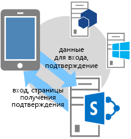
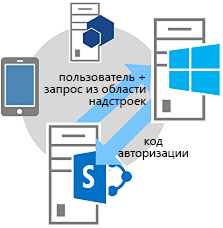

# <a name="authorization-code-oauth-flow-for-sharepoint-add-ins"></a><span data-ttu-id="13adc-102">Поток кода авторизации OAuth для надстроек SharePoint</span><span class="sxs-lookup"><span data-stu-id="13adc-102">Authorization Code OAuth flow for SharePoint Add-ins</span></span>
<span data-ttu-id="13adc-103">Сведения о потоке авторизации OAuth для надстроек, запрашивающих разрешение на доступ к ресурсам SharePoint во время работы, а также об использовании страницы OAuthAuthorize.aspx и URI перенаправления SharePoint.</span><span class="sxs-lookup"><span data-stu-id="13adc-103">Learn the OAuth flow for add-ins that request permission to access SharePoint resources on the fly, and how to use the OAuthAuthorize.aspx page and the SharePoint redirect URI.</span></span>
 

 <span data-ttu-id="13adc-p101">**Примечание.** В настоящее время идет процесс замены названия "приложения для SharePoint" названием "надстройки SharePoint". Во время этого процесса в документации и пользовательском интерфейсе некоторых продуктов SharePoint и средств Visual Studio может по-прежнему использоваться термин "приложения для SharePoint". Дополнительные сведения см. в статье [Новое название приложений для Office и SharePoint](new-name-for-apps-for-sharepoint.md#bk_newname).</span><span class="sxs-lookup"><span data-stu-id="13adc-p101">**Note**  The name "apps for SharePoint" is changing to "SharePoint Add-ins". During the transition, the documentation and the UI of some SharePoint products and Visual Studio tools might still use the term "apps for SharePoint". For details, see  [New name for apps for Office and SharePoint](new-name-for-apps-for-sharepoint.md#bk_newname).</span></span>
 


## <a name="get-an-overview-of-add-ins-that-request-access-permission-from-sharepoint-on-the-fly"></a><span data-ttu-id="13adc-107">Общие сведения о надстройках, запрашивающих разрешение на доступ из SharePoint во время выполнения</span><span class="sxs-lookup"><span data-stu-id="13adc-107">Get an overview of add-ins that request access permission from SharePoint on the fly</span></span>
<span data-ttu-id="13adc-108"><a name="Overview"> </a></span><span class="sxs-lookup"><span data-stu-id="13adc-108"><a name="Overview"> </a></span></span>


 <span data-ttu-id="13adc-p102">**Примечание.** В этой статье предполагается, что вы ознакомились со статьей [Создание надстроек SharePoint, использующих авторизацию с низким уровнем доверия](creating-sharepoint-add-ins-that-use-low-trust-authorization.md) и основными понятиями и принципами протокола OAuth. Дополнительные сведения об OAuth см. на сайте [OAuth.net](http://oauth.net/) и в описании [протокол авторизации в Интернете (oauth)](http://datatracker.ietf.org/doc/active/#oauth).</span><span class="sxs-lookup"><span data-stu-id="13adc-p102">**Note**  This article assumes that you are familiar with  [Creating SharePoint Add-ins that use low-trust authorization](creating-sharepoint-add-ins-that-use-low-trust-authorization.md) and with the concepts and principles behind OAuth. For more information about OAuth, see [OAuth.net](http://oauth.net/) and [Web Authorization Protocol (oauth)](http://datatracker.ietf.org/doc/active/#oauth).</span></span>
 

<span data-ttu-id="13adc-p103">В некоторых случаях надстройка может запрашивать разрешение на доступ к ресурсам SharePoint во время выполнения (т. е. **надстройка может запрашивать разрешение на доступ к ресурсам SharePoint динамически во время выполнения**, а не установки). Такие надстройки не обязательно должны запускаться из среды SharePoint или даже быть установленными в ней. Например, это может быть собственная надстройка устройства, надстройка, запускаемая на любом веб-сайте, или надстройка Office, запускаемая из приложения Office, которому требуется доступ к ресурсам SharePoint во время выполнения.</span><span class="sxs-lookup"><span data-stu-id="13adc-p103">In some scenarios, an add-in can request permission to access SharePoint resources on the fly; that is, an  **add-in can request permission to access SharePoint resources dynamically at runtime**, instead of at add-in installation time. This type of add-in does not have to be launched from, or even installed on, SharePoint. For example, it could be native device add-in, an add-in that is launched from any website, or an Office Add-in launched from an Office application that wants to access resources on SharePoint on the fly.</span></span>
 

 

 <span data-ttu-id="13adc-p104">**Примечание.** Надстройки этого типа могут запускать только пользователи с разрешениями "Управление" для всех ресурсов, к которым надстройка запрашивает доступ. Например, если надстройка запрашивает только разрешение на чтение веб-сайта, то пользователь, у которого есть права на чтение, но нет прав на управление для этого веб-сайта, не сможет запустить надстройку.</span><span class="sxs-lookup"><span data-stu-id="13adc-p104">**Note**  This type of add-in can only be run by users who have Manage permissions to the resources the add-in wants to access. For example, if an add-in requests only Read permission to a website, a user who has Read, but not Manage, rights to the website cannot run the add-in.</span></span>
 

<span data-ttu-id="13adc-p105">Чтобы вызывать SharePoint, такие **надстройки сначала нужно зарегистрировать** с помощью Панели мониторинга продаж или на странице appregnew.aspx. Дополнительные сведения о регистрации надстроек с помощью Панели мониторинга продаж и на странице appregnew.aspx см. в статье [Регистрация надстроек SharePoint 2013](register-sharepoint-add-ins.md).</span><span class="sxs-lookup"><span data-stu-id="13adc-p105">To be able to call into SharePoint, this type of  **add-in must first be registered** through the Seller Dashboard or the appregnew.aspx page. For more information about registering add-ins via the Seller Dashboard or appregnew.aspx, see [Register SharePoint Add-ins 2013](register-sharepoint-add-ins.md).</span></span>
 

 
<span data-ttu-id="13adc-p106">После регистрации надстройка станет  *субъектом безопасности*  и получит удостоверение, как и в случае с пользователями и группами. Такое удостоверение называетсясубъектом надстройки. Как и пользователи и группы, субъект надстройки имеет определенные разрешения. Подробнее о субъектах надстроек см. в статье  [Регистрация надстроек для SharePoint](register-sharepoint-add-ins.md).</span><span class="sxs-lookup"><span data-stu-id="13adc-p106">After you've registered your add-in, it is a  *security principal*  and has an identity just as users and groups do. This identity is referred to as anadd-in principal. Like users and groups, an add-in principal has certain permissions. For more information about add-in principals, see  [Register SharePoint Add-ins 2013](register-sharepoint-add-ins.md).</span></span>
 

 
<span data-ttu-id="13adc-p107">После регистрации надстройки вы получите идентификатор и секрет клиента, домен надстройки и URI перенаправления для субъекта надстройки. Эти сведения регистрируются на сервере авторизации Служба контроля доступа Microsoft Azure (ACS).</span><span class="sxs-lookup"><span data-stu-id="13adc-p107">When you register the add-in, you'll get a client id, client secret, add-in domain, and redirect URI for the add-in principal. This information is registered with the authorization server, Microsoft Azure Access Control Service (ACS).</span></span>
 

 

## <a name="understand-the-oauth-flow-for-add-ins-that-request-permissions-on-the-fly"></a><span data-ttu-id="13adc-124">Общие сведения о потоке OAuth для надстроек, запрашивающих разрешения во время выполнения</span><span class="sxs-lookup"><span data-stu-id="13adc-124">Understand the OAuth flow for add-ins that request permissions on the fly</span></span>
<span data-ttu-id="13adc-125"><a name="Flow"> </a></span><span class="sxs-lookup"><span data-stu-id="13adc-125"><a name="Flow"> </a></span></span>

<span data-ttu-id="13adc-p108">В этом разделе приведена сводная информация о потоке проверки подлинности и авторизации OAuth для надстройки SharePoint, запрашивающей разрешения во время выполнения. Такой поток называется **потоком кода проверки подлинности**. Здесь объясняется, как надстройка, запущенная вне SharePoint, может обращаться к ресурсам в SharePoint.</span><span class="sxs-lookup"><span data-stu-id="13adc-p108">This section summarizes the OAuth authentication and authorization flow for a SharePoint add-in requesting permissions on the fly. The flow is called  **the Authentication Code flow**. The sequence describes how an add-in that is not launched from within SharePoint can access resources in SharePoint.</span></span>
 

 

 <span data-ttu-id="13adc-p109">**Примечание.** Поток ** представляет собой серию операций взаимодействия между надстройкой, SharePoint, сервером авторизации (сервером управления доступом) и пользователем** во время выполнения. Таким образом, для взаимодействия с ACS потоку требуется SharePoint Online или ферма SharePoint, подключенная к Интернету. Фермы SharePoint, не подключенные к Интернету, должны использовать [систему авторизации с высоким уровнем доверия](creating-sharepoint-add-ins-that-use-high-trust-authorization.md).</span><span class="sxs-lookup"><span data-stu-id="13adc-p109">**Note**  The flow  **involves a series of interactions between your add-in, SharePoint, the authorization server (which is ACS), and the end user** at runtime. So, the flow requires either SharePoint Online or a SharePoint farm that is connected to the Internet so it can communicate with ACS. SharePoint farms that are not connected to the Internet must use [the high-trust authorization system](creating-sharepoint-add-ins-that-use-high-trust-authorization.md).</span></span>
 

<span data-ttu-id="13adc-p110">Требуется веб-приложение или служба, размещаемая отдельно от SharePoint. Даже надстройке для устройства требуется URL-адрес веб-приложения или службы, который можно зарегистрировать в службе контроля доступа (см. выше), даже если веб-компонент ни для чего больше не используется. Для простоты в этой статье в качестве примера надстройки рассмотрим веб-приложение Contoso.com. В нем используется клиентская объектная модель (CSOM) SharePoint или SharePoint REST API для вызовов SharePoint. Когда приложение впервые пытается получить доступ к SharePoint, SharePoint запрашивает код авторизации у службы контроля доступа, который она может отправить приложению Contoso.com. Затем приложение использует код авторизации для запроса маркера доступа из службы контроля доступа. Получив маркер доступа, приложение Contoso.com включает его во все свои запросы к SharePoint.</span><span class="sxs-lookup"><span data-stu-id="13adc-p110">There has to be a web application or service that is hosted separately from SharePoint. Even if the add-in is a device add-in, it has to have a web application or service URL that can be registered with ACS (see above), even if the web component is used for nothing else. For simplicity, this article will assume that the add-in is a web application called Contoso.com. The application uses the SharePoint client object model (CSOM) or the SharePoint REST APIs to make calls to SharePoint. When the application first attempts to access SharePoint, SharePoint requests an authorization code from ACS that it can send to the Contoso.com application. The application then uses the authorization code to request an access token from the ACS. Once it has the access token, the Contoso.com application includes it in all its requests to SharePoint.</span></span>
 

 

### <a name="see-a-detailed-example-of-the-flow"></a><span data-ttu-id="13adc-138">Подробный пример потока</span><span class="sxs-lookup"><span data-stu-id="13adc-138">See a detailed example of the flow</span></span>
<span data-ttu-id="13adc-139"><a name="Fly"> </a></span><span class="sxs-lookup"><span data-stu-id="13adc-139"><a name="Fly"> </a></span></span>

<span data-ttu-id="13adc-p111">Предположим, что компания Contoso предоставляет веб-службу фотопечати. Пользователь хочет распечатать фотографии. Для этого ему необходимо предоставить службе Contoso разрешение на доступ и печать фотографий из библиотек на сайте SharePoint Online,  `fabrikam.sharepoint.com`.</span><span class="sxs-lookup"><span data-stu-id="13adc-p111">Suppose that Contoso provides a photo-printing service online. A user wants to print some photos. The user wants to give consent to a Contoso photo-printing service to access and print photos from a set of photo libraries that the user keeps on an SharePoint Online site,  `fabrikam.sharepoint.com`.</span></span>
 

 

 

 
<span data-ttu-id="13adc-p112">Надстройка фотопечати зарегистрировано, поэтому у него уже есть идентификатор и секрет клиента, а также URI перенаправления. URI перенаправления, предоставленный Contoso при регистрации надстройки:  `https://contoso.com/RedirectAccept.aspx`. Сведения об идентификаторе и секрете клиента сохраняются в файле web.config надстройки фотопечати. Вот пример записи идентификатора и секрета клиента в файл web.config.</span><span class="sxs-lookup"><span data-stu-id="13adc-p112">The photo-printing application is registered, so, it has a client id, client secret, redirect URI. The redirect URI that Contoso provided when it registered the add-in is  `https://contoso.com/RedirectAccept.aspx`. The client id and client secret information are stored included in the photo-printing application's web.config file. The following is an example of how the client id and client secret are entered in the web.config file.</span></span>
 

 


```XML
<configuration>
  <appSettings>
    <add key="ClientId" value="c78d058c-7f82-44ca-a077-fba855e14d38 "/>
    <add key="ClientSecret" value="SbALAKghPXTjbBiLQZP+GnbmN+vrgeCMMvptbgk7T6w= "/>

  </appSettings>

</configuration>
```

<span data-ttu-id="13adc-148">Ниже перечислены этапы потока кода авторизации.</span><span class="sxs-lookup"><span data-stu-id="13adc-148">The following are the steps in the Authentication Code Flow.</span></span>
 

 

    
 <span data-ttu-id="13adc-p113">**Совет.** Эти действия ссылаются на методы в файле TokenHelper (с расширением CS или VB). Этот управляемый код не компилируется, поэтому для него нет справочных статей. Однако сам файл подробно прокомментирован с описанием каждого класса, параметра и возвращаемого значения. Вы можете открыть его копию, чтобы сверяться с ней по мере чтения данного руководства.</span><span class="sxs-lookup"><span data-stu-id="13adc-p113">**Tip**  These steps refer to methods in the TokenHelper.cs (or .vb) file. This managed code is not compiled, so there are no reference topics for it. However, the file itself is fully commented with descriptions of every class, member parameter, and return value. Consider having a copy of it open to refer to as you read these steps.</span></span>
 


|<span data-ttu-id="13adc-153">**Этап**</span><span class="sxs-lookup"><span data-stu-id="13adc-153">**Step**</span></span>||<span data-ttu-id="13adc-154">**Описание**</span><span class="sxs-lookup"><span data-stu-id="13adc-154">**Description**</span></span>|
|:-----|:-----|:-----|
|<span data-ttu-id="13adc-155">**1**</span><span class="sxs-lookup"><span data-stu-id="13adc-155">**1**</span></span>||<span data-ttu-id="13adc-p114">**Клиент открывает приложение и направляет его на сайт SharePoint для получения данных.** Пользователь переходит на веб-сайт фотопечати компании Contoso, где пользовательский интерфейс показывает, что пользователь может печатать фотографии, хранящиеся на любом сайте SharePoint Online. В этом примере используется URL-адрес `https://contoso.com/print/home.aspx`. Надстройка для фотопечати предлагает пользователю указать URL-адрес коллекции фотографий. Пользователь указывает URL-адрес, указывающий на сайт SharePoint Online: `https://fabrikam.sharepoint.com/`.</span><span class="sxs-lookup"><span data-stu-id="13adc-p114">**Client opens an application and then directs it to a SharePoint site for data.**A user browses to the Contoso photo-printing website, where the UI indicates that the user can print photos that are kept in any SharePoint Online site. Inn this example the URL is  `https://contoso.com/print/home.aspx`.The photo-printing add-in asks the user to enter the URL of the photo collection. The user enters a URL pointing to the SharePoint Online site:  `https://fabrikam.sharepoint.com/`.</span></span>|
|<span data-ttu-id="13adc-160">**2**</span><span class="sxs-lookup"><span data-stu-id="13adc-160">**2**</span></span>||<span data-ttu-id="13adc-p115">**Надстройка выполняет перенаправление на URL-адрес авторизации для сайта SharePoint.** Когда пользователь нажимает кнопку для получения фотографий, надстройка фотопечати Contoso направляет браузер по адресу `https://fabrikam.sharepoint.com/`. При этом возвращается отклик перенаправления HTTP 302. Если вы используете Microsoft .NET, то **Response.Redirect** — это не единственный способ выполнить перенаправление из кода. С помощью файла TokenHelper (с расширением CS или VB) проекта код может вызвать перегруженный метод **GetAuthorizationUrl** (используя перегрузку с тремя аргументами). Этот метод автоматически составляет URL-адрес перенаправления на страницу OAuthAuthorize.aspx. Кроме того, URL-адрес можно составлять вручную. Например, если вызвать метод **GetAuthorizationUrl** для составления URL-адреса перенаправления на страницу OAuthAuthorize.aspx в файле TokenHelper (с расширением CS или VB) проекта, то код будет выглядеть так: `Response.Redirect(TokenHelper.GetAuthorizationUrl(` `sharePointSiteUrl.ToString(),` `"Web.Read List.Write",` `"https://contoso.com/RedirectAccept.aspx"));` Изучив перегрузку метода **GetAuthorizationUrl** в файле TokenHelper (с расширением CS или VB) с тремя параметрами, вы увидите, что второй параметр — это параметр области разрешений, представляющий собой разделенный пробелами список запрашиваемых надстройкой разрешений в сокращенном формате. Дополнительные сведения об областях разрешений см. в разделе [Общие сведения о псевдонимах областей разрешений и использовании страницы OAuthAuthorize.aspx](#Scope). В качестве третьего параметра необходимо указать тот же URI перенаправления, что и при регистрации надстройки. Дополнительные сведения о регистрации см. в статье [Регистрация надстроек SharePoint 2013](register-sharepoint-add-ins.md). Вы также увидите, что возвращаемая строка представляет собой URL-адрес, включающий параметры строки запроса. При желании вы можете вручную составить URL-адрес перенаправления на страницу OAuthAuthorize.aspx. Например, в данном случае надстройка фотопечати Contoso направляет пользователя на следующий URL-адрес: `https://fabrikam.sharepoint.com/_layouts/15/OAuthAuthorize.aspx?client_id=client_GUID&amp;scope=app_permissions_list&amp;response_type=code&amp;redirect_uri=redirect_uri` Как видно из примеров, надстройка фотопечати Contoso отправляет код клиента OAuth и URI перенаправления на сайт Fabrikam в виде параметров строки запроса. Ниже представлен пример запроса GET со значениями строки запроса. Разрывы строк добавлены для наглядности. Фактический URL-адрес представляет собой одну строку. `GET /authcode HTTP/1.1` `Host: fabrikam.sharepoint.com` `/oauthauthorize.aspx` `?client_id= c78d058c-7f82-44ca-a077-fba855e14d38` `&amp;scope=list.read` `&amp;response_type=code` `&amp;redirect_uri= https%3A%2F%2Fcontoso%2Ecom%2Fredirectaccept.aspx` Чтобы создать отдельное всплывающее диалоговое окно согласия, вы можете добавить к URL-адресу параметр запроса **IsDlg=1**, как показано здесь: `/oauthauthorize.aspx?IsDlg=1&amp;client_id= c78d058c-7f82-44ca-a077-fba855e14d38&amp;scope=list.read&amp;response_type=code&amp;redirect_uri= https%3A%2F%2Fcontoso%2Ecom%2Fredirectaccept.aspx`</span><span class="sxs-lookup"><span data-stu-id="13adc-p115">**The add-in redirects to the SharePoint site authorization URL.**When the user clicks the button to get the photos, the Contoso photo-printing add-in redirects the browser to  `https://fabrikam.sharepoint.com/`. This redirect is a HTTP 302 Redirect Response.If you're using Microsoft .NET,  **Response.Redirect** is one of several ways you can do the redirect from your code. Using the TokenHelper.cs (or .vb) file in your project, your code can call the overloaded **GetAuthorizationUrl** method (using the overload with three arguments). This method constructs the OAuthAuthorize.aspx redirect URL for you. Or, your code can manually construct the URL.For example, if you choose to call the  **GetAuthorizationUrl** method to construct the OAuthAuthorize.aspx redirect URL for you, using the TokenHelper.cs (or .vb) in your project, the code is as follows: `Response.Redirect(TokenHelper.GetAuthorizationUrl(`  `sharePointSiteUrl.ToString(),`  `"Web.Read List.Write",`  `"https://contoso.com/RedirectAccept.aspx"));`If you look at the three-parameter overload of the  **GetAuthorizationUrl** method in TokenHelper.cs (or .vb), you see that the second parameter is a permission scope parameter, which is a space-delimited list of permissions the add-in requests in shorthand format. For more information about permission scopes, see [Understand permission scope aliases and the use of the OAuthAuthorize.aspx page](#Scope). The third parameter must be the same redirect URI that is used when the add-in is registered. For more information about registration, see  [Register SharePoint Add-ins 2013](register-sharepoint-add-ins.md). You will also see that the returned string is a URL including query string parameters.If you prefer, you can manually construct the OAuthAuthorize.aspx redirect URL. For example, the URL that the Contoso photo-printing add-in redirects the user to in this case is: `https://fabrikam.sharepoint.com/_layouts/15/OAuthAuthorize.aspx?client_id=client_GUID&amp;scope=app_permissions_list&amp;response_type=code&amp;redirect_uri=redirect_uri`As the example show, the Contoso photo-printing add-in sends the OAuth client Id and redirect URI to the Fabrikam site as query string parameters. The following is an example of the GET request with sample query string values. Line breaks have been added for clarity. The actual target URL is a single line. `GET /authcode HTTP/1.1`  `Host: fabrikam.sharepoint.com`   `/oauthauthorize.aspx`  `?client_id= c78d058c-7f82-44ca-a077-fba855e14d38`  `&amp;scope=list.read`  `&amp;response_type=code`  `&amp;redirect_uri= https%3A%2F%2Fcontoso%2Ecom%2Fredirectaccept.aspx` If you want a separate consent pop-up dialog, you can add the query parameter  **IsDlg=1** to the URL construct as shown here: `/oauthauthorize.aspx?IsDlg=1&amp;client_id= c78d058c-7f82-44ca-a077-fba855e14d38&amp;scope=list.read&amp;response_type=code&amp;redirect_uri= https%3A%2F%2Fcontoso%2Ecom%2Fredirectaccept.aspx`</span></span>|
|<span data-ttu-id="13adc-176">**3**</span><span class="sxs-lookup"><span data-stu-id="13adc-176">**3**</span></span>||<span data-ttu-id="13adc-p116">**В SharePoint отображается страница согласия, чтобы пользователь мог предоставить надстройке разрешения.** Если пользователь еще не вошел на сайт SharePoint Online компании Fabrikam, ему будет предложено войти. Когда пользователь выполнит вход, в SharePoint появится HTML-страница согласия. На этой странице пользователю предлагается предоставить надстройке фотопечати Contoso запрашиваемые разрешения (или отказать в их предоставлении). В этом случае пользователь предоставляет надстройке разрешение на чтение библиотеки фотографий пользователя на сайте Fabrikam.</span><span class="sxs-lookup"><span data-stu-id="13adc-p116">**SharePoint displays the consent page so the user can grant the add-in permissions.**If the user is not already signed into the Fabrikam SharePoint Online site, the user is prompted to sign in. When the user is signed in, SharePoint renders an HTML consent page.The consent page prompts the user to grant (or deny) the Contoso photo-printing add-in the permissions that the add-in requests. In this case, the user would be granting the add-in read access to the user's picture library on Fabrikam.</span></span>|
|<span data-ttu-id="13adc-181">**4**</span><span class="sxs-lookup"><span data-stu-id="13adc-181">**4**</span></span>||<span data-ttu-id="13adc-183">**SharePoint запрашивает временный код авторизации из ACS.** Сайт SharePoint Online компании Fabrikam отправляет в ACS запрос на создание кода авторизации с коротким сроком действия (примерно 5 минут), уникального для этого сочетания пользователя и надстройки. ACS отправляет код авторизации на сайт Fabrikam.</span><span class="sxs-lookup"><span data-stu-id="13adc-183">**SharePoint requests a short-lived authorization code from ACS.**The Fabrikam SharePoint Online site asks ACS to create a short-lived (approximately 5 minutes) authorization code unique to this combination of user and add-in.ACS sends the authorization code to the Fabrikam site.</span></span>|
|<span data-ttu-id="13adc-184">**5**</span><span class="sxs-lookup"><span data-stu-id="13adc-184">**5**</span></span>||<span data-ttu-id="13adc-p117">**Сайт SharePoint Online выполняет перенаправление на зарегистрированный URI перенаправления, передавая код авторизации надстройке.**Сайт Fabrikam SharePoint Online перенаправляет браузер обратно в Contoso с помощью отклика HTTP 302. В соответствующем URL-адресе используется URI перенаправления, указанный при регистрации надстройки фотопечати, а также строка запроса кода авторизации. Структура URL-адреса перенаправления выглядит так: `https://contoso.com/RedirectAccept.aspx?code=<authcode>`</span><span class="sxs-lookup"><span data-stu-id="13adc-p117">**The SharePoint Online site redirects to the app's registered redirect URI, passing the authorization code to the add-in.**The Fabrikam SharePoint Online site redirects the browser back to Contoso via HTTP 302 Response. The URL construct for this redirection uses the redirect URI that was specified when the photo-printing add-in was registrated. It also includes the authorization code as a query string. The redirect URL is structured like the following: `https://contoso.com/RedirectAccept.aspx?code=<authcode>`</span></span>|
|<span data-ttu-id="13adc-190">**6**</span><span class="sxs-lookup"><span data-stu-id="13adc-190">**6**</span></span>||<span data-ttu-id="13adc-p118">**С помощью кода авторизации надстройка запрашивает маркер доступа с сервера управления доступом, который проверяет запрос, аннулирует код авторизации, а затем отправляет маркер доступа и обновления надстройке.** Contoso получает код авторизации из параметра запроса, а затем включает его (вместе с идентификатором и секретом клиента) в запрос маркера доступа из ACS. Если вы используете управляемый код и SharePoint CSOM, файл TokenHelper (с расширением CS или VB), то запрос к ACS отправляется с помощью метода **GetClientContextWithAuthorizationCode**. В этом случае код выглядит примерно так (где `authCode` — это переменная, которой присвоен код авторизации): `TokenHelper.GetClientContextWithAuthorizationCode(` `"https://fabrikam.sharepoint.com/",` `"00000003-0000-0ff1-ce00-000000000000",` `authCode,` `"1ee82b34-7c1b-471b-b27e-ff272accd564",` `new Uri(Request.Url.GetLeftPart(UriPartial.Path)));` В файле TokenHelper (с расширением CS или VB) второй параметр метода **GetClientContextWithAuthorizationCode** — это `targetPrincipalName`. Это значение всегда равно `00000003-0000-0ff1-ce00-000000000000` в надстройке, получающей доступ к SharePoint. Отследив иерархию вызовов из метода **GetClientContextWithAuthorizationCode**, вы увидите, что он также получает код и секрет клиента из файла web.config. ACS получает запрос от Contoso и проверяет идентификатор клиента, секрет клиента, URI перенаправления и код авторизации. Если все они действительны, ACS аннулирует код авторизации (его можно использовать только один раз) и создает маркеры обновления и доступа, а затем возвращает их надстройке Contoso. Приложение Contoso может кэшировать этот маркер доступа для повторного использования в последующих запросах. По умолчанию срок действия маркеров доступа составляет примерно 12 часов. Каждый маркер доступа связан с учетной записью пользователя, указанной в первоначальном запросе на авторизацию, и предоставляет доступ только к тем службам, которые указаны в этом запросе. Надстройка должна надежно сохранить маркер доступа. Приложение Contoso также может кэшировать маркер обновления. По умолчанию срок действия маркеров обновления составляет 6 месяцев. Маркер обновления можно обменять на новый маркер доступа из ACS по истечении срока действия маркера доступа. Дополнительные сведения о маркерах см. в статье [Обработка маркеров безопасности в надстройках SharePoint с низким уровнем доверия, размещенных у поставщика](handle-security-tokens-in-provider-hosted-low-trust-sharepoint-add-ins.md).</span><span class="sxs-lookup"><span data-stu-id="13adc-p118">**The add-in uses the authorization code to request an access token from ACS, which validates the request, invalidates the authorization code, and then sends access and refresh tokens to the add-in.**Contoso retrieves the authorization code from the query parameter, and then includes it, along with the client ID and client secret, in a request to ACS for an access token.If you are using managed code and the SharePoint CSOM, the TokenHelper.cs (or .vb) file, the method that makes the request to ACS is  **GetClientContextWithAuthorizationCode**. In this case the code looks similar to the following (where  `authCode` is a variable to which the authorization code has been assigned): `TokenHelper.GetClientContextWithAuthorizationCode(`  `"https://fabrikam.sharepoint.com/",`  `"00000003-0000-0ff1-ce00-000000000000",`  `authCode,`  `"1ee82b34-7c1b-471b-b27e-ff272accd564",`  `new Uri(Request.Url.GetLeftPart(UriPartial.Path)));` If you look at the TokenHelper.cs (or .vb) file, the second parameter of the  **GetClientContextWithAuthorizationCode** method is the `targetPrincipalName`. This value is always the constant " `00000003-0000-0ff1-ce00-000000000000`" in an add-in that is accessing SharePoint. You will also see, if you trace the call hierarchy from  **GetClientContextWithAuthorizationCode**, that it obtains the client ID and secret from the web.config file.ACS receives Contoso's request and validates the client ID, client secret, redirect URI, and authorization code. If all are valid, the ACS invalidates the authorization code (it can be used only once) and creates a refresh token and an access token, which it returns to Contoso.The Contoso application can cache this access token for reuse on later requests. By default, access tokens are good for about 12 hours. Each access token is specific to the user account that is specified in the original request for authorization, and grants access only to the services that are specified in that request. Your add-in should store the access token securely.The Contoso application can also cache the refresh token. By default, refresh tokens are good for 6 months. The refresh token can be redeemed for a new access token from ACS whenever the access token expires. For more information about tokens, see  [Handle security tokens in provider-hosted low-trust SharePoint Add-ins](handle-security-tokens-in-provider-hosted-low-trust-sharepoint-add-ins.md).</span></span>|
|<span data-ttu-id="13adc-203">**7**</span><span class="sxs-lookup"><span data-stu-id="13adc-203">**7**</span></span>||<span data-ttu-id="13adc-p119">**Теперь надстройка может использовать маркер доступа, чтобы запрашивать с сайта SharePoint данные, которые можно показать пользователю.** Надстройка Contoso включает маркер доступа для отправки вызова REST API или запроса CSOM в SharePoint, передавая маркер доступа OAuth в заголовке HTTP **Authorization**. SharePoint возвращает сведения, запрашиваемые надстройкой Contoso. Дополнительные сведения о том, как отправляется этот запрос, см. в статье [Обработка маркеров безопасности в надстройках SharePoint с низким уровнем доверия, размещенных у поставщика](handle-security-tokens-in-provider-hosted-low-trust-sharepoint-add-ins.md).</span><span class="sxs-lookup"><span data-stu-id="13adc-p119">**The add-in can now use the access token to request data from the SharePoint site which it can display to the user.**Contoso includes the access token to make a REST API call or CSOM request to SharePoint, passing the OAuth access token in the HTTP  **Authorization** header.SharePoint returns the information that Contoso requested. For more about how this request is made, see  [Handle security tokens in provider-hosted low-trust SharePoint Add-ins](handle-security-tokens-in-provider-hosted-low-trust-sharepoint-add-ins.md).</span></span>|

## <a name="understand-permission-scope-aliases-and-the-use-of-the-oauthauthorizeaspx-page"></a><span data-ttu-id="13adc-207">Общие сведения о псевдонимах областей разрешений и использовании страницы OAuthAuthorize.aspx</span><span class="sxs-lookup"><span data-stu-id="13adc-207">Understand permission scope aliases and the use of the OAuthAuthorize.aspx page</span></span>
<span data-ttu-id="13adc-208"><a name="Scope"> </a></span><span class="sxs-lookup"><span data-stu-id="13adc-208"><a name="Scope"> </a></span></span>

<span data-ttu-id="13adc-p120">В этом разделе предполагается, что вы ознакомились со статьей  [Разрешения для надстроек в SharePoint](add-in-permissions-in-sharepoint.md). В таблице 1 показаны URI областей запросов разрешений надстроек, описанные в этой статье, а также дополнительный столбец ( **Псевдоним области** ). Право FullControl недоступно в столбце **Доступные права**, так как надстройка, запрашивающая разрешение на доступ к ресурсам SharePoint во время выполнения, не может запросить право на полный доступ.</span><span class="sxs-lookup"><span data-stu-id="13adc-p120">This section assumes you are familiar with the article  [Add-in permissions in SharePoint](add-in-permissions-in-sharepoint.md). Table 1 shows the same add-in permission request scope URIs that are shown in that article, except it has one additional column ( **Scope Alias** ) and the FullControl right is not available in the **Available Rights** column, because an add-in that request permission to access SharePoint resources on the fly can't request full control right.</span></span>
 

 
<span data-ttu-id="13adc-p121">Значения в столбце **Псевдоним области** — это сокращенные версии значений из столбца **URI области**. Эти псевдонимы могут использовать только надстройки, запрашивающие разрешение на доступ к ресурсам SharePoint во время выполнения. (Значения URI области используются в манифестах надстроек, которые запускаются из SharePoint. Эти надстройки запрашивают доступ при установке.)</span><span class="sxs-lookup"><span data-stu-id="13adc-p121">The values listed in the  **Scope Alias** column are shorthand versions of their counterparts in the **Scope URI** column. The aliases can be used only by add-ins that request permission to access SharePoint resources on the fly. (The scope URI values are used in the add-in manifest of add-ins that are launched from SharePoint. These add-ins request permissions during add-in installation.)</span></span>
 

 
<span data-ttu-id="13adc-p122">Псевдонимы областей используются только в контексте использования страницы перенаправления OAuthAuthorize.aspx. Как показано на этапе 2 потока OAuth в предыдущем разделе, если надстройка использует управляемый код, псевдонимы применяются при вызове метода **GetAuthorizationUrl** из файла TokenHelper (с расширением CS или VB) в проекте. Вот еще один пример:</span><span class="sxs-lookup"><span data-stu-id="13adc-p122">The scope aliases are used only in the context of using the OAuthAuthorize.aspx redirect page. As shown in step 2 of the OAuth flow described in the previous section, when the add-in is using managed code, the aliases are used when you call the  **GetAuthorizationUrl** method of TokenHelper.cs (or .vb) in your project. The following is another example:</span></span>
 

 


```C#
Response.Redirect(TokenHelper.GetAuthorizationUrl(
    sharePointSiteUrl.ToString(), 
    "Web.Read List.Write ", 
    "https://contoso.com/RedirectAccept.aspx "));
```

<span data-ttu-id="13adc-p123">Значение параметра  _scope_,  `Web.Read List.Write` это пример запроса разрешений по псевдониму области. Параметр _scope_ это набор запросов областей разрешений и прав с разделителями-пробелами.</span><span class="sxs-lookup"><span data-stu-id="13adc-p123">The  _scope_ parameter value, `Web.Read List.Write`, is an example of how you would request permissions using the scope aliases. The  _scope_ parameter is a space-delimited set of permission scope and right requests.</span></span>
 

 
<span data-ttu-id="13adc-p124">Если вы не используете управляемый код, в поле области URL-адреса перенаправления используются псевдонимы областей. Пример:</span><span class="sxs-lookup"><span data-stu-id="13adc-p124">If you are not using managed code, the scope aliases are used in the scope field in the redirect URL. For example:</span></span>
 

 
 `https://fabrikam.sharepoint.com/_layout/15/OAuthAuthorize.aspx?client_id=c78d058c-7f82-44ca-a077-fba855e14d38&amp;scope=list.write&amp;response_type=code&amp;redirect_uri=https%3A%2F%2Fcontoso%2Ecom%2Fredirectaccept.aspx`
 

 

 <span data-ttu-id="13adc-222">**Примечание.** Описание областей см. в статье [Разрешения для надстроек в SharePoint](add-in-permissions-in-sharepoint.md).</span><span class="sxs-lookup"><span data-stu-id="13adc-222">**Note**  For a description of the scopes, see  [Add-in permissions in SharePoint](add-in-permissions-in-sharepoint.md).</span></span>
 


<span data-ttu-id="13adc-223">**Таблица 1. URI областей разрешений для надстроек SharePoint и соответствующие псевдонимы**</span><span class="sxs-lookup"><span data-stu-id="13adc-223">**Table 1. SharePoint add-in permission request scope URIs and their corresponding aliases**</span></span>

|<span data-ttu-id="13adc-224">**URI области**</span><span class="sxs-lookup"><span data-stu-id="13adc-224">**Scope URI**</span></span>|<span data-ttu-id="13adc-225">**Псевдоним области**</span><span class="sxs-lookup"><span data-stu-id="13adc-225">**Scope Alias**</span></span>|<span data-ttu-id="13adc-226">**Доступные права**</span><span class="sxs-lookup"><span data-stu-id="13adc-226">**Available Rights**</span></span>|
|:-----|:-----|:-----|
|<span data-ttu-id="13adc-227">http://sharepoint/content/sitecollection</span><span class="sxs-lookup"><span data-stu-id="13adc-227">http://sharepoint/content/sitecollection</span></span>|<span data-ttu-id="13adc-228">Сайт</span><span class="sxs-lookup"><span data-stu-id="13adc-228">Site</span></span>|<span data-ttu-id="13adc-229">Чтение, запись, управление</span><span class="sxs-lookup"><span data-stu-id="13adc-229">Read, Write, Manage</span></span>|
|<span data-ttu-id="13adc-230">http://sharepoint/content/sitecollection/web</span><span class="sxs-lookup"><span data-stu-id="13adc-230">http://sharepoint/content/sitecollection/web</span></span>|<span data-ttu-id="13adc-231">Веб</span><span class="sxs-lookup"><span data-stu-id="13adc-231">Web</span></span>|<span data-ttu-id="13adc-232">Чтение, запись, управление</span><span class="sxs-lookup"><span data-stu-id="13adc-232">Read, Write, Manage</span></span>|
|<span data-ttu-id="13adc-233">http://sharepoint/content/sitecollection/web/list</span><span class="sxs-lookup"><span data-stu-id="13adc-233">http://sharepoint/content/sitecollection/web/list</span></span>|<span data-ttu-id="13adc-234">Перечисление</span><span class="sxs-lookup"><span data-stu-id="13adc-234">List</span></span>|<span data-ttu-id="13adc-235">Чтение, запись, управление</span><span class="sxs-lookup"><span data-stu-id="13adc-235">Read, Write, Manage</span></span>|
|<span data-ttu-id="13adc-236">http://sharepoint/content/tenant</span><span class="sxs-lookup"><span data-stu-id="13adc-236">http://sharepoint/content/tenant</span></span>|<span data-ttu-id="13adc-237">AllSites</span><span class="sxs-lookup"><span data-stu-id="13adc-237">AllSites</span></span>|<span data-ttu-id="13adc-238">Чтение, запись, управление</span><span class="sxs-lookup"><span data-stu-id="13adc-238">Read, Write, Manage</span></span>|
|<span data-ttu-id="13adc-239">http://sharepoint/bcs/connection</span><span class="sxs-lookup"><span data-stu-id="13adc-239">http://sharepoint/bcs/connection</span></span>|<span data-ttu-id="13adc-240">Нет (сейчас не поддерживается)</span><span class="sxs-lookup"><span data-stu-id="13adc-240">None (currently not supported)</span></span>|<span data-ttu-id="13adc-241">Чтение</span><span class="sxs-lookup"><span data-stu-id="13adc-241">Read</span></span>|
|<span data-ttu-id="13adc-242">http://sharepoint/search</span><span class="sxs-lookup"><span data-stu-id="13adc-242">http://sharepoint/search</span></span>|<span data-ttu-id="13adc-243">Поиск</span><span class="sxs-lookup"><span data-stu-id="13adc-243">Search</span></span>|<span data-ttu-id="13adc-244">QueryAsUserIgnoreAppPrincipal</span><span class="sxs-lookup"><span data-stu-id="13adc-244">QueryAsUserIgnoreAppPrincipal</span></span>|
|<span data-ttu-id="13adc-245">http://sharepoint/projectserver</span><span class="sxs-lookup"><span data-stu-id="13adc-245">http://sharepoint/projectserver</span></span>|<span data-ttu-id="13adc-246">ProjectAdmin</span><span class="sxs-lookup"><span data-stu-id="13adc-246">ProjectAdmin</span></span> |<span data-ttu-id="13adc-247">Управление</span><span class="sxs-lookup"><span data-stu-id="13adc-247">Manage</span></span>|
|<span data-ttu-id="13adc-248">http://sharepoint/projectserver/projects</span><span class="sxs-lookup"><span data-stu-id="13adc-248">http://sharepoint/projectserver/projects</span></span>|<span data-ttu-id="13adc-249">Проекты</span><span class="sxs-lookup"><span data-stu-id="13adc-249">Projects</span></span>|<span data-ttu-id="13adc-250">Чтение, запись</span><span class="sxs-lookup"><span data-stu-id="13adc-250">Read, Write</span></span>|
|<span data-ttu-id="13adc-251">http://sharepoint/projectserver/projects/project</span><span class="sxs-lookup"><span data-stu-id="13adc-251">http://sharepoint/projectserver/projects/project</span></span>|<span data-ttu-id="13adc-252">Project </span><span class="sxs-lookup"><span data-stu-id="13adc-252">Project</span></span>|<span data-ttu-id="13adc-253">Чтение, запись</span><span class="sxs-lookup"><span data-stu-id="13adc-253">Read, Write</span></span>|
|<span data-ttu-id="13adc-254">http://sharepoint/projectserver/enterpriseresources</span><span class="sxs-lookup"><span data-stu-id="13adc-254">http://sharepoint/projectserver/enterpriseresources</span></span>|<span data-ttu-id="13adc-255">ProjectResources</span><span class="sxs-lookup"><span data-stu-id="13adc-255">ProjectResources</span></span>|<span data-ttu-id="13adc-256">Чтение, запись</span><span class="sxs-lookup"><span data-stu-id="13adc-256">Read, Write</span></span>|
|<span data-ttu-id="13adc-257">http://sharepoint/projectserver/statusing</span><span class="sxs-lookup"><span data-stu-id="13adc-257">http://sharepoint/projectserver/statusing</span></span>|<span data-ttu-id="13adc-258">ProjectStatusing</span><span class="sxs-lookup"><span data-stu-id="13adc-258">ProjectStatusing</span></span>|<span data-ttu-id="13adc-259">SubmitStatus</span><span class="sxs-lookup"><span data-stu-id="13adc-259">SubmitStatus</span></span>|
|<span data-ttu-id="13adc-260">http://sharepoint/projectserver/reporting</span><span class="sxs-lookup"><span data-stu-id="13adc-260">http://sharepoint/projectserver/reporting</span></span>|<span data-ttu-id="13adc-261">ProjectReporting</span><span class="sxs-lookup"><span data-stu-id="13adc-261">ProjectReporting</span></span>|<span data-ttu-id="13adc-262">Чтение</span><span class="sxs-lookup"><span data-stu-id="13adc-262">Read</span></span>|
|<span data-ttu-id="13adc-263">http://sharepoint/projectserver/workflow</span><span class="sxs-lookup"><span data-stu-id="13adc-263">http://sharepoint/projectserver/workflow</span></span>|<span data-ttu-id="13adc-264">ProjectWorkflow</span><span class="sxs-lookup"><span data-stu-id="13adc-264">ProjectWorkflow</span></span>|<span data-ttu-id="13adc-265">Повышение прав</span><span class="sxs-lookup"><span data-stu-id="13adc-265">Elevate</span></span>|
|<span data-ttu-id="13adc-266">http://sharepoint/social/tenant</span><span class="sxs-lookup"><span data-stu-id="13adc-266">http://sharepoint/social/tenant</span></span>|<span data-ttu-id="13adc-267">AllProfiles</span><span class="sxs-lookup"><span data-stu-id="13adc-267">AllProfiles</span></span>|<span data-ttu-id="13adc-268">Чтение, запись, управление</span><span class="sxs-lookup"><span data-stu-id="13adc-268">Read, Write, Manage</span></span>|
|<span data-ttu-id="13adc-269">http://sharepoint/social/core</span><span class="sxs-lookup"><span data-stu-id="13adc-269">http://sharepoint/social/core</span></span>|<span data-ttu-id="13adc-270">Сообщество</span><span class="sxs-lookup"><span data-stu-id="13adc-270">Social</span></span>|<span data-ttu-id="13adc-271">Чтение, запись, управление</span><span class="sxs-lookup"><span data-stu-id="13adc-271">Read, Write, Manage</span></span>|
|<span data-ttu-id="13adc-272">http://sharepoint/social/microfeed</span><span class="sxs-lookup"><span data-stu-id="13adc-272">http://sharepoint/social/microfeed</span></span>|<span data-ttu-id="13adc-273">Microfeed</span><span class="sxs-lookup"><span data-stu-id="13adc-273">Microfeed</span></span>|<span data-ttu-id="13adc-274">Чтение, запись, управление</span><span class="sxs-lookup"><span data-stu-id="13adc-274">Read, Write, Manage</span></span>|
|<span data-ttu-id="13adc-275">http://sharepoint/taxonomy</span><span class="sxs-lookup"><span data-stu-id="13adc-275">http://sharepoint/taxonomy</span></span>|<span data-ttu-id="13adc-276">TermStore</span><span class="sxs-lookup"><span data-stu-id="13adc-276">TermStore</span></span>|<span data-ttu-id="13adc-277">Чтение, запись</span><span class="sxs-lookup"><span data-stu-id="13adc-277">Read, Write</span></span>|

## <a name="learn-how-to-use-a-redirect-uri-and-see-a-sample-redirect-page"></a><span data-ttu-id="13adc-278">Сведения о том, как использовать URI-перенаправления, и пример таблицы перенаправления</span><span class="sxs-lookup"><span data-stu-id="13adc-278">Learn how to use a redirect URI and see a sample redirect page</span></span>
<span data-ttu-id="13adc-279"><a name="RedirectURI"> </a></span><span class="sxs-lookup"><span data-stu-id="13adc-279"><a name="RedirectURI"> </a></span></span>


 

 
<span data-ttu-id="13adc-p125">**URI перенаправления**, используемый надстройками, которые запрашивают разрешения во время выполнения, — **это URI, на который SharePoint перенаправляет браузер после получения согласия** (с кодом авторизации, указанным в качестве параметра запроса). На этапе 2 представленного выше описания потока приводится пример, где URI жестко задан в вызове метода **GetAuthorizationUrl**. При необходимости надстройка ASP.NET также может сохранить URI перенаправления в файле web.config, как показано в следующем примере:</span><span class="sxs-lookup"><span data-stu-id="13adc-p125">The  **redirect URI** that is used by add-ins that request permission on the fly **is the URI that SharePoint redirects the browser to after consent is granted** (with the authorization code included as a query parameter). Step 2 of the flow description above gives an example where the URI is hardcoded in a call to **GetAuthorizationUrl** method. Alternatively, an ASP.NET add-in can also store the redirect URI in the web.config file as shown in this example:</span></span>
 

 


```XML
<configuration>
  <appSettings>
    <add key="RedirectUri" value="https://contoso.com/RedirectAccept.aspx" />
  </appSettings>
<configuration>
```

<span data-ttu-id="13adc-283">Это значение можно получить, вызвав метод `WebConfigurationManager.AppSettings.Get("RedirectUri")`.</span><span class="sxs-lookup"><span data-stu-id="13adc-283">The value can be retrieved with a call to  `WebConfigurationManager.AppSettings.Get("RedirectUri")`.</span></span>
 

 
<span data-ttu-id="13adc-p126">**Конечная точка в URI перенаправления получает код авторизации из параметра запроса и получает с его помощью маркер доступа**, который затем можно использовать для доступа к SharePoint. Как правило, конечной точкой является та же страница либо тот же метод контроллера или веб-метод, которые изначально пытались получить доступ к SharePoint. Однако это может быть страница или метод, которые только получают маркер авторизации, а затем выполняют перенаправление к другой странице или другому методу. Специальная страница или метод могут передать маркер авторизации или кэшировать его (срок действия этого маркера составляет примерно 5 минут). Кроме того, они могут получить маркер доступа с помощью маркера авторизации и кэшировать его.</span><span class="sxs-lookup"><span data-stu-id="13adc-p126">The  **endpoint at the redirect URI gets the authorization code from the query parameter and uses it to get an access token**, which can then be used to access SharePoint. Typically, the endpoint is the same page, or controller method, or web method that originally attempted to access SharePoint. However, it can be a page or method that only receives the authorization token and then redirects to another page or method. The special page or method could pass the authorization token or cache it. (It has a lifetime of about 5 minutes.) Alternatively, it could use the authorization token to obtain an access token which it caches.</span></span>
 

 
<span data-ttu-id="13adc-p127">Ниже приведен пример кода такой страницы в приложении ASP.NET. Обратите внимание на указанные ниже особенности этого кода.</span><span class="sxs-lookup"><span data-stu-id="13adc-p127">The following is an example of the code behind of such a page in an ASP.NET application. Note the following about this code:</span></span>
 

 

- <span data-ttu-id="13adc-291">В нем используется файл TokenHelper.cs, который создают Инструменты разработчика Office для Visual Studio.</span><span class="sxs-lookup"><span data-stu-id="13adc-291">It uses the TokenHelper.cs file that is generated by the Office Developer Tools for Visual Studio.</span></span>
    
 
- <span data-ttu-id="13adc-p128">В коде предполагается, что существует параметр запроса "code", содержащий код авторизации. Это безопасно, так как страницу вызывает только SharePoint и только при передаче кода авторизации.</span><span class="sxs-lookup"><span data-stu-id="13adc-p128">The code assumes that there is a "code" query parameter that holds an authorization code. This is safe because the page is only called by SharePoint and only when it is passing an authorization code.</span></span>
    
 
- <span data-ttu-id="13adc-294">В нем используется клиентский объект контекста CSOM для доступа к SharePoint, но можно также просто кэшировать этот объект на сервере и перейти на другую страницу.</span><span class="sxs-lookup"><span data-stu-id="13adc-294">It uses the CSOM client context object to access SharePoint, but it could also have simply cached that object on the server and redirected to another page.</span></span>
    
 
- <span data-ttu-id="13adc-p129">Метод **GetClientContextWithAuthorizationCode** получает код доступа с помощью кода авторизации. Затем он создает объект контекста клиента SharePoint и меняет обработчик объекта для события **ExecutingWebRequest** так, чтобы обработчик включал маркер доступа во всех запросах к SharePoint. По сути, маркер доступа кэшируется в объекте.</span><span class="sxs-lookup"><span data-stu-id="13adc-p129">The  **GetClientContextWithAuthorizationCode** method uses the authorization code to obtain an access code. It then creates a SharePoint client context object and modifies the object's handler for the **ExecutingWebRequest** event so that the handler will include the access token in all requests to SharePoint. The access token is, in effect, cached inside the object.</span></span>
    
 
- <span data-ttu-id="13adc-p130">Метод **GetClientContextWithAuthorizationCode** отправляет службе контроля доступа URL-адрес перенаправления в параметре `rUrl`, но ACS использует его для идентификации в случае кражи кода авторизации. ACS не использует его для повторного перенаправления, поэтому не создает бесконечный цикл, перенаправляя на самого себя.</span><span class="sxs-lookup"><span data-stu-id="13adc-p130">The  **GetClientContextWithAuthorizationCode** method sends the redirect URL back to ACS in the `rUrl` parameter, but ACS uses it as a form of identification in case the authorization code has been stolen. ACS does not use it to redirect again, so this code does not loop endlessly redirecting to itself.</span></span>
    
 
- <span data-ttu-id="13adc-p131">В коде не предусмотрена возможность работы с маркером доступа с истекшим сроком действия. После создания клиентского объекта контекста он продолжает использоваться тот же маркер доступа. Маркер обновления вообще не используется. Это правильная стратегия для надстроек, используемых только в сеансах, которые длятся менее времени существования маркера доступа.</span><span class="sxs-lookup"><span data-stu-id="13adc-p131">The code makes no provision for dealing with an expired access token. Once the client context object is created, it keeps using the same access token. It does not use the refresh token at all. This is an appropriate strategy for add-ins that are used only in sessions that last less than the lifespan of an access token.</span></span>
    
 
<span data-ttu-id="13adc-304">Более сложный пример использования маркера обновления для получения нового маркера доступа см. в следующем разделе.</span><span class="sxs-lookup"><span data-stu-id="13adc-304">For a more complex example that uses the refresh token to get a new access token, see the next section.</span></span>
 

 


```C#
public partial class RedirectAccept : System.Web.UI.Page
{
    protected void Page_Load(object sender, EventArgs e)
    {
        string authCode = Request.QueryString["code"];
        Uri rUri = new Uri("https://contoso.com/RedirectAccept.aspx");

        using (ClientContext context = TokenHelper.GetClientContextWithAuthorizationCode(
            "https://fabrikam.sharepoint.com/", 
            "00000003-0000-0ff1-ce00-000000000000",
            authCode,
            "1ee82b34-7c1b-471b-b27e-ff272accd564".
            rUri))
       {
           context.Load(context.Web);
           context.ExecuteQuery();

           Response.Write("<p>" + context.Web.Title + "</p>");
       }
    }
}

```


## <a name="get-sample-code-behind-for-a-page-that-accesses-sharepoint"></a><span data-ttu-id="13adc-305">Пример кода страницы, получающей доступ к SharePoint</span><span class="sxs-lookup"><span data-stu-id="13adc-305">Get sample code behind for a page that accesses SharePoint</span></span>
<span data-ttu-id="13adc-306"><a name="Default"> </a></span><span class="sxs-lookup"><span data-stu-id="13adc-306"><a name="Default"> </a></span></span>

<span data-ttu-id="13adc-p132">Ниже показан код программной части страницы Default.aspx. Предполагается, что страница Default служит начальной страницей надстройки и является зарегистрированным URL-адресом перенаправления для надстройки. Обратите внимание на следующие особенности этого кода.</span><span class="sxs-lookup"><span data-stu-id="13adc-p132">The following is code behind for a Default.aspx page. This page assumes a scenario in which the Default page is the start page for the add-in and is also the registered Redirect URL for the add-in. Note the following about this code:</span></span>
 

 

- <span data-ttu-id="13adc-p133">Метод **Page_Load** сначала проверяет код авторизации в строке запроса. Он присутствует, если браузер был перенаправлен на страницу средой SharePoint. Если такой код есть, он используется для получения нового маркера обновления, который заносится в кэш, сохраняемый между сеансами.</span><span class="sxs-lookup"><span data-stu-id="13adc-p133">The  **Page_Load** method first checks for an authorization code in the query string. There will be one if the browser was redirected to the page by SharePoint. If there is one, the code uses it to get a new refresh token, which it caches in a durable cache that lasts across sessions.</span></span>
    
 
- <span data-ttu-id="13adc-313">Затем метод проверяет наличие маркера обновления в кэше.</span><span class="sxs-lookup"><span data-stu-id="13adc-313">The method then checks for a refresh token in the cache.</span></span> 
    
      - <span data-ttu-id="13adc-p134">Если такого маркера нет, метод получает его, передавая SharePoint требуемые разрешения (разрешение на запись в области веб-сайтов) и запрашивая код авторизации у SharePoint. Пользователю предлагается предоставить разрешение. Если пользователь его предоставит, SharePoint получит код авторизации от службы контроля доступа и отправит его как параметр запроса в перенаправлении на эту же страницу.</span><span class="sxs-lookup"><span data-stu-id="13adc-p134">If there isn't one, it gets one by telling SharePoint the permissions it needs (Write permission at Web scope) and asking SharePoint for an authorization code. The user is prompted to grant the permission, and if it is granted, SharePoint gets the authorization code from ACS and sends it back as a query parameter on a redirect to this same page.</span></span>
    
 
  - <span data-ttu-id="13adc-p135">Если кэшированный маркер доступа есть, с его помощью метод получает маркер доступа напрямую от службы контроля доступа. Как и в примере в конце предыдущего раздела, маркер доступа используется для создания объекта контекста клиента SharePoint. При использовании кэшированного маркера обновления для получения маркера доступа напрямую от службы контроля доступа не требуется дополнительный сетевой вызов SharePoint при запуске сеанса, поэтому повторный запуск надстройки в течение срока действия маркера обновления будет выполняться быстрее.</span><span class="sxs-lookup"><span data-stu-id="13adc-p135">If there is a cached refresh token, the method uses it to obtain an access token, directly from ACS. Just as in the example at the end of the preceding section of this article, the access token is used to create a SharePoint client context object. Using a cached refresh token to get an access token directly from ACS, avoids the additional network call to SharePoint on session startup, so users rerunning the add-in within the lifespan of the refresh token cache experience faster startup.</span></span>
    
 
- <span data-ttu-id="13adc-p136">Как и в примере в конце предыдущего раздела, в этом коде не предусмотрена возможность работы с просроченным маркером доступа. После создания объекта контекста клиента он продолжает использовать тот же маркер доступа. Один из способов защиты от истечения срока действия маркера доступа — кэшировать маркер доступа вместе с маркером обновления. Затем необходимо изменить представленный ниже код таким образом, чтобы он вызывал метод **GetAccessToken** только при отсутствии действительного маркера доступа в кэше. Хотя хранить маркер обновления можно в кэше клиента (например, в файле cookie), из соображений безопасности маркер доступа следует хранить только в серверном кэше. Маркер обновления шифруется и может быть расшифрован только службой контроля доступа. При этом маркер доступа лишь кодируется (Base 64) и легко поддается раскодированию в ходе активного вмешательства в соединение.</span><span class="sxs-lookup"><span data-stu-id="13adc-p136">Just as in the example at the end of the preceding section, this code makes no provision for dealing with an expired access token. Once the client context object is created, it keeps using the same access token. One way to protect against an expired access token is to cache the access token, in addition to the refresh token. You would then modify the code below so that it calls the  **GetAccessToken** method only if there isn't an unexpired access token in the cache. However, while it is acceptable to have the refresh token cached on the client, in a cookie, for example, the access token should only be in a server-side cache for security reasons. The refresh token is encrypted and can only be unencrypted by ACS. But the access token is merely encoded (with Base 64 encoding) and can be easily decoded by a man-in-the-middle attack.</span></span>
    
 
- <span data-ttu-id="13adc-326">Ниже представлено определение класса **TokenCache**, на который ссылается этот код.</span><span class="sxs-lookup"><span data-stu-id="13adc-326">The  **TokenCache** class that is referred to in this code is defined below.</span></span>
    
 

```C#
using System;
using System.Collections.Generic;
using System.Linq;
using System.Web;
using System.Web.UI;
using System.Web.UI.WebControls;
using Microsoft.SharePoint.Samples;
using Microsoft.SharePoint.Client;

namespace DynamicAppPermissionRequest
{
    public partial class Default : System.Web.UI.Page
    {
        protected void Page_Load(object sender, EventArgs e)
        {
            Uri sharePointSiteUrl = new Uri("https://fabrikam.sharpoint.com/print/");

            if (Request.QueryString["code"] != null)
            {
                TokenCache.UpdateCacheWithCode(Request, Response, sharePointSiteUrl);
            }

            if (!TokenCache.IsTokenInCache(Request.Cookies))
            {
                Response.Redirect(TokenHelper.GetAuthorizationUrl(sharePointSiteUrl.ToString(), 
                                                                  "Web.Write"));
            }
            else
            {
                string refreshToken = TokenCache.GetCachedRefreshToken(Request.Cookies);
                string accessToken = 
                TokenHelper.GetAccessToken(
                           refreshToken, 
                           "00000003-0000-0ff1-ce00-000000000000", 
                           sharePointSiteUrl.Authority, 
                           TokenHelper.GetRealmFromTargetUrl(sharePointSiteUrl)).AccessToken;

                using (ClientContext context = 
                       TokenHelper.GetClientContextWithAccessToken(sharePointSiteUrl.ToString(), 
                                                                   accessToken))
                {
                    context.Load(context.Web);
                    context.ExecuteQuery();

                    Response.Write("<p>" + context.Web.Title + "</p>");
                }
            }
        }
    }
}
```

<span data-ttu-id="13adc-p137">Далее приведен пример кода для модуля кэширования маркеров, который вызывает предыдущий пример кода. В качестве кэша он использует файлы cookie. Существуют и другие варианты кэширования. Дополнительные сведения см. в статье  [Обработка маркеров безопасности в надстройках с низким уровнем доверия для SharePoint, размещаемых у поставщика](handle-security-tokens-in-provider-hosted-low-trust-sharepoint-add-ins.md).</span><span class="sxs-lookup"><span data-stu-id="13adc-p137">The following is a code example for a token cache module that the previous sample code calls. It uses cookies as the cache. There are other caching options. For more information, see  [Handle security tokens in provider-hosted low-trust SharePoint Add-ins](handle-security-tokens-in-provider-hosted-low-trust-sharepoint-add-ins.md).</span></span>
 

 


```C#
using System;
using System.Collections.Generic;
using System.Linq;
using System.Web;
using Microsoft.SharePoint.Samples;

namespace DynamicAppPermissionRequest
{
    public static class TokenCache
    {
        private const string REFRESH_TOKEN_COOKIE_NAME = "RefreshToken";

        public static void UpdateCacheWithCode(HttpRequest request, 
                                               HttpResponse response, 
                                               Uri targetUri)
        {
            string refreshToken = 
                TokenHelper.GetAccessToken(
                    request.QueryString["code"], 
                    "00000003-0000-0ff1-ce00-000000000000", 
                    targetUri.Authority, 
                    TokenHelper.GetRealmFromTargetUrl(targetUri), 
                    new Uri(request.Url.GetLeftPart(UriPartial.Path)))
                   .RefreshToken;
            SetRefreshTokenCookie(response.Cookies, refreshToken);
            SetRefreshTokenCookie(request.Cookies, refreshToken);
        }

        internal static string GetCachedRefreshToken(HttpCookieCollection requestCookies)
        {
            return GetRefreshTokenFromCookie(requestCookies);
        }

        internal static bool IsTokenInCache(HttpCookieCollection requestCookies)
        {
            return requestCookies[REFRESH_TOKEN_COOKIE_NAME] != null;
        }

        private static string GetRefreshTokenFromCookie(HttpCookieCollection cookies)
        {
            if (cookies[REFRESH_TOKEN_COOKIE_NAME] != null)
            {
                return cookies[REFRESH_TOKEN_COOKIE_NAME].Value;
            }
            else
            {
                return null;
            }
        }

        private static void SetRefreshTokenCookie(HttpCookieCollection cookies, 
                                                  string refreshToken)
        {
            if (cookies[REFRESH_TOKEN_COOKIE_NAME] != null)
            {
                cookies[REFRESH_TOKEN_COOKIE_NAME].Value = refreshToken;
            }
            else
            {
                HttpCookie cookie = new HttpCookie(REFRESH_TOKEN_COOKIE_NAME, 
                                                   refreshToken);
                cookie.Expires = DateTime.Now.AddDays(30);
                cookies.Add(cookie);
            }
        }
    }
}

```


## <a name="additional-resources"></a><span data-ttu-id="13adc-331">Дополнительные ресурсы</span><span class="sxs-lookup"><span data-stu-id="13adc-331">Additional resources</span></span>
<span data-ttu-id="13adc-332"><a name="AR"> </a></span><span class="sxs-lookup"><span data-stu-id="13adc-332"><a name="AR"> </a></span></span>


-  [<span data-ttu-id="13adc-333">Авторизация и проверка подлинности для надстроек в SharePoint</span><span class="sxs-lookup"><span data-stu-id="13adc-333">Authorization and authentication of SharePoint Add-ins</span></span>](authorization-and-authentication-of-sharepoint-add-ins.md)
    
 
-  [<span data-ttu-id="13adc-334">Создание надстроек SharePoint, использующих авторизацию с низким уровнем доверия</span><span class="sxs-lookup"><span data-stu-id="13adc-334">Creating SharePoint Add-ins that use low-trust authorization</span></span>](creating-sharepoint-add-ins-that-use-low-trust-authorization.md)
    
 
-  [<span data-ttu-id="13adc-335">Надстройки SharePoint</span><span class="sxs-lookup"><span data-stu-id="13adc-335">SharePoint Add-ins</span></span>](sharepoint-add-ins.md)
    
 
-  [<span data-ttu-id="13adc-336">Настройка локальной среды разработки надстроек SharePoint</span><span class="sxs-lookup"><span data-stu-id="13adc-336">Set up an on-premises development environment for SharePoint Add-ins</span></span>](set-up-an-on-premises-development-environment-for-sharepoint-add-ins.md)
    
 
-  [<span data-ttu-id="13adc-337">Знакомство с созданием надстроек SharePoint с размещением у поставщика</span><span class="sxs-lookup"><span data-stu-id="13adc-337">Get started creating provider-hosted SharePoint Add-ins</span></span>](get-started-creating-provider-hosted-sharepoint-add-ins.md)
    
 
