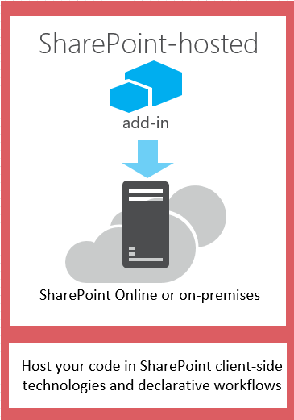

# Выбор шаблонов для разработки и размещения надстройки SharePoint
Информация о различных способах размещения компонентов надстроек SharePoint.
 

 **Примечание.** Название "приложения для SharePoint" меняется на "надстройки SharePoint". Пока изменения не будут внесены полностью, в документации и пользовательском интерфейсе некоторых продуктов SharePoint и средств Visual Studio по-прежнему может встречаться термин "приложение". Дополнительные сведения см. в статье [Название "приложения для Office и SharePoint" изменилось на "надстройки Office и SharePoint"](new-name-for-apps-for-sharepoint#bk_newname).
 

В модели надстроек SharePoint представлен широкий выбор шаблонов размещения и разработки. Некоторые из них можно использовать в комбинации друг с другом. Например, надстройки могут одновременно содержать размещаемые в SharePoint и удаленно размещаемые компоненты. Чтобы решить, какие шаблоны лучше использовать, следует сначала определить собственные требования, технологии и цели, а затем сопоставить их с возможностями и вариантами, предлагаемыми надстройками SharePoint.
 

## Что нужно учитывать при выборе шаблона разработки

Надстройки SharePoint расширяет диапазон языков программирования и стеков технологий, которые можно использовать при работе с ресурсами и службами SharePoint. Точный набор возможностей зависит от выбранного типа надстройки и шаблона размещения. Кроме того, можно совмещать различные шаблоны.
 

 

### Размещаемые в SharePoint надстройки

Начните с самого простого варианта: надстройки, размещаемые в SharePoint, или надстройки, все компоненты которых размещены локально или в ферме SharePoint Office 365. Надстройки, размещаемые в SharePoint, устанавливаются на веб-сайте SharePoint, который называется хост-сайтом. Их ресурсы размещаются на изолированном дочернем сайте хост-сайта, который называется сайтом надстройки. Важно понимать,  [чем различаются хост-сайты и сайты надстроек](host-webs-add-in-webs-and-sharepoint-components-in-sharepoint-2013). На рисунке 1 показана базовая архитектура надстройки, размещаемой в SharePoint.
 

 

**Рис. 1. Архитектура надстройки, размещаемой в SharePoint**

 

 

 
Надстройку, размещенную в SharePoint, можно использовать с надстройками, имеющими удаленно размещенные компоненты, но каждая надстройка или часть надстройки, работающей на сайте надстройки, имеет следующий набор требований к трем ключевым компонентам: где размещена надстройка, как в ней выполняется авторизация и какой язык может в ней использоваться.
 

 

|**Компонент**|**Требование к надстройкам, размещаемым в SharePoint**|
|:-----|:-----|
|Место размещения компонентов надстроек|Изолированный домен надстроек вашей фермы SharePoint|
|Авторизация надстройки|Права пользователя, выполнившего вход|
|Язык, который можно использовать в надстройке|JavaScript (с библиотекой SharePoint JSOM) + HTML|
Такой шаблон проще всего развертывать, и вы можете использовать  [Создание простой надстройки для SharePoint с размещением в SharePoint с помощью средств разработки Napa для Office 365](create-a-basic-sharepoint-hosted-add-in-by-using-napa-office-365-development-tools). Прежде чем принять решение о создании надстройки, размещаемой в SharePoint, учтите следующее.
 

 

|**Преимущества**|**Недостатки**|
|:-----|:-----|
|Можно повторно использовать общие элементы SharePoint, например списки и веб-части.|В надстройке можно использовать только JavaScript, при этом нельзя использовать код на стороне сервера.|
|Такие надстройки относительно просты в создании и развертывании, поэтому они подходят для создания полезных приложений для небольших команд и автоматизации бизнес-процесса с несложными бизнес-правилами.|Надстройка получает лишь права авторизации, которые есть у выполнившего вход пользователя.|
 [Приступая к созданию надстроек SharePoint с размещением в SharePoint](get-started-creating-sharepoint-hosted-sharepoint-add-ins)
 

 

### Надстройки, размещаемые у поставщика

Надстройки SharePoint, размещаемые у поставщика, включают компоненты, разворачиваемые и размещаемые вне фермы SharePoint. Они устанавливаются на хост-сайте, но их удаленные компоненты размещены на другом сервере,  *который не должен входить в состав фермы SharePoint*  . На рисунке 2 показана базовая архитектура надстройки, размещаемой у поставщика.
 

 

**Рис. 2. Архитектура надстройки, размещаемой у поставщика**

 

 

 
В таблице ниже показано, что требования к месту размещения, авторизации и языкам для надстроек, размещаемых у поставщика, существенно менее жесткие, чем для надстроек, размещаемых в SharePoint.
 

 

|**Компонент**|**Требования к надстройкам, размещаемым у поставщика**|
|:-----|:-----|
|Место размещения компонентов надстроек|Любой веб-сервер или служба размещения|
|Авторизация надстройки|OAuth или междоменная библиотека JavaScript|
|Язык, который можно использовать в надстройке|Любой язык, поддерживаемый вашим веб-сервером или службой размещения|
Размещаемая у поставщика надстройка взаимодействует с сайтом SharePoint, но использует ресурсы и службы, находящиеся на удаленном сайте. Прежде чем принять решение о создании надстройки, размещаемой у поставщика, учтите следующее.
 

 

|**Преимущества**|**Недостатки**|
|:-----|:-----|
|Приложение можно размещать в Microsoft Azure или на любой другой удаленной веб-платформе, включая сторонние (не от Майкрософт). |Вы отвечаете за создание логики установки, обновления и удаления удаленных компонентов.|
|Для взаимодействия с SharePoint можно использовать одну из клиентских объектных моделей SharePoint, междоменную библиотеку JavaScript или [веб-службу SharePoint на основе REST/OData](http://msdn.microsoft.com/magazine/dn198245.aspx).|Каждый способ взаимодействия с SharePoint предусматривает [соответствующие варианты доступа к данным](secure-data-access-and-client-object-models-for-sharepoint-add-ins).|
|Для доступа к данным SharePoint можно авторизоваться с помощью одной из [трех систем авторизации](three-authorization-systems-for-sharepoint-add-ins).|Нужно выбрать один из двух способов авторизации доступа надстройки к SharePoint: с помощью OAuth или междоменной библиотеки.|

## Выберите шаблон размещения, соответствующий целям разработки

Помимо технических преимуществ и ограничений каждого варианта, при выборе шаблона размещения также необходимо принимать во внимание цели разработки. Следующая таблица поможет определить, какой шаблон размещения лучше всего подходит для ваших требований.
 

 

|**Ваши требования**|**Рекомендуемый шаблон размещения**|**Пример**|
|:-----|:-----|:-----|
|Работа с новыми объектами SharePoint и их подготовка в монопольном режиме|Размещение в SharePoint|Надстройка, включающая в себя элемент управления "Выбор людей", который сохраняет информацию о пользователях SharePoint в списке SharePoint|
|Использование существующих объектов SharePoint и взаимодействие с внешними веб-службами (размещенными вне SharePoint)|Размещение на ресурсах поставщика|Надстройка, которая получает адреса клиентов из существующего списка SharePoint на хост-сайте и отображает их с помощью службы сопоставления в веб-приложении|
|Подготовка к работе новых объектов SharePoint и взаимодействие с внешними веб-службами|Комбинированное размещение в SharePoint и у поставщика|Надстройка сопоставления, которая подготавливает к работе список SharePoint на сайте надстройки для хранения координат широты и долготы адресов, предоставленных пользователем или полученных из существующего списка SharePoint|

## Что нужно учитывать при выборе шаблона размещения для надстроек, размещаемых у поставщика

Надстройки, размещаемые в SharePoint, имеют фиксированный шаблон размещения в связи с размещением на сайте надстройки. Надстройки, размещаемые у поставщика, обеспечивают повышенную гибкость для размещения различных компонентов надстройки. Поэтому, если вы решите создать такую надстройку, вам понадобится сопоставить свои цели и требования с соответствующим шаблоном размещения. 
 

 

### OAuth или междоменная библиотека

Один из самых важных вопросов, который необходимо задать при рассмотрении и сборке размещаемых у поставщика надстроек, каким образом надстройка будет проходить авторизацию на взаимодействие с SharePoint. Для надстроек, размещаемых у поставщика, доступно два варианта: междоменная библиотека JavaScript и OAuth. 
 

 
[Междоменная библиотека](access-sharepoint-2013-data-from-add-ins-using-the-cross-domain-library) позволяет взаимодействовать с несколькими доменами из удаленных компонентов надстройки через прокси-сервер. Если достаточно кода на стороне клиента и разрешений пользователя, вошедшего в SharePoint, междоменная библиотека это хороший выбор. Междоменная библиотека также удобна, когда необходимо совершать удаленные вызовы через брандмауэр.
 

 
OAuth это открытый протокол для авторизации, обеспечивающий надежную авторизацию из клиентских приложений (классических, мобильных и веб-приложений) легким в управлении способом. Если планируется собрать надстройку SharePoint, работающую в удаленном веб-приложении и взаимодействующую с SharePoint, то придется часто использовать OAuth: при каждом вызове SharePoint из удаленно размещенного веб-приложения, которое не может эксклюзивно использовать код на клиентской стороне (HTML + JavaScript).  [Подробнее о том, как OAuth работает в надстройках SharePoint.](creating-sharepoint-add-ins-that-use-low-trust-authorization)
 

 
 В статьях  [Безопасный доступ к данным и клиентские объектные модели для надстроек SharePoint](secure-data-access-and-client-object-models-for-sharepoint-add-ins) и [Три системы авторизации для надстроек для SharePoint](three-authorization-systems-for-sharepoint-add-ins) подробнее объясняется выбор между OAuth и междоменной библиотекой.
 

 

### OAuth с локальными фермами SharePoint

При локальном развертывании SharePoint можно использовать OAuth, но необходимо выбрать между созданием надстроек с высоким уровнем доверия и клиентом Office 365. Office 365 использует службу контроля доступа Microsoft Azure в качестве посредника доверия. Если у вас нет доступа к клиенту Office 365, вам понадобится  [Создание надстроек с высоким уровнем доверия для SharePoint](create-high-trust-sharepoint-add-ins), которая использует сертификаты для установления доверия между вашей надстройкой и SharePoint. Вы можете добавить надстройки с высоким уровнем доверия в каталог надстроек своей фермы SharePoint, но вы не можете продавать их в Магазин Office. Если у вас есть доступ к клиенту Office 365, вы можете связать его со своей локальной средой SharePoint и  [использовать службу контроля доступа в качестве посредника доверия для надстроек, установленных в локальной среде SharePoint](use-an-office-365-sharepoint-site-to-authorize-provider-hosted-add-ins-on-an-on-premises-sharepoint-site).
 

 
В таблице ниже представлены все возможные шаблоны размещения как компонентов SharePoint, так и удаленных компонентов надстройки вместе с посредниками доверия, которые доступны в случае использования OAuth. Обратите внимание, что вам понадобится доступ к клиенту Office 365, чтобы использовать службу контроля доступа для установления доверия между SharePoint и Надстройка SharePoint, установленного в локальном экземпляре SharePoint.
 

 

|**Расположение компонентов в SharePoint**|**Удаленное расположение компонентов**|**Брокер доверия**|
|:-----|:-----|:-----|
|Локальная среда|В облаке|Служба контроля доступа, сертификат|
|Локальная среда|Локальная среда|Служба контроля доступа, сертификат|
|Сайт SharePoint Office 365|В облаке|ACS|
|Сайт SharePoint Office 365|Локальная среда|ACS|

## Сочетание размещения у поставщика и в SharePoint

Компоненты создаваемых надстроек могут размещаться как в облаке, так и в SharePoint. Например, можно создать  [размещенную в облаке надстройку, которая содержит настраиваемый список SharePoint и тип содержимого](create-a-provider-hosted-add-in-that-includes-a-custom-sharepoint-list-and-content-type). В этой архитектуре необходимо учитывать ограничения по безопасности, встроенные в модель. JavaScript можно использовать только в компонентах кода, размещенных в SharePoint, а для взаимодействия удаленно размещенных компонентов с веб-сайтом SharePoint необходимо использовать OAuth или междоменную библиотеку. Используйте этот подход, только если вы понимаете,  [как выполняется авторизация надстроек в SharePoint](authorization-and-authentication-of-sharepoint-add-ins). На рисунке 4 показано, как работает архитектура, когда для размещения удаленных компонентов надстройки используется Microsoft Azure и применяется OAuth.
 

 

**Рис. 4. Взаимодействие сервер-сервер для надстроек SharePoint при использовании OAuth и Windows Azure**

 

 

 
 [Узнайте, как создать надстройку, сочетающую размещение в облаке и в SharePoint.](create-a-provider-hosted-add-in-that-includes-a-custom-sharepoint-list-and-content-type)
 

 
Вот что нужно учесть, если вы рассматриваете возможность сочетания размещения у поставщика и в SharePoint.
 

 

|**Преимущества**|**Недостатки**|
|:-----|:-----|
|Все преимущества двух подходов.|Более сложная архитектура потребует тщательного планирования взаимодействия сервер-сервер и наложит ограничения на межсайтовые сценарии.|

## Размещаемые у поставщика надстройки в веб-ролях Azure

Размещенная у поставщика Надстройка SharePoint может быть размещена не в веб-приложении (локальном или Веб-сайт Azure), а в веб-роли Microsoft Azure. По существу, веб-роль Azure это веб-сайт, основанный на службах IIS и размещенный в Azure. Можно воспользоваться службами размещения и масштабируемостью веб-ролей Azure. Кроме того, можно повысить производительность и удобство использования Надстройка SharePoint, особенно, если надстройка активно используется или спрос на нее со временем возрастает. Если для Надстройка SharePoint понадобится больше серверных ресурсов, Azure может динамично распределить их с учетом потребностей надстройки.
 

 
Дополнительные сведения о веб-ролях Azure см. по следующим ссылкам.
 

 

-  [Что такое облачная служба?](http://www.windowsazure.com/en-us/manage/services/cloud-services/what-is-a-cloud-service/)
    
 
-  [Представляем Microsoft Azure](http://www.windowsazure.com/en-us/develop/net/fundamentals/intro-to-windows-azure/)
    
 
-  [Автоматическое масштабирование и Microsoft Azure](http://msdn.microsoft.com/en-us/library/hh680945%28v=pandp.50%29.aspx)
    
 
В качестве необходимого компонента вам понадобится пакет Microsoft Azure SDK для .NET (VS 2012) 1.8.1, который можно установить с помощью  [установщика веб-платформы](http://www.microsoft.com/web/downloads/platform.aspx).
 

 
Способ создания проекта в vsnv зависит от того, начинаете ли вы с проекта надстройки SharePoint и затем добавляете проект веб-роли Azure, или начинаете с проекта Azure и затем добавляете проект SharePoint.
 

 

### Добавление облачной службы в существующую надстройку

Если у вас уже есть надстройка SharePoint с размещением у поставщика, которую вы хотите разместить в Azure, выберите проект веб-приложения в решении для надстройки SharePoint. В строке меню выберите **Проект**, **Добавить проект облачной службы Microsoft Azure**. Проект Azure с именем _NameOfTheWebAppProject_.Azure будет добавлен в решение для вашей надстройки SharePoint. Веб-роль для этого веб-проекта также добавляется в проект для облачной службы Azure. Инструменты разработчика Office для Visual Studio 2012 устанавливают необходимые свойства проекта, чтобы веб-роль могла работать с надстройкой SharePoint.
 

 

### Добавление надстройки к существующей веб-роли

Если у вас уже есть веб-роль в облачной службе Azure, которую вы хотите использовать в качестве узла для надстройки SharePoint с размещением у поставщика, откройте облачный проект Azure в Visual Studio, а затем в **обозревателе решений** выберите проект веб-роли. В строке меню выберите **Проект**, **Добавить надстройку для проекта SharePoint**. Будет создан и добавлен в решение проект для надстройки SharePoint с размещением у поставщика с именем _NameOfTheWebAppProject_.Azure. Visual Studio ссылается на веб-роль Azure как на узел веб-проекта для надстройки SharePoint.
 

 

## Дополнительные ресурсы

Дополнительные сведения см. в следующих источниках:
 

 

-  [Важные аспекты разработки и архитектуры для надстроек SharePoint](important-aspects-of-the-sharepoint-add-in-architecture-and-development-landscape)
    
 
-  [Надстройки SharePoint](sharepoint-add-ins)
    
 
-  [Хост-сайты, сайты надстроек и компоненты SharePoint в SharePoint](host-webs-add-in-webs-and-sharepoint-components-in-sharepoint-2013)
    
 
-  [Авторизация и проверка подлинности надстроек SharePoint](authorization-and-authentication-of-sharepoint-add-ins)
    
 
-  [Поток OAuth токена контекста для надстроек SharePoint](context-token-oauth-flow-for-sharepoint-add-ins)
    
 
-  [Использование сайта SharePoint Office 365 для авторизации размещенных у поставщика надстроек на локальном сайте SharePoint](use-an-office-365-sharepoint-site-to-authorize-provider-hosted-add-ins-on-an-on-premises-sharepoint-site)
    
 
-  [Надстройки SharePoint в сравнении с решениями для SharePoint](http://msdn.microsoft.com/library/0e9efadb-aaf2-4c0d-afd5-d6cf25c4e7a8%28Office.15%29.aspx)
    
 
-  [Приступая к созданию надстроек SharePoint с размещением у поставщика](get-started-creating-provider-hosted-sharepoint-add-ins)
    
 
-  [Приступая к созданию надстроек SharePoint с размещением в SharePoint](get-started-creating-sharepoint-hosted-sharepoint-add-ins)
    
 
-  [Создание надстройки с размещением у поставщика, включающей настраиваемый список SharePoint и пользовательский тип контента](create-a-provider-hosted-add-in-that-includes-a-custom-sharepoint-list-and-content-type)
    
 

