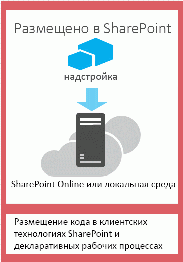
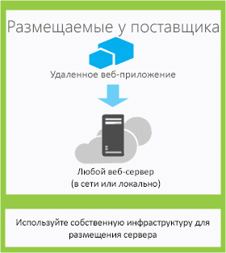

# Выбор шаблонов для разработки и размещения надстройки SharePointChoose patterns for developing and hosting your SharePoint Add-in

В модели надстроек SharePoint представлен широкий выбор шаблонов размещения и разработки. Некоторые из них можно использовать в комбинации друг с другом. Например, надстройки могут одновременно содержать размещаемые в SharePoint и удаленно размещаемые компоненты. Чтобы решить, какие шаблоны лучше использовать, следует сначала определить собственные требования, технологии и цели, а затем сопоставить их с возможностями и вариантами, предлагаемыми надстройками SharePoint.The SharePoint add-in model introduces a wide range of hosting and development patterns. Some of these patterns can be used in combination with each other. For example, your add-ins can mix SharePoint-hosted and remotely hosted components. The most useful way to determine which patterns you'll want to use is to start with your own requirements, technologies, and goals and match them with the options and possibilities that are enabled by SharePoint Add-ins.

## Что нужно учитывать при выборе шаблона разработкиWhat to think about when choosing your development pattern

Надстройки SharePoint расширяет диапазон языков программирования и стеков технологий, которые можно использовать при работе с ресурсами и службами SharePoint. Точный набор возможностей зависит от выбранного типа надстройки и шаблона размещения. Кроме того, можно совмещать различные шаблоны.SharePoint Add-ins widen the range of possible programming languages and technology stacks that you can use when you work with SharePoint resources and services. The precise range of options depends on both the type of add-in and the hosting pattern that you choose. It's also possible to mix patterns.

### Надстройки, размещаемые в SharePointSharePoint-hosted add-ins

Начните работу с самого простого варианта — с надстроек, размещаемых в SharePoint, или надстроек, все компоненты которых размещаются в локальной среде или в ферме SharePoint в Office 365.Start with the simplest option: SharePoint-hosted add-ins, or add-ins where all components are hosted on either an on-premises or Office 365 SharePoint farm. Надстройки, размещаемые в SharePoint, устанавливаются на веб-сайте SharePoint, называемом хост-сайтом.SharePoint-hosted add-ins are installed on a SharePoint website, called the host web. Ресурсы надстроек размещаются на изолированном дочернем сайте хост-сайта, называемом сайтом надстройки.They have their resources hosted on an isolated subsite of a host web, called the add-in web. Важно понимать [разницу между хост-сайтами и сайтами надстроек](host-webs-add-in-webs-and-sharepoint-components-in-sharepoint.md).It's important to know [the difference between host webs and add-in webs](host-webs-add-in-webs-and-sharepoint-components-in-sharepoint.md). 

На рис. 1 показана базовая архитектура надстройки, размещаемой в SharePoint.Figure 1 illustrates the basic architecture of a SharePoint-hosted add-in.

*Рис. 1. Архитектура надстройки, размещаемой в SharePoint**Figure 1. SharePoint-hosted add-in architecture*

 
Надстройку, размещенную в SharePoint, можно использовать с надстройками, имеющими удаленно размещенные компоненты, но каждая надстройка или часть надстройки, работающей на сайте надстройки, имеет следующий набор требований к трем ключевым компонентам: где размещена надстройка, как в ней выполняется авторизация и какой язык может в ней использоваться.You can combine a SharePoint-hosted add-in with add-ins that have remotely hosted components, but any add-in or portion of an add-in that runs on an add-in web has the following set of requirements for three key components: where the add-in is hosted, how the add-in gets authorization, and what language it can use.

|**Компонент****Component**|**Требование к надстройкам, размещаемым в SharePoint****SharePoint-hosted add-in requirement**|
|:-----|:-----|
|Место размещения компонентов надстроекWhere the add-in components are hosted|Изолированный домен надстроек вашей фермы SharePointIn the isolated add-in domain of your SharePoint farm|
|Авторизация надстройкиHow the add-in gets authorized|Права пользователя, выполнившего входThe privileges of the signed-in user|
|Язык, который можно использовать в надстройкеWhat language the add-in can use|JavaScript (с библиотекой JSOM для SharePoint) и HTMLJavaScript (with the SharePoint JSOM library) + HTML|

|**Преимущества****Get these benefits**|**Недостатки****But consider this**|
|:-----|:-----|
|Можно повторно использовать общие элементы SharePoint, например списки и веб-части.Reuse common SharePoint items, like lists and Web Parts.|В надстройке можно использовать только JavaScript, при этом нельзя использовать код на стороне сервера.You can use only JavaScript in the add-in—you can't use any server-side code.|
|Такие надстройки относительно просты в создании и развертывании, поэтому они подходят для создания полезных приложений для небольших команд и автоматизации бизнес-процесса с несложными бизнес-правилами.Relatively easy to create and deploy, so they are good for small team productivity add-ins and business process automation, with lower complexity business rules.|Надстройка получает лишь права авторизации, которые есть у выполнившего вход пользователя.Your add-in has only the authorization privileges of the signed-in user.|

[Знакомство с созданием надстроек SharePoint, размещаемых в SharePointGet started creating SharePoint-hosted SharePoint Add-ins](get-started-creating-sharepoint-hosted-sharepoint-add-ins.md)

### Надстройки, размещаемые у поставщикаProvider-hosted add-ins

Надстройки SharePoint, размещаемые у поставщика, включают компоненты, развертываемые и размещаемые за пределами фермы SharePoint.Provider-hosted SharePoint Add-ins include components that are deployed and hosted outside the SharePoint farm. Они устанавливаются на хост-сайт, но их удаленные компоненты размещаются на другом сервере, *который не должен входить в состав фермы SharePoint*.They are installed to the host web, but their remote components are hosted on another server *that should not be a server in the SharePoint farm*. 

На рис. 2 показана базовая архитектура надстройки, размещаемой у поставщика.Figure 2 illustrates the basic architecture of a provider-hosted add-in.

*Рис. 2. Архитектура надстройки, размещаемой у поставщика**Figure 2. Provider-hosted add-in architecture*

 
В таблице ниже показано, что требования к месту размещения, авторизации и языкам для надстроек, размещаемых у поставщика, существенно менее жесткие, чем для надстроек, размещаемых в SharePoint.The following table shows how the requirements for hosting location, add-in authorization, and languages are much less fixed for provider-hosted add-ins than they are for SharePoint-hosted add-ins.

|**Компонент****Component**|**Требования к надстройкам, размещаемым у поставщика****Provider-hosted add-in requirement**|
|:-----|:-----|
|Место размещения компонентов надстроекWhere the add-in components are hosted|Любой веб-сервер или служба размещенияAny web server or hosting service|
|Авторизация надстройкиHow the add-in gets authorized|OAuth или междоменная библиотека JavaScriptOAuth or the JavaScript cross-domain library|
|Язык, который можно использовать в надстройкеWhat language the add-in can use|Любой язык, поддерживаемый вашим веб-сервером или службой размещенияAny language supported by your web server or hosting service|

Размещаемая у поставщика надстройка взаимодействует с сайтом SharePoint, но использует ресурсы и службы, находящиеся на удаленном сайте. Прежде чем принять решение о создании надстройки, размещаемой у поставщика, учтите следующее.A provider-hosted add-in interacts with a SharePoint site but also uses resources and services that are located on the remote site. You'll want to consider the following before deciding to create a provider-hosted add-in.

|**Преимущества****Get these benefits**|**Недостатки****But consider this**|
|:-----|:-----|
|Приложение можно размещать в Microsoft Azure или на любой другой удаленной веб-платформе, включая сторонние (не от Майкрософт).Host the add-in on Microsoft Azure or any remote web platform, including non-Microsoft platforms. |Вы отвечаете за создание логики установки, обновления и удаления удаленных компонентов.You are responsible for creating the installation, upgrade, and uninstallation logic of the remote components.|
|Для взаимодействия с SharePoint можно использовать одну из клиентских объектных моделей SharePoint, междоменную библиотеку JavaScript или [веб-службу SharePoint на основе REST/OData](http://msdn.microsoft.com/magazine/dn198245.aspx).Use one of the SharePoint client object models, the JavaScript cross-domain library, or the SharePoint  [REST/OData-based web service](http://msdn.microsoft.com/magazine/dn198245.aspx) to interact with SharePoint.|Каждый способ взаимодействия с SharePoint предусматривает [соответствующие варианты доступа к данным](secure-data-access-and-client-object-models-for-sharepoint-add-ins.md).Each way of interacting with SharePoint has  [corresponding options for approaches to data access](secure-data-access-and-client-object-models-for-sharepoint-add-ins.md).|
|Для доступа к данным SharePoint можно авторизоваться с помощью одной из [трех систем авторизации](three-authorization-systems-for-sharepoint-add-ins.md).Gain authorization to SharePoint data using one of  [the three authorization systems](three-authorization-systems-for-sharepoint-add-ins.md).|Вам необходимо выбрать один из двух способов авторизации доступа надстройки к SharePoint: с помощью OAuth или с помощью междоменной библиотеки.You need to decide between OAuth and the cross-domain library to authorize your add-in's access to SharePoint.|

## Выбор шаблона размещения, соответствующего целям разработкиMatch your hosting pattern with your development goals

Помимо технических преимуществ и ограничений каждого варианта, при выборе шаблона размещения также необходимо принимать во внимание цели разработки. Следующая таблица поможет определить, какой шаблон размещения лучше всего подходит для ваших требований.In addition to considering the technical advantages and constraints of each option, you'll also need to think about your development goals when deciding on a hosting pattern. You can use the following table to help sort out which hosting pattern best fits your needs.

|**Ваши требования****Your requirements**|**Рекомендуемый шаблон размещения****Recommended hosting pattern**|**Пример****Example**|
|:-----|:-----|:-----|
|Работа с новыми объектами SharePoint и их подготовка в монопольном режимеWork with and provision new SharePoint entities exclusively|Размещение в SharePointSharePoint-hosted|Надстройка, включающая в себя элемент управления "Выбор людей", который сохраняет информацию о пользователях SharePoint в списке SharePointAn add-in that includes a people picker control and that stores information about SharePoint users in a SharePoint list|
|Использование существующих объектов SharePoint и взаимодействие с внешними веб-службами (размещенными вне SharePoint)Use existing SharePoint entities and interact with external (non-SharePoint) web services|Размещение на ресурсах поставщикаProvider-hosted|Надстройка, которая получает адреса клиентов из существующего списка SharePoint на хост-сайте и отображает их с помощью службы сопоставления в веб-приложенииAn add-in that gets customer addresses from an existing SharePoint list in the host web and uses a mapping service in a web application to display their locations|
|Подготовка к работе новых объектов SharePoint и взаимодействие с внешними веб-службамиProvision new SharePoint entities and interact with external web services|Комбинированное размещение в SharePoint и у поставщикаCombined SharePoint-hosted and provider-hosted|Надстройка сопоставления, которая подготавливает к работе список SharePoint на сайте надстройки для хранения координат широты и долготы адресов, предоставленных пользователем или полученных из существующего списка SharePointA mapping add-in that provisions a SharePoint list on the appweb so that it can store latitude and longitude coordinates for addresses that are supplied by the user or pulled from an existing SharePoint list|

## Что нужно учитывать при выборе шаблона размещения для надстроек, размещаемых у поставщикаWhat to think about when choosing your hosting pattern for provider-hosted add-ins

Для надстроек, размещаемых в SharePoint, используется фиксированный шаблон размещения, так как они размещаются на сайте надстройки.SharePoint-hosted add-ins have a fixed hosting pattern because they are hosted on the add-in web. Надстройки, размещаемые у поставщика, предоставляют более гибкие возможности размещения различных компонентов надстроек. Поэтому если вы решите создать такую надстройку, вам понадобится выбрать шаблон размещения в соответствии со своими целями и требованиями.Provider-hosted add-ins provide more flexibility for hosting the various components of your add-in, so if you choose to create one, you'll need to match your goals and requirements to the appropriate hosting pattern. 

### OAuth или междоменная библиотекаOAuth or the cross-domain library

Один из самых важных вопросов, который необходимо задать при рассмотрении и сборке размещаемых у поставщика надстроек, каким образом надстройка будет проходить авторизацию на взаимодействие с SharePoint. Для надстроек, размещаемых у поставщика, доступно два варианта: междоменная библиотека JavaScript и OAuth.One of the most important questions you need to ask when considering provider-hosted add-ins and how you'll build them is how the add-in will get authorization to interact with SharePoint. Provider-hosted add-ins give you two choices: the JavaScript cross-domain library and OAuth. 

С помощью **[междоменной библиотеки](access-sharepoint-data-from-add-ins-using-the-cross-domain-library.md)** вы можете взаимодействовать с несколькими доменами из удаленных компонентов вашей надстройки через прокси-сервер.The **[cross-domain library](access-sharepoint-data-from-add-ins-using-the-cross-domain-library.md)** lets you interact with more than one domain from the remote components of your add-in through a proxy. Если клиентского кода и разрешений, имеющихся у пользователя, вошедшего в SharePoint, достаточно, то междоменная библиотека — хороший вариант.If client-side code and the permissions of a user who is signed in to SharePoint are sufficient, the cross-domain library is a good option. Кроме того, междоменную библиотеку удобно использовать, когда вы совершаете удаленные вызовы через брандмауэр.The cross-domain library is also convenient whenever you are making remote calls through a firewall.

**OAuth** — это открытый протокол для проверки подлинности, позволяющий легко выполнять безопасную авторизацию из клиентских приложений (классических, веб- и мобильных приложений).**OAuth** is an open protocol for authorization that enables secure authorization from client applications (desktop, web, and mobile applications) in an easily manageable way. Если вы планируете создать надстройку SharePoint, которая работает в удаленном веб-приложении и отправляет данные обратно в SharePoint, вам придется часто использовать OAuth.If you plan to build a SharePoint Add-in that runs in a remote web application and communicates back to SharePoint, you will often need to use OAuth. OAuth требуется, когда вы совершаете вызовы в SharePoint из размещенного в удаленном расположении веб-приложения, в котором нет возможности использовать исключительно клиентский код (HTML и JavaScript).OAuth is required whenever you are calling into SharePoint from a remotely hosted web application that can't use client-side code (HTML + JavaScript) exclusively. [Узнайте больше о том, как OAuth работает в надстройках SharePoint](creating-sharepoint-add-ins-that-use-low-trust-authorization.md).[Learn more about how OAuth works in SharePoint Add-ins](creating-sharepoint-add-ins-that-use-low-trust-authorization.md).
 
В статьях  [Безопасный доступ к данным и клиентские объектные модели для надстроек SharePoint](secure-data-access-and-client-object-models-for-sharepoint-add-ins.md) и [Три системы авторизации для надстроек для SharePoint](three-authorization-systems-for-sharepoint-add-ins.md) подробнее объясняется выбор между OAuth и междоменной библиотекой.[Secure data access and client object models for SharePoint Add-ins](secure-data-access-and-client-object-models-for-sharepoint-add-ins.md) and [Three authorization systems for SharePoint Add-ins](three-authorization-systems-for-sharepoint-add-ins.md) explain the choice between OAuth and the cross-domain library more thoroughly.

### OAuth с локальными фермами SharePointOAuth with on-premises SharePoint farms

Если вы применяете локальное развертывание SharePoint, вы можете использовать OAuth, но вам потребуется выбирать между созданием надстроек с высоким уровнем доверия и использованием тенантности Office 365.If you are using an on-premises deployment of SharePoint, you can use OAuth, but you will have to choose between creating high-trust add-ins and using an Office 365 tenancy. Office 365 использует службу контроля доступа Microsoft Azure (ACS) в качестве брокера доверия, и если у вас нет доступа к тенантности Office 365, вам потребуется [создать надстройку SharePoint с высоким уровнем доверия](create-high-trust-sharepoint-add-ins.md), которая использует сертификаты для создания доверия между надстройкой и SharePoint.Office 365 uses Microsoft Azure Access Control Service (ACS) as the trust broker, and if you do not have access to an Office 365 tenancy, you'll need to use [Create high-trust SharePoint Add-ins](create-high-trust-sharepoint-add-ins.md), which uses certificates to establish trust between your add-in and SharePoint. Вы можете добавлять надстройки с высоким уровнем доверия в каталог надстроек вашей фермы SharePoint, но вам не удастся продавать их в Магазине Office.You can add high trust add-ins to the add-in catalog of your SharePoint farm, but you can't sell them in the Office Store. Если у вас есть доступ к тенантности Office 365, вы можете связать ее с локальной установкой SharePoint и [использовать ACS в качестве брокера доверия для надстроек, установленных в локальном SharePoint](use-an-office-365-sharepoint-site-to-authorize-provider-hosted-add-ins-on-an-on.md).If you do have access to an Office 365 tenancy, you can link it to your on-premises installation of SharePoint and [use ACS as the trust broker for add-ins that are installed to your on-premises SharePoint](use-an-office-365-sharepoint-site-to-authorize-provider-hosted-add-ins-on-an-on.md).

В таблице ниже представлены все возможные шаблоны размещения как компонентов SharePoint, так и удаленных компонентов надстройки вместе с посредниками доверия, которые доступны в случае использования OAuth. Обратите внимание, что вам понадобится доступ к клиенту Office 365, чтобы использовать службу контроля доступа для установления доверия между SharePoint и Надстройка SharePoint, установленного в локальном экземпляре SharePoint.The following table lists all of the possible patterns for hosting both the SharePoint components and the remote components of your add-in, along with the trust brokers that are available to you if you're using OAuth. Note that you'll need access to an Office 365 tenant in order to use ACS to establish trust between SharePoint and a SharePoint Add-in that is installed to an on-premises installation of SharePoint.

|**Расположение компонентов в SharePoint****SharePoint component location**|**Удаленное расположение компонентов****Remote component location**|**Брокер доверия****Trust broker**|
|:-----|:-----|:-----|
|Локальная средаOn-premises|В облакеIn cloud|Служба контроля доступа, сертификатACS, certificate|
|Локальная средаOn-premises|Локальная средаOn-premises|Служба контроля доступа, сертификатACS, certificate|
|Сайт SharePoint Office 365Office 365 SharePoint site|В облакеIn cloud|ACSACS|
|Сайт SharePoint Office 365Office 365 SharePoint site|Локальная средаOn-premises|ACSACS|

## Сочетание методов размещения у поставщика и в SharePointCombine provider hosting and SharePoint hosting

Вы также можете создавать надстройки, которые включают и компоненты, размещаемые в SharePoint, и компоненты, размещаемые в облаке.You can also build add-ins that include both SharePoint-hosted and cloud-hosted components. Например, вы можете создать [надстройку, размещаемую в облаке, которая включает настраиваемые список SharePoint и тип контента](create-a-provider-hosted-add-in-that-includes-a-custom-sharepoint-list-and-conte.md).For example, you can create a [cloud-hosted add-in that includes a custom SharePoint list and content type](create-a-provider-hosted-add-in-that-includes-a-custom-sharepoint-list-and-conte.md). Если вы решили использовать эту архитектуру, то и в конструкции, и в подходе необходимо учитывать ограничения, связанные с соображениями безопасности, присущие модели.If you choose to use this architecture, your design and approach must account for security limitations that are built into the model. Вы можете использовать JavaScript только в компонентах кода, размещаемых SharePoint. При этом компоненты, размещаемые в удаленных расположениях, должны использовать OAuth либо междоменную библиотеку для взаимодействия с веб-сайтом SharePoint.You can use only JavaScript in the code components that are hosted by SharePoint, and the remotely hosted components must use either OAuth or the cross-domain library to interact with the SharePoint website. Рассматривая возможность использования этого подхода, убедитесь, что вы понимаете, как [работает авторизация надстроек в SharePoint](authorization-and-authentication-of-sharepoint-add-ins.md).When considering this approach, make sure that you understand how  [add-in authorization works in SharePoint](authorization-and-authentication-of-sharepoint-add-ins.md). 

На рис. 3 показано, как работает эта архитектура, если вы используете Azure для размещения удаленных компонентов вашей надстройки и применяете OAuth.Figure 3 shows you how this architecture works if you use Azure to host the remote components of your add-in, and you use OAuth.

*Рис. 3. Взаимодействие между серверами при работе надстройки SharePoint в случае использования OAuth и Windows Azure**Figure 3. SharePoint add-in server-to-server communication when you use OAuth and Windows Azure*

 

[Узнайте, как создать надстройку, размещаемую в облаке и в SharePoint.](create-a-provider-hosted-add-in-that-includes-a-custom-sharepoint-list-and-conte.md)[Learn how to create an add-in that combines cloud hosting and SharePoint hosting](create-a-provider-hosted-add-in-that-includes-a-custom-sharepoint-list-and-conte.md).

Ниже перечислены моменты, которые необходимо учесть, если вы рассматриваете возможность сочетания размещения у поставщика и в SharePoint.Here are some things to think about when you're considering a combination of provider hosting and SharePoint hosting.

|**Преимущества****Get these benefits**|**Недостатки****But consider this**|
|:-----|:-----|
|Все преимущества двух подходов.All the benefits of the two approaches.|Более сложная архитектура потребует тщательного планирования межсерверного взаимодействия и создает ограничения для межсайтовых сценариев.More complex architecture requires careful planning around server-to-server communication and cross-site scripting restrictions.|

## Надстройки, размещаемые у поставщика, в веб-ролях AzureProvider-hosted add-ins in Azure Web Roles

Вы можете разместить надстройку SharePoint, размещаемую у поставщика, в веб-роли Azure, а не в веб-приложении (независимо от того, какое это веб-приложение — локальное или представляет собой веб-сайт Azure).You can host a provider-hosted SharePoint Add-in on an Azure web role instead of a web application (whether the web application is on-premises or an Azure website). По существу, веб-роль Azure представляет собой веб-сайт, основанный на службах IIS и размещаемый в Azure.An Azure web role is, essentially, a website that's based on Internet Information Services (IIS) and hosted on Azure. Вы можете использовать услуги размещения и возможности масштабирования веб-ролей Azure.You can take advantage of the hosting services and scalability of Azure web roles. Кроме того, вы можете повысить производительность и удобство использования своей надстройки SharePoint, особенно если она интенсивно используется либо спрос на нее изменяется со временем.You can also enhance the performance and usability of your SharePoint Add-in, especially if the add-in is heavily used or demand for it changes over time. Если надстройке SharePoint потребуется больше ресурсов сервера, Azure сможет динамически выделять ей ресурсы.If the SharePoint Add-in ever requires more server resources, Azure can dynamically allocate them to the add-in.

Дополнительные сведения о веб-ролях Azure см. по ссылкам ниже.See the following links for more information about Azure web roles.

-  [Что такое облачная служба?What is a cloud service?](http://www.windowsazure.com/ru-RU/manage/services/cloud-services/what-is-a-cloud-service/)
-  [Представляем Microsoft AzureIntroducing Microsoft Azure](http://www.windowsazure.com/ru-RU/develop/net/fundamentals/intro-to-windows-azure/)
-  [Автоматическое масштабирование и Microsoft AzureAutoscaling and Microsoft Azure](http://msdn.microsoft.com/ru-RU/library/hh680945%28v=pandp.50%29.aspx)

Чтобы вы могли приступить к работе, вам потребуется Пакет Microsoft Azure SDK для .NET 1.8.1 (Visual Studio 2012), который можно установить, используя [установщик веб-платформы](http://www.microsoft.com/web/downloads/platform.aspx).As a prerequisite, you will need the Microsoft Azure SDK for .NET (Visual Studio 2012) 1.8.1, which you can install by using the [Web Platform Installer](http://www.microsoft.com/web/downloads/platform.aspx).

Способ создания проекта в vsnv зависит от того, начнете ли вы проект надстройки SharePoint и затем добавите проект веб-роли Azure либо начнете проект Azure и добавите проект SharePoint.The way that you create the project in vsnv depends on whether you start with a SharePoint Add-in project and then add the Azure web role project, or you start with the Azure project and then add the SharePoint project.

### Добавление облачной службы в существующую надстройкуAdd a cloud service to an existing add-in

Если у вас уже есть надстройка SharePoint, размещаемая у поставщика, и вы хотите разместить ее в Azure, выберите проект веб-приложения в решении для надстройки SharePoint.If you already have a provider-hosted SharePoint Add-in that you want to host on Azure, choose the web application project in the solution for the SharePoint Add-in. В строке меню щелкните **Проект** > **Добавить проект облачной службы Microsoft Azure**.On the menu bar, select **Project** > **Add Microsoft Azure Cloud Service Project**. Проект Azure с именем _NameOfTheWebAppProject_.Azure будет добавлен в решение вашей надстройки SharePoint.An Azure project called _NameOfTheWebAppProject_.Azure is added to the solution for your SharePoint Add-in. Кроме того, в проект облачной службы Azure будет добавлена веб-роль для веб-проекта.A web role for the web project is also added to the project for the Azure cloud service. Пакет "Инструменты разработчика Office для Visual Studio 2012" настроит необходимые свойства проекта, чтобы веб-роль могла работать с надстройкой SharePoint.The Office Developer Tools for Visual Studio 2012 sets the necessary project properties so that the web role can work with the SharePoint Add-in.

### Добавление надстройки к существующей веб-ролиAdd an add-in to an existing web role

Если в облачной службе Azure у вас уже есть веб-роль, которую вы хотите использовать в качестве хоста для надстройки SharePoint, размещаемой у поставщика, откройте облачный проект Azure в Visual Studio, а затем в **обозревателе решений** выберите проект веб-роли.If you already have a web role in an Azure cloud service that you want to use as a host for a provider-hosted SharePoint Add-in, open the Azure cloud project in Visual Studio, and then, in **Solution Explorer**, choose the web role project. В строке меню выберите **Проект** > **Добавление надстройки для проекта SharePoint**.On the menu bar, select **Project** > **Add Add-in for SharePoint Project**. Созданный проект для надстройки SharePoint, размещаемой у поставщика, будет иметь имя _ИмяПроектаВебПриложения_.Azure и будет добавлен в решение.A project for a provider-hosted SharePoint Add-in is created called _NameOfTheWebAppProject_.Azure and added to the solution. Visual Studio ссылается на веб-роль Azure как на хост-сайт веб-проекта для надстройки SharePoint.Visual Studio references the Azure web role as the web project host for the SharePoint Add-in.

## См. такжеSee also

-  [Важные аспекты архитектуры и разработки надстроек SharePointImportant aspects of the SharePoint Add-in architecture and development landscape](important-aspects-of-the-sharepoint-add-in-architecture-and-development-landscap.md)
-  [Надстройки SharePointSharePoint Add-ins](sharepoint-add-ins.md)
-  [Хост-сайты, сайты надстроек и компоненты SharePoint в SharePointHost webs, add-in webs, and SharePoint components in SharePoint](host-webs-add-in-webs-and-sharepoint-components-in-sharepoint.md)
-  [Авторизация и проверка подлинности для надстроек в SharePointAuthorization and authentication of SharePoint Add-ins](authorization-and-authentication-of-sharepoint-add-ins.md)
-  [Поток OAuth токена контекста для надстроек SharePointContext Token OAuth flow for SharePoint Add-ins](context-token-oauth-flow-for-sharepoint-add-ins.md)
-  [Использование сайта SharePoint Office 365 для авторизации размещенных у поставщика надстроек на локальном сайте SharePointUse an Office 365 SharePoint site to authorize provider-hosted add-ins on an on-premises SharePoint site](use-an-office-365-sharepoint-site-to-authorize-provider-hosted-add-ins-on-an-on.md)
-  [Надстройки SharePoint в сравнении с решениями для SharePointSharePoint Add-ins compared with SharePoint solutions](http://msdn.microsoft.com/library/0e9efadb-aaf2-4c0d-afd5-d6cf25c4e7a8%28Office.15%29.aspx)
-  [Знакомство с созданием надстроек SharePoint с размещением у поставщикаGet started creating provider-hosted SharePoint Add-ins](get-started-creating-provider-hosted-sharepoint-add-ins.md)
-  [Знакомство с созданием надстроек SharePoint, размещаемых в SharePointGet started creating SharePoint-hosted SharePoint Add-ins](get-started-creating-sharepoint-hosted-sharepoint-add-ins.md)
-  [Создание надстроек с размещением у поставщика, которые включают в себя пользовательский список SharePoint и тип контентаCreate a provider-hosted add-in that includes a custom SharePoint list and content type](create-a-provider-hosted-add-in-that-includes-a-custom-sharepoint-list-and-conte.md)

