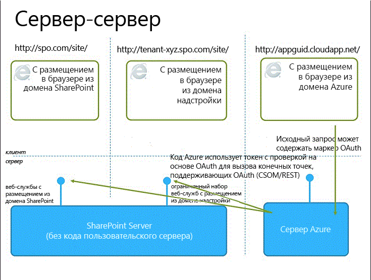

# Выбор шаблонов для разработки и размещения надстройки SharePoint

В модели надстроек SharePoint представлен широкий выбор шаблонов размещения и разработки. Некоторые из них можно использовать в комбинации друг с другом. Например, надстройки могут одновременно содержать размещаемые в SharePoint и удаленно размещаемые компоненты. Чтобы решить, какие шаблоны лучше использовать, следует сначала определить собственные требования, технологии и цели, а затем сопоставить их с возможностями и вариантами, предлагаемыми надстройками SharePoint.

## Что нужно учитывать при выборе шаблона разработки

Надстройки SharePoint расширяет диапазон языков программирования и стеков технологий, которые можно использовать при работе с ресурсами и службами SharePoint. Точный набор возможностей зависит от выбранного типа надстройки и шаблона размещения. Кроме того, можно совмещать различные шаблоны.

### Надстройки, размещаемые в SharePoint

Начните работу с самого простого варианта — с надстроек, размещаемых в SharePoint, или надстроек, все компоненты которых размещаются в локальной среде или в ферме SharePoint в Office 365. Надстройки, размещаемые в SharePoint, устанавливаются на веб-сайте SharePoint, называемом хост-сайтом. Ресурсы надстроек размещаются на изолированном дочернем сайте хост-сайта, называемом сайтом надстройки. Важно понимать [разницу между хост-сайтами и сайтами надстроек](host-webs-add-in-webs-and-sharepoint-components-in-sharepoint.md). 

На рис. 1 показана базовая архитектура надстройки, размещаемой в SharePoint.

*Рис. 1. Архитектура надстройки, размещаемой в SharePoint*

 
Надстройку, размещенную в SharePoint, можно использовать с надстройками, имеющими удаленно размещенные компоненты, но каждая надстройка или часть надстройки, работающей на сайте надстройки, имеет следующий набор требований к трем ключевым компонентам: где размещена надстройка, как в ней выполняется авторизация и какой язык может в ней использоваться.

|**Компонент**|**Требование к надстройкам, размещаемым в SharePoint**|
|:-----|:-----|
|Место размещения компонентов надстроек|Изолированный домен надстроек вашей фермы SharePoint|
|Авторизация надстройки|Права пользователя, выполнившего вход|
|Язык, который можно использовать в надстройке|JavaScript (с библиотекой JSOM для SharePoint) и HTML|

|**Преимущества**|**Недостатки**|
|:-----|:-----|
|Можно повторно использовать общие элементы SharePoint, например списки и веб-части.|В надстройке можно использовать только JavaScript, при этом нельзя использовать код на стороне сервера.|
|Такие надстройки относительно просты в создании и развертывании, поэтому они подходят для создания полезных приложений для небольших команд и автоматизации бизнес-процесса с несложными бизнес-правилами.|Надстройка получает лишь права авторизации, которые есть у выполнившего вход пользователя.|

[Знакомство с созданием надстроек SharePoint, размещаемых в SharePoint](get-started-creating-sharepoint-hosted-sharepoint-add-ins.md)

### Надстройки, размещаемые у поставщика

Надстройки SharePoint, размещаемые у поставщика, включают компоненты, развертываемые и размещаемые за пределами фермы SharePoint. Они устанавливаются на хост-сайт, но их удаленные компоненты размещаются на другом сервере, *который не должен входить в состав фермы SharePoint*. 

На рис. 2 показана базовая архитектура надстройки, размещаемой у поставщика.

*Рис. 2. Архитектура надстройки, размещаемой у поставщика*

 
В таблице ниже показано, что требования к месту размещения, авторизации и языкам для надстроек, размещаемых у поставщика, существенно менее жесткие, чем для надстроек, размещаемых в SharePoint.

|**Компонент**|**Требования к надстройкам, размещаемым у поставщика**|
|:-----|:-----|
|Место размещения компонентов надстроек|Любой веб-сервер или служба размещения|
|Авторизация надстройки|OAuth или междоменная библиотека JavaScript|
|Язык, который можно использовать в надстройке|Любой язык, поддерживаемый вашим веб-сервером или службой размещения|

Размещаемая у поставщика надстройка взаимодействует с сайтом SharePoint, но использует ресурсы и службы, находящиеся на удаленном сайте. Прежде чем принять решение о создании надстройки, размещаемой у поставщика, учтите следующее.

|**Преимущества**|**Недостатки**|
|:-----|:-----|
|Приложение можно размещать в Microsoft Azure или на любой другой удаленной веб-платформе, включая сторонние (не от Майкрософт). |Вы отвечаете за создание логики установки, обновления и удаления удаленных компонентов.|
|Для взаимодействия с SharePoint можно использовать одну из клиентских объектных моделей SharePoint, междоменную библиотеку JavaScript или [веб-службу SharePoint на основе REST/OData](http://msdn.microsoft.com/magazine/dn198245.aspx).|Каждый способ взаимодействия с SharePoint предусматривает [соответствующие варианты доступа к данным](secure-data-access-and-client-object-models-for-sharepoint-add-ins.md).|
|Для доступа к данным SharePoint можно авторизоваться с помощью одной из [трех систем авторизации](three-authorization-systems-for-sharepoint-add-ins.md).|Вам необходимо выбрать один из двух способов авторизации доступа надстройки к SharePoint: с помощью OAuth или с помощью междоменной библиотеки.|

## Выбор шаблона размещения, соответствующего целям разработки

Помимо технических преимуществ и ограничений каждого варианта, при выборе шаблона размещения также необходимо принимать во внимание цели разработки. Следующая таблица поможет определить, какой шаблон размещения лучше всего подходит для ваших требований.

|**Ваши требования**|**Рекомендуемый шаблон размещения**|**Пример**|
|:-----|:-----|:-----|
|Работа с новыми объектами SharePoint и их подготовка в монопольном режиме|Размещение в SharePoint|Надстройка, включающая в себя элемент управления "Выбор людей", который сохраняет информацию о пользователях SharePoint в списке SharePoint|
|Использование существующих объектов SharePoint и взаимодействие с внешними веб-службами (размещенными вне SharePoint)|Размещение на ресурсах поставщика|Надстройка, которая получает адреса клиентов из существующего списка SharePoint на хост-сайте и отображает их с помощью службы сопоставления в веб-приложении|
|Подготовка к работе новых объектов SharePoint и взаимодействие с внешними веб-службами|Комбинированное размещение в SharePoint и у поставщика|Надстройка сопоставления, которая подготавливает к работе список SharePoint на сайте надстройки для хранения координат широты и долготы адресов, предоставленных пользователем или полученных из существующего списка SharePoint|

## Что нужно учитывать при выборе шаблона размещения для надстроек, размещаемых у поставщика

Для надстроек, размещаемых в SharePoint, используется фиксированный шаблон размещения, так как они размещаются на сайте надстройки. Надстройки, размещаемые у поставщика, предоставляют более гибкие возможности размещения различных компонентов надстроек. Поэтому если вы решите создать такую надстройку, вам понадобится выбрать шаблон размещения в соответствии со своими целями и требованиями. 

### OAuth или междоменная библиотека

Один из самых важных вопросов, который необходимо задать при рассмотрении и сборке размещаемых у поставщика надстроек, каким образом надстройка будет проходить авторизацию на взаимодействие с SharePoint. Для надстроек, размещаемых у поставщика, доступно два варианта: междоменная библиотека JavaScript и OAuth. 

С помощью **[междоменной библиотеки](access-sharepoint-data-from-add-ins-using-the-cross-domain-library.md)** вы можете взаимодействовать с несколькими доменами из удаленных компонентов вашей надстройки через прокси-сервер. Если клиентского кода и разрешений, имеющихся у пользователя, вошедшего в SharePoint, достаточно, то междоменная библиотека — хороший вариант. Кроме того, междоменную библиотеку удобно использовать, когда вы совершаете удаленные вызовы через брандмауэр.

**OAuth** — это открытый протокол для проверки подлинности, позволяющий легко выполнять безопасную авторизацию из клиентских приложений (классических, веб- и мобильных приложений). Если вы планируете создать надстройку SharePoint, которая работает в удаленном веб-приложении и отправляет данные обратно в SharePoint, вам придется часто использовать OAuth. OAuth требуется, когда вы совершаете вызовы в SharePoint из размещенного в удаленном расположении веб-приложения, в котором нет возможности использовать исключительно клиентский код (HTML и JavaScript). [Узнайте больше о том, как OAuth работает в надстройках SharePoint](creating-sharepoint-add-ins-that-use-low-trust-authorization.md).
 
В статьях  [Безопасный доступ к данным и клиентские объектные модели для надстроек SharePoint](secure-data-access-and-client-object-models-for-sharepoint-add-ins.md) и [Три системы авторизации для надстроек для SharePoint](three-authorization-systems-for-sharepoint-add-ins.md) подробнее объясняется выбор между OAuth и междоменной библиотекой.

### OAuth с локальными фермами SharePoint

Если вы применяете локальное развертывание SharePoint, вы можете использовать OAuth, но вам потребуется выбирать между созданием надстроек с высоким уровнем доверия и использованием тенантности Office 365. Office 365 использует службу контроля доступа Microsoft Azure (ACS) в качестве брокера доверия, и если у вас нет доступа к тенантности Office 365, вам потребуется [создать надстройку SharePoint с высоким уровнем доверия](create-high-trust-sharepoint-add-ins.md), которая использует сертификаты для создания доверия между надстройкой и SharePoint. Вы можете добавлять надстройки с высоким уровнем доверия в каталог надстроек вашей фермы SharePoint, но вам не удастся продавать их в Магазине Office. Если у вас есть доступ к тенантности Office 365, вы можете связать ее с локальной установкой SharePoint и [использовать ACS в качестве брокера доверия для надстроек, установленных в локальном SharePoint](use-an-office-365-sharepoint-site-to-authorize-provider-hosted-add-ins-on-an-on.md).

В таблице ниже представлены все возможные шаблоны размещения как компонентов SharePoint, так и удаленных компонентов надстройки вместе с посредниками доверия, которые доступны в случае использования OAuth. Обратите внимание, что вам понадобится доступ к клиенту Office 365, чтобы использовать службу контроля доступа для установления доверия между SharePoint и Надстройка SharePoint, установленного в локальном экземпляре SharePoint.

|**Расположение компонентов в SharePoint**|**Удаленное расположение компонентов**|**Брокер доверия**|
|:-----|:-----|:-----|
|Локальная среда|В облаке|Служба контроля доступа, сертификат|
|Локальная среда|Локальная среда|Служба контроля доступа, сертификат|
|Сайт SharePoint Office 365|В облаке|ACS|
|Сайт SharePoint Office 365|Локальная среда|ACS|

## Сочетание методов размещения у поставщика и в SharePoint

Вы также можете создавать надстройки, которые включают и компоненты, размещаемые в SharePoint, и компоненты, размещаемые в облаке. Например, вы можете создать [надстройку, размещаемую в облаке, которая включает настраиваемые список SharePoint и тип контента](create-a-provider-hosted-add-in-that-includes-a-custom-sharepoint-list-and-conte.md). Если вы решили использовать эту архитектуру, то и в конструкции, и в подходе необходимо учитывать ограничения, связанные с соображениями безопасности, присущие модели. Вы можете использовать JavaScript только в компонентах кода, размещаемых SharePoint. При этом компоненты, размещаемые в удаленных расположениях, должны использовать OAuth либо междоменную библиотеку для взаимодействия с веб-сайтом SharePoint. Рассматривая возможность использования этого подхода, убедитесь, что вы понимаете, как [работает авторизация надстроек в SharePoint](authorization-and-authentication-of-sharepoint-add-ins.md). 

На рис. 3 показано, как работает эта архитектура, если вы используете Azure для размещения удаленных компонентов вашей надстройки и применяете OAuth.

*Рис. 3. Взаимодействие между серверами при работе надстройки SharePoint в случае использования OAuth и Windows Azure*

 

[Узнайте, как создать надстройку, размещаемую в облаке и в SharePoint.](create-a-provider-hosted-add-in-that-includes-a-custom-sharepoint-list-and-conte.md)

Ниже перечислены моменты, которые необходимо учесть, если вы рассматриваете возможность сочетания размещения у поставщика и в SharePoint.

|**Преимущества**|**Недостатки**|
|:-----|:-----|
|Все преимущества двух подходов.|Более сложная архитектура потребует тщательного планирования межсерверного взаимодействия и создает ограничения для межсайтовых сценариев.|

## Надстройки, размещаемые у поставщика, в веб-ролях Azure

Вы можете разместить надстройку SharePoint, размещаемую у поставщика, в веб-роли Azure, а не в веб-приложении (независимо от того, какое это веб-приложение — локальное или представляет собой веб-сайт Azure). По существу, веб-роль Azure представляет собой веб-сайт, основанный на службах IIS и размещаемый в Azure. Вы можете использовать услуги размещения и возможности масштабирования веб-ролей Azure. Кроме того, вы можете повысить производительность и удобство использования своей надстройки SharePoint, особенно если она интенсивно используется либо спрос на нее изменяется со временем. Если надстройке SharePoint потребуется больше ресурсов сервера, Azure сможет динамически выделять ей ресурсы.

Дополнительные сведения о веб-ролях Azure см. по ссылкам ниже.

-  [Что такое облачная служба?](http://www.windowsazure.com/ru-RU/manage/services/cloud-services/what-is-a-cloud-service/)
-  [Представляем Microsoft Azure](http://www.windowsazure.com/ru-RU/develop/net/fundamentals/intro-to-windows-azure/)
-  [Автоматическое масштабирование и Microsoft Azure](http://msdn.microsoft.com/ru-RU/library/hh680945%28v=pandp.50%29.aspx)

Чтобы вы могли приступить к работе, вам потребуется Пакет Microsoft Azure SDK для .NET 1.8.1 (Visual Studio 2012), который можно установить, используя [установщик веб-платформы](http://www.microsoft.com/web/downloads/platform.aspx).

Способ создания проекта в vsnv зависит от того, начнете ли вы проект надстройки SharePoint и затем добавите проект веб-роли Azure либо начнете проект Azure и добавите проект SharePoint.

### Добавление облачной службы в существующую надстройку

Если у вас уже есть надстройка SharePoint, размещаемая у поставщика, и вы хотите разместить ее в Azure, выберите проект веб-приложения в решении для надстройки SharePoint. В строке меню щелкните **Проект** > **Добавить проект облачной службы Microsoft Azure**. Проект Azure с именем _NameOfTheWebAppProject_.Azure будет добавлен в решение вашей надстройки SharePoint. Кроме того, в проект облачной службы Azure будет добавлена веб-роль для веб-проекта. Пакет "Инструменты разработчика Office для Visual Studio 2012" настроит необходимые свойства проекта, чтобы веб-роль могла работать с надстройкой SharePoint.

### Добавление надстройки к существующей веб-роли

Если в облачной службе Azure у вас уже есть веб-роль, которую вы хотите использовать в качестве хоста для надстройки SharePoint, размещаемой у поставщика, откройте облачный проект Azure в Visual Studio, а затем в **обозревателе решений** выберите проект веб-роли. В строке меню выберите **Проект** > **Добавление надстройки для проекта SharePoint**. Созданный проект для надстройки SharePoint, размещаемой у поставщика, будет иметь имя _ИмяПроектаВебПриложения_.Azure и будет добавлен в решение. Visual Studio ссылается на веб-роль Azure как на хост-сайт веб-проекта для надстройки SharePoint.

## См. также

-  [Важные аспекты архитектуры и разработки надстроек SharePoint](important-aspects-of-the-sharepoint-add-in-architecture-and-development-landscap.md)
-  [Надстройки SharePoint](sharepoint-add-ins.md)
-  [Хост-сайты, сайты надстроек и компоненты SharePoint в SharePoint](host-webs-add-in-webs-and-sharepoint-components-in-sharepoint.md)
-  [Авторизация и проверка подлинности для надстроек в SharePoint](authorization-and-authentication-of-sharepoint-add-ins.md)
-  [Поток OAuth токена контекста для надстроек SharePoint](context-token-oauth-flow-for-sharepoint-add-ins.md)
-  [Использование сайта SharePoint Office 365 для авторизации размещенных у поставщика надстроек на локальном сайте SharePoint](use-an-office-365-sharepoint-site-to-authorize-provider-hosted-add-ins-on-an-on.md)
-  [Надстройки SharePoint в сравнении с решениями для SharePoint](http://msdn.microsoft.com/library/0e9efadb-aaf2-4c0d-afd5-d6cf25c4e7a8%28Office.15%29.aspx)
-  [Знакомство с созданием надстроек SharePoint с размещением у поставщика](get-started-creating-provider-hosted-sharepoint-add-ins.md)
-  [Знакомство с созданием надстроек SharePoint, размещаемых в SharePoint](get-started-creating-sharepoint-hosted-sharepoint-add-ins.md)
-  [Создание надстроек с размещением у поставщика, которые включают в себя пользовательский список SharePoint и тип контента](create-a-provider-hosted-add-in-that-includes-a-custom-sharepoint-list-and-conte.md)

