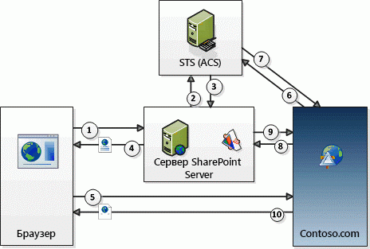

# Использование токенов контекста для авторизации надстроек SharePoint
В этой статье рассказывается о потоке проверки подлинности и авторизации OAuth для надстроек с низким уровнем доверия в SharePoint, размещаемых у поставщика.
 

 **Примечание.** В настоящее время идет процесс замены названия "приложения для SharePoint" названием "надстройки SharePoint". Во время этого процесса в документации и пользовательском интерфейсе некоторых продуктов SharePoint и средств Visual Studio может по-прежнему использоваться термин "приложения для SharePoint". Дополнительные сведения см. в статье [Новое название приложений для Office и SharePoint](new-name-for-apps-for-sharepoint.md#bk_newname).
 

## Получение общих сведений о надстройках SharePoint, размещаемых у поставщиков OAuth и SharePoint

В SharePoint **поток проверки подлинности и авторизации OAuth для надстройки, размещаемой у поставщика, с низким уровнем доверия включает ряд операций взаимодействия между надстройкой, SharePoint, сервером авторизации и браузером** во время выполнения надстройки. В качестве сервера авторизации в этом случае выступает Служба контроля доступа (ACS) Microsoft Azure.
 

 
Размещаемая у поставщика надстройка представляет собой удаленное веб-приложение или службу, отдельные от SharePoint и не входящие в состав фермы SharePoint или клиента SharePoint Online. Она может быть размещена в облаке или на локальном сервере. В этой статье удаленный компонент называется Contoso.com.
 

 

 **Примечание.** В удаленном компоненте также могут размещаться приемники событий, реагирующие на события, которые происходят с элементами SharePoint, например со списками или элементами списков. Примеры удаленных событий, на которые может реагировать Contoso.com: события списков, например добавление или удаление элемента списка, а также веб-события, например добавление или удаление сайта. Дополнительные сведения о создании удаленных приемников событий см. в статье [Создание удаленного приемника событий в надстройках SharePoint](create-a-remote-event-receiver-in-sharepoint-add-ins.md).
 

Для вызовов SharePoint в Contoso.com используется клиентская объектная модель (CSOM) SharePoint или интерфейсы REST API SharePoint. В надстройке Contoso.com для проверки подлинности SharePoint используется поток обработки маркеров OAuth. **SharePoint и Contoso.com не являются доверенными между собой, но доверяют ACS** и принимают маркеры, выданные ACS. При этом используется три маркера: SharePoint запрашивает у ACS создание маркера контекста, который SharePoint пересылает в Constoso.com. Contoso.com проверяет, выдан ли маркер контекста ACS, чтобы можно было доверять ему. Затем Contoso.com извлекает маркер обновления из маркера контекста и использует его для получения маркера доступа непосредственно от ACS. Он включает маркер доступа во всех своих запросах в SharePoint. SharePoint проверяет, выдан ли маркер доступа ACS, чтобы отвечать на запросы от Contoso.com.
 

 
 В удаленном компоненте **указывается код обработки маркеров**. (Но если ваш удаленный компонент размещен в .NET, Инструменты разработчика Microsoft Office для Visual Studio предоставляют пример кода, который выполняет за вас основную часть работы.) Подробнее о коде обработки маркеров см. в статье [Обработка маркеров безопасности в надстройках с низким уровнем доверия для SharePoint, размещаемых у поставщика](handle-security-tokens-in-provider-hosted-low-trust-sharepoint-add-ins.md).
 

 

## Выполнение необходимых условий для использования потока

Существует несколько действий, которые необходимо выполнить, прежде чем надстройка SharePoint сможет использовать поток маркера контекста. 
 

 

- Если Надстройка SharePoint устанавливается в локальной ферме SharePoint, некоторые требования к установке не применяются для приложений, устанавливаемых только в SharePoint Online.
    
      - **Необходимо настроить ферму** так, чтобы она поддерживала надстройки. (На самом деле это необходимо для установки любых надстроек SharePoint в ферме, даже тех, которые не используют поток маркеров контекста). Дополнительные сведения см. в статье [Настройка среды надстроек SharePoint](http://technet.microsoft.com/ru-RU/library/fp161236%28v=office.15%29.aspx).
    
 
  - У **клиента**, устанавливающего надстройку, **должна быть учетная запись Office 365**. Это необходимо для получения доступа к ACS. Клиенту необязательно использовать свою учетную запись для других целей.
    
 
  - Ферму необходимо настроить для совместного использования отношения доверия Office 365 к ACS. Это можно легко сделать с помощью скриптов Windows PowerShell. Подробнее см. в статье  [Использование сайта Office 365 SharePoint для авторизации размещенных у поставщика надстроек на локальном сайте SharePoint](use-an-office-365-sharepoint-site-to-authorize-provider-hosted-add-ins-on-an-on.md).
    
 
- Независимо от того, где установлена надстройка (в SharePoint Online или в локальной ферме SharePoint), **необходимо зарегистрировать надстройку SharePoint в ACS**. Дополнительные сведения о том, как сделать это, см. в статье [Регистрация надстроек SharePoint 2013](register-sharepoint-add-ins.md). Помимо прочего, в ходе регистрации надстройка предоставляет ACS свой идентификатор клиента и секрет клиента.
    
 

## Просмотр действий в потоке маркера контекста

На рисунке ниже показан поток проверки подлинности и авторизации OAuth для надстроек SharePoint, размещаемых у поставщика.
 

 

**Поток маркеров контекста OAuth**

 

 

 
Вот этапы, соответствующие номерам на рисунке.
 

 

 

1. Пользователь запускает надстройку SharePoint из SharePoint. Конструкция надстройки определяет способ запуска.
    
      - Если надстройка получает доступ к удаленному веб-приложению (в Contoso.com) в веб-части надстройки (по сути, представляющей собой оболочку вокруг **IFRAME**), запуск надстройки означает только переход на страницу SharePoint, содержащую веб-часть надстройки. Если пользователь еще не вошел в систему, SharePoint предлагает это сделать. SharePoint обрабатывает страницу и обнаруживает, что на ней есть компонент из надстройки Contoso.com. (Дополнительные сведения о веб-частях надстроек см. в статье  [Создание веб-частей надстройки для установки совместно с надстройкой для SharePoint](create-add-in-parts-to-install-with-your-sharepoint-add-in.md).)
    
 
  - Если надстройка использует полную страницу в браузере, пользователь запускает ее, щелкая соответствующую плитку надстройки на странице **Содержимое сайта** веб-сайта SharePoint. (Надстройка также может включать настраиваемое меню или элемент ленты, запускающий удаленный компонент.)
    
 
2. Независимо от того, как запускается надстройка, среде SharePoint требуется получить маркер контекста, который она может отправить приложению Contoso.com. Поэтому она посылает запрос в ACS на создание маркера контекста, содержащего сведения о контексте SharePoint, в том числе о текущем пользователе и URL-адресе удаленного приложения, а также другую информацию. Маркер контекста также содержит зашифрованный маркер обновления.
    
 
3. ACS подписывает маркер контекста с помощью алгоритма, использующего секрет надстройки Contoso.com, и возвращает его в SharePoint. Этот секрет знают только ACS и надстройка Contoso.com.
    
 
4. Если надстройка Contoso.com доступна в веб-части надстройки, SharePoint отрисовывает страницу, на которой она размещена, и добавляет маркер контекста в URL-адрес, вызываемый **IFRAME** в веб-части надстройки, чтобы получить ее контент. Если надстройка Contoso.com представляет собой полную страницу, SharePoint перенаправляет браузер в Constoso.com и включает маркер контекста в ответ перенаправления.
    
 
5. Маркер контекста включается в запрос браузера, отправляемый на сервер Contoso.com.
    
 
6. Сервер Contoso.com получает маркер контекста и проверяет подпись, зная секрет клиента. Таким образом Contoso.com получает подтверждение, что маркер выдан ACS, а не мошенническим сайтом, выдающим себя за SharePoint. Contoso.com извлекает маркер обновления из маркера контекста и отправляет его ACS вместе с другой информацией, включая идентификатор и секрет клиента, в запросе маркера доступа к SharePoint.
    
 
7. ACS проверяет, выдан ли маркер обновления нею, а затем возвращает маркер доступа Contoso.com. Кроме того, Contoso.com может кэшировать этот маркер доступа, чтобы не запрашивать его у ACS при каждом доступе к SharePoint. По умолчанию маркер доступа остается действительным в течение нескольких часов. (На момент написания данной статьи срок действия маркеров доступа, выдаваемых ACS SharePoint, составлял 12 часов, но это значение могло измениться.) Каждый маркер доступа связан с учетной записью пользователя, указанной в исходном запросе на авторизацию, и предоставляет доступ только к той службе (в данном случае SharePoint), которая указана в запросе. Маркеры обновления действуют дольше (шесть месяцев на момент написания) и также могут кэшироваться. Поэтому для получения нового маркера доступа от ACS можно использовать исходный маркер обновления, пока не истечет срок действия самого маркера обновления. (Подробнее о кэшировании маркеров см. в статье  [Обработка маркеров безопасности в надстройках с низким уровнем доверия для SharePoint, размещаемых у поставщика](handle-security-tokens-in-provider-hosted-low-trust-sharepoint-add-ins.md).) Когда истекает срок действия маркера обновления, Contoso.com может получить новый, получив для этого новый маркер контекста. Подробнее о том, как это делается, см. в статье  [Получение нового маркера контекста](handle-security-tokens-in-provider-hosted-low-trust-sharepoint-add-ins.md#GetNewContextToken).
    
 
8. Contoso.com использует маркер доступа для вызова REST API SharePoint или отправки запроса CSOM к spnv. Для этого он передает маркер доступа OAuth в заголовке HTTP **Authorization**. (Если ваш удаленный компонент размещен на платформе .NET, то для создания заголовка вы можете использовать пример кода, имеющийся в Инструментах разработчика Office для Visual Studio.)
    
 
9. SharePoint проверяет, выдан ли маркер доступа ACS, а затем отправляет в приложение Contoso.com запрошенные им данные или выполняет операцию создания, чтения, обновления или удаления (CRUD), запрошенную Contoso.com.
    
 
10. Страница надстройки Contoso.com отрисовывается в браузере (или в **IFRAME** веб-части надстройки).
    
 

## Дополнительные ресурсы

-  [Авторизация и проверка подлинности для надстроек в SharePoint](authorization-and-authentication-of-sharepoint-add-ins.md)
    
 
-  [Разрешения для надстроек в SharePoint](add-in-permissions-in-sharepoint.md)
    
 
-  [Важные аспекты разработки и архитектуры для надстроек SharePoint](important-aspects-of-the-sharepoint-add-in-architecture-and-development-landscap.md)
    
 
-  [Знакомство с созданием надстроек SharePoint с размещением в SharePoint](get-started-creating-sharepoint-hosted-sharepoint-add-ins.md)
    
 

