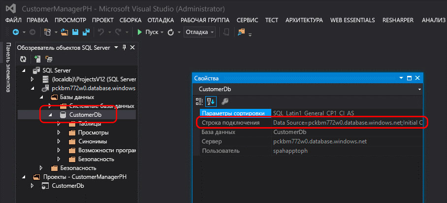
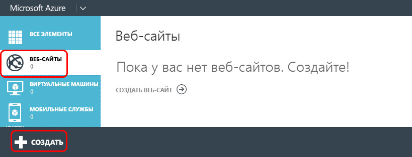

# Преобразование надстройки SharePoint с автоматическим размещением в надстройку с размещением у поставщикаConvert an autohosted SharePoint Add-in to a provider-hosted add-in
Узнайте, как преобразовать надстройку SharePoint с автоматическим размещением в надстройку с размещением у поставщика.Learn how to convert an autohosted SharePoint Add-in to a provider-hosted add-in.
 

 **Примечание.** В настоящее время идет процесс замены названия "приложения для SharePoint" названием "надстройки SharePoint". Во время этого процесса в документации и пользовательском интерфейсе некоторых продуктов SharePoint и средств Visual Studio может по-прежнему использоваться термин "приложения для SharePoint". Дополнительные сведения см. в статье [Новое название приложений для Office и SharePoint](new-name-for-apps-for-sharepoint.md#bk_newname).**Note**  The name "apps for SharePoint" is changing to "SharePoint Add-ins". During the transition, the documentation and the UI of some SharePoint products and Visual Studio tools might still use the term "apps for SharePoint". For details, see  [New name for apps for Office and SharePoint](new-name-for-apps-for-sharepoint.md#bk_newname).
 

Платформа Microsoft SharePoint представляет новый подход к расширению сайтов SharePoint в дополнение к предыдущему подходу, в котором использовались настройки на основе решений. Эта новая модель расширения для SharePoint, называемая моделью надстроек, позволяет разработчикам создавать настраиваемые реализации, которые можно развернуть в средах SharePoint независимо от того, где они выполняются — локально, в SharePoint Online или в гибридном развертывании.Microsoft SharePoint introduced a new approach to extending SharePoint sites in addition to the previous approach of using solution-based customizations. This new extensibility model for SharePoint, called the add-in model, enables developers to create custom implementations that can be deployed to SharePoint environments regardless of whether they are running in an on-premises, SharePoint Online, or hybrid deployment.
 

Разработчики могут создавать два различных типа надстроек SharePoint. Первый тип, надстройка с размещением в SharePoint, обычно выполняется в браузере, а все его активы, такие как HTML-код, CSS, изображения и JavaScript, хранятся на платформе SharePoint и ею же и обслуживаются. Другой тип относится к модели облачных надстроек (CAM). В основном такие надстройки выполняются за пределами SharePoint (на другом сервере) и обмениваются с SharePoint данными посредством клиентской объектной модели (CSOM) и API REST. При подключении используется популярный протокол OAuth 2.0, поддерживаемый SharePoint.Developers can build two different types of SharePoint Add-ins. The first type, a SharePoint-hosted add-in, primarily runs in the browser; and all the assets that support it such as HTML, CSS, images and JavaScript are stored and served by SharePoint. The other types of add-ins fall into the Cloud Add-in model (CAM) and primarily run external to SharePoint on another server and communicate with SharePoint using the client-side object model (CSOM) and REST API. They establish an identity using the popular OAuth 2.0 protocol supported by SharePoint.
 

Разработчики могут внедрять надстройки, используя модель надстроек, одним из двух способов — в качестве надстройки с размещением у поставщика или надстройки с автоматическим размещением. Возможность автоматического размещения была реализована в рамках программы ознакомления при выпуске SharePoint, но в мае 2014 г. корпорация Майкрософт объявила о том, что программа ознакомления будет закрыта, а поддержка создания надстроек с автоматическим размещением прекращена. Объявление см. в публикации блога, посвященной [обновлению программы ознакомления с надстройками с автоматическим размещением](http://blogs.office.com/2014/05/16/update-on-autohosted-apps-preview-program/).Developers could implement add-ins using the add-in model in one of two ways, either as a provider-hosted add-in or an autohosted add-in. Autohosted add-ins were released as a preview program when SharePoint released, but in May, 2014 Microsoft announced that they would be closing the preview program and would no longer support creating autohosted add-ins. For the announcement, see  [Update on Autohosted Add-ins Preview Program](http://blogs.office.com/2014/05/16/update-on-autohosted-apps-preview-program/).
 
В этой статье рассказывается о преобразовании и миграции надстройки с автоматическим размещением в надстройку с размещением у поставщика. Тем не менее, очень важно, чтобы разработчики понимали некоторые принципиальные различия между двумя подходами, так как это значительно упростит процесс преобразования.This article explains how to convert and migrate an autohosted add-in to a provider-hosted add-in. However, it is important developers understand some specific differences between the two approaches because this knowledge greatly simplifies the conversion process.
 

## Предварительные требования для преобразования надстройки с автоматическим размещением в надстройку с размещением у поставщикаPrerequisites for converting an autohosted add-in to a provider-hosted add-in

- Все [предварительные требования для разработки надстроек, размещаемых у поставщика](get-started-creating-provider-hosted-sharepoint-add-ins.md).All of the  [prerequisites for developing provider-hosted add-ins](get-started-creating-provider-hosted-sharepoint-add-ins.md).
    
 
- Пакет Azure SDK версии 2.3. Установите его с [этой страницы Центра загрузки](http://azure.microsoft.com/downloads).Azure SDK v2.3. Install it from here  [this Download Center page](http://azure.microsoft.com/downloads).
    
 

### Основные сведенияCore concepts to know

Чтобы преобразовать надстройку с автоматическим размещением в надстройку с размещением у поставщика, вам следует знать, как работают Надстройки SharePoint, и понимать различия между Надстройки SharePoint с размещением в SharePoint, размещением у поставщика и автоматическим размещением. Статьи, указанные в Таблице 1, позволят вам получить такую информацию.Before you convert an autohosted add-in to a provider-hosted add-in, you should have a basic understanding of SharePoint Add-ins and the differences among SharePoint-hosted, provider-hosted, and autohosted SharePoint Add-ins. The articles listed in Table 1 should give you that understanding.
 

 

**Таблица 1. Основные сведения о преобразовании надстройки с автоматическим размещением в надстройку с размещением у поставщика****Table 1. Core concepts for converting an autohosted add-in to a provider-hosted add-in**

|**Название статьи****Article title**|**Описание****Description**|
|:-----|:-----|
| [Надстройки SharePointSharePoint Add-ins](sharepoint-add-ins.md)|Изучите новую модель надстроек в SharePoint, с помощью которой можно создавать небольшие и удобные в использовании надстройки для пользователей.Learn about the new add-in model in SharePoint that enables you to create add-ins, which are small, easy-to-use solutions for end users.|
| [Важные аспекты разработки и архитектуры для надстроек SharePointImportant aspects of the SharePoint Add-in architecture and development landscape](important-aspects-of-the-sharepoint-add-in-architecture-and-development-landscap.md)|Узнайте обо всех аспектах архитектуры Надстройки SharePoint и Модель для надстроек SharePoint, включая варианты размещения надстроек, параметры пользовательского интерфейса, системы развертывания, систему безопасности и жизненный цикл.Learn about aspects of the architecture of SharePoint Add-ins and the model for SharePoint Add-ins, including the add-in hosting options, user interface (UI) options, deployment system, security system, and lifecycle.|
| [Выбор шаблонов для разработки и размещения надстройки SharePointChoose patterns for developing and hosting your SharePoint Add-in](choose-patterns-for-developing-and-hosting-your-sharepoint-add-in.md)|Узнайте о различных способах размещения надстроек SharePoint.Learn about the various ways that you can host SharePoint Add-ins.|
| [Хост-сайты, сайты надстроек и компоненты SharePoint в SharePointHost webs, add-in webs, and SharePoint components in SharePoint](host-webs-add-in-webs-and-sharepoint-components-in-sharepoint.md)|Узнайте о различиях между хост-сайтами и сайтами надстроек. Также ознакомьтесь с компонентами SharePoint, которые можно включить в надстройку SharePoint, развернутую на хост-сайте или сайте надстройки, и узнайте о развертывании сайта надстройки в изолированном домене.Learn about the distinction between host webs and add-in webs. Also find out which SharePoint components can be included in a SharePoint Add-in, which are deployed to the host web, which are deployed to the add-in web, and how the add-in web is deployed in an isolated domain.|

## Преобразование надстроекConverting the add-in

Если вы преобразовываете надстройку SharePoint с автоматическим размещением в надстройку с размещением у поставщика, вам необходимо изменить два или три компонента.Converting an autohosted SharePoint Add-in to a provider-hosted add-in involves modifying two or three components.
 

 

- Непосредственно надстройку SharePointThe SharePoint add-in itself
    
 
- Удаленное веб-приложение или службыThe remote web application or services
    
 
- База данных SQL Microsoft Azure, если таковая присутствует (в надстройке)The Microsoft Azure SQL Database, if any, in the add-in
    
 
Надстройка SharePoint с автоматическим размещением развертывает Веб-сайт Azure и База данных SQL Microsoft Azure автоматически при установке, но надстройка с размещением у поставщика включают собственное удаленное веб-приложение и другие службы, которые могут располагаться на любой веб-платформе. В этой статье считается, что удаленные компоненты надстройки с автоматическим размещением останутся службами Azure после преобразования в надстройку с размещением у поставщика.A SharePoint autohosted add-in deployed the Azure Web Site and Microsoft Azure SQL Database automatically when it was installed, however provider-hosted add-ins can have their remote web application and other services exist in any web platform. This article assumes that the remote components autohosted add-in are going to be remain as Azure services following the conversion to a provider-hosted add-in.
 

 
В следующих разделах описывается процесс преобразования надстройки с автоматическим размещением в надстройку с размещением у поставщика. Используемый пример надстройки с автоматическим размещением Customer Manager достаточно прост, чтобы акцентировать основное внимание на этапах преобразования, а не самой надстройке. Преобразование включает три проекта:The following sections walk through the process of converting an autohosted add-in to a provider-hosted add-in. The example autohosted add-in that is used - Customer Manager - is simple, in order to focus on the conversion steps and not the actual add-in. It consists of three projects:
 

 

- CustomersDb: проект базы данных SQL, который создаст необходимые *DACPAC-файлы. Обратите внимание, что этот проект не имеет определенной схемы. Он просто используется для создания базы данных, так как схема создается веб-приложением ASP.NET.CustomersDb: A SQL database project that will generate the necessary *.dacpac. Note there is no schema defined in this project. It is simply used to create a database because the schema is created by the ASP.NET web application.
    
 
- CustomerManagerAH: надстройка SharePoint с автоматическим размещением, настроенная на включение проекта веб-приложения ASP.NET и приложения уровня данных Azure SQL в итоговый пакет надстройки SharePoint.CustomerManagerAH: A SharePoint autohosted add-in that is configured to include the ASP.NET web application project and Azure SQL data-tier application in the resulting SharePoint add-in package.
    
 
- CustomerManagerAHWeb: веб-приложение ASP.NET MVC, которое использует Entity Framework Code First с подходом Migrations для создания схемы базы данных, а также чтения и записи в нее.CustomerManagerAHWeb: An ASP.NET MVC web application that uses the Entity Framework Code First with Migrations approach to create the database schema as well as read and write to the database.
    
 
Надстройка представляет собой веб-приложение ASP.NET MVC, отображающее клиентов, данные о которых хранит в таблице База данных SQL Microsoft Azure, а также имеющее возможность добавления новых клиентов. Это анонимное веб-приложение, позволяющее всем пользователям просматривать или добавлять клиентов. Решение Visual Studio для надстройки с автоматическим размещением и связанные проекты можно скачать из открытого репозитория  [Autohosted-Migration-Code-Samples](https://github.com/OfficeDev/Auto-Hosted-Migration-Code-Samples).The add-in is an ASP.NET MVC web application that can both show the customers from a table in an Microsoft Azure SQL Database as well as add new customers. This is an anonymous web application that will allow anyone to view or add customers. The Visual Studio solution for the autohosted add-in and associated projects can be downloaded from the following public repository:  [Autohosted-Migration-Code-Samples](https://github.com/OfficeDev/Auto-Hosted-Migration-Code-Samples).
 

 
Преобразование надстройки SharePoint с автоматическим размещением в надстройку с размещением у поставщика включает несколько действий. Все они описаны в указанных ниже разделах.Converting a SharePoint autohosted add-in to a provider-hosted add-in involves multiple steps. Each is outlined in the following sections.
 

 

1. Развертывание База данных SQL Microsoft AzureDeploy the Microsoft Azure SQL Database
    
 
2. Создание решения Веб-сайт Azure для размещения удаленного веб-приложенияCreate the Azure Web Site to host the remote web application
    
 
3. Регистрация надстройки на сайте SharePointRegister the add-in with your SharePoint site
    
 
4. Обновление и развертывание решения Веб-сайт Azure для удаленного веб-приложенияUpdate and deploy the Azure Web Site for the remote web application
    
 
5. Обновление и развертывание надстройки SharePoint с размещением у поставщикаUpdate and deploy the SharePoint provider-hosted add-in
    
 

### Развертывание Базы данных SQL AzureDeploy the Azure SQL Database

Первый этап преобразования надстройки с автоматическим размещением в надстройку с размещением у поставщика включает развертывание решения База данных SQL Microsoft Azure, которое использует веб-приложение ASP.NET. База данных SQL Microsoft Azure может быть создана различными способами, часть которых представлена на веб-сайте с документацией по Microsoft Azure, где описывается  [развертывание базы данных в Azure](http://azure.microsoft.com/documentation/articles/sql-database-deploy/).The first step in converting the autohosted add-in to a provider-hosted add-in is to deploy the Microsoft Azure SQL Database that the ASP.NET web application will rely on. There are many different ways to create a Microsoft Azure SQL Database, some of which are documented on the Microsoft Azure documentation site:  [How to Deploy a Database to Azure](http://azure.microsoft.com/documentation/articles/sql-database-deploy/).
 

 
В описанном далее подходе используется модель развертывания надстройки уровня данных, так как это позволяет развернуть базу данных в надстройке SharePoint с автоматическим размещением. Она включает создание пакета надстройки уровня данных (DACPAC) и его использование для создания базы данных.The approach outlined in the following steps uses the data-tier application deployment model because that is how the database is deployed in a SharePoint autohosted add-in. This involves generating a data-tier application package (*.dacpac) and using it to create the database.
 

 

#### Создание и развертывание Базы данных SQL AzureCreating and Deploying the Azure SQL Database

Сначала откройте решение с автоматическим размещением в Visual Studio. Щелкните правой кнопкой мыши проект базы данных **CustomerDb** и выберите пункт меню **Создать**. Это действие создаст файл CustomerDb.dacpac в папке `[..]\bin\[debug | release]`.First open the autohosted solution in Visual Studio. Right-click the database project  **CustomerDb** and select **Build**. This will generate the CustomerDb.dacpac file in the  `[..]\bin\[debug | release]` folder.
 

 
Следующее действие — создание Базы данных SQL Microsoft Azure. Войдите на **портал управления Azure** (https://manage.windowsazure.com) и после загрузки панели управления выберите в поле ссылку "Базы данных".The next step is to create a new Microsoft Azure SQL Database. Login to the  **Azure Management Portal** (https://manage.windowsazure.com) and once the dashboard loads, select the SQL DATABASES link in the margin:
 

 

**Панель управления Базы данных SQL Azure на портале управления Azure****Azure SQL Database dashboard in the Azure Management Portal**

 

 

 
На верхней панели навигации щелкните ссылку **Серверы** и нажмите кнопку **Добавить** в нижнем колонтитуле, как показано на следующем рисунке:Click the  **SERVERS** link in the top navigation and then click the **ADD** button in the footer as shown in the following figure:
 

 

**Панель управления Базы данных SQL Azure на портале управления Azure****Azure SQL Database dashboard in the Azure Management Portal**

 

 

 
В появившемся диалоговом окне **Создать сервер** выберите Azure в поле **Подписка**, укажите **Имя для входа** и **Пароль** пользователя с правами доступа к серверу, а затем выберите такой же **Регион**, который использовался ранее при создании веб-сайта Azure. Запишите имя для входа и пароль, так как они потребуются в следующем шаге.In the  **CREATE SERVER** dialog that appears, select the Azure **SUBSCRIPTION**, the  **LOGIN NAME** and **PASSWORD** for the user who will have rights to the server and select the same **REGION** used when creating the Azure Web Site previously. Make a note of the login name and password as those will be needed in a later step.
 

 

**Создание Базы данных SQL Azure на портале управления Azure****Creating an Azure SQL Database in the Azure Management Portal**

 

 

 
Заполнив форму, нажмите **значок проверки** в правом нижнем углу, чтобы создать базу данных. После создания сервера доступ к базе данных имеют лишь другие службы Azure. Запишите имя Базы данных SQL Microsoft Azure, так как оно понадобится на следующем шаге.Once the form is filled out, click the  **check icon** in the lower right to create the database. While the server is now created, the only resource that can access it are other Azure services. Make a note of the name of the Microsoft Azure SQL Database because this will be needed in a later step.
 

 
Чтобы подключить решение База данных SQL Microsoft Azure и развернуть базу данных, необходимо создать правило брандмауэра, разрешающее трафик от компьютера, который развертывает базу данных. В противном случае База данных SQL Microsoft Azure не сможет принимать подключения, так как будут возникать ошибки, аналогичные изображенным на следующем рисунке:In order to connect to the Microsoft Azure SQL Database and deploy the database, a firewall rule must be created that allows traffic from the computer that will deploy the database. Otherwise connections to the Microsoft Azure SQL Database will be refused with errors similar to the one in the following figure:
 

 

**Ошибка подключения к Базе данных SQL Azure****Error Connecting to an Azure SQL Database**

 

 

 
Чтобы создать правило брандмауэра, на **портале управления Azure** выберите предварительно созданный экземпляр Базы данных SQL Microsoft Azure и щелкните ссылку **Настроить** на верхней панели навигации. В разделе **Разрешенные IP-адреса** отобразится ваш IP-адрес, как показано на приведенном ниже рисунке. Щелкните **Добавить к разрешенным IP-адресам**, чтобы добавить правило брандмауэра. Это позволит выполнить подключения к Базе данных SQL Microsoft Azure и развернуть базы данных. Не забудьте нажать кнопку **Сохранить** в нижнем колонтитуле.To create a firewall rule, within the  **Azure Management Portal**, select the Microsoft Azure SQL Database previously created and then click the  **CONFIGURE** link in the top navigation. Under the **Allowed IP Addresses** section, your IP address is currently shown as shown in the following figure. Click **ADD TO THE ALLOWED IP ADDRESSES** to add a firewall rule. Doing so will allow connections to the Microsoft Azure SQL Database and deployment of the database. Make sure to click the **Save** button in the footer.
 

 

**Создание правила брандмауэра для Базы данных SQL Azure на портале управления Azure****Creating a firewall rule for an Azure SQL Database in the Azure Management Portal**

 

 

 
Следующий шаг включает развертывание базы данных. Его можно выполнить из Visual Studio с помощью пакета Azure SDK версии 2.3. Установите его с [этой страницы Центра загрузки](http://azure.microsoft.com/downloads). В Visual Studio откройте окно **обозревателя объектов SQL Server**, щелкните правой кнопкой мыши узел **SQL Server** и выберите пункт **Добавить SQL Server**:The next step is to deploy the database. This can be done from Visual Studio using the Azure SDK v2.3. Install it from  [this Download Center page](http://azure.microsoft.com/downloads). Within Visual Studio, open the  **SQL Server Object Explorer** tool window, right-click the **SQL Server** node and select **Add SQL Server**:
 

 

**Добавление Базы данных SQL Azure в обозревателе объектов****Adding an Azure SQL Database in Server Explorer**

 

 

 
В диалоговом окне **Подключиться к серверу** введите **Имя сервера**, установите для параметра **Проверка подлинности** значение **Проверка подлинности SQL Server** и введите значения в поля **Имя для входа** и **Пароль**, заданные при создании Базы данных SQL Microsoft Azure. Имя сервера должно быть полным, т. е. иметь формат `[server-name].database.windows.net`, как показано на следующем рисунке:In the  **Connect to Server** dialog, enter the **Server Name**, set the  **Authentication** to **SQL Server Authentication** and enter the same **Login** and **Password** defined when creating the Microsoft Azure SQL Database. The server name should be the fully qualified name of the server which is `[server-name].database.windows.net`, as shown in the following figure:
 

 

**Подключение к Базе данных SQL Azure в Visual Studio****Connecting to an Azure SQL Database in Visual Studio**

 

 

 
После подключения к Базе данных SQL Microsoft Azure разверните узел для добавленного сервера, щелкните правой кнопкой мыши на узле **Базы данных** и выберите **Публикация приложения уровня данных**, чтобы открыть мастер публикования.After connecting to the Microsoft Azure SQL Database, expand the node for the newly added server, right-click on the  **Databases** node and select **Publish Data-tier Application** to bring up the publishing wizard.
 

 
В разделе **Исходное приложение уровня данных (DACPAC)** нажмите кнопку **Обзор**, чтобы найти DACPAC-файл, сгенерированный при создании проекта базы данных на предыдущем шаге, убедитесь, что для параметра **Имя базы данных** установлено значение "CustomerDb" и нажмите **Опубликовать**, чтобы опубликовать CustomerDb в Базе данных SQL Microsoft Azure.In the section  **Source Data-tier Application (.dacpac)**, use the  **Browse** button to find the *.dacpac file generated from when the database project was built in a previous step and ensure the **Database Name** is set toCustomerDb, then click  **Publish** to publish the CustomerDb in the Microsoft Azure SQL Database.
 

 

**Публикация приложения уровня данных в Базе данных SQL Azure с помощью Visual Studio****Publishing a Data-tier Application to an Azure SQL Database using Visual Studio**

 

 

 
Обновите окно **обозревателя объектов SQL Server** в Visual Studio, чтобы база данных CustomerDb отобразилась в разделе узла **Базы данных**.Refresh the Visual Studio  **SQL Server Object Explorer** tool window to see the CustomerDb listed under the **Databases** node.
 

 

    
 **Примечание.** В зависимости от способа создания базы данных для надстройки с автоматическим размещением, для ее развертывания в Azure могут понадобиться дополнительные действия. Дополнительные сведения см. в следующих статьях MSDN: [Преобразование между проектами приложений уровня данных и проектами баз данных](http://msdn.microsoft.com/library/40b51f5a-d52c-44ac-8f84-037a0917af33.aspx), [Создание приложений уровня данных и управление ими](http://msdn.microsoft.com/library/18907b6c-7678-4182-9304-fe56fdb9f0bd.aspx).**Note**   Depending on how the database was created for the autohosted add-in, some extra work might be necessary to deploy it to Azure. Refer to the following articles in MSDN for additional guidance: [Converting between Data-tier Application Projects and Database Projects](http://msdn.microsoft.com/library/40b51f5a-d52c-44ac-8f84-037a0917af33.aspx) [Creating &amp; Managing Data-Tier Application](http://msdn.microsoft.com/library/18907b6c-7678-4182-9304-fe56fdb9f0bd.aspx)
 

#### Действия после развертыванияPost-deployment actions

После создания экземпляра Базы данных SQL Microsoft Azure сделайте копию строки подключения, которая используется при подключении к базе данных. Это можно сделать двумя способами. Вы можете войти на **портал управления Azure** (https://manage.windowsazure.com) и перейти к экземпляру Базы данных SQL Microsoft Azure, созданному на последнем шаге: CustomerDb. На странице **Панель управления** базы данных щелкните ссылку **Показать строки подключения**, чтобы просмотреть список строк подключения. Скопируйте строку подключения **ADO.NET** для дальнейшего использования.Once the Microsoft Azure SQL Database has been created, make a copy of the connection string used to establish a connection to the database. This can be obtained two ways. One way is to login to the  **Azure Management Portal** (https://manage.windowsazure.com) and navigate to the Microsoft Azure SQL Database created in the last step: CustomerDb. On the **DASHBOARD** page for the database, click the link **Show Connection Strings** to see a list of connection strings. Make a copy of the **ADO.NET** connection string for later use.
 

 

**Получение строк подключений для Базы данных Azure SQL на портале управления Azure****Obtaining Azure SQL Database Connection Strings from the Azure Management Portal**

 

 

 
Вы также можете получить строку подключения с помощью Visual Studio, если имеется установленный пакет Azure SDK версии 2.3. В окне **обозревателя объектов SQL Server** в Visual Studio выберите базу данных **CustomerDb**. После выбора базы данных просмотрите окно **Свойства** со строкой подключения. Она будет иметь такое же значение, что и строка на **портале управления Azure**, приведенная выше.The other way to get the connection string is from within Visual Studio, provided the Azure SDK v2.3 is installed. Within the  **SQL Server Object Explorer** tool window in Visual Studio, select the database **CustomerDb**. Once the database is selected, look at the  **Properties** tool window to see connection string. This is the same value found in the **Azure Management Portal** above.
 

 

**Получение строк подключений SQL Azure из Visual Studio с помощью пакета Azure SDK****Obtaining Azure SQL Database Connection Strings from Visual Studio via the Azure SDK**

 

 

 

 

 

### Создание платформы Веб-сайт AzureCreate an Azure Web Site

Следующий этап создание новой платформы Веб-сайт Azure, на которой будет размещено удаленное веб-приложение для надстройки с размещением у поставщика. Это действие нужно выполнить первым, так как URL-адрес удаленного веб-приложения необходимо получить до регистрации самой надстройки. Тем не менее, регистрация надстройки в SharePoint должна быть выполнена перед развертыванием файлов для веб-приложения ASP.NET, так как в процессе регистрации будет создано два значения (идентификатор и секрет клиента), которые требуется получить до развертывания файлов веб-приложения ASP.NET.The next step is to create a new Azure Web Site where the remote web application will reside for the provider-hosted add-in. This has to be done first because the URL of the remote web application is needed before registering the add-in. However, the registration of the add-in in SharePoint should precede the deployment of the files for the ASP.NET web application because there are two outputs from the registration process (the Client ID and Client Secret) that are needed prior to the deployment of the ASP.NET web application files.
 

 
Чтобы создать новый веб-сайт Azure, сначала войдите на **портал управления Azure** (https://manage.windowsazure.com). После загрузки панели управления щелкните навигационную ссылку **Веб-сайты** в левом поле, а затем нажмите кнопку **Создать** в нижнем колонтитуле, как показано на следующем рисунке.To create a new Azure Web Site, first login to the  **Azure Management Portal** (https://manage.windowsazure.com). When the dashboard loads, click the **WEB SITES** navigation link in the left-hand margin, and then the **NEW** button in the footer as shown in the following figure:
 

 

**Панель управления веб-сайта Azure на портале управления Azure****Azure Web Site dashboard in the Azure Management Portal**

 

 

 
Далее в мастере нового веб-сайта выберите **Вычислить**, **Веб-сайт**, **Быстрое создание** и укажите значение для параметра **URL-адрес** и **План размещения веб-сайтов**. Наконец, укажите значение для параметра **Регион**, в котором нужно создать веб-сайт. Обязательно запомните выбранный регион, так как такой же регион необходимо использовать для Базы данных SQL Microsoft Azure, которое создается позже. Кроме того, если план веб-размещения еще не существует или нужно определить новый, выберите вариант **Создать новый план размещения веб-сайтов**. См. пример на приведенном ниже рисунке.Next, in the new web site wizard, select  **COMPUTE**,  **WEB SITE**,  **QUICK CREATE** and then specify a **URL** and **WEB HOSTING PLAN**. Finally specify the  **REGION** where the web site should be created. Make sure to remember the region selected because the same region should be used for the Microsoft Azure SQL Database created later. In addition, if a web hosting plan does not already exist or a new one is desired, select the option **Create new web hosting plan**. The following figure shows an example:
 

 

**Создание веб-сайта Azure на портале управления Azure****Creating an Azure Web Site in the Azure Management Portal**

 

 

 
После создания платформы Веб-сайт Azure запишите URL-адрес, используемый для сайта. На рисунках выше созданный сайт имеет адрес  `http://spahapptoph.azurewebsites.net`.After creating the Azure Web Site, make a note of the URL that is used for the site. In the figures above, the site created is  `http://spahapptoph.azurewebsites.net`. 
 

 

### Регистрация новой надстройкиRegister a new add-in

Все Надстройки SharePoint, созданные с помощью модели надстроек, должны быть зарегистрированы в ферме размещения или среде SharePoint. Это позволит установить уровень доверия между SharePoint и удаленным веб-приложением. Процесс включает регистрацию нового субъекта надстройки в SharePoint со следующими значениями:All SharePoint Add-ins created using the add-in model must be registered with the hosting SharePoint farm or tenancy in order to establish a trust between SharePoint and the remote web application. This involves registering a new add-in principal with SharePoint specifying the following values:
 

 

-  **ИД клиента** — идентификатор надстройки.**Client ID** - the add-in ID
    
 
-  **Секрет клиента** — пароль надстройки.**Client Secret** - the add-in password
    
 
-  **Название** — название надстройки.**Title** - the name of the add-in
    
 
-  **Домен надстройки** — домен верхнего уровня для удаленного веб-приложения.**Add-in Domain** - the top-level domain of the remote web application
    
 
Если надстройка с автоматическим размещением устанавливается в SharePoint Online, Office 365 создает субъект надстройки автоматически. Решению уже известен URL-адрес удаленного веб-приложения, так как оно создает сайт автоматически. Оно также добавляет ИД клиента и секрет клиента в файл web.config удаленного веб-приложения. Именно в файле web.config предоставляемый корпорацией Майкрософт класс (в VB-файле или TokenHelper.cs) будет осуществлять поиск ИД и секрета при проверке запросов и проверке подлинности с помощью SharePoint.When an autohosted add-in is installed in SharePoint Online, Office 365 creates the add-in principal automatically. It knows the URL of the remote web application because it creates the site automatically. It also takes the client ID and client secret and adds them to the remote web application's web.config. The web.config is where a class provided by Microsoft (in the TokenHelper.cs or .vb file) will look for them when validating requests and authenticating with SharePoint.
 

 
Но для надстроек с размещением у поставщика разработчик должен вручную зарегистрировать надстройку и вручную обновить файл web.config в веб-проекте ASP.NET.However, in a provider-hosted add-in, the developer has to manually register the add-in and manually update the web.config in the ASP.NET web project.
 

 
Чтобы зарегистрировать новую надстройку, перейдите на страницу регистрации надстроек на веб-сайте SharePoint, где установлена эта надстройка. Эту страницу можно найти по адресу `http://[SharePoint-site-url]/_layouts/15/appregnew.aspx`. На странице регистрации надстроек установите для параметра **Тип надстройки** значение **Надстройка, выполняемая на веб-сервере** и дважды щелкните кнопку **Создать**, чтобы создать новые **ИД клиента** и **Секрет клиента**. Введите имя надстройки в поле **Название** и URL-адрес целевого веб-сайта Azure, созданного на предыдущем этапе, в поле **Домен надстройки**. Наконец, нажмите кнопку **Создать**.To register a new add-in, browse to the add-in registration page of the SharePoint website's where the add-in will be installed. This page is found at  `http://[SharePoint-site-url]/_layouts/15/appregnew.aspx`. On the add-in registration page, set the  **Add-in Type** to **An add-in running on a web server** and click the two **Generate** buttons to create a new **Client Id** and **Client Secret**. Enter the name of the add-in in the  **Title** field and the URL of the target Azure Web Site created it the previous step in the **Add-in Domain** field. Finally, click the **Create** button.
 

 
После регистрации надстройки SharePoint покажет сводку с данными, которые использовались в форме для регистрации. Очень важно скопировать и сохранить эти данные, особенно ИД клиента и секрет клиента, так как их нужно будет использовать на последующем этапе.After the add-in has been registered, SharePoint will display a summary of the information that was used in the form to create the registration. It is very important that this information is copied for safekeeping, specifically the Client Id and Client Secret, because these are needed in a later step.
 

 

### Изменения удаленного веб-приложения или конфигурации, которую имеет Веб-сайт AzureRemote web application / Azure Web Site configuration changes

Следующий этап заключается в перенастройке удаленного веб-приложения, чтобы его можно было развернуть в качестве надстройки с размещением у поставщика, а не надстройки с автоматическим размещением. Развернуть сайт ASP.NET на платформе Веб-сайт Azure можно различными способами (включая непосредственное развертывание из Visual Studio, автоматическое развертывание из системы управления версиями, например Visual Studio Online, из GitHub или даже посредством испытанного FTP-развертывания). В этой статье описывается метод с использованием Visual Studio. Но перед развертыванием веб-приложения для него нужно установить несколько обновлений, чтобы оно смогло работать с надстройкой, размещаемой у поставщика.The next step is to reconfigure the remote web application so that it can be deployed as a provider-hosted add-in instead of an autohosted add-in. There are multiple ways to deploy an ASP.NET site to an Azure Web Site including deploying it straight from Visual Studio, automatically from source control like Visual Studio Online, or from GitHub, or even by using the tried and true FTP option. In this article Visual Studio is used. However before the web application can be deployed, it first needs a few updates in order to work with the provider-hosted add-in.
 

 

#### Обновление проекта удаленного веб-приложенияUpdate the remote web application project

Основные изменения в веб-приложении ASP.NET MVC необходимо внести в файл web.config. В этом файле указаны три параметра, присутствующие на узле **<appSettings>**: **ClientId**, **ClientSecret** и **SqlAzureConnectionString**. Первые два используются классом, предоставляемом корпорацией Майкрософт, в файле TokenHelper.cs (или TokenHelper.vb) и позволяют упростить проверку подлинности и обмен данными с SharePoint из удаленного веб-приложения. Последний параметр, `SqlAzureConnectionString`, используется надстройкой для подключения к Базе данных SQL Microsoft Azure.The big change that needs to occur in the ASP.NET MVC web application is within the web.config file. Within this file there are three settings found within the  **<appSettings>** node. These are the **ClientId**,  **ClientSecret**, and  **SqlAzureConnectionString**. The first two are used by the Microsoft-provided class, in TokenHelper.cs or .vb, to facilitate authenticating and communicating with SharePoint from the remote web application. The latter,  `SqlAzureConnectionString`, is used by the add-in to connect to the Microsoft Azure SQL Database.
 

 
В случае с автоматически размещаемой надстройкой SharePoint Office 365 записывает значения для этих параметров при создании платформы Веб-сайт Azure и решения База данных SQL Microsoft Azure в процессе установки надстройки. Но в случае надстройки с размещением у поставщика значения необходимо задать вручную перед развертыванием надстройки.In a SharePoint autohosted add-in, Office 365 fills in the values for these settings when the Azure Web Site and Microsoft Azure SQL Database are created when the add-in is installed. However in a provider-hosted add-in these must be manually set before the add-in is deployed.
 

 
Вы можете вставить значения для этих трех параметров из шагов выше, но недостаток такого подхода состоит в том, что при каждом их изменении вам потребуется вручную обновлять файл web.config и повторно развертывать его на платформе Веб-сайт Azure.One option is to paste in the values for the three settings from the steps above, but the disadvantage with this approach is that if they ever need to be changed, the web.config will need to be manually updated and redeployed to the Azure Web Site.
 

 
Вы также можете просто очистить эти параметры (сохраните ключи параметров и просто сохраните атрибут **value=""** с пустой строкой) и определить их в параметрах веб-сайта Azure на **портале управления Azure**. При таком подходе параметры можно обновлять без обновления базы кода.Another option is to simply clear these settings (leave the settings keys in place, just set the  **value=""** attribute to an empty string) and instead define them in the Azure Web Site settings through the **Azure Management Portal**. This approach means that the settings can be changed without updating the codebase.
 

 
Чтобы сделать это, войдите на **портал управления Azure** (https://manage.windowsazure.com) и перейдите на веб-сайт Azure, созданный на предыдущих этапах. На странице панели мониторинга веб-сайта Azure нажмите **Настроить** в верхнем навигационном меню и перейдите к разделу **параметры надстройки**. Добавьте три новых параметра для надстройки, используя имена параметров из файла web.config. Воспользуйтесь значениями, полученными на предыдущих этапах, для значений ClientId, ClientSecret и SqlAzureConnectionString.To do this, login to the  **Azure Management Portal** (https://manage.windowsazure.com) and navigate to the Azure Web Site created in the previous steps. On the Azure Web Site dashboard page, click **CONFIGURE** in the top navigation menu and then scroll down to the **add-in settings** section. Add three new add-in settings using the same same setting names from the web.config file. Use the values obtained in the previous steps for ClientId, ClientSecret, and SqlAzureConnectionString.
 

 
Убедитесь, что строка подключения, которую использует База данных SQL Microsoft Azure, действительна и введена правильно, так как при отображении строки подключения на **портале управления Azure** и в Visual Studio атрибут пароля будет заменен маской. Пароль с маской в строке подключения необходимо изменить, чтобы использовать правильный пароль, определенный при создании имени для входа в Базу данных SQL Microsoft Azure.Make sure the Microsoft Azure SQL Database connection string is correct and valid because, when the connection string is exposed through the  **Azure Management Portal** and Visual Studio, the password attribute is replaced with a mask. The masked password in the connection string should be changed to use the correct password defined when creating the login for the Microsoft Azure SQL Database.
 

 

#### Развертывание удаленного веб-приложения на веб-сайте Azure Deploying the Remote web application to the Azure Web Site

Теперь файлы веб-приложения ASP.NET MVC необходимо развернуть на веб-сайте Azure в виде удаленного веб-приложения. В Visual Studio щелкните правой кнопкой мыши веб-проект и выберите пункт **Опубликовать**. Это действие откроет диалоговое окно мастера **Публикация веб-сайта**. В этом диалоговом окне выберите вариант **Веб-сайты Windows Azure** и нажмите кнопку **Опубликовать**.Now the ASP.NET MVC web application files need to be deployed to the Azure Web Site as the remote web application. Within Visual Studio, right-click the web project and select  **Publish**. This will launch the  **Publish Web** wizard dialog. In this dialog select the option **Windows Azure Web Sites** and click **Publish**.
 

 

**Диалоговое окно публикации веб-сайта в Visual Studio****Visual Studio's Publish Web Dialog**

 

 

 
На следующем шаге выберите имя веб-сайта Azure, которое было создано на предыдущем шаге, как показано на следующем рисунке, нажмите кнопку **ОК** и убедитесь, что URL-адрес сайта использует протокол HTTPS.In the next step, select the name of the Azure Web Site that was created in a previous step as shown in the following figure, click  **OK**, and ensure the URL of the site is HTTPS.
 

 

**Публикация веб-приложения ASP.NET на существующем веб-сайте Azure****Publishing the ASP.NET web application to an existing Azure Web Site**

 

 

 
На последнем шаге нажмите кнопку **Проверить подключение**, чтобы убедиться, что параметры введены правильно и подключение работает, и щелкните **Опубликовать**. Это действие запустит процесс публикации веб-приложения ASP.NET на веб-сайте Azure с помощью Visual Studio.In the last step, click the button  **Validate Connection** to ensure the settings and connection is in good working order and finally click **Publish**. This will trigger Visual Studio to deploy the ASP.NET web application to the Azure Web Site. 
 

 
После развертывания веб-сайта Visual Studio запустит браузер отладки по умолчанию и перейдет к платформе Веб-сайт Azure. Но сайт при этом будет отображаться с ошибкой. Она возникает, так как контроллеры ASP.NET MVC включают атрибут (особенно  `SharePointContextFilter`), который ожидает отправку определенных значений от SharePoint к контроллеру в заголовке запроса HTTP POST, но по умолчанию браузер запускает запрос HTTP GET, поэтому эта ошибка ожидаема.After deploying the website, Visual Studio will launch the default debugging browser and navigate to the Azure Web Site. However the site will render with an error. This is because the ASP.NET MVC controllers are decorated with an attribute (specifically the  `SharePointContextFilter`) that expects SharePoint to send certain values to the controller in the header of an HTTP POST request, but by default the browser launched an HTTP GET request, so this error is expected.
 

 

    
 **Примечание.** Дополнительные сведения о дополнительных вариантах для развертывания веб-приложений ASP.NET на веб-сайте Azure см. в документации по Azure о [развертывании веб-сайта Microsoft Azure](http://azure.microsoft.com/documentation/articles/web-sites-deploy).**Note**  Refer to the Azure documentation for additional options for deploying ASP.NET web applications to an Azure Web Site:  [How to Deploy a Microsoft Azure Web Site](http://azure.microsoft.com/documentation/articles/web-sites-deploy).
 

#### Действия после развертыванияPost-deployment actions

На следующем шаге необходимо скопировать URL-адрес сайта.The next step is to copy the URL of the site.
 

 

#### Пользовательские домены и SSL-сертификаты для веб-сайтов AzureCustom Domains and SSL Certificates for Azure Web Sites

Все Веб-сайты Azure используют следующее соглашение об именовании:  `http[s]://[site-name].azurewebsites.net`. Корпорация Майкрософт уже добавила шаблон SSL-сертификата ко всем веб-сайтам в домене  `*.azurewebsites.net`, но клиенты могут связать пользовательский домен с их платформой Веб-сайт Azure, а также использовать собственные SSL-сертификаты для таких доменов.All Azure Web Sites use the following naming convention:  `http[s]://[site-name].azurewebsites.net`. Microsoft has already added a wildcard SSL certificate to all web sites under the  `*.azurewebsites.net` domain, but customers are free to associate a custom domain with their Azure Web Site as well as use their own SSL certificates for these custom domains.
 

 
Подробнее об использовании пользовательских доменов см. в документации по Azure  [о настройке пользовательского имени домена для веб-сайта Microsoft Azure](http://azure.microsoft.com/documentation/articles/web-sites-custom-domain-name). Подробнее о добавлении пользовательского SSL-сертификата для вашего имени домена см. в документации по Azure  [о включении HTTPS для веб-сайта Microsoft Azure](http://azure.microsoft.com/documentation/articles/web-sites-configure-ssl-certificate).For information on using custom domains, refer to the Azure documentation:  [Configure a Custom Domain Name for a Microsoft Azure Web Site](http://azure.microsoft.com/documentation/articles/web-sites-custom-domain-name). For information on adding a custom SSL certificate for your custom domain name, refer to the Azure documentation:  [Enable HTTPS for a Microsoft Azure Web Site](http://azure.microsoft.com/documentation/articles/web-sites-configure-ssl-certificate).
 

 

### Изменение настроек в проекте надстройки SharePointReconfiguring the SharePoint Add-in Project

Последний этап заключается в изменении настроек для проекта надстройки SharePoint. В проекте Visual Studio для надстройки SharePoint выбрано автоматическое размещение. Сначала измените этот параметр на размещение у поставщика, открыв файл AppManifest.xml в проекте надстройки SharePoint и изменив значение параметра **Тип размещения** с **Авторазмещение** на **Размещение у поставщика**.The last step is to reconfigure the SharePoint add-in project. The Visual Studio project for the SharePoint add-in has the add-in type configured to autohosted. First change this from autohosted to provider-hosted by opening the AppManifest.xml file in the SharePoint add-in project and change the  **Hosting Type** option from **Autohosted** to **Provider-hosted**. 
 

 
Кроме того, укажите параметру **Начальная страница** URL-адрес начальной страницы удаленного веб-приложения, который представляет собой URL-адрес веб-сайта Azure. Обязательно укажите значение строки запроса {StandardTokens}, если оно отсутствует. Это гарантирует, что SharePoint добавит основные маркеры строки запроса к URL-адресу при открытии удаленного веб-приложения.In addition, set the  **Start Page** of the add-in to point to the URL of the remote web application's start page which is the URL of the Azure Web Site. Make sure to include the query string value{StandardTokens}, if it isn't already there. This ensures that SharePoint adds the core query string tokens to the URL when it opens the remote web application.
 

 
Затем удалите ссылку в проекте надстройки SharePoint на веб-приложение ASP.NET MVC, выбрав проект надстройки SharePoint в **обозревателе решений** Visual Studio и установив для параметра **Веб-проект** в окне **Свойства** значение **(Отсутствует)**, как показано на рис. 20.Next, remove the reference in the SharePoint add-in project to the ASP.NET MVC web application by selecting the SharePoint add-in project in Visual Studio  **Solution Explorer** and within the **Properties** tool window, set the **Web Project** property to **(None)**, as shown in figure 20:
 

 

**Удаление удаленного веб-приложения из пакета надстройки SharePoint****Removing the remote web application from the SharePoint add-in package**

 

 

 
На последнем шаге необходимо вручную обновить файл AppManifest.xml, так как некоторые параметры не отображаются в конструкторе. Для этого сохраните существующие изменения в файле AppManifest.xml, а затем щелкните правой кнопкой мыши этот же файл в **обозревателе решений** и выберите пункт **Просмотреть код**.The last step requires a manual update to the AppManifest.xml file because some settings are not exposed within the designer. Do this by saving any existing changes to the AppManifest.xml file, and then right-click the same file in  **Solution Explorer** and select **View Code**.
 

 

**Открытие файла AppManifest.xml в режиме просмотра кода****Opening the AppManifest.xml file in the code view**

 

 

 
В режиме просмотра кода файл AppManifest.xml удалите две ссылки на проект веб-приложения ASP.NET MVC и проект приложения уровня данных SQL, так как их наличие не требуется для надстройки SharePoint с размещением у поставщика.Within the code view of the AppManifest.xml file, remove the two references to the ASP.NET MVC web application project and the SQL data-tier application project as they are not needed within a SharePoint provider-hosted add-in.
 

 
Затем создайте новый GUID и замените существующий GUID в атрибуте **ProductId**. Это позволит SharePoint распознать надстройку как новую, а не обновление существующей.Next, create a new GUID and replace the existing GUID in the  **ProductId** attribute. This will tell SharePoint this is a new add-in, not an update to an existing add-in.
 

 

    
 **Важно!** Если вы не замените существующий атрибут ProductId, SharePoint вернет ошибку "Предоставленная надстройка отличается от другой надстройки с такой же версией и таким же кодом продукта" при установке преобразованной надстройки.**Important**  If the existing ProductId was used SharePoint would return the error "The provided add-in differs from another add-in with the same version and product ID" when the converted add-in is installed.
 

Затем найдите элемент **<RemoteWebApplication>** и обновите атрибут **ClientId** таким образом, чтобы он имел тот же GUID, который был получен при регистрации надстройки с помощью SharePoint и который использовался в параметрах надстройки (файл web.config для веб-сайта Azure).Then find the  **<RemoteWebApplication>** element and update the **ClientId** attribute to be the same GUID that was obtained when registering the add-in with SharePoint and that was used in the Azure Web Site's web.config add-in settings.
 

 

**Настройка ClientId для надстройки SharePoint с размещением у поставщика****Setting the ClientId for a SharePoint provider-hosted add-in**

 

 

 
После сохранения всех изменений в файле AppManifest.xml надстройка будет готова к тестированию в качестве надстройки SharePoint с размещением у поставщика. Разверните надстройку на ферме SharePoint или сайте SharePoint Online, чтобы проверить правильность действий по преобразованию.After saving all changes to the AppManifest.xml file, the add-in is now ready for testing as a SharePoint provider-hosted add-in. Deploy the add-in to a SharePoint farm or SharePoint Online site to verify the conversion steps were performed correctly.
 

 

## Другие ресурсыOther resources

Дополнительные сведения о модели надстроек SharePoint, надстройках SharePoint с размещением у поставщика или модели таких надстроек см. в  [блоге разработчиков Office](http://blogs.office.com/dev/), где публикуются новости и обновления инструментов разработки, сценарии и служебные программы, упрощающие создание надстроек SharePoint и их преобразование из надстроек с автоматическим размещением в надстройки с размещением у поставщика.For more information on the SharePoint add-in model, SharePoint-hosted add-ins or the add-in model, follow the  [Office Developer Blog](http://blogs.office.com/dev/) for news and updates on development tools, scripts and utilities to assist in creating SharePoint add-ins and migrating from autohosted add-ins to provider-hosted add-ins.
 

 

