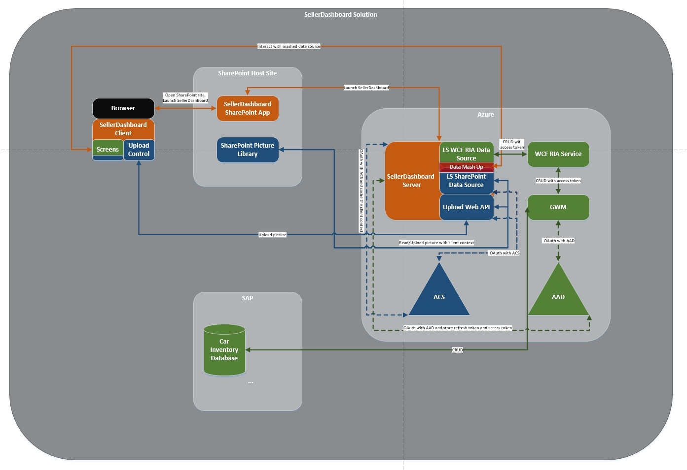
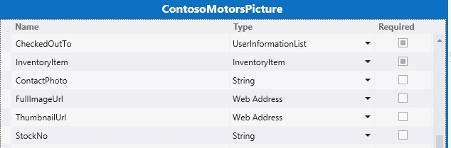
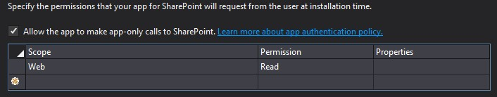

# <a name="create-a-cloud-business-add-in-that-uses-the-sap-gateway"></a><span data-ttu-id="a950c-101">Создание облачной бизнес-надстройки, использующей шлюз SAP</span><span class="sxs-lookup"><span data-stu-id="a950c-101">Create a cloud business add-in that uses the SAP Gateway</span></span>
 <span data-ttu-id="a950c-102">В этой статье рассказывается, как создать надстройку SharePoint, размещаемую у поставщика, с названием LightSwitch для доступа к данным SAP с помощью шлюза SAP для Майкрософт.</span><span class="sxs-lookup"><span data-stu-id="a950c-102">Learn how to build the LightSwitch SharePoint provider-hosted add-in to access SAP data by means of  SAP Gateway for Microsoft.</span></span>
 

 <span data-ttu-id="a950c-p101">**Примечание.** В настоящее время идет процесс замены названия "приложения для SharePoint" названием "надстройки SharePoint". Во время этого процесса в документации и пользовательском интерфейсе некоторых продуктов SharePoint и средств Visual Studio может по-прежнему использоваться термин "приложения для SharePoint". Дополнительные сведения см. в статье [Новое название приложений для Office и SharePoint](new-name-for-apps-for-sharepoint#bk_newname).</span><span class="sxs-lookup"><span data-stu-id="a950c-p101">The name "apps for SharePoint" is changing to "SharePoint Add-ins". During the transition, the documentation and the UI of some SharePoint products and Visual Studio tools might still use the term "apps for SharePoint". For details, see [New name for apps for Office and SharePoint](new-name-for-apps-for-sharepoint#bk_newname).</span></span>
 

<span data-ttu-id="a950c-p102">
В этой статье рассмотрены основные шаги, выполненные группой разработчиков Майкрософт при создании надстройки LightSwitch для SharePoint с размещением у поставщика, которая может получать доступ к данным SAP с помощью шлюза SAP для Майкрософт. Эта надстройка поддерживает операции CRUD с данными SAP, её можно использовать для просмотра библиотеки изображений SharePoint, а также отправки файлов в эту библиотеку.
</span><span class="sxs-lookup"><span data-stu-id="a950c-p102">This article highlights the key steps that the development team at Microsoft used to create a LightSwitch SharePoint provider-hosted add-in that can access SAP data by means of SAP Gateway for Microsoft. This add-in supports CRUD operations on SAP Data, and can be used to view pictures from and upload pictures to a SharePoint picture library.</span></span>
 

<span data-ttu-id="a950c-p103">Цель этой статьи — показать ключевые моменты надстройки, которые могут пригодиться вам при создании аналогичных надстроек. В статье приведен соответствующий пример кода, в котором наглядно продемонстрировано, как создать рабочее решение.</span><span class="sxs-lookup"><span data-stu-id="a950c-p103">The purpose of this article is  to show the key points of the add-in that might help you to build similar add-ins.    The code sample is provided and linked to the article so that you can see how the working solution was created, in order to reinforce your learning. 
</span></span>
 

 <span data-ttu-id="a950c-110">**Загрузка примеров.** [ Пример: разработка облачной бизнес-надстройки для доступа к шлюзу SAP для Майкрософт.](https://code.msdn.microsoft.com/Sample-Developing-a-Cloud-25d6d1ea)</span><span class="sxs-lookup"><span data-stu-id="a950c-110">Sample download:     Sample: Developing a Cloud Business Add-in to access SAP Gateway for Microsoft
 https://code.msdn.microsoft.com/Sample-Developing-a-Cloud-25d6d1ea </span></span>
 

## <a name="before-you-begin"></a><span data-ttu-id="a950c-111">Перед началом работы</span><span class="sxs-lookup"><span data-stu-id="a950c-111">Before you begin</span></span>

<span data-ttu-id="a950c-112">Ниже перечислены компоненты, необходимые для выполнения процедур, которые описаны в этой статье.</span><span class="sxs-lookup"><span data-stu-id="a950c-112">The following are prerequisites to the procedures in this article:</span></span>
 

 

-  <span data-ttu-id="a950c-p104">**Сайт разработчика Office 365**, размещенный в домене Office 365, который связан с областью клиентов Microsoft Azure Active Directory (Azure AD). См. статью [Получение подписки на Office 365 для разработчиков, настройка инструментов и среды, а также начало развертывания надстроек](http://msdn.microsoft.com/en-us/library/office/fp179924%28v=office.15%29.aspx) или [Создание сайта разработчика с помощью существующей подписки Office 365](http://msdn.microsoft.com/en-us/library/office/jj692554%28v=office.15%29.aspx)</span><span class="sxs-lookup"><span data-stu-id="a950c-p104">**An Office 365 Developer Site** in an Office 365 domain that is associated with a Microsoft Azure Active Directory (Azure AD) tenancy. See [Sign up for an Office 365 Developer Site, set up your tools and environment, and start deploying add-ins](http://msdn.microsoft.com/en-us/library/office/fp179924%28v=office.15%29.aspx) or [How to: Create a Developer Site within your existing Office 365 subscription.](http://msdn.microsoft.com/en-us/library/office/jj692554%28v=office.15%29.aspx)</span></span>
    
 
-  <span data-ttu-id="a950c-115">**Visual Studio 2013 c обновлением 4** или более поздней версии, который вы можете получить в статье [Вас приветствует Visual Studio 2013](http://msdn.microsoft.com/en-us/library/dd831853.aspx).</span><span class="sxs-lookup"><span data-stu-id="a950c-115">**Visual Studio 2013 Update 4** or later, which you can obtain from [Welcome to Visual Studio 2013](http://msdn.microsoft.com/en-us/library/dd831853.aspx).</span></span>
    
 
-  <span data-ttu-id="a950c-p105">**Инструменты разработчика Microsoft Office для Visual Studio. ** Версия, включенная в обновление 4 для Visual Studio 2013 или более поздней версии.</span><span class="sxs-lookup"><span data-stu-id="a950c-p105">**Microsoft Office Developer Tools for Visual Studio.** The version that is included in Update 4 of Visual Studio 2013 or later.</span></span>
    
 
-  <span data-ttu-id="a950c-p106">**Шлюз SAP для Майкрософт** должен быть развернут и настроен в Microsoft Azure. Дополнительные сведения см. в документации к [шлюзу SAP для Майкрософт](http://go.microsoft.com/fwlink/?LinkId=507635).</span><span class="sxs-lookup"><span data-stu-id="a950c-p106">**SAP Gateway for Microsoft** is deployed and configured in Microsoft Azure. For details, see the documentation for [SAP Gateway for Microsoft](http://go.microsoft.com/fwlink/?LinkId=507635).</span></span>
    
 
-  <span data-ttu-id="a950c-p107">**Учетная запись в организации в Microsoft Azure.** См. раздел о [создании учетной записи пользователя в организации в Azure AD](http://go.microsoft.com/fwlink/?LinkID=512580).</span><span class="sxs-lookup"><span data-stu-id="a950c-p107">**An organizational account in Microsoft Azure.** See [Create an organizational user account in Azure AD](http://go.microsoft.com/fwlink/?LinkID=512580).</span></span>
    
     <span data-ttu-id="a950c-122">**Примечание.** После создания учетной записи Office 365 (login.microsoftonline.com) войдите в нее и измените временный пароль.</span><span class="sxs-lookup"><span data-stu-id="a950c-122">**Note** Log in to your Office 365 account (login.microsoftonline.com) to change the temporary password after the account is created.</span></span>
-  <span data-ttu-id="a950c-p108">**Конечная точка OData для SAP** с данными, созданными для примера. См. документацию к [шлюзу SAP для Майкрософт](http://go.microsoft.com/fwlink/?LinkId=507635).</span><span class="sxs-lookup"><span data-stu-id="a950c-p108">**An SAP OData endpoint** with sample data in it. See the documentation for [SAP Gateway for Microsoft](http://go.microsoft.com/fwlink/?LinkId=507635).</span></span>
    
 
-  <span data-ttu-id="a950c-p109">**Общее представление об Azure AD.** См. статью [Начало работы с Azure AD](http://msdn.microsoft.com/en-us/library/azure/dn655157.aspx).</span><span class="sxs-lookup"><span data-stu-id="a950c-p109">**A basic familiarity with Azure AD.** See [Getting started with Azure AD](http://msdn.microsoft.com/en-us/library/azure/dn655157.aspx).</span></span>
    
 
-  <span data-ttu-id="a950c-p110">**Базовые знания о том, как создавать надстройки SharePoint.** См. [руководство по созданию базовых надстроек SharePoint, размещаемых у поставщика](http://msdn.microsoft.com/en-us/library/office/fp142381%28v=office.15%29.aspx).</span><span class="sxs-lookup"><span data-stu-id="a950c-p110">**A basic familiarity with creating SharePoint Add-ins.** See [How to: Create a basic provider-hosted SharePoint Add-in](http://msdn.microsoft.com/en-us/library/office/fp142381%28v=office.15%29.aspx).</span></span>
    
 
-  <span data-ttu-id="a950c-p111">**Базовые знания об OAuth 2.0 в Azure AD.** См. статью об [OAuth 2.0 в Azure AD](http://msdn.microsoft.com/en-us/library/azure/dn645545.aspx) и связанные с этой статьей темы.</span><span class="sxs-lookup"><span data-stu-id="a950c-p111">**A basic familiarity with OAuth 2.0 in Azure AD.** See [OAuth 2.0 and in Azure AD](http://msdn.microsoft.com/en-us/library/azure/dn645545.aspx) and its child topics.</span></span>
    
 

## <a name="solution-overview"></a><span data-ttu-id="a950c-131">Общие сведения о решении</span><span class="sxs-lookup"><span data-stu-id="a950c-131">Solution Overview</span></span>

<span data-ttu-id="a950c-p112">Contoso Motors это вымышленная компания по продаже автомобилей, которая служит примером реальных предприятий такого плана. Дилерский центр этой компании предоставляет информацию о складе торговым представителям и другим дилерским центрам. С помощью этого приложения продавцы могут проверять текущее состояние склада автомобилей, к которому у надстройки есть прямой доступ из SAP через шлюз SAP для Майкрософт. Все данные хранятся в SAP, а изображение каждой машины в библиотеке изображений SharePoint Online. Данные SAP и библиотеки изображений SharePoint объединяются и отображаются в надстройке. В ней менеджеры и администраторы могут выполнять стандартные операции CRUD с подробными данными о каждом автомобиле в SAP.</span><span class="sxs-lookup"><span data-stu-id="a950c-p112">Contoso Motors is a fictitious auto sales company that represents a real-life business in which an automobile dealership shares information about its inventory of automobiles with sales representatives and other dealerships that it's affiliated with. By using this add-in, sales people can check the current status of their automobile inventory, which the add-in accesses directly from SAP by means of SAP Gateway for Microsoft. All data is stored in SAP, and a picture of each car is stored in a picture library in SharePoint Online. Both the data from SAP and the SharePoint picture library are brought together and displayed by this add-in. Within the add-in, managers and administrators can do standard CRUD operations on the detailed data about each car in SAP.</span></span>
 

 
<span data-ttu-id="a950c-p113">В примере этой статьи надстройка SellerDashboard управляет данными инвентаризации автомобилей из SAP и соответствующими изображениями в библиотеке изображений SharePoint. В этой надстройке стандартные операции CRUD (создание, чтение, обновление и удаление) можно выполнять с подробными сведениями о каждом автомобиле в SAP.</span><span class="sxs-lookup"><span data-stu-id="a950c-p113">In the example in this article, the SellerDashboard add-in manipulates automobile inventory data from SAP and its picture in SharePoint picture library. Within this add-in, standard CRUD (create, read, update, and delete) operations are supported on the detailed information about each car in SAP.</span></span>
 

 

 <span data-ttu-id="a950c-p114">**Совет.** Демонстрацию этой надстройки см. в видео [Технический вебинар: шлюз SAP для Майкрософт и модели разработки Microsoft Azure](http://go.microsoft.com/fwlink/?LinkId=517378) на веб-сайте BrightTalk. Демонстрация функций надстройки начинается на 48-й минуте видео.</span><span class="sxs-lookup"><span data-stu-id="a950c-p114">For a video demonstration of this add-in, watch the  Technical Webinar - SAP Gateway for Microsoft & Microsoft Azure Development Model http://go.microsoft.com/fwlink/?LinkId=517378  video on BrightTalk. The demo of the app’s functionality starts at 48:00 minutes on the timeline.
</span></span>
 

 <span data-ttu-id="a950c-141">**Архитектура кода**</span><span class="sxs-lookup"><span data-stu-id="a950c-141">**Code Architecture**</span></span>
 

 
<span data-ttu-id="a950c-142">Решение SellerDashboard включает восемь проектов и, как показано на изображении ниже, разделено на две категории: BoxXDataStudio и SellerDashboardStudio.</span><span class="sxs-lookup"><span data-stu-id="a950c-142">The SellerDashboard solution includes eight projects, and as the following image shows, it is divided into two categories: BoxXDataStudio and SellerDashboardStudio.</span></span>
 

 

 

 

### <a name="boxxdatastudio"></a><span data-ttu-id="a950c-144">BoxXDataStudio</span><span class="sxs-lookup"><span data-stu-id="a950c-144">BoxXDataStudio</span></span>

<span data-ttu-id="a950c-145">Эта студия включает все компоненты, необходимые для взаимодействия со шлюзом SAP для Майкрософт.</span><span class="sxs-lookup"><span data-stu-id="a950c-145">This studio includes all of the components needed to interact with SAP Gateway for Microsoft.</span></span>
 

 

-  <span data-ttu-id="a950c-146">**AADAuthLib**</span><span class="sxs-lookup"><span data-stu-id="a950c-146">**AADAuthLib**</span></span>
    
    <span data-ttu-id="a950c-147">Этот компонент используется для выполнения [потока кода авторизации Azure AD](https://msdn.microsoft.com/en-us/library/azure/dn645542.aspx), в котором используется шаблон Singleton.</span><span class="sxs-lookup"><span data-stu-id="a950c-147">This component is used to carry out the  [Azure AD authorization code flow](https://msdn.microsoft.com/en-us/library/azure/dn645542.aspx), which uses a Singleton pattern.</span></span>
    
    <span data-ttu-id="a950c-p115">В фрагменте кода ниже показана главная функция, предоставленная компонентом AADAuthLib. Дополнительные сведения см. в классе поддержки в примере кода AADAuthLib/AuthUtil.cs.</span><span class="sxs-lookup"><span data-stu-id="a950c-p115">The following code snippet shows the main function, which the AADAuthLib component provides. For more detail, see the AADAuthLib/AuthUtil.cs sample code helper class.</span></span>
    


```C#
  // Use the auth code, acquire the refresh token and access token, and store them in the current session
        public bool AcquireTokenFromAuthCode(string authCode, string redirectUrl = "redirectUrl")
        {
            if (!IsAuthorized &amp;&amp; !string.IsNullOrEmpty(authCode))
            {
                AuthenticationResult authResult = _authContext.AcquireTokenByAuthorizationCode(authCode,
                    new Uri(ConfigurationManager.AppSettings["ida:" + redirectUrl]),
                    _clientCredential,
                    ConfigurationManager.AppSettings["ida:ResourceUrl"]);

                HttpContext.Current.Session["RefreshToken"] = authResult.RefreshToken;
                HttpContext.Current.Session["AccessToken-" + ConfigurationManager.AppSettings["ida:ResourceUrl"]] = new Tuple<string, DateTimeOffset>(authResult.AccessToken, authResult.ExpiresOn);

                return true;
            }

            return false;
  }

 // Provide the access token, which is stored in the current session, if the access token expired, use the refresh token get a new one.
 public string AccessToken
        {
            get
            {
                if (!IsAuthorized) throw new UnauthorizedAccessException();

                var accessToken = HttpContext.Current.Session["AccessToken-" + ConfigurationManager.AppSettings["ida:ResourceUrl"]] as Tuple<string, DateTimeOffset>;

                if (IsAccessTokenValid(accessToken))
                {
                    return accessToken.Item1;
                }

                accessToken = RenewAccessToken();
                HttpContext.Current.Session["AccessToken-" + ConfigurationManager.AppSettings["ida:ResourceUrl"]] = accessToken;

                return accessToken.Item1;
            }
  }
```

-  <span data-ttu-id="a950c-150">**BoxXDataService**</span><span class="sxs-lookup"><span data-stu-id="a950c-150">**BoxXDataService**</span></span>
    
    <span data-ttu-id="a950c-151">Это служба WCF RIA, представляющая собой интерфейс, который используется серверным компонентом SellerDashboard, размещенном в Azure, и использующая источник данных SAP через шлюз SAP для Майкрософт.</span><span class="sxs-lookup"><span data-stu-id="a950c-151">This is a WCF RIA service, which is the interface used by the SellerDashboard server-side component hosted in Azure, and which consumes the SAP data source from SAP Gateway for Microsoft..</span></span>
    
    <span data-ttu-id="a950c-p116">Указанный ниже фрагмент кода представляет собой веб-метод CRUD, поддерживаемый службой WCF RIA. Дополнительные сведения см. в файле BoxXDataService/BoxXDataService.cs.</span><span class="sxs-lookup"><span data-stu-id="a950c-p116">The following code snippet is the CRUD Web method, which the WCF RIA service supports. For more detail see BoxXDataService/BoxXDataService.cs.</span></span>
    


```C#
  [Query(IsDefault = true)]
        public IQueryable<InventoryItem> GetAllCarInventory()
        {
            BoxXDataReader dataReader = BoxXDataReader.Instance;
            IInventoryCollection dataCollection = ModelFactory.CreateInventoryCollection(dataReader.SchemaPropertyNames);
            IInventoryQuery query = QueryFactory.CreateQuery();
            dataReader.GetData(dataCollection, query);

            return dataCollection.Items.Cast<InventoryItem>().AsQueryable();
        }

        [Update]
        public void UpdateCarInventoryItem(InventoryItem carInventoryItem)
        {
            BoxXDataUpdater dataUpdater = BoxXDataUpdater.Instance;
            dataUpdater.UpdateInventoryItem(carInventoryItem);
        }

        [Insert]
        public void InsertCarInventoryItem(InventoryItem carInventoryItem)
        {
            BoxXDataCreater dataCreater = BoxXDataCreater.Instance;
            dataCreater.CreateInventoryItem(carInventoryItem);
        }

        [Delete]
        public void DeleteCarInventoryItem(InventoryItem carInventoryItem)
        {
            BoxXDataDeleter.DeleteInventoryItem(carInventoryItem.ID);
 }
```

-  <span data-ttu-id="a950c-154">**CarInventoryBoxXDataOperation**</span><span class="sxs-lookup"><span data-stu-id="a950c-154">**CarInventoryBoxXDataOperation**</span></span>
    
    <span data-ttu-id="a950c-p117">Это внедрение операций CRUD для BoxXDataService. На изображении ниже показана архитектура основного кода CarInventoryBoxXDataOperation. Пространство имен CRUD используется для реализации операций CRUD, а пространство имен Util это вспомогательный код для пространства имен CRUD.</span><span class="sxs-lookup"><span data-stu-id="a950c-p117">This is the real CRUD implementation for BoxXDataService. The following image shows the main code architecture of CarInventoryBoxXDataOperation. The CRUD namespace is used to implement the CRUD operations, and the Util namespace is the helper code for the CRUD namespace.</span></span>
    
  
 

 

 
-  <span data-ttu-id="a950c-159">**CarInventoryModel**</span><span class="sxs-lookup"><span data-stu-id="a950c-159">**CarInventoryModel**</span></span>
    
    <span data-ttu-id="a950c-p118">Это проект библиотеки, используемый для внедрения модели данных и служебных программ. Определение модели данных должно соответствовать метаданным конечной точки OData, которая используется шлюзом SAP для Майкрософт на базе схемы данных SAP. BoxXDataService и CarInventoryBoxXDataOperation используют ее для преобразования элемента базы данных SAP в экземпляр склада автомобилей.</span><span class="sxs-lookup"><span data-stu-id="a950c-p118">This is a library project that's used to implement the data model and utilities. The data model definition has to match the metadata of the OData endpoint that's used by SAP Gateway for Microsoft, which is based on the SAP data schema. BoxXDataService and CarInventoryBoxXDataOperation use it to convert the SAP database item into a car inventory instance.</span></span>
    
    <span data-ttu-id="a950c-163">На изображении ниже показаны основные компоненты.</span><span class="sxs-lookup"><span data-stu-id="a950c-163">The following image shows the main components.</span></span>
    
 

 

 

 

 

### <a name="sellerdashboardstudio"></a><span data-ttu-id="a950c-165">SellerDashboardStudio</span><span class="sxs-lookup"><span data-stu-id="a950c-165">SellerDashboardStudio</span></span>

<span data-ttu-id="a950c-166">SellerDashboardStudio включает стандартные компоненты надстройки SharePoint LightSwitch.</span><span class="sxs-lookup"><span data-stu-id="a950c-166">SellerDashboardStudio includes standard LightSwitch SharePoint add-in components.</span></span>
 

 

-  <span data-ttu-id="a950c-167">**SellerDashboard**</span><span class="sxs-lookup"><span data-stu-id="a950c-167">**SellerDashboard**</span></span>
    
    <span data-ttu-id="a950c-168">SellerDashboard это запускаемый проект, который используется для публикации надстройки SellerDashboard на веб-сайте Azure, а также надстройки SharePoint на сайте разработчика SharePoint.</span><span class="sxs-lookup"><span data-stu-id="a950c-168">SellerDashboard is the StartUp project, and it is used to publish the SellerDashboard add-in to the Azure website and its SharePoint add-in to the SharePoint developer site.</span></span>
    
 
-  <span data-ttu-id="a950c-169">**SellerDashboard.HTMLClient**</span><span class="sxs-lookup"><span data-stu-id="a950c-169">**SellerDashboard.HTMLClient**</span></span>
    
    <span data-ttu-id="a950c-p119">Этот компонент включает экраны, пользовательский элемент управления и элемент управления для отправки фотографий. На рисунке внизу показаны его основные компоненты.</span><span class="sxs-lookup"><span data-stu-id="a950c-p119">This component includes the screens, a custom control, and a photo upload control. The following image shows its main components.</span></span>
    
 
- 
  
 

    <span data-ttu-id="a950c-173">SellerDashboard.HTML.Client содержит четыре экрана.</span><span class="sxs-lookup"><span data-stu-id="a950c-173">SellerDashboard.HTML.Client includes these four screens:</span></span>
    
 

      - <span data-ttu-id="a950c-174">BrowseInventoryItems начальный экран, который используется для просмотра основных сведений обо всех складских позициях.</span><span class="sxs-lookup"><span data-stu-id="a950c-174">BrowseInventoryItems is the home screen, used to browse basic information for all inventory items.</span></span>
    
 
  - <span data-ttu-id="a950c-175">ViewInventoryItem подробный экран, который используется для отображения подробного представления по каждой складской позиции.</span><span class="sxs-lookup"><span data-stu-id="a950c-175">ViewInventoryItem is the detail screen, used to display a detailed view for each inventory item.</span></span>
    
 
  - <span data-ttu-id="a950c-176">EditInventoryItem всплывающий экран для редактирования, который используется для внесения изменений в данные о складской позиции.</span><span class="sxs-lookup"><span data-stu-id="a950c-176">EditInventoryItem is an edit popup screen, used to edit an inventory item.</span></span>
    
 
  - <span data-ttu-id="a950c-177">AddInventoryItem всплывающий экран для добавления, который используется для добавления новой складской позиции.</span><span class="sxs-lookup"><span data-stu-id="a950c-177">AddInventoryItem is an add popup screen, used to add a new inventory item.</span></span>
    
 

    <span data-ttu-id="a950c-178">Файл UserCode.js включает код пользовательского элемента управления для пользовательского интерфейса.</span><span class="sxs-lookup"><span data-stu-id="a950c-178">The UserCode.js file includes the UX custom control code.</span></span>
    
    <span data-ttu-id="a950c-179">Файлы photohelper.js и sharepointauthhelper.js, а также файлы папки сценариев созданы в соответствии с руководством, описанным в статье  [Пошаговое руководство. Создание надстройки для SharePoint с помощью LightSwitch](http://msdn.microsoft.com/en-us/library/jj969621.aspx).</span><span class="sxs-lookup"><span data-stu-id="a950c-179">The photohelper.js and sharepointauthhelper.js, files, included in the Scripts folder, are based on the guidance provided in the article  [Walkthrough: Creating an Add-in for SharePoint by Using LightSwitch](http://msdn.microsoft.com/en-us/library/jj969621.aspx).</span></span>
    
 
-  <span data-ttu-id="a950c-180">**SellerDashboard.Server**</span><span class="sxs-lookup"><span data-stu-id="a950c-180">**SellerDashboard.Server**</span></span>
    
    <span data-ttu-id="a950c-p120">Этот компонент содержит источники данных WCF RIA и SharePoint, а также веб-API для отправки фотографий. На изображении ниже показаны его основные компоненты.</span><span class="sxs-lookup"><span data-stu-id="a950c-p120">This component includes the WCF RIA data source, the SharePoint data source, and the photo-upload Web API. The following image shows its main components.</span></span>
    
  
 

    <span data-ttu-id="a950c-p121">SharePointContext.cs и TokenHelper.cs вспомогательные классы, которые предоставляют контекст клиента для проверки подлинности в SharePoint. Это позволяет использовать веб-API для отправки фотографий, чтобы добавлять фотографии автомобилей в библиотеку изображений. Файлы PhotoListHelper.cs и PhotosController.cs внедряют веб-API для отправки фотографий. Дополнительные сведения о том, как надстройка LightSwitch использует веб-API для отправки фотографий, см. в статье  [Пошаговое руководство. Создание надстройки для SharePoint с помощью LightSwitch](http://msdn.microsoft.com/en-us/library/jj969621.aspx).</span><span class="sxs-lookup"><span data-stu-id="a950c-p121">The SharePointContext.cs and TokenHelper.cs are the helper classes that provide the client context to authenticate to SharePoint. This enables the photo upload Web API to be used to upload photos of cars to the picture library. The PhotoListHelper.cs and PhotosController.cs files implement the photo-upload Web API. For more information about how the photo-upload Web API is used by LightSwitch, see the article  [Walkthrough: Creating an Add-in for SharePoint by Using LightSwitch](http://msdn.microsoft.com/en-us/library/jj969621.aspx).</span></span>
    
 
-  <span data-ttu-id="a950c-188">**SellerDashboard.SharePoint**</span><span class="sxs-lookup"><span data-stu-id="a950c-188">**SellerDashboard.SharePoint**</span></span>
    
    <span data-ttu-id="a950c-p122">Этот компонент добавляется после решения LightSwitch, чтобы включить проект SharePoint. Его можно использовать, чтобы настроить сайт SharePoint, используемый для библиотеки изображений, и задать необходимое разрешение для надстройки. Для SellerDashboard необходимо предоставить уровень разрешений "Полный доступ" на сайте SharePoint, на котором размещена библиотека изображений.</span><span class="sxs-lookup"><span data-stu-id="a950c-p122">This component is included after the LightSwitch solution to enable the SharePoint project. You can use this component to configure the SharePoint site used for the picture library and to set the required permission for the add-in. SellerDashboard needs to be granted the Full Control permission level on the SharePoint site that hosts the picture library.</span></span>
    
 

## <a name="implementation"></a><span data-ttu-id="a950c-192">Реализация</span><span class="sxs-lookup"><span data-stu-id="a950c-192">Implementation</span></span>


 

 

### <a name="overview"></a><span data-ttu-id="a950c-193">Обзор</span><span class="sxs-lookup"><span data-stu-id="a950c-193">Overview</span></span>

<span data-ttu-id="a950c-p123">На изображении ниже представлены компоненты, в состав которых входит SellerDashboard. Сплошная линия показывает поток данных, пунктирная поток OAuth. Компоненты зеленого цвета относятся к операциям с данными SAP, синего к операциям с библиотекой изображений SharePoint, а компоненты оранжевого цвета показывают операции с самим приложением SellerDashboard.</span><span class="sxs-lookup"><span data-stu-id="a950c-p123">The following image show the components that comprise the SellerDashboard. The solid line shows the data flow and the dotted line shows the OAuth flow. The green components are related to the SAP data operations, the blue components are related to the SharePoint picture library operation, and the orange components depict the operations of the whole SellerDashboard app.</span></span>  
 

 
 <span data-ttu-id="a950c-197">**SellerDashboard Solution**</span><span class="sxs-lookup"><span data-stu-id="a950c-197">**SellerDashboard Solution**</span></span>
 

 

 

 

 

 

### <a name="data-mashup"></a><span data-ttu-id="a950c-199">Разнородные данные</span><span class="sxs-lookup"><span data-stu-id="a950c-199">Data mashup</span></span>

<span data-ttu-id="a950c-200">LightSwitch поддерживает комбинирование данных путем добавления связи между двумя источниками данных в конструкторе.</span><span class="sxs-lookup"><span data-stu-id="a950c-200">LightSwitch supports the data mashup by adding a relationship between the two data sources in the designer.</span></span>
 

 
 <span data-ttu-id="a950c-201">**Источник данных SAP**</span><span class="sxs-lookup"><span data-stu-id="a950c-201">**SAP data source**</span></span>
 

 

-  <span data-ttu-id="a950c-202">*Схема данных в базе данных SAP*</span><span class="sxs-lookup"><span data-stu-id="a950c-202">*Data schema in SAP database*</span></span> 
    
    <span data-ttu-id="a950c-203">В примере кода ниже показана возможный вариант схемы получения данных из шлюза SAP для Майкрософт Microsoft.</span><span class="sxs-lookup"><span data-stu-id="a950c-203">The following snippet shows an example of a data schema from SAP Gateway for Microsoft.</span></span>
    


```XML
  
<?xml version="1.0" encoding="UTF-8"?> 
- <edmx:Edmx xmlns:sap="http://www.sap.com/Protocols/SAPData" xmlns:m="http://schemas.microsoft.com/ado/2007/08/dataservices/metadata" 
xmlns:edmx:"http://schemas.microsoft.com/ado/2007/06/edmx" Version="1.0">
   - <edmx:DataServices m:DataServiceVersion="2.0">
      - <Schema xml:lang="en" xmlns="http://schemas.microsoft.com/ado/2008/09/edm" Namespace="ZCAR_POC_SRV">
         - <EntityType sap:content-version="1" Name="ContosoMotors">
              - <Key>
                     <PropertyRef Name="ID"/>
               </Key>
               <Property Name="ContactPhone" Type="Edm.String"/>
               <Property Name="ContactEmail" Type="Edm.String"/>
               <Property Name="ID" Type="Edm.Int32" Nullable="false"/>
               <Property Name="BuyerEmail" Type="Edm.String" MaxLength="255"/>
               <Property Name="MaxPower" Type="Edm.Int32" Nullable="false"/>
               <Property Name="Engine" Type="Edm.String" Nullable="false" MaxLength="255"/>
               <Property Name="BodyStyle" Type="Edm.String" Nullable="false" MaxLength="255"/>
               <Property Name="Transmission" Type="Edm.String" Nullable="false" MaxLength="255"/>
               <Property Name="Year" Type="Edm.Int32" Nullable="false"/>
               <Property Name="Model" Type="Edm.String" Nullable="false" MaxLength="255"/>
               <Property Name="Brand" Type="Edm.String" Nullable="false" MaxLength="255"/>
               <Property Name="ExtColor" Type="Edm.String" Nullable="false" MaxLength="255"/>
              <Property Name="IntColor" Type="Edm.String" Nullable="false" MaxLength="255"/>
              <Property Name="ContactName" Type="Edm.String" Nullable="false" MaxLength="255"/>
              <Property Name="Price" Type="Edm.String" Nullable="false"/>
              <Property Name="StockNo" Type="Edm.String" Nullable="false"/>
              <Property Name="Arrived_Date" Type="Edm.DateTime" Nullable="false" Precision="0"/>
              <Property Name="Status" Type="Edm.String" Nullable="false" MaxLength="255"/>
      </EntityType>
   - <EntityContainer Name="ZCAR_POC_SRV_Entities" m:IsDefaultEntityContainer="true">
          <EntitySet sap:content-version="1" Name="ContosoMotorsCollection" sap:searchable="true" EntityType="ZCAR_POC_SRV.ContosoMotors"/>
     </EntityContainer>
     <atom:link xmlns:atom="http://www.w3.org/2005/Atom" href="http://contoso.cloudapp.net:8080/perf/sap/opu/odata/sap/ZCAR_POC_SRV/$metadata" rel="self"/>
     <atom:link xmlns:atom="http://www.w3.org/2005/Atom" href="http://contoso.cloudapp.net:8080/perf/sap/opu/odata/sap/ZCAR_POC_SRV/$metadata" rel="latest-version"/>
</Schema>
</edmx:DataServices>
</edms:Edmx>               

```


    This is our test data base, and the Property Type and Nullable value is based on the scenario. The ID is the PropertyRef and the OData CRUD operation is based on ID. The StockNo property is used to mash data with the car picture that is stored in SharePoint picture library.
    
 
-  <span data-ttu-id="a950c-204">*Модель данных, определенная для службы RIA*</span><span class="sxs-lookup"><span data-stu-id="a950c-204">*Data model defined for RIA service*</span></span> 
    
```C#
  public interface IInventoryItem
        {
        IEnumerable<InventoryPropertyName> ValidPropertyNames { get; }
        bool IsValid { get; }

        int ID { get; set; }
        DateTime ArrivedDate { get; set; }
        string BodyStyle { get; set; }
        string Brand { get; set; }
        string BuyerEmail { get; set; }
        string ContactEmail { get; set; }
        string ContactName { get; set; }
        string ContactPhone { get; set; }
        string Engine { get; set; }
        string ExtColor { get; set; }
        IEnumerable<Uri> Images { get; }
        string IntColor { get; set; }
        int MaxPower { get; set; }
        string Model { get; set; }
        decimal Price { get; set; }
        bool Removed { get; }
        string Status { get; set; }
        string StockNo { get; set; }
        string Transmission { get; set; }
        int Year { get; set; }

        void AddImageUrl(Uri url);
        bool CopyFrom(IInventoryItem other);
        object GetPropertyValue(InventoryPropertyName property);
        void MarkAsRemoved();
        void SetPropertyValue(InventoryPropertyName property, object value);
       }

        public interface IInventoryCollection
       {
        IEnumerable<InventoryPropertyName> QueriedPropertyNames { get; }
        IEnumerable<IInventoryItem> Items { get; }
        bool Valid { get; }

        IInventoryItem this[int id] { get; }
        bool Contains(int id);
        void AddItem(IInventoryItem inventoryItem);
        IInventoryCollection Filter(Predicate<IInventoryItem> match);
        bool CopyFrom(IInventoryCollection other);
}

```


    Any property that isn't included in the SAP database schema can be ignored. For example, the  **Images** property was added here for scalability considerations. This data model is a middle layer between the real SAP database and the SellerDashboard.Server data source. The LightSwitch project has two components: View and Server. When you add an external data source on the Server side, LightSwitch helps you build an abstract data layer that is added to the data source on the Server side.
    
    Most of the properties have the same type as the properties in the SAP database schema, except for StockNo, whose type has been changed from  **int** to **string**. This is because StockNo is used as a way to define the relationship between the SAP data and SharePoint picture library.
    
     **Tip**  StockNo must have the type  **string** because the value stored in the SharePoint picture library is **Text**. These two types must match in order to accomplish the data mashup.

    The implementation of the two interfaces is in CarInventoryModel/InventoryItem.cs and CarInventoryModel/InventoryCollection.cs.
    
 
-  <span data-ttu-id="a950c-205">*Источник данных, используемый на стороне сервера LightSwitch*</span><span class="sxs-lookup"><span data-stu-id="a950c-205">*Data source consumed by the LightSwitch server side*</span></span> 
    
  
 

    <span data-ttu-id="a950c-p124">Когда вы добавляете службу WCF RIA (BoxXDataService) на сервере SellerDashboard, включается модель данных, определенная в CarInventoryModel, и вы получаете релевантную таблицу данных. Вы можете изменить типы некоторых свойств. Например, вы можете изменить тип свойства **BuyerEmail** с **String** на **Email Address**, и LightSwitch будет поддерживать функцию проверки формата электронного письма на стороне клиента.</span><span class="sxs-lookup"><span data-stu-id="a950c-p124">In the SellerDashboard server, when you add the WCF RIA Service (BoxXDataService), the data model that's defined in CarInventoryModel is included, and you get the relevant data table. You can change the type of some of the properties. For example, you can change the **BuyerEmail** type from **String** to **Email Address**, and LightSwitch will support the email format check on the client side.</span></span>
    
 
 <span data-ttu-id="a950c-210">**Библиотека изображений SharePoint**</span><span class="sxs-lookup"><span data-stu-id="a950c-210">**SharePoint picture library**</span></span>
 

 
<span data-ttu-id="a950c-p125">Библиотека изображений, размещенная на хост-сайте SharePoint, называется ContosoMotorsPictureLibrary и содержит три новых столбца с именами StockNo, ThumbnailUrl и FullImageUrl. Все они настроены в качестве полей с типом **Text**.</span><span class="sxs-lookup"><span data-stu-id="a950c-p125">The picture library in the SharePoint host site is named ContosoMotorsPictureLibrary, and contains three new columns named StockNo, ThumbnailUrl, and FullImageUrl. All of them are configured as **Text** fields.</span></span>
 

 

 <span data-ttu-id="a950c-213">**Совет.** В именах столбцов учитывается регистр символов.</span><span class="sxs-lookup"><span data-stu-id="a950c-213">**TIP** The column names are case sensitive.</span></span>
 

 <span data-ttu-id="a950c-p126">Столбец StockNo используется для создания связи с данными SAP. Столбцы ThumbnailUrl и FullImageUrl для получения URL-адреса соответствующего изображения удобным способом.</span><span class="sxs-lookup"><span data-stu-id="a950c-p126">The StockNo column is used to create a relationship with the SAP data. The ThumbnailUrl and FullImageUrl columns are used to get the URL to the relevant picture in a convenient way.</span></span>
 

 
 <span data-ttu-id="a950c-216">*Источник данных, используемый на стороне сервера LightSwitch*</span><span class="sxs-lookup"><span data-stu-id="a950c-216">*Data source consumed by the LightSwitch server side*</span></span> 
 

 
<span data-ttu-id="a950c-217">ContosoMotorsPicture — это модель источника данных LightSwitch, которая сопоставляется с библиотекой изображений хост-сайта SharePoint на стороне сервера LightSwitch.</span><span class="sxs-lookup"><span data-stu-id="a950c-217">ContosoMotorsPicture is a LightSwitch data source model, which maps to the SharePoint host site picture library on the LightSwitch server side.</span></span>
 

 

 

 
 <span data-ttu-id="a950c-219">**Взаимоотношение данных**</span><span class="sxs-lookup"><span data-stu-id="a950c-219">**Data relationship**</span></span>
 

 
<span data-ttu-id="a950c-p127">Добавьте связь "один к нулю" или "один к одному" между InventoryItem и ContosoMotorsPicture. На изображении ниже показано, как это будет выглядеть при использовании LightSwitch в Visual Studio.</span><span class="sxs-lookup"><span data-stu-id="a950c-p127">Add a one-to-zero relationship or a one-to-one relationship between the InventoryItem and ContosoMotorsPicture. The following image shows what this looks like, using LightSwitch in Visual Studio</span></span>
 

 

 

 

 

 

### <a name="oauth-with-azure-ad-amp-acs"></a><span data-ttu-id="a950c-223">OAuth, Azure AD и ACS</span><span class="sxs-lookup"><span data-stu-id="a950c-223">OAuth with Azure AD &amp; ACS</span></span>

<span data-ttu-id="a950c-224">В этом разделе кратко рассказывается о том, как надстройка реализует OAuth в Azure AD и службах контроля доступа (ACS).</span><span class="sxs-lookup"><span data-stu-id="a950c-224">This section provides an overview of how the add-in implements OAuth in Azure AD and access control services (ACS).</span></span>
 

 
 <span data-ttu-id="a950c-225">**Общие сведения**</span><span class="sxs-lookup"><span data-stu-id="a950c-225">**Overview**</span></span>
 

 
<span data-ttu-id="a950c-226">SellerDashboard это размещенная у поставщика надстройка для SharePoint, которая должна работать с двумя источниками данных: библиотекой изображений SharePoint и данными SAP с помощью шлюза SAP для Майкрософт.</span><span class="sxs-lookup"><span data-stu-id="a950c-226">SellerDashboard is a SharePoint provider host add-in that has to operate on both data sources: SharePoint picture library and the SAP data by means of SAP Gateway for Microsoft.</span></span>
 

 
<span data-ttu-id="a950c-p128">Чтобы иметь доступ к библиотеке изображений SharePoint, приложение SellerDashboard должно пройти проверку подлинности в службе контроля доступа и получить от нее маркер доступа. Но чтобы получить доступ к данным SAP, приложение SellerDashboard должно получить другой маркер доступа от Azure AD, так как шлюз SAP для Майкрософт использует Azure AD для проверки подлинности и авторизации.</span><span class="sxs-lookup"><span data-stu-id="a950c-p128">To access the SharePoint picture library, SellerDashboard needs to authenticate to ACS, and get an access token from it. To access the SAP data, however, the SellerDashboard needs to get a different access token from Azure AD, because SAP Gateway for Microsoft uses Azure AD for Authentication and Authorization.</span></span>
 

 

 

 
 <span data-ttu-id="a950c-230">**Реализация**</span><span class="sxs-lookup"><span data-stu-id="a950c-230">**Implementation**</span></span>
 

 
<span data-ttu-id="a950c-p129">SellerDashboard это размещенная у поставщика надстройка для SharePoint, которая поддерживает отправку изображений с помощью клиентской объектной модели SharePoint. Контекст SharePoint, который используется для создания контекста клиента для узла SharePoint, кэшируется, а контекст клиента затем используется при передаче данных через веб-API.</span><span class="sxs-lookup"><span data-stu-id="a950c-p129">SellerDashboard is a SharePoint provider-hosted add-in that supports the picture-upload operation by using the SharePoint client-side object model. The SharePoint context, which is used to create the client context for the SharePoint host, is cached, and the client context is then used by the upload Web API.</span></span>
 

 
<span data-ttu-id="a950c-p130">Когда завершена авторизация с использованием OAuth и службы контроля доступа, запрос на проверку подлинности отправляется в Azure AD. Для этого надстройка использует файл cookie для входа на сайт Login.MicrosoftOnline.com и завершения потока кода авторизации Azure AD, который возвращает маркер обновления. Надстройка кэширует этот маркер на случай будущих запросов на проверку подлинности во время сеанса. Ниже представлен код, который при этом используется.</span><span class="sxs-lookup"><span data-stu-id="a950c-p130">After the OAuth with ACS process is complete, the request for authentication is sent to Azure AD. To accomplish this, the add-in uses a cookie to sign into Login.MicrosoftOnline.com and then complete the Azure AD authorization code flow , which returns a refresh token that the add-in caches for future authentication requests during the session. Here's the code that is used for this process.</span></span>
 

 


```C#
protected override void Page_Load(object sender, EventArgs e)
{
    if (!IsPostBack)
    {
 SharePointContext spContext = SharePointContextProvider.Current.GetSharePointContext(Context);
        if (spContext != null)
        {
     // Cache the SharePoint Context, which will be used to create Client Context for SharePoint host
            _spContext = spContext;
        }

        
        // Acquire refresh token and access token, and store them in the current session, which will be used do the OAuth with AAD for operating the SAP data
        AuthUtil.Instance.AcquireTokenFromAuthCode(Request.QueryString["code"]);

        if (!AuthUtil.Instance.IsAuthorized)
        {
             Response.Redirect(AuthUtil.Instance.AuthCodeUrl);
        }
     }

     base.Page_Load(sender, e);
 }
```

<span data-ttu-id="a950c-236">Дополнительные сведения см. в файлах SellerDashBoard.Server/SharePointLaunch.aspx.cs и AADAuthLib/AuthUtil.cs в примере кода.</span><span class="sxs-lookup"><span data-stu-id="a950c-236">For more detail, see SellerDashBoard.Server/SharePointLaunch.aspx.cs, and AADAuthLib/AuthUtil.cs in the code sample.</span></span>
 

 
<span data-ttu-id="a950c-p131">SellerDashboard.Server содержит файлы SharePointContext.cs и TokenHelper.cs, которые используются для получения контекста клиента только для надстройки для узла SharePoint. Visual Studio автоматически добавляет эти два файла в проект SharePoint и присваивает ему имя <*имя_вашего_проекта*>Web (например, SharePointAppWeb). Затем вы можете скопировать эти файлы в исходный код надстройки SellerDashboard и включить их в свой проект.</span><span class="sxs-lookup"><span data-stu-id="a950c-p131">SellerDashboard.Server  includes the SharePointContext.cs and TokenHelper.cs files, which are used to get the app-only client context for the SharePoint host. .These two files are added to your SharePoint project automatically  by Visual Studio. (Visual Studio names the project <*yourprojectname*>Web; for example, SharePointAppWeb.) You can then copy these two files to your SellerDashboard add-in source code and include them in your project.</span></span>
 

 

### <a name="crud-operations-on-sap-data-from-sap-gateway-for-microsoft"></a><span data-ttu-id="a950c-240">Операции CRUD над данными SAP, полученными из шлюза SAP для Майкрософт</span><span class="sxs-lookup"><span data-stu-id="a950c-240">CRUD operations on SAP Data from SAP Gateway for Microsoft</span></span>

<span data-ttu-id="a950c-p132">Фрагменты кода ниже показывают основную логику кода для операций CRUD. Дополнительные сведения см. в варианте реализации CarInventoryBoxXDataOperation в примере кода.</span><span class="sxs-lookup"><span data-stu-id="a950c-p132">The following code snippets show the main code logic of the CRUD operations. For more details, see the implementation of CarInventoryBoxXDataOperation in the code sample.</span></span>
 

 
 <span data-ttu-id="a950c-243">**BoxXDataCreater**</span><span class="sxs-lookup"><span data-stu-id="a950c-243">**BoxXDataCreater**</span></span>
 

 


```C#

        public void CreateInventoryItem(IInventoryItem inventoryItem)
        {
            if (_model == null)
            {
                _model = BoxXDataCRUDHelpers.GetMetadata(BoxXDataCRUDHelpers.MetadataUrl);
            }

            // Create new entry request generate
            var requestMessage = new ODataClientRequestMessage(new Uri(BoxXDataCRUDHelpers.DataCollectionUrl),
                                                                ODataConstants.MethodPost);
            BoxXDataCRUDHelpers.CreateEntryRequestHeaderSetter(requestMessage, AuthUtil.Instance.AccessToken);
            BoxXDataCRUDHelpers.SetODataRequestContent(requestMessage, _model, inventoryItem);

            // Create new entry request execute
            IODataResponseMessage responseMessage = requestMessage.GetResponse();

        }
BoxXDataReader
 public void GetData(IInventoryCollection dataCollection, IInventoryQuery query)
        {
            GetValueWithoutLocallyFiltering(dataCollection, query);

            if (query.Filters.Any())
            {
                var filteredCollection = dataCollection.Filter(inventoryItem =>
                    query.Filters.Any(filter => filter.Match(inventoryItem)));

                dataCollection.CopyFrom(filteredCollection);
            }
        }
```

 <span data-ttu-id="a950c-244">**BoxXDataUpdater**</span><span class="sxs-lookup"><span data-stu-id="a950c-244">**BoxXDataUpdater**</span></span>
 

 


```C#
public void UpdateInventoryItem(IInventoryItem inventoryItem)
        {
            if (_model == null)
            {
                _model = BoxXDataCRUDHelpers.GetMetadata(BoxXDataCRUDHelpers.MetadataUrl);
            }

            // Update existing entry request generate
            var requestMessage = new ODataClientRequestMessage(new Uri(BoxXDataCRUDHelpers.DataCollectionUrl + '(' + inventoryItem.ID + ')'),
                                                                ODataConstants.MethodPut);
            BoxXDataCRUDHelpers.UpdateEntryRequestHeaderSetter(requestMessage, AuthUtil.Instance.AccessToken);
            BoxXDataCRUDHelpers.SetODataRequestContent(requestMessage, _model, inventoryItem);

            // Update existing entry request execute
            IODataResponseMessage responseMessage = requestMessage.GetResponse();
        }
BoxXDataDeleter
 public static void DeleteInventoryItem(int ID)
        {
            // Delete existing entry request generate
            var requestMessage = new ODataClientRequestMessage(new Uri(BoxXDataCRUDHelpers.DataCollectionUrl + '(' + ID + ')'),
                                                                ODataConstants.MethodDelete);
            BoxXDataCRUDHelpers.DeleteEntryRequestHeaderSetter(requestMessage, AuthUtil.Instance.AccessToken);

            // Delete existing entry request execute
            IODataResponseMessage responseMessage = requestMessage.GetResponse();
        }
```


### <a name="uploading-photos-to-the-sharepoint-picture-library"></a><span data-ttu-id="a950c-245">Отправка фотографий в библиотеку изображений SharePoint</span><span class="sxs-lookup"><span data-stu-id="a950c-245">Uploading photos to the SharePoint picture library</span></span>

<span data-ttu-id="a950c-246">Для отправки фотографий в библиотеку изображений SharePoint нужны соответствующие элемент управления и реализованный веб-интерфейс API. При этом используется код, представленный ниже, который создан в соответствии с инструкциями, описанными в статье  [Пошаговое руководство. Создание надстройки для SharePoint с помощью LightSwitch](http://msdn.microsoft.com/en-us/library/jj969621.aspx).</span><span class="sxs-lookup"><span data-stu-id="a950c-246">The photo-upload control and photo-upload Web API implementation are used to upload photos to the SharePoint picture library, using the following code, which is based on the guidance in the article  [Walkthrough: Creating an Add-in for SharePoint by Using LightSwitch](http://msdn.microsoft.com/en-us/library/jj969621.aspx).</span></span>
 

 
 <span data-ttu-id="a950c-247">**Внесение изменений в файл photohelper.js**</span><span class="sxs-lookup"><span data-stu-id="a950c-247">**For the photohelper.js changes:**</span></span>
 

 
<span data-ttu-id="a950c-248">В форму uploadForm будет добавлено новое поле, которое используется для передачи параметра StockNo в веб-API отправки фотографий.</span><span class="sxs-lookup"><span data-stu-id="a950c-248">A new field is added for the uploadForm, which is used to pass the StockNo to the photo-upload Web API.</span></span>
 

 


```

uploadForm = $(
             '<form id="uploadForm" method="POST" enctype="multipart/form-data" action="' + API_URL + '"  data-ajax="false" target="uploadTargetIFrame">' +
             '   <input name="fileInput" id="fileInput" type="file" size="30" data-theme="c" accept="image/*" multiple="true"/>' +
             '   <input type="hidden" name=' + screen.InventoryItem.StockNo + '>' +
             '</form>');

```

<span data-ttu-id="a950c-249">Добавьте логику для кэширования URL-адреса изображения и логику откладывания изображений.</span><span class="sxs-lookup"><span data-stu-id="a950c-249">Add the logic for caching the picture URL, and picture set back logic.</span></span>
 

 


```
function completeUpload(uploadedFiles) {
            var fullImageUrl = uploadedFiles[0];
            var photoNameWithExt = fullImageUrl.substr(fullImageUrl.lastIndexOf('/') + 1);
            var photoNameWithoutExt = photoNameWithExt.substr(0, photoNameWithExt.lastIndexOf("."));
            var photoPathUri = fullImageUrl.substr(0, fullImageUrl.lastIndexOf('/'));
            var photoExt = photoNameWithExt.substr(photoNameWithExt.lastIndexOf(".") + 1, photoNameWithExt.length);
            var thumbnailUrl = photoPathUri + "/_t/" + photoNameWithoutExt + "_" + photoExt + ".jpg";
            setCacheUrl(screen.InventoryItem.StockNo, fullImageUrl + "*#00#" + thumbnailUrl);
            setDetailsCarPicture(fullImageUrl);
            screen.closePopup();
        }
```

 <span data-ttu-id="a950c-250">**Внесение изменений в файл PhotosController.cs**</span><span class="sxs-lookup"><span data-stu-id="a950c-250">**For the PhotosController.cs changes:**</span></span>
 

 
<span data-ttu-id="a950c-251">Используйте только контекст клиента для надстройки для узла SharePoint, созданный кэшированным контекстом SharePoint.</span><span class="sxs-lookup"><span data-stu-id="a950c-251">Use the app-only client context for the SharePoint host, which is created by the cached SharePoint Context.</span></span>
 

 
<span data-ttu-id="a950c-p133">Это необходимо, так как ContosoMotorsPictureLibrary относится не к надстройке SellerDashboard, а к хост-сайту SharePoint. Кроме того, при удалении фотографий удаляется соответствующий код.</span><span class="sxs-lookup"><span data-stu-id="a950c-p133">Do this because the ContosoMotorsPictureLibrary doesn't belong to the SellerDashboard add-in; rather, it belongs to the SharePoint host site. Also, remove the photo delete relevant code.</span></span>
 

 


```C#

private ClientContext AppWebContext
    {
        get
        {
            if (appWebContext == null)
            {
                appWebContext = SharePointLaunch.getAppWebContext();
            }
            return appWebContext;
        }
    }

```

 <span data-ttu-id="a950c-254">**Внесение изменений в файл PhotoListHelper.cs**</span><span class="sxs-lookup"><span data-stu-id="a950c-254">**For the PhotoListHelper.cs changes:**</span></span>
 

 
<span data-ttu-id="a950c-p134">Добавьте логику обновления изображения, которая удалит старый элемент изображения (если он существует) и добавит новый. Назначьте StockNo для нового элемента изображения, одновременно задав ему значения FullImageUrl и ThumbnailUrl.</span><span class="sxs-lookup"><span data-stu-id="a950c-p134">Add the picture update logic, which will delete the old picture item if one exists and then add a new picture item. Assign the StockNo of the new picture item, and at the same time set the FullImageUrl and ThumbnailUrl values to the new picture item.</span></span>
 

 


```C#

            // Delete the old picture item
            foreach (ListItem item in items)
            {
                if (!string.IsNullOrEmpty((string)(item["StockNo"])))
                {
                    string tempStockNo = item["StockNo"].ToString();
                    if (tempStockNo.Equals(stockNo))
                    {
                        item.DeleteObject();
                        siteContext.ExecuteQuery();
                        break;
                    }
                }
            }

            // Update the new picture item
            foreach (ListItem item in items)
            {
                string fullImageName = item["FileLeafRef"].ToString();
                string thumbnailName = fullImageName.Replace('.', '_') + ".jpg";

                if (photoUri.Contains(fullImageName))
                {
                    item["StockNo"] = stockNo;
                    item["FullImageUrl"] = photoUri;
                    item["ThumbnailUrl"] = photoUri.Replace(fullImageName, "_t/" + thumbnailName);
                    item.Update();
                    siteContext.ExecuteQuery();
                    break;
                }
            }


```


### <a name="user-experience"></a><span data-ttu-id="a950c-257">Взаимодействие с пользователем</span><span class="sxs-lookup"><span data-stu-id="a950c-257">User Experience</span></span>

<span data-ttu-id="a950c-p135">По специальному запросу сценария многие пользовательские элементы управления реализуются для поддержки этого запроса. Соответствующий код можно найти в файле UserCode.js. Простой пользовательский интерфейс можно быстро создать с помощью конструктора LightSwitch. Шаблон "Набор общих экранов" может соответствовать пробному запросу. Вопрос взаимодействия с пользователем не рассматривается подробно в этом документе, так как это не его основная тема.</span><span class="sxs-lookup"><span data-stu-id="a950c-p135">For the special scenario request, many custom controls are implemented to support the request. You can find the relevant code in the UserCode.js file. You can build a simple user interface quickly by using the LightSwitch designer. The Common Screen Set can meet your test request. Because the user experience isn't the main focus of this document, details are not provided here.</span></span>
 

 

## <a name="deploying-the-app"></a><span data-ttu-id="a950c-263">Развертывание приложения</span><span class="sxs-lookup"><span data-stu-id="a950c-263">Deploying the app</span></span>

<span data-ttu-id="a950c-p136">Выполните действия, описанные в этом разделе, чтобы развернуть надстройку. Перед её развертыванием убедитесь, что шлюз SAP для Майкрософт был развернут и настроен для клиента Azure.</span><span class="sxs-lookup"><span data-stu-id="a950c-p136">Complete the steps in this section to deploy the add-in. Before you deploy this add-in, ensure that SAP Gateway for Microsoft has been deployed and configured on your Azure tenant.</span></span>
 

 

### <a name="create-your-azure-web-site"></a><span data-ttu-id="a950c-266">Создание веб-сайта Azure</span><span class="sxs-lookup"><span data-stu-id="a950c-266">Create your Azure web site</span></span>


1. <span data-ttu-id="a950c-267">Войдите в систему на [портале Microsoft Azure](http://go.microsoft.com/fwlink/?LinkID=512959) в качестве глобального администратора.</span><span class="sxs-lookup"><span data-stu-id="a950c-267">Log in to the  [Microsoft Azure Portal](http://go.microsoft.com/fwlink/?LinkID=512959) as a global administrator.</span></span>
    
 
2. <span data-ttu-id="a950c-268">В меню слева щелкните **Веб-сайты**.</span><span class="sxs-lookup"><span data-stu-id="a950c-268">In the left menu, click **Websites**.</span></span>
    
     <span data-ttu-id="a950c-269">**Примечание.** Вы будете использовать этот веб-сайт для размещения надстройки SharePoint, размещаемой у поставщика (SellerDashboard).</span><span class="sxs-lookup"><span data-stu-id="a950c-269">**Note** You'll use this web site to host the SharePoint provider-hosted add-in for the SellerDashboard.</span></span>
3. <span data-ttu-id="a950c-270">На панели команд в нижней части страницы щелкните **Создать**.</span><span class="sxs-lookup"><span data-stu-id="a950c-270">In the command bar at the bottom of the page, click **New**.</span></span>
    
 
4. <span data-ttu-id="a950c-271">Выберите пункты **Вычисления > Веб-сайт > Быстрое создание**.</span><span class="sxs-lookup"><span data-stu-id="a950c-271">Select **Compute > Website > Quick Create**.</span></span>
    
 
5. <span data-ttu-id="a950c-p137">В поле **URL-адрес** введите первую часть URL-адреса, который вы хотите использовать, выберите элемент "План размещения веб-сайтов" и щелкните **Создать веб-сайт**. Скопируйте этот URL-адрес, так как он вам понадобится для регистрации надстройки (как это сделать, описано ниже). Например, укажите Constoso.azurewebsites.net.</span><span class="sxs-lookup"><span data-stu-id="a950c-p137">In the **URL** box, enter the first part of the URL you want to use, select a Web Hosting Plan, and then click **Create Website**. Copy this URL because you will need it when you register the add-in later in a later section of this article. For example, use Constoso.azurewebsites.net.</span></span>
    
 

### <a name="register-the-sharepoint-app"></a><span data-ttu-id="a950c-275">Регистрация надстройки SharePoint</span><span class="sxs-lookup"><span data-stu-id="a950c-275">Register the SharePoint app</span></span>

<span data-ttu-id="a950c-p138">Пустая надстройка для SharePoint используется для того, чтобы предоставить надстройке для SharePoint разрешения на чтение, необходимые для извлечения изображений автомобилей из библиотеки изображений в службе SharePoint Online. Выполните действия, указанные ниже, чтобы зарегистрировать надстройку для SharePoint на сайте SharePoint, на котором размещена эта библиотека, и предоставить этой надстройке доступ к сайту для чтения.</span><span class="sxs-lookup"><span data-stu-id="a950c-p138">An empty SharePoint add-in is used to grant the SharePoint add-in the read permissions that it needs to retrieve images of cars from the picture library in SharePoint Online. Complete the following steps to register the SharePoint add-in with the SharePoint site that contains this picture library and grant the add-in read access to the site.</span></span>
 

 

### <a name="to-register-the-sharepoint-add-in"></a><span data-ttu-id="a950c-278">Регистрация надстройки для SharePoint</span><span class="sxs-lookup"><span data-stu-id="a950c-278">To register the SharePoint add-in</span></span>


1. <span data-ttu-id="a950c-279">Откройте решение в обозревателе решений.</span><span class="sxs-lookup"><span data-stu-id="a950c-279">Open the solution in Solution Explorer.</span></span>
    
 
2. <span data-ttu-id="a950c-p139">В разделе свойств надстройки SharePoint введите **URL-адрес сайта** SharePoint, содержащего библиотеку изображений. Когда отобразится соответствующий запрос, войдите на сайт в качестве владельца.</span><span class="sxs-lookup"><span data-stu-id="a950c-p139">In the properties of the SharePoint add-in, input the **Site URL** of the SharePoint site that contains the picture library. In the login prompt that appears, log in as a Site Owner.</span></span>
    
 
3. <span data-ttu-id="a950c-282">Задайте разрешение на чтение в манифесте надстройки.</span><span class="sxs-lookup"><span data-stu-id="a950c-282">Set the Read permission in the application's manifest.</span></span>
    
  
 

 

 
4. <span data-ttu-id="a950c-p140">Укажите надстройку как запускаемый проект и запустите проект. Значения ClientID и ClientSecret можно найти в файле ContosoMotorsCarInventoryWeb/Web.config. Код должен выглядеть так:</span><span class="sxs-lookup"><span data-stu-id="a950c-p140">Set the add-in as a StartUp project, and run the project. You can find the ClientID and ClientSecret values in the ContosoMotorsCarInventoryWeb/Web.config file. The code should resemble the following:</span></span>
    
```XML
  <add key="ClientId" value="06af1059-8916-4851-a271-2705e8cf53c6"/>
<add key="ClientSecret" value="LypZu2yVajlHfPLRn5J2hBrwCk5aBOHxE4PtKCjIQkk="/>
```

5. <span data-ttu-id="a950c-p141">Замените значения ClientID и ClientSecret в разделе "Hosted app configuration" (Конфигурации размещенний надстройки) файла ContosoMotorsCarInventoryWeb/TokenHelper.cs значениями, указанными выше. Код должен выглядеть так:</span><span class="sxs-lookup"><span data-stu-id="a950c-p141">Replace the values of ClientID and ClientSecret at "Hosted add-in configuration" in ContosoMotorsCarInventoryWeb/TokenHelper.cs with above values. The code should resemble the following:</span></span>
    
```C#
  
private static readonly string ClientId = "06af1059-8916-4851-a271-2705e8cf53c6";
private static readonly string ClientSecret = "LypZu2yVajlHfPLRn5J2hBrwCk5aBOHxE4PtKCjIQkk=";

```


### <a name="register-your-web-application-with-azure-ad"></a><span data-ttu-id="a950c-289">Регистрация веб-приложения в Azure AD</span><span class="sxs-lookup"><span data-stu-id="a950c-289">Register your web application with Azure AD</span></span>

<span data-ttu-id="a950c-290">В этом разделе рассказывается, как зарегистрировать пример надстройки на портале управления Azure.</span><span class="sxs-lookup"><span data-stu-id="a950c-290">The steps in this section describe how to register the sample add-in from the Azure Management portal.</span></span>
 

 

1. <span data-ttu-id="a950c-291">Войдите в систему на [портале управления Azure](http://go.microsoft.com/fwlink/?LinkID=512959), используя учетную запись администратора служб или соадминистратора Azure.</span><span class="sxs-lookup"><span data-stu-id="a950c-291">Login to the  [Azure Management Portal](http://go.microsoft.com/fwlink/?LinkID=512959) with your Azure service administrator or co-administrator account.</span></span>
    
 
2. <span data-ttu-id="a950c-292">В области навигации слева щелкните **Active Directory**.</span><span class="sxs-lookup"><span data-stu-id="a950c-292">In the left navigation pane, click **Active Directory**.</span></span>
    
 
3. <span data-ttu-id="a950c-293">На странице Active Directory щелкните каталог, настроенный для шлюза SAP для Майкрософт.</span><span class="sxs-lookup"><span data-stu-id="a950c-293">On the active directory page, click the directory that was configured for SAP Gateway for Microsoft.</span></span>
    
     <span data-ttu-id="a950c-p142">**Совет.** Если вы не знаете, какой каталог использовался, обратитесь к администратору шлюза SAP для Майкрософт. Указание: это каталог, содержащий пользователей и группы шлюза SAP для Майкрософт.</span><span class="sxs-lookup"><span data-stu-id="a950c-p142">**TIP** If you're not sure which one was used, ask your SAP Gateway for Microsoft administrator. Hint: it's the directory that contains the users and groups for SAP Gateway for Microsoft.</span></span>
4. <span data-ttu-id="a950c-296">На верхней панели навигации щелкните **НАДСТРОЙКИ**.</span><span class="sxs-lookup"><span data-stu-id="a950c-296">On the top navigation bar, choose **APPLICATIONS**.</span></span>
    
 
5. <span data-ttu-id="a950c-297">В нижней части страницы щелкните **Добавить**.</span><span class="sxs-lookup"><span data-stu-id="a950c-297">At the bottom of the page, click **Add**.</span></span>
    
 
6. <span data-ttu-id="a950c-298">В открывшемся диалоговом окне выберите элемент **Добавить надстройку, разрабатываемую моей организацией**.</span><span class="sxs-lookup"><span data-stu-id="a950c-298">In the dialog box that opens, click **Add an application my organization is developing**.</span></span>
    
 
7. <span data-ttu-id="a950c-p143">В диалоговом окне **Добавление надстройки** введите имя надстройки, например SellerDashboard.</span><span class="sxs-lookup"><span data-stu-id="a950c-p143">In the **ADD Application** dialog box, name the application. For example, name it "SellerDashboard."</span></span>
    
 
8. <span data-ttu-id="a950c-301">Выберите тип надстройки **Веб-приложение и/или веб-API** и щелкните стрелку вправо.</span><span class="sxs-lookup"><span data-stu-id="a950c-301">Choose **Web application and/or web API** as the application type, and then click the right arrow.</span></span>
    
 
9. <span data-ttu-id="a950c-p144">В диалоговом окне **Добавление свойств** укажите URL-адрес ранее созданного вами сайта (в разделе создания веб-сайта Azure) в качестве URL-АДРЕСА ВХОДА. Пример: *https://Constoso.azurewebsites.net*.</span><span class="sxs-lookup"><span data-stu-id="a950c-p144">In the **Add properties** dialog box, use the URL of the site you created earlier (in the Create your Azure web site section) as the SIGN-ON URL. For example, use *https://Constoso.azurewebsites.net*  .</span></span>
    
 
10. <span data-ttu-id="a950c-304">В поле **URI КОДА НАДСТРОЙКИ** присвойте надстройке уникальный универсальный код ресурса (URI), например добавив имя надстройки в конец **URL-АДРЕСА ВХОДА**. Пример: *https://Constoso.azurewebsites.net/SellerDashboard*, где Constoso.azurewebsites.net — сайт, созданный ранее вами в этой статье.</span><span class="sxs-lookup"><span data-stu-id="a950c-304">For the **APP ID URI**, give the application a unique URI, such as the application name appended to the end of the **SIGN-ON URL**; for example, use  *https://Constoso.azurewebsites.net/SellerDashboard*  , where Constoso.azurewebsites.net is the site you created earlier in this article.</span></span>
    
 
11. <span data-ttu-id="a950c-305">Установите флажок, чтобы создать надстройку.</span><span class="sxs-lookup"><span data-stu-id="a950c-305">Click the checkmark to create the application.</span></span> 
    
    <span data-ttu-id="a950c-306">Откроется информационная панель Azure для надстройки, и на ней отобразится сообщение об успешном выполнении операции.</span><span class="sxs-lookup"><span data-stu-id="a950c-306">The Azure dashboard for the application opens and displays a success message.</span></span>
    
 

 <span data-ttu-id="a950c-p145">**Примечание.** Вам потребуется дважды зарегистрировать надстройку в Azure AD: один раз для отладки и второй раз, чтобы развернуть ее в рабочей среде, как описано в действии 10. Чтобы зарегистрировать надстройку для отладки, используйте **URL-АДРЕС ДЛЯ ЕДИНОГО ВХОДА** и **URI КОДА НАДСТРОЙКИ** с URL-адресом проекта SellerDashboard.Server, используемым для отладки, чтобы вы могли запускать отладчик Visual Studio (с помощью клавиши F5). Этот URL-адрес будет иметь следующий вид: https://localhost. *nnnn*, где *nnnn* — номер порта. Этот URL-адрес можно найти в области "Свойства" в Visual Studio. Когда вы будете готовы развернуть надстройку в рабочей среде, измените регистрационную информацию и укажите правильный URL-адрес рабочей среды.</span><span class="sxs-lookup"><span data-stu-id="a950c-p145">**Note**  You must register the add-in with Azure AD twice: Once for debugging purposes, and then again to deploy it for production, as described in step 10.To register the add-in for debugging purposes, use the  **SIGN-ON URL** and **APP ID URI** with the debugging URL of the SellerDashboard.Server project so that you can run the Visual Studio debugger (F5). This URL will be of the form https://localhost. *nnnn*  , where *nnnn*  is a port number. You can find this URL in the Properties pane in Visual Studio.Then, when you are ready to deploy for production, edit the registration to use the correct production URL.</span></span>
 


### <a name="configure-application-settings"></a><span data-ttu-id="a950c-311">Настройка параметров надстройки</span><span class="sxs-lookup"><span data-stu-id="a950c-311">Configure application settings</span></span>

<span data-ttu-id="a950c-312">Настройка параметров новой надстройки, созданной вами в предыдущей процедуре.</span><span class="sxs-lookup"><span data-stu-id="a950c-312">Configure the settings for the new application that you created in the previous procedure.</span></span> 
 

 

1. <span data-ttu-id="a950c-313">В верхней части страницы надстройки щелкните **Настроить**.</span><span class="sxs-lookup"><span data-stu-id="a950c-313">At the top of the application page, click **Configure**.</span></span>
    
 
2. <span data-ttu-id="a950c-314">Настройте необходимые параметры и запишите параметры конфигурации, как описано в таблице ниже.</span><span class="sxs-lookup"><span data-stu-id="a950c-314">Set parameters where required, and make a note of configuration settings as described in the following table.</span></span>
    

|<span data-ttu-id="a950c-315">**Параметр**</span><span class="sxs-lookup"><span data-stu-id="a950c-315">**Parameter**</span></span>|<span data-ttu-id="a950c-316">**Действие**</span><span class="sxs-lookup"><span data-stu-id="a950c-316">**Action**</span></span>|
|:-----|:-----|
|<span data-ttu-id="a950c-317">Client ID</span><span class="sxs-lookup"><span data-stu-id="a950c-317">Client ID</span></span>|<span data-ttu-id="a950c-318">Скопируйте значение, которое отображается в поле "Идентификатор клиента".</span><span class="sxs-lookup"><span data-stu-id="a950c-318">Copy the value that appears in the Client ID field.</span></span>|
|<span data-ttu-id="a950c-319">Client Secret</span><span class="sxs-lookup"><span data-stu-id="a950c-319">Client Secret</span></span>| <span data-ttu-id="a950c-p146">Создайте ключ надстройки: в разделе "Ключи" выберите срок действия ключа (1 или 2 года). На панели команд в нижней части страницы щелкните **Сохранить**. Отобразится значение ключа. Скопируйте и сохраните его для использования в будущем. Вам не удастся получить его после того как вы уйдете с этой страницы.</span><span class="sxs-lookup"><span data-stu-id="a950c-p146">Generate a new application key: In the Keys section, select the key duration of 1 or 2 years. In the command bar at the bottom of the page, click **Save**.  The key value is now displayed. Copy and save the key value for future use; you cannot retrieve it after you leave the page.</span></span>|
|<span data-ttu-id="a950c-324">URI кода надстройки</span><span class="sxs-lookup"><span data-stu-id="a950c-324">App ID URI</span></span>|<span data-ttu-id="a950c-325">Скопируйте значение, которое отображается в поле **URI кода надстройки**.</span><span class="sxs-lookup"><span data-stu-id="a950c-325">Copy the value that appears in the **Add-in ID URI** field.</span></span>|

    Remember to keep this information handy, because you'll need it in a later procedure.
    
 
3. <span data-ttu-id="a950c-326">В разделе **разрешений для других надстроек** выполните указанные ниже действия.</span><span class="sxs-lookup"><span data-stu-id="a950c-326">In the **permissions to other applications** section, do the following:</span></span>
    
      1. <span data-ttu-id="a950c-327">Выберите свою надстройку для шлюза SAP для Майкрософт.</span><span class="sxs-lookup"><span data-stu-id="a950c-327">Select your SAP Gateway for Microsoft application.</span></span>
    
 
  2. <span data-ttu-id="a950c-328">В столбце **Делегированные разрешения** установите флажки разрешений для шлюза SAP для Майкрософт, которые необходимы надстройке SharePoint, размещаемой у поставщика, для SellerDashboard.</span><span class="sxs-lookup"><span data-stu-id="a950c-328">In the **Delegated Permissions** column, enable the boxes for the permissions to the SAP Gateway for Microsoft that your SharePoint provider-hosted add-in for the SellerDashboard will need.</span></span>
    
 
4. <span data-ttu-id="a950c-329">На панели команд в нижней части страницы нажмите кнопку **Сохранить**.</span><span class="sxs-lookup"><span data-stu-id="a950c-329">In the command bar at the bottom of the page, click **Save**.</span></span>
    
 

### <a name="replace-the-needed-configuration-for-deployment"></a><span data-ttu-id="a950c-330">Замена необходимой конфигурации для развертывания</span><span class="sxs-lookup"><span data-stu-id="a950c-330">Replace the needed configuration for deployment</span></span>


1. <span data-ttu-id="a950c-331">Найдите файл SellerDashboardHTMLClient/UserCode.js и в нем найдите указанный ниже заполнитель кода.</span><span class="sxs-lookup"><span data-stu-id="a950c-331">Locate SellerDashboardHTMLClient/UserCode.js, and find the following code placeholder:</span></span>
    
```C#
  sharePointUrl: "Replace with your SharePoint host site", 
// https://fake_domain.sharepoint.com/sites/Developer
SharePointRootUrl: "Replace with your SharePoint root site"
 // https://fake_domain.sharepoint.com/ 

```


      1. Replace the sharePointUrl value with your SharePoint site, the one to which the add-in will be installed and that also contains the picture library.
    
 
  2. <span data-ttu-id="a950c-332">Замените значение sharePointRootUrl на соответствующий корневой сайт SharePoint.</span><span class="sxs-lookup"><span data-stu-id="a950c-332">Replace sharePointRootUrl value with the relevant SharePoint root site.</span></span>
    
 
2. <span data-ttu-id="a950c-333">Найдите файл SellerDashboard.Server/Web.config в решении SellerDashboard и в нем найдите указанный ниже заполнитель конфигурации.</span><span class="sxs-lookup"><span data-stu-id="a950c-333">Locate SellerDashboard.Server/Web.config in the SellerDashboard solution and find the following configuration placeholder:</span></span>
    
```XML
  <add key="ClientSecret" value="MwMp1yxOyy8BGhfD5d9VvuqlRbhaqWESxVNLzgpYNHU=" />
<add key="ClientId" value="ed138b32-c89d-4f22-b74d-7d9d5044b260" />
<add key="Ida:ClientId" value="Replace with Azure register add-in client id" />
<add key="Ida:ClientSecret" value="Replace with Azure register add-in client secret" />
<add key="Ida:TenantId" value="Replace with the SAP Gateway for Microsoft tenant domain, for example <yourDomain>.onmicrosoft.com" />
<add key="Ida:RedirectUrl" value="Replace with the Azure host site, for example https://contoso.azurewebsites.net/SharePointLaunch.aspx" />
<add key="Ida:ResourceUrl" value="Replace with the SAP Gateway for Microsoft instance, for example http://contoso.cloudapp.net/" />
<add key="Ida:ODataServiceBaseUrl" value="Replace with the SAP OData endpoint url, for example https://contoso.cloudapp.net:8081/perf/sap/opu/odata/sap/ZCAR_POC_SRV/" />
<add key="Ida:ODataServiceMetadataUrl" value="Replace with the SAP OData endpoint metadata url, for example https://contoso.cloudapp.net:8081/perf/sap/opu/odata/sap/ZCAR_POC_SRV/$metadata" />
<add key="Ida:DataCollection" value="Replace with OData EntitySet name, for example ContosoMotorsCollection" />
<add key="Ida:ODataFeedOrEntryFormat" value="application/atom+xml" />
<add key="Ida:ODataMetadataFormat" value="application/xml" />
<add key="Ida:ODataContentType" value="application/xml" />
<add key="Ida:ODataVersion" value="2.0" />
<add key="Ida:ODataMaxVersion" value="3.0" />
<add key="Ida:ODataWriterTypeName" value="Replace with the OData EntityType, for example ZCAR_POC_SRV.ContosoMotors" />
<add key="Ida:DefaultID" value="1024" />
<add key="Ida:DefaultStockNo" value="2048" />
<add key="Ida:SPPicLib" value="Replace with you picture library name, for example ContosoMotorsPictureLibrary" />
```


      1. Replace the ClientId and ClientSecret values with the values you got in the previous procedure.
    
 
  2. <span data-ttu-id="a950c-334">Замените значения Ida:ClientId и Ida:ClientSectet значениями из надстройки Azure AD.</span><span class="sxs-lookup"><span data-stu-id="a950c-334">Replace the Ida:ClientId and Ida:ClientSectet valuse with the values from the Azure AD app.</span></span>
    
 
  3. <span data-ttu-id="a950c-335">Замените значение Ida:TenantId значением < *ваш_домен*>.onmicrosoft.com.</span><span class="sxs-lookup"><span data-stu-id="a950c-335">Replace the Ida:TenantId value with < *yourDomain*  >.onmicrosoft.com.</span></span>
    
    <span data-ttu-id="a950c-336">Например, если ваша учетная запись в организации выглядит так: пользователь@< *ваш_домен*>.onmicrosoft.com, то вам необходимо указать значение < *ваш_домен*>.onmicrosoft.com.</span><span class="sxs-lookup"><span data-stu-id="a950c-336">For example, if your organizational account is someone@< *yourDomain*  >.onmicrosoft.com, < *yourDomain*  >.onmicrosoft.com is what you need.</span></span>
    
 
  4. <span data-ttu-id="a950c-337">Замените значение Ida:RedirectUrl тестовым сайтом, который вы создали в Azure и на котором размещена эта надстройка.</span><span class="sxs-lookup"><span data-stu-id="a950c-337">Replace the Ida:RedirectUrl value with the test site you created on Azure, which hosts this add-in.</span></span>
    
 
  5. <span data-ttu-id="a950c-338">Замените значение Ida:ResourceUrl экземпляром шлюза SAP для Майкрософт, который был развернут и настроен в Azure.</span><span class="sxs-lookup"><span data-stu-id="a950c-338">Replace the Ida:ResourceUrl value with the SAP Gateway for Microsoft instance that's been deployed and configured in Azure.</span></span>
    
 
  6. <span data-ttu-id="a950c-339">Измените значение Ida:ODataServiceBaseUrl на URL-адрес конечной точки OData экземпляра шлюза SAP для Майкрософт.</span><span class="sxs-lookup"><span data-stu-id="a950c-339">Replace the Ida:ODataServiceBaseUrl value with the SAP Gateway for Microsoft instance OData endpoint URL.</span></span>
    
 
  7. <span data-ttu-id="a950c-340">Измените значение Ida:ODataServiceMetadataUrl на URL-адрес метаданных конечной точки OData экземпляра шлюза SAP для Майкрософт.</span><span class="sxs-lookup"><span data-stu-id="a950c-340">Replace the Ida:ODataServiceMetadataUrl value with the SAP Gateway for Microsoft instance OData endpoint metadata URL</span></span>
    
 
  8. <span data-ttu-id="a950c-p147">Замените значение Ida:DataCollection. Его можно получить из метаданных. Например, используйте ContosoMotorsCollection.</span><span class="sxs-lookup"><span data-stu-id="a950c-p147">Replace the Ida:DataCollection value. You can get this value from the metadata. For example, use the ContosoMotorsCollection.</span></span>
    
 
  9. <span data-ttu-id="a950c-p148">Замените значение Ida:ODataWriterTypeName. Правильное значение можно получить из метаданных.</span><span class="sxs-lookup"><span data-stu-id="a950c-p148">Replace the Ida:ODataWriterTypeName value. You can get the correct value from the metadata.</span></span> 
    
    <span data-ttu-id="a950c-346">Например, введите следующее:</span><span class="sxs-lookup"><span data-stu-id="a950c-346">For example, use the following:</span></span>
    


```XML
  ZCAR_POC_SRV.ContosoMotors

<EntityContainer Name="ZCAR_POC_SRV_Entities" m:IsDefaultEntityContainer="true">
     <EntitySet sap:content-version="1" Name="ContosoMotorsCollection" sap:searchable="true" EntityType="ZCAR_POC_SRV.ContosoMotors"/>
</EntityContainer>
<atom:link xmlns:atom="http://www.w3.org/2005/Atom" href="http://contoso.cloudapp.net:8080/perf/sap/opu/odata/sap/ZCAR_POC_SRV.ContosoMotors"/>
```

  10. <span data-ttu-id="a950c-347">Замените значение Ida:SPPicLib именем библиотеки изображений, созданной на хост-сайте SharePoint.</span><span class="sxs-lookup"><span data-stu-id="a950c-347">Replace the Ida:SPPicLib value with the picture library name, which you created in the SharePoint host site.</span></span>
    
 

### <a name="publish-the-project"></a><span data-ttu-id="a950c-348">Публикация проекта</span><span class="sxs-lookup"><span data-stu-id="a950c-348">Publish the project</span></span>


1. <span data-ttu-id="a950c-349">Найдите проект SellerDashboard в решении SellerDashboard.</span><span class="sxs-lookup"><span data-stu-id="a950c-349">Locate the SellerDashboard project in the SellerDashboard solution.</span></span>
    
 
2. <span data-ttu-id="a950c-350">Щелкните правой кнопкой мыши SellerDashboard, чтобы опубликовать проект.</span><span class="sxs-lookup"><span data-stu-id="a950c-350">Right-click the SellerDashboard to publish the project.</span></span>
    
 
3. <span data-ttu-id="a950c-351">Щелкните **Размещаемая у поставщика**.</span><span class="sxs-lookup"><span data-stu-id="a950c-351">Choose **Provider-hosted**.</span></span>
    
 
4. <span data-ttu-id="a950c-352">Щелкните **Windows Azure**.</span><span class="sxs-lookup"><span data-stu-id="a950c-352">Choose **Windows Azure**.</span></span>
    
 
5. <span data-ttu-id="a950c-353">Войдите в систему в качестве глобального администратора.</span><span class="sxs-lookup"><span data-stu-id="a950c-353">Sign in as a global administrator.</span></span>
    
 
6. <span data-ttu-id="a950c-354">Выберите веб-сайт, созданный в Azure.</span><span class="sxs-lookup"><span data-stu-id="a950c-354">Choose the web site you created in Azure.</span></span>
    
 
7. <span data-ttu-id="a950c-355">Укажите, что необходимо использовать HTTPS.</span><span class="sxs-lookup"><span data-stu-id="a950c-355">Indicate that you want to use HTTPS.</span></span>
    
 
8. <span data-ttu-id="a950c-356">Используйте строку подключения данных по умолчанию.</span><span class="sxs-lookup"><span data-stu-id="a950c-356">Use the default data connections string.</span></span>
    
 
9. <span data-ttu-id="a950c-357">Укажите в качестве хост-сайта веб-сайт, созданный в Azure, введите значения ClientId и ClientSecret, полученные на предыдущем шаге.</span><span class="sxs-lookup"><span data-stu-id="a950c-357">Input the web site that you created in Azure as the host web site; input the ClientId and ClientSecret values, which you get in the previous procedure.</span></span>
    
 
10. <span data-ttu-id="a950c-358">Опубликуйте.</span><span class="sxs-lookup"><span data-stu-id="a950c-358">Publish.</span></span>
    
     <span data-ttu-id="a950c-359">Вы получите опубликованный пакет.</span><span class="sxs-lookup"><span data-stu-id="a950c-359">You will get a published package.</span></span>
    
 

### <a name="install-the-app"></a><span data-ttu-id="a950c-360">Установка приложения</span><span class="sxs-lookup"><span data-stu-id="a950c-360">Install the App</span></span>


1. <span data-ttu-id="a950c-361">Войдите в систему на своем сайте развертывания SharePoint в качестве администратора сайта.</span><span class="sxs-lookup"><span data-stu-id="a950c-361">Log into your SharePoint deployment site, as a site administrator.</span></span>
    
 
2. <span data-ttu-id="a950c-362">На домашней странице сайта щелкните **Новая надстройка, которую необходимо развернуть**.</span><span class="sxs-lookup"><span data-stu-id="a950c-362">On the site home page, click **New add-in to deploy**.</span></span>
    
 
3. <span data-ttu-id="a950c-363">Выберите пакет, полученный в результате процесса публикации.</span><span class="sxs-lookup"><span data-stu-id="a950c-363">Choose the package that you get from the publish process.</span></span>
    
 
4. <span data-ttu-id="a950c-364">Разверните его и внесите в список доверенных.</span><span class="sxs-lookup"><span data-stu-id="a950c-364">Deploy it and trust it.</span></span>
    
 

## <a name="external-code-list"></a><span data-ttu-id="a950c-365">Список внешних источников кода</span><span class="sxs-lookup"><span data-stu-id="a950c-365">External Code List</span></span>


 

 


|<span data-ttu-id="a950c-366">**Источник в Интернете**</span><span class="sxs-lookup"><span data-stu-id="a950c-366">**Web Source**</span></span>|<span data-ttu-id="a950c-367">**Коллекция**</span><span class="sxs-lookup"><span data-stu-id="a950c-367">**Collection**</span></span>|<span data-ttu-id="a950c-368">**Расположение кода**</span><span class="sxs-lookup"><span data-stu-id="a950c-368">**Code Location**</span></span>|<span data-ttu-id="a950c-369">**Лицензия**</span><span class="sxs-lookup"><span data-stu-id="a950c-369">**License**</span></span>|
|:-----|:-----|:-----|:-----|
| [<span data-ttu-id="a950c-370">Учебник по созданию надстройки для опросов: разработка надстройки SharePoint с помощью LightSwitch](http://code.msdn.microsoft.com/Survey-App-Tutorial-a70d0afd) [Пошаговое руководство: создание надстройки SharePoint с помощью LightSwitch</span><span class="sxs-lookup"><span data-stu-id="a950c-370">Survey Add-in Tutorial: Developing a SharePoint Application Using LightSwitch](http://code.msdn.microsoft.com/Survey-App-Tutorial-a70d0afd) [Walkthrough: Creating an Add-in for SharePoint by Using LightSwitch</span></span>](http://msdn.microsoft.com/en-us/library/jj969621.aspx)|<span data-ttu-id="a950c-371">**Средство отправки фотографий**: PhotoListHelper.csPhotosController.csGlobal.asax.cs</span><span class="sxs-lookup"><span data-stu-id="a950c-371">**Photo Uploader:**PhotoListHelper.csPhotosController.csGlobal.asax.cs</span></span>| [<span data-ttu-id="a950c-372">Учебник по созданию надстройки для опросов: разработка надстройки SharePoint с помощью LightSwitch (C#)</span><span class="sxs-lookup"><span data-stu-id="a950c-372">Survey Add-in Tutorial: Developing a SharePoint Application Using LightSwitch (C#)</span></span>](http://www.getcodesamples.com/src/2571E87E/)|<span data-ttu-id="a950c-373">Лицензия Apache, версия 2.0</span><span class="sxs-lookup"><span data-stu-id="a950c-373">Apache License, Version 2.0</span></span>|
|<span data-ttu-id="a950c-374">Нет</span><span class="sxs-lookup"><span data-stu-id="a950c-374">null</span></span>|<span data-ttu-id="a950c-375">**Проверка подлинности ACS**: SharePointContext.csTokenHelper.cs</span><span class="sxs-lookup"><span data-stu-id="a950c-375">**ACS Auth:**SharePointContext.csTokenHelper.cs</span></span>|<span data-ttu-id="a950c-376">**Внутренние шаблоны Visual Studio**: Visual C#, Office, SharePoint, Apps, AppforSharePoint</span><span class="sxs-lookup"><span data-stu-id="a950c-376">**VS internal Templates:**Visual C#/Office/SharePoint/Apps/AppforSharePoint</span></span>||
