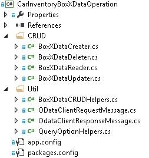
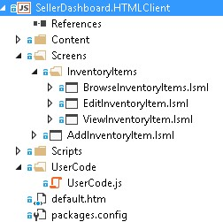
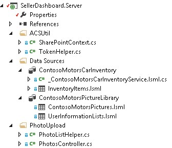

# <a name="create-a-cloud-business-add-in-that-uses-the-sap-gateway"></a>Создание облачной бизнес-надстройки, использующей шлюз SAP
 В этой статье рассказывается, как создать надстройку SharePoint, размещаемую у поставщика, с названием LightSwitch для доступа к данным SAP с помощью шлюза SAP для Майкрософт.
 

 **Примечание.** В настоящее время идет процесс замены названия "приложения для SharePoint" названием "надстройки SharePoint". Во время этого процесса в документации и пользовательском интерфейсе некоторых продуктов SharePoint и средств Visual Studio может по-прежнему использоваться термин "приложения для SharePoint". Дополнительные сведения см. в статье [Новое название приложений для Office и SharePoint](new-name-for-apps-for-sharepoint.md#bk_newname).
 


В этой статье рассмотрены основные шаги, выполненные группой разработчиков Майкрософт при создании надстройки LightSwitch для SharePoint с размещением у поставщика, которая может получать доступ к данным SAP с помощью шлюза SAP для Майкрософт. Эта надстройка поддерживает операции CRUD с данными SAP, её можно использовать для просмотра библиотеки изображений SharePoint, а также отправки файлов в эту библиотеку.

 

Цель этой статьи — показать ключевые моменты надстройки, которые могут пригодиться вам при создании аналогичных надстроек. В статье приведен соответствующий пример кода, в котором наглядно продемонстрировано, как создать рабочее решение.
 

 **Загрузка примеров.** [ Пример: разработка облачной бизнес-надстройки для доступа к шлюзу SAP для Майкрософт.](https://code.msdn.microsoft.com/Sample-Developing-a-Cloud-25d6d1ea)
 

## <a name="before-you-begin"></a>Перед началом работы

Ниже перечислены компоненты, необходимые для выполнения процедур, которые описаны в этой статье.
 

 

-  **Сайт разработчика Office 365**, размещенный в домене Office 365, который связан с областью клиентов Microsoft Azure Active Directory (Azure AD). См. статью [Получение подписки на Office 365 для разработчиков, настройка инструментов и среды, а также начало развертывания надстроек](http://msdn.microsoft.com/en-us/library/office/fp179924%28v=office.15%29.aspx) или [Создание сайта разработчика с помощью существующей подписки Office 365](http://msdn.microsoft.com/en-us/library/office/jj692554%28v=office.15%29.aspx)
    
 
-  **Visual Studio 2013 c обновлением 4** или более поздней версии, который вы можете получить в статье [Вас приветствует Visual Studio 2013](http://msdn.microsoft.com/en-us/library/dd831853.aspx).
    
 
-  **Инструменты разработчика Microsoft Office для Visual Studio. ** Версия, включенная в обновление 4 для Visual Studio 2013 или более поздней версии.
    
 
-  **Шлюз SAP для Майкрософт** должен быть развернут и настроен в Microsoft Azure. Дополнительные сведения см. в документации к [шлюзу SAP для Майкрософт](http://go.microsoft.com/fwlink/?LinkId=507635).
    
 
-  **Учетная запись в организации в Microsoft Azure.** См. раздел о [создании учетной записи пользователя в организации в Azure AD](http://go.microsoft.com/fwlink/?LinkID=512580).
    
     **Примечание.** После создания учетной записи Office 365 (login.microsoftonline.com) войдите в нее и измените временный пароль.
-  **Конечная точка OData для SAP** с данными, созданными для примера. См. документацию к [шлюзу SAP для Майкрософт](http://go.microsoft.com/fwlink/?LinkId=507635).
    
 
-  **Общее представление об Azure AD.** См. статью [Начало работы с Azure AD](http://msdn.microsoft.com/en-us/library/azure/dn655157.aspx).
    
 
-  **Базовые знания о том, как создавать надстройки SharePoint.** См. [руководство по созданию базовых надстроек SharePoint, размещаемых у поставщика](http://msdn.microsoft.com/en-us/library/office/fp142381%28v=office.15%29.aspx).
    
 
-  **Базовые знания об OAuth 2.0 в Azure AD.** См. статью об [OAuth 2.0 в Azure AD](http://msdn.microsoft.com/en-us/library/azure/dn645545.aspx) и связанные с этой статьей темы.
    
 

## <a name="solution-overview"></a>Общие сведения о решении

Contoso Motors это вымышленная компания по продаже автомобилей, которая служит примером реальных предприятий такого плана. Дилерский центр этой компании предоставляет информацию о складе торговым представителям и другим дилерским центрам. С помощью этого приложения продавцы могут проверять текущее состояние склада автомобилей, к которому у надстройки есть прямой доступ из SAP через шлюз SAP для Майкрософт. Все данные хранятся в SAP, а изображение каждой машины в библиотеке изображений SharePoint Online. Данные SAP и библиотеки изображений SharePoint объединяются и отображаются в надстройке. В ней менеджеры и администраторы могут выполнять стандартные операции CRUD с подробными данными о каждом автомобиле в SAP.
 

 
В примере этой статьи надстройка SellerDashboard управляет данными инвентаризации автомобилей из SAP и соответствующими изображениями в библиотеке изображений SharePoint. В этой надстройке стандартные операции CRUD (создание, чтение, обновление и удаление) можно выполнять с подробными сведениями о каждом автомобиле в SAP.
 

 

 **Совет.** Демонстрацию этой надстройки см. в видео [Технический вебинар: шлюз SAP для Майкрософт и модели разработки Microsoft Azure](http://go.microsoft.com/fwlink/?LinkId=517378) на веб-сайте BrightTalk. Демонстрация функций надстройки начинается на 48-й минуте видео.
 

 **Архитектура кода**
 

 
Решение SellerDashboard включает восемь проектов и, как показано на изображении ниже, разделено на две категории: BoxXDataStudio и SellerDashboardStudio.
 

 

 

 

### <a name="boxxdatastudio"></a>BoxXDataStudio

Эта студия включает все компоненты, необходимые для взаимодействия со шлюзом SAP для Майкрософт.
 

 

-  **AADAuthLib**
    
    Этот компонент используется для выполнения [потока кода авторизации Azure AD](https://msdn.microsoft.com/en-us/library/azure/dn645542.aspx), в котором используется шаблон Singleton.
    
    В фрагменте кода ниже показана главная функция, предоставленная компонентом AADAuthLib. Дополнительные сведения см. в классе поддержки в примере кода AADAuthLib/AuthUtil.cs.
    


```C#
  // Use the auth code, acquire the refresh token and access token, and store them in the current session
        public bool AcquireTokenFromAuthCode(string authCode, string redirectUrl = "redirectUrl")
        {
            if (!IsAuthorized &amp;&amp; !string.IsNullOrEmpty(authCode))
            {
                AuthenticationResult authResult = _authContext.AcquireTokenByAuthorizationCode(authCode,
                    new Uri(ConfigurationManager.AppSettings["ida:" + redirectUrl]),
                    _clientCredential,
                    ConfigurationManager.AppSettings["ida:ResourceUrl"]);

                HttpContext.Current.Session["RefreshToken"] = authResult.RefreshToken;
                HttpContext.Current.Session["AccessToken-" + ConfigurationManager.AppSettings["ida:ResourceUrl"]] = new Tuple<string, DateTimeOffset>(authResult.AccessToken, authResult.ExpiresOn);

                return true;
            }

            return false;
  }

 // Provide the access token, which is stored in the current session, if the access token expired, use the refresh token get a new one.
 public string AccessToken
        {
            get
            {
                if (!IsAuthorized) throw new UnauthorizedAccessException();

                var accessToken = HttpContext.Current.Session["AccessToken-" + ConfigurationManager.AppSettings["ida:ResourceUrl"]] as Tuple<string, DateTimeOffset>;

                if (IsAccessTokenValid(accessToken))
                {
                    return accessToken.Item1;
                }

                accessToken = RenewAccessToken();
                HttpContext.Current.Session["AccessToken-" + ConfigurationManager.AppSettings["ida:ResourceUrl"]] = accessToken;

                return accessToken.Item1;
            }
  }
```

-  **BoxXDataService**
    
    Это служба WCF RIA, представляющая собой интерфейс, который используется серверным компонентом SellerDashboard, размещенном в Azure, и использующая источник данных SAP через шлюз SAP для Майкрософт.
    
    Указанный ниже фрагмент кода представляет собой веб-метод CRUD, поддерживаемый службой WCF RIA. Дополнительные сведения см. в файле BoxXDataService/BoxXDataService.cs.
    


```C#
  [Query(IsDefault = true)]
        public IQueryable<InventoryItem> GetAllCarInventory()
        {
            BoxXDataReader dataReader = BoxXDataReader.Instance;
            IInventoryCollection dataCollection = ModelFactory.CreateInventoryCollection(dataReader.SchemaPropertyNames);
            IInventoryQuery query = QueryFactory.CreateQuery();
            dataReader.GetData(dataCollection, query);

            return dataCollection.Items.Cast<InventoryItem>().AsQueryable();
        }

        [Update]
        public void UpdateCarInventoryItem(InventoryItem carInventoryItem)
        {
            BoxXDataUpdater dataUpdater = BoxXDataUpdater.Instance;
            dataUpdater.UpdateInventoryItem(carInventoryItem);
        }

        [Insert]
        public void InsertCarInventoryItem(InventoryItem carInventoryItem)
        {
            BoxXDataCreater dataCreater = BoxXDataCreater.Instance;
            dataCreater.CreateInventoryItem(carInventoryItem);
        }

        [Delete]
        public void DeleteCarInventoryItem(InventoryItem carInventoryItem)
        {
            BoxXDataDeleter.DeleteInventoryItem(carInventoryItem.ID);
 }
```

-  **CarInventoryBoxXDataOperation**
    
    Это внедрение операций CRUD для BoxXDataService. На изображении ниже показана архитектура основного кода CarInventoryBoxXDataOperation. Пространство имен CRUD используется для реализации операций CRUD, а пространство имен Util это вспомогательный код для пространства имен CRUD.
    
  
 

 

 
-  **CarInventoryModel**
    
    Это проект библиотеки, используемый для внедрения модели данных и служебных программ. Определение модели данных должно соответствовать метаданным конечной точки OData, которая используется шлюзом SAP для Майкрософт на базе схемы данных SAP. BoxXDataService и CarInventoryBoxXDataOperation используют ее для преобразования элемента базы данных SAP в экземпляр склада автомобилей.
    
    На изображении ниже показаны основные компоненты.
    
 

 

 

 

 

### <a name="sellerdashboardstudio"></a>SellerDashboardStudio

SellerDashboardStudio включает стандартные компоненты надстройки SharePoint LightSwitch.
 

 

-  **SellerDashboard**
    
    SellerDashboard это запускаемый проект, который используется для публикации надстройки SellerDashboard на веб-сайте Azure, а также надстройки SharePoint на сайте разработчика SharePoint.
    
 
-  **SellerDashboard.HTMLClient**
    
    Этот компонент включает экраны, пользовательский элемент управления и элемент управления для отправки фотографий. На рисунке внизу показаны его основные компоненты.
    
 
- 
  
 

    SellerDashboard.HTML.Client содержит четыре экрана.
    
 

      - BrowseInventoryItems начальный экран, который используется для просмотра основных сведений обо всех складских позициях.
    
 
  - ViewInventoryItem подробный экран, который используется для отображения подробного представления по каждой складской позиции.
    
 
  - EditInventoryItem всплывающий экран для редактирования, который используется для внесения изменений в данные о складской позиции.
    
 
  - AddInventoryItem всплывающий экран для добавления, который используется для добавления новой складской позиции.
    
 

    Файл UserCode.js включает код пользовательского элемента управления для пользовательского интерфейса.
    
    Файлы photohelper.js и sharepointauthhelper.js, а также файлы папки сценариев созданы в соответствии с руководством, описанным в статье  [Пошаговое руководство. Создание надстройки для SharePoint с помощью LightSwitch](http://msdn.microsoft.com/en-us/library/jj969621.aspx).
    
 
-  **SellerDashboard.Server**
    
    Этот компонент содержит источники данных WCF RIA и SharePoint, а также веб-API для отправки фотографий. На изображении ниже показаны его основные компоненты.
    
  
 

    SharePointContext.cs и TokenHelper.cs вспомогательные классы, которые предоставляют контекст клиента для проверки подлинности в SharePoint. Это позволяет использовать веб-API для отправки фотографий, чтобы добавлять фотографии автомобилей в библиотеку изображений. Файлы PhotoListHelper.cs и PhotosController.cs внедряют веб-API для отправки фотографий. Дополнительные сведения о том, как надстройка LightSwitch использует веб-API для отправки фотографий, см. в статье  [Пошаговое руководство. Создание надстройки для SharePoint с помощью LightSwitch](http://msdn.microsoft.com/en-us/library/jj969621.aspx).
    
 
-  **SellerDashboard.SharePoint**
    
    Этот компонент добавляется после решения LightSwitch, чтобы включить проект SharePoint. Его можно использовать, чтобы настроить сайт SharePoint, используемый для библиотеки изображений, и задать необходимое разрешение для надстройки. Для SellerDashboard необходимо предоставить уровень разрешений "Полный доступ" на сайте SharePoint, на котором размещена библиотека изображений.
    
 

## <a name="implementation"></a>Реализация


 

 

### <a name="overview"></a>Обзор

На изображении ниже представлены компоненты, в состав которых входит SellerDashboard. Сплошная линия показывает поток данных, пунктирная поток OAuth. Компоненты зеленого цвета относятся к операциям с данными SAP, синего к операциям с библиотекой изображений SharePoint, а компоненты оранжевого цвета показывают операции с самим приложением SellerDashboard.  
 

 
 **SellerDashboard Solution**
 

 

 

 

 

 

### <a name="data-mashup"></a>Разнородные данные

LightSwitch поддерживает комбинирование данных путем добавления связи между двумя источниками данных в конструкторе.
 

 
 **Источник данных SAP**
 

 

-  *Схема данных в базе данных SAP* 
    
    В примере кода ниже показана возможный вариант схемы получения данных из шлюза SAP для Майкрософт Microsoft.
    


```XML
  
<?xml version="1.0" encoding="UTF-8"?> 
- <edmx:Edmx xmlns:sap="http://www.sap.com/Protocols/SAPData" xmlns:m="http://schemas.microsoft.com/ado/2007/08/dataservices/metadata" 
xmlns:edmx:"http://schemas.microsoft.com/ado/2007/06/edmx" Version="1.0">
   - <edmx:DataServices m:DataServiceVersion="2.0">
      - <Schema xml:lang="en" xmlns="http://schemas.microsoft.com/ado/2008/09/edm" Namespace="ZCAR_POC_SRV">
         - <EntityType sap:content-version="1" Name="ContosoMotors">
              - <Key>
                     <PropertyRef Name="ID"/>
               </Key>
               <Property Name="ContactPhone" Type="Edm.String"/>
               <Property Name="ContactEmail" Type="Edm.String"/>
               <Property Name="ID" Type="Edm.Int32" Nullable="false"/>
               <Property Name="BuyerEmail" Type="Edm.String" MaxLength="255"/>
               <Property Name="MaxPower" Type="Edm.Int32" Nullable="false"/>
               <Property Name="Engine" Type="Edm.String" Nullable="false" MaxLength="255"/>
               <Property Name="BodyStyle" Type="Edm.String" Nullable="false" MaxLength="255"/>
               <Property Name="Transmission" Type="Edm.String" Nullable="false" MaxLength="255"/>
               <Property Name="Year" Type="Edm.Int32" Nullable="false"/>
               <Property Name="Model" Type="Edm.String" Nullable="false" MaxLength="255"/>
               <Property Name="Brand" Type="Edm.String" Nullable="false" MaxLength="255"/>
               <Property Name="ExtColor" Type="Edm.String" Nullable="false" MaxLength="255"/>
              <Property Name="IntColor" Type="Edm.String" Nullable="false" MaxLength="255"/>
              <Property Name="ContactName" Type="Edm.String" Nullable="false" MaxLength="255"/>
              <Property Name="Price" Type="Edm.String" Nullable="false"/>
              <Property Name="StockNo" Type="Edm.String" Nullable="false"/>
              <Property Name="Arrived_Date" Type="Edm.DateTime" Nullable="false" Precision="0"/>
              <Property Name="Status" Type="Edm.String" Nullable="false" MaxLength="255"/>
      </EntityType>
   - <EntityContainer Name="ZCAR_POC_SRV_Entities" m:IsDefaultEntityContainer="true">
          <EntitySet sap:content-version="1" Name="ContosoMotorsCollection" sap:searchable="true" EntityType="ZCAR_POC_SRV.ContosoMotors"/>
     </EntityContainer>
     <atom:link xmlns:atom="http://www.w3.org/2005/Atom" href="http://contoso.cloudapp.net:8080/perf/sap/opu/odata/sap/ZCAR_POC_SRV/$metadata" rel="self"/>
     <atom:link xmlns:atom="http://www.w3.org/2005/Atom" href="http://contoso.cloudapp.net:8080/perf/sap/opu/odata/sap/ZCAR_POC_SRV/$metadata" rel="latest-version"/>
</Schema>
</edmx:DataServices>
</edms:Edmx>               

```


    This is our test data base, and the Property Type and Nullable value is based on the scenario. The ID is the PropertyRef and the OData CRUD operation is based on ID. The StockNo property is used to mash data with the car picture that is stored in SharePoint picture library.
    
 
-  *Модель данных, определенная для службы RIA* 
    
```C#
  public interface IInventoryItem
        {
        IEnumerable<InventoryPropertyName> ValidPropertyNames { get; }
        bool IsValid { get; }

        int ID { get; set; }
        DateTime ArrivedDate { get; set; }
        string BodyStyle { get; set; }
        string Brand { get; set; }
        string BuyerEmail { get; set; }
        string ContactEmail { get; set; }
        string ContactName { get; set; }
        string ContactPhone { get; set; }
        string Engine { get; set; }
        string ExtColor { get; set; }
        IEnumerable<Uri> Images { get; }
        string IntColor { get; set; }
        int MaxPower { get; set; }
        string Model { get; set; }
        decimal Price { get; set; }
        bool Removed { get; }
        string Status { get; set; }
        string StockNo { get; set; }
        string Transmission { get; set; }
        int Year { get; set; }

        void AddImageUrl(Uri url);
        bool CopyFrom(IInventoryItem other);
        object GetPropertyValue(InventoryPropertyName property);
        void MarkAsRemoved();
        void SetPropertyValue(InventoryPropertyName property, object value);
       }

        public interface IInventoryCollection
       {
        IEnumerable<InventoryPropertyName> QueriedPropertyNames { get; }
        IEnumerable<IInventoryItem> Items { get; }
        bool Valid { get; }

        IInventoryItem this[int id] { get; }
        bool Contains(int id);
        void AddItem(IInventoryItem inventoryItem);
        IInventoryCollection Filter(Predicate<IInventoryItem> match);
        bool CopyFrom(IInventoryCollection other);
}

```


    Any property that isn't included in the SAP database schema can be ignored. For example, the  **Images** property was added here for scalability considerations. This data model is a middle layer between the real SAP database and the SellerDashboard.Server data source. The LightSwitch project has two components: View and Server. When you add an external data source on the Server side, LightSwitch helps you build an abstract data layer that is added to the data source on the Server side.
    
    Most of the properties have the same type as the properties in the SAP database schema, except for StockNo, whose type has been changed from  **int** to **string**. This is because StockNo is used as a way to define the relationship between the SAP data and SharePoint picture library.
    
     **Tip**  StockNo must have the type  **string** because the value stored in the SharePoint picture library is **Text**. These two types must match in order to accomplish the data mashup.

    The implementation of the two interfaces is in CarInventoryModel/InventoryItem.cs and CarInventoryModel/InventoryCollection.cs.
    
 
-  *Источник данных, используемый на стороне сервера LightSwitch* 
    
  
 

    Когда вы добавляете службу WCF RIA (BoxXDataService) на сервере SellerDashboard, включается модель данных, определенная в CarInventoryModel, и вы получаете релевантную таблицу данных. Вы можете изменить типы некоторых свойств. Например, вы можете изменить тип свойства **BuyerEmail** с **String** на **Email Address**, и LightSwitch будет поддерживать функцию проверки формата электронного письма на стороне клиента.
    
 
 **Библиотека изображений SharePoint**
 

 
Библиотека изображений, размещенная на хост-сайте SharePoint, называется ContosoMotorsPictureLibrary и содержит три новых столбца с именами StockNo, ThumbnailUrl и FullImageUrl. Все они настроены в качестве полей с типом **Text**.
 

 

 **Совет.** В именах столбцов учитывается регистр символов.
 

 Столбец StockNo используется для создания связи с данными SAP. Столбцы ThumbnailUrl и FullImageUrl для получения URL-адреса соответствующего изображения удобным способом.
 

 
 *Источник данных, используемый на стороне сервера LightSwitch* 
 

 
ContosoMotorsPicture — это модель источника данных LightSwitch, которая сопоставляется с библиотекой изображений хост-сайта SharePoint на стороне сервера LightSwitch.
 

 

 

 
 **Взаимоотношение данных**
 

 
Добавьте связь "один к нулю" или "один к одному" между InventoryItem и ContosoMotorsPicture. На изображении ниже показано, как это будет выглядеть при использовании LightSwitch в Visual Studio.
 

 

 

 

 

 

### <a name="oauth-with-azure-ad-amp-acs"></a>OAuth, Azure AD и ACS

В этом разделе кратко рассказывается о том, как надстройка реализует OAuth в Azure AD и службах контроля доступа (ACS).
 

 
 **Общие сведения**
 

 
SellerDashboard это размещенная у поставщика надстройка для SharePoint, которая должна работать с двумя источниками данных: библиотекой изображений SharePoint и данными SAP с помощью шлюза SAP для Майкрософт.
 

 
Чтобы иметь доступ к библиотеке изображений SharePoint, приложение SellerDashboard должно пройти проверку подлинности в службе контроля доступа и получить от нее маркер доступа. Но чтобы получить доступ к данным SAP, приложение SellerDashboard должно получить другой маркер доступа от Azure AD, так как шлюз SAP для Майкрософт использует Azure AD для проверки подлинности и авторизации.
 

 

 

 
 **Реализация**
 

 
SellerDashboard это размещенная у поставщика надстройка для SharePoint, которая поддерживает отправку изображений с помощью клиентской объектной модели SharePoint. Контекст SharePoint, который используется для создания контекста клиента для узла SharePoint, кэшируется, а контекст клиента затем используется при передаче данных через веб-API.
 

 
Когда завершена авторизация с использованием OAuth и службы контроля доступа, запрос на проверку подлинности отправляется в Azure AD. Для этого надстройка использует файл cookie для входа на сайт Login.MicrosoftOnline.com и завершения потока кода авторизации Azure AD, который возвращает маркер обновления. Надстройка кэширует этот маркер на случай будущих запросов на проверку подлинности во время сеанса. Ниже представлен код, который при этом используется.
 

 


```C#
protected override void Page_Load(object sender, EventArgs e)
{
    if (!IsPostBack)
    {
 SharePointContext spContext = SharePointContextProvider.Current.GetSharePointContext(Context);
        if (spContext != null)
        {
     // Cache the SharePoint Context, which will be used to create Client Context for SharePoint host
            _spContext = spContext;
        }

        
        // Acquire refresh token and access token, and store them in the current session, which will be used do the OAuth with AAD for operating the SAP data
        AuthUtil.Instance.AcquireTokenFromAuthCode(Request.QueryString["code"]);

        if (!AuthUtil.Instance.IsAuthorized)
        {
             Response.Redirect(AuthUtil.Instance.AuthCodeUrl);
        }
     }

     base.Page_Load(sender, e);
 }
```

Дополнительные сведения см. в файлах SellerDashBoard.Server/SharePointLaunch.aspx.cs и AADAuthLib/AuthUtil.cs в примере кода.
 

 
SellerDashboard.Server содержит файлы SharePointContext.cs и TokenHelper.cs, которые используются для получения контекста клиента только для надстройки для узла SharePoint. Visual Studio автоматически добавляет эти два файла в проект SharePoint и присваивает ему имя <*имя_вашего_проекта*>Web (например, SharePointAppWeb). Затем вы можете скопировать эти файлы в исходный код надстройки SellerDashboard и включить их в свой проект.
 

 

### <a name="crud-operations-on-sap-data-from-sap-gateway-for-microsoft"></a>Операции CRUD над данными SAP, полученными из шлюза SAP для Майкрософт

Фрагменты кода ниже показывают основную логику кода для операций CRUD. Дополнительные сведения см. в варианте реализации CarInventoryBoxXDataOperation в примере кода.
 

 
 **BoxXDataCreater**
 

 


```C#

        public void CreateInventoryItem(IInventoryItem inventoryItem)
        {
            if (_model == null)
            {
                _model = BoxXDataCRUDHelpers.GetMetadata(BoxXDataCRUDHelpers.MetadataUrl);
            }

            // Create new entry request generate
            var requestMessage = new ODataClientRequestMessage(new Uri(BoxXDataCRUDHelpers.DataCollectionUrl),
                                                                ODataConstants.MethodPost);
            BoxXDataCRUDHelpers.CreateEntryRequestHeaderSetter(requestMessage, AuthUtil.Instance.AccessToken);
            BoxXDataCRUDHelpers.SetODataRequestContent(requestMessage, _model, inventoryItem);

            // Create new entry request execute
            IODataResponseMessage responseMessage = requestMessage.GetResponse();

        }
BoxXDataReader
 public void GetData(IInventoryCollection dataCollection, IInventoryQuery query)
        {
            GetValueWithoutLocallyFiltering(dataCollection, query);

            if (query.Filters.Any())
            {
                var filteredCollection = dataCollection.Filter(inventoryItem =>
                    query.Filters.Any(filter => filter.Match(inventoryItem)));

                dataCollection.CopyFrom(filteredCollection);
            }
        }
```

 **BoxXDataUpdater**
 

 


```C#
public void UpdateInventoryItem(IInventoryItem inventoryItem)
        {
            if (_model == null)
            {
                _model = BoxXDataCRUDHelpers.GetMetadata(BoxXDataCRUDHelpers.MetadataUrl);
            }

            // Update existing entry request generate
            var requestMessage = new ODataClientRequestMessage(new Uri(BoxXDataCRUDHelpers.DataCollectionUrl + '(' + inventoryItem.ID + ')'),
                                                                ODataConstants.MethodPut);
            BoxXDataCRUDHelpers.UpdateEntryRequestHeaderSetter(requestMessage, AuthUtil.Instance.AccessToken);
            BoxXDataCRUDHelpers.SetODataRequestContent(requestMessage, _model, inventoryItem);

            // Update existing entry request execute
            IODataResponseMessage responseMessage = requestMessage.GetResponse();
        }
BoxXDataDeleter
 public static void DeleteInventoryItem(int ID)
        {
            // Delete existing entry request generate
            var requestMessage = new ODataClientRequestMessage(new Uri(BoxXDataCRUDHelpers.DataCollectionUrl + '(' + ID + ')'),
                                                                ODataConstants.MethodDelete);
            BoxXDataCRUDHelpers.DeleteEntryRequestHeaderSetter(requestMessage, AuthUtil.Instance.AccessToken);

            // Delete existing entry request execute
            IODataResponseMessage responseMessage = requestMessage.GetResponse();
        }
```


### <a name="uploading-photos-to-the-sharepoint-picture-library"></a>Отправка фотографий в библиотеку изображений SharePoint

Для отправки фотографий в библиотеку изображений SharePoint нужны соответствующие элемент управления и реализованный веб-интерфейс API. При этом используется код, представленный ниже, который создан в соответствии с инструкциями, описанными в статье  [Пошаговое руководство. Создание надстройки для SharePoint с помощью LightSwitch](http://msdn.microsoft.com/en-us/library/jj969621.aspx).
 

 
 **Внесение изменений в файл photohelper.js**
 

 
В форму uploadForm будет добавлено новое поле, которое используется для передачи параметра StockNo в веб-API отправки фотографий.
 

 


```

uploadForm = $(
             '<form id="uploadForm" method="POST" enctype="multipart/form-data" action="' + API_URL + '"  data-ajax="false" target="uploadTargetIFrame">' +
             '   <input name="fileInput" id="fileInput" type="file" size="30" data-theme="c" accept="image/*" multiple="true"/>' +
             '   <input type="hidden" name=' + screen.InventoryItem.StockNo + '>' +
             '</form>');

```

Добавьте логику для кэширования URL-адреса изображения и логику откладывания изображений.
 

 


```
function completeUpload(uploadedFiles) {
            var fullImageUrl = uploadedFiles[0];
            var photoNameWithExt = fullImageUrl.substr(fullImageUrl.lastIndexOf('/') + 1);
            var photoNameWithoutExt = photoNameWithExt.substr(0, photoNameWithExt.lastIndexOf("."));
            var photoPathUri = fullImageUrl.substr(0, fullImageUrl.lastIndexOf('/'));
            var photoExt = photoNameWithExt.substr(photoNameWithExt.lastIndexOf(".") + 1, photoNameWithExt.length);
            var thumbnailUrl = photoPathUri + "/_t/" + photoNameWithoutExt + "_" + photoExt + ".jpg";
            setCacheUrl(screen.InventoryItem.StockNo, fullImageUrl + "*#00#" + thumbnailUrl);
            setDetailsCarPicture(fullImageUrl);
            screen.closePopup();
        }
```

 **Внесение изменений в файл PhotosController.cs**
 

 
Используйте только контекст клиента для надстройки для узла SharePoint, созданный кэшированным контекстом SharePoint.
 

 
Это необходимо, так как ContosoMotorsPictureLibrary относится не к надстройке SellerDashboard, а к хост-сайту SharePoint. Кроме того, при удалении фотографий удаляется соответствующий код.
 

 


```C#

private ClientContext AppWebContext
    {
        get
        {
            if (appWebContext == null)
            {
                appWebContext = SharePointLaunch.getAppWebContext();
            }
            return appWebContext;
        }
    }

```

 **Внесение изменений в файл PhotoListHelper.cs**
 

 
Добавьте логику обновления изображения, которая удалит старый элемент изображения (если он существует) и добавит новый. Назначьте StockNo для нового элемента изображения, одновременно задав ему значения FullImageUrl и ThumbnailUrl.
 

 


```C#

            // Delete the old picture item
            foreach (ListItem item in items)
            {
                if (!string.IsNullOrEmpty((string)(item["StockNo"])))
                {
                    string tempStockNo = item["StockNo"].ToString();
                    if (tempStockNo.Equals(stockNo))
                    {
                        item.DeleteObject();
                        siteContext.ExecuteQuery();
                        break;
                    }
                }
            }

            // Update the new picture item
            foreach (ListItem item in items)
            {
                string fullImageName = item["FileLeafRef"].ToString();
                string thumbnailName = fullImageName.Replace('.', '_') + ".jpg";

                if (photoUri.Contains(fullImageName))
                {
                    item["StockNo"] = stockNo;
                    item["FullImageUrl"] = photoUri;
                    item["ThumbnailUrl"] = photoUri.Replace(fullImageName, "_t/" + thumbnailName);
                    item.Update();
                    siteContext.ExecuteQuery();
                    break;
                }
            }


```


### <a name="user-experience"></a>Взаимодействие с пользователем

По специальному запросу сценария многие пользовательские элементы управления реализуются для поддержки этого запроса. Соответствующий код можно найти в файле UserCode.js. Простой пользовательский интерфейс можно быстро создать с помощью конструктора LightSwitch. Шаблон "Набор общих экранов" может соответствовать пробному запросу. Вопрос взаимодействия с пользователем не рассматривается подробно в этом документе, так как это не его основная тема.
 

 

## <a name="deploying-the-app"></a>Развертывание приложения

Выполните действия, описанные в этом разделе, чтобы развернуть надстройку. Перед её развертыванием убедитесь, что шлюз SAP для Майкрософт был развернут и настроен для клиента Azure.
 

 

### <a name="create-your-azure-web-site"></a>Создание веб-сайта Azure


1. Войдите в систему на [портале Microsoft Azure](http://go.microsoft.com/fwlink/?LinkID=512959) в качестве глобального администратора.
    
 
2. В меню слева щелкните **Веб-сайты**.
    
     **Примечание.** Вы будете использовать этот веб-сайт для размещения надстройки SharePoint, размещаемой у поставщика (SellerDashboard).
3. На панели команд в нижней части страницы щелкните **Создать**.
    
 
4. Выберите пункты **Вычисления > Веб-сайт > Быстрое создание**.
    
 
5. В поле **URL-адрес** введите первую часть URL-адреса, который вы хотите использовать, выберите элемент "План размещения веб-сайтов" и щелкните **Создать веб-сайт**. Скопируйте этот URL-адрес, так как он вам понадобится для регистрации надстройки (как это сделать, описано ниже). Например, укажите Constoso.azurewebsites.net.
    
 

### <a name="register-the-sharepoint-app"></a>Регистрация надстройки SharePoint

Пустая надстройка для SharePoint используется для того, чтобы предоставить надстройке для SharePoint разрешения на чтение, необходимые для извлечения изображений автомобилей из библиотеки изображений в службе SharePoint Online. Выполните действия, указанные ниже, чтобы зарегистрировать надстройку для SharePoint на сайте SharePoint, на котором размещена эта библиотека, и предоставить этой надстройке доступ к сайту для чтения.
 

 

### <a name="to-register-the-sharepoint-add-in"></a>Регистрация надстройки для SharePoint


1. Откройте решение в обозревателе решений.
    
 
2. В разделе свойств надстройки SharePoint введите **URL-адрес сайта** SharePoint, содержащего библиотеку изображений. Когда отобразится соответствующий запрос, войдите на сайт в качестве владельца.
    
 
3. Задайте разрешение на чтение в манифесте надстройки.
    
  
 

 

 
4. Укажите надстройку как запускаемый проект и запустите проект. Значения ClientID и ClientSecret можно найти в файле ContosoMotorsCarInventoryWeb/Web.config. Код должен выглядеть так:
    
```XML
  <add key="ClientId" value="06af1059-8916-4851-a271-2705e8cf53c6"/>
<add key="ClientSecret" value="LypZu2yVajlHfPLRn5J2hBrwCk5aBOHxE4PtKCjIQkk="/>
```

5. Замените значения ClientID и ClientSecret в разделе "Hosted app configuration" (Конфигурации размещенний надстройки) файла ContosoMotorsCarInventoryWeb/TokenHelper.cs значениями, указанными выше. Код должен выглядеть так:
    
```C#
  
private static readonly string ClientId = "06af1059-8916-4851-a271-2705e8cf53c6";
private static readonly string ClientSecret = "LypZu2yVajlHfPLRn5J2hBrwCk5aBOHxE4PtKCjIQkk=";

```


### <a name="register-your-web-application-with-azure-ad"></a>Регистрация веб-приложения в Azure AD

В этом разделе рассказывается, как зарегистрировать пример надстройки на портале управления Azure.
 

 

1. Войдите в систему на [портале управления Azure](http://go.microsoft.com/fwlink/?LinkID=512959), используя учетную запись администратора служб или соадминистратора Azure.
    
 
2. В области навигации слева щелкните **Active Directory**.
    
 
3. На странице Active Directory щелкните каталог, настроенный для шлюза SAP для Майкрософт.
    
     **Совет.** Если вы не знаете, какой каталог использовался, обратитесь к администратору шлюза SAP для Майкрософт. Указание: это каталог, содержащий пользователей и группы шлюза SAP для Майкрософт.
4. На верхней панели навигации щелкните **НАДСТРОЙКИ**.
    
 
5. В нижней части страницы щелкните **Добавить**.
    
 
6. В открывшемся диалоговом окне выберите элемент **Добавить надстройку, разрабатываемую моей организацией**.
    
 
7. В диалоговом окне **Добавление надстройки** введите имя надстройки, например SellerDashboard.
    
 
8. Выберите тип надстройки **Веб-приложение и/или веб-API** и щелкните стрелку вправо.
    
 
9. В диалоговом окне **Добавление свойств** укажите URL-адрес ранее созданного вами сайта (в разделе создания веб-сайта Azure) в качестве URL-АДРЕСА ВХОДА. Пример: *https://Constoso.azurewebsites.net*.
    
 
10. В поле **URI КОДА НАДСТРОЙКИ** присвойте надстройке уникальный универсальный код ресурса (URI), например добавив имя надстройки в конец **URL-АДРЕСА ВХОДА**. Пример: *https://Constoso.azurewebsites.net/SellerDashboard*, где Constoso.azurewebsites.net — сайт, созданный ранее вами в этой статье.
    
 
11. Установите флажок, чтобы создать надстройку. 
    
    Откроется информационная панель Azure для надстройки, и на ней отобразится сообщение об успешном выполнении операции.
    
 

 **Примечание.** Вам потребуется дважды зарегистрировать надстройку в Azure AD: один раз для отладки и второй раз, чтобы развернуть ее в рабочей среде, как описано в действии 10. Чтобы зарегистрировать надстройку для отладки, используйте **URL-АДРЕС ДЛЯ ЕДИНОГО ВХОДА** и **URI КОДА НАДСТРОЙКИ** с URL-адресом проекта SellerDashboard.Server, используемым для отладки, чтобы вы могли запускать отладчик Visual Studio (с помощью клавиши F5). Этот URL-адрес будет иметь следующий вид: https://localhost. *nnnn*, где *nnnn* — номер порта. Этот URL-адрес можно найти в области "Свойства" в Visual Studio. Когда вы будете готовы развернуть надстройку в рабочей среде, измените регистрационную информацию и укажите правильный URL-адрес рабочей среды.
 


### <a name="configure-application-settings"></a>Настройка параметров надстройки

Настройка параметров новой надстройки, созданной вами в предыдущей процедуре. 
 

 

1. В верхней части страницы надстройки щелкните **Настроить**.
    
 
2. Настройте необходимые параметры и запишите параметры конфигурации, как описано в таблице ниже.
    

|**Параметр**|**Действие**|
|:-----|:-----|
|Client ID|Скопируйте значение, которое отображается в поле "Идентификатор клиента".|
|Client Secret| Создайте ключ надстройки: в разделе "Ключи" выберите срок действия ключа (1 или 2 года). На панели команд в нижней части страницы щелкните **Сохранить**. Отобразится значение ключа. Скопируйте и сохраните его для использования в будущем. Вам не удастся получить его после того как вы уйдете с этой страницы.|
|URI кода надстройки|Скопируйте значение, которое отображается в поле **URI кода надстройки**.|

    Remember to keep this information handy, because you'll need it in a later procedure.
    
 
3. В разделе **разрешений для других надстроек** выполните указанные ниже действия.
    
      1. Выберите свою надстройку для шлюза SAP для Майкрософт.
    
 
  2. В столбце **Делегированные разрешения** установите флажки разрешений для шлюза SAP для Майкрософт, которые необходимы надстройке SharePoint, размещаемой у поставщика, для SellerDashboard.
    
 
4. На панели команд в нижней части страницы нажмите кнопку **Сохранить**.
    
 

### <a name="replace-the-needed-configuration-for-deployment"></a>Замена необходимой конфигурации для развертывания


1. Найдите файл SellerDashboardHTMLClient/UserCode.js и в нем найдите указанный ниже заполнитель кода.
    
```C#
  sharePointUrl: "Replace with your SharePoint host site", 
// https://fake_domain.sharepoint.com/sites/Developer
SharePointRootUrl: "Replace with your SharePoint root site"
 // https://fake_domain.sharepoint.com/ 

```


      1. Replace the sharePointUrl value with your SharePoint site, the one to which the add-in will be installed and that also contains the picture library.
    
 
  2. Замените значение sharePointRootUrl на соответствующий корневой сайт SharePoint.
    
 
2. Найдите файл SellerDashboard.Server/Web.config в решении SellerDashboard и в нем найдите указанный ниже заполнитель конфигурации.
    
```XML
  <add key="ClientSecret" value="MwMp1yxOyy8BGhfD5d9VvuqlRbhaqWESxVNLzgpYNHU=" />
<add key="ClientId" value="ed138b32-c89d-4f22-b74d-7d9d5044b260" />
<add key="Ida:ClientId" value="Replace with Azure register add-in client id" />
<add key="Ida:ClientSecret" value="Replace with Azure register add-in client secret" />
<add key="Ida:TenantId" value="Replace with the SAP Gateway for Microsoft tenant domain, for example <yourDomain>.onmicrosoft.com" />
<add key="Ida:RedirectUrl" value="Replace with the Azure host site, for example https://contoso.azurewebsites.net/SharePointLaunch.aspx" />
<add key="Ida:ResourceUrl" value="Replace with the SAP Gateway for Microsoft instance, for example http://contoso.cloudapp.net/" />
<add key="Ida:ODataServiceBaseUrl" value="Replace with the SAP OData endpoint url, for example https://contoso.cloudapp.net:8081/perf/sap/opu/odata/sap/ZCAR_POC_SRV/" />
<add key="Ida:ODataServiceMetadataUrl" value="Replace with the SAP OData endpoint metadata url, for example https://contoso.cloudapp.net:8081/perf/sap/opu/odata/sap/ZCAR_POC_SRV/$metadata" />
<add key="Ida:DataCollection" value="Replace with OData EntitySet name, for example ContosoMotorsCollection" />
<add key="Ida:ODataFeedOrEntryFormat" value="application/atom+xml" />
<add key="Ida:ODataMetadataFormat" value="application/xml" />
<add key="Ida:ODataContentType" value="application/xml" />
<add key="Ida:ODataVersion" value="2.0" />
<add key="Ida:ODataMaxVersion" value="3.0" />
<add key="Ida:ODataWriterTypeName" value="Replace with the OData EntityType, for example ZCAR_POC_SRV.ContosoMotors" />
<add key="Ida:DefaultID" value="1024" />
<add key="Ida:DefaultStockNo" value="2048" />
<add key="Ida:SPPicLib" value="Replace with you picture library name, for example ContosoMotorsPictureLibrary" />
```


      1. Replace the ClientId and ClientSecret values with the values you got in the previous procedure.
    
 
  2. Замените значения Ida:ClientId и Ida:ClientSectet значениями из надстройки Azure AD.
    
 
  3. Замените значение Ida:TenantId значением < *ваш_домен*>.onmicrosoft.com.
    
    Например, если ваша учетная запись в организации выглядит так: пользователь@< *ваш_домен*>.onmicrosoft.com, то вам необходимо указать значение < *ваш_домен*>.onmicrosoft.com.
    
 
  4. Замените значение Ida:RedirectUrl тестовым сайтом, который вы создали в Azure и на котором размещена эта надстройка.
    
 
  5. Замените значение Ida:ResourceUrl экземпляром шлюза SAP для Майкрософт, который был развернут и настроен в Azure.
    
 
  6. Измените значение Ida:ODataServiceBaseUrl на URL-адрес конечной точки OData экземпляра шлюза SAP для Майкрософт.
    
 
  7. Измените значение Ida:ODataServiceMetadataUrl на URL-адрес метаданных конечной точки OData экземпляра шлюза SAP для Майкрософт.
    
 
  8. Замените значение Ida:DataCollection. Его можно получить из метаданных. Например, используйте ContosoMotorsCollection.
    
 
  9. Замените значение Ida:ODataWriterTypeName. Правильное значение можно получить из метаданных. 
    
    Например, введите следующее:
    


```XML
  ZCAR_POC_SRV.ContosoMotors

<EntityContainer Name="ZCAR_POC_SRV_Entities" m:IsDefaultEntityContainer="true">
     <EntitySet sap:content-version="1" Name="ContosoMotorsCollection" sap:searchable="true" EntityType="ZCAR_POC_SRV.ContosoMotors"/>
</EntityContainer>
<atom:link xmlns:atom="http://www.w3.org/2005/Atom" href="http://contoso.cloudapp.net:8080/perf/sap/opu/odata/sap/ZCAR_POC_SRV.ContosoMotors"/>
```

  10. Замените значение Ida:SPPicLib именем библиотеки изображений, созданной на хост-сайте SharePoint.
    
 

### <a name="publish-the-project"></a>Публикация проекта


1. Найдите проект SellerDashboard в решении SellerDashboard.
    
 
2. Щелкните правой кнопкой мыши SellerDashboard, чтобы опубликовать проект.
    
 
3. Щелкните **Размещаемая у поставщика**.
    
 
4. Щелкните **Windows Azure**.
    
 
5. Войдите в систему в качестве глобального администратора.
    
 
6. Выберите веб-сайт, созданный в Azure.
    
 
7. Укажите, что необходимо использовать HTTPS.
    
 
8. Используйте строку подключения данных по умолчанию.
    
 
9. Укажите в качестве хост-сайта веб-сайт, созданный в Azure, введите значения ClientId и ClientSecret, полученные на предыдущем шаге.
    
 
10. Опубликуйте.
    
     Вы получите опубликованный пакет.
    
 

### <a name="install-the-app"></a>Установка приложения


1. Войдите в систему на своем сайте развертывания SharePoint в качестве администратора сайта.
    
 
2. На домашней странице сайта щелкните **Новая надстройка, которую необходимо развернуть**.
    
 
3. Выберите пакет, полученный в результате процесса публикации.
    
 
4. Разверните его и внесите в список доверенных.
    
 

## <a name="external-code-list"></a>Список внешних источников кода


 

 


|**Источник в Интернете**|**Коллекция**|**Расположение кода**|**Лицензия**|
|:-----|:-----|:-----|:-----|
| [Учебник по созданию надстройки для опросов: разработка надстройки SharePoint с помощью LightSwitch](http://code.msdn.microsoft.com/Survey-App-Tutorial-a70d0afd) [Пошаговое руководство: создание надстройки SharePoint с помощью LightSwitch](http://msdn.microsoft.com/en-us/library/jj969621.aspx)|**Средство отправки фотографий**: PhotoListHelper.csPhotosController.csGlobal.asax.cs| [Учебник по созданию надстройки для опросов: разработка надстройки SharePoint с помощью LightSwitch (C#)](http://www.getcodesamples.com/src/2571E87E/)|Лицензия Apache, версия 2.0|
|Нет|**Проверка подлинности ACS**: SharePointContext.csTokenHelper.cs|**Внутренние шаблоны Visual Studio**: Visual C#, Office, SharePoint, Apps, AppforSharePoint||
