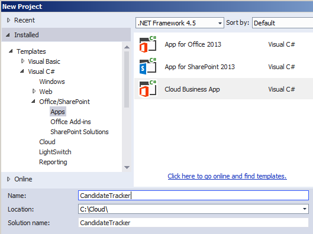
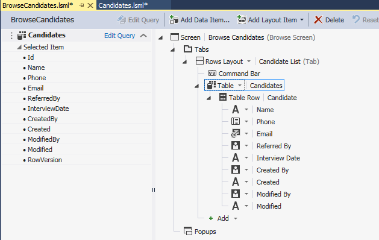
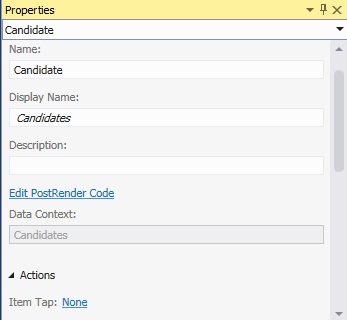

# <a name="create-a-cloud-business-add-in-with-a-social-newsfeed"></a><span data-ttu-id="edda2-101">Создание облачных бизнес-надстроек с каналом новостей из социальных сетей</span><span class="sxs-lookup"><span data-stu-id="edda2-101">Create a cloud business add-in with a social newsfeed</span></span>
<span data-ttu-id="edda2-p101">Используя шаблон **Облачная бизнес-надстройка** в Visual Studio, вы можете создавать надстройки SharePoint, в которых пользователи могут просматривать, добавлять и обновлять данные SharePoint. В типе проекта **Облачная бизнес-надстройка** используются технологии Visual Studio LightSwitch, которые существенно упрощают процесс создания бизнес-надстройки с размещением в SharePoint. В этом руководстве описано, как создать надстройку для отслеживания кандидатов на должность, используя функцию интеграции с социальными сетями SharePoint для Office 365 для предоставления канала новостей.</span><span class="sxs-lookup"><span data-stu-id="edda2-p101">By using the **Cloud Business Add-in** template in Visual Studio, you can create SharePoint Add-ins in which users can view, add, and update SharePoint data. The **Cloud Business Add-in** project type uses Visual Studio LightSwitch technologies, which greatly simplify the process of creating business add-in hosted on SharePoint. In this walkthrough, you’ll create an add-in to track job candidates, taking advantage of the SharePoint for Office 365 social integration feature to provide a newsfeed for the add-in.</span></span>
 
<span data-ttu-id="edda2-105">Полный пример приложения можно скачать из коллекции исходных кодов MSDN: [Создание облачной бизнес-надстройки с каналом новостей из социальных сетей](http://code.msdn.microsoft.com/Creating-a-Cloud-Business-8540c0c9)</span><span class="sxs-lookup"><span data-stu-id="edda2-105">You can download the complete sample application from the MSDN Code Gallery: [Creating a Cloud Business Add-in with a Social Newsfeedhttp://code.msdn.microsoft.com/Creating-a-Cloud-Business-8540c0c9](http://code.msdn.microsoft.com/Creating-a-Cloud-Business-8540c0c9)</span></span>
 

 <span data-ttu-id="edda2-p102">**Примечание.** Название "приложения для SharePoint" меняется на "надстройки SharePoint". В процессе перехода с одного названия на другое в документации и пользовательском интерфейсе некоторых продуктов SharePoint и средств Visual Studio по-прежнему может встречаться термин "приложения для SharePoint". Дополнительные сведения см. в статье [Новое название приложений для Office и SharePoint](new-name-for-apps-for-sharepoint#bk_newname).</span><span class="sxs-lookup"><span data-stu-id="edda2-p102">The name "apps for SharePoint" is changing to "SharePoint Add-ins". During the transition, the documentation and the UI of some SharePoint products and Visual Studio tools might still use the term "apps for SharePoint". For details, see [New name for apps for Office and SharePoint](new-name-for-apps-for-sharepoint#bk_newname).</span></span>
 


## <a name="prerequisites"></a><span data-ttu-id="edda2-109">Необходимые компоненты</span><span class="sxs-lookup"><span data-stu-id="edda2-109">Prerequisites</span></span>

<span data-ttu-id="edda2-110">Для выполнения действий в этом руководстве требуется Visual Studio 2013.</span><span class="sxs-lookup"><span data-stu-id="edda2-110">This walkthrough requires Visual Studio 2013.</span></span>
 

 
<span data-ttu-id="edda2-111">Для размещения надстройки вам также понадобится сайт SharePoint или SharePoint разработчика в Office 365, который вы можете получить на странице  [Регистрация на сайте разработчиков для Office 365](http://go.microsoft.com/fwlink/?LinkId=263490).</span><span class="sxs-lookup"><span data-stu-id="edda2-111">To host the add-in, you'll also need a SharePoint site or a SharePoint Developer site on Office 365, which you can get from the  [Sign up for an Office 365 Developer Site](http://go.microsoft.com/fwlink/?LinkId=263490).</span></span>
 

 

## <a name="create-a-cloud-business-add-in-project"></a><span data-ttu-id="edda2-112">Создание проекта облачной бизнес-надстройки</span><span class="sxs-lookup"><span data-stu-id="edda2-112">Create a Cloud Business Add-in Project</span></span>
<span data-ttu-id="edda2-113"><a name="bk_create"> </a></span><span class="sxs-lookup"><span data-stu-id="edda2-113"></span></span>

 <span data-ttu-id="edda2-114">Для создания надстройки начните с шаблона проекта **Облачная бизнес-надстройка** в Visual Studio.</span><span class="sxs-lookup"><span data-stu-id="edda2-114">To create a Cloud Business Add-in, you start with the **Cloud Business Add-in** project template in Visual Studio.</span></span>
 

 

### <a name="to-create-the-project"></a><span data-ttu-id="edda2-115">Создание проекта</span><span class="sxs-lookup"><span data-stu-id="edda2-115">To create the project</span></span>


1. <span data-ttu-id="edda2-116">В строке меню выберите **Файл** > **Создать** > **Проект**.</span><span class="sxs-lookup"><span data-stu-id="edda2-116">On the menu bar, choose  **File**,  **New**,  **Project**.</span></span>
    
    <span data-ttu-id="edda2-117">Откроется диалоговое окно **Создание проекта**.</span><span class="sxs-lookup"><span data-stu-id="edda2-117">The  **New Project** dialog box opens.</span></span>
    
 
2. <span data-ttu-id="edda2-118">В списке шаблонов разверните узел **Visual Basic** или **Visual C#**, затем выберите **Office/SharePoint** > **Надстройки** > **Облачная бизнес-надстройка**, как показано на рисунке 1.</span><span class="sxs-lookup"><span data-stu-id="edda2-118">In the list of templates, expand the **Visual Basic** or **Visual C#** node, expand the **Office/SharePoint** node, choose the **Add-ins** node, and then choose **Cloud Business Add-in**, as shown in Figure 1.</span></span>
    
    <span data-ttu-id="edda2-119">**Рис. 1. Добавление проекта**</span><span class="sxs-lookup"><span data-stu-id="edda2-119">**Figure 1. Add the project**</span></span>

 

  
 

 

 
3. <span data-ttu-id="edda2-121">В текстовом поле **Имя** введите CandidateTracker и нажмите кнопку **ОК**.</span><span class="sxs-lookup"><span data-stu-id="edda2-121">In the **Name** text box, enterCandidateTracker, and then choose the **OK** button.</span></span>
    
    <span data-ttu-id="edda2-122">Откроется мастер **создания облачной бизнес-надстройки**.</span><span class="sxs-lookup"><span data-stu-id="edda2-122">The **New Cloud Business Add-in** wizard opens.</span></span>
    
 
4. <span data-ttu-id="edda2-123">В мастере **создания облачной бизнес-надстройки** введите URL-адрес вашего сайта разработчика Office 365 и нажмите кнопку **Готово**.</span><span class="sxs-lookup"><span data-stu-id="edda2-123">In the **New Cloud Business Add-in** wizard, enter the URL for your Office 365 Developer site, and then choose the **Finish** button.</span></span>
    
    <span data-ttu-id="edda2-124">URL-адрес должен иметь вид: https://_МойСайт_.sharepoint.com/sites/Developer/.</span><span class="sxs-lookup"><span data-stu-id="edda2-124">The URL should take the form https://  _MySite_.sharepoint.com/sites/Developer/.</span></span>
    
    <span data-ttu-id="edda2-125">Решение **CandidateTracker** добавляется в обозреватель решений с четырьмя проектами: проект верхнего уровня **CandidateTracker** и проекты **CandidateTracker.HTMLClient**, **CandidateTracker.Server** и **CandidateTracker.SharePoint**.</span><span class="sxs-lookup"><span data-stu-id="edda2-125">A **CandidateTracker** solution is added to Solution Explorer with four projects: a top-level **CandidateTracker** project, a **CandidateTracker.HTMLClient** project, a **CandidateTracker.Server** project, and a **CandidateTracker.SharePoint** project.</span></span>
    
 

## <a name="add-data-and-screens"></a><span data-ttu-id="edda2-126">Добавление данных и экранов</span><span class="sxs-lookup"><span data-stu-id="edda2-126">Add Data and Screens</span></span>
<span data-ttu-id="edda2-127"><a name="bk_add"> </a></span><span class="sxs-lookup"><span data-stu-id="edda2-127"></span></span>

<span data-ttu-id="edda2-128">Для надстройки отслеживания кандидатов требуется таблица базы данных, которая создаются в проекте **Сервер**, и экраны для просмотра, добавления и обновления данных, которые создаются в проекте **HTML-клиент**.</span><span class="sxs-lookup"><span data-stu-id="edda2-128">The candidate tracker add-in needs a database table, which you'll create in the **Server** project, and screens to view, add, and update data, which you'll create in the **HTMLClient** project.</span></span>
 

 

### <a name="to-add-the-database-table"></a><span data-ttu-id="edda2-129">Добавление таблицы базы данных</span><span class="sxs-lookup"><span data-stu-id="edda2-129">To add the database table</span></span>


1. <span data-ttu-id="edda2-130">В **обозревателе решений** откройте контекстное меню для узла **CandidateTracker.Server** и выберите **Добавить таблицу**.</span><span class="sxs-lookup"><span data-stu-id="edda2-130">In **Solution Explorer**, open the shortcut menu for the **CandidateTracker.Server** node and choose **Add Table**.</span></span>
    
    <span data-ttu-id="edda2-131">Откроется конструктор сущностей.</span><span class="sxs-lookup"><span data-stu-id="edda2-131">The entity designer opens.</span></span>
    
 
2. <span data-ttu-id="edda2-132">В окне **Свойства**, в текстовом поле для свойства **Имя**, введите "Кандидат".</span><span class="sxs-lookup"><span data-stu-id="edda2-132">In the **Properties** window, in the text box for the **Name** property, enterCandidate.</span></span>
    
 
3. <span data-ttu-id="edda2-133">В конструкторе сущностей выберите ссылку **<Add Property>** и введите "Имя".</span><span class="sxs-lookup"><span data-stu-id="edda2-133">In the entity designer, choose the <Add Property> link and enter Name.</span></span>
    
 
4. <span data-ttu-id="edda2-134">Нажмите клавишу ВВОД, принимая **Тип** по умолчанию **Строка** и оставив флажок **Обязательно**.</span><span class="sxs-lookup"><span data-stu-id="edda2-134">Choose the Enter key, accepting the default **Type**, **String**, and leaving the **Required** checkbox checked.</span></span>
    
 
5. <span data-ttu-id="edda2-135">Выберите ссылку **<Add Property>** и введите "Телефон", а затем нажмите клавишу **TAB**.</span><span class="sxs-lookup"><span data-stu-id="edda2-135">Choose the  **<Add Property>** link and enterPhone, and then choose the  **Tab** key.</span></span>
    
 
6. <span data-ttu-id="edda2-136">В столбце **Тип** выберите **Номер телефона** и дважды нажмите клавишу TAB.</span><span class="sxs-lookup"><span data-stu-id="edda2-136">In the **Type** column, choose **Phone Number**, and then choose the Tab key twice.</span></span>
    
     <span data-ttu-id="edda2-137">**Номер телефона** — это пользовательский бизнес-тип, который автоматически форматирует и проверяет номера телефонов.</span><span class="sxs-lookup"><span data-stu-id="edda2-137">**Phone Number** is acustom business type that automatically formats and provides validation for telephone numbers.</span></span>
    
 
7. <span data-ttu-id="edda2-138">В следующей строке введите "Электронная почта" в столбце **Имя** и выберите **Адрес электронной почты** в столбце **Тип**.</span><span class="sxs-lookup"><span data-stu-id="edda2-138">In the next row, enter Email for the **Name**, and then choose **Email Address** as the **Type**.</span></span>
    
     <span data-ttu-id="edda2-139">**Адрес электронной почты** — еще один пользовательский бизнес-тип, который обеспечивает проверку адресов электронной почты.</span><span class="sxs-lookup"><span data-stu-id="edda2-139">**Email Address** is another custom business type that provides validation for email addresses.</span></span>
    
 
8. <span data-ttu-id="edda2-140">В следующей строке введите "Кто порекомендовал" в столбце **Имя** и выберите **Пользователь** в столбце **Тип**.</span><span class="sxs-lookup"><span data-stu-id="edda2-140">In the next row, enter ReferredBy for the **Name**, and then choose **Person** as the **Type**.</span></span>
    
    <span data-ttu-id="edda2-141">Бизнес-тип **Пользователь** обеспечивает связь со службой профилей пользователей SharePoint, которая извлекает информацию о пользователях из Active Directory.</span><span class="sxs-lookup"><span data-stu-id="edda2-141">The **Person** business type provides a connection to the SharePoint User Profile Service, which pulls user information from Active Directory.</span></span>
    
 
9. <span data-ttu-id="edda2-142">В следующей строке введите "Дата собеседования" в столбце **Имя** и выберите **Смещение даты и времени** в столбце **Тип**.</span><span class="sxs-lookup"><span data-stu-id="edda2-142">In the next row, enter InterviewDate for the **Name**, and then choose **Date Time Offset** as the **Type**.</span></span>
    
    <span data-ttu-id="edda2-143">Дата и время хранятся в бизнес-типе **Смещение даты и времени** в формате UTC, что позволяет пользователям в различных часовых поясах видеть правильное время.</span><span class="sxs-lookup"><span data-stu-id="edda2-143">The **Date Time Offset** business type stores the date and time in UTC format, allowing users in different time zones to see the correct time.</span></span>
    
    <span data-ttu-id="edda2-144">На рис. 2 показана готовая сущность.</span><span class="sxs-lookup"><span data-stu-id="edda2-144">Figure 2 shows the completed entity.</span></span>
    

    <span data-ttu-id="edda2-145">**Рис. 2. Сущность "Кандидаты"**</span><span class="sxs-lookup"><span data-stu-id="edda2-145">**Figure 2. The Candidates entity**</span></span>

 

  
 

 

 

### <a name="to-create-the-browse-screen"></a><span data-ttu-id="edda2-147">Создание экрана обзора</span><span class="sxs-lookup"><span data-stu-id="edda2-147">To create the browse screen</span></span>


1. <span data-ttu-id="edda2-148">В конструкторе сущностей, в строке **Перспектива**, выберите вкладку **HTML-клиент**, а затем на панели инструментов нажмите **Экран**.</span><span class="sxs-lookup"><span data-stu-id="edda2-148">In the entity designer, on the **Perspective** bar, choose the **HTML Client** tab, and then on the toolbar choose **Screen**.</span></span>
    
    <span data-ttu-id="edda2-149">Откроется диалоговое окно **Добавление нового экрана**.</span><span class="sxs-lookup"><span data-stu-id="edda2-149">The **Add New Screen** dialog box opens.</span></span>
    
 
2. <span data-ttu-id="edda2-150">В диалоговом окне **Добавление нового экрана**, в списке **Выберите шаблон экрана**, выберите **Экран обзора данных**.</span><span class="sxs-lookup"><span data-stu-id="edda2-150">In the **Add New Screen** dialog box, in the **Select a screen template** list, choose **Browse Data Screen**.</span></span>
    
 
3. <span data-ttu-id="edda2-151">В списке **Данные экрана** выберите **Кандидаты** и нажмите кнопку **ОК**.</span><span class="sxs-lookup"><span data-stu-id="edda2-151">In the **Screen Data** list, choose **Candidates**, and then choose the **OK** button.</span></span>
    
    <span data-ttu-id="edda2-152">Откроется конструктор экрана с представлением сущности данных в левой панели и представлением макета экрана в правой панели.</span><span class="sxs-lookup"><span data-stu-id="edda2-152">The screen designer opens, with a representation of the data entity in the left pane, and a representation of the screen layout in the right pane.</span></span>
    
 
4. <span data-ttu-id="edda2-153">В правой панели конструктора экрана выберите узел **Список | Кандидаты**, а затем разверните список **Список** и выберите **Таблица**, как показано на рисунке 3.</span><span class="sxs-lookup"><span data-stu-id="edda2-153">In the right pane of the screen designer, choose the **List | Candidates** node, then expand the **List** list and choose **Table**, as shown in figure 3.</span></span>
    
    <span data-ttu-id="edda2-154">**Рис. 3. Элемент управления "Таблица"**</span><span class="sxs-lookup"><span data-stu-id="edda2-154">**Figure 3. The Table control**</span></span>

 

  
 

    <span data-ttu-id="edda2-156">В результате информация о **кандидатах** будет отображаться не в формате списка, который используется по умолчанию, а в формате таблицы.</span><span class="sxs-lookup"><span data-stu-id="edda2-156">This will display the **Candidate** information in a tabular format instead of the default list format.</span></span>
    
    <span data-ttu-id="edda2-p103">Обратите внимание, что кроме полей, которые вы определили для таблицы, есть еще четыре поля: "Кем создано", "Создано", "Кем изменено" и "Изменено". Эти поля создают журнал аудита, в котором можно посмотреть, когда и кем создан или в последний раз изменен элемент.</span><span class="sxs-lookup"><span data-stu-id="edda2-p103">Notice that in addition to the fields that you defined for the table there are four more fields: Created By, Created, Modified by, and Modified. These fields create an audit trail to show when an item was added or last updated and by whom.</span></span> 
    
 

### <a name="to-create-the-add-screen"></a><span data-ttu-id="edda2-159">Создание экрана добавления</span><span class="sxs-lookup"><span data-stu-id="edda2-159">To create the add screen</span></span>


1. <span data-ttu-id="edda2-160">В конструкторе экрана откройте контекстное меню для узла **Панель команд** и выберите **Добавить кнопку**.</span><span class="sxs-lookup"><span data-stu-id="edda2-160">In the screen designer, open the shortcut menu for the **Command Bar** node and choose **Add Button**.</span></span>
    
 
2. <span data-ttu-id="edda2-161">В диалоговом окне **Добавление кнопки** разверните список **showTab** и выберите **addAndEditNew**, как показано на рисунке 4, и нажмите кнопку **ОК**.</span><span class="sxs-lookup"><span data-stu-id="edda2-161">In the **Add Button** dialog box, expand the **showTab** list and choose **addAndEditNew** as shown in Figure 4, and then choose the **OK** button.</span></span>
    
    <span data-ttu-id="edda2-162">**Рис. 4. Диалоговое окно "Добавление кнопки"**</span><span class="sxs-lookup"><span data-stu-id="edda2-162">**Figure 4. The Add Button dialog box**</span></span>

 

  
 

    <span data-ttu-id="edda2-164">Откроется диалоговое окно **Добавление нового экрана**.</span><span class="sxs-lookup"><span data-stu-id="edda2-164">The **Add New Screen** dialog box opens.</span></span>
    
 
3. <span data-ttu-id="edda2-165">В диалоговом окне **Добавление нового экрана** примите значения по умолчанию и нажмите кнопку **ОК**.</span><span class="sxs-lookup"><span data-stu-id="edda2-165">In the **Add New Screen** dialog box, accept the default values and choose the **OK** button.</span></span>
    
 
<span data-ttu-id="edda2-166">Откроется новое окно конструктора экрана.</span><span class="sxs-lookup"><span data-stu-id="edda2-166">A new screen designer window opens.</span></span>
 

 

### <a name="to-create-the-edit-screen"></a><span data-ttu-id="edda2-167">Создание экрана редактирования</span><span class="sxs-lookup"><span data-stu-id="edda2-167">To create the edit screen</span></span>


1. <span data-ttu-id="edda2-168">Откройте вкладку конструктора **BrowseCandidates.lsml** и в конструкторе экрана выберите узел **Таблица | Кандидаты**.</span><span class="sxs-lookup"><span data-stu-id="edda2-168">Choose the **BrowseCandidates.lsml** designer tab, and in the screen designer, choose the **Table | Candidates** node.</span></span>
    
 
2. <span data-ttu-id="edda2-169">В окне **Свойства** выберите ссылку **Касание элемента**, как показано на рисунке 5.</span><span class="sxs-lookup"><span data-stu-id="edda2-169">In the **Properties** window, choose the **Item Tap** link, as shown in Figure 5.</span></span>
    
    <span data-ttu-id="edda2-170">**Рис. 5. Ссылка "Касание элемента"**</span><span class="sxs-lookup"><span data-stu-id="edda2-170">**Figure 5. The Item Tap link**</span></span>

 

  
 

    <span data-ttu-id="edda2-172">Откроется диалоговое окно **Изменить действие касания элемента**.</span><span class="sxs-lookup"><span data-stu-id="edda2-172">The **Edit Item Tap Action** dialog box opens.</span></span>
    
 
3. <span data-ttu-id="edda2-173">В диалоговом окне **Изменить действие касания элемента** разверните список **showTab** и выберите **editSelected**, как показано на рисунке 6, и нажмите кнопку **ОК**.</span><span class="sxs-lookup"><span data-stu-id="edda2-173">In the **Edit Item Tap Action** dialog box, expand the **showTab** list and choose **editSelected** as shown in Figure 6, and then choose the **OK** button.</span></span>
    
    <span data-ttu-id="edda2-174">**Рис. 6. Диалоговое окно изменения действия касания элемента**</span><span class="sxs-lookup"><span data-stu-id="edda2-174">**Figure 6. The Edit Item Tap Action dialog box**</span></span>

 

  
 

 

 

### <a name="to-test-the-add-in"></a><span data-ttu-id="edda2-176">Тестирование надстройки</span><span class="sxs-lookup"><span data-stu-id="edda2-176">To test the add-in</span></span>


1. <span data-ttu-id="edda2-177">В строке меню выберите **Отладка** > **Начать отладку**.</span><span class="sxs-lookup"><span data-stu-id="edda2-177">On the menu bar, choose **Debug**, **Start Debugging**.</span></span>
    
    <span data-ttu-id="edda2-p104">При первом запуске надстройки для SharePoint на компьютере вам будет предложено установить сертификат Localhost, потому что облачные бизнес-надстройки всегда используют SSL (Secure Sockets Layer). Если вы примете этот сертификат, предупреждение безопасности не будет появляться при каждом запуске надстройки. Так как сертификат применяется только к Localhost, вашей системе ничего не угрожает.</span><span class="sxs-lookup"><span data-stu-id="edda2-p104">The first time that you run a SharePoint add-in on your computer, you're prompted to install a Localhost certificate because cloud business add-ins always use SSL (Secure Sockets Layer). If you accept this certificate, a security warning won't appear each time that you launch the add-in. Because the certificate applies only to Localhost, your system faces no threat.</span></span>
    
 
2. <span data-ttu-id="edda2-181">В диалоговом окне **Оповещение системы безопасности** нажмите кнопку **Да**.</span><span class="sxs-lookup"><span data-stu-id="edda2-181">In the **Security Alert** dialog box, choose the **Yes** button.</span></span>
    
 
3. <span data-ttu-id="edda2-182">Если откроется диалоговое окно **Предупреждение о безопасности**, нажмите кнопку **Да**.</span><span class="sxs-lookup"><span data-stu-id="edda2-182">If a **Security Warning** dialog box appears, choose the **Yes** button.</span></span>
    
    <span data-ttu-id="edda2-183">Откроется веб-браузер.</span><span class="sxs-lookup"><span data-stu-id="edda2-183">Your web browser appears.</span></span>
    
 
4. <span data-ttu-id="edda2-184">На странице **входа** нажмите кнопку **Войти**.</span><span class="sxs-lookup"><span data-stu-id="edda2-184">On the **sign in** page, choose the **Sign In** button.</span></span>
    
 
5. <span data-ttu-id="edda2-185">Введите пароль и нажмите кнопку **Войти**.</span><span class="sxs-lookup"><span data-stu-id="edda2-185">Enter your password, and then choose the **Sign In** button.</span></span>
    
 
6. <span data-ttu-id="edda2-186">При необходимости нажмите кнопку **Доверять**.</span><span class="sxs-lookup"><span data-stu-id="edda2-186">If prompted, choose the **Trust It** button.</span></span>
    
 
7. <span data-ttu-id="edda2-187">На экране **Обзор кандидатов** нажмите кнопку **Добавить кандидата**.</span><span class="sxs-lookup"><span data-stu-id="edda2-187">On the **Browse Candidates** screen, choose the **Add Candidate** button.</span></span>
    
    <span data-ttu-id="edda2-188">Откроется экран **Добавление кандидата**.</span><span class="sxs-lookup"><span data-stu-id="edda2-188">The **Add Candidate** screen opens.</span></span>
    
 
8. <span data-ttu-id="edda2-189">На экране **Добавление кандидата** введите имя, номер телефона и адрес электронной почты.</span><span class="sxs-lookup"><span data-stu-id="edda2-189">On the **Add Candidate** screen, enter a name, phone number, and email address.</span></span>
    
 
9. <span data-ttu-id="edda2-190">Выберите поле **Кто порекомендовал** и введите первые три символа вашего имени.</span><span class="sxs-lookup"><span data-stu-id="edda2-190">Choose the **Referred By** field and enter the first three characters of your own name.</span></span>
    
    <span data-ttu-id="edda2-p105">В списке должно появиться ваше полное имя. Если ваш сайт подключен к Active Directory, вы должны увидеть список все пользователей, чье имя начинается с таких же трех символов.</span><span class="sxs-lookup"><span data-stu-id="edda2-p105">Your full name should appear in the list. If your site is connected to Active Directory, you should see a list of all users whose name begins with the same three characters.</span></span>
    
 
10. <span data-ttu-id="edda2-193">При необходимости измените дату и время в поле **Дата собеседования** и нажмите кнопку **Сохранить**, чтобы вернуться на экран **Обзор кандидатов**.</span><span class="sxs-lookup"><span data-stu-id="edda2-193">Optionally change the **Interview Date** date and time, and then choose the **Save** button to return to the **Browse Candidates** screen.</span></span>
    
    <span data-ttu-id="edda2-p106">Отобразится добавленный кандидат; если вы выберете строку, откроется экран **Добавление и редактирование кандидатов**. Обратите внимание, что некоторые поля наследуют поведение от пользовательских бизнес-типов. Выберите поле **Телефон**, чтобы набрать номер; выберите поле **Адрес электронной почты**, чтобы отправить сообщение; или наведите указатель на поле **Кем создано**, чтобы просмотреть свою контактную информацию.</span><span class="sxs-lookup"><span data-stu-id="edda2-p106">The candidate that you just added is displayed; if you choose the row the **Add Edit Candidates** screen opens. Notice that some of the fields inherit special behaviors from their custom business types. Choose the **Phone** field to dial the number, choose the **Email** field to send an email, or hover over the **Created By** field to see your contact information.</span></span>
    
 
11. <span data-ttu-id="edda2-197">Закройте окно браузера, чтобы остановить выполнение надстройки.</span><span class="sxs-lookup"><span data-stu-id="edda2-197">Close the browser window to stop the add-in from running.</span></span>
    
 

## <a name="add-a-newsfeed"></a><span data-ttu-id="edda2-198">Добавление канала новостей</span><span class="sxs-lookup"><span data-stu-id="edda2-198">Add a Newsfeed</span></span>
<span data-ttu-id="edda2-199"><a name="bk_feed"> </a></span><span class="sxs-lookup"><span data-stu-id="edda2-199"></span></span>

<span data-ttu-id="edda2-p107">Одна из возможностей SharePoint для Office 365 состоит в добавлении каналов новостей, позволяющих пользователи отслеживать действия в списке и добавлять комментарии. Облачные бизнес-надстройки упрощают создание канала новостей для вашей надстройки.</span><span class="sxs-lookup"><span data-stu-id="edda2-p107">One of the features of SharePoint for Office 365 is the ability to add newsfeeds, allowing users to track activity on a list and add their comments. Cloud business add-ins make it easy to create a newsfeed for your add-in.</span></span>
 

 

### <a name="to-enable-social-integration"></a><span data-ttu-id="edda2-202">Включение интеграции с социальными сетями</span><span class="sxs-lookup"><span data-stu-id="edda2-202">To enable social integration</span></span>


1. <span data-ttu-id="edda2-203">Откройте вкладку конструктора **Кандидаты.lsml**, а затем на панели **Перспектива** выберите вкладку **Сервер**.</span><span class="sxs-lookup"><span data-stu-id="edda2-203">Choose the **Candidates.lsml** designer tab, and then on the **Perspective** bar choose the **Server** tab.</span></span>
    
 
2. <span data-ttu-id="edda2-204">В окне **Свойства** установите флажки **Размещать при создании** или **Размещать при обновлении**, как показано на рисунке 7.</span><span class="sxs-lookup"><span data-stu-id="edda2-204">In the **Properties** window, select the **Post when Created** and **Post when Updated** check boxes as shown in Figure 7.</span></span>
    
    <span data-ttu-id="edda2-205">**Рис. 7. Свойства интеграции с социальными сетями**</span><span class="sxs-lookup"><span data-stu-id="edda2-205">**Figure 7. Social properties**</span></span>

 

  
 

 

 
3. <span data-ttu-id="edda2-207">Перейдите по ссылке **Выбор триггеров записи**.</span><span class="sxs-lookup"><span data-stu-id="edda2-207">Choose the **Choose post triggers** link.</span></span>
    
    <span data-ttu-id="edda2-208">Откроется диалоговое окно **Выбор триггеров записи**.</span><span class="sxs-lookup"><span data-stu-id="edda2-208">The **Choose post triggers** dialog box appears.</span></span>
    
 
4. <span data-ttu-id="edda2-209">В диалоговом окне **Выбор триггеров записи** снимите флажок **Все поля**, установите флажок **Дата собеседования** и нажмите кнопку **ОК**.</span><span class="sxs-lookup"><span data-stu-id="edda2-209">In the **Choose post triggers** dialog box, clear the **All Fields** check box, select the **Interview Date** check box, and then choose the **OK** button.</span></span>
    
 

### <a name="to-test-the-add-in"></a><span data-ttu-id="edda2-210">Тестирование надстройки</span><span class="sxs-lookup"><span data-stu-id="edda2-210">To test the add-in</span></span>


1. <span data-ttu-id="edda2-211">В строке меню выберите **Отладка** > **Начать отладку**.</span><span class="sxs-lookup"><span data-stu-id="edda2-211">On the menu bar, choose **Debug**, **Start Debugging**.</span></span>
    
 
2. <span data-ttu-id="edda2-212">На экране **Обзор кандидатов** выберите созданного ранее кандидата.</span><span class="sxs-lookup"><span data-stu-id="edda2-212">On the **Browse Candidates** screen, choose the candidate that you created earlier.</span></span>
    
 
3. <span data-ttu-id="edda2-213">На экране **Добавление и редактирование кандидата** измените значение в поле **Дата собеседования** и нажмите кнопку **Сохранить**.</span><span class="sxs-lookup"><span data-stu-id="edda2-213">On the **Add Edit Candidate** screen, change the **Interview Date**, and then choose the **Save** button.</span></span>
    
 
4. <span data-ttu-id="edda2-214">Нажмите кнопку **Добавить кандидата** и добавьте еще одного кандидата.</span><span class="sxs-lookup"><span data-stu-id="edda2-214">Choose the **Add Candidate** button and add another candidate.</span></span>
    
 
5. <span data-ttu-id="edda2-215">На экране **Обзор кандидатов**, в строке хрома SharePoint, выберите ссылку **Канал новостей**.</span><span class="sxs-lookup"><span data-stu-id="edda2-215">On the **Browse Candidates** screen, on the SharePoint chrome bar, choose the **Newsfeed** link.</span></span>
    
    <span data-ttu-id="edda2-p108">В новом окне браузера откроется **Канал новостей приложения "Отслеживание кандидатов"** с двумя новыми записями для добавленных и обновленных кандидатов. Вы можете нажать для записи ссылку **Мне нравится** или **Ответить**, чтобы добавить комментарий.</span><span class="sxs-lookup"><span data-stu-id="edda2-p108">The **Candidate Tracker Newsfeed** opens in a new browser window with two entries for the added and updated candidates. You can choose the **Like** link for a post, or you can choose the **Reply** link to add a comment.</span></span>
    
 
6. <span data-ttu-id="edda2-218">Закройте оба окна браузера, чтобы остановить выполнение надстройки.</span><span class="sxs-lookup"><span data-stu-id="edda2-218">Close both browser windows to stop the add-in from running.</span></span>
    
 

## <a name="add-validation"></a><span data-ttu-id="edda2-219">Добавление проверки</span><span class="sxs-lookup"><span data-stu-id="edda2-219">Add Validation</span></span>
<span data-ttu-id="edda2-220"><a name="bk_validate"> </a></span><span class="sxs-lookup"><span data-stu-id="edda2-220"></span></span>

<span data-ttu-id="edda2-p109">Во многих бизнес-надстройках необходимо ограничивать доступ к определенным функциями, например, разрешая изменять дату собеседования только менеджеру. В облачных бизнес-надстройках это можно сделать, написав логику проверки; в данном случае вы напишете код для проверки того, входит ли текущий пользователь в определенную группу безопасности Active Directory.</span><span class="sxs-lookup"><span data-stu-id="edda2-p109">In many business add-ins you'll want to restrict access to certain functionality, for example, only allowing a manager to change the interview date. Cloud business add-ins let you do this by writing validation logic; in this case you will write code to determine if the current user is a member of a specific Active Directory Security Group.</span></span>
 

 

### <a name="to-add-validation"></a><span data-ttu-id="edda2-223">Добавление проверки</span><span class="sxs-lookup"><span data-stu-id="edda2-223">To add validation</span></span>


1. <span data-ttu-id="edda2-224">Откройте вкладку конструктора **Кандидаты.lsml**, а затем на панели **Перспектива** выберите вкладку **Сервер**.</span><span class="sxs-lookup"><span data-stu-id="edda2-224">Choose the **Candidates.lsml** designer tab, and then on the **Perspective** bar choose the **Server** tab.</span></span>
    
 
2. <span data-ttu-id="edda2-225">На панели инструментов разверните список **Запись кода** и выберите метод **Candidates_Validate**.</span><span class="sxs-lookup"><span data-stu-id="edda2-225">On the toolbar, expand the **Write Code** list and choose the **Candidates_Validate** method.</span></span>
    
    <span data-ttu-id="edda2-226">Откроется редактор кода.</span><span class="sxs-lookup"><span data-stu-id="edda2-226">The Code Editor opens.</span></span>
    
 
3. <span data-ttu-id="edda2-227">В редакторе кода добавьте в метод **Candidates_Validate** следующий код:</span><span class="sxs-lookup"><span data-stu-id="edda2-227">In the Code Editor, add the following code to the **Candidates_Validate** method:</span></span>
    
```VB.net
  If Not Application.User.Department = "Hiring Managers" Then
                results.AddEntityError("Permission denied")
            End If
```


```C#
  if (!(Application.User.Department == "Hiring Managers")) {
results.AddEntityError("Permission denied");
}
```


    The  **Validate** method is run when a user tries to save a record. If the user is a member of the Hiring Managers security group, the record is saved, otherwise a "Permission denied" error message is displayed and the record is discarded.
    
 
<span data-ttu-id="edda2-p110">Если сейчас вы запустите надстройку и добавите нового кандидата, скорее всего, вы увидите сообщение об ошибке, если только не являетесь участником действительной группы безопасности "Менеджеры по найму". Замените "Менеджеры по найму" на имя группы безопасности, к которой вы принадлежите, и попробуйте еще раз. Теперь у вас должно быть разрешение на добавление кандидата.</span><span class="sxs-lookup"><span data-stu-id="edda2-p110">At this point if you run the add-in and add a new candidate, you will likely see the error message unless you are a member of an actual security group name Hiring Managers. Replace "Hiring Managers" with the name of a security group to which you belong and try again. You should now have permission to add a candidate.</span></span>
 

 

## <a name="next-steps"></a><span data-ttu-id="edda2-231">Дальнейшие действия</span><span class="sxs-lookup"><span data-stu-id="edda2-231">Next steps</span></span>
<span data-ttu-id="edda2-232"><a name="bk_validate"> </a></span><span class="sxs-lookup"><span data-stu-id="edda2-232"></span></span>

<span data-ttu-id="edda2-p111">Поздравляем! Вы создали свою первую облачную бизнес-надстройку. Если вы хотите поделиться ей с пользователями, вашим следующем шагом должна стать публикация надстройки. См. статью  [Практическое руководство. Публикация облачной бизнес-надстройки в Office 365](http://msdn.microsoft.com/en-us/library/vstudio/dn454601.aspx) или [Публикация надстроек для SharePoint](http://msdn.microsoft.com/en-us/library/office/apps/jj164070.aspx).</span><span class="sxs-lookup"><span data-stu-id="edda2-p111">Congratulations! You've created your first cloud business add-in. If this was an add-in that you want to share with users, your next step would be to publish the add-in. See  [How to: Publish a Cloud Business Add-in to Office 365](http://msdn.microsoft.com/en-us/library/vstudio/dn454601.aspx) or [Publish SharePoint Add-ins](http://msdn.microsoft.com/en-us/library/office/apps/jj164070.aspx).</span></span>
 

 
<span data-ttu-id="edda2-p112">Конечно, это только простой пример; есть намного больше возможностей для создания полнофункциональных надстроек. Так как шаблон облачной бизнес-надстройки основан на технологиях LightSwitch, возможно, вы найдете для себя интересные идеи в документации по LightSwitch. См. статью  [Надстройки LightSwitch для SharePoint](http://msdn.microsoft.com/en-us/library/vstudio/jj969620.aspx).</span><span class="sxs-lookup"><span data-stu-id="edda2-p112">Of course, this is just a simple example; there's much more that you can do to create full-featured add-ins. Since the Cloud Business Add-in template is based on LightSwitch technologies, you may want to explore the LightSwitch documentation to get some ideas. See  [LightSwitch SharePoint Add-ins](http://msdn.microsoft.com/en-us/library/vstudio/jj969620.aspx).</span></span>
 

 

## <a name="additional-resources"></a><span data-ttu-id="edda2-240">Дополнительные ресурсы</span><span class="sxs-lookup"><span data-stu-id="edda2-240">Additional resources</span></span>
<span data-ttu-id="edda2-241"><a name="bk_addresources"> </a></span><span class="sxs-lookup"><span data-stu-id="edda2-241"></span></span>


-  [<span data-ttu-id="edda2-242">Создание облачных бизнес-надстроек</span><span class="sxs-lookup"><span data-stu-id="edda2-242">Create cloud business add-ins</span></span>](create-cloud-business-add-ins)
    
 

