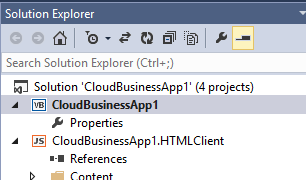

# Создание облачной бизнес-надстройки
С помощью шаблона "Облачная бизнес-надстройка" в Visual Studio можно создавать надстройки для SharePoint или SharePoint в Office 365, оптимизированные для добавления данных и управления ими.
 

 **Примечание.** Название "приложения для SharePoint" меняется на "надстройки SharePoint". Пока изменения не будут внесены полностью, в документации и пользовательском интерфейсе некоторых продуктов SharePoint и средств Visual Studio по-прежнему может встречаться термин "приложение". Дополнительные сведения см. в разделе [Новое название приложений для Office и SharePoint](new-name-for-apps-for-sharepoint#bk_newname).
 

 **Примечание.** Вы также можете создать надстройку SharePoint с помощью шаблона "Надстройка для SharePoint".
 

### Создание облачной бизнес-надстройки

1. В строке меню выберите пункты **Файл**, **Создать** и **Проект**.
    
    Откроется диалоговое окно **Создание проекта**.
    
 
2. В списке шаблонов разверните узел **Visual Basic** или **Visual C#**, затем выберите **Office/SharePoint** > **Надстройки** > **Облачная бизнес-надстройка**, как показано на рисунке 1.
    
    **Рис. 1. Шаблон "Облачная бизнес-надстройка"**

 

  
 

 

 
3. В текстовом поле **Имя** введите имя проекта и нажмите кнопку **ОК**.
    
    Откроется мастер **создания облачной бизнес-надстройки**.
    
 
4. В мастере **создания облачной бизнес-надстройки** введите URL-адрес вашего сервера SharePoint или сайта разработчика приложений для Office 365, как показано на рис. 2, а затем нажмите кнопку **Готово**.
    
    **Рис. 2. URL-адрес SharePoint**

 

  
 

    URL-адрес должен быть представлен в следующем виде: https://_MySite_.sharepoint.com/sites/Developer/.
    
    В обозреватель решений будет добавлено новое решение с четырьмя проектами: проектом верхнего уровня, проектом **HTMLClient**, проектом **Server** и проектом **SharePoint**.
    
 

### Изменение сайта для облачной бизнес-надстройки

1. В **обозревателе решений** откройте контекстное меню для узла проекта верхнего уровня и выберите пункт **Свойства**, как показано на рис. 3.
    
    **Рис. 3. Узел проекта верхнего уровня**

 

  
 

    Откроется конструктор приложений.
    
 
2. В конструкторе приложений выберите вкладку **SharePoint**, как показано на рис. 4.
    
    **Рис. 4. Вкладка SharePoint**

 

  
 

 

 
3. В списке **URL-адрес сайта** выберите существующий URL-адрес или введите URL-адрес вашего сервера SharePoint или сайта разработчика приложений для Office 365.
    
 
4. Нажмите кнопку **Проверить**, чтобы проверить URL-адрес.
    
 

## Дополнительные ресурсы

-  [Разработка облачных бизнес-надстроек](develop-cloud-business-add-ins)
    
 
-  [Создание облачных бизнес-надстроек](create-cloud-business-add-ins)
    
 

