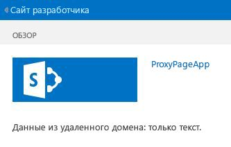

# <a name="create-a-custom-proxy-page-for-the-cross-domain-library-in-sharepoint"></a>Создание пользовательской страницы прокси для междоменной библиотеки в SharePoint
Узнайте, как создать пользовательскую страницу прокси для доступа к данным в удаленной службе с веб-страницы SharePoint, используя междоменную библиотеку в SharePoint. 
 

 **Примечание.** В настоящее время идет процесс замены названия "приложения для SharePoint" названием "надстройки SharePoint". Во время этого процесса в документации и пользовательском интерфейсе некоторых продуктов SharePoint и средств Visual Studio может по-прежнему использоваться термин "приложения для SharePoint". Дополнительные сведения см. в статье [Новое название приложений для Office и SharePoint](new-name-for-apps-for-sharepoint.md#bk_newname).
 

В процессе создания создании надстроек SharePoint обычно приходится использовать данные из различных источников. При этом из соображений безопасности применяются механизмы блокировки, которые препятствуют обмену данными с более чем одним доменом одновременно.
 

Вы можете использовать междоменную библиотеку для доступа к данным в удаленной надстройке, если реализуете настраиваемую прокси-страницу, размещенную в инфраструктуре удаленной надстройки. Как разработчик вы отвечаете за реализацию настраиваемой прокси-страницы и пользовательской логики, например, за механизм проверки подлинности для удаленной надстройки. Используйте междоменную библиотеку с настраиваемой прокси-страницей, если необходимо, чтобы взаимодействие происходило на уровне клиента.
 


## <a name="prerequisites-for-using-the-examples-in-this-article"></a>Компоненты, необходимые для использования примеров в этой статье
<a name="SP15Createcustomproxypage_Prereq"> </a>

Вам необходима среда разработки, описанная в статье [Приступая к созданию надстроек SharePoint, размещаемых у поставщика](get-started-creating-provider-hosted-sharepoint-add-ins.md).
 

 

### <a name="core-concepts-to-know-before-using-a-custom-proxy-page-with-sharepoint-add-ins"></a>Основные понятия, которые необходимо знать, прежде чем использовать настраиваемые страницы прокси совместно с надстройками SharePoint

В таблице ниже перечислены полезные статьи, с помощью которых вам будет проще разобраться с понятиями, используемыми в междоменных сценариях для надстроек SharePoint.
 

 

**Табл. 1. Основные понятия, необходимые для использования настраиваемой страницы прокси**


|**Название статьи**|**Описание**|
|:-----|:-----|
| [Надстройки SharePoint](sharepoint-add-ins.md)|Сведения о новой модели надстроек в SharePoint, с помощью которой можно создавать небольшие и удобные в использовании надстройки для пользователей.|
| [Безопасный доступ к данным и клиентские объектные модели для надстроек SharePoint](secure-data-access-and-client-object-models-for-sharepoint-add-ins.md)|Узнайте о параметрах доступа к данным в Надстройки SharePoint. В этой статье представлена информация об альтернативах высокого уровня при работе с данными в надстройке.|
| [Хост-сайты, сайты надстроек и компоненты SharePoint в SharePoint](host-webs-add-in-webs-and-sharepoint-components-in-sharepoint.md)|Узнайте, в чем разница между хост-сайтами и сайтами надстроек. Узнайте, какие компоненты SharePoint можно включить в Надстройка SharePoint, какие компоненты можно развернуть на хост-сайтах, а какие на сайтах надстроек, а также узнайте, как развертывать сайты надстроек в изолированном домене.|
| [Междоменная безопасность на стороне клиента](http://msdn.microsoft.com/ru-RU/library/cc709423%28v=vs.85%29.aspx)|Изучите междоменные угрозы и примеры использования, а также принципы безопасности для междоменных запросов, и оцените риски разработчиков, связанные с улучшением междоменного доступа из веб-приложений, которые запускаются в браузере.|

## <a name="code-example-access-remote-data-using-a-custom-proxy-page-for-the-cross-domain-library"></a>Пример кода: доступ к удаленным данным с помощью настраиваемой страницы прокси для междоменной библиотеки
<a name="SP15Createcustomproxypage_Codeexample"> </a>

Чтобы прочесть данные из удаленной службы, выполните указанные ниже действия. 
 

 

1. Создайте проект надстройки для SharePoint.
    
 
2. Измените манифест надстройки, чтобы разрешить связь с удаленной надстройкой.
    
 
3. Создать настраиваемую прокси-страницу и страницу контента в веб-проекте.
    
 
4. Создать страницу, которая использует междоменную библиотеку в проекте Надстройка SharePoint.
    
 

### <a name="to-create-the-sharepoint-add-in-project"></a>Создание проекта надстройки SharePoint


1. Откройте Visual Studio от имени администратора. (Для этого щелкните правой кнопкой мыши значок Visual Studio в меню **Пуск** и выберите пункт **Запуск от имени администратора**.)
    
 
2. Создайте надстройку SharePoint, размещаемую у поставщика, как описано в статье [Приступая к созданию надстроек SharePoint, размещаемых у поставщика](get-started-creating-provider-hosted-sharepoint-add-ins.md), и назовите ее ProxyPageApp. 
    
 

### <a name="to-edit-the-add-in-manifest-file"></a>Изменение файла манифеста надстройки


1. В **обозревателе решений** щелкните правой кнопкой мыши файл **AppManifest.xml** и выберите пункт **Просмотреть код**.
    
 
2. Замените весь элемент **AppPrincipal** указанным ниже фрагментом.
    
```XML
  <AppPrincipal>
    <Internal AllowedRemoteHostUrl="~remoteAppUrl"/>
</AppPrincipal>
```


     **Note**  The  **AllowedRemoteHostUrl** attribute is used to specify the remote domain. The **~remoteAppUrl** resolves to the remote add-in URL. For more information about tokens, see [Explore the app manifest structure and the package of a SharePoint Add-in](explore-the-app-manifest-structure-and-the-package-of-a-sharepoint-add-in.md).

### <a name="to-create-a-custom-proxy-page"></a>Создание настраиваемой страницы прокси


1. После создания решения Visual Studio щелкните правой кнопкой мыши проект веб-приложения (но не проект надстройки SharePoint) и добавьте новую веб-форму, последовательно выбрав пункты **Добавить** > **Новый элемент** > **Интернет** > **Веб-форма**. Присвойте форме имя Proxy.aspx.
    
 
2. В файле Proxy.aspx замените весь HTML-элемент и его дочерние элементы на следующий код HTML. Оставьте всю разметку над HTML-элементом без изменений. Код HTML содержит разметку и скрипт JavaScript, который выполняет следующие задачи:
    
      - Предоставляет заполнитель для файл междоменной библиотеки JavaScript.
    
 
  - Извлекает URL-адрес сайта надстройки из источника ссылки.
    
 
  - Динамически загружает файл JavaScript междоменной библиотеки в заполнитель.
    
 
  - Предоставляет параметры для объекта **RequestExecutorMessageProcessor**.
    
 
  - Инициализирует объект **RequestExecutorMessageProcessor**.
    
 

```HTML
  <html xmlns="http://www.w3.org/1999/xhtml">
<head runat="server">
    <meta http-equiv="X-UA-Compatible" content="IE=8" /> 
    <title>Custom Proxy Host Page</title>
    <script 
        src="http://ajax.aspnetcdn.com/ajax/4.0/1/MicrosoftAjax.js" 
        type="text/javascript">
    </script>
    <script 
        type="text/javascript" 
        src="http://ajax.aspnetcdn.com/ajax/jQuery/jquery-1.7.2.min.js">
    </script>

    <!-- Script to load the cross-domain library js file -->
    <script type="text/javascript">
        var hostweburl;

        $(document).ready(function(){
            //Get the URI decoded host web URL.
            hostweburl =
                decodeURIComponent(
                    getQueryStringParameter("SPHostUrl")
            );

            // The cross-domain js file is in a URL in the form:
            // host_web_url/_layouts/15/SP.RequestExecutor.js
            var scriptbase = hostweburl + "/_layouts/15/";

            // Load the js file 
            $.getScript(scriptbase + "SP.RequestExecutor.js", initCustomProxy);
        });

        //Function to initialize the custom proxy page
        //  must set the appropriate settings and implement
        //  proper authentication mechanism
        function initCustomProxy() {
            var settings =
            {
                originAuthorityValidator: function (messageOriginAuthority) {
                    // This page must implement the authentication for the
                    //   remote add-in.
                       // You should validate if messageOriginAuthority is
                       //  an approved domain to receive calls from.
                    return true;
                }
            };
            SP.RequestExecutorMessageProcessor.init(settings);
        }

        // Function to retrieve a query string value.
        // For production purposes you may want to use
        //  a library to handle the query string.
        function getQueryStringParameter(paramToRetrieve) {
            var params =
                document.URL.split("?")[1].split("&amp;");
            var strParams = "";
            for (var i = 0; i < params.length; i = i + 1) {
                var singleParam = params[i].split("=");
                if (singleParam[0] == paramToRetrieve)
                    return singleParam[1];
            }
        }
    </script>
</head>
<body>
    
</body>
</html>


```


     **Important**  In a production SharePoint Add-in, you must provide the authorization logic and return the appropriate value in the  **originAuthorityValidator** object in settings.

### <a name="to-create-a-content-page"></a>Создание страницы содержимого


1. Щелкните правой кнопкой мыши проект веб-приложения в **обозревателе решений** и добавьте новую веб-форму, последовательно выбрав пункты **Добавить** > **Новый элемент** > **Интернет** > **Веб-форма**. Присвойте форме имя Content.aspx.
    
 
2. Скопируйте указанный ниже код и вставьте его в метод **Page_Load** в файле с выделенным кодом. Этот код выполняет указанные ниже задачи.
    
      - Задает в качестве выходного **типа контента** **текст или обычный текст**.
    
 
  - Записывает контент в выходной буфер.
    
 
  - Завершает подключение.
    
 

```C#
  string content;
content = "Just some text.";
Response.ContentType="text/plain";
Response.Write(content);
Response.End();

```


### <a name="to-create-a-sharepoint-webpage-that-uses-the-cross-domain-library"></a>Создание веб-страницы SharePoint, использующей междоменную библиотеку


1. Щелкните правой кнопкой мыши проект надстройки SharePoint и последовательно выберите пункты **Добавить** > **Новый элемент** > **Office и SharePoint** > **Модуль**.
    
 
2. Присвойте модулю имя Pages и нажмите кнопку **Добавить**.
    
 
3. Щелкните папку **Pages** правой кнопкой мыши и последовательно выберите пункты **Добавить** > **Новый элемент**>  **Office и SharePoint** > **Страница**. 
    
 
4. Задайте для страницы имя Home.aspx и нажмите кнопку **Добавить**.
    
 
5. Если страница **Home.aspx** не открылась автоматически, откройте ее.
    
 
6. Скопируйте указанный ниже код и вставьте его в тег контента **PlaceHolderMain**.
    
```
  <!-- The page dynamically loads the cross-domain library's
    js file, rescript acts as the placeholder. -->
<script 
    type="text/javascript"
    id="rescript"
    src="../_layouts/15/SP.RequestExecutor.js">
</script>
    Data from the remote domain: <span id="TextData"></span>

    <!-- Main script to retrieve the host web's title -->
    <script type="text/javascript">
    (function () {
        var executor;
        var hostweburl;
        var remotedomain;

        remotedomain = "<your_remote_add-in_domain>";

        //Get the URI decoded host web URL.
        hostweburl =
            decodeURIComponent(
                getQueryStringParameter("SPHostUrl")
        );

        // Initialize the RequestExecutor with the custom proxy URL.
        executor = new SP.RequestExecutor(remotedomain);
        executor.iFrameSourceUrl = "Proxy.aspx?SPHostUrl=" + hostweburl;

        // Issue the call against the remote endpoint.
        // The response formats the data in plain text.
        // The functions successHandler and errorHandler attend the
        //      sucess and error events respectively.
        executor.executeAsync(
            {
                url:
                    remotedomain + "Content.aspx",
                method: "GET",
                headers: { "Accept": "text/plain" },
                success: successHandler,
                error: errorHandler
            }
        );
    })();

    // Function to handle the success event.
    // Prints the data to the placeholder.
    function successHandler(data) {
        document.getElementById("TextData").innerText =
            data.body;
    }

    // Function to handle the error event.
    // Prints the error message to the page.
    function errorHandler(data, errorCode, errorMessage) {
        document.getElementById("TextData").innerText =
            "Could not complete cross-domain call: " + errorMessage;
    }

    // Function to retrieve a query string value.
    // For production purposes you may want to use
    //  a library to handle the query string.
    function getQueryStringParameter(paramToRetrieve) {
        var params =
            document.URL.split("?")[1].split("&amp;");
        var strParams = "";
        for (var i = 0; i < params.length; i = i + 1) {
            var singleParam = params[i].split("=");
            if (singleParam[0] == paramToRetrieve)
                return singleParam[1];
        }
    }
    </script>

```

7. В ранее вставленном вами фрагменте кода найдите строку `remotedomain = "<your_remote_add-in_domain>";` и замените заполнитель _<домен_вашей_удаленной_надстройки>_ URL-адресом localhost, который ваше веб-приложение использует, когда вы запускаете надстройку клавишей F5 в Visual Studio. Чтобы найти это значение, выберите проект веб-приложения в **обозревателе решений**. Свойство **URL** находится в области **Свойства**. Используйте это значение целиком, включая протокол, порт и закрывающий символ косой черты, например http://localhost:45072.
    
 
8. Сохраните и закройте файл.
    
 
9. Откройте файл appmanifest.xml и задайте для параметра **Start page** (Начальная страница) значение **ProxyPageApp/Pages/Home.aspx**.
    
 

### <a name="to-build-and-run-the-solution"></a>Сборка и запуск решения


1. Убедитесь, что проект Надстройка SharePoint выбран как запускаемый проект.
    
 
2. Нажмите клавишу F5.
    
     **Примечание.** При нажатии клавиши F5 Visual Studio выполняет сборку решения, развертывает надстройку и открывает для нее страницу разрешений.
3. Нажмите кнопку **Доверять**.
    
    Откроется домашняя страница, которая должна выглядеть следующим образом. Может потребоваться несколько секунд, чтобы появилась фраза "Just some text", так как она извлекается со страницы Content.aspx удаленного домена.
    

    **Данные из удаленной службы на веб-странице SharePoint**

 

  
 

 

 

**Табл. 2. Поиск и устранение неполадок в решении**


|**Проблема**|**Решение**|
|:-----|:-----|
|Visual Studio не открывает браузер после нажатия клавиши F5.|Настройте проект надстройки SharePoint в качестве запускаемого проекта.|
|Необработанное исключение **Не определен указатель стека**.|Убедитесь, что у вас есть доступ к файлу SP.RequestExecutor.js в окне браузера.|

## <a name="next-steps"></a>Дальнейшие действия
<a name="SP15Createcustomproxypage_Nextsteps"> </a>

В этой статье показано, как получить доступ к удаленным данным с помощью настраиваемой прокси-страницы для междоменной библиотеки в SharePoint. На следующем этапе вы можете узнать о других вариантах доступа к данным, доступным в Надстройки SharePoint. Дополнительные сведения см. в следующих ресурсах:
 

 

-  [Пример кода: получение данных с помощью страницы прокси для междоменной библиотеки](http://code.msdn.microsoft.com/SharePoint-Get-data-10039ff1)
    
 
-  [Доступ к данным SharePoint из надстроек с помощью междоменной библиотеки](access-sharepoint-data-from-add-ins-using-the-cross-domain-library.md)
    
 
-  [Отправка запросов удаленной службе с помощью веб-прокси в SharePoint](query-a-remote-service-using-the-web-proxy-in-sharepoint.md)
    
 

## <a name="additional-resources"></a>Дополнительные ресурсы
<a name="SP15Createcustomproxypage_Addresources"> </a>


-  [Настройка локальной среды разработки надстроек SharePoint](set-up-an-on-premises-development-environment-for-sharepoint-add-ins.md)
    
 
-  [Работа с внешними данными в SharePoint](work-with-external-data-in-sharepoint.md)
    
 
-  [Безопасный доступ к данным и клиентские объектные модели для надстроек SharePoint](secure-data-access-and-client-object-models-for-sharepoint-add-ins.md)
    
 
-  [Авторизация и проверка подлинности для надстроек в SharePoint](authorization-and-authentication-of-sharepoint-add-ins.md)
    
 
-  [Использование операций запросов OData в запросах REST SharePoint](use-odata-query-operations-in-sharepoint-rest-requests.md)
    
 
-  [Что следует рассмотреть, прежде чем приступать к разработке надстроек SharePoint](three-ways-to-think-about-design-options-for-sharepoint-add-ins.md)
    
 
-  [Важные аспекты разработки и архитектуры для надстроек SharePoint](important-aspects-of-the-sharepoint-add-in-architecture-and-development-landscap.md)
    
 
-  [Хранение данных в надстройках SharePoint](important-aspects-of-the-sharepoint-add-in-architecture-and-development-landscap.md#Data)
    
 

