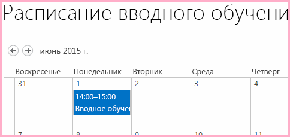

# Создание собственной кнопки ленты на хост-сайте надстройки SharePointCreate a custom ribbon button in the host web of a SharePoint Add-in

Это девятая часть серии статей, посвященной основам разработки надстроек SharePoint, размещаемых в SharePoint. Для начала вам следует ознакомиться со статьей [Надстройки SharePoint](sharepoint-add-ins.md) и предыдущими статьями этой серии, представленными в разделе [Знакомство с созданием надстроек SharePoint, размещаемых в SharePoint](get-started-creating-sharepoint-hosted-sharepoint-add-ins.md#Nextsteps).This is the ninth in a series of articles about the basics of developing SharePoint-hosted SharePoint Add-ins. You should first be familiar with [SharePoint Add-ins](sharepoint-add-ins.md) and the previous articles in this series: 
    
> [!NOTE]
> Если вы изучали предыдущие статьи этой серии о надстройках, размещаемых в SharePoint, то у вас уже есть решение для Visual Studio, которое можно использовать для работы с этой статьей.If you have been working through this series about SharePoint-hosted add-ins, you have a Visual Studio solution that you can use to continue with this topic. Кроме того, вы можете скачать репозиторий на веб-странице [SharePoint_SP-hosted_Add-Ins_Tutorials](https://github.com/OfficeDev/SharePoint_SP-hosted_Add-Ins_Tutorials) и открыть файл BeforeRibbon.sln.You can also download the repository at [SharePoint_SP-hosted_Add-Ins_Tutorials](https://github.com/OfficeDev/SharePoint_SP-hosted_Add-Ins_Tutorials) and open the BeforeRibbon.sln file.

Все надстройки SharePoint можно запускать со страницы **Содержимое сайта** на хост-сайте, выбрав плитку надстройки.All SharePoint Add-ins can be run from the **Site Contents** page of the host web by selecting the add-in's tile. Функциональность надстройки SharePoint также может быть представлена на хост-сайте посредством дополнительных действий, а именно настраиваемых кнопок ленты или элементов меню.The functionality of a SharePoint Add-in can also be exposed on the host web through custom actions, which are custom ribbon buttons or custom menu items. В этой статье описано добавление кнопки на ленту хост-сайта.In this article you add a button to the ribbon on a host web.

## Подготовка хост-сайтаPrepare the host web

Ниже показано, как добавить кнопку на ленту календаря на хост-сайте. В пользовательском интерфейсе сайта разработчика SharePoint выполните указанные ниже действия.To add the button to the ribbon of a calendar on the host web, take the following steps in the UI of your SharePoint developer site.

1. На домашней странице сайта выберите пункты **Содержимое сайта** > **Добавить надстройку** > **Календарь**.From the home page of the site, select **Site Contents** > **add and add-in** > **Calendar**.

2. В диалоговом окне **Добавление календаря** введите **Employee Orientation Schedule** (Расписание адаптации сотрудников) в поле **Имя**, а затем нажмите кнопку **Создать**.In the **Adding Calendar** dialog, for the **Name**, enter **Employee Orientation Schedule**, and then select **Create**.

3. Когда откроется календарь, наведите курсор на любую дату, чтобы на ней появилась ссылка **Добавить**, и перейдите по ссылке **Добавить**.When the calendar opens, put the cursor on any date until the **Add** link appears on the date, and then select **Add**. 

4. В диалоговом окне **Расписание обучения сотрудников: новый элемент** в поле **Название** введите **Orient Cassi Hicks** (Адаптация пользователя Cassie Hicks).In the **Employee Orientation Schedule - New Item** dialog, for the **Title**, enter **Orient Cassi Hicks**. В остальных полях оставьте значения, используемые по умолчанию, и нажмите кнопку **Сохранить**.Leave the other fields at their defaults, and then select **Save**.
    
   Календарь должен выглядеть примерно так:The calendar should look similar to the following:

   *Рис. 1. Настраиваемый календарь**Figure 1. Custom calendar*

   

> [!IMPORTANT]
> Для выполнения приведенной ниже процедуры необходимо, чтобы в пользовательском интерфейсе Visual Studio был виден календарь. Однако если при создании календаря Visual Studio была открыта, календарь не будет отображаться.The next procedure requires that the calendar be visible in the UI of Visual Studio, but it won't be if Visual Studio was open when you created the calendar. Прежде чем продолжить, выйдите из Visual Studio и закройте все окна браузера и консоли PowerShell, с которых вы вошли на сайт разработчика.Before you continue, close Visual Studio, and sign out of any browser windows and PowerShell consoles where you are signed in to your developer site.

## Добавление дополнительного действия на лентеAdd a ribbon custom action

1. В **обозревателе решений** щелкните правой кнопкой мыши проект **EmployeeOrientation** и выберите **Добавить** > **Новый элемент** > **Office/SharePoint** > **Дополнительное действие ленты**.In **Solution Explorer**, right-click the **EmployeeOrientation** project, and select **Add** > **New Item** > **Office/SharePoint** > **Ribbon Custom Action**. Присвойте новому элементу имя **RunOrientationAdd-in** и нажмите кнопку **Добавить**.Name it **RunOrientationAdd-in**, and then select **Add**.

2. Мастер создания дополнительного действия для ленты задаст вам несколько вопросов.The Create Custom Action for Ribbon Wizard asks you a series of questions. Ответьте на них, используя таблицу ниже, и нажмите кнопку **Готово**.Give the answers from the following table, and then select **Finish**. 

    |**Вопрос для свойства****Property question**|**Ответ****Answer**|
    |:-----|:-----|
    |Где вы хотите разместить дополнительное действие?Where do you want to expose the custom action?|Выберите вариант **хост-сайт**.Select **Host Web**.|
    |К какой области относится дополнительное действие?Where is the custom action scoped to?|Выберите вариант **Экземпляр списка** (*не* "Шаблон списка").Select **List Instance** (*not* List Template).|
    |К какому элементу относится дополнительное действие?Which particular item is the custom action scoped to?|Выберите вариант **Employee Orientation Schedule** (Расписание адаптации сотрудников).Select **Employee Orientation Schedule**.|
    |Где находится элемент управления?Where is the control located?|Не используйте варианты из раскрывающегося списка.Do not use the drop-down selections. Вместо этого введите `Ribbon.Calendar.Events.Actions.Controls._children`.Instead, enter `Ribbon.Calendar.Events.Actions.Controls._children`. (Третий компонент, **Events**, идентифицирует вкладку ленты, а четвертая часть, **Actions**, — группу кнопок.)(The third part, **Events**, identifies the tab of the ribbon, and the fourth part, **Actions**, identifies the button group.)|
    |Какой текст указан в элементе меню?What is the text on the menu item?|Введите **Employee Orientation** (Адаптация сотрудников).Enter **Employee Orientation**.|
    |Куда ведет дополнительное действие?Where does the custom action navigate to?|Не используйте варианты из раскрывающегося списка.Do not use the drop-down selections. Вместо этого введите `~appWebUrl/Lists/NewEmployeesInSeattle`.Instead, enter  `~appWebUrl/Lists/NewEmployeesInSeattle`. Это страница представления списка, который находится на сайте надстройки, поэтому кнопка на ленте хост-сайта открывает страницу на сайте надстройки.This is the list view page for the list, which is on the add-in web, so the ribbon button on the host web opens a page on the add-in web.|

## Проверка компонента сайта надстройкиInspect the add-in web feature

В **обозревателе решений** разверните узел **Компоненты** и выберите компонент **NewEmployeeOrientationComponents**.In **Solution Explorer**, expand the **Features** folder, and select the **NewEmployeeOrientationComponents** feature. Откроется конструктор компонентов.The Feature designer opens.

Обратите внимание, что созданное вами дополнительное действие **RunOrientationAdd-in** находится в списке **Элементы в решении**, а не в списке **Элементы в компоненте**.Notice that the custom action that you created, **RunOrientationAdd-in**, is listed in **Items in the solution**, but not in **Items in the feature**. Это связано с тем, что этот компонент развернут на сайте надстройки, а ваше дополнительное действие — на хост-сайте.This is because the feature is deployed to the add-in web, but your custom action is deployed to the host web. 

Когда создаете пакет надстройки в Visual Studio для развертывания в рабочей среде или нажимаете клавишу F5 в Visual Studio, пакет Инструменты разработчика Microsoft Office для Visual Studio создает особый компонент хост-сайта, добавляет в него дополнительное действие и развертывает его на хост-сайте.When you package the add-in in Visual Studio for deployment to production, or when you select F5 in Visual Studio, the Office Developer Tools for Visual Studio creates a special host web feature, adds the custom action to it, and deploys it to the host web. Ни в коем случае не следует изменять компонент хост-сайта. Именно поэтому он не будет создан до момента формирования пакета.You should never edit the host web feature; that is why it is not created until packaging time.

*Рис. 2. Конструктор компонентов**Figure 2. Feature designer*

## Запуск и тестирование надстройкиRun and test the add-in

1. Нажмите клавишу F5, чтобы развернуть и запустить надстройку. Visual Studio выполнит временную установку надстройки на тестовом сайте SharePoint и сразу же запустит ее.Use the F5 key to deploy and run your add-in. Visual Studio makes a temporary installation of the add-in on your test SharePoint site and immediately runs the add-in. 

2. Откроется страница надстройки SharePoint по умолчанию.The default page of the SharePoint Add-in opens. Перейдите на начальную страницу сайта разработчика (т. е. хост-сайта).Go to the home page of your developer site (which is the host web). Ссылка на него расположена в левом верхнем углу страницы.There is a breadcrumb link to it in the upper-left corner of the page.

3. На домашней странице хост-сайта щелкните **Содержимое сайта**, а затем на странице **Содержимое сайта** выберите календарь **Employee Orientation Schedule** (Расписание адаптации сотрудников). Обратите внимание, что надстройку **Employee Orientation** (Адаптация сотрудников) выбирать не надо.On the host web's home page, select **Site Contents**, and on the **Site Contents** page, select the **Employee Orientation Schedule** calendar (not the **Employee Orientation** add-in).

4. Когда календарь откроется, выберите событие **Orient Cassie Hicks** (Адаптация пользователя Cassie Hicks).When the calendar opens, select the event **Orient Cassie Hicks**. Если вкладка **События** на ленте не открылась автоматически, откройте ее.If the **Events** tab on the ribbon doesn't open automatically, open it. Она должна выглядеть примерно так, как показано ниже.It should look similar to the following:
    
   *Рис. 3. Вкладка ленты "События" с настраиваемой кнопкой**Figure 3. Events ribbon tab with custom button*

   

5. В группе **Действия** на ленте выберите элемент **Employee Orientation** (Адаптация сотрудников).In the **Actions** group on the ribbon, select **Employee Orientation**. Откроется представление списка **New Employees in Seattle** (Новые сотрудники в Сиэтле).The list view page for **New Employees in Seattle** opens.

6. Чтобы завершить сеанс отладки, закройте окно браузера или остановите отладку в Visual Studio.To end the debugging session, close the browser window or stop debugging in Visual Studio. При каждом нажатии клавиши F5 Visual Studio будет отзывать предыдущую версию надстройки и устанавливать последнюю.Each time that you select F5, Visual Studio will retract the previous version of the add-in and install the latest one.

7. Вы будете работать с этой надстройкой и решением Visual Studio при изучении других статей, поэтому при перерывах в работе рекомендуется отзывать надстройку.You will work with this add-in and Visual Studio solution in other articles, and it's a good practice to retract the add-in one last time when you are done working with it for a while. В **обозревателе решений** щелкните проект правой кнопкой мыши и выберите пункт **Отозвать**.Right-click the project in **Solution Explorer** and select **Retract**.

## Дальнейшие действияNext steps

Из следующей статьи этой серии вы узнаете, как добавить JavaScript в надстройку SharePoint и получить доступ к данным SharePoint с помощью объектной модели JavaScript для SharePoint. Название этой статьи: [Использование API JavaScript для SharePoint для работы с данными SharePoint](use-the-sharepoint-javascript-apis-to-work-with-sharepoint-data.md).In the next article in this series, you'll add JavaScript to the SharePoint Add-in and access SharePoint data with SharePoint's JavaScript object model: [Use the SharePoint JavaScript APIs to work with SharePoint data](use-the-sharepoint-javascript-apis-to-work-with-sharepoint-data.md).
 

 

