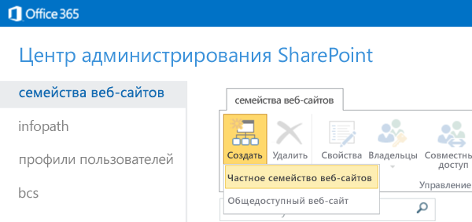

# Создание сайта разработчика с использованием актуальной подписки на Office 365Create a developer site on an existing Office 365 subscription

Настроив сайт разработчика Office 365, вы можете быстро приступить к созданию, тестированию и развертыванию надстроек Office и SharePoint.An Office 365 Developer Site makes it easier to get set up and start creating, testing, and deploying your Office and SharePoint Add-ins more quickly. Многие подписки на Office 365 бизнес, Office 365 корпоративный, Office 365 для образования и Office 365 для государственных организаций включают шаблон для создания сайта разработчика.Many Office 365 Business, Enterprise, Education, and Government subscriptions include a site template that you can use to create a Developer Site.

### Перед началом работыBefore you start

**Убедитесь, что ваша подписка на Office 365 поддерживает сайт разработчика.** Если у вас есть один из указанных ниже планов подписки на Office 365, можно создать сайт разработчика, используя текущую подписку.**Be sure you have an Office 365 subscription that supports a Developer Site.** If you have one of the following Office 365 subscription plans, you can create a Developer Site within your existing subscription:
    
- Office 365 для среднего бизнеса.Office 365 Midsize Business
- Office 365 корпоративный E1, E3, E4, E5 или K1.Office 365 Enterprise E1, E3, E4, E5, or K1
- Office 365 для образовательных учреждений A2, A3 или A4.Office 365 Education A2, A3, or A4
- Office 365 для государственных учреждений G1, G3, G4 или K1.Office 365 Government G1, G3, G4, or K1

**Если у вас есть подписка на Office 365 для малого бизнеса**, то доступно только одно семейство веб-сайтов, поэтому создать семейство сайтов разработчиков невозможно.**If you have an Office 365 Small Business subscription,** it supports only a single site collection, so you can't create a Developer Site collection. Дополнительные сведения о планах Office 365 для бизнеса см. в статье [Ограничения SharePoint Online](http://office.microsoft.com/ru-RU/office365-sharepoint-online-enterprise-help/sharepoint-online-software-boundaries-and-limits-HA102694293.aspx).If you would like to learn more about Office 365 plans for your business, see [SharePoint Online: software boundaries and limits](http://office.microsoft.com/ru-RU/office365-sharepoint-online-enterprise-help/sharepoint-online-software-boundaries-and-limits-HA102694293.aspx).
    
Дополнительные сведения о подписках на Office 365 корпоративный см. на странице [тарифных планов и цен](http://products.office.com/ru-RU/business/office-365-enterprise-e1-business-software).For more information about the Office 365 Enterprise offerings, see [Plans &amp; Pricing](http://products.office.com/ru-RU/business/office-365-enterprise-e1-business-software).

## Создание сайта разработчикаCreate a Developer Site

1. Войдите в Office 365 в качестве глобального администратора или администратора SharePoint Online.Sign in to Office 365 as a Global or SharePoint Online admin.
    
   **Необходимо войти от имени администратора SharePoint Online или глобального администратора, чтобы создавать семейства веб-сайтов,** такие как сайт разработчика.**You must sign in as a Global or SharePoint Online admin to create new site collections,** such as a Developer Site. Только администраторам доступны параметры администрирования при входе в Office 365.Only admins can see Admin options when signing in to Office 365. Если вы не являетесь администратором, обратитесь к администратору компании и попросите его выполнить одно из указанных ниже действий.If you're not an admin, contact an admin in your company and have them do one of the following:
    
   - Предоставить вам права администратора, чтобы вы могли самостоятельно создать сайт разработчика.Grant you admin rights, so you can create the Developer Site yourself.
   - Создать сайт разработчиков и указать вас как администратора семейства веб-сайтов.Create the Developer Site for you, and specify you as an admin for the site collection.

2. Нажмите кнопку средства запуска приложений у левого края панели навигации вверху страницы.Select the App Launcher button on the far left of the navigation bar at the top of the page.

3. Выберите плитку **Администратор**.Select the **Admin** tile.

4. В дереве переходов слева разверните раздел **Администратор** и выберите пункт **SharePoint**.In the navigation tree on the left, expand **Admin**, and then select **SharePoint**.

5. В **Центре администрирования SharePoint** на вкладке **Семейства веб-сайтов** нажмите **Создать** > **Частное семейство веб-сайтов**.In the **SharePoint admin center**, on the **Site Collections** tab, select **New** > **Private Site Collection**.

   

6. В диалоговом окне **Создание семейства веб-сайтов** введите информацию о своем сайте разработчика.In the **New Site Collection** dialog box, provide information about your Developer Site.
    
   |**Поле****Field**|**Значение****Value**|
   |:-----|:-----|
   |**Название****Title**|Название, которое вы собираетесь присвоить своему сайту разработчика.The name you want to give your Developer Site.|
   |Список **Адрес общедоступного веб-сайта**.**Public Website Address** list|Доменное имя и путь URL-адреса (**/sites/** или **/teams/**), за которымA domain name and a URL path—either **/sites/** or **/teams/**—and then следует имя URL-адреса для семейства веб-сайтов.type a URL name for the site collection.|
   |Список **Выберите язык** в разделе **Выбор шаблона****Select a language** list in the **Template Selection** section|Основной язык вашего сайта разработчика.A primary language to use for your Developer Site. *Выберите подходящий язык для семейства веб-сайтов сайта разработчика, так как вы не сможете его изменить.**Be sure to select the appropriate language for the Developer Site site collection, because once you choose it, it can't be changed.* Выбор языка для сайта разработчика не влияет на выбор языков, который будет доступен в ваших надстройках Office и SharePoint.Selecting a language for your Developer Site does not affect the languages you can make available in your Office and SharePoint Add-ins. Вы сможете включить многоязычный интерфейс SharePoint на своих сайтах, но основным языком этого семейства веб-сайтов будет выбранный в этом поле.You can enable the SharePoint multiple language interface on your sites, but the primary language for the site collection is the one you choose here.|
   |Вкладка **Совместная работа** в подразделе **Выберите шаблон** раздела **Выбор шаблона****Template Selection** section, on the **Collaboration** tab under **Select a template**|Выберите **Сайт разработчика**.Select **Developer Site.**|
   |**Часовой пояс****Time Zone**|Часовой пояс, который соответствует локали вашего сайта разработчика.Time zone that's appropriate for the locale of your Developer Site.|
   |**Администратор****Administrator**|Имя пользователя администратора вашего семейства веб-сайтов.The user name of your site collection administrator.|
   |**Квота хранилища****Storage Quota**|Место в мегабайтах (МБ), которое вы хотите выделить для этого семейства веб-сайтов сайта разработчика.Number of megabytes (MB) you want to allocate to this Developer Site site collection.|
   |**Квота ресурсов сервера****Server Resource Quota**|Объем ресурсов, выделяемый для семейства веб-сайтов.The amount of resources to allocate to the site collection. В этом значении объединяются метрики производительности (например, время использования процессора и необработанные исключения), относящиеся к коду в изолированных решениях.This number is a combination of performance metrics (such as processor time and unhandled exceptions) that pertain to code in sandboxed solutions. Если указанный уровень превышает дневную квоту, "песочница" для этого семейства веб-сайтов будет отключена.When the level exceeds a daily quota, the sandbox is turned off for this site collection.|

7. Нажмите кнопку **ОК**.Select **OK**. URL-адрес нового сайта разработчика появится в списке **Семейства веб-сайтов**.You'll see the new developer site URL in the **Site Collections** list. После создания сайта вы можете перейти по URL-адресу, чтобы открыть сайт разработчика.When the site creation is finished, you can go to the URL to open your Developer Site.

   
 
## См. такжеSee also

-  [Надстройки SharePointSharePoint Add-ins](sharepoint-add-ins.md)
-  [Создание и удаление семейства веб-сайтовCreate or delete a site collection](http://office.microsoft.com/en-us/office365-sharepoint-online-enterprise-help/create-or-delete-a-site-collection-HA102772354.aspx?CTT=1)
    
 

