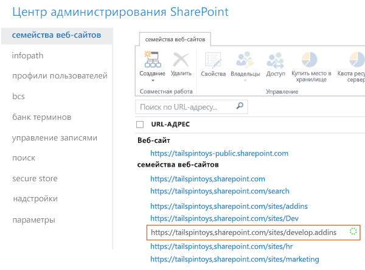

# Создание сайта разработчика с использованием имеющейся подписки на Office 365

Настроив сайт разработчика Office 365, вы можете быстро приступить к созданию, тестированию и развертыванию надстроек Office и SharePoint. Многие подписки на Office 365 бизнес, Office 365 корпоративный, Office 365 для образования и Office 365 для государственных организаций включают шаблон для создания сайта разработчика.

### Перед началом работы

**Убедитесь, что ваша подписка на Office 365 поддерживает Сайт разработчика.** Если у вас есть один из указанных ниже планов подписки на Office 365, можно создать Сайт разработчиков, используя текущую подписку.
    
- Office 365 для среднего бизнеса.
- Office 365 корпоративный E1, E3, E4, E5 или K1.
- Office 365 для образовательных учреждений A2, A3 или A4.
- Office 365 для государственных учреждений G1, G3, G4 или K1.

**Если у вас есть подписка на Office 365 для малого бизнеса**, то доступно только одно семейство веб-сайтов, поэтому создать коллекцию сайтов разработчиков невозможно. Дополнительные сведения о планах Office 365 для бизнеса см. в статье [Ограничения SharePoint Online](http://office.microsoft.com/ru-RU/office365-sharepoint-online-enterprise-help/sharepoint-online-software-boundaries-and-limits-HA102694293.aspx).
    
Дополнительные сведения о подписках на Office 365 корпоративный см. на странице [тарифных планов и цен](http://products.office.com/ru-RU/business/office-365-enterprise-e1-business-software).

## Создание сайта разработчика

1. Войдите в Office 365 в качестве глобального администратора или администратора SharePoint Online.
    
   **Необходимо войти от имени администратора SharePoint Online или глобального администратора, чтобы создавать семейства веб-сайтов,** такие как сайт разработчика. Только администраторам доступны параметры администрирования при входе в Office 365. Если вы не являетесь администратором, обратитесь к администратору компании и попросите его выполнить одно из указанных ниже действий.
    
   - Предоставить вам права администратора, чтобы вы могли самостоятельно создать сайт разработчика.
   - Создать сайт разработчиков и указать вас как администратора семейства веб-сайтов.

2. Нажмите кнопку средства запуска приложений у левого края панели навигации вверху страницы.

3. Выберите плитку **Администратор**.

4. В дереве переходов слева разверните раздел **Администратор** и выберите пункт **SharePoint**.

5. В **Центре администрирования SharePoint** на вкладке **Семейства веб-сайтов** нажмите **Создать** > **Частное семейство веб-сайтов**.
  
   *Рис. 1. Пункт создания семейства веб-сайтов в Центре администрирования SharePoint*

   

6. В диалоговом окне **Создание семейства веб-сайтов** введите информацию о своем сайте разработчика.
    
   |**Поле**|**Значение**|
   |:-----|:-----|
   |**Название**|Название, которое вы собираетесь присвоить своему Сайту разработчика.|
   |Список **Адрес общедоступного веб-сайта**.|Доменное имя и путь URL-адреса (**/sites/** или **/teams/**), за которым следует имя URL-адреса для семейства веб-сайтов.|
   |Список **Выберите язык** в разделе **Выбор шаблона**|Основной язык вашего Сайта разработчика. *Убедитесь в выборе нужного языка для семейства веб-сайтов Сайта разработчика, так как вы не сможете его изменить.* Выбор языка для Сайта разработчика не влияет на выбор языков, который будет доступен в ваших надстройках для Office и SharePoint. Вы сможете включить многоязычный интерфейс SharePoint на своих сайтах, но основным языком этого семейства веб-сайтов будет выбранный в этом поле.|
   |Вкладка **Совместная работа** в подразделе **Выберите шаблон** раздела **Выбор шаблона**|Выберите **Сайт разработчика**.|
   |**Часовой пояс**|Часовой пояс, который соответствует локали вашего Сайта разработчика.|
   |**Администратор**|Имя пользователя администратора вашего семейства веб-сайтов.|
   |**Квота хранилища**|Место в мегабайтах (МБ), которое вы хотите выделить для этого семейства веб-сайтов Сайта разработчика.|
   |**Квота ресурсов сервера**|Объем ресурсов, выделяемый для семейства веб-сайтов. В этом значении объединяются метрики производительности (например, время использования процессора и необработанные исключения), относящиеся к коду в изолированных решениях. Если указанный уровень превышает дневную квоту, "песочница" для этого семейства веб-сайтов будет отключена.|

7. Нажмите кнопку **ОК**. URL-адрес нового сайта разработчика появится в списке **Семейства веб-сайтов**. По завершении создания сайта вы можете перейти по URL-адресу, чтобы открыть сайт разработчика.
    
   *Рис. 2. Подготовка нового семейства веб-сайтов*

   
 
## Дополнительные ресурсы

-  [Надстройки SharePoint](sharepoint-add-ins.md)
-  [Создание и удаление семейства веб-сайтов](http://office.microsoft.com/en-us/office365-sharepoint-online-enterprise-help/create-or-delete-a-site-collection-HA102772354.aspx?CTT=1)
    
 

