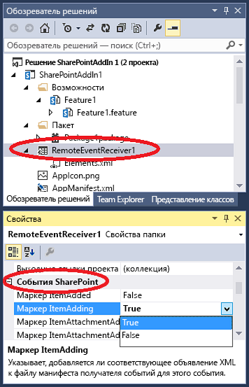

# <a name="create-a-remote-event-receiver-in-sharepoint-add-ins"></a>Создание удаленного приемника событий в надстройках SharePoint
Создание удаленного приемника событий, обрабатывающего события списка и элементов списка в надстройке SharePoint.
 

 **Примечание.** В настоящее время идет процесс замены названия "приложения для SharePoint" названием "надстройки SharePoint". Во время этого процесса в документации и пользовательском интерфейсе некоторых продуктов SharePoint и средств Visual Studio может по-прежнему использоваться термин "приложения для SharePoint". Дополнительные сведения см. в статье [Новое название приложений для Office и SharePoint](new-name-for-apps-for-sharepoint.md#bk_newname).
 


## <a name="prerequisites"></a>Необходимые компоненты
<a name="SP15appevent_prereq"> </a>

Для начала желательно иметь представление о надстройках Надстройки SharePoint с размещением у поставщика, а также разработать несколько надстроек, которые были бы хоть немного сложнее, чем "Hello World". Кроме того, следует ознакомиться со статьей  [Обработка событий в надстройках SharePoint](handle-events-in-sharepoint-add-ins.md). 
 

 

## <a name="create-a-remote-event-receiver"></a>Создание удаленного приемника событий
<a name="MakeRER"> </a>

В этой статье показано, как усовершенствовать Надстройка SharePoint, добавив удаленный приемник событий (RER), который обрабатывает событие ItemAdded для пользовательского списка на сайте надстройки. Удаленный приемник событий регистрируется на сайте надстройки с помощью декларативной разметки. (Удаленные приемники событий регистрируются на  *хост-сайте*  программно. Соответствующий пример кода см. в статье [OfficeDev/PnP/Samples/Core.EventReceivers](https://github.com/OfficeDev/PnP/tree/master/Samples/Core.EventReceivers).)
 

 
Приемник удаленных событий должен быть веб-службой SOAP. В этом примере он реализован как служба Windows Communication Foundation (WCF). Но его возможно реализовать в стеке не от Майкрософт.
 

 
Чтобы следовать приведенным здесь указаниям и ввести код самостоятельно, скачайте пример из репозитория  [SharePoint-Add-in-CSOM-BasicDataOperations](https://github.com/OfficeDev/SharePoint-Add-in-CSOM-BasicDataOperations), а затем откройте его в Visual Studio.
 

 

 **Примечание.** В этом примере используется файл TokenHelper.cs, созданный пакетом Инструменты разработчика Office для Visual Studio. На момент создания примера это была последняя версия, но сейчас она может быть устаревшей. Тем не менее этот пример отлично подходит для создания первого удаленного приемника событий. Когда вы будете готовы двигаться дальше, ознакомьтесь с примерами в разделе "Дальнейшие действия" ниже. Скорее всего, они будут оставаться актуальными.
 


### <a name="to-register-a-remote-event-receiver"></a>Регистрация удаленного приемника событий


1. Откройте проект надстройки SharePoint в Visual Studio. 
    
 
2.  В **обозревателе решений** выберите узел проекта надстройки.
    
 
3. В строке меню выберите пункты **Проект** и **Добавить новый элемент**.
    
 
4. В области **Установленные шаблоны** выберите узел **Office/SharePoint**.
    
 
5. В области **Шаблоны** выберите шаблон **Удаленный приемник событий**.
    
 
6. В поле **Имя** оставьте имя, указанное по умолчанию (RemoteEventReceiver1), а затем нажмите кнопку **Добавить**.
    
 
7. В списке **Тип приемника событий:** выберите пункт **События элемента списка**.
    
 
8. В списке **Элемент, который должен быть источником событий:** выберите **Настраиваемый список**.
    
    В этом примере используется настраиваемый универсальный список. Тем не менее удаленный приемник событий также может обрабатывать события, которые возникают в стандартных списках SharePoint, например **Объявления** или **Контакты**.
    
 
9. В списке **Обработать следующие события:** выберите пункт **Добавляется элемент**, а затем нажмите кнопку **Готово**.
    
    К веб-приложению добавляется веб-служба, чтобы обрабатывать указанное удаленное событие. В Надстройка SharePoint добавляется приемник удаленных событий, а ссылка на элемент списка добавляется в файл Elements.xml приемника, который хранится в компоненте сайта надстройки.
    
 

### <a name="to-create-the-list"></a>Создание списка


1. В **обозревателе решений** выберите узел проекта надстройки.
    
 
2. В строке меню выберите пункты **Проект** и **Добавить новый элемент**.
    
 
3. В области **Установленные шаблоны** выберите узел **Office/SharePoint**.
    
 
4. В области **Шаблоны** выберите шаблон **Список**.
    
 
5. В поле **Имя** оставьте имя, указанное по умолчанию (List1), а затем нажмите кнопку **Добавить**.
    
 
6. Выберите вариант **Создать экземпляр списка на основе существующего шаблона списка**, щелкните в списке пункт **Настраиваемый список** и нажмите кнопку **Готово**.
    
 

### <a name="to-add-functionality-to-the-remote-event-receiver"></a>Добавление функций в удаленный приемник событий


1. Если тестовая ферма SharePoint и Visual Studio работают на разных компьютерах (или в качестве тестового сайта SharePoint используется область клиентов SharePoint Online), настройте проект для отладки с помощью служебной шины Microsoft Azure. Дополнительные сведения см. в статье  [Устранение неполадок и отладка удаленного приемника событий в надстройке для SharePoint](debug-and-troubleshoot-a-remote-event-receiver-in-a-sharepoint-add-in.md). 
    
 
2. Замените содержимое файла кода для службы удаленного приемника событий (то есть в файле RemoteEventReceiver1.svc.cs) указанным ниже кодом.
    
    Этот код выполняет следующие задачи.
    
      - Возвращает допустимый объект контекста клиента. 
    
 
  - Если списка с именем **EventLog** еще не существует, код создает такой список и заполняет его именами возникающих удаленных событий.
    
 
  - Добавляет запись в список для события, включая метку даты и времени.
    
 

     **Примечание.** На момент написания статьи при создании приемника пакет Инструменты разработчика Office для Visual Studio добавляет ссылки на все необходимые сборки, но в более поздних версиях такой возможности может не быть. Если компилятор выдает ошибку, просто добавьте недостающие ссылки например, на System.ServiceModel или System.ComponentModel.DataAnnotations.


```C#
  using System;
using System.Collections.Generic;
using System.Linq;
using System.Net;
using System.Text;
using Microsoft.SharePoint.Client;
using Microsoft.SharePoint.Client.EventReceivers;
using System.Runtime.Serialization;
using System.ServiceModel;
using System.ServiceModel.Channels;


namespace BasicDataOperationsWeb.Services
{
    public class RemoteEventReceiver1 : IRemoteEventService
    {
        public SPRemoteEventResult ProcessEvent(SPRemoteEventProperties properties)
        {
            // When a "before" event occurs (such as ItemAdding), call the event 
            // receiver code.
            ListRemoteEventReceiver(properties);
            return new SPRemoteEventResult();
        }

        public void ProcessOneWayEvent(SPRemoteEventProperties properties)
        {
            // When an "after" event occurs (such as ItemAdded), call the event 
            // receiver code.            
        }

        public static void ListRemoteEventReceiver(SPRemoteEventProperties properties)
        {
            string logListTitle = "EventLog";

            // Return if the event is from the EventLog list itself. Otherwise, it may go into
            // an infinite loop.
            if (string.Equals(properties.ItemEventProperties.ListTitle, logListTitle, 
                  StringComparison.OrdinalIgnoreCase))
                return;

            // Get the token from the request header.
            HttpRequestMessageProperty requestProperty = 
                  (HttpRequestMessageProperty)OperationContext
                   .Current.IncomingMessageProperties[HttpRequestMessageProperty.Name];
            string contextTokenString = requestProperty.Headers["X-SP-ContextToken"];

            // If there is a valid token, continue.
            if (contextTokenString != null)
            {
                SharePointContextToken contextToken =
                    TokenHelper.ReadAndValidateContextToken(contextTokenString, 
                         requestProperty.Headers[HttpRequestHeader.Host]);

                Uri sharepointUrl = new Uri(properties.ItemEventProperties.WebUrl);
                string accessToken = TokenHelper.GetAccessToken(contextToken, 
                                                      sharepointUrl.Authority).AccessToken;
                bool exists = false;

                // Retrieve the log list "EventLog" and add the name of the event that occurred
                // to it with a date/time stamp.
                using (ClientContext clientContext = 
                     TokenHelper.GetClientContextWithAccessToken(sharepointUrl.ToString(), 
                                                                                                         accessToken))
                {
                    clientContext.Load(clientContext.Web);
                    clientContext.ExecuteQuery();
                    List logList = clientContext.Web.Lists.GetByTitle(logListTitle);

                    try
                    {
                        clientContext.Load(logList);
                        clientContext.ExecuteQuery();
                        exists = true;
                    }

                    catch (Microsoft.SharePoint.Client.ServerUnauthorizedAccessException)
                    {
                        // If the user doesn't have permissions to access the server that's 
                        // running SharePoint, return.
                        return;
                    }

                    catch (Microsoft.SharePoint.Client.ServerException)
                    {
                        // If an error occurs on the server that's running SharePoint, return.
                        exists = false;
                    }

                    // Create a log list called "EventLog" if it doesn't already exist.
                    if (!exists)
                    {
                        ListCreationInformation listInfo = new ListCreationInformation();
                        listInfo.Title = logListTitle;
                        // Create a generic custom list.
                        listInfo.TemplateType = 100;
                        clientContext.Web.Lists.Add(listInfo);
                        clientContext.Web.Context.ExecuteQuery();
                    }

                    // Add the event entry to the EventLog list.
                    string itemTitle = "Event: " + properties.EventType.ToString() + 
                          " occurred on: " + 
                          DateTime.Now.ToString(" yyyy/MM/dd/HH:mm:ss:fffffff");
                    ListCollection lists = clientContext.Web.Lists;
                    List selectedList = lists.GetByTitle(logListTitle);
                    clientContext.Load<ListCollection>(lists);
                    clientContext.Load<List>(selectedList);
                    ListItemCreationInformation listItemCreationInfo = 
                          new ListItemCreationInformation();
                    var listItem = selectedList.AddItem(listItemCreationInfo);
                    listItem["Title"] = itemTitle;
                    listItem.Update();
                    clientContext.ExecuteQuery();
                }
            }
        }
    }
}
```

3. В файле Home.aspx.cs замените все экземпляры `SPHostUrl` на `SPAppWebUrl`.
    
    Например, следует заменить `sharepointUrl = new Uri(Request.QueryString["SPHostUrl"]);` на `sharepointUrl = new Uri(Request.QueryString["SPAppWebUrl"]);`. 
    
 

## <a name="run-and-test-the-event-handler"></a>Запуск и тестирование обработчика событий
<a name="RunAndTest"> </a>

Протестируйте обработчик, выполнив указанную ниже процедуру.
 

 

1. Нажмите клавишу **F5**, чтобы запустить проект.
    
 
2. Когда отобразится соответствующий запрос, укажите, что необходимо доверять надстройке.
    
    Ваша надстройка SharePoint запустится. После этого отобразится таблица доступных списков, в которой будет список **List1**.
    
 
3. Выберите идентификатор списка **List1**.
    
    Этот идентификатор будет скопирован в поле **Получение элементов списка**.
    
 
4. Нажмите кнопку **Получить элементы списка**.
    
     Отобразится список **List1**, причем в нем не будет ни одного элемента.
    
 
5. В поле **Добавить элемент** введите First Item (Первый элемент), а затем нажмите кнопку **Добавить элемент**.
    
    Элемент с именем **First Item** (Первый элемент) будет добавлен в список **List1**. При этом будет активирован удаленный приемник событий, а в список EventLog (Журнал событий) будет добавлена запись.
    
 
6. Нажмите кнопку **Обновить списки**, чтобы вернуться к таблице списков.
    
    В таблице появится новый список с именем **EventLog** (Журнал событий).
    
 
7. Выберите значение GUID **ListID** для **EventLog** (Журнал событий), а затем нажмите кнопку **Получить элементы списка**.
    
    Отобразится таблица для списка **EventLog** (Журнал событий) с записью для события **Handle ItemAdding** (Обработка добавления элемента), которое возникло, когда вы добавили элемент в список **List1**.
    
 

## <a name="add-or-remove-event-handlers-using-visual-studio"></a>Добавление и удаление обработчиков событий с помощью Visual Studio
<a name="Handle"> </a>


1. В **обозревателе решений** выберите узел проекта для удаленного приемника событий.
    
 
2. В области **Свойства** задайте для свойств событий, которые необходимо обрабатывать, значение **Истина**.
    
    Например, если вы хотите, чтобы код реагировал на добавление элемента списка пользователем, задайте для свойства **Handle ItemAdding** (Обработка добавления элемента) значение **Истина**. Если вы не хотите обрабатывать это событие, задайте для этого свойства значение **Ложь**.
    

    **Рис. 1. Удаленные события SharePoint в Visual Studio**

 

  
 

 

 
3. Если вы добавили событие, включите код для его обработки в файл кода веб-службы, как и для предыдущих событий.
    
    Для обработки события другого типа добавьте в Надстройка SharePoint еще один приемник удаленных событий. Например, если приемник удаленных событий обрабатывает события, связанные с элементами списка, вы можете добавить в него еще одно такое событие. Однако если вы хотите обрабатывать событие, связанное со списками, вам нужно добавить другой приемник удаленных событий. 
    
 

## <a name="url-and-hosting-restrictions-for-production-remote-event-receivers"></a>URL-адрес и ограничения при размещении удаленных приемников событий в рабочей среде
<a name="Handle"> </a>

Удаленный приемник событий может быть размещен в облаке или на локальном сервере, который не используется в качестве сервера SharePoint. URL-адрес производственного приемника не может использовать определенный порт. Это значит, что вам необходимо использовать порт 443 для HTTPS (рекомендовано) или порт 80 для HTTP. При использовании HTTPS, если приемник размещен локально, а надстройка на Microsoft SharePoint Online, сервер размещения должен иметь доверенный сертификат, выданный центром сертификации. (Самозаверяющий сертификат действует, только если надстройка расположена в локальной ферме SharePoint.)
 

 

## <a name="next-steps"></a>Дальнейшие действия
<a name="Handle"> </a>

Чтобы лучше разобраться в удаленных приемниках событий, изучите указанные ниже примеры кода.
 

 

-  [OfficeDev/PnP/Samples/Core.EventReceivers](https://github.com/OfficeDev/PnP/tree/master/Samples/Core.EventReceivers)
    
 
-  [OfficeDev/PnP/Samples/Provisioning.ReR](
https://github.com/OfficeDev/PnP/tree/master/Samples/Provisioning.ReR)
    
 
-  [OfficeDev/PnP/Scenarios/ECM.AutoTagging](https://github.com/OfficeDev/PnP/tree/master/Samples/ECM.AutoTagging)
    
 

## <a name="additional-resources"></a>Дополнительные ресурсы
<a name="Additional"> </a>


-  [Обработка событий в надстройках SharePoint](handle-events-in-sharepoint-add-ins.md)
    
 
-  [Отладка удаленного приемника событий в надстройке для SharePoint и устранение неполадок в нем](debug-and-troubleshoot-a-remote-event-receiver-in-a-sharepoint-add-in.md)
    
 
-  [Удаленные приемники событий: вопросы и ответы](handle-events-in-sharepoint-add-ins.md#RERFAQ)
    
 

