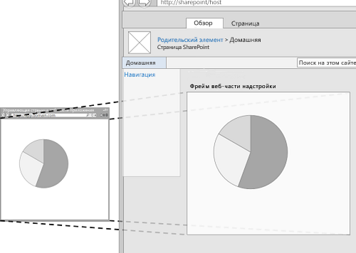
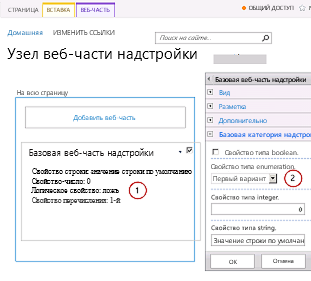
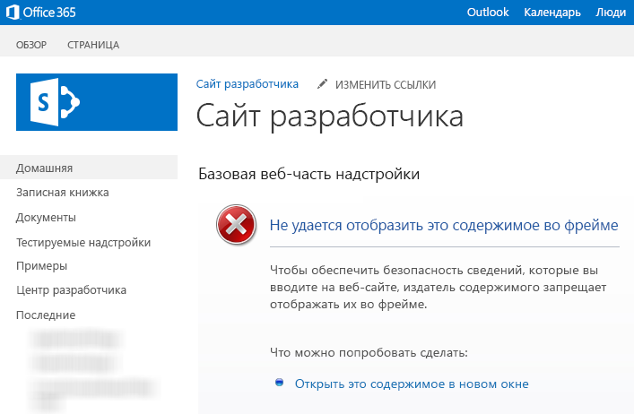

# <a name="create-add-in-parts-to-install-with-your-sharepoint-add-in"></a><span data-ttu-id="35286-102">Создание веб-частей надстройки для установки с надстройкой SharePoint</span><span class="sxs-lookup"><span data-stu-id="35286-102">Create add-in parts to install with your SharePoint Add-in</span></span>
<span data-ttu-id="35286-103">Узнайте, как создавать в SharePoint веб-часть надстройки, которая будет доступна в коллекции веб-частей хост-сайта после установки вашей надстройки SharePoint.</span><span class="sxs-lookup"><span data-stu-id="35286-103">Learn how to create an add-in part in SharePoint that is available in the Web Part gallery of the host web when you install your SharePoint Add-in.</span></span>
 

 <span data-ttu-id="35286-p101">**Примечание.** В настоящее время идет процесс замены названия "приложения для SharePoint" названием "надстройки SharePoint". Во время этого процесса в документации и пользовательском интерфейсе некоторых продуктов SharePoint и средств Visual Studio может по-прежнему использоваться термин "приложения для SharePoint". Дополнительные сведения см. в статье [Новое название приложений для Office и SharePoint](new-name-for-apps-for-sharepoint.md#bk_newname).</span><span class="sxs-lookup"><span data-stu-id="35286-p101">**Note**  The name "apps for SharePoint" is changing to "SharePoint Add-ins". During the transition, the documentation and the UI of some SharePoint products and Visual Studio tools might still use the term "apps for SharePoint". For details, see  [New name for apps for Office and SharePoint](new-name-for-apps-for-sharepoint.md#bk_newname).</span></span>
 

<span data-ttu-id="35286-p102">С помощью веб-частей надстройки можно отображать взаимодействие надстройки с пользователями непосредственно на страницах веб-сайта SharePoint. Веб-часть надстройки отображает веб-страницу (обычно это интерактивная форма или динамическое представление данных), указанную с помощью **IFrame** на странице [хост-сайта](http://msdn.microsoft.com/library/fp179925.aspx). Подробные сведения о веб-частях надстройки см. в следующих статьях:</span><span class="sxs-lookup"><span data-stu-id="35286-p102">With add-in parts, you can show your add-in user experience right in the SharePoint website pages. An add-in part displays the webpage (which is typically an interactive form or a dynamic display of data) that you specify by using an  **IFrame** (also referred to as a frame) in a page in the [host web](http://msdn.microsoft.com/library/fp179925.aspx). For more background about add-in parts, see the following articles:</span></span>
 

-  <span data-ttu-id="35286-110">[Доступ к надстройке из пользовательского интерфейса](important-aspects-of-the-sharepoint-add-in-architecture-and-development-landscap.md#AccessingApp);</span><span class="sxs-lookup"><span data-stu-id="35286-110">[Accessing the add-in from the UI](important-aspects-of-the-sharepoint-add-in-architecture-and-development-landscap.md#AccessingApp)</span></span>
    
 
-  [<span data-ttu-id="35286-111">Разработка пользовательского интерфейса для надстроек SharePoint</span><span class="sxs-lookup"><span data-stu-id="35286-111">UX design for SharePoint Add-ins</span></span>](ux-design-for-sharepoint-add-ins.md)
    
 
-  <span data-ttu-id="35286-112">[Расширение пользовательского интерфейса SharePoint в надстройках](sharepoint-add-ins-ux-design-guidelines.md#UXGuide_Extending).</span><span class="sxs-lookup"><span data-stu-id="35286-112">[Extending SharePoint UI in add-ins](sharepoint-add-ins-ux-design-guidelines.md#UXGuide_Extending)</span></span>
    
 
<span data-ttu-id="35286-113">На рис. 1 показано, как содержимое веб-части надстройки отображается на странице SharePoint.</span><span class="sxs-lookup"><span data-stu-id="35286-113">Figure 1 shows how the add-in part content is displayed in a SharePoint page.</span></span>
 

<span data-ttu-id="35286-114">**Рисунок 1. Содержимое веб-части надстройки отображается на странице SharePoint**</span><span class="sxs-lookup"><span data-stu-id="35286-114">**Figure 1. Add-in part content displayed in a SharePoint page**</span></span>

 

 

 
<span data-ttu-id="35286-p103">Веб-часть надстройки реализуется в классе **ClientWebPart** и, как и все веб-части, доступна в коллекции веб-частей после установки надстройки SharePoint, где она находится. Ваши пользователи могут дальше продолжать настраивать веб-часть надстройки, используя предоставленные вами свойства. (Пример настраиваемых свойств веб-части надстройки см. на рис. 2.)</span><span class="sxs-lookup"><span data-stu-id="35286-p103">An add-in part is implemented with the  **ClientWebPart** class, and like all Web Parts it is a available in the Web Part gallery after a user installs the SharePoint Add-in that includes it. Your users can further customize the add-in part using the properties that you provide. (See figure 2 below for an example of configurable properties in an add-in part.)</span></span>
 
<span data-ttu-id="35286-p104">Пример в этой статье использует в качестве страницы содержимого веб-страницу, размещенную на удаленном сервере, а не в SharePoint. Помните, что для размещения содержимого веб-части надстройки можно также использовать страницы SharePoint, как описано в разделе [Другие распространенные сценарии использования веб-частей надстройки](#SP15Createappparts_Nextsteps) далее в этой статье.</span><span class="sxs-lookup"><span data-stu-id="35286-p104">The example in this article uses a webpage that is hosted on a remote server, not on SharePoint, as the content page. Keep in mind that you can also use SharePoint pages to host the add-in part content, as described in the  [Other common scenarios add-in parts](#SP15Createappparts_Nextsteps) section later in this article.</span></span>
 

## <a name="prerequisites-for-using-the-example-in-this-article"></a><span data-ttu-id="35286-121">Необходимые условия для использования примеров в этой статье</span><span class="sxs-lookup"><span data-stu-id="35286-121">Prerequisites for using the example in this article</span></span>
<span data-ttu-id="35286-122"><a name="SP15Createappparts_Prereq"> </a></span><span class="sxs-lookup"><span data-stu-id="35286-122"></span></span>

<span data-ttu-id="35286-123">Для выполнения действий, описанных в этом примере, вам потребуются следующие компоненты:</span><span class="sxs-lookup"><span data-stu-id="35286-123">To follow the steps in this example, you need the following:</span></span>
 

 

- <span data-ttu-id="35286-124">Visual Studio</span><span class="sxs-lookup"><span data-stu-id="35286-124">Visual Studio</span></span>
    
 
- <span data-ttu-id="35286-125">Инструменты разработчика Microsoft Office для Visual Studio</span><span class="sxs-lookup"><span data-stu-id="35286-125">Microsoft Office Developer Tools for Visual Studio</span></span>
    
 
- <span data-ttu-id="35286-p105">Среда разработки SharePoint. Если вам нужна помощь в настройке среды разработки, см. статью [Знакомство с созданием надстроек SharePoint с размещением у поставщика](get-started-creating-provider-hosted-sharepoint-add-ins.md).</span><span class="sxs-lookup"><span data-stu-id="35286-p105">A SharePoint development environment. If you need help setting up a development environment, see  [Get started creating provider-hosted SharePoint Add-ins](get-started-creating-provider-hosted-sharepoint-add-ins.md).</span></span>
    
 

 

 

## <a name="create-an-add-in-part-to-install-on-the-host-web"></a><span data-ttu-id="35286-128">Создание веб-части надстройки для установки на хост-сайте</span><span class="sxs-lookup"><span data-stu-id="35286-128">Create an add-in part to install on the host web</span></span>
<span data-ttu-id="35286-129"><a name="SP15Createappparts_Codeexample"> </a></span><span class="sxs-lookup"><span data-stu-id="35286-129"></span></span>

<span data-ttu-id="35286-130">Для создания и установки вашей веб-части надстройки на хост-сайте требуется выполнить несколько задач.</span><span class="sxs-lookup"><span data-stu-id="35286-130">There are several tasks required to create and install your add-in part to the host web:</span></span>
 

 

1. <span data-ttu-id="35286-131">Создайте Надстройка SharePoint и удаленные веб-проекты.</span><span class="sxs-lookup"><span data-stu-id="35286-131">Create the SharePoint Add-in and remote web projects.</span></span>
    
 
2. <span data-ttu-id="35286-132">Добавьте форму для содержимого веб-части надстройки.</span><span class="sxs-lookup"><span data-stu-id="35286-132">Add a form for the add-in part content.</span></span>
    
 
3. <span data-ttu-id="35286-133">Добавьте веб-часть надстройки в Надстройка SharePoint.</span><span class="sxs-lookup"><span data-stu-id="35286-133">Add the add-in part to the SharePoint Add-in project.</span></span>
    
 
<span data-ttu-id="35286-p106">После выполнения задач ваша веб-часть надстройки должна выглядеть, как на рисунке 2, когда веб-часть надстройки находится в режиме редактирования. Здесь мы можем видеть (1) содержимое приложения, отображаемый на странице SharePoint, и (2) настраиваемые свойства веб-части надстройки.</span><span class="sxs-lookup"><span data-stu-id="35286-p106">After completing the tasks, your add-in part should look similar to Figure 2 when the add-in part is in edit mode. Here we can see (1) the add-in content displayed in a SharePoint page, and (2) the add-in part custom properties.</span></span>
 

 

<span data-ttu-id="35286-136">**Рисунок 2. Страница SharePoint с размещением базовой веб-части надстройки**</span><span class="sxs-lookup"><span data-stu-id="35286-136">**Figure 2. SharePoint page hosting a basic add-in part**</span></span>

 

 

 

### <a name="add-a-form-for-the-add-in-part-content"></a><span data-ttu-id="35286-138">Добавление формы для содержимого веб-части надстройки</span><span class="sxs-lookup"><span data-stu-id="35286-138">Add a form for the add-in part content</span></span>


1. <span data-ttu-id="35286-139">Создайте надстройку SharePoint с размещением у поставщика, как описано в статье [Знакомство с созданием надстроек SharePoint с размещением у поставщика](get-started-creating-provider-hosted-sharepoint-add-ins.md), но с именем проекта "TestAppPart".</span><span class="sxs-lookup"><span data-stu-id="35286-139">Create a provider-hosted SharePoint Add-in as described in  [Get started creating provider-hosted SharePoint Add-ins](get-started-creating-provider-hosted-sharepoint-add-ins.md), but name the project TestAppPart.</span></span>
    
 
2. <span data-ttu-id="35286-p107">После создания решения Visual Studio щелкните правой кнопкой проект веб-приложения (но не проект надстройки SharePoint) и добавьте новую веб-форму, последовательно выбрав пункты **Добавить** > **Новый элемент** > **Интернет** > **Веб-форма**. Присвойте форме имя AppPartContent.aspx.</span><span class="sxs-lookup"><span data-stu-id="35286-p107">After the Visual Studio solution has been created, right-click the web application project (not the SharePoint Add-in project) and add a new Web Form by choosing  **Add** > **New Item** > **Web** > **Web Form**. Name the form AppPartContent.aspx.</span></span>
    
 
3. <span data-ttu-id="35286-p108">В файле AppPartContent.aspx замените весь HTML-элемент и его дочерние элементы на следующий код HTML. Оставьте всю разметку над HTML-элементом без изменений. Код HTML содержит скрипт JavaScript, который выполняет следующие задачи:</span><span class="sxs-lookup"><span data-stu-id="35286-p108">In the AppPartContent.aspx file, replace the entire html element and it's children with the following HTML code. Leave all the markup above the html element as it is. The HTML code contains JavaScript that performs the following tasks:</span></span>
    
      - <span data-ttu-id="35286-145">извлекает значения свойств по умолчанию из строки запроса;</span><span class="sxs-lookup"><span data-stu-id="35286-145">Extracts the default property values from the query string</span></span>
    
 
  - <span data-ttu-id="35286-146">отображает значения свойств.</span><span class="sxs-lookup"><span data-stu-id="35286-146">Renders the property values</span></span>
    
 

    <span data-ttu-id="35286-p109">Обратите внимание, что код ожидает некоторые параметры в строке запроса. Веб-часть надстройки предоставляет свои настраиваемые свойства посредством строки запроса, так что веб-страница может их использовать. В следующей задаче объясняется, как объявлять настраиваемые свойства и как сделать их доступными для веб-страницы надстройки.</span><span class="sxs-lookup"><span data-stu-id="35286-p109">Note that the code expects some parameters in the query string. The add-in part provides its custom properties through the query string so the webpage can use them. The next task explains how to declare custom properties and how to make them available to the add-in webpage.</span></span>
    


```HTML
  <html>
    <body>
        <div id="content">
            <!-- Placeholders for properties -->
            String property: <span id="strProp"></span><br />
            Integer property: <span id="intProp"></span><br />
            Boolean property: <span id="boolProp"></span><br />
            Enumeration property: <span id="enumProp"></span><br />
        </div>

    <!-- Main JavaScript function, controls the rendering
         logic based on the custom property values -->
    <script lang="javascript">
        "use strict";

        var params = document.URL.split("?")[1].split("&amp;");
        var strProp;
        var intProp;
        var boolProp;
        var enumProp;

        // Extracts the property values from the query string.
        for (var i = 0; i < params.length; i = i + 1) {
            var param = params[i].split("=");
            if (param[0] == "strProp")
                strProp = decodeURIComponent(param[1]);
            else if (param[0] == "intProp")
                intProp = parseInt(param[1]);
            else if (param[0] == "boolProp")
                boolProp = (param[1] == "true");
            else if (param[0] == "enumProp")
                enumProp = decodeURIComponent(param[1]);
        }

        document.getElementById("strProp").innerText = strProp;
        document.getElementById("intProp").innerText = intProp;
        document.getElementById("boolProp").innerText = boolProp;
        document.getElementById("enumProp").innerText = enumProp;
    </script>
    </body>
</html>
```

4. <span data-ttu-id="35286-150">Сохраните и закройте файл.</span><span class="sxs-lookup"><span data-stu-id="35286-150">Save and close the file.</span></span>
    
 

### <a name="add-the-add-in-part-to-the-sharepoint-add-in-project"></a><span data-ttu-id="35286-151">Добавление веб-части надстройки в проект надстройки SharePoint</span><span class="sxs-lookup"><span data-stu-id="35286-151">Add the add-in part to the SharePoint Add-in project</span></span>


1. <span data-ttu-id="35286-p110">Щелкните правой кнопкой мыши проект надстройки SharePoint (но не проект веб-приложения) и последовательно выберите пункты **Добавить** > **Новый элемент** > **Office и SharePoint** > **Клиентская веб-часть (хост-сайт)**. ("Клиентская веб-часть" это другое имя "веб-части надстройки".)</span><span class="sxs-lookup"><span data-stu-id="35286-p110">Right-click the SharePoint Add-in project (not the web application project), and then choose  **Add** > **New Item** > **Office/SharePoint** > **Client Web Part (Host Web)**. ("Client Web Part" is another name for "add-in part".)</span></span>
    
 
2. <span data-ttu-id="35286-154">Присвойте этой веб-части имя "Basic add-in part" (Базовая веб-часть надстройки).</span><span class="sxs-lookup"><span data-stu-id="35286-154">Name the part Basic add-in part.</span></span>
    
 
3. <span data-ttu-id="35286-p111">В диалоговом окне **Указание страницы клиентской веб-части** выберите команду **Выберите или введите URL-адрес существующей веб-страницы**. Выберите страницу **TestAppWebPart/AppPartContent.aspx** из раскрывающегося списка. (После этого URL-адрес страницы может появиться в поле, при этом "TestAppWebPart" будет заменено на **~remoteAppUrl**, а в качестве параметров запроса будет добавлено **{StandardTokens}**.)</span><span class="sxs-lookup"><span data-stu-id="35286-p111">In the  **Specify the client web part page** dialog box, choose **Select or enter a URL for an existing web page**. Choose the  **TestAppWebPart/AppPartContent.aspx** page in the drop-down list. (After you've made your choice, the page URL may appear in the box with "TestAppWebPart" replaced by **~remoteAppUrl** and with **{StandardTokens }** added for the query parameters.)</span></span>
    
 
4. <span data-ttu-id="35286-158">Нажмите кнопку **Готово**.</span><span class="sxs-lookup"><span data-stu-id="35286-158">Choose  **Finish**.</span></span>
    
 
5. <span data-ttu-id="35286-159">Щелкните правой кнопкой мыши **Basic add-in part** (Базовая веб-часть надстройки) в **обозревателе решений** и выберите пункт **Свойства**.</span><span class="sxs-lookup"><span data-stu-id="35286-159">Right-click  **Basic add-in part** in **Solution Explorer**, and choose  **Properties**.</span></span>
    
 
6. <span data-ttu-id="35286-160">В области **Свойства** выберите **Настраиваемые свойства** и нажмите кнопку выноски (**…**).</span><span class="sxs-lookup"><span data-stu-id="35286-160">In the  **Properties** pane, select **Custom properties** and choose the callout ( **...**) button.</span></span>
    
 
7. <span data-ttu-id="35286-p112">В диалоговом окне **Настраиваемые свойства** добавьте в веб-часть надстройки четыре настраиваемых свойства. Вам необходимо задать пять атрибутов для каждого из четырех настраиваемых свойств. В табл. 1 представлены имена и значения атрибутов. Создайте свойства, выполнив указанные ниже действия.</span><span class="sxs-lookup"><span data-stu-id="35286-p112">Use the  **Custom Properties** dialog to add four custom properties to the add-in part. You have to set five attributes of each of the four custom properties. The attribute names and values are listed in Table 1. Create the properties using the following procedure.</span></span>
    
      1. <span data-ttu-id="35286-165">Нажмите кнопку **Добавить**.</span><span class="sxs-lookup"><span data-stu-id="35286-165">Choose  **Add**.</span></span>
    
 
  2. <span data-ttu-id="35286-166">В списке атрибутов выберите первый атрибут из табл. 1: **DefaultValue**.</span><span class="sxs-lookup"><span data-stu-id="35286-166">In the attribute list, select the first attribute from Table 1:  **DefaultValue**.</span></span> 
    
 
  3. <span data-ttu-id="35286-167">Например, задайте значение "String default value" (Значение строки по умолчанию).</span><span class="sxs-lookup"><span data-stu-id="35286-167">Set the value, for example, String default value.</span></span>
    
 
  4. <span data-ttu-id="35286-168">Выберите следующий атрибут, **Name**, и присвойте ему значение, например "strProp".</span><span class="sxs-lookup"><span data-stu-id="35286-168">Select the next attribute,  **Name**, and set its value, for example, strProp.</span></span>
    
 
  5. <span data-ttu-id="35286-169">Повторите действия для атрибутов **Type**, **WebCategory** и **WebDisplayName**.</span><span class="sxs-lookup"><span data-stu-id="35286-169">Continue with the  **Type**,  **WebCategory**, and  **WebDisplayName** attributes.</span></span>
    
 
  6. <span data-ttu-id="35286-p113">Еще раз нажмите кнопку **Добавить** и повторите процесс для всех четырех строк в табл. 1. *Не* закрывайте диалоговое окно.</span><span class="sxs-lookup"><span data-stu-id="35286-p113">Choose  **Add** again and repeat the process for all four rows of Table 1. Do *not*  close the dialog.</span></span>
    
    <span data-ttu-id="35286-172">**Таблица 1. Атрибуты настраиваемых свойств веб-части надстройки**</span><span class="sxs-lookup"><span data-stu-id="35286-172">**Table 1. Attributes for the add-in part's custom properties**</span></span>


|<span data-ttu-id="35286-173">**DefaultValue**</span><span class="sxs-lookup"><span data-stu-id="35286-173">**DefaultValue**</span></span>|<span data-ttu-id="35286-174">**Name**</span><span class="sxs-lookup"><span data-stu-id="35286-174">**Name**</span></span>|<span data-ttu-id="35286-175">**Type**</span><span class="sxs-lookup"><span data-stu-id="35286-175">**Type**</span></span>|<span data-ttu-id="35286-176">**WebCategory**</span><span class="sxs-lookup"><span data-stu-id="35286-176">**WebCategory**</span></span>|<span data-ttu-id="35286-177">**WebDisplayName**</span><span class="sxs-lookup"><span data-stu-id="35286-177">**WebDisplayName**</span></span>|
|:-----|:-----|:-----|:-----|:-----|
|<span data-ttu-id="35286-178">Значение строки по умолчанию</span><span class="sxs-lookup"><span data-stu-id="35286-178">String default value</span></span>|<span data-ttu-id="35286-179">strProp</span><span class="sxs-lookup"><span data-stu-id="35286-179">strProp</span></span>|<span data-ttu-id="35286-180">string</span><span class="sxs-lookup"><span data-stu-id="35286-180">string</span></span>|<span data-ttu-id="35286-181">Basic add-in part category (Категория базовой веб-части надстройки)</span><span class="sxs-lookup"><span data-stu-id="35286-181">Basic add-in part category</span></span>|<span data-ttu-id="35286-182">A property of type string (Свойство типа string)</span><span class="sxs-lookup"><span data-stu-id="35286-182">A property of type string</span></span>|
|<span data-ttu-id="35286-183">0</span><span class="sxs-lookup"><span data-stu-id="35286-183">0%</span></span>|<span data-ttu-id="35286-184">intProp</span><span class="sxs-lookup"><span data-stu-id="35286-184">intProp</span></span>|<span data-ttu-id="35286-185">int</span><span class="sxs-lookup"><span data-stu-id="35286-185">int</span></span>|<span data-ttu-id="35286-186">Basic add-in part category (Категория базовой веб-части надстройки)</span><span class="sxs-lookup"><span data-stu-id="35286-186">Basic add-in part category</span></span>|<span data-ttu-id="35286-187">A property of type integer (Свойство типа integer)</span><span class="sxs-lookup"><span data-stu-id="35286-187">A property of type integer</span></span>|
|<span data-ttu-id="35286-188">false</span><span class="sxs-lookup"><span data-stu-id="35286-188">false</span></span>|<span data-ttu-id="35286-189">boolProp</span><span class="sxs-lookup"><span data-stu-id="35286-189">boolProp</span></span>|<span data-ttu-id="35286-190">boolean</span><span class="sxs-lookup"><span data-stu-id="35286-190">boolean</span></span>|<span data-ttu-id="35286-191">Basic add-in part category (Категория базовой веб-части надстройки)</span><span class="sxs-lookup"><span data-stu-id="35286-191">Basic add-in part category</span></span>|<span data-ttu-id="35286-192">A property of type boolean (Свойство типа boolean)</span><span class="sxs-lookup"><span data-stu-id="35286-192">A property of type boolean</span></span>|
|<span data-ttu-id="35286-193">1st</span><span class="sxs-lookup"><span data-stu-id="35286-193">1st</span></span>|<span data-ttu-id="35286-194">enumProp</span><span class="sxs-lookup"><span data-stu-id="35286-194">enumProp</span></span>|<span data-ttu-id="35286-195">enum</span><span class="sxs-lookup"><span data-stu-id="35286-195">enum</span></span>|<span data-ttu-id="35286-196">Basic add-in part category (Категория базовой веб-части надстройки)</span><span class="sxs-lookup"><span data-stu-id="35286-196">Basic add-in part category</span></span>|<span data-ttu-id="35286-197">A property of type enumeration (Свойство типа enumeration)</span><span class="sxs-lookup"><span data-stu-id="35286-197">A property of type enumeration</span></span>|

 <span data-ttu-id="35286-198">На этом этапе диалоговое окно должно выглядеть следующим образом:</span><span class="sxs-lookup"><span data-stu-id="35286-198">At this point the dialog should look like the following:</span></span>
    
 <span data-ttu-id="35286-199">**Диалоговое окно настраиваемых свойств для ClientWebPart**</span><span class="sxs-lookup"><span data-stu-id="35286-199">**Custom Properties dialog for ClientWebPart**</span></span>


 

8. <span data-ttu-id="35286-201">Выберите свойство **enumProp**, щелкните атрибут **EnumItems**, а затем нажмите кнопку выноски (**…**).</span><span class="sxs-lookup"><span data-stu-id="35286-201">Select the  **enumProp** property, select the **EnumItems** attribute, and then choose the callout ( **...**) button.</span></span> 
    
 
9. <span data-ttu-id="35286-p114">Используйте **редактор коллекции ClientWebPartEnumItem**, чтобы добавить три элемента. Вам необходимо установить два атрибута для каждого из них. В табл. 2 представлены имена и значения атрибутов. Создайте свойства, выполнив указанные ниже действия.</span><span class="sxs-lookup"><span data-stu-id="35286-p114">Use the  **ClientWebPartEnumItem Collection Editor** to add three items. You have to set two attributes of each of the three. The attribute names and values are listed in Table 2. Create the properties using the following procedure.</span></span>
    
      1. <span data-ttu-id="35286-206">Нажмите кнопку **Добавить**.</span><span class="sxs-lookup"><span data-stu-id="35286-206">Choose  **Add**.</span></span>
    
 
  2. <span data-ttu-id="35286-207">В списке атрибутов выберите первый атрибут из табл. 2: **Value**.</span><span class="sxs-lookup"><span data-stu-id="35286-207">In the attribute list, select the first attribute from Table 2:  **Value**.</span></span> 
    
 
  3. <span data-ttu-id="35286-208">Установите для атрибута значение, например, "1st".</span><span class="sxs-lookup"><span data-stu-id="35286-208">Set the value of the attribute, for example, 1st.</span></span>
    
 
  4. <span data-ttu-id="35286-209">Выберите следующий атрибут, **WebDisplayName**, и присвойте ему значение, например "First option" (Первый вариант).</span><span class="sxs-lookup"><span data-stu-id="35286-209">Select the next attribute,  **WebDisplayName**, and set its value, for example, First option.</span></span>
    
 
  5. <span data-ttu-id="35286-210">Еще раз нажмите кнопку **Добавить** и повторите процесс для всех строк в табл. 2.</span><span class="sxs-lookup"><span data-stu-id="35286-210">Choose  **Add** again and repeat the process for all rows of Table 2.</span></span>
    
    <span data-ttu-id="35286-211">**Таблица 2. Элементы перечисления свойства enumProp**</span><span class="sxs-lookup"><span data-stu-id="35286-211">**Table 2. Enum items of the enumProp property**</span></span>


|<span data-ttu-id="35286-212">**Value**</span><span class="sxs-lookup"><span data-stu-id="35286-212">**Value**</span></span>|<span data-ttu-id="35286-213">**WebDisplayName**</span><span class="sxs-lookup"><span data-stu-id="35286-213">**WebDisplayName**</span></span>|
|:-----|:-----|
|<span data-ttu-id="35286-214">1st</span><span class="sxs-lookup"><span data-stu-id="35286-214">1st</span></span>|<span data-ttu-id="35286-215">Первый вариант</span><span class="sxs-lookup"><span data-stu-id="35286-215">First option</span></span>|
|<span data-ttu-id="35286-216">2nd</span><span class="sxs-lookup"><span data-stu-id="35286-216">2nd</span></span>|<span data-ttu-id="35286-217">Второй вариант</span><span class="sxs-lookup"><span data-stu-id="35286-217">Second option</span></span>|
|<span data-ttu-id="35286-218">3rd</span><span class="sxs-lookup"><span data-stu-id="35286-218">3rd</span></span>|<span data-ttu-id="35286-219">Третий вариант</span><span class="sxs-lookup"><span data-stu-id="35286-219">Third option</span></span>|

<span data-ttu-id="35286-220">По окончании диалоговое окно должно выглядеть следующим образом:</span><span class="sxs-lookup"><span data-stu-id="35286-220">The dialog should look like the following when you are finished:</span></span>
    

<span data-ttu-id="35286-221">**Редактор коллекции ClientWebPartEnumItem**</span><span class="sxs-lookup"><span data-stu-id="35286-221">**ClientWebPartEnumItem Collection Editor**</span></span>

 


 

 

 
  6. <span data-ttu-id="35286-223">Нажмите кнопку **ОК**, чтобы закрыть диалоговое окно, а затем еще раз нажмите **ОК**, чтобы закрыть диалоговое окно **Настраиваемые свойства**.</span><span class="sxs-lookup"><span data-stu-id="35286-223">Choose  **OK** to close the dialog, and then choose **OK** again to close the **Custom Properties** dialog.</span></span>
    
 
10. <span data-ttu-id="35286-p115">Visual Studio создает указанный ниже код XML в файле elements.xml веб-части надстройки (разрывы строк добавлены для ясности). Обратите внимание, что атрибут **Title** элемента **ClientWebPart** задан как "Basic add-in part Title" (Заголовок базовой веб-части надстройки), а атрибут Description задан как "Basic add-in part Description" (Описание базовой веб-части надстройки). Удалите слово "Title" (Заголовок) из первого атрибута, а второй замените на "A basic add-in part" (Базовая веб-часть надстройки).</span><span class="sxs-lookup"><span data-stu-id="35286-p115">Visual Studio generates the following XML code in the elements.xml file of the add-in part (line breaks added for clarity). Note that the  **Title** attribute of the **ClientWebPart** element is set to "Basic add-in part Title" and the Description is set to "Basic add-in part Description". Delete the word "Title" from the first, and replace the second withA basic add-in part.</span></span> 
    
```XML
  <?xml version="1.0" encoding="UTF-8"?>
<Elements xmlns="http://schemas.microsoft.com/sharepoint/">
    <ClientWebPart
        Name="Basic add-in part"
        Title="Basic add-in part Title"
        Description="Basic add-in part Description" >
        
        <!--  The properties are passed through the query string 
                using the following notation: _propertyName_
                in the Src property of the Content element.  
          -->
        <Content
            Src="~remoteAppUrl/AppPartContent.aspx?strProp=_strProp_&amp;amp;intProp=_intProp_&amp;amp;boolProp=_boolProp_&amp;amp;enumProp=_enumProp_"
            Type="html"/>
        <Properties>
            <Property
                Name="strProp"
                Type="string"
                RequiresDesignerPermission="true"
                DefaultValue="String default value"
                WebCategory="Basic add-in part category"
                WebDisplayName="A property of type string.">
            </Property>
            <Property
                Name="intProp"
                Type="int"
                RequiresDesignerPermission="true"
                DefaultValue="0"
                WebCategory="Basic add-in part category"
                WebDisplayName="A property of type integer.">
            </Property>
            <Property
                Name="boolProp"
                Type="boolean"
                RequiresDesignerPermission="true"
                DefaultValue="false"
                WebCategory="Basic add-in part category"
                WebDisplayName="A property of type boolean.">
            </Property>
            <Property
                Name="enumProp"
                Type="enum"
                RequiresDesignerPermission="true"
                DefaultValue="1st"
                WebCategory="Basic add-in part category"
                WebDisplayName="A property of type enum.">
                <EnumItems>
                    <EnumItem WebDisplayName="First option" Value="1st"/>
                    <EnumItem WebDisplayName="Second option" Value="2nd"/>
                    <EnumItem WebDisplayName="Third option" Value="3rd"/>
                </EnumItems>
            </Property>
        </Properties>
    </ClientWebPart>
</Elements>               

```


### <a name="set-the-add-in-start-page-to-the-host-web-home-page"></a><span data-ttu-id="35286-227">Установка домашней страницы хост-сайта в качестве начальной страницы надстройки</span><span class="sxs-lookup"><span data-stu-id="35286-227">Set the add-in start page to the host web home page</span></span>


1. <span data-ttu-id="35286-p116">В следующем примере надстройки SharePoint нет сайта надстройки, а его удаленное веб-приложение существует только для размещения формы. Для надстройки не существует интерфейса на всю страницу. Поэтому начальной страницей надстройки следует сделать домашнюю страницу хост-сайта.</span><span class="sxs-lookup"><span data-stu-id="35286-p116">The continuing sample SharePoint Add-in doesn't have any add-in web and its remote web application exists only to host the form. There isn't any full page, immersive experience for this add-in. So the start page of the add-in should be set to the home page of the host web.</span></span> 
    
    <span data-ttu-id="35286-231">Для начала выберите проект надстройки SharePoint (но не проект веб-приложения) в **обозревателе решений** и скопируйте значение свойства **URL-адрес сайта**, включая протокол (например, **https://contoso.sharepoint.com**) в буфер обмена.</span><span class="sxs-lookup"><span data-stu-id="35286-231">To begin, select the SharePoint Add-in project (not the web application project) in  **Solution Explorer** and copy the value of the **Site URL** property, including the protocol (for example **https://contoso.sharepoint.com**) into the clipboard.</span></span> 
    
 
2. <span data-ttu-id="35286-232">Откройте манифест надстройки и вставьте URL-адрес в поле **Начальная страница**.</span><span class="sxs-lookup"><span data-stu-id="35286-232">Open the add-in manifest, and then paste the URL into the  **Start Page** box.</span></span>
    
 
3. <span data-ttu-id="35286-233">При необходимости можно удалить страницу Default.aspx из проекта веб-приложения, так как она не используется в надстройке SharePoint.</span><span class="sxs-lookup"><span data-stu-id="35286-233">Optionally, you can delete the Default.aspx page from the web application project, because it is not used in the SharePoint Add-in.</span></span>
    
 

### <a name="build-and-test-the-solution"></a><span data-ttu-id="35286-234">Построение и тестирование решения</span><span class="sxs-lookup"><span data-stu-id="35286-234">Build and test the solution</span></span>


1. <span data-ttu-id="35286-235">Нажмите клавишу F5.</span><span class="sxs-lookup"><span data-stu-id="35286-235">Press the F5 key.</span></span>
    
     <span data-ttu-id="35286-236">**Примечание.** При нажатии клавиши F5 Visual Studio создает решение, устанавливает надстройку и открывает для нее страницу разрешений.</span><span class="sxs-lookup"><span data-stu-id="35286-236">**Note**  When you press F5, Visual Studio builds the solution, installs the add-in, and opens the permissions page for the add-in.</span></span>
2. <span data-ttu-id="35286-237">Нажмите кнопку **Доверять**.</span><span class="sxs-lookup"><span data-stu-id="35286-237">Choose the  **Trust It** button.</span></span>
    
 
3. <span data-ttu-id="35286-p117">Добавьте **Basic add-in part** (Базовая веб-часть надстройки) из коллекции веб-частей надстройки. Подробные инструкции см. в разделе [Добавление веб-части надстройки на страницу](https://support.office.com/article/Add-an-App-Part-to-a-page-6f06c0b7-44b8-4c69-b4ad-85197eee8d78).</span><span class="sxs-lookup"><span data-stu-id="35286-p117">Add the  **Basic add-in part** from the Add-in Part gallery. For detailed instructions, see [Add an Add-in Part to a page](https://support.office.com/article/Add-an-App-Part-to-a-page-6f06c0b7-44b8-4c69-b4ad-85197eee8d78).</span></span>
    
    <span data-ttu-id="35286-p118">После установки надстройки на хост-сайте веб-часть **Basic add-in part** (Базовая веб-часть надстройки) становится доступной в коллекции веб-частей надстройки, как это показано на рис. 3.</span><span class="sxs-lookup"><span data-stu-id="35286-p118">When the add-in is installed on the host web, the  **Basic add-in part** is available in the Add-in Part gallery. It should look a lot like Figure 3.</span></span>
    

    <span data-ttu-id="35286-242">**Рисунок 3. Веб-часть надстройки в коллекции веб-частей надстройки.**</span><span class="sxs-lookup"><span data-stu-id="35286-242">**Figure 3. Add-in part in the Add-in Part gallery**</span></span>

 

  
 

 

 
4. <span data-ttu-id="35286-244">После добавления веб-части надстройки нажмите стрелку вниз справа от заголовка **Basic add-in part** (Базовая веб-часть надстройки), а затем выберите команду **Изменить веб-часть**.</span><span class="sxs-lookup"><span data-stu-id="35286-244">After you have added the add-in part, choose the down arrow head to the right of the title  **Basic add-in part**, and then choose  **Edit web part**.</span></span>
    
    <span data-ttu-id="35286-245">Вы должны увидеть веб-часть надстройки в режиме редактирования, как показано на рис. 1 выше.</span><span class="sxs-lookup"><span data-stu-id="35286-245">You should see the add-in part in edit mode similar to Figure 1 above.</span></span>
    
 
5. <span data-ttu-id="35286-246">Откройте категорию **Basic add-in part category** (Категория базовой веб-части надстройки) и измените некоторые значения свойств.</span><span class="sxs-lookup"><span data-stu-id="35286-246">Open  **Basic add-in part category** and change some of the property values.</span></span>
    
 
6. <span data-ttu-id="35286-247">Нажмите кнопку **ОК**, чтобы сохранить изменения, и убедитесь, что свойства в веб-части надстройки изменились.</span><span class="sxs-lookup"><span data-stu-id="35286-247">Click  **OK** to save your changes and verify that the properties have changed in the add-in part.</span></span>
    
 
7. <span data-ttu-id="35286-p119">После завершения отладки (вы не будете использовать F5 в этом проекте длительное время) рекомендуется отозвать надстройку SharePoint последний раз, чтобы убедиться, что веб-часть надстройки удалена с домашней страницы. Щелкните правой кнопкой мыши проект надстройки SharePoint и выберите команду **Отозвать**.</span><span class="sxs-lookup"><span data-stu-id="35286-p119">When you end the debugging session, and you won't be using F5 again on this project for a while, it is a good practice to retract the SharePoint Add-in one last time to ensure that the test add-in part is removed from your home page. Right-click the SharePoint Add-in project and choose  **Retract**.</span></span>
    
 

## <a name="troubleshooting"></a><span data-ttu-id="35286-250">Устранение неполадок</span><span class="sxs-lookup"><span data-stu-id="35286-250">Troubleshooting</span></span>
<span data-ttu-id="35286-251"><a name="SP15Createappparts_Codeexample"> </a></span><span class="sxs-lookup"><span data-stu-id="35286-251"></span></span>


<span data-ttu-id="35286-252">**Таблица 3. Поиск и устранение неполадок в решении**</span><span class="sxs-lookup"><span data-stu-id="35286-252">**Table 3. Troubleshooting the solution**</span></span>


|<span data-ttu-id="35286-253">**Проблема**</span><span class="sxs-lookup"><span data-stu-id="35286-253">**Problem**</span></span>|<span data-ttu-id="35286-254">**Решение**</span><span class="sxs-lookup"><span data-stu-id="35286-254">**Solution**</span></span>|
|:-----|:-----|
|<span data-ttu-id="35286-p120">В веб-части надстройки не отображается никакого содержимого. Веб-часть надстройки отображает следующую ошибку: **Navigation to the webpage was canceled** (Переход на веб-страницу отменен). Эта ошибка возникает потому, что браузер заблокировал страницу содержимого.</span><span class="sxs-lookup"><span data-stu-id="35286-p120">The add-in part does not display any content. The add-in part displays the following error:  **Navigation to the webpage was canceled**. This error occurs because the browser has blocked the content page.</span></span>| <span data-ttu-id="35286-p121">Включите смешанное содержимое. Эта процедура может отличаться в зависимости от используемого браузера. В Internet Explorer 9 и 10 в нижней части страницы отображается следующее сообщение: **Отображается только безопасное содержимое**. Выберите **Отображать весь контент**, чтобы отобразить содержимое веб-части надстройки. В Internet Explorer 8 появляется диалоговое окно со следующим сообщением: **Вы хотите отображать только безопасное содержимое веб-страниц?** Выберите **Нет**, чтобы отобразить содержимое веб-части надстройки. Кроме того, вы можете включить смешанное содержимое в Интернет-зоне, где вы работаете. Для большинства разработчиков Интернет-зоной является **Местная интрасеть**. Если этот случай для вас не подходит, измените зону **Местная интрасеть** на Интернет-зону, где вы работаете. В Internet Explorer выберите меню **Сервис** > **Свойства браузера**. В диалоговом окне **Свойства браузера** на вкладке **Безопасность** выберите пункт **Местная интрасеть**, а затем нажмите кнопку **Другой**. В диалоговом окне **Параметры безопасности** включите параметр **Отображение разнородного содержимого** в разделе **Разное**.</span><span class="sxs-lookup"><span data-stu-id="35286-p121">Enable mixed content. The procedure might be different depending on the browser you are using: Internet Explorer 9 and 10 display the following message at the bottom of the page: **Only secure content is displayed**. Choose **Show all content** to display the add-in part content. Internet Explorer 8 shows a dialog box with the following message: **Do you want to view only the webpage content that was delivered securely?** Choose **No** to display the add-in part content. Alternatively, you can enable mixed content in the Internet zone that you are working on. For most developers the Internet zone is **Local intranet**. If this is not the case for you, substitute **Local intranet** for the Internet zone you are working on. In Internet Explorer, choose **Tools** > **Internet Options**.   In the **Internet Options** dialog box, on the **Security** tab, choose **Local intranet**, and then choose the  **Custom level** button.  In the **Security Settings** dialog box, enable **Display mixed content** in the **Miscellaneous** section.</span></span> |

## <a name="other-common-scenarios-add-in-parts"></a><span data-ttu-id="35286-269">Другие распространенные сценарии использования веб-частей надстройки</span><span class="sxs-lookup"><span data-stu-id="35286-269">Other common scenarios add-in parts</span></span>
<span data-ttu-id="35286-270"><a name="SP15Createappparts_Nextsteps"> </a></span><span class="sxs-lookup"><span data-stu-id="35286-270"></span></span>

<span data-ttu-id="35286-p122">В этой статье демонстрируется создание базовой веб-части надстройки с пользовательскими свойствами с использованием удаленной веб-страницы как страницы содержимого. Вы также можете изучить указанные ниже сценарии и сведения о веб-частях.</span><span class="sxs-lookup"><span data-stu-id="35286-p122">This article shows how to create a basic add-in part with custom properties using a remote webpage as the content page. You can also explore the following scenarios and details about add-in parts.</span></span>
 

 

### <a name="use-a-sharepoint-page-as-the-content-page"></a><span data-ttu-id="35286-273">Использование страницы SharePoint в качестве страницы содержимого</span><span class="sxs-lookup"><span data-stu-id="35286-273">Use a SharePoint page as the content page</span></span>

<span data-ttu-id="35286-p123">В большинстве случаев веб-страницу невозможно отобразить во фрейме, если она отправляет в качестве отклика HTTP-заголовок **X-Frame-Options**. По умолчанию страницы SharePoint включают заголовок **X-Frame-Options**. Если вы используете веб-страницу SharePoint, расположенную на сайте надстройки, вы можете столкнуться со следующей ошибкой (рис. 4): **Не удается отобразить это содержимое во фрейме**.</span><span class="sxs-lookup"><span data-stu-id="35286-p123">In most cases, a webpage can't be displayed in a frame if it sends an  **X-Frame-Options** HTTP header in the response. By default, SharePoint pages include the **X-Frame-Options** header. If you are using a SharePoint webpage hosted on the add-in web, you might run into the following error (shown in Figure 4): **This content cannot be displayed in a frame**</span></span>
 

 

<span data-ttu-id="35286-277">**Рисунок 4. Веб-часть надстройки не может отобразить свое содержимое во фрейме**</span><span class="sxs-lookup"><span data-stu-id="35286-277">**Figure 4. Add-in part that can't display its content in a frame**</span></span>

 

 

 
<span data-ttu-id="35286-p124">Помните, что некоторые сценарии уязвимы к атакам [ClickJacking](http://blogs.msdn.com/b/ieinternals/archive/2010/03/30/combating-clickjacking-with-x-frame-options.aspx), когда веб-страницы отображаются во фрейме. Тщательно оценивайте сценарии своих веб-частей надстройки, чтобы убедиться, что опасность атак **ClickJacking** отсутствует.</span><span class="sxs-lookup"><span data-stu-id="35286-p124">Be aware that certain scenarios are susceptible to " [ClickJacking](http://blogs.msdn.com/b/ieinternals/archive/2010/03/30/combating-clickjacking-with-x-frame-options.aspx)" attacks when the webpages are displayed in a frame. Carefully evaluate your add-in part scenarios to make sure there is no risk of  **ClickJacking** attacks.</span></span>
 

 
<span data-ttu-id="35286-p125">Если ваша страница, размещенная на сайте надстройки, неуязвима к атакам ClickJacking, то на этой странице можно использовать веб-часть **AllowFraming** для удаления заголовка **X-Frame-Options** из отклика страницы. В приведенном ниже примере кода показано использование веб-части **AllowFraming** на странице SharePoint. Скопируйте эту разметку на страницу, размещенную в веб-надстройке. Просто поместите ее перед первым элементом **asp:content** на странице. Разметка не должна быть потомком какого-либо другого элемента.</span><span class="sxs-lookup"><span data-stu-id="35286-p125">If your page hosted on the add-in web is not susceptible to ClickJacking attacks, you can use the  **AllowFraming** Web Part to suppress the **X-Frame-Options** header from your page's response. The following code example shows how to use the **AllowFraming** Web Part on a SharePoint page. Copy this markup into the page that is hosted on the add-in web. Put it just above the first **asp:content** element in the page. It should not be a child of any other element.</span></span>
 

 


```XML
<WebPartPages:AllowFraming ID="AllowFraming1" runat="server" />
```

<span data-ttu-id="35286-286">Вы можете загрузить [пример кода веб-части надстройки](http://code.msdn.microsoft.com/SharePoint-Display-be8dac16), где показано, как использовать страницу SharePoint в качестве страницы содержимого.</span><span class="sxs-lookup"><span data-stu-id="35286-286">You can download an  [add-in part code sample](http://code.msdn.microsoft.com/SharePoint-Display-be8dac16) that shows how to use a SharePoint page as the content page.</span></span>
 

 

### <a name="resize-the-add-in-part"></a><span data-ttu-id="35286-287">Изменение размера веб-части надстройки</span><span class="sxs-lookup"><span data-stu-id="35286-287">Resize the add-in part</span></span>

<span data-ttu-id="35286-p126">Если в веб-части надстройки используется динамическое содержимое, то возможно изменение его ширины и высоты. В связи с динамической природой содержимого оно может не помещаться во фрейм. Кроме того, возможно, что используется слишком много места. Динамическое содержимое может усложнить задание фиксированного размера в объявлении веб-части надстройки. К счастью, размер фрейма можно изменить в соответствии с шириной и высотой содержимого.</span><span class="sxs-lookup"><span data-stu-id="35286-p126">If you're using dynamic content in your add-in part, the content might change its width and height. Due to the dynamic nature of the content, it may not fit in the frame. You may also be using too much space. With dynamic content, it could be difficult to specify a fixed size in your add-in part declaration. However, you can resize the frame to fit the content's width and height.</span></span>
 

 
<span data-ttu-id="35286-p127">Для задания размера фрейма веб-страницы содержимого можно использовать сообщения POST. В приведенном ниже скрипте JavaScript показано, как отправить сообщение POST для изменения размера фрейма, в котором размещается веб-часть надстройки. Как правило, такой код размещается в методе JavaScript в файле JavaScript, который вызывается со страницы. Например, на странице может быть элемент управления, в котором пользователь указывает размер окна веб-части надстройки. Затем пользовательский метод вызывается из обработчика **onchange** элемента управления. Полный пример см. в cnfnmt [Пример кода. Динамическое изменение размеров веб-частей надстройки для SharePoint](http://code.msdn.microsoft.com/officeapps/SharePoint-Resize-app-594acc88).</span><span class="sxs-lookup"><span data-stu-id="35286-p127">You can use POST messages from your content webpage to specify the frame's size. The following JavaScript example shows you how to send a POST message to resize the frame in which your add-in part is hosted. Typically, you would have this in a JavaScript method in a JavaScript file that you call from the page. For example, the page could have a control in which the user specifies the size of the add-in part window. The custom method is then called from  **onchange** handler of the control. For a full sample, see [Code sample: Resize add-in parts dynamically in SharePoint Add-ins](http://code.msdn.microsoft.com/officeapps/SharePoint-Resize-app-594acc88).</span></span> 
 

 


```
window.parent.postMessage("<message senderId={SenderId}>resize(120, 300)</message>", {hostweburl});
```

<span data-ttu-id="35286-p128">В примере выше значение **senderId** будет устанавливаться в строке запроса страницы автоматически кодом веб-части надстройки при отрисовке страницы. Странице будет достаточно прочитать значение **SenderId** в строке запроса и использовать его при запросе изменения размера. URL-адрес хост-сайта можно получить из строки запроса, добавив маркер **StandardTokens** или **HostUrl** в атрибут **Src** в определении веб-части надстройки. Вы можете скачать [пример кода для изменения размеров веб-частей](http://code.msdn.microsoft.com/officeapps/SharePoint-Resize-app-594acc88), чтобы увидеть динамическое изменение размера веб-части надстройки.</span><span class="sxs-lookup"><span data-stu-id="35286-p128">In the example above, the  **senderId** value will be set on the query string of the page automatically by the add-in part code when the page is rendered. Your page would just need to read the **SenderId** value off of the query string and use it when requesting a resize. You can retrieve the host web URL from the query string by appending the **StandardTokens** or **HostUrl** tokens to the **Src** attribute in your add-in part definition. You can download the [Resize add-in parts code sample](http://code.msdn.microsoft.com/officeapps/SharePoint-Resize-app-594acc88) to see an add-in part that dynamically resizes.</span></span>
 

 

### <a name="use-the-sharepoint-style-sheet-in-your-add-in-part-content"></a><span data-ttu-id="35286-303">Использование таблицы стилей SharePoint в содержимом веб-части надстройки</span><span class="sxs-lookup"><span data-stu-id="35286-303">Use the SharePoint style sheet in your add-in part content</span></span>

<span data-ttu-id="35286-p129">Так как веб-часть надстройки размещается на странице SharePoint, ее содержимому желательно придать вид, сочетающийся с этой страницей. Один из способов достичь этого использовать те же классы стилей, что и на странице SharePoint, где размещена веб-часть надстройки. Можно сделать таблицу стилей веб-сайта SharePoint доступной для веб-части надстройки, добавив ссылку на файл **defaultcss.ashx** из сайта надстройки.</span><span class="sxs-lookup"><span data-stu-id="35286-p129">Since your add-in part is hosted within a SharePoint page, you might want to make the add-in part content look like it is part of the page. One way to achieve a similar look and feel is to use the same style classes as the SharePoint page that is hosting the add-in part. You can make the SharePoint website's style sheet available to the add-in part by adding a reference to the  **defaultcss.ashx** file from the add-in web.</span></span>
 

 
<span data-ttu-id="35286-307">См. статью  [Использование таблицы стилей веб-сайта SharePoint в надстройках для SharePoint](use-a-sharepoint-website-s-style-sheet-in-sharepoint-add-ins.md) для получения сведений о добавлении ссылки на файл **defaultcss.ashx** в Надстройки SharePoint. Вы также можете загрузить [пример кода приложения "кофеварка"](http://code.msdn.microsoft.com/office/SharePoint-App-part-9d83703c.md), чтобы увидеть веб-часть надстройки со ссылкой таблицу стилей.</span><span class="sxs-lookup"><span data-stu-id="35286-307">You can see  [Use a SharePoint website's style sheet in SharePoint Add-ins](use-a-sharepoint-website-s-style-sheet-in-sharepoint-add-ins.md) for an explanation on how to reference the **defaultcss.ashx** file in your SharePoint Add-ins. You can also download the [coffeemaker code sample](http://code.msdn.microsoft.com/office/SharePoint-App-part-9d83703c.md) to see an add-in part that references the style sheet.</span></span>
 

 

### <a name="detect-when-the-add-in-part-is-in-edit-mode"></a><span data-ttu-id="35286-308">Определение ситуации, когда веб-часть надстройки находится в режиме правки</span><span class="sxs-lookup"><span data-stu-id="35286-308">Detect when the add-in part is in edit mode</span></span>

<span data-ttu-id="35286-p130">Пользователи могут изменять веб-часть надстройки, чтобы изменить ее свойства. Например, пользователю может потребоваться изменить свойство **Внешний вид** или **Макет** веб-части надстройки. (См. рис. 2 выше.) Если ваша веб-часть надстройки находится в режиме правки, вам, возможно, понадобится изменить логику отображения или предотвратить некоторые виды нежелательной обработки. Рассмотрим, например, веб-часть надстройки, которая вызывает серверную базу данных при каждой перезагрузке хост-страницы. Изменение значения свойства веб-части надстройки вызывает перезагрузку страницы, но при этом не всегда требуется инициировать сетевой вызов. Вы можете использовать маркер **_editMode_**, чтобы определить, редактируют ли пользователи вашу веб-часть надстройки.</span><span class="sxs-lookup"><span data-stu-id="35286-p130">Users can edit the add-in part to change its properties. For example, a user might want to change one of the add-in part's  **Appearance** or **Layout** properties. (See Figure 2 above.) If your add-in part is in edit mode, you might want to modify the rendering logic or prevent some unnecessary processing from happening. Consider, for example, an add-in part that calls a backend database whenever the host page reloads. Changing an add-in part property value in edit mode causes a page reload, but you might not want the network call to be triggered in that case. You can use the **_editMode_** token to detect if users are editing your add-in part.</span></span>
 

 
<span data-ttu-id="35286-315">Чтобы использовать маркер **_editMode_**, добавьте строковый параметр запроса к атрибуту **Src** элемента **Content** в объявлении веб-части надстройки.</span><span class="sxs-lookup"><span data-stu-id="35286-315">To use the  **_editMode_** token, add a query string parameter to the **Src** attribute of the **Content** element in the add-in part declaration.</span></span>
 

 


```XML
<Content Src="content_page_url&amp;amp;editmode=_editMode_">
```

<span data-ttu-id="35286-p131">Маркер **_editMode_** позволяет странице содержимого определять, находится ли веб-часть надстройки в режиме правки. Если да, то маркер **_editMode_** возвращает значение 1. В противном случае возвращается значение 0.</span><span class="sxs-lookup"><span data-stu-id="35286-p131">The  **_editMode_** token lets your content page determine if the add-in part is in edit mode. If the add-in part is in edit mode, the **_editMode_** token resolves to 1; otherwise, the token resolves to 0.</span></span>
 

 

## <a name="additional-resources"></a><span data-ttu-id="35286-318">Дополнительные ресурсы</span><span class="sxs-lookup"><span data-stu-id="35286-318">Additional resources</span></span>
<span data-ttu-id="35286-319"><a name="SP15Createappparts_AddResources"> </a></span><span class="sxs-lookup"><span data-stu-id="35286-319"></span></span>


-  [<span data-ttu-id="35286-320">Пример кода. Отображение удаленного содержимого надстройки на хост-сайте с помощью веб-части надстройки</span><span class="sxs-lookup"><span data-stu-id="35286-320">Code sample: Display remote add-in content in the host web using an add-in part</span></span>](http://code.msdn.microsoft.com/SharePoint-Display-03c28286)
    
 
-  [<span data-ttu-id="35286-321">Пример кода. Отображение содержимого сайта надстройки на хост-сайте с помощью веб-части надстройки</span><span class="sxs-lookup"><span data-stu-id="35286-321">Code sample: Display add-in web content in the host web using an add-in part</span></span>](http://code.msdn.microsoft.com/SharePoint-Display-be8dac16)
    
 
-  [<span data-ttu-id="35286-322">Пример кода. Динамическое изменение размеров веб-частей надстройки для SharePoint</span><span class="sxs-lookup"><span data-stu-id="35286-322">Code sample: Resize add-in parts dynamically in SharePoint Add-ins</span></span>](http://code.msdn.microsoft.com/officeapps/SharePoint-Resize-app-594acc88)
    
 
-  [<span data-ttu-id="35286-323">Пример кода. Отображение удаленного содержимого веб-страницы с помощью веб-части надстройки "Coffeemaker"</span><span class="sxs-lookup"><span data-stu-id="35286-323">Code sample: Display remote webpage content using the coffeemaker add-in part</span></span>](http://code.msdn.microsoft.com/SharePoint-App-part-9d83703c)
    
 
-  [<span data-ttu-id="35286-324">Настройка локальной среды разработки надстроек SharePoint</span><span class="sxs-lookup"><span data-stu-id="35286-324">Set up an on-premises development environment for SharePoint Add-ins</span></span>](set-up-an-on-premises-development-environment-for-sharepoint-add-ins.md)
    
 
-  [<span data-ttu-id="35286-325">Разработка пользовательского интерфейса для надстроек SharePoint</span><span class="sxs-lookup"><span data-stu-id="35286-325">UX design for SharePoint Add-ins</span></span>](ux-design-for-sharepoint-add-ins.md)
    
 
-  [<span data-ttu-id="35286-326">Рекомендации по проектированию пользовательского интерфейса надстроек SharePoint</span><span class="sxs-lookup"><span data-stu-id="35286-326">SharePoint Add-ins UX design guidelines</span></span>](sharepoint-add-ins-ux-design-guidelines.md)
    
 
-  [<span data-ttu-id="35286-327">Создание компонентов пользовательского интерфейса в SharePoint</span><span class="sxs-lookup"><span data-stu-id="35286-327">Create UX components in SharePoint</span></span>](create-ux-components-in-sharepoint.md)
    
 
-  [<span data-ttu-id="35286-328">Что следует рассмотреть, прежде чем приступать к разработке надстроек SharePoint</span><span class="sxs-lookup"><span data-stu-id="35286-328">Three ways to think about design options for SharePoint Add-ins</span></span>](three-ways-to-think-about-design-options-for-sharepoint-add-ins.md)
    
 
-  [<span data-ttu-id="35286-329">Важные аспекты разработки и архитектуры для надстроек SharePoint</span><span class="sxs-lookup"><span data-stu-id="35286-329">Important aspects of the SharePoint Add-in architecture and development landscape</span></span>](important-aspects-of-the-sharepoint-add-in-architecture-and-development-landscap.md)
    
 
