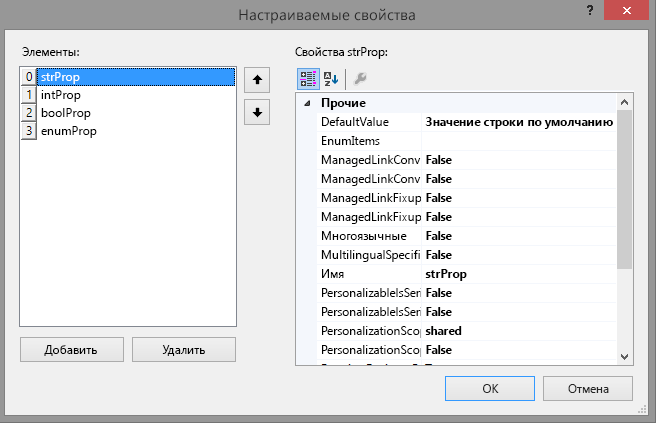
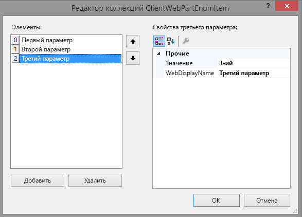
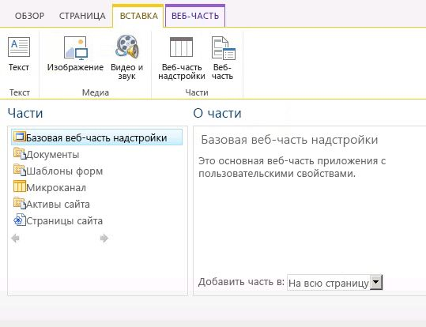

# <a name="create-add-in-parts-to-install-with-your-sharepoint-add-in"></a><span data-ttu-id="2da1a-103">Создание веб-частей надстройки для установки с надстройкой SharePoint</span><span class="sxs-lookup"><span data-stu-id="2da1a-103">Create add-in parts to install with your SharePoint Add-in</span></span>

<span data-ttu-id="2da1a-104">Используя веб-части, можно показывать надстройку непосредственно на страницах веб-сайта SharePoint.</span><span class="sxs-lookup"><span data-stu-id="2da1a-104">With add-in parts, you can show your add-in user experience right in the SharePoint website pages.</span></span> <span data-ttu-id="2da1a-105">Веб-часть надстройки отображает веб-страницу (обычно это интерактивная форма или динамическое представление данных), указанную с помощью **IFrame** на странице [хост-сайта](host-webs-add-in-webs-and-sharepoint-components-in-sharepoint.md).</span><span class="sxs-lookup"><span data-stu-id="2da1a-105">With add-in parts, you can show your add-in user experience right in the SharePoint website pages. An add-in part displays the webpage (which is typically an interactive form or a dynamic display of data) that you specify by using an  **IFrame** (also referred to as a frame) in a page in the [host web](host-webs-add-in-webs-and-sharepoint-components-in-sharepoint.md). For more background about add-in parts, see the following articles:</span></span> 

<span data-ttu-id="2da1a-106">Подробные сведения о веб-частях надстройки см. в следующих статьях:</span><span class="sxs-lookup"><span data-stu-id="2da1a-106">For more background about add-in parts, see the following articles:</span></span>

-  [<span data-ttu-id="2da1a-107">Доступ к надстройке из пользовательского интерфейса</span><span class="sxs-lookup"><span data-stu-id="2da1a-107">Accessing the add-in from the UI</span></span>](important-aspects-of-the-sharepoint-add-in-architecture-and-development-landscap.md#AccessingApp)
-  [<span data-ttu-id="2da1a-108">Разработка пользовательского интерфейса для надстроек SharePoint</span><span class="sxs-lookup"><span data-stu-id="2da1a-108">UX design for SharePoint Add-ins</span></span>](ux-design-for-sharepoint-add-ins.md)
-  [<span data-ttu-id="2da1a-109">Расширение пользовательского интерфейса SharePoint в надстройках</span><span class="sxs-lookup"><span data-stu-id="2da1a-109">Extending SharePoint UI in add-ins</span></span>](sharepoint-add-ins-ux-design-guidelines.md#UXGuide_Extending)
    
<span data-ttu-id="2da1a-110">На следующем рисунке показано, как содержимое веб-части надстройки отображается на странице SharePoint.</span><span class="sxs-lookup"><span data-stu-id="2da1a-110">Figure 1 shows how the add-in part content is displayed in a SharePoint page.</span></span>

<span data-ttu-id="2da1a-111">**Содержимое веб-части приложения отображается на странице SharePoint**</span><span class="sxs-lookup"><span data-stu-id="2da1a-111">**Figure 1. Add-in part content displayed in a SharePoint page**</span></span>


<br/>
 
<span data-ttu-id="2da1a-113">Веб-часть надстройки реализуется в классе **ClientWebPart** и, как и все веб-части, доступна в коллекции веб-частей после установки включающей ее надстройки SharePoint.</span><span class="sxs-lookup"><span data-stu-id="2da1a-113">An add-in part is implemented with the  **ClientWebPart** class, and like all Web Parts it is a available in the Web Part gallery after a user installs the SharePoint Add-in that includes it. Your users can further customize the add-in part using the properties that you provide. (See figure 2 below for an example of configurable properties in an add-in part.)</span></span> <span data-ttu-id="2da1a-114">Ваши пользователи могут настраивать веб-часть надстройки, используя предоставленные вами свойства.</span><span class="sxs-lookup"><span data-stu-id="2da1a-114">Your users can further customize the add-in part by using the properties that you provide.</span></span> <span data-ttu-id="2da1a-115">(Пример настраиваемых свойств в веб-части надстройки см. на рисунке **Страница SharePoint с простой веб-частью надстройки** далее в этой статье.)</span><span class="sxs-lookup"><span data-stu-id="2da1a-115">(For an example of configurable properties in an add-in part, see the figure **SharePoint page hosting a basic add-in part** later in this article.)</span></span>
 
<span data-ttu-id="2da1a-p103">Пример в этой статье использует в качестве страницы содержимого веб-страницу, размещенную на удаленном сервере, а не в SharePoint. Помните, что для размещения содержимого веб-части надстройки можно также использовать страницы SharePoint, как описано в разделе [Другие распространенные сценарии использования веб-частей надстройки](#SP15Createappparts_Nextsteps) далее в этой статье.</span><span class="sxs-lookup"><span data-stu-id="2da1a-p103">The example in this article uses a webpage that is hosted on a remote server, not on SharePoint, as the content page. Keep in mind that you can also use SharePoint pages to host the add-in part content, as described in the  [Other common scenarios add-in parts](#SP15Createappparts_Nextsteps) section later in this article.</span></span>
 
<span data-ttu-id="2da1a-118"><a name="SP15Createappparts_Prereq"> </a></span><span class="sxs-lookup"><span data-stu-id="2da1a-118"></span></span>

## <a name="prerequisites-for-using-the-example-in-this-article"></a><span data-ttu-id="2da1a-119">Необходимые условия для использования примера в этой статье</span><span class="sxs-lookup"><span data-stu-id="2da1a-119">Prerequisites for using the example in this article</span></span>

<span data-ttu-id="2da1a-120">Для выполнения действий, описанных в этом примере, вам потребуется следующее:</span><span class="sxs-lookup"><span data-stu-id="2da1a-120">To follow the steps in this example, you need the following:</span></span>

- <span data-ttu-id="2da1a-121">Visual Studio</span><span class="sxs-lookup"><span data-stu-id="2da1a-121">Visual Studio</span></span>
- <span data-ttu-id="2da1a-122">Инструменты разработчика Microsoft Office для Visual Studio.</span><span class="sxs-lookup"><span data-stu-id="2da1a-122">Microsoft Office Developer Tools for Visual Studio</span></span>
- <span data-ttu-id="2da1a-123">Среда разработки SharePoint.</span><span class="sxs-lookup"><span data-stu-id="2da1a-123">A SharePoint development environment:</span></span> <span data-ttu-id="2da1a-124">Если вам нужна помощь в настройке среды разработки, см. раздел [Два типа надстроек SharePoint (с размещением в SharePoint и у поставщика)](sharepoint-add-ins.md#two-types-of-sharepoint-add-ins-sharepoint-hosted-and-provider-hosted).</span><span class="sxs-lookup"><span data-stu-id="2da1a-124">If you need help setting up a development environment, see [Two types of SharePoint Add-ins: SharePoint-hosted and provider-hosted](sharepoint-add-ins.md#two-types-of-sharepoint-add-ins-sharepoint-hosted-and-provider-hosted).</span></span>

<span data-ttu-id="2da1a-125"><a name="SP15Createappparts_Codeexample"> </a></span><span class="sxs-lookup"><span data-stu-id="2da1a-125"></span></span>

## <a name="create-an-add-in-part-to-install-on-the-host-web"></a><span data-ttu-id="2da1a-126">Создание веб-части надстройки для установки на хост-сайте</span><span class="sxs-lookup"><span data-stu-id="2da1a-126">Create an add-in part to install on the host web</span></span>

<span data-ttu-id="2da1a-127">Для создания и установки вашей веб-части надстройки на хост-сайте требуется выполнить несколько задач.</span><span class="sxs-lookup"><span data-stu-id="2da1a-127">There are several tasks required to create and install your add-in part to the host web:</span></span>

1. <span data-ttu-id="2da1a-128">Создайте Надстройка SharePoint и удаленные веб-проекты.</span><span class="sxs-lookup"><span data-stu-id="2da1a-128">Create the SharePoint Add-in and remote web projects.</span></span>
2. <span data-ttu-id="2da1a-129">Добавьте форму для содержимого веб-части надстройки.</span><span class="sxs-lookup"><span data-stu-id="2da1a-129">Add a form for the add-in part content.</span></span>
3. <span data-ttu-id="2da1a-130">Добавьте веб-часть надстройки в проект надстройки SharePoint.</span><span class="sxs-lookup"><span data-stu-id="2da1a-130">Add the add-in part to the SharePoint Add-in project.</span></span>
    
<span data-ttu-id="2da1a-131">После выполнения задач ваша веб-часть надстройки должна выглядеть в режиме правки так, как на следующем рисунке.</span><span class="sxs-lookup"><span data-stu-id="2da1a-131">After completing the tasks, your add-in part should look similar to the following figure when the add-in part is in edit mode.</span></span> <span data-ttu-id="2da1a-132">Здесь мы можем видеть (1) содержимое надстройки, отображаемое на странице SharePoint, и (2) настраиваемые свойства веб-части надстройки.</span><span class="sxs-lookup"><span data-stu-id="2da1a-132">After completing the tasks, your add-in part should look similar to Figure 2 when the add-in part is in edit mode. Here we can see (1) the add-in content displayed in a SharePoint page, and (2) the add-in part custom properties.</span></span>

<span data-ttu-id="2da1a-133">**Страница SharePoint с простой веб-частью надстройки**</span><span class="sxs-lookup"><span data-stu-id="2da1a-133">**Figure 2. SharePoint page hosting a basic add-in part**</span></span>


 
<br/>

### <a name="add-a-form-for-the-add-in-part-content"></a><span data-ttu-id="2da1a-135">Добавление формы для содержимого веб-части надстройки</span><span class="sxs-lookup"><span data-stu-id="2da1a-135">Add a form for the add-in part content</span></span>

1. <span data-ttu-id="2da1a-136">Создайте надстройку SharePoint с размещением у поставщика, как описано в [этой статье](get-started-creating-provider-hosted-sharepoint-add-ins.md), но назовите проект **TestAppPart**.</span><span class="sxs-lookup"><span data-stu-id="2da1a-136">Create a provider-hosted SharePoint Add-in as described in  Get started creating provider-hosted SharePoint Add-ins, but name the project TestAppPart.</span></span>
    
2. <span data-ttu-id="2da1a-137">После создания решения Visual Studio щелкните правой кнопкой мыши проект веб-приложения (не проект надстройки SharePoint) и выберите **Добавить** > **Новый элемент** > **Интернет** > **Веб-форма**, чтобы добавить новую веб-форму.</span><span class="sxs-lookup"><span data-stu-id="2da1a-137">After the Visual Studio solution has been created, right-click the web application project (not the SharePoint Add-in project) and add a new Web Form by choosing  **Add** > **New Item** > **Web** > **Web Form**. Name the form AppPartContent.aspx.</span></span> <span data-ttu-id="2da1a-138">Назовите форму **AppPartContent.aspx**.</span><span class="sxs-lookup"><span data-stu-id="2da1a-138">Name the form **AppPartContent.aspx**.</span></span>

3. <span data-ttu-id="2da1a-139">В файле AppPartContent.aspx замените весь HTML-элемент и его дочерние элементы следующим HTML-кодом.</span><span class="sxs-lookup"><span data-stu-id="2da1a-139">In the AppPartContent.aspx file, replace the entire HTML element and its children with the following HTML code.</span></span> <span data-ttu-id="2da1a-140">Оставьте всю разметку над HTML-элементом без изменений.</span><span class="sxs-lookup"><span data-stu-id="2da1a-140">Leave all the markup above the HTML element as it is.</span></span> <span data-ttu-id="2da1a-141">HTML-код содержит скрипт JavaScript, который выполняет следующие задачи:</span><span class="sxs-lookup"><span data-stu-id="2da1a-141">The HTML code contains JavaScript that performs the following tasks:</span></span>
    
    - <span data-ttu-id="2da1a-142">извлекает значения свойств по умолчанию из строки запроса;</span><span class="sxs-lookup"><span data-stu-id="2da1a-142">Extracts the default property values from the query string</span></span>
    - <span data-ttu-id="2da1a-143">отображает значения свойств.</span><span class="sxs-lookup"><span data-stu-id="2da1a-143">Renders the property values</span></span>
    
    <span data-ttu-id="2da1a-p108">Обратите внимание, что код ожидает некоторые параметры в строке запроса. Веб-часть надстройки предоставляет свои настраиваемые свойства посредством строки запроса, так что веб-страница может их использовать. В следующей задаче объясняется, как объявлять настраиваемые свойства и как сделать их доступными для веб-страницы надстройки.</span><span class="sxs-lookup"><span data-stu-id="2da1a-p108">Note that the code expects some parameters in the query string. The add-in part provides its custom properties through the query string so the webpage can use them. The next task explains how to declare custom properties and how to make them available to the add-in webpage.</span></span>
    
    ```HTML
    <html>
        <body>
            <div id="content">
                <!-- Placeholders for properties -->
                String property: <span id="strProp"></span><br />
                Integer property: <span id="intProp"></span><br />
                Boolean property: <span id="boolProp"></span><br />
                Enumeration property: <span id="enumProp"></span><br />
            </div>

        <!-- Main JavaScript function, controls the rendering
            logic based on the custom property values -->
        <script lang="javascript">
            "use strict";

            var params = document.URL.split("?")[1].split("&amp;");
            var strProp;
            var intProp;
            var boolProp;
            var enumProp;

            // Extracts the property values from the query string.
            for (var i = 0; i < params.length; i = i + 1) {
                var param = params[i].split("=");
                if (param[0] == "strProp")
                    strProp = decodeURIComponent(param[1]);
                else if (param[0] == "intProp")
                    intProp = parseInt(param[1]);
                else if (param[0] == "boolProp")
                    boolProp = (param[1] == "true");
                else if (param[0] == "enumProp")
                    enumProp = decodeURIComponent(param[1]);
            }

            document.getElementById("strProp").innerText = strProp;
            document.getElementById("intProp").innerText = intProp;
            document.getElementById("boolProp").innerText = boolProp;
            document.getElementById("enumProp").innerText = enumProp;
        </script>
        </body>
    </html>
    ```

    <br/>

4. <span data-ttu-id="2da1a-147">Сохраните и закройте файл.</span><span class="sxs-lookup"><span data-stu-id="2da1a-147">Save and close the file.</span></span>

### <a name="add-the-add-in-part-to-the-sharepoint-add-in-project"></a><span data-ttu-id="2da1a-148">Добавление веб-части надстройки в проект надстройки SharePoint</span><span class="sxs-lookup"><span data-stu-id="2da1a-148">Add the add-in part to the SharePoint Add-in project</span></span>

1. <span data-ttu-id="2da1a-149">Щелкните правой кнопкой мыши проект надстройки SharePoint (но не проект веб-приложения) и выберите **Добавить** > **Новый элемент** > **Office/SharePoint** > **Клиентская веб-часть (хост-сайт)**.</span><span class="sxs-lookup"><span data-stu-id="2da1a-149">Right-click the SharePoint Add-in project (not the web application project), and then choose  **Add** > **New Item** > **Office/SharePoint** > **Client Web Part (Host Web)**. ("Client Web Part" is another name for "add-in part".)</span></span> <span data-ttu-id="2da1a-150">("Клиентская веб-часть" — это другое имя "веб-части надстройки".)</span><span class="sxs-lookup"><span data-stu-id="2da1a-150">("Client Web Part" is another name for "add-in part".)</span></span>

2. <span data-ttu-id="2da1a-151">Присвойте этой веб-части имя **Basic add-in part** (Простая веб-часть надстройки).</span><span class="sxs-lookup"><span data-stu-id="2da1a-151">Name the part Basic add-in part.</span></span>

3. <span data-ttu-id="2da1a-152">В диалоговом окне **Указание страницы клиентской веб-части** выберите **Выберите или введите URL-адрес существующей веб-страницы**.</span><span class="sxs-lookup"><span data-stu-id="2da1a-152">In the Specify the client Web Part page dialog box, choose Select or enter a URL for an existing web page. Choose the AppPartContent page in the drop-down list.</span></span> <span data-ttu-id="2da1a-153">Выберите из раскрывающегося списка страницу **TestAppWebPart/AppPartContent.aspx**.</span><span class="sxs-lookup"><span data-stu-id="2da1a-153">Select the **TestAppWebPart/AppPartContent.aspx** page in the drop-down list.</span></span> <span data-ttu-id="2da1a-154">(После этого URL-адрес страницы может появиться в поле, при этом значение "TestAppWebPart" будет заменено на **~remoteAppUrl**, а в качестве параметров запроса будет добавлено **{StandardTokens}**.)</span><span class="sxs-lookup"><span data-stu-id="2da1a-154">In the  Specify the client web part page dialog box, choose Select or enter a URL for an existing web page. Choose the  TestAppWebPart/AppPartContent.aspx page in the drop-down list. (After you've made your choice, the page URL may appear in the box with "TestAppWebPart" replaced by **~remoteAppUrl** and with **{StandardTokens }** added for the query parameters.)</span></span>

4. <span data-ttu-id="2da1a-155">Нажмите кнопку **Готово**.</span><span class="sxs-lookup"><span data-stu-id="2da1a-155">Select **Finish**.</span></span>

5. <span data-ttu-id="2da1a-156">Щелкните правой кнопкой мыши **Basic add-in part** (Простая веб-часть надстройки) в **обозревателе решений** и выберите **Свойства**.</span><span class="sxs-lookup"><span data-stu-id="2da1a-156">Right-click  **Basic add-in part** in **Solution Explorer**, and choose  **Properties**.</span></span>

6. <span data-ttu-id="2da1a-157">На панели **Свойства** выберите **Настраиваемые свойства** и нажмите кнопку выноски (**…**).</span><span class="sxs-lookup"><span data-stu-id="2da1a-157">In the **Properties** pane, select **Custom properties** and choose the callout ( **...**) button.</span></span>

7. <span data-ttu-id="2da1a-p111">В диалоговом окне **Настраиваемые свойства** добавьте в веб-часть надстройки четыре настраиваемых свойства. Вам необходимо задать пять атрибутов каждого из четырех настраиваемых свойств. В таблице 1 представлены имена и значения атрибутов. Создайте свойства, выполнив указанные ниже действия.</span><span class="sxs-lookup"><span data-stu-id="2da1a-p111">Use the **Custom Properties** dialog to add four custom properties to the add-in part. You have to set five attributes of each of the four custom properties. The attribute names and values are listed in Table 1. Create the properties using the following procedure.</span></span>
    
    1. <span data-ttu-id="2da1a-162">Нажмите кнопку **Добавить**.</span><span class="sxs-lookup"><span data-stu-id="2da1a-162">Select **Add an app**.</span></span>
 
    2. <span data-ttu-id="2da1a-163">В списке атрибутов выберите первый атрибут из таблицы 1: **DefaultValue**.</span><span class="sxs-lookup"><span data-stu-id="2da1a-163">In the attribute list, select the first attribute from Table 1: **DefaultValue**.</span></span> 
 
    3. <span data-ttu-id="2da1a-164">Например, задайте значение "String default value" (Значение строки по умолчанию).</span><span class="sxs-lookup"><span data-stu-id="2da1a-164">Set the value, for example, String default value.</span></span>
 
    4. <span data-ttu-id="2da1a-165">Выберите следующий атрибут, **Name**, и присвойте ему значение, например strProp.</span><span class="sxs-lookup"><span data-stu-id="2da1a-165">Select the next attribute, **Name**, and set its value, for example, strProp.</span></span>
 
    5. <span data-ttu-id="2da1a-166">Повторите действия для атрибутов **Type**, **WebCategory** и **WebDisplayName**.</span><span class="sxs-lookup"><span data-stu-id="2da1a-166">Continue with the **Type**, **WebCategory**, and **WebDisplayName** attributes.</span></span>
    
    6. <span data-ttu-id="2da1a-167">Еще раз нажмите кнопку **Добавить** и повторите процесс для всех четырех строк в таблице 1.</span><span class="sxs-lookup"><span data-stu-id="2da1a-167">Choose **Add** again and repeat the process for all four rows of Table 1. Do not  close the dialog.</span></span> <span data-ttu-id="2da1a-168">*Не* закрывайте диалоговое окно.</span><span class="sxs-lookup"><span data-stu-id="2da1a-168">Do *not* close the dialog box.</span></span>
    
        <span data-ttu-id="2da1a-169">**Таблица 1. Атрибуты настраиваемых свойств веб-части надстройки**</span><span class="sxs-lookup"><span data-stu-id="2da1a-169">**Table 1. Attributes for the add-in part's custom properties**</span></span>

        |<span data-ttu-id="2da1a-170">**DefaultValue**</span><span class="sxs-lookup"><span data-stu-id="2da1a-170">**DefaultValue**</span></span>|<span data-ttu-id="2da1a-171">**Name**</span><span class="sxs-lookup"><span data-stu-id="2da1a-171">**Name**</span></span>|<span data-ttu-id="2da1a-172">**Type**</span><span class="sxs-lookup"><span data-stu-id="2da1a-172">**Type**</span></span>|<span data-ttu-id="2da1a-173">**WebCategory**</span><span class="sxs-lookup"><span data-stu-id="2da1a-173">**WebCategory**</span></span>|<span data-ttu-id="2da1a-174">**WebDisplayName**</span><span class="sxs-lookup"><span data-stu-id="2da1a-174">**WebDisplayName**</span></span>|
        |:-----|:-----|:-----|:-----|:-----|
        |<span data-ttu-id="2da1a-175">Значение строки по умолчанию</span><span class="sxs-lookup"><span data-stu-id="2da1a-175">String default value</span></span>|<span data-ttu-id="2da1a-176">strProp</span><span class="sxs-lookup"><span data-stu-id="2da1a-176">strProp</span></span>|<span data-ttu-id="2da1a-177">string</span><span class="sxs-lookup"><span data-stu-id="2da1a-177">string</span></span>|<span data-ttu-id="2da1a-178">Basic add-in part category (Категория базовой веб-части надстройки)</span><span class="sxs-lookup"><span data-stu-id="2da1a-178">Basic add-in part category</span></span>|<span data-ttu-id="2da1a-179">A property of type string (Свойство типа string)</span><span class="sxs-lookup"><span data-stu-id="2da1a-179">A property of type string</span></span>|
        |<span data-ttu-id="2da1a-180">0</span><span class="sxs-lookup"><span data-stu-id="2da1a-180">0%</span></span>|<span data-ttu-id="2da1a-181">intProp</span><span class="sxs-lookup"><span data-stu-id="2da1a-181">intProp</span></span>|<span data-ttu-id="2da1a-182">int</span><span class="sxs-lookup"><span data-stu-id="2da1a-182">int</span></span>|<span data-ttu-id="2da1a-183">Basic add-in part category (Категория базовой веб-части надстройки)</span><span class="sxs-lookup"><span data-stu-id="2da1a-183">Basic add-in part category</span></span>|<span data-ttu-id="2da1a-184">A property of type integer (Свойство типа integer)</span><span class="sxs-lookup"><span data-stu-id="2da1a-184">A property of type integer</span></span>|
        |<span data-ttu-id="2da1a-185">false</span><span class="sxs-lookup"><span data-stu-id="2da1a-185">false</span></span>|<span data-ttu-id="2da1a-186">boolProp</span><span class="sxs-lookup"><span data-stu-id="2da1a-186">boolProp</span></span>|<span data-ttu-id="2da1a-187">boolean</span><span class="sxs-lookup"><span data-stu-id="2da1a-187">boolean</span></span>|<span data-ttu-id="2da1a-188">Basic add-in part category (Категория базовой веб-части надстройки)</span><span class="sxs-lookup"><span data-stu-id="2da1a-188">Basic add-in part category</span></span>|<span data-ttu-id="2da1a-189">A property of type boolean (Свойство типа boolean)</span><span class="sxs-lookup"><span data-stu-id="2da1a-189">A property of type boolean</span></span>|
        |<span data-ttu-id="2da1a-190">1st</span><span class="sxs-lookup"><span data-stu-id="2da1a-190">1st</span></span>|<span data-ttu-id="2da1a-191">enumProp</span><span class="sxs-lookup"><span data-stu-id="2da1a-191">enumProp</span></span>|<span data-ttu-id="2da1a-192">enum</span><span class="sxs-lookup"><span data-stu-id="2da1a-192">enum</span></span>|<span data-ttu-id="2da1a-193">Basic add-in part category (Категория базовой веб-части надстройки)</span><span class="sxs-lookup"><span data-stu-id="2da1a-193">Basic add-in part category</span></span>|<span data-ttu-id="2da1a-194">A property of type enumeration (Свойство типа enumeration)</span><span class="sxs-lookup"><span data-stu-id="2da1a-194">A property of type enumeration</span></span>|

        <span data-ttu-id="2da1a-195">На этом этапе диалоговое окно должно выглядеть следующим образом:</span><span class="sxs-lookup"><span data-stu-id="2da1a-195">At this point the dialog should look like the following:</span></span>
    
        <span data-ttu-id="2da1a-196">**Диалоговое окно настраиваемых свойств для ClientWebPart**</span><span class="sxs-lookup"><span data-stu-id="2da1a-196">**Custom Properties dialog for ClientWebPart**</span></span>

        

        <br/>

8. <span data-ttu-id="2da1a-198">Выберите свойство **enumProp**, щелкните атрибут **EnumItems**, а затем нажмите кнопку выноски (**…**).</span><span class="sxs-lookup"><span data-stu-id="2da1a-198">Select the **enumProp** property, select the **EnumItems** attribute, and then choose the callout ( **...**) button.</span></span> 
    
9. <span data-ttu-id="2da1a-p113">Используйте **редактор коллекции ClientWebPartEnumItem**, чтобы добавить три элемента. Вам необходимо установить два атрибута для каждого из них. В таблице 2 представлены имена и значения атрибутов. Создайте свойства, выполнив указанные ниже действия.</span><span class="sxs-lookup"><span data-stu-id="2da1a-p113">Use the **ClientWebPartEnumItem Collection Editor** to add three items. You have to set two attributes of each of the three. The attribute names and values are listed in Table 2. Create the properties using the following procedure.</span></span>
    
    1. <span data-ttu-id="2da1a-203">Нажмите кнопку **Добавить**.</span><span class="sxs-lookup"><span data-stu-id="2da1a-203">Select **Add an app**.</span></span>
 
    2. <span data-ttu-id="2da1a-204">В списке атрибутов выберите первый атрибут из табл. 2: **Value**.</span><span class="sxs-lookup"><span data-stu-id="2da1a-204">In the attribute list, select the first attribute from Table 2: **Value**.</span></span> 
 
    3. <span data-ttu-id="2da1a-205">Установите для атрибута значение, например, "1st".</span><span class="sxs-lookup"><span data-stu-id="2da1a-205">Set the value of the attribute, for example, 1st.</span></span>
 
    4. <span data-ttu-id="2da1a-206">Выберите следующий атрибут (**WebDisplayName**) и присвойте ему значение, например "Первый вариант".</span><span class="sxs-lookup"><span data-stu-id="2da1a-206">Select the next attribute, **WebDisplayName**, and set its value, for example, First option.</span></span>
 
    5. <span data-ttu-id="2da1a-207">Еще раз нажмите кнопку **Добавить** и повторите процесс для всех строк в таблице 2.</span><span class="sxs-lookup"><span data-stu-id="2da1a-207">Choose **Add** again and repeat the process for all rows of Table 2.</span></span>
    
        <span data-ttu-id="2da1a-208">**Таблица 2. Элементы перечисления свойства enumProp**</span><span class="sxs-lookup"><span data-stu-id="2da1a-208">**Table 2. Enum items of the enumProp property**</span></span>

        |<span data-ttu-id="2da1a-209">**Value**</span><span class="sxs-lookup"><span data-stu-id="2da1a-209">**Value**</span></span>|<span data-ttu-id="2da1a-210">**WebDisplayName**</span><span class="sxs-lookup"><span data-stu-id="2da1a-210">**WebDisplayName**</span></span>|
        |:-----|:-----|
        |<span data-ttu-id="2da1a-211">1st</span><span class="sxs-lookup"><span data-stu-id="2da1a-211">1st</span></span>|<span data-ttu-id="2da1a-212">Первый вариант</span><span class="sxs-lookup"><span data-stu-id="2da1a-212">First option</span></span>|
        |<span data-ttu-id="2da1a-213">2nd</span><span class="sxs-lookup"><span data-stu-id="2da1a-213">2nd</span></span>|<span data-ttu-id="2da1a-214">Второй вариант</span><span class="sxs-lookup"><span data-stu-id="2da1a-214">Second option</span></span>|
        |<span data-ttu-id="2da1a-215">3rd</span><span class="sxs-lookup"><span data-stu-id="2da1a-215">3rd</span></span>|<span data-ttu-id="2da1a-216">Третий вариант</span><span class="sxs-lookup"><span data-stu-id="2da1a-216">Third option</span></span>|

        <span data-ttu-id="2da1a-217">По окончании диалоговое окно должно выглядеть следующим образом:</span><span class="sxs-lookup"><span data-stu-id="2da1a-217">The dialog should look like the following when you are finished:</span></span>

        <span data-ttu-id="2da1a-218">**Редактор коллекции ClientWebPartEnumItem**</span><span class="sxs-lookup"><span data-stu-id="2da1a-218">**ClientWebPartEnumItem Collection Editor**</span></span>

        

        <br/>

    6. <span data-ttu-id="2da1a-220">Нажмите кнопку **ОК**, чтобы закрыть диалоговое окно, а затем еще раз нажмите **ОК**, чтобы закрыть диалоговое окно **Настраиваемые свойства**.</span><span class="sxs-lookup"><span data-stu-id="2da1a-220">Choose  **OK** to close the dialog, and then choose **OK** again to close the **Custom Properties** dialog.</span></span>
    
10. <span data-ttu-id="2da1a-221">Visual Studio создает указанный ниже код XML в файле elements.xml веб-части надстройки (разрывы строк добавлены для ясности).</span><span class="sxs-lookup"><span data-stu-id="2da1a-221">Visual Studio generates the following XML code in the elements.xml file of the add-in part (line breaks added for clarity).</span></span> <span data-ttu-id="2da1a-222">Обратите внимание, что атрибут **Title** элемента **ClientWebPart** задан как "Basic add-in part Title" (Заголовок простой веб-части надстройки), а атрибут Description задан как "Basic add-in part Description" (Описание простой веб-части надстройки).</span><span class="sxs-lookup"><span data-stu-id="2da1a-222">Visual Studio generates the following XML code in the elements.xml file of the add-in part (line breaks added for clarity). Note that the  **Title** attribute of the **ClientWebPart** element is set to "Basic add-in part Title" and the Description is set to "Basic add-in part Description". Delete the word "Title" from the first, and replace the second withA basic add-in part.</span></span> <span data-ttu-id="2da1a-223">Удалите слово "Title" (Заголовок) из первого атрибута, а второй замените на "A basic add-in part" (Простая веб-часть надстройки).</span><span class="sxs-lookup"><span data-stu-id="2da1a-223">Delete the word "Title" from the first, and replace the second with a Basic add-in part.</span></span> 
    
```XML
  <?xml version="1.0" encoding="UTF-8"?>
<Elements xmlns="http://schemas.microsoft.com/sharepoint/">
    <ClientWebPart
        Name="Basic add-in part"
        Title="Basic add-in part Title"
        Description="Basic add-in part Description" >
        
        <!--  The properties are passed through the query string 
                using the following notation: _propertyName_
                in the Src property of the Content element.  
          -->
        <Content
            Src="~remoteAppUrl/AppPartContent.aspx?strProp=_strProp_&amp;amp;intProp=_intProp_&amp;amp;boolProp=_boolProp_&amp;amp;enumProp=_enumProp_"
            Type="html"/>
        <Properties>
            <Property
                Name="strProp"
                Type="string"
                RequiresDesignerPermission="true"
                DefaultValue="String default value"
                WebCategory="Basic add-in part category"
                WebDisplayName="A property of type string.">
            </Property>
            <Property
                Name="intProp"
                Type="int"
                RequiresDesignerPermission="true"
                DefaultValue="0"
                WebCategory="Basic add-in part category"
                WebDisplayName="A property of type integer.">
            </Property>
            <Property
                Name="boolProp"
                Type="boolean"
                RequiresDesignerPermission="true"
                DefaultValue="false"
                WebCategory="Basic add-in part category"
                WebDisplayName="A property of type boolean.">
            </Property>
            <Property
                Name="enumProp"
                Type="enum"
                RequiresDesignerPermission="true"
                DefaultValue="1st"
                WebCategory="Basic add-in part category"
                WebDisplayName="A property of type enum.">
                <EnumItems>
                    <EnumItem WebDisplayName="First option" Value="1st"/>
                    <EnumItem WebDisplayName="Second option" Value="2nd"/>
                    <EnumItem WebDisplayName="Third option" Value="3rd"/>
                </EnumItems>
            </Property>
        </Properties>
    </ClientWebPart>
</Elements>               

```

<br/>

### <a name="set-the-add-in-start-page-to-the-host-web-home-page"></a><span data-ttu-id="2da1a-224">Установка домашней страницы хост-сайта в качестве начальной страницы надстройки</span><span class="sxs-lookup"><span data-stu-id="2da1a-224">Set the add-in start page to the host web home page</span></span>

1. <span data-ttu-id="2da1a-225">В примере ниже у надстройки SharePoint нет своего сайта, а ее удаленное веб-приложение существует только для размещения формы.</span><span class="sxs-lookup"><span data-stu-id="2da1a-225">The continuing sample SharePoint Add-in doesn't have any add-in web and its remote web application exists only to host the form. So the start page of the add-in should be set to the home page of the host web.</span></span> <span data-ttu-id="2da1a-226">У этой надстройки нет полностраничного режима.</span><span class="sxs-lookup"><span data-stu-id="2da1a-226">There isn't any full page, immersive experience for this add-in.</span></span> <span data-ttu-id="2da1a-227">Поэтому начальной страницей надстройки следует сделать домашнюю страницу хост-сайта.</span><span class="sxs-lookup"><span data-stu-id="2da1a-227">The continuing sample SharePoint Add-in doesn't have any add-in web and its remote web application exists only to host the form. So the start page of the add-in should be set to the home page of the host web.</span></span> 
    
    <span data-ttu-id="2da1a-228">Для начала выберите проект Надстройка SharePoint (но не проект веб-приложения) в **обозревателе решений** и скопируйте значение свойства **URL-адрес сайта**, включая протокол (например, **https://contoso.sharepoint.com**) в буфер обмена.</span><span class="sxs-lookup"><span data-stu-id="2da1a-228">To begin, select the SharePoint Add-in project (not the web application project) in **Solution Explorer** and copy the value of the **Site URL** property, including the protocol (for example **https://contoso.sharepoint.com**) into the clipboard.</span></span> 
    
2. <span data-ttu-id="2da1a-229">Откройте манифест надстройки, а затем вставьте URL-адрес в поле **Начальная страница**.</span><span class="sxs-lookup"><span data-stu-id="2da1a-229">Open the add-in manifest, and then paste the URL into the **Start Page** box.</span></span>
    
3. <span data-ttu-id="2da1a-230">При необходимости можно удалить страницу Default.aspx из проекта веб-приложения, так как она не используется в надстройке SharePoint.</span><span class="sxs-lookup"><span data-stu-id="2da1a-230">Optionally, you can delete the Default.aspx page from the web application project, because it is not used in the SharePoint Add-in.</span></span>

### <a name="build-and-test-the-solution"></a><span data-ttu-id="2da1a-231">Сборка и тестирование решения</span><span class="sxs-lookup"><span data-stu-id="2da1a-231">Build and test the solution</span></span>

1. <span data-ttu-id="2da1a-232">Нажмите клавишу F5.</span><span class="sxs-lookup"><span data-stu-id="2da1a-232">Select the F5 key.</span></span>
    
    > [!NOTE] 
    > <span data-ttu-id="2da1a-233">При нажатии клавиши F5 Visual Studio выполняет сборку решения, устанавливает надстройку и открывает страницу разрешений.</span><span class="sxs-lookup"><span data-stu-id="2da1a-233">Note  When you press F5, Visual Studio builds the solution, installs the add-in, and opens the permissions page for the add-in.</span></span>

2. <span data-ttu-id="2da1a-234">Нажмите кнопку **Доверять**.</span><span class="sxs-lookup"><span data-stu-id="2da1a-234">Select the **Trust It** button.</span></span>
 
3. <span data-ttu-id="2da1a-p116">Добавьте веб-часть **Basic add-in part** из коллекции веб-частей надстройки. Подробные инструкции см. в разделе [Добавление веб-части надстройки на страницу](https://support.office.com/article/Add-an-App-Part-to-a-page-6f06c0b7-44b8-4c69-b4ad-85197eee8d78).</span><span class="sxs-lookup"><span data-stu-id="2da1a-p116">Add the **Basic add-in part** from the Add-in Part gallery. For detailed instructions, see [Add an Add-in Part to a page](https://support.office.com/article/Add-an-App-Part-to-a-page-6f06c0b7-44b8-4c69-b4ad-85197eee8d78).</span></span>
    
    <span data-ttu-id="2da1a-237">После установки надстройки на хост-сайте веб-часть **Basic add-in part** становится доступной в коллекции веб-частей надстройки.</span><span class="sxs-lookup"><span data-stu-id="2da1a-237">When the add-in is installed on the host web, the **Basic add-in part** is available in the Add-in Part gallery. It should look a lot like Figure 3.</span></span> <span data-ttu-id="2da1a-238">Она должна выглядеть как на рисунке ниже.</span><span class="sxs-lookup"><span data-stu-id="2da1a-238">It should look a lot like the following figure.</span></span>
    
    <span data-ttu-id="2da1a-239">**Веб-часть надстройки в коллекции веб-частей надстройки.**</span><span class="sxs-lookup"><span data-stu-id="2da1a-239">**Figure 3. Add-in part in the Add-in Part gallery**</span></span>

    

    <br/>
 
4. <span data-ttu-id="2da1a-241">После добавления веб-части надстройки нажмите стрелку вниз справа от заголовка **Basic add-in part**, а затем выберите **Изменить веб-часть**.</span><span class="sxs-lookup"><span data-stu-id="2da1a-241">After you have added the add-in part, choose the down arrow head to the right of the title  **Basic add-in part**, and then choose  **Edit web part**.</span></span>
    
    <span data-ttu-id="2da1a-242">Вы должны увидеть веб-часть надстройки в режиме правки.</span><span class="sxs-lookup"><span data-stu-id="2da1a-242">You should see the add-in part in edit mode similar to Figure 1 above.</span></span>
 
5. <span data-ttu-id="2da1a-243">Откройте категорию **Basic add-in part category** и измените некоторые значения свойств.</span><span class="sxs-lookup"><span data-stu-id="2da1a-243">Open **Basic add-in part category** and change some of the property values.</span></span>
    
6. <span data-ttu-id="2da1a-244">Нажмите кнопку **ОК**, чтобы сохранить изменения, и убедитесь, что свойства в веб-части надстройки изменились.</span><span class="sxs-lookup"><span data-stu-id="2da1a-244">Click **OK** to save your changes and verify that the properties have changed in the add-in part.</span></span>
    
7. <span data-ttu-id="2da1a-245">После завершения отладки (вы не будете использовать F5 в этом проекте длительное время) рекомендуется отозвать надстройку SharePoint последний раз, чтобы убедиться, что тестовая веб-часть надстройки удалена с домашней страницы.</span><span class="sxs-lookup"><span data-stu-id="2da1a-245">When you end the debugging session, and you won't be using F5 again on this project for a while, it is a good practice to retract the SharePoint Add-in one last time to ensure that the test add-in part is removed from your home page. Right-click the SharePoint Add-in project and choose  Retract.</span></span> <span data-ttu-id="2da1a-246">Щелкните правой кнопкой мыши проект надстройки SharePoint и выберите **Отозвать**.</span><span class="sxs-lookup"><span data-stu-id="2da1a-246">Right-click the SharePoint Add-in project and select **Retract**.</span></span>

#### <a name="troubleshooting-the-solution"></a><span data-ttu-id="2da1a-247">Устранение неполадок в решении</span><span class="sxs-lookup"><span data-stu-id="2da1a-247">Table 2. Troubleshooting the solution</span></span>

|<span data-ttu-id="2da1a-248">**Проблема**</span><span class="sxs-lookup"><span data-stu-id="2da1a-248">**Problem**</span></span>|<span data-ttu-id="2da1a-249">**Решение**</span><span class="sxs-lookup"><span data-stu-id="2da1a-249">**Solution**</span></span>|
|:-----|:-----|
|<span data-ttu-id="2da1a-p119">В веб-части надстройки не отображается никакого содержимого. Веб-часть надстройки отображает следующую ошибку: **Переход на веб-страницу отменен**. Эта ошибка возникает потому, что браузер заблокировал страницу содержимого.</span><span class="sxs-lookup"><span data-stu-id="2da1a-p119">The add-in part does not display any content. The add-in part displays the following error: **Navigation to the webpage was canceled**. This error occurs because the browser has blocked the content page.</span></span>| <span data-ttu-id="2da1a-253">Включите смешанное содержимое.</span><span class="sxs-lookup"><span data-stu-id="2da1a-253">Enable mixed content.</span></span> <span data-ttu-id="2da1a-254">Эта процедура может отличаться в зависимости от используемого браузера. В Internet Explorer 9 и 10 в нижней части страницы отображается следующее сообщение: **Отображается только безопасное содержимое**.</span><span class="sxs-lookup"><span data-stu-id="2da1a-254">The procedure might be different depending on the browser you are using: Internet Explorer 9 and 10 display the following message at the bottom of the page: **Only secure content is displayed**.</span></span> <span data-ttu-id="2da1a-255">Выберите **Отображать весь контент**, чтобы отобразить содержимое веб-части надстройки.</span><span class="sxs-lookup"><span data-stu-id="2da1a-255">Select **Show all content** to display the add-in part content.</span></span><br/><br/><span data-ttu-id="2da1a-256">В Internet Explorer 8 появится диалоговое окно со следующим сообщением: **Вы хотите отображать только безопасное содержимое веб-страниц?**</span><span class="sxs-lookup"><span data-stu-id="2da1a-256">Internet Explorer 8 shows a dialog box with the following message: **Do you want to view only the webpage content that was delivered securely?** Choose No to display the add-in part content.</span></span> <span data-ttu-id="2da1a-257">Выберите **Нет**, чтобы отобразить содержимое веб-части надстройки.</span><span class="sxs-lookup"><span data-stu-id="2da1a-257">Select **No** to display the add-in part content.</span></span><br/><br/><span data-ttu-id="2da1a-p122">  Кроме того, вы можете включить смешанное содержимое в зоне Интернета, над которым вы работаете. Для большинства разработчиков зоной Интернета является **Местная интрасеть**. Если это к вам не относится, замените **Местную интрасеть** на зону Интернета, в которой вы работаете. </span><span class="sxs-lookup"><span data-stu-id="2da1a-p122">Alternatively, you can enable mixed content in the Internet zone that you are working on. For most developers the Internet zone is **Local intranet**. If this is not the case for you, substitute **Local intranet** for the Internet zone you are working on.</span></span><br/><br/><span data-ttu-id="2da1a-261">В Internet Explorer выберите **Сервис** > **Свойства браузера**.</span><span class="sxs-lookup"><span data-stu-id="2da1a-261">In Internet Explorer, choose **Tools** > **Internet Options**.</span></span> <span data-ttu-id="2da1a-262">В диалоговом окне **Свойства браузера** на вкладке **Безопасность** выберите **Местная интрасеть** и нажмите кнопку **Другой**.</span><span class="sxs-lookup"><span data-stu-id="2da1a-262">In the **Internet Options** dialog box, on the **Security** tab, choose **Local intranet**, and then choose the **Custom level** button.</span></span> <span data-ttu-id="2da1a-263">В диалоговом окне **Параметры безопасности** включите параметр **Отображение разнородного содержимого** в разделе **Разное**.</span><span class="sxs-lookup"><span data-stu-id="2da1a-263">In the **Security Settings** dialog box, enable **Display mixed content** in the **Miscellaneous** section.</span></span> |


## <a name="other-common-scenarios-add-in-parts"></a><span data-ttu-id="2da1a-264">Другие распространенные сценарии использования веб-частей надстройки</span><span class="sxs-lookup"><span data-stu-id="2da1a-264">Other common scenarios add-in parts</span></span>
<span data-ttu-id="2da1a-265"><a name="SP15Createappparts_Nextsteps"> </a></span><span class="sxs-lookup"><span data-stu-id="2da1a-265"></span></span>

<span data-ttu-id="2da1a-p124">В этой статье демонстрируется создание базовой веб-части надстройки с пользовательскими свойствами с использованием удаленной веб-страницы как страницы содержимого. Вы также можете изучить указанные ниже сценарии и сведения о веб-частях.</span><span class="sxs-lookup"><span data-stu-id="2da1a-p124">This article shows how to create a basic add-in part with custom properties using a remote webpage as the content page. You can also explore the following scenarios and details about add-in parts.</span></span>

### <a name="use-a-sharepoint-page-as-the-content-page"></a><span data-ttu-id="2da1a-268">Использование страницы SharePoint в качестве страницы содержимого</span><span class="sxs-lookup"><span data-stu-id="2da1a-268">Use a SharePoint page as the content page</span></span>

<span data-ttu-id="2da1a-269">В большинстве случаев веб-страницу невозможно отобразить во фрейме, если она отправляет в ответе HTTP-заголовок **X-Frame-Options**.</span><span class="sxs-lookup"><span data-stu-id="2da1a-269">In most cases, a webpage can't be displayed in a frame if it sends an **X-Frame-Options** HTTP header in the response.</span></span> <span data-ttu-id="2da1a-270">По умолчанию страницы SharePoint содержат заголовок **X-Frame-Options**.</span><span class="sxs-lookup"><span data-stu-id="2da1a-270">By default, SharePoint pages include the **X-Frame-Options** header.</span></span> <span data-ttu-id="2da1a-271">Если вы используете веб-страницу SharePoint, расположенную на сайте надстройки, может возникнуть следующая ошибка (см. следующий рисунок): **Не удается отобразить это содержимое во фрейме**.</span><span class="sxs-lookup"><span data-stu-id="2da1a-271">In most cases, a webpage can't be displayed in a frame if it sends an  X-Frame-Options HTTP header in the response. By default, SharePoint pages include the X-Frame-Options header. If you are using a SharePoint webpage hosted on the add-in web, you might run into the following error (shown in Figure 4): This content cannot be displayed in a frame</span></span>

<span data-ttu-id="2da1a-272">**Веб-часть надстройки не может отобразить свое содержимое во фрейме**</span><span class="sxs-lookup"><span data-stu-id="2da1a-272">**Figure 4. Add-in part that can't display its content in a frame**</span></span>


<br/>

<span data-ttu-id="2da1a-274">Помните, что некоторые сценарии уязвимы к атакам [ClickJacking](http://blogs.msdn.com/b/ieinternals/archive/2010/03/30/combating-clickjacking-with-x-frame-options.aspx), когда веб-страницы отображаются во фрейме.</span><span class="sxs-lookup"><span data-stu-id="2da1a-274">Be aware that certain scenarios are susceptible to " [ClickJacking](http://blogs.msdn.com/b/ieinternals/archive/2010/03/30/combating-clickjacking-with-x-frame-options.aspx)" attacks when the webpages are displayed in a frame. Carefully evaluate your add-in part scenarios to make sure there is no risk of  ClickJacking attacks.</span></span> <span data-ttu-id="2da1a-275">Тщательно оценивайте сценарии своих веб-частей надстройки, чтобы убедиться, что опасность атак **ClickJacking** отсутствует.</span><span class="sxs-lookup"><span data-stu-id="2da1a-275">Be aware that certain scenarios are susceptible to " ClickJacking" attacks when the webpages are displayed in a frame. Carefully evaluate your add-in part scenarios to make sure there is no risk of **ClickJacking** attacks.</span></span>

<span data-ttu-id="2da1a-p127">Если ваша страница, размещенная на сайте надстройки, неуязвима к атакам ClickJacking, то на этой странице можно использовать веб-часть **AllowFraming** для удаления заголовка **X-Frame-Options** из ответа страницы. В следующем примере кода показывается использование веб-части **AllowFraming** на странице SharePoint. Скопируйте эту разметку на страницу, размещенную в веб-надстройке. Просто поместите ее перед первым элементом **asp:content** на странице. Разметка не должна быть потомком какого-либо другого элемента.</span><span class="sxs-lookup"><span data-stu-id="2da1a-p127">If your page hosted on the add-in web is not susceptible to ClickJacking attacks, you can use the **AllowFraming** Web Part to suppress the **X-Frame-Options** header from your page's response. The following code example shows how to use the **AllowFraming** Web Part on a SharePoint page. Copy this markup into the page that is hosted on the add-in web. Put it just above the first **asp:content** element in the page. It should not be a child of any other element.</span></span>

```XML
<WebPartPages:AllowFraming ID="AllowFraming1" runat="server" />
```

<span data-ttu-id="2da1a-281">Вы можете скачать [пример кода](https://code.msdn.microsoft.com/office/SharePoint-2013-Display-be8dac16) веб-части, которая показывает содержимое веб-страницы, чтобы посмотреть, как использовать страницу SharePoint в качестве страницы содержимого.</span><span class="sxs-lookup"><span data-stu-id="2da1a-281">You can download an add-in part code sample [Display add-in web content in the host web using an add-in part](https://code.msdn.microsoft.com/office/SharePoint-2013-Display-be8dac16) that shows how to use a SharePoint page as the content page.</span></span>

### <a name="resize-the-add-in-part"></a><span data-ttu-id="2da1a-282">Изменение размера веб-части надстройки</span><span class="sxs-lookup"><span data-stu-id="2da1a-282">Resize the add-in part</span></span>

<span data-ttu-id="2da1a-p128">Если в веб-части надстройки используется динамическое содержимое, то возможно изменение его ширины и высоты. В связи с динамической природой содержимого оно может не помещаться во фрейм. Кроме того, возможно, что используется слишком много места. Динамическое содержимое может усложнить задание фиксированного размера в объявлении веб-части надстройки. К счастью, размер фрейма можно изменить в соответствии с шириной и высотой содержимого.</span><span class="sxs-lookup"><span data-stu-id="2da1a-p128">If you're using dynamic content in your add-in part, the content might change its width and height. Due to the dynamic nature of the content, it may not fit in the frame. You may also be using too much space. With dynamic content, it could be difficult to specify a fixed size in your add-in part declaration. However, you can resize the frame to fit the content's width and height.</span></span>

<span data-ttu-id="2da1a-288">Для указания размера фрейма можно использовать сообщения POST из веб-страницы содержимого.</span><span class="sxs-lookup"><span data-stu-id="2da1a-288">You can use POST messages from your content webpage to specify the frame's size.</span></span> <span data-ttu-id="2da1a-289">В приведенном ниже скрипте JavaScript показано, как отправить сообщение POST для изменения размера фрейма, в котором размещается веб-часть надстройки.</span><span class="sxs-lookup"><span data-stu-id="2da1a-289">You can use POST messages from your content webpage to specify the frame’s size. The following code example shows you how to send a POST message to resize the frame in which your app part is hosted.</span></span> <span data-ttu-id="2da1a-290">Как правило, такой код размещается в методе JavaScript в файле JavaScript, который вызывается со страницы.</span><span class="sxs-lookup"><span data-stu-id="2da1a-290">Typically, you would have this in a JavaScript method in a JavaScript file that you call from the page.</span></span> <span data-ttu-id="2da1a-291">Например, на странице может быть элемент управления, в котором пользователь указывает размер окна веб-части надстройки.</span><span class="sxs-lookup"><span data-stu-id="2da1a-291">For example, the page could have a control in which the user specifies the size of the add-in part window.</span></span> <span data-ttu-id="2da1a-292">Затем пользовательский метод вызывается из обработчика **onchange** элемента управления.</span><span class="sxs-lookup"><span data-stu-id="2da1a-292">The custom method is then called from **onchange** handler of the control.</span></span> 

<span data-ttu-id="2da1a-293">[Полный пример веб-части надстройки с динамическим изменением размера](https://code.msdn.microsoft.com/office/SharePoint-2013-Resize-app-594acc88)</span><span class="sxs-lookup"><span data-stu-id="2da1a-293">For a full sample of an add-in part that dynamically resizes, see [Code sample: Resize add-in parts dynamically in SharePoint Add-ins](https://code.msdn.microsoft.com/office/SharePoint-2013-Resize-app-594acc88).</span></span> 

```
window.parent.postMessage("<message senderId={SenderId}>resize(120, 300)</message>", {hostweburl});
```

<span data-ttu-id="2da1a-294">В примере выше код веб-части надстройки автоматически устанавливает значение **senderId** в строке запроса страницы при ее отрисовке.</span><span class="sxs-lookup"><span data-stu-id="2da1a-294">In the example above, the **senderId** value is set on the query string of the page automatically by the add-in part code when the page is rendered.</span></span> <span data-ttu-id="2da1a-295">Странице достаточно прочитать значение **SenderId** в строке запроса и использовать его при запросе изменения размера.</span><span class="sxs-lookup"><span data-stu-id="2da1a-295">Your page would just need to read the **SenderId** value off of the query string and use it when requesting a resize.</span></span> <span data-ttu-id="2da1a-296">URL-адрес хост-сайта можно получить из строки запроса, добавив маркер **StandardTokens** или **HostUrl** в атрибут **Src** в определении веб-части надстройки.</span><span class="sxs-lookup"><span data-stu-id="2da1a-296">You can retrieve the host web URL from the query string by appending the **StandardTokens** or **HostUrl** tokens to the **Src** attribute in your add-in part definition.</span></span> 

### <a name="use-the-sharepoint-style-sheet-in-your-add-in-part-content"></a><span data-ttu-id="2da1a-297">Использование таблицы стилей SharePoint в содержимом веб-части надстройки</span><span class="sxs-lookup"><span data-stu-id="2da1a-297">Use the SharePoint style sheet in your add-in part content</span></span>

<span data-ttu-id="2da1a-298">Так как веб-часть надстройки размещается на странице SharePoint, ее содержимому желательно придать вид, сочетающийся с этой страницей.</span><span class="sxs-lookup"><span data-stu-id="2da1a-298">Because your add-in part is hosted within a SharePoint page, you might want to make the add-in part content look like it is part of the page.</span></span> <span data-ttu-id="2da1a-299">Один из способов достичь этого — использовать те же классы стилей, что и на странице SharePoint, где размещена веб-часть надстройки.</span><span class="sxs-lookup"><span data-stu-id="2da1a-299">One way to achieve a similar look and feel is to use the same style classes as the SharePoint page that is hosting the add-in part.</span></span> <span data-ttu-id="2da1a-300">Можно сделать таблицу стилей веб-сайта SharePoint доступной для веб-части надстройки, добавив ссылку на файл **defaultcss.ashx** из сайта надстройки.</span><span class="sxs-lookup"><span data-stu-id="2da1a-300">You can make the SharePoint website's style sheet available to the add-in part by adding a reference to the **defaultcss.ashx** file from the add-in web.</span></span>

<span data-ttu-id="2da1a-301">Чтобы узнать, как ссылаться на файл **defaultcss.ashx** в надстройках SharePoint, просмотрите статью [Использование таблицы стилей веб-сайта SharePoint в надстройках SharePoint](use-a-sharepoint-website-s-style-sheet-in-sharepoint-add-ins.md).</span><span class="sxs-lookup"><span data-stu-id="2da1a-301">For an explanation on how to reference the **defaultcss.ashx** file in your SharePoint Add-ins, see [Use a SharePoint website's style sheet in SharePoint Add-ins](use-a-sharepoint-website-s-style-sheet-in-sharepoint-add-ins.md).</span></span> 

<span data-ttu-id="2da1a-302">[Пример веб-части надстройки со ссылкой на таблицу стилей](https://code.msdn.microsoft.com/office/SharePoint-2013-App-part-9d83703c)</span><span class="sxs-lookup"><span data-stu-id="2da1a-302">To see an add-in part that references the style sheet, download the [Code sample: Display remote webpage content using the coffeemaker add-in part](https://code.msdn.microsoft.com/office/SharePoint-2013-App-part-9d83703c).</span></span>

### <a name="detect-when-the-add-in-part-is-in-edit-mode"></a><span data-ttu-id="2da1a-303">Определение ситуации, когда веб-часть надстройки находится в режиме правки</span><span class="sxs-lookup"><span data-stu-id="2da1a-303">Detect when the add-in part is in edit mode</span></span>

<span data-ttu-id="2da1a-304">Пользователи могут изменять веб-часть надстройки, чтобы изменить ее свойства.</span><span class="sxs-lookup"><span data-stu-id="2da1a-304">Users can edit the add-in part to change its properties.</span></span> <span data-ttu-id="2da1a-305">Например, пользователю может потребоваться изменить свойство **Внешний вид** или **Макет** веб-части надстройки.</span><span class="sxs-lookup"><span data-stu-id="2da1a-305">For example, a user might want to change one of the add-in part's **Appearance** or **Layout** properties.</span></span> <span data-ttu-id="2da1a-306">Вы можете изменить логику отрисовки или предотвратить некоторые виды нежелательной обработки в режиме правки.</span><span class="sxs-lookup"><span data-stu-id="2da1a-306">Users can edit the app part to change its properties. If your app part is in edit mode, you might want to modify the rendering logic or prevent some unnecessary processing from happening. You can use the _editMode_ token to detect if users are editing your app part.</span></span> <span data-ttu-id="2da1a-307">Рассмотрим, например, веб-часть надстройки, которая вызывает серверную базу данных при каждой перезагрузке хост-страницы.</span><span class="sxs-lookup"><span data-stu-id="2da1a-307">Consider, for example, an add-in part that calls a backend database whenever the host page reloads.</span></span> <span data-ttu-id="2da1a-308">Изменение значения свойства веб-части надстройки в режиме правки вызывает перезагрузку страницы, но в этом случае не нужно инициировать сетевой вызов.</span><span class="sxs-lookup"><span data-stu-id="2da1a-308">Changing an add-in part property value in edit mode causes a page reload, but you might not want the network call to be triggered in that case.</span></span> <span data-ttu-id="2da1a-309">Вы можете использовать маркер **_editMode_**, чтобы определить, редактируют ли пользователи вашу веб-часть надстройки.</span><span class="sxs-lookup"><span data-stu-id="2da1a-309">You can use the **_editMode_** token to detect if users are editing your add-in part.</span></span>

<span data-ttu-id="2da1a-310">Чтобы использовать маркер **_editMode_**, добавьте строковый параметр запроса к атрибуту **Src** элемента **Content** в объявлении веб-части надстройки.</span><span class="sxs-lookup"><span data-stu-id="2da1a-310">To use the **_editMode_** token, add a query string parameter to the **Src** attribute of the **Content** element in the add-in part declaration.</span></span>

```XML
<Content Src="content_page_url&amp;amp;editmode=_editMode_">
```

<span data-ttu-id="2da1a-p133">Маркер **_editMode_** позволяет странице содержимого определять, находится ли веб-часть надстройки в режиме правки. Если да, то маркер **_editMode_** возвращает значение 1. В противном случае возвращается значение 0.</span><span class="sxs-lookup"><span data-stu-id="2da1a-p133">The **_editMode_** token lets your content page determine if the add-in part is in edit mode. If the add-in part is in edit mode, the **_editMode_** token resolves to 1; otherwise, the token resolves to 0.</span></span>


## <a name="see-also"></a><span data-ttu-id="2da1a-313">Дополнительные ресурсы</span><span class="sxs-lookup"><span data-stu-id="2da1a-313">See also</span></span>
<span data-ttu-id="2da1a-314"><a name="SP15Createappparts_AddResources"> </a></span><span class="sxs-lookup"><span data-stu-id="2da1a-314"></span></span>

-  [<span data-ttu-id="2da1a-315">Пример кода. Отображение удаленного содержимого хост-сайта с помощью веб-части надстройки</span><span class="sxs-lookup"><span data-stu-id="2da1a-315">Code sample: Display remote add-in content in the host web using an add-in part</span></span>](https://code.msdn.microsoft.com/office/SharePoint-2013-Display-03c28286)
-  [<span data-ttu-id="2da1a-316">Создание компонентов взаимодействия с пользователем в SharePoint</span><span class="sxs-lookup"><span data-stu-id="2da1a-316">Create UX components in SharePoint</span></span>](create-ux-components-in-sharepoint.md)