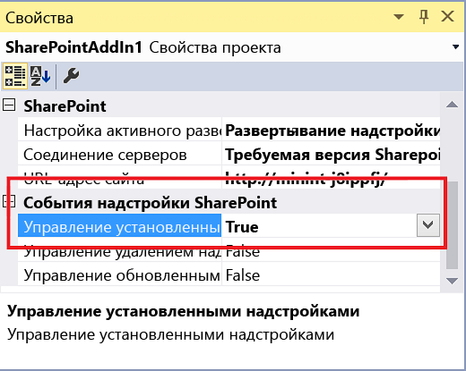

# <a name="create-an-add-in-event-receiver-in-sharepoint-add-ins"></a><span data-ttu-id="46197-103">Создание приемника событий в надстройках SharePoint</span><span class="sxs-lookup"><span data-stu-id="46197-103">Create an add-in event receiver in SharePoint Add-ins</span></span>

<span data-ttu-id="46197-104">Для начала желательно иметь представление о надстройках SharePoint с размещением у поставщика, а также разработать несколько надстроек, которые были бы хоть немного сложнее уровня "Hello World".</span><span class="sxs-lookup"><span data-stu-id="46197-104">It is helpful if you first have an understanding of provider-hosted SharePoint Add-ins, and for you to have developed a few that go a least a little beyond the "Hello World" level. Also, you should be familiar with  Handle events in SharePoint Add-ins.</span></span> <span data-ttu-id="46197-105">См. статью [Создание надстроек SharePoint, размещаемых у поставщика](get-started-creating-provider-hosted-sharepoint-add-ins.md).</span><span class="sxs-lookup"><span data-stu-id="46197-105">See  [Get started creating provider-hosted SharePoint Add-ins](get-started-creating-provider-hosted-sharepoint-add-ins.md).</span></span>

<span data-ttu-id="46197-106">Кроме того, следует ознакомиться со статьей [Обработка событий в надстройках SharePoint](handle-events-in-sharepoint-add-ins.md).</span><span class="sxs-lookup"><span data-stu-id="46197-106">Also, you should be familiar with [Handle events in SharePoint Add-ins](handle-events-in-sharepoint-add-ins.md).</span></span> 

## <a name="get-more-code-samples"></a><span data-ttu-id="46197-107">Дополнительные примеры кода</span><span class="sxs-lookup"><span data-stu-id="46197-107">Get more code samples</span></span>

<span data-ttu-id="46197-p102">Ознакомившись с развернутым примером, приведенным в этой статье, вы получите готовый пример кода. Ниже представлены другие примеры. Не все они соответствуют архитектуре, описанной в этой статье. Существует несколько хороших способов создать приемник событий надстроек. Кроме того, помните, что руководства от Майкрософт могут изменяться со временем.</span><span class="sxs-lookup"><span data-stu-id="46197-p102">If you work through the continuing example in this article, you will have a finished code sample. The following are some other samples. They don't all follow the architecture described in this article. There can be more than one good way to architect an add-in event receiver, and keep in mind also that Microsoft's guidance can evolve over time.</span></span> 

- <span data-ttu-id="46197-112">Пример кода [SharePoint/PnP/Samples/Core.AppEvents.HandlerDelegation](https://github.com/SharePoint/PnP/tree/master/Samples/Core.AppEvents.HandlerDelegation) наиболее близко соответствует примеру, приведенному в этой статье.</span><span class="sxs-lookup"><span data-stu-id="46197-112">[OfficeDev/PnP/Samples/Core.AppEvents.HandlerDelegation](https://github.com/SharePoint/PnP/tree/master/Samples/Core.AppEvents.HandlerDelegation) is a close match to the continuing example in this article.</span></span>
- <span data-ttu-id="46197-113">В [SharePoint/PnP/Samples/Core.AppEvents](https://github.com/SharePoint/PnP/tree/master/Samples/Core.AppEvents) показано, как решить задачу, аналогичную приведенной в предыдущем примере кода, когда нельзя использовать стратегию делегирования обработчиков.</span><span class="sxs-lookup"><span data-stu-id="46197-113">[OfficeDev/PnP/Samples/Core.AppEvents](https://github.com/SharePoint/PnP/tree/master/Samples/Core.AppEvents) shows how to do the same task as the preceding sample in scenarios where the handler delegation strategy cannot be used.</span></span>
- [<span data-ttu-id="46197-114">SharePoint/PnP/Samples/Core.EventReceivers</span><span class="sxs-lookup"><span data-stu-id="46197-114">SharePoint/PnP/Samples/Core.EventReceivers</span></span>](https://github.com/SharePoint/PnP/tree/master/Samples/Core.EventReceivers)
- [<span data-ttu-id="46197-115">Создание надстройки с размещением у поставщика, которая настраивает установку надстройки</span><span class="sxs-lookup"><span data-stu-id="46197-115">Create a provider-hosted add-in that customizes add-in installation</span></span>](https://code.msdn.microsoft.com/sharepoint-2013-create-a-f27752e0)
    

## <a name="add-an-add-in-installed-event-receiver"></a><span data-ttu-id="46197-116">Добавление приемника событий установки надстройки</span><span class="sxs-lookup"><span data-stu-id="46197-116">Add an add-in installed event receiver</span></span>

1. <span data-ttu-id="46197-p103">Откройте в Visual Studio проект размещаемого у поставщика Надстройка SharePoint (при добавлении обработчика события к надстройке, размещаемой в SharePoint, Инструменты разработчика Office для Visual Studio преобразует ее в надстройку, размещаемую у поставщика).</span><span class="sxs-lookup"><span data-stu-id="46197-p103">In Visual Studio, open the project for the provider-hosted SharePoint Add-in. (If you add an add-in event handler to a SharePoint-hosted add-in, the Office Developer Tools for Visual Studio convert it to a provider-hosted app.)</span></span>

2. <span data-ttu-id="46197-119">В **обозревателе решений** выберите узел для надстройки SharePoint.</span><span class="sxs-lookup"><span data-stu-id="46197-119">In **Solution Explorer**, choose the node for the SharePoint Add-in.</span></span>

3. <span data-ttu-id="46197-120">В окне **Свойства** задайте для параметра **Управление установленными надстройками** значение **True**.</span><span class="sxs-lookup"><span data-stu-id="46197-120">In the **Properties** window, set the value of **Handle Add-in Installed** to **True**.</span></span> 
    
    
 
    <span data-ttu-id="46197-122">Инструменты разработчика Office для Visual Studio делают следующее:</span><span class="sxs-lookup"><span data-stu-id="46197-122">The Office Developer Tools for Visual Studio will do the following:</span></span>

    - <span data-ttu-id="46197-123">Добавляют файл AppEventReceiver.svc, содержащий скелетный код на языке C# (или VB.NET).</span><span class="sxs-lookup"><span data-stu-id="46197-123">Add a file named AppEventReceiver.svc. that contains some skeletal C# (or VB.NET) code. This is the service that will handle the add-in event.</span></span> <span data-ttu-id="46197-124">Это служба, которая будет обрабатывать событие надстройки.</span><span class="sxs-lookup"><span data-stu-id="46197-124">This is the service that handles the add-in event.</span></span>

    - <span data-ttu-id="46197-125">Добавляют в раздел **Свойства** файла AppManifest.xml следующую запись: `<InstalledEventEndpoint>~remoteAppUrl/AppEventReceiver.svc</InstalledEventEndpoint>`.</span><span class="sxs-lookup"><span data-stu-id="46197-125">Add the following entry to the **Properties** section of the AppManifest.xml file: `<InstalledEventEndpoint>~remoteAppUrl/AppEventReceiver.svc</InstalledEventEndpoint>`.</span></span> <span data-ttu-id="46197-126">Она регистрирует приемник событий надстройки в SharePoint.</span><span class="sxs-lookup"><span data-stu-id="46197-126">This entry registers the add-in event receiver to SharePoint.</span></span> 
    
        > [!NOTE] 
        > <span data-ttu-id="46197-127">Маркер **~remoteAppUrl** также используется для удаленного веб-приложения в надстройке SharePoint с размещением у поставщика.</span><span class="sxs-lookup"><span data-stu-id="46197-127">The **~remoteAppUrl** token is the same one used for the remote web application in the provider-hosted SharePoint Add-in.</span></span> <span data-ttu-id="46197-128">Инструменты разработчика Office для Visual Studio предполагают, что домены веб-приложения и обработчика событий совпадают.</span><span class="sxs-lookup"><span data-stu-id="46197-128">The Office Developer Tools for Visual Studio assume the domain of the web application and the event handler is the same.</span></span> <span data-ttu-id="46197-129">В редких случаях, когда это не так, необходимо вручную заменить маркер **~remoteAppUrl** настоящим доменом службы.</span><span class="sxs-lookup"><span data-stu-id="46197-129">In the rare case where it is not, you need to manually replace the token **~remoteAppUrl** with the actual domain of your service.</span></span>
 
    - <span data-ttu-id="46197-130">Создают веб-проект, если в проекте надстройки SharePoint его еще нет.</span><span class="sxs-lookup"><span data-stu-id="46197-130">Create a web project if the SharePoint Add-in project doesn't already have one.</span></span> <span data-ttu-id="46197-131">Кроме того, эти инструменты также проверяют, настроен ли манифест надстройки для размещения у поставщика.</span><span class="sxs-lookup"><span data-stu-id="46197-131">The tools also ensure that an add-in manifest is configured for a provider-hosted add-in.</span></span> <span data-ttu-id="46197-132">Они также добавляют страницы, сценарии, CSS-файлы и другие артефакты.</span><span class="sxs-lookup"><span data-stu-id="46197-132">They also add pages, scripts, CSS files, and other artifacts.</span></span> <span data-ttu-id="46197-133">Если из удаленных компонентов надстройки требуется только веб-служба обработки событий, вы можете удалить их из проекта.</span><span class="sxs-lookup"><span data-stu-id="46197-133">If the only remote component that your add-in needs is the event-handling web service, you can delete these from the project.</span></span> <span data-ttu-id="46197-134">Кроме того, проверьте, чтобы элемент **StartPage** в манифесте надстройки не указывал на удаленную страницу.</span><span class="sxs-lookup"><span data-stu-id="46197-134">You also should ensure that the **StartPage** element in the add-in manifest is not pointing to a page that you have deleted.</span></span>
 
4. <span data-ttu-id="46197-135">Если Visual Studio и ваша тестовая ферма SharePoint развернуты на разных компьютерах, настройте проект для отладки с помощью служебной шины Microsoft Azure.</span><span class="sxs-lookup"><span data-stu-id="46197-135">If your test SharePoint farm is not on the same computer that is running Visual Studio, configure the project for debugging using the Microsoft Azure Service Bus. For more information, see  Debug and troubleshoot a remote event receiver in a SharePoint Add-in.</span></span> <span data-ttu-id="46197-136">Дополнительные сведения см. в статье [Устранение неполадок и отладка удаленного приемника событий в надстройке SharePoint](debug-and-troubleshoot-a-remote-event-receiver-in-a-sharepoint-add-in.md).</span><span class="sxs-lookup"><span data-stu-id="46197-136">[Debug and troubleshoot a remote event receiver in a SharePoint Add-in](debug-and-troubleshoot-a-remote-event-receiver-in-a-sharepoint-add-in.md)</span></span> 

5. <span data-ttu-id="46197-137">Если в файле AppEventReceiver.svc есть метод `ProcessOneWayEvent`, его реализация должна содержать только строку `throw new NotImplementedException();`, поскольку этот метод невозможно использовать в обработчике событий надстройки.</span><span class="sxs-lookup"><span data-stu-id="46197-137">If there is a  `ProcessOneWayEvent` method in the AppEventReceiver.svc file, it's implementation should consist of just the line `throw new NotImplementedException();`, because this method cannot be used in an add-in event handler.  Add-in event handlers have to return an object that tells SharePoint whether to finish or roll back the event and the   method doesn't return anything.</span></span> 

    <span data-ttu-id="46197-138">*Обработчики событий надстройки должны возвращать объект, который сообщает среде SharePoint, следует ли завершить событие или отменить его, а метод `ProcessOneWayEvent` не возвращает никаких данных.*</span><span class="sxs-lookup"><span data-stu-id="46197-138">If there is a   method in the AppEventReceiver.svc file, it's implementation should consist of just the line , because this method cannot be used in an add-in event handler.  *Add-in event handlers have to return an object that tells SharePoint whether to finish or roll back the event and the  `ProcessOneWayEvent` method doesn't return anything.*</span></span> 

6. <span data-ttu-id="46197-139">Файл будет включать метод `ProcessEvent`, который имеет следующий вид.</span><span class="sxs-lookup"><span data-stu-id="46197-139">The file includes a `ProcessEvent` method that looks something like the following.</span></span> <span data-ttu-id="46197-140">(Он также может содержать блок кода, который иллюстрирует получение контекста клиента.</span><span class="sxs-lookup"><span data-stu-id="46197-140">The file will include a   method that looks something like the following. (There may also a block of code that illustrates how to get a client context. Delete it or comment out.)</span></span> <span data-ttu-id="46197-141">Удалите или закомментируйте его.)</span><span class="sxs-lookup"><span data-stu-id="46197-141">Delete it or comment it out.)</span></span> 

    ```C#
    public SPRemoteEventResult ProcessEvent(SPRemoteEventProperties properties)
    {
        SPRemoteEventResult result = new SPRemoteEventResult();

        return result;
    }
    ``` 

    <span data-ttu-id="46197-142">Обратите внимание на следующие особенности этого кода:</span><span class="sxs-lookup"><span data-stu-id="46197-142">Note the following about this code:</span></span>

    - <span data-ttu-id="46197-143">Объект **SPRemoteEventProperties** отправляется веб-службе обработчика в виде сообщения SOAP, которое содержит контекстные сведения из SharePoint, включая свойство **EventType**, которое идентифицирует событие.</span><span class="sxs-lookup"><span data-stu-id="46197-143">The  **SPRemoteEventProperties** object is sent to your handler web service as a SOAP message that contains context information from SharePoint, including an **EventType** property that identifies the event.</span></span>
 
    - <span data-ttu-id="46197-144">Объект **SPRemoteEventResult**, возвращаемый обработчиком, содержит свойство **Status**, которое может принимать значения **SPRemoteEventServiceStatus.Continue**, **SPRemoteEventServiceStatus.CancelNoError** и **SPRemoteEventServiceStatus.CancelWithError**.</span><span class="sxs-lookup"><span data-stu-id="46197-144">The  SPRemoteEventResult object that your handler returns contains a Status property whose possible values are SPRemoteEventServiceStatus. Continue,  SPRemoteEventServiceStatus.CancelNoError, and  SPRemoteEventServiceStatus.CancelWithError. The default value of the  Status property is Continue, which tells SharePoint to finish the event. The other two values tell SharePoint to:</span></span> <span data-ttu-id="46197-145">По умолчанию свойство **Status** имеет значение **Continue**, которое сообщает среде SharePoint, что необходимо завершить событие.</span><span class="sxs-lookup"><span data-stu-id="46197-145">The default value of the **Status** property is **Continue**, which tells SharePoint to finish the event.</span></span> <span data-ttu-id="46197-146">Остальные два значения сообщают SharePoint, что нужно:</span><span class="sxs-lookup"><span data-stu-id="46197-146">The other two values tell SharePoint to:</span></span>
    
        - <span data-ttu-id="46197-147">Запустить обработчик еще три раза.</span><span class="sxs-lookup"><span data-stu-id="46197-147">Run your handler up to three more times.</span></span>
        - <span data-ttu-id="46197-148">Если обработчик по-прежнему получает состояние "Отмена", отмените событие и выполните полный откат всех изменений, выполненных в рамках этого события.</span><span class="sxs-lookup"><span data-stu-id="46197-148">If it is still getting a cancel status, cancel the event and roll back anything it has done as part of the event.</span></span> 

7. <span data-ttu-id="46197-149">Сразу после строки объявления переменной `result` добавьте следующую развилку, чтобы определить, какое событие обрабатывается.</span><span class="sxs-lookup"><span data-stu-id="46197-149">Immediately below the line that declares the  `result` variable, add the following switch structure to identify which event is being handled.</span></span>
        
    ```C#
    switch (properties.EventType)
    {
        case SPRemoteEventType.AppInstalled:
            break;
        case SPRemoteEventType.AppUpgraded:
            break;
        case SPRemoteEventType.AppUninstalling:
            break;
    }
    ```

    > [!NOTE] 
    > <span data-ttu-id="46197-150">Если у вас есть обработчики для событий **AppInstalled**, **AppUpdated** и **AppInstalling**, каждый из них получает собственный URL-адрес, зарегистрированный в манифесте надстройки.</span><span class="sxs-lookup"><span data-stu-id="46197-150">If you have handlers for the **AppInstalled**, **AppUpdated**, and **AppInstalling** events, they each get their own URL registered in the add-in manifest.</span></span> <span data-ttu-id="46197-151">Таким образом, они *могут* иметь разные конечные точки, но в этой статье (и Инструментах разработки Office для Visual Studio) предполагается, что они имеют одну и ту же конечную точку, поэтому в коде должно быть определено, какое событие ее вызвало.</span><span class="sxs-lookup"><span data-stu-id="46197-151">Note The AppInstalled, AppUpdated, and AppInstalling events, if you have handlers for them, will each get their own URL registered in the add-in manifest. So you *can*  have different endpoints for them; but this article (and the Office Developer Tools for Visual Studio) assume they have exactly the same endpoint; that's why the code needs to determine which event called it.</span></span>

8. <span data-ttu-id="46197-152">Как объясняется в разделе [Включение логики отката и логики проверки выполненных действий в обработчики событий надстроек](handle-events-in-sharepoint-add-ins.md#Rollback), если в логике установки происходит сбой, почти всегда следует отменять установку: среда SharePoint должна отменить действия, выполненные для установки, а вам нужно отменить все действия, выполненные обработчиком.</span><span class="sxs-lookup"><span data-stu-id="46197-152">As explained in  [Include rollback logic and "already done" logic in your add-in event handlers](handle-events-in-sharepoint-add-ins.md#Rollback), if anything goes wrong in your installation logic, you almost always want the add-in installation canceled, and you want SharePoint to roll back what it has done for the installation, and you want to roll back what your handler has done. One way to accomplish these goals is to add the following code inside the  case for the AppInstalled event.</span></span> 

    <span data-ttu-id="46197-153">Для этого можно добавить следующий код в оператор **case** для события AppInstalled.</span><span class="sxs-lookup"><span data-stu-id="46197-153">One way to accomplish these goals is to add the following code inside the **case** for the AppInstalled event.</span></span>
    
    ```C#
    case SPRemoteEventType.AppInstalled:
    try
    {
        // Add-in installed event logic goes here.
    }
    catch (Exception e)
    {
        result.ErrorMessage = e.ErrorMessage;
        result.Status = SPRemoteEventServiceStatus.CancelWithError;

        // Rollback logic goes here.
    }
    break;
    ```

    > [!NOTE] 
    > <span data-ttu-id="46197-154">Переместите код установки, который занимает более 30 секунд, в саму надстройку.</span><span class="sxs-lookup"><span data-stu-id="46197-154">Move installation code that takes more than 30 seconds into the add-in itself.</span></span> <span data-ttu-id="46197-155">Вы можете добавить его в код, выполняемый при первом запуске надстройки.</span><span class="sxs-lookup"><span data-stu-id="46197-155">You can add it to "first run" logic that executes the first time the add-in runs.</span></span> <span data-ttu-id="46197-156">Надстройка может показывать сообщение типа "Идет подготовка".</span><span class="sxs-lookup"><span data-stu-id="46197-156">The add-in can display a message saying something like "We're getting things ready for you."</span></span> <span data-ttu-id="46197-157">Кроме того, надстройка может предложить пользователю запустить код инициализации.</span><span class="sxs-lookup"><span data-stu-id="46197-157">Alternatively, the add-in can prompt the user to run the initialization code.</span></span>
    
    > <span data-ttu-id="46197-158">Если логика первого запуска не подходит для вашей надстройки, обработчик события может запускать удаленный асинхронный процесс, а затем сразу возвращать объект **SPRemoteEventResult**, где для свойства **Status** задано значение **Continue**.</span><span class="sxs-lookup"><span data-stu-id="46197-158">If "first run" logic is not feasible for your add-in, another option is to have your event handler start a remote asynchronous process and then immediately return a  **SPRemoteEventResult** object with the **Status** set to **Continue**. A weakness of this strategy is that if the remote process fails, it has no way to tell SharePoint to roll back the add-in installation.</span></span> <span data-ttu-id="46197-159">Недостаток этого подхода заключается в том, что невозможно сообщить среде SharePoint о необходимости отменить установку надстройки.</span><span class="sxs-lookup"><span data-stu-id="46197-159">A weakness of this strategy is that if the remote process fails, it has no way to tell SharePoint to roll back the add-in installation.</span></span>

9. <span data-ttu-id="46197-160">Как описано в разделе [Стратегии архитектуры обработчиков событий надстройки](handle-events-in-sharepoint-add-ins.md#Strategies), стратегия делегирования обработчиков предпочтительна, но ее можно использовать не во всех сценариях.</span><span class="sxs-lookup"><span data-stu-id="46197-160">As explained in [Add-in event handler architecture strategies](handle-events-in-sharepoint-add-ins.md#Strategies), the handler delegation strategy is preferred, although not possible in every scenario.</span></span> <span data-ttu-id="46197-161">В данном примере показано, как реализовать стратегию делегирования обработчиков при добавлении списка на хост-сайт.</span><span class="sxs-lookup"><span data-stu-id="46197-161">In the continuing example, we show you how to implement the handler delegation strategy when adding a list to the host web.</span></span> <span data-ttu-id="46197-162">Сведения о том, как создать похожий обработчик события AppInstalled, не использующий стратегию делегирования обработчиков, см. в примере [SharePoint/PnP/Samples/Core.AppEvents](https://github.com/SharePoint/PnP/tree/master/Samples/Core.AppEvents).</span><span class="sxs-lookup"><span data-stu-id="46197-162">For information about how to create a similar AppInstalled event handler that does not use the handler delegation strategy, see the sample  [SharePoint/PnP/Samples/Core.AppEvents](https://github.com/SharePoint/PnP/tree/master/Samples/Core.AppEvents).</span></span>
    
    <span data-ttu-id="46197-163">Ниже представлена новая версия блока **case** для события AppInstalled.</span><span class="sxs-lookup"><span data-stu-id="46197-163">The following is the new version of the AppInstalled **case** block.</span></span> <span data-ttu-id="46197-164">Обратите внимание, что логика инициализации, которая применяется ко всем событиям, находится над блоком **switch**.</span><span class="sxs-lookup"><span data-stu-id="46197-164">Note that initialization logic that applies to all events goes above the **switch** block.</span></span> <span data-ttu-id="46197-165">Так как устанавливаемый список удаляется в обработчике события AppUninstalling, этот список определяется там же.</span><span class="sxs-lookup"><span data-stu-id="46197-165">Because the same list that is installed is removed in the AppUninstalling handler, the list is identified there.</span></span>

    ```C#
    SPRemoteEventResult result = new SPRemoteEventResult();
    String listTitle = "MyList";

    switch (properties.EventType)
    {               
        case SPRemoteEventType.AppInstalled:
                        
    try
    {
            string error = TryCreateList(listTitle, properties);
            if (error != String.Empty)
            {
                throw new Exception(error);            
            }
    }
        catch (Exception e)
    {
            // Tell SharePoint to cancel the event.
            result.ErrorMessage = e.Message;
            result.Status = SPRemoteEventServiceStatus.CancelWithError;               
        }
            break;
        case SPRemoteEventType.AppUpgraded:
        break;
        case SPRemoteEventType.AppUninstalling:
        break;
    }                      
    ```

10. <span data-ttu-id="46197-p116">Добавьте метод создания списка в класс **AppEventReceiver** как метод **private** со следующим кодом. Обратите внимание, что класс `TokenHelper` содержит специальный метод, оптимизированный для получения контекста клиента для события надстройки. Значение **false** для последнего параметра указывает, что контекст предназначен для хост-сайта.</span><span class="sxs-lookup"><span data-stu-id="46197-p116">Add the list creation method to the **AppEventReceiver** class as a **private** method with the following code. Note that the `TokenHelper` class has a special method that is optimized for getting a client context for an add-in event. Passing **false** for the last parameter ensures that the context is for the host web.</span></span>
    
    ```C#
    private string TryCreateList(String listTitle, SPRemoteEventProperties properties)
    {    
        string errorMessage = String.Empty;          

        using (ClientContext clientContext =
            TokenHelper.CreateAppEventClientContext(properties, useAppWeb: false))
        {
            if (clientContext != null)
            {
            }
        }
        return errorMessage;
    }

    ```

11. <span data-ttu-id="46197-169">Логика отката, по сути, является логикой обработки исключений, а SharePoint CSOM (клиентская объектная модель) включает область **ExceptionHandlingScope**, которая позволяет веб-службе делегировать обработку исключений серверу SharePoint (см. статью [Использование области обработки исключений](http://msdn.microsoft.com/library/103619ef-1ba3-44e3-93e1-5e0685bc616e%28Office.15%29.aspx)).</span><span class="sxs-lookup"><span data-stu-id="46197-169">Rollback logic is basically exception handling logic and the SharePoint CSOM (Client-side object model) has a  **ExceptionHandlingScope** that enables your web service to delegate exception handling to the SharePoint server. (See also, [How to: Use Exception Handling Scope](http://msdn.microsoft.com/library/103619ef-1ba3-44e3-93e1-5e0685bc616e%28Office.15%29.aspx).) Add the following code to the if block in the preceding snippet.</span></span> 

    <span data-ttu-id="46197-170">Добавьте следующий код в блок **if** предыдущего фрагмента.</span><span class="sxs-lookup"><span data-stu-id="46197-170">Add the following code to the **if** block in the preceding snippet.</span></span>
    
    ```C#
    ExceptionHandlingScope scope = new ExceptionHandlingScope(clientContext); 

    using (scope.StartScope()) 
    { 
        using (scope.StartTry()) 
        { 
        }         
        using (scope.StartCatch()) 
        {                                 
        } 
        using (scope.StartFinally()) 
        { 
        } 
    } 
    clientContext.ExecuteQuery();

    if (scope.HasException)
    {
        errorMessage = String.Format("{0}: {1}; {2}; {3}; {4}; {5}", 
            scope.ServerErrorTypeName, scope.ErrorMessage, 
            scope.ServerErrorDetails, scope.ServerErrorValue, 
            scope.ServerStackTrace, scope.ServerErrorCode);
    }
    ```

12. <span data-ttu-id="46197-171">Предыдущий фрагмент содержит только один вызов SharePoint (**ExecuteQuery**), и этого недостаточно.</span><span class="sxs-lookup"><span data-stu-id="46197-171">There is only one call to SharePoint (**ExecuteQuery**) in the preceding snippet, but unfortunately we can't quite do with only one.</span></span> <span data-ttu-id="46197-172">Каждый объект, который будет указан в области исключений, необходимо сначала загрузить в клиент.</span><span class="sxs-lookup"><span data-stu-id="46197-172">Every object that is going to be referenced in our exception scope has to first be loaded to the client.</span></span> 

    <span data-ttu-id="46197-173">Добавьте следующий код *перед* конструктором **ExceptionHandlingScope**.</span><span class="sxs-lookup"><span data-stu-id="46197-173">Add the following code *above* the constructor for the **ExceptionHandlingScope**.</span></span>
    
    ```C#
    ListCollection allLists = clientContext.Web.Lists;
    IEnumerable<List> matchingLists =
        clientContext.LoadQuery(allLists.Where(list => list.Title == listTitle));
    clientContext.ExecuteQuery();

    var foundList = matchingLists.FirstOrDefault();
    List createdList = null;
    ```

13. <span data-ttu-id="46197-174">Код для создания списка хост-сайтов добавляется в блок **StartTry**, но сначала код должен проверить, был ли этот список уже добавлен (как описывается в разделе [Включение логики отката и логики проверки выполненных действий в обработчики событий надстроек](handle-events-in-sharepoint-add-ins.md#Rollback)).</span><span class="sxs-lookup"><span data-stu-id="46197-174">The code to create a host web list will go into the  **StartTry** block, but the code must first check whether the list has already been added (as explained in [Include rollback logic and "already done" logic in your add-in event handlers](handle-events-in-sharepoint-add-ins.md#Rollback)). If-then-else logic can be delegated to the SharePoint server by using the  ConditionalScope class. (See also, How to: Use Conditional Scope.) Add the following code inside the  StartTry block.</span></span> <span data-ttu-id="46197-175">Логику If-Then-Else можно делегировать серверу SharePoint с помощью класса **ConditionalScope** (см. статью [Использование условной области](http://msdn.microsoft.com/library/560112e9-c3ed-4b8f-9cd4-c8bc5d60d63c%28Office.15%29.aspx)).</span><span class="sxs-lookup"><span data-stu-id="46197-175">If-then-else logic can be delegated to the SharePoint server by using the **ConditionalScope** class (see [How to: Use Conditional Scope](http://msdn.microsoft.com/library/560112e9-c3ed-4b8f-9cd4-c8bc5d60d63c%28Office.15%29.aspx)).</span></span> 

    <span data-ttu-id="46197-176">Добавьте следующий код в блок **StartTry**.</span><span class="sxs-lookup"><span data-stu-id="46197-176">Add the following code inside the **** element:</span></span>
    
    ```C#
    ConditionalScope condScope = new ConditionalScope(clientContext, 
            () => foundList.ServerObjectIsNull.Value == true, true);
    using (condScope.StartScope())
    {
        ListCreationInformation listInfo = new ListCreationInformation();
        listInfo.Title = listTitle;
        listInfo.TemplateType = (int)ListTemplateType.GenericList;
        listInfo.Url = listTitle;
        createdList = clientContext.Web.Lists.Add(listInfo);                                
    }
    ```

14. <span data-ttu-id="46197-177">Блок **StartCatch** должен отменить создание списка, но для начала он должен проверить, создан ли список, так как исключение могло быть выдано в блоке **StartTry** до завершения создания списка.</span><span class="sxs-lookup"><span data-stu-id="46197-177">The  **StartCatch** block should undo the creation of the list, but it needs to first check that the list was created, because an exception might have been thrown in the **StartTry** block before it finished creating the list. Add the following code to the StartCatch block.</span></span> 

    <span data-ttu-id="46197-178">Добавьте следующий код в блок **StartCatch**.</span><span class="sxs-lookup"><span data-stu-id="46197-178">Add the following code to the **Elements** file.</span></span>
    
    ```C#
    ConditionalScope condScope = new ConditionalScope(clientContext, 
            () => createdList.ServerObjectIsNull.Value != true, true);
    using (condScope.StartScope())
    {
        createdList.DeleteObject();
    } 
    ```

    > [!TIP] 
    > <span data-ttu-id="46197-179">**УСТРАНЕНИЕ НЕПОЛАДОК.** Чтобы проверить, вводится ли ваш блок **StartCatch**, когда положено, вам необходимо вызвать исключение среды выполнения на сервере SharePoint.</span><span class="sxs-lookup"><span data-stu-id="46197-179">**TROUBLESHOOTING:** To test whether your **StartCatch** block is entered when it should be, you need a way to throw a runtime exception on the SharePoint server.</span></span> <span data-ttu-id="46197-180">Использование **throw** или деления на нуль не дадут нужного результата, поскольку они вызовут исключения *на стороне клиента*, прежде чем клиентская среда выполнения сможет упаковать код и отправить его на сервер (с помощью метода **ExecuteQuery**).</span><span class="sxs-lookup"><span data-stu-id="46197-180">Using a **throw** or dividing by zero won't work because they cause *client-side* exceptions before the client runtime can even bundle up the code and send it to the server (with the **ExecuteQuery** method).</span></span> 
    
    > <span data-ttu-id="46197-181">Вместо этого добавьте в блок **StartTry** следующие строки.</span><span class="sxs-lookup"><span data-stu-id="46197-181">Instead, add the following lines to the **StartTry** block.</span></span> <span data-ttu-id="46197-182">Среда выполнения на стороне клиента принимает этот код, но он приводит к исключению на стороне сервера, что вам и нужно.</span><span class="sxs-lookup"><span data-stu-id="46197-182">The client-side runtime accepts this, but it causes a server-side exception, which is what you want.</span></span> 
    
    > `List fakeList = clientContext.Web.Lists.GetByTitle("NoSuchList");`
    
    > `clientContext.Load(fakeList);`

<span data-ttu-id="46197-183">Весь метод TryCreateList должен выглядеть следующим образом.</span><span class="sxs-lookup"><span data-stu-id="46197-183">The entire method should now look like the following.</span></span> <span data-ttu-id="46197-184">(Блок **StartFinally** является обязательным, даже если он не используется.)</span><span class="sxs-lookup"><span data-stu-id="46197-184">The entire TryCreateList method should look like the following. (The  **StartFinally** block is required even when it is not being used.)</span></span>
    
```C#
    private string TryCreateList(String listTitle, SPRemoteEventProperties properties)
    {    
        string errorMessage = String.Empty;  

        using (ClientContext clientContext = 
            TokenHelper.CreateAppEventClientContext(properties, useAppWeb: false))
        {
            if (clientContext != null)
            {
                ListCollection allLists = clientContext.Web.Lists;
                IEnumerable<List> matchingLists = 
                    clientContext.LoadQuery(allLists.Where(list => list.Title == listTitle));
                clientContext.ExecuteQuery();
                var foundList = matchingLists.FirstOrDefault();
                List createdList = null;

                ExceptionHandlingScope scope = new ExceptionHandlingScope(clientContext); 
                using (scope.StartScope()) 
                { 
                    using (scope.StartTry()) 
                    { 
                        ConditionalScope condScope = new ConditionalScope(clientContext, 
                                () => foundList.ServerObjectIsNull.Value == true, true);  
                        using (condScope.StartScope())
                        {
                            ListCreationInformation listInfo = new ListCreationInformation();
                            listInfo.Title = listTitle;
                            listInfo.TemplateType = (int)ListTemplateType.GenericList;
                            listInfo.Url = listTitle;
                            createdList = clientContext.Web.Lists.Add(listInfo);
                        }
                    } 
                    
                    using (scope.StartCatch()) 
                    { 
                        ConditionalScope condScope = new ConditionalScope(clientContext, 
                                () => createdList.ServerObjectIsNull.Value != true, true);
                        using (condScope.StartScope())
                        {
                            createdList.DeleteObject();
                        }    
                    } 

                    using (scope.StartFinally()) 
                    { 
                    } 
                } 
                clientContext.ExecuteQuery();

                if (scope.HasException)
                {
                        errorMessage = String.Format("{0}: {1}; {2}; {3}; {4}; {5}", 
                        scope.ServerErrorTypeName, scope.ErrorMessage, 
                        scope.ServerErrorDetails, scope.ServerErrorValue, 
                        scope.ServerStackTrace, scope.ServerErrorCode);
                }
            }
        }
        return errorMessage;
    }
```

<br/>

> [!TIP] 
> <span data-ttu-id="46197-185">**ОТЛАДКА.** Независимо от того, используется ли стратегия делегирования обработчиков, при пошаговой отладке кода с помощью отладчика помните, что когда обработчик возвращает состояние отмены, SharePoint повторно вызывает обработчик еще три раза.</span><span class="sxs-lookup"><span data-stu-id="46197-185">**DEBUGGING:** Regardless of whether you are using the handler delegation strategy, when you are stepping through the code with the debugger, keep in mind that, in any scenario in which your handler returns a cancel status, SharePoint is going to call your handler again, up to three more times. So the debugger will cycle through the code up to four times.</span></span> <span data-ttu-id="46197-186">Поэтому отладчик может проходить код до четырех раз.</span><span class="sxs-lookup"><span data-stu-id="46197-186">So the debugger cycles through the code up to four times.</span></span>

> [!TIP] 
> <span data-ttu-id="46197-187">**АРХИТЕКТУРА КОДА.** Поскольку вы можете устанавливать компоненты на сайте надстройки с описательной разметкой вне обработчика, вам вряд ли понадобится использовать 30 секунд, доступные обработчику для взаимодействия с сайтом надстройки.</span><span class="sxs-lookup"><span data-stu-id="46197-187">**CODE ARCHITECTURE:** Because you can install components on the add-in web with declarative markup outside your handler, you usually won't want to use up any of the 30 seconds your handler has available to interact with the add-in web.</span></span> <span data-ttu-id="46197-188">Но если это произойдет, помните, что коду требуется отдельный объект **ClientContext** для сайта надстройки.</span><span class="sxs-lookup"><span data-stu-id="46197-188">But if you do, keep in mind that your code requires a separate **ClientContext** object for the add-in web.</span></span> <span data-ttu-id="46197-189">Это означает, что сайт надстройки и хост-сайт отличаются друг от друга так же, как база данных SQL Server отличается от каждого из этих компонентов.</span><span class="sxs-lookup"><span data-stu-id="46197-189">This means that the add-in web and host web are different components, just as much as a SQL Server database is different from each of them.</span></span> <span data-ttu-id="46197-190">Таким образом, метод, который отправляет вызов на сайт надстройки, находится в блоке **try** блока **case** для события AppInstalled, как и метод TryCreateList в следующем примере.</span><span class="sxs-lookup"><span data-stu-id="46197-190">So a method that calls to the add-in web is in the **try** block of the AppInstalled **case** block, just like the TryCreateList method in the continuing example.</span></span> <span data-ttu-id="46197-191">Однако обработчику *не* требуется отменять действия, выполненные на сайте надстройки.</span><span class="sxs-lookup"><span data-stu-id="46197-191">However, your handler does *not*  need to roll back actions taken on the add-in web.</span></span> <span data-ttu-id="46197-192">Если он обнаруживает ошибку, он просто отменяет событие, так как SharePoint удаляет весь сайт надстройки в случае отмены события.</span><span class="sxs-lookup"><span data-stu-id="46197-192">If it encounters an error, it only needs to cancel the event, because SharePoint deletes the entire add-in web if the event is cancelled.</span></span>

## <a name="create-an-add-in-uninstalling-event-receiver"></a><span data-ttu-id="46197-193">Создание приемника событий удаления надстройки</span><span class="sxs-lookup"><span data-stu-id="46197-193">Create an add-in uninstalling event receiver</span></span>

1. <span data-ttu-id="46197-194">Задайте для свойства **Управление удалением надстроек** проекта значение **True**.</span><span class="sxs-lookup"><span data-stu-id="46197-194">Set the **Handle Add-in Uninstalling** property of the project to **True**.</span></span> <span data-ttu-id="46197-195">Инструменты *не* создают еще один файл веб-службы, если такой файл уже существует, но добавляют элемент **UninstallingEventEndpoint** в манифест надстройки.</span><span class="sxs-lookup"><span data-stu-id="46197-195">Set the  Handle Add-in Uninstalling property of the project to True. The tools do  *not*  create another web service file, if one already exists; but they do add an **UninstallingEventEndpoint** element to the add-in manifest.</span></span>

2. <span data-ttu-id="46197-196">Код в блоке **case** события AppUninstalling должен удалять элементы надстройки, в которых нет необходимости после удаления этой надстройки из второй корзины.</span><span class="sxs-lookup"><span data-stu-id="46197-196">Code in the AppUninstalling **case** block should remove artifacts of the add-in that aren't needed after the add-in is removed from the second stage recycle bin, which is what triggers the event.</span></span> <span data-ttu-id="46197-197">Тем не менее, по мере возможности следует "прекращать использование" компонентов, а не полностью удалять их.</span><span class="sxs-lookup"><span data-stu-id="46197-197">However, whenever possible, you need to "retire" the components rather than totally delete them.</span></span> <span data-ttu-id="46197-198">Это связано с тем, что в случае отмены события удаления их потребуется восстановить.</span><span class="sxs-lookup"><span data-stu-id="46197-198">This is because you need to restore them if the uninstalling event has to be rolled back.</span></span> <span data-ttu-id="46197-199">В этом случае надстройка останется во второй корзине, а пользователь сможет восстановить ее и использовать снова.</span><span class="sxs-lookup"><span data-stu-id="46197-199">If that happens, the add-in is still in the second stage recycle bin, and a user could restore it and start using it again.</span></span> <span data-ttu-id="46197-200">Для восстановления работоспособности надстройки может быть достаточно заново создать удаленный компонент, но все данные и параметры конфигурации в компоненте будут потеряны.</span><span class="sxs-lookup"><span data-stu-id="46197-200">Merely recreating a deleted component in your rollback logic might be enough to enable the add-in to work again, but any data or configuration settings in the component would be lost.</span></span>
    
    <span data-ttu-id="46197-201">Эту стратегию относительно легко использовать для компонентов SharePoint, так как в SharePoint есть корзина, из которой можно восстанавливать объекты, а также существуют API-интерфейсы CSOM для доступа к ней.</span><span class="sxs-lookup"><span data-stu-id="46197-201">This strategy is relatively easy for SharePoint components, because SharePoint has a recycle bin from which things can be restored, and there are CSOM APIs for accessing it.</span></span> <span data-ttu-id="46197-202">В следующих разделах показано, как это сделать.</span><span class="sxs-lookup"><span data-stu-id="46197-202">Later steps of this procedure show how.</span></span> <span data-ttu-id="46197-203">Для других платформ могут потребоваться другие методы.</span><span class="sxs-lookup"><span data-stu-id="46197-203">For other platforms, different techniques may be needed.</span></span> <span data-ttu-id="46197-204">Например, если вам нужно удалить строку из таблицы SQL Server в обработчике удаления надстройки, хранимая процедура T-SQL в обработчике может добавить в таблицу столбец IsDeleted и присвоить ему значение **True** в этой строке.</span><span class="sxs-lookup"><span data-stu-id="46197-204">For example, if you want to retire a row in a SQL Server table in your add-in uninstalling handler, a T-SQL stored procedure in the handler can add an IsDeleted column to the table and set it to **True** for the row.</span></span> <span data-ttu-id="46197-205">Если происходит ошибка, логика отката восстанавливает значение **False**.</span><span class="sxs-lookup"><span data-stu-id="46197-205">If the procedure encounters an error, the rollback logic resets the value to **False**.</span></span> <span data-ttu-id="46197-206">Если процедура завершается без ошибок, то непосредственно перед возвратом соответствующего флага она может задать таймер, чтобы удалить эту строку позже.</span><span class="sxs-lookup"><span data-stu-id="46197-206">If the procedure completes without error, just before it returns a success flag, it can set a timer job to delete the row later.</span></span>
    
    <span data-ttu-id="46197-207">Иногда требуется сохранить данные, например списки, даже после удаления надстройки; однако в качестве примера ниже представлен обработчик события, который удаляет список, созданный обработчиком события установки.</span><span class="sxs-lookup"><span data-stu-id="46197-207">Sometimes you want to keep data, such as lists, even after the add-in is deleted; but as an example for this article, the following is an uninstalling event handler that deletes the list that was created with the installed event handler.</span></span>

    ```C#
    case SPRemoteEventType.AppUninstalling:

    try
    {
        string error = TryRecycleList(listTitle, properties);
        if (error != String.Empty)
        {
            throw new Exception(error);
        }
    }
    catch (Exception e)
    {
        // Tell SharePoint to cancel the event.
        result.ErrorMessage = e.Message;
        result.Status = SPRemoteEventServiceStatus.CancelWithError;
    }
    break;
    ```

3. <span data-ttu-id="46197-p127">Добавьте вспомогательный метод для повторного использования списка. Обратите внимание на следующие особенности этого кода:</span><span class="sxs-lookup"><span data-stu-id="46197-p127">Add the helper method for recycling the list. Note the following about this code:</span></span>
    
    - <span data-ttu-id="46197-p128">Код перемещает список в корзину, а не безвозвратно удаляет его. Это позволяет восстановить его, включая все данные, в случае сбоя события, что и делает блок **StartCatch**. Таким образом, если метод выполнится успешно, а событие завершится, то надстройка будет безвозвратно удалена со второго уровня корзины, но список останется на первом ее уровне.</span><span class="sxs-lookup"><span data-stu-id="46197-p128">The code recycles the list, instead of permanently deleting it. This makes it possible to restore it, including its data, if the event fails, which is what the **StartCatch** block does. So, if the method succeeds and the event completes, the add-in is permanently deleted from the second stage recycle bin, but the list is still in the first stage recycle bin.</span></span>
    
    - <span data-ttu-id="46197-p129">Код проверяет наличие списка, прежде чем удалять его, поскольку пользователь уже мог удалить список с помощью пользовательского интерфейса SharePoint. Аналогичным образом, код отката проверяет наличие списка в корзине, прежде чем восстанавливать его, поскольку пользователь мог восстановить список или переместить его на второй уровень корзины.</span><span class="sxs-lookup"><span data-stu-id="46197-p129">The code tests for the existence of the list before it recycles it because a user might have already recycled it in the SharePoint UI. Similiarly, the rollback code checks for the existence of the list in the recycle bin before it restores it, because a user might have already restored it or moved it to the second-stage recycle bin.</span></span> 
    
    - <span data-ttu-id="46197-215">Есть две условные области, которые проверяют существование списка, определяя, имеет ли ссылка на него значение **null**.</span><span class="sxs-lookup"><span data-stu-id="46197-215">There are two conditional scopes that test for a list's existence by checking to see if a reference to it is **null**.</span></span> <span data-ttu-id="46197-216">Но обе области содержат внутренний блок **if**, который повторно проверяет тот же объект на нулевое значение.</span><span class="sxs-lookup"><span data-stu-id="46197-216">But both of them have an inner **if** block that tests the very same object for nullity a second time.</span></span> <span data-ttu-id="46197-217">Внешние проверки с блоками условных областей выполняются на сервере, но внутренние проверки на нулевое значение также необходимы.</span><span class="sxs-lookup"><span data-stu-id="46197-217">The outer tests, with conditional scope blocks, run on the server, but the inner nullity tests are also needed.</span></span> <span data-ttu-id="46197-218">Это связано с тем, что среда выполнения клиента построчно просматривает код для создания XML-сообщения, которое метод **ExecuteQuery** отправит на сервер.</span><span class="sxs-lookup"><span data-stu-id="46197-218">This is because the client runtime moves through the code line-by-line to create the XML message that the **ExecuteQuery** method sends to the server.</span></span> <span data-ttu-id="46197-219">По достижении ссылок на объекты **foundList** и **recycledList** одна из этих строк вызывает исключение Null Reference, если они не заключены во внутренние проверки на нулевые значения.</span><span class="sxs-lookup"><span data-stu-id="46197-219">When the references to the **foundList** and **recycledList** objects are reached, one or another of these lines throws a Null Reference exception unless they are encased inside the inner nullity checks.</span></span>
 
        ```C#
        private string TryRecycleList(String listTitle, SPRemoteEventProperties properties)
        {
            string errorMessage = String.Empty;

            using (ClientContext clientContext = 
                TokenHelper.CreateAppEventClientContext(properties, useAppWeb: false))
            {
                if (clientContext != null)
                {
                    ListCollection allLists = clientContext.Web.Lists;
                    IEnumerable<List> matchingLists = 
                        clientContext.LoadQuery(allLists.Where(list => list.Title == listTitle));
                    RecycleBinItemCollection bin = clientContext.Web.RecycleBin;
                    IEnumerable<RecycleBinItem> matchingRecycleBinItems = 
                        clientContext.LoadQuery(bin.Where(item => item.Title == listTitle));        
                    clientContext.ExecuteQuery();

                    List foundList = matchingLists.FirstOrDefault();
                    RecycleBinItem recycledList = matchingRecycleBinItems.FirstOrDefault();    

                    ExceptionHandlingScope scope = new ExceptionHandlingScope(clientContext);
                    using (scope.StartScope())
                    {
                        using (scope.StartTry())
                        {
                            ConditionalScope condScope = new ConditionalScope(clientContext, 
                                () => foundList.ServerObjectIsNull.Value == false, true);
                            using (condScope.StartScope())
                            {
                                if (foundList != null)
                                {
                                    foundList.Recycle();
                                }
                            }
                        }
                        using (scope.StartCatch())
                        {
                            ConditionalScope condScope = new ConditionalScope(clientContext, 
                                () => recycledList.ServerObjectIsNull.Value == false, true);
                            using (condScope.StartScope())
                            {
                                if (recycledList != null)
                                {
                                    recycledList.Restore(); 
                                }
                            }
                        }
                        using (scope.StartFinally())
                        {
                        }
                    }
                    clientContext.ExecuteQuery();

                    if (scope.HasException)
                    {
                        errorMessage = String.Format("{0}: {1}; {2}; {3}; {4}; {5}", 
                            scope.ServerErrorTypeName, scope.ErrorMessage, 
                            scope.ServerErrorDetails, scope.ServerErrorValue, 
                            scope.ServerStackTrace, scope.ServerErrorCode);
                    }
                }
            }
            return errorMessage;
        }
        ```


### <a name="to-debug-and-test-an-add-in-uninstalling-event-receiver"></a><span data-ttu-id="46197-220">Отладка и проверка приемника событий удаления надстройки</span><span class="sxs-lookup"><span data-stu-id="46197-220">To debug and test an add-in uninstalling event receiver</span></span>

1. <span data-ttu-id="46197-221">Откройте все перечисленные ниже страницы в отдельных окнах или вкладках.</span><span class="sxs-lookup"><span data-stu-id="46197-221">Open all of the following pages in separate windows or tabs:</span></span>
    
    - <span data-ttu-id="46197-222">Содержимое сайта.</span><span class="sxs-lookup"><span data-stu-id="46197-222">Site Contents</span></span>
    - <span data-ttu-id="46197-223">Содержимое сайта — Корзина (_layouts/15/AdminRecycleBin.aspx?ql=1).</span><span class="sxs-lookup"><span data-stu-id="46197-223">Site Settings - Recycle Bin (_layouts/15/AdminRecycleBin.aspx?ql=1)</span></span>
    - <span data-ttu-id="46197-224">Корзина — Вторая корзина (_layouts/15/AdminRecycleBin.aspxView=2&amp;?ql=1).</span><span class="sxs-lookup"><span data-stu-id="46197-224">Recycle Bin - Second-Stage Recycle Bin (_layouts/15/AdminRecycleBin.aspxView=2&amp;?ql=1)</span></span>
    
 
2. <span data-ttu-id="46197-225">Нажмите клавишу F5 и укажите, что необходимо доверять надстройке.</span><span class="sxs-lookup"><span data-stu-id="46197-225">Select F5 and trust the add-in when prompted.</span></span> <span data-ttu-id="46197-226">Откроется начальная страница надстройки.</span><span class="sxs-lookup"><span data-stu-id="46197-226">The add-in's start page opens.</span></span> <span data-ttu-id="46197-227">Если вы собираетесь лишь протестировать обработчик удаления, окно браузера можно закрыть.</span><span class="sxs-lookup"><span data-stu-id="46197-227">If you are only going to test the uninstallation handler, you can close this browser window.</span></span> <span data-ttu-id="46197-228">*Но если вы отлаживаете обработчик, оставьте его открытым. При закрытии окна сеанс отладки завершится.*</span><span class="sxs-lookup"><span data-stu-id="46197-228">*But if you are debugging the handler, leave it open. Closing it will end the debugging session.*</span></span> 
    
3. <span data-ttu-id="46197-229">Обновите страницу "Содержимое сайта", а когда появится надстройка, удалите ее.</span><span class="sxs-lookup"><span data-stu-id="46197-229">Refresh the  Site Contents page, and when the add-in appears, remove it.</span></span>

4. <span data-ttu-id="46197-230">Обновите страницу "Параметры сайта — Корзина".</span><span class="sxs-lookup"><span data-stu-id="46197-230">Refresh the Site Settings - Recycle Bin page.</span></span> <span data-ttu-id="46197-231">Надстройка появится в начале списка.</span><span class="sxs-lookup"><span data-stu-id="46197-231">The add-in appears as the top item.</span></span> <span data-ttu-id="46197-232">Установите флажок рядом с ней и выберите **Удалить выделенные объекты**.</span><span class="sxs-lookup"><span data-stu-id="46197-232">Select the check box beside it and click **Delete Selection**.</span></span>

5. <span data-ttu-id="46197-233">Обновите страницу "Корзина — Вторая корзина".</span><span class="sxs-lookup"><span data-stu-id="46197-233">Refresh the Recycle Bin - Second-Stage Recycle Bin page.</span></span> <span data-ttu-id="46197-234">Надстройка появится в начале списка.</span><span class="sxs-lookup"><span data-stu-id="46197-234">The add-in appears as the top item.</span></span> <span data-ttu-id="46197-235">Установите флажок рядом с ней и выберите **Удалить выделенные объекты**.</span><span class="sxs-lookup"><span data-stu-id="46197-235">Select the check box beside it and click **Delete Selection**.</span></span> <span data-ttu-id="46197-236">SharePoint сразу вызовет обработчик удаления надстройки.</span><span class="sxs-lookup"><span data-stu-id="46197-236">SharePoint immediately calls your add-in uninstalling handler.</span></span>
    

## <a name="create-an-add-in-updated-event-receiver"></a><span data-ttu-id="46197-237">Создание приемника событий обновления надстройки</span><span class="sxs-lookup"><span data-stu-id="46197-237">Create an add-in updated event receiver</span></span>

<span data-ttu-id="46197-238">Дополнительные сведения о создании обработчика для события обновления надстройки см. в [этой статье](create-a-handler-for-the-update-event-in-sharepoint-add-ins.md).</span><span class="sxs-lookup"><span data-stu-id="46197-238">For details about creating an add-in updated handler, see  [Create a handler for the update event in SharePoint Add-ins](create-a-handler-for-the-update-event-in-sharepoint-add-ins.md).</span></span>

## <a name="url-and-hosting-restrictions-on-production-add-in-event-receivers"></a><span data-ttu-id="46197-239">Ограничения в отношении URL-адреса и размещения производственных приемников событий надстройки</span><span class="sxs-lookup"><span data-stu-id="46197-239">URL and hosting restrictions on production add-in event receivers</span></span>

<span data-ttu-id="46197-240">Удаленный приемник событий может быть размещен в облаке или на локальном сервере, который не используется в качестве сервера SharePoint.</span><span class="sxs-lookup"><span data-stu-id="46197-240">The remote event receiver can be hosted in the cloud or on an on-premises server that is not also being used as a SharePoint server.</span></span> <span data-ttu-id="46197-241">URL-адрес производственного приемника не может использовать определенный порт.</span><span class="sxs-lookup"><span data-stu-id="46197-241">The URL of a production receiver cannot specify a particular port.</span></span> <span data-ttu-id="46197-242">Это значит, что вам необходимо использовать порт 443 для протокола HTTPS (рекомендовано) или порт 80 для HTTP.</span><span class="sxs-lookup"><span data-stu-id="46197-242">SharePoint requires that there be no explicit port in the URL of the handler in production. This means that you must use either port 443 for HTTPS, which we recommend, or port 80 for HTTP.</span></span> <span data-ttu-id="46197-243">Если вы используете HTTPS, приемник размещен локально, а надстройка находится в SharePoint Online, сервер размещения должен иметь доверенный сертификат, выданный центром сертификации.</span><span class="sxs-lookup"><span data-stu-id="46197-243">If you are using HTTPS and the receiver service is hosted on-premises, but the add-in is on SharePoint Online, the hosting server must have a publicly trusted certificate from a certificate authority.</span></span> <span data-ttu-id="46197-244">(Самозаверяющий сертификат подходит, только если надстройка расположена в локальной ферме SharePoint.)</span><span class="sxs-lookup"><span data-stu-id="46197-244">(A self-signed certificate works only if the add-in is on an on-premises SharePoint farm.)</span></span>
    
## <a name="see-also"></a><span data-ttu-id="46197-245">Дополнительные ресурсы</span><span class="sxs-lookup"><span data-stu-id="46197-245">See also</span></span>

- [<span data-ttu-id="46197-246">Обработка событий в надстройках SharePoint</span><span class="sxs-lookup"><span data-stu-id="46197-246">Handle events in SharePoint Add-ins</span></span>](handle-events-in-sharepoint-add-ins.md) 

