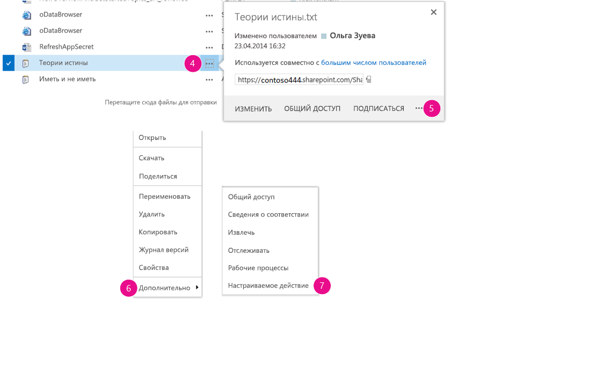
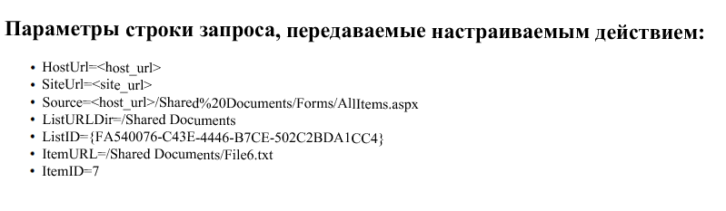

# <a name="create-custom-actions-to-deploy-with-sharepoint-add-ins"></a>Создание дополнительных действий для развертывания с надстройками SharePoint

При создании надстройки SharePoint дополнительные действия позволяют взаимодействовать со списками и лентой на хост-сайте. Эти действия развертываются на хост-сайте, когда конечные пользователи устанавливают вашу надстройку. Дополнительные действия могут открывать удаленную веб-страницу и передавать информацию через строку запроса. 

Для надстроек доступны два вида дополнительных действий: **Лента** и **Пункт меню**.
 
<a name="SP15Createcustomactionsapps_Prereq"> </a>

## <a name="prerequisites-for-using-the-examples-in-this-article"></a>Необходимые условия для использования примеров в этой статье

Вам необходима среда разработки, описанная в статье [Создание надстроек SharePoint, размещаемых у поставщика](get-started-creating-provider-hosted-sharepoint-add-ins.md).

### <a name="core-concepts-to-help-you-understand-custom-actions"></a>Что нужно знать о дополнительных действиях

В таблице ниже перечислены полезные статьи, в которых описаны понятия и действия, связанные с настройкой дополнительных действий.

**Таблица 1. Основные понятия по дополнительным действиям**

|**Статья**|**Описание**|
|:-----|:-----|
| [Надстройки SharePoint](sharepoint-add-ins.md)|Сведения о новой модели надстроек в SharePoint, с помощью которой можно создавать надстройки — небольшие и удобные в использовании решения для пользователей.|
| [Разработка пользовательского интерфейса для надстроек SharePoint](ux-design-for-sharepoint-add-ins.md)|Узнайте, как создать удобную надстройку SharePoint.|
| [Хост-сайты, сайты надстроек и компоненты SharePoint в SharePoint](host-webs-add-in-webs-and-sharepoint-components-in-sharepoint.md)|Изучите различия между хост-сайтами и сайтами надстроек. Узнайте, какие компоненты SharePoint можно включать в надстройку для SharePoint, какие компоненты необходимо разворачивать на хост-сайте, а какие на сайте надстройки, и как выполнить развертывание сайта надстройки в изолированном домене.|

<a name="SP15Createcustomactionsapps_Codeexample"> </a>

## <a name="code-example-create-a-custom-action-in-the-host-web-document-libraries"></a>Пример кода. Создание дополнительного действия в библиотеках документов хост-сайта

Чтобы создать дополнительное действие в библиотеках документов хост-сайта, сделайте следующее:

1. Создайте надстройку SharePoint и удаленные веб-проекты.

2. Добавьте веб-страницу надстройки для дополнительных действий.

3. Добавьте дополнительное действие "Пункт меню" в проект надстройки SharePoint.

4. Добавьте дополнительное действия "Лента" в проект надстройки SharePoint.
    
5. Укажите домашнюю страницу хост-сайта в качестве начальной страницы надстройки.

6. Соберите и запустите решение.
    

### <a name="to-create-the-sharepoint-add-in-and-remote-web-projects"></a>Создание надстройки SharePoint и удаленных веб-проектов

1. Откройте Visual Studio от имени администратора. (Для этого щелкните правой кнопкой мыши значок Visual Studio в меню **Пуск** и выберите **Запуск от имени администратора**.)   
 
2. Создайте надстройку SharePoint с размещением у поставщика, как описано в [этой статье](get-started-creating-provider-hosted-sharepoint-add-ins.md), и назовите ее **CustomActionsApp**. 

### <a name="to-add-an-add-in-webpage-for-the-custom-actions"></a>Добавление веб-страницы надстройки для дополнительных действий

1. После создания решения Visual Studio щелкните правой кнопкой мыши проект веб-приложения (не проект надстройки SharePoint) и выберите **Добавить** > **Новый элемент** > **Интернет** > **Веб-форма**, чтобы добавить новую веб-форму. Присвойте форме имя **CustomActionTarget.aspx**. 
 
2. В файле CustomActionTarget.aspx замените весь элемент **html** и его дочерние элементы следующим HTML-кодом. Оставьте всю разметку над элементом **html** без изменений. HTML-код содержит скрипт JavaScript, который выполняет следующие задачи:
    
    - Предоставляет заполнитель для параметров строки запроса.
    
    - Извлекает параметры из строки запроса.
    
    - Отображает параметры в заполнителе.

    > [!IMPORTANT] 
    > Маркеры ItemURL и ItemID передаются только при наличии выделенного элемента. В готовой надстройке SharePoint код должен обрабатывать ситуации, когда выбранного элемента нет. В этом примере код оповещает пользователя о том, что не был выбран ни один элемент. 

    ```HTML
    <html xmlns="http://www.w3.org/1999/xhtml">
    <head>
        <title>Custom action target</title>
    </head>
    <body>
        <h2>Query string parameters passed by the custom action:</h2>

        <!-- Placeholder for query string parameters -->
        <ul id="qsparams"/>

        <!-- Main JavaScript function, renders
            the query string parameters -->
        <script lang="javascript">
            var params = document.URL.split("?")[1].split("&amp;");
            var paramsHTML = "";
        
            // Extracts the parameters from the query string.
            // Parameters are URLencoded, decode for rendering
            // in page.
            for (var i = 0; i < params.length; i = i + 1) {
                params[i] = decodeURIComponent(params[i]);
                paramsHTML += "<li>" + params[i] + "</li>";
            }

            // Alert the user when no item has been selected.
            // (The SPListItemId is the 5th parameter.)
            if (params[5] === undefined) {
                paramsHTML += "<div> <h3> No item has been selected from the list.  Please select an item. </h3> </div> ";
            }

            // Render parameters in the placeholder.
            document.getElementById("qsparams").innerHTML =
                paramsHTML;
        </script>
    </body>
    </html>
    ```

<br/>

### <a name="to-add-a-menu-item-custom-action-to-the-sharepoint-add-in-project"></a>Добавление дополнительного действия "Пункт меню" в проект надстройки SharePoint

1. Щелкните правой кнопкой мыши проект надстройки SharePoint и выберите **Добавить** > **Новый элемент** > **Office/SharePoint** > **Настраиваемое действие элемента меню**. 

2. Оставьте имя по умолчанию и нажмите кнопку **Добавить**.

3. Мастер "Создание настраиваемого действия для пункта меню" задаст вам несколько вопросов. Ответьте на них, используя следующую таблицу:
    
    **Таблица 2. Свойства дополнительного действия "Пункт меню"**

    |**Вопрос о свойстве**|**Ответ**|
    |:-----|:-----|
    |Где вы хотите разместить дополнительное действие?|Выберите вариант **хост-сайт**.|
    |К какой области относится настраиваемое действие?|Выберите **Шаблон списка**.|
    |Каким конкретным элементом ограничена область настраиваемого действия?|Выберите **Библиотека документов**.|
    |Какой текст будет указан в элементе меню?|Введите **My Custom Action** (Мое дополнительное действие).|
    |Куда ведет настраиваемое действие?|Выберите страницу **CustomActionAppWeb\CustomActionTarget.aspx**.|

4. Нажмите кнопку **Готово**.
    
    Visual Studio создает следующую разметку в файле elements.xml для дополнительного действия "Пункт меню":

    ```XML
    <?xml version="1.0" encoding="utf-8"?>
    <Elements 
        xmlns="http://schemas.microsoft.com/sharepoint/">
        <!-- RegistrationId attribute is the list type id,
            in this case, a document library (id=101). -->
    <CustomAction 
        Id="65695319-4784-478e-8dcd-4e541cb1d682.CustomAction"
        RegistrationType="List"
        RegistrationId="101"
        Location="EditControlBlock"
        Sequence="10001"
        Title="Invoke custom action">
        <!-- 
        Update the Url below to the page you want the custom action to use.
        Start the URL with the token ~remoteAppUrl if the page is in the
        associated web project, use ~appWebUrl if page is in the add-in project.
        -->
        <UrlAction Url=
    "~remoteAppUrl/CustomActionTarget.aspx?{StandardTokens}&amp;amp;SPListItemId={ItemId}&amp;amp;SPListId={ListId}" />
    </CustomAction>
    </Elements>

    ```

    <br/>

5. Добавьте следующие параметры запроса в конец атрибута **Url** элемента **UrlAction**:
    
    `&amp;amp;SPSource={Source}&amp;amp;SPListURLDir={ListUrlDir}&amp;amp;SPItemURL={ItemUrl}`
    
    Элемент **UrlAction** должен выглядеть следующим образом:
    
    ` <UrlAction Url= "~remoteAppUrl/CustomActionTarget.aspx?{StandardTokens}&amp;amp;SPListItemId={ItemId}&amp;amp;SPListId={ListId}&amp;amp;SPSource={Source}&amp;amp;SPListURLDir={ListUrlDir}&amp;amp;SPItemURL={ItemUrl}" />`

> [!NOTE] 
> В этом примере удаленная веб-страница открывается в полном окне, когда пользователь выбирает дополнительное действие в меню. Дополнительные действия меню также позволяют открывать удаленную веб-страницу в диалоговом окне с помощью атрибута **HostWebDialog**. Дополнительные сведения см. на странице [SharePoint-Add-in-Localization](https://github.com/OfficeDev/SharePoint-Add-in-Localization).

### <a name="to-add-a-ribbon-custom-action-to-the-sharepoint-add-in-project"></a>Добавление дополнительного действия "Лента" в проект надстройки SharePoint

1. Щелкните правой кнопкой мыши проект надстройки SharePoint и выберите **Добавить** > **Новый элемент** > **Office/SharePoint** > **Настраиваемое действие ленты**. 

2. Оставьте имя по умолчанию и нажмите кнопку **Добавить**.
 
3. Мастер "Создание настраиваемого действия для ленты" задаст вам несколько вопросов. Ответьте на них, используя следующую таблицу:
    
    **Таблица 3. Свойства дополнительного действия "Лента"**
    
    |**Вопрос о свойстве**|**Ответ**|
    |:-----|:-----|
    |Где вы хотите разместить дополнительное действие?|Выберите вариант **хост-сайт**.|
    |К какой области относится настраиваемое действие?|Выберите **Шаблон списка**.|
    |Каким конкретным элементом ограничена область настраиваемого действия?|Выберите **Библиотека документов**.|
    |Где находится элемент управления?|Выберите **Ribbon.Documents.Manage**.|
    |Какой текст будет указан в элементе меню?|Введите **My Custom Ribbon Button** (Моя дополнительная кнопка ленты).|
    |Куда ведет настраиваемое действие?|Выберите страницу **CustomActionAppWeb\CustomActionTarget.aspx**.|

4. Visual Studio создает следующую разметку в файле elements.xml для функции дополнительного действия "Лента":
        
    ```XML
    <?xml version="1.0" encoding="utf-8"?>
    <Elements xmlns="http://schemas.microsoft.com/sharepoint/">
    <CustomAction Id="85691508-c076-4f43-93d4-96b4d5253a09.RibbonCustomAction1"
                    RegistrationType="List"
                    RegistrationId="101"
                    Location="CommandUI.Ribbon"
                    Sequence="10001"
                    Title="Invoke &amp;apos;RibbonCustomAction1&amp;apos; action">
        <CommandUIExtension>
        <!-- 
        Update the UI definitions below with the controls and the command actions
        that you want to enable for the custom action.
        -->
        <CommandUIDefinitions>
            <CommandUIDefinition Location="Ribbon.Documents.Manage.Controls._children">
            <Button Id="Ribbon.Documents.Manage.RibbonCustomAction1Button"
                    Alt="My Custom Ribbon Button"
                    Sequence="100"
                    Command="Invoke_RibbonCustomAction1ButtonRequest"
                    LabelText="My Custom Ribbon Button"
                    TemplateAlias="o1"
                    Image32by32="_layouts/15/images/placeholder32x32.png"
                    Image16by16="_layouts/15/images/placeholder16x16.png" />
            </CommandUIDefinition>
        </CommandUIDefinitions>
        <CommandUIHandlers>
            <CommandUIHandler Command="Invoke_RibbonCustomAction1ButtonRequest"
                            CommandAction="~remoteAppUrl/CustomActionTarget.aspx?{StandardTokens}&amp;amp;SPListItemId={SelectedItemId}&amp;amp;SPListId={SelectedListId}"/>
        </CommandUIHandlers>
        </CommandUIExtension >
    </CustomAction>
    </Elements> 

    ```

    <br/>

5. Добавьте следующие параметры запроса в конец атрибута **CommandAction** элемента **CommandUIHandler**:
    
    `&amp;amp;SPSource={Source}&amp;amp;SPListURLDir={ListUrlDir}`
    
    Элемент **CommandUIHandler** должен выглядеть следующим образом:
    
    ` <CommandUIHandler Command="Invoke_RibbonCustomAction1ButtonRequest" CommandAction="~remoteAppUrl/CustomActionTarget.aspx?{StandardTokens}&amp;amp;SPListItemId={SelectedItemId}&amp;amp;SPListId={SelectedListId}&amp;amp;SPSource={Source}&amp;amp;SPListURLDir={ListUrlDir}" />`
    
    > [!NOTE] 
    > Дополнительные действия для ленты используют **SelectedListId** и **SelectedItemId**. **ListId** и **ItemId** работают только с дополнительными действиями "Пункт меню".

### <a name="to-set-the-add-in-start-page-to-the-host-web-home-page"></a>Установка домашней страницы хост-сайта в качестве начальной страницы надстройки

1. В примере ниже у надстройки SharePoint нет своего сайта, а ее удаленное веб-приложение существует только для размещения формы. Поэтому начальной страницей надстройки следует сделать домашнюю страницу хост-сайта. 
    
    Для начала выберите проект надстройки SharePoint (не проект веб-приложения) в **обозревателе решений** и скопируйте в буфер обмена значение свойства **URL-адрес сайта**, включая протокол (например, `https://contoso.sharepoint.com`). 
    
2. Откройте манифест надстройки, а затем вставьте URL-адрес в поле **Начальная страница**.
    
3. При необходимости можно удалить страницу Default.aspx из проекта веб-приложения, так как она не используется в надстройке SharePoint.
    
### <a name="to-build-and-run-the-solution"></a>Сборка и запуск решения

1. Нажмите клавишу F5.
    
    > [!NOTE] 
    > При нажатии клавиши F5 Visual Studio выполняет сборку решения, развертывает надстройку и открывает страницу разрешений.

2. Нажмите кнопку **Доверять**. Откроется страница сайта разработчика по умолчанию.

3. Перейдите в любую библиотеку документов на хост-сайте.
    
   **Запуск дополнительного действия меню**

   

4. Нажмите кнопку выноски (**...**) для любого документа. Откроется выноска.

5. Нажмите кнопку выноски (**...**) на выноске. 

6. Выберите **Дополнительно**.

7. Выберите в контекстном меню **My Custom Menu Action** (Мое дополнительное действие меню). На открывшейся удаленной веб-странице вы увидите следующее:
    
   **Удаленная веб-страница с параметрами из дополнительного действия**  
   

8. Нажмите в браузере кнопку **Назад**, чтобы вернуться в библиотеку.
    
   **Запуск дополнительного действия "Лента"**

   

9. Выберите любой документ.

10. Откройте на ленте вкладку **Файл**.

11. Выберите **My Custom Ribbon Button** (Моя дополнительная кнопка ленты). Отобразится та же удаленная веб-страница.

<br/>

#### <a name="troubleshooting-the-solution"></a>Устранение неполадок в решении

|**Проблема**|**Решение**|
|:-----|:-----|
|Visual Studio не открывает браузер после нажатия клавиши F5.|Сделайте проект надстройки SharePoint запускаемым.|
|Маркеры в URL-адресе не разрешаются после нажатия клавиши F5 в Visual Studio.|Перейдите на страницу **Содержимое сайта** на хост-сайте и выберите значок вашей надстройки.|

## <a name="see-also"></a>Дополнительные ресурсы
<a name="SP15Createcustomactionsapps_AddResources"> </a>

- [Пример кода. Открытие удаленной веб-страницы надстройки с помощью дополнительного действия ECB](https://code.msdn.microsoft.com/office/SharePoint-2013-Open-a-36d1598d)    
- [Создание компонентов взаимодействия с пользователем в SharePoint](create-ux-components-in-sharepoint.md)