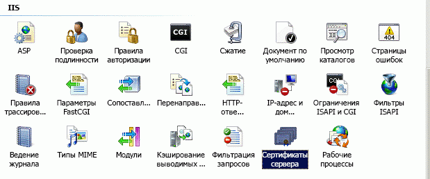
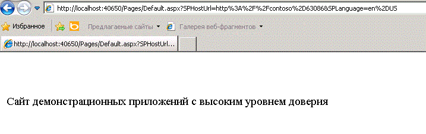

# <a name="create-high-trust-sharepoint-add-ins"></a><span data-ttu-id="620f0-102">Создание надстроек с высоким уровнем доверия для SharePoint</span><span class="sxs-lookup"><span data-stu-id="620f0-102">Create high-trust SharePoint Add-ins</span></span>
<span data-ttu-id="620f0-p101">Узнайте, как создать надстройку для SharePoint с высоким уровнем доверия. Надстройка с высоким уровнем доверия использует цифровые сертификаты, чтобы установить доверие между удаленным веб-приложением и SharePoint. Надстройки с высоким уровнем доверия могут быть установлены только на локальную версию SharePoint, а не на Microsoft SharePoint Online, и в первую очередь предназначены для использования локально, а не для веб-приложений на базе облака.</span><span class="sxs-lookup"><span data-stu-id="620f0-p101">Learn how to create a high-trust SharePoint Add-in. A high-trust add-in uses digital certificates to establish a trust between the remote web application and SharePoint. High-trust add-ins can only be installed to on premises SharePoint, not to Microsoft SharePoint Online, and they are primarily intended for use with an on premises, rather than cloud-based, web application.</span></span>
 

 <span data-ttu-id="620f0-p102">**Примечание.** В настоящее время идет процесс замены названия "приложения для SharePoint" названием "надстройки SharePoint". Во время этого процесса в документации и пользовательском интерфейсе некоторых продуктов SharePoint и средств Visual Studio может по-прежнему использоваться термин "приложения для SharePoint". Дополнительные сведения см. в статье [Новое название приложений для Office и SharePoint](new-name-for-apps-for-sharepoint.md#bk_newname).</span><span class="sxs-lookup"><span data-stu-id="620f0-p102">**Note**  The name "apps for SharePoint" is changing to "SharePoint Add-ins". During the transition, the documentation and the UI of some SharePoint products and Visual Studio tools might still use the term "apps for SharePoint". For details, see  [New name for apps for Office and SharePoint](new-name-for-apps-for-sharepoint.md#bk_newname).</span></span>
 


## <a name="prerequisites-for-creating-high-trust-add-ins"></a><span data-ttu-id="620f0-109">Необходимые условия для создания надстроек с высоким уровнем доверия</span><span class="sxs-lookup"><span data-stu-id="620f0-109">Prerequisites for creating high-trust add-ins</span></span>
<span data-ttu-id="620f0-110"><a name="Prereqs"> </a></span><span class="sxs-lookup"><span data-stu-id="620f0-110"></span></span>

<span data-ttu-id="620f0-111">Прежде чем выполнять процедуры, описанные в этой статье, убедитесь, что у вас есть следующее:</span><span class="sxs-lookup"><span data-stu-id="620f0-111">To follow the procedures in this article, be sure you have the following:</span></span>
 

 

- <span data-ttu-id="620f0-p103">Локальная среда разработки SharePoint. См. раздел [Настройка локальной среды разработки надстроек SharePoint](set-up-an-on-premises-development-environment-for-sharepoint-add-ins.md) для получения инструкций по установке. В частности, убедитесь, что вы выполнили действия в разделе [Настройка служб в SharePoint для межсерверного использования надстройки](set-up-an-on-premises-development-environment-for-sharepoint-add-ins.md#Servertoserver).</span><span class="sxs-lookup"><span data-stu-id="620f0-p103">An on-premises SharePoint development environment. See  [Set up an on-premises development environment for SharePoint Add-ins](set-up-an-on-premises-development-environment-for-sharepoint-add-ins.md) for the setup instructions. In particular, be sure you have completed the steps in the section [Configure services in SharePoint for server-to-server add-in use](set-up-an-on-premises-development-environment-for-sharepoint-add-ins.md#Servertoserver).</span></span>
    
 
- <span data-ttu-id="620f0-p104">Опыт создания надстроек SharePoint, размещаемых у поставщика. См. статью [Знакомство с созданием надстроек SharePoint с размещением у поставщика](get-started-creating-provider-hosted-sharepoint-add-ins.md).</span><span class="sxs-lookup"><span data-stu-id="620f0-p104">Experience creating a provider-hosted SharePoint Add-in. See  [Get started creating provider-hosted SharePoint Add-ins](get-started-creating-provider-hosted-sharepoint-add-ins.md).</span></span>
    
 
- <span data-ttu-id="620f0-117">Среда Visual Studio, установленная удаленно или на том же компьютере, что и SharePoint.</span><span class="sxs-lookup"><span data-stu-id="620f0-117">Visual Studio installed either remotely or on the computer where you have installed SharePoint.</span></span>
    
 
- <span data-ttu-id="620f0-118">Инструменты разработчика Microsoft Office для Visual Studio.</span><span class="sxs-lookup"><span data-stu-id="620f0-118">Microsoft Office Developer Tools for Visual Studio.</span></span>
    
 
- <span data-ttu-id="620f0-119">Представление о том, что такое цифровые сертификаты и как их использовать.</span><span class="sxs-lookup"><span data-stu-id="620f0-119">Familiarity with digital certificates—what they are and how to use them.</span></span>
    
 
<span data-ttu-id="620f0-120">Ознакомьтесь с указанными ниже статьями, чтобы получить лучшее представление о надстройках SharePoint и цифровых сертификатах.</span><span class="sxs-lookup"><span data-stu-id="620f0-120">Read the following articles to get a better understanding of SharePoint Add-ins and digital certificates.</span></span>
 

 

<span data-ttu-id="620f0-121">**Таблица 1. Основные понятия, связанные с настройкой SharePoint для запуска надстроек с высоким уровнем доверия**</span><span class="sxs-lookup"><span data-stu-id="620f0-121">**Table 1. Core concepts for setting up SharePoint to run high-trust add-ins**</span></span>


|<span data-ttu-id="620f0-122">**Название статьи**</span><span class="sxs-lookup"><span data-stu-id="620f0-122">**Article title**</span></span>|<span data-ttu-id="620f0-123">**Описание**</span><span class="sxs-lookup"><span data-stu-id="620f0-123">**Description**</span></span>|
|:-----|:-----|
| [<span data-ttu-id="620f0-124">Знакомство с созданием надстроек SharePoint с размещением у поставщика</span><span class="sxs-lookup"><span data-stu-id="620f0-124">Get started creating provider-hosted SharePoint Add-ins</span></span>](get-started-creating-provider-hosted-sharepoint-add-ins.md)|<span data-ttu-id="620f0-125">Узнайте, как создать простейшую надстройку для SharePoint, размещаемую у поставщика, с помощью Инструменты разработчика Office для Visual Studio, как взаимодействовать с сайтами SharePoint с помощью SharePoint CSOM.</span><span class="sxs-lookup"><span data-stu-id="620f0-125">Learn how to create a basic provider-hosted SharePoint Add-in with the Office Developer Tools for Visual Studio, how to interact with SharePoint sites by using the SharePoint CSOM.</span></span>|
| <span data-ttu-id="620f0-126">[Цифровые сертификаты](http://msdn.microsoft.com/library/e523b335-0156-4f47-b55c-b80495587c4f.aspx) и [Работа с сертификатами](http://msdn.microsoft.com/library/6ffb8682-8f07-4a45-afbb-8d2487e9dbc3.aspx)</span><span class="sxs-lookup"><span data-stu-id="620f0-126">[Digital Certificates](http://msdn.microsoft.com/library/e523b335-0156-4f47-b55c-b80495587c4f.aspx) and [Working with Certificates](http://msdn.microsoft.com/library/6ffb8682-8f07-4a45-afbb-8d2487e9dbc3.aspx)</span></span>|<span data-ttu-id="620f0-127">Изучите основы работы с цифровыми сертификатами.</span><span class="sxs-lookup"><span data-stu-id="620f0-127">Learn the basic ideas behind digital certificates.</span></span>|

## <a name="introduction-to-running-high-trust-add-ins"></a><span data-ttu-id="620f0-128">Общие сведения о запуске надстроек с высоким уровнем доверия</span><span class="sxs-lookup"><span data-stu-id="620f0-128">Introduction to running high-trust add-ins</span></span>
<span data-ttu-id="620f0-129"><a name="Intro"> </a></span><span class="sxs-lookup"><span data-stu-id="620f0-129"></span></span>

<span data-ttu-id="620f0-p105">Надстройка с высоким уровнем доверия это Надстройка SharePoint, которая размещается у поставщика и использует сертификаты для установки высокого уровня доверия между веб-приложением и SharePoint. Высокий уровень доверия это не то же самое, что полное доверие. Надстройка с высоким уровнем доверия должна запрашивать разрешение надстройки. Высокий уровень доверия означает, что надстройка может использовать любое необходимое удостоверение пользователя, так как она ответственна за создание той части маркера доступа, которую передает SharePoint.</span><span class="sxs-lookup"><span data-stu-id="620f0-p105">A high-trust add-in is a provider-hosted SharePoint Add-in that uses the digital certificates to establish trust between the remote web application and SharePoint. "High-trust" is not the same as "full trust". A high-trust add-in must still request add-in permissions. The add-in is considered "high-trust" because it is trusted to use any user identity that the add-in needs, because the add-in is responsible for creating the user portion of the access token that it passes to SharePoint.</span></span>
 

 
<span data-ttu-id="620f0-p106">Надстройка SharePoint с высоким уровнем доверия в первую очередь предназначена для использования в локальной среде. Надстройки с высоким уровнем доверия не могут быть установлены в Microsoft SharePoint Online, и удаленные компоненты обычно тоже устанавливаются локально с использованием корпоративного брандмауэра. Таким образом, экземпляры надстроек SharePoint уникальны для каждой конкретной компании.</span><span class="sxs-lookup"><span data-stu-id="620f0-p106">A high-trust SharePoint Add-in is primarily intended for use in an on-premises environment. The high-trust add-in cannot be installed to Microsoft SharePoint Online, and the remote components are typically installed on premises, too, within the corporate firewall. Thus, the instances of the SharePoint Add-in are specific to each individual company.</span></span>
 

 
<span data-ttu-id="620f0-p107">Надстройка с высоким уровнем доверия использует сертификат для установления доверия вместо маркера контекста. (Надстройку, размещаемую поставщиком для использования Служба контроля доступа Microsoft Azure (ACS) в качестве доверенного брокера, необходимо изменить, чтобы она работала как приложение с высоким уровнем доверия.) Надстройку с высоким уровнем доверия необходимо настроить на ферме SharePoint и на сервере, где размещается удаленное веб-приложение. В этом разделе указаны шаги настройки, которые необходимо предпринять для работы отладки Visual Studio ( **F5**). Настройка тестовой, промежуточной и продуктивной среды имеет свои отличия и описана в разделе  [Упаковка и публикация надстроек с высоким уровнем доверия для SharePoint](package-and-publish-high-trust-sharepoint-add-ins.md).</span><span class="sxs-lookup"><span data-stu-id="620f0-p107">A high-trust add-in uses a certificate instead of a context token to establish trust. (A provider-hosted add-in that's built to use Microsoft Azure Access Control Service (ACS) as its trust broker needs to be modified to work as a high-trust app.) High-trust add-ins require some configuration on the SharePoint farm and on the server hosting the remote web application. This topic describes the configuration steps that are needed to get Visual Studio debugging ( **F5**) working. Configuring a test, staging, or production environment are somewhat different and are described in the topic  [Package and publish high-trust SharePoint Add-ins](package-and-publish-high-trust-sharepoint-add-ins.md).</span></span> 
 

 
<span data-ttu-id="620f0-p108">В SharePoint служба маркеров безопасности S2S предоставляет маркеры доступа для проверки подлинности по протоколу S2S. Эти временные маркеры обеспечивают доступ к другим службам приложения, например Exchange 2013, Lync 2013 и надстройкам для SharePoint. Отношение доверия между службами приложения (например, SharePoint доверяет удаленной надстройке, которая, в свою очередь, доверяет SharePoint) устанавливается с помощью командлетов Windows PowerShell и сертификата.</span><span class="sxs-lookup"><span data-stu-id="620f0-p108">In SharePoint, the server-to-server security token service (STS) provides access tokens for server-to-server authentication. The server-to-server STS enables temporary access tokens to access other application services such as Exchange 2013, Lync 2013, and add-ins for SharePoint. You establish a trust relationship between the application services (for example, establishing trust between SharePoint and a remote add-in) by using Windows PowerShell cmdlets and a certificate.</span></span>
 

 

 <span data-ttu-id="620f0-p109">**Примечание.** Служба маркеров безопасности S2S не предназначена для проверки подлинности пользователей. Поэтому она не указывается на странице входа пользователя, в разделе **Служба проверки подлинности** Центра администрирования и в средстве выбора людей в SharePoint.</span><span class="sxs-lookup"><span data-stu-id="620f0-p109">**Note**  The server-to-server STS isn't intended for user authentication. Therefore, you won't see the server-to-server STS listed on the user sign-in page, in the  **Authentication Provider** section in Central Administration, or in the People Picker in SharePoint.</span></span>
 

<span data-ttu-id="620f0-p110">В этой статье рассматриваются инструкции по созданию надстроек с высоким уровнем доверия и их настройке для запуска в Visual Studio при нажатии клавиши **F5**. Вы научитесь выполнять следующие действия:</span><span class="sxs-lookup"><span data-stu-id="620f0-p110">This article shows you how to create a high-trust add-in and provides setup instructions for running it within Visual Studio by pressing  **F5**. You'll learn to:</span></span>
 

 

- <span data-ttu-id="620f0-148">конфигурация надстройки для использования в качестве надстройки с высоким уровнем доверия;</span><span class="sxs-lookup"><span data-stu-id="620f0-148">Configure an add-in for use as a high-trust add-in.</span></span>
    
 
- <span data-ttu-id="620f0-149">настройка SharePoint для использования надстроек с высоким уровнем доверия;</span><span class="sxs-lookup"><span data-stu-id="620f0-149">Configure SharePoint to use high-trust add-ins.</span></span>
    
 
- <span data-ttu-id="620f0-150">создание простейшей надстройки с высоким уровнем доверия;</span><span class="sxs-lookup"><span data-stu-id="620f0-150">Create a basic high-trust add-in.</span></span>
    
 

## <a name="obtain-a-certificate-or-create-a-public-and-private-test-certificate"></a><span data-ttu-id="620f0-151">получение сертификата или создание общедоступного и закрытого сертификатов для тестирования.</span><span class="sxs-lookup"><span data-stu-id="620f0-151">Obtain a certificate or create a public and private test certificate</span></span>
<span data-ttu-id="620f0-152"><a name="Cert2"> </a></span><span class="sxs-lookup"><span data-stu-id="620f0-152"></span></span>

<span data-ttu-id="620f0-p111">Для удаленного веб-приложения вашей надстройки с высоким уровнем доверия необходим цифровой сертификат X.509. Чтобы можно было полностью протестировать надстройку для SharePoint, требуется сертификат, выданный доменом, или коммерческий сертификат, выданный в центре сертификации. Тем не менее, для начальной фазы отладки можно использовать самозаверяющий сертификат. Следующая процедура описывает создание и экспорт тестового сертификата с помощью IIS. Сведения о том, как изменить самозаверяющий сертификат на сертификат, выданный доменом, или коммерческий сертификат можно найти ниже в разделе  [Полная отладка с сертификатом, выданным доменом, или коммерческим сертификатом](#NewCertificate).</span><span class="sxs-lookup"><span data-stu-id="620f0-p111">You need an X.509 digital certificate for the remote web application of your high-trust add-in. To fully test your SharePoint Add-in, you need a domain-issued certificate or a commercial certificate issued by a Certificate Authority. However, for the initial phase of debugging, you can use a self-signed certificate. The following procedure describes how to create and export a test certificate by using IIS. You'll learn how to replace the self-signed certificate with a domain-issued or commercial certificate in the section  [Complete debugging with a domain issued or commercial certificate](#NewCertificate) below.</span></span>
 

 
<span data-ttu-id="620f0-p112">Вы также можете создать тестовый сертификат X.509 с помощью тестовой программы MakeCert. Дополнительные сведения о ее использовании см. в статье  [Подпись и проверка кода с помощью технологии Authenticode](http://msdn.microsoft.com/ru-RU/library/ms537364%28VS.85%29.aspx).</span><span class="sxs-lookup"><span data-stu-id="620f0-p112">Alternatively, you can also use the MakeCert test program to generate a X.509 certificate. For more information about how to use MakeCert, see  [Signing and checking code with Authenticode](http://msdn.microsoft.com/ru-RU/library/ms537364%28VS.85%29.aspx).</span></span>
 

 
<span data-ttu-id="620f0-p113">Сначала необходимо создать тестовый PFX-файл сертификата, а затем соответствующий CER-файл. PFX-файл сертификата содержит закрытый ключ, который используется удаленным веб-приложением для цифровых подписей в SharePoint. CER-файл сертификата содержит открытый ключ, с помощью которого SharePoint расшифровывает подписи, проверяет, что они отправлены удаленным веб-приложением, и проверяет, что удаленное веб-приложение имеет маркер доступа от поставщика маркера, которому доверяет SharePoint. Дополнительные сведения о PFX- и CER-файлах см. в разделе  [Software Publisher Certificate](http://msdn.microsoft.com/ru-RU/library/windows/hardware/ff552299%28v=vs.85%29.aspx)</span><span class="sxs-lookup"><span data-stu-id="620f0-p113">You'll create a test .pfx certificate file first, and then a corresponding test .cer file. The .pfx certificate contains the private key that is used by the remote web application to sign its communications to SharePoint. The .cer contains the public key that SharePoint uses to decrypt the messages, verify that they come from the remote web application, and verify that the remote web application has an access token from a token issuer that SharePoint trusts. For more information about .pfx and .cer files, see  [Software Publisher Certificate](http://msdn.microsoft.com/ru-RU/library/windows/hardware/ff552299%28v=vs.85%29.aspx)</span></span>
 

 

### <a name="to-create-a-self-signed-test-pfx-certificate-file"></a><span data-ttu-id="620f0-164">Создание тестового PFX-файла самозаверяющего сертификата</span><span class="sxs-lookup"><span data-stu-id="620f0-164">To create a self-signed test .pfx certificate file</span></span>


1. <span data-ttu-id="620f0-p114">При отладке надстройки для SharePoint с высоким уровнем доверия в Visual Studio удаленное веб-приложение размещается в IIS Express на компьютере, где установлен Visual Studio. Поэтому на компьютере с удаленным веб-приложением может быть не установлен диспетчер IIS для создания сертификатов. По этой причине для создания сертификата необходимо использовать IIS на тестовом сервере  *SharePoint*  . В диспетчере IIS выберите узел _ServerName_ в представлении в виде дерева слева.</span><span class="sxs-lookup"><span data-stu-id="620f0-p114">When you are debugging a high-trust SharePoint Add-in in Visual Studio, the remote web application is hosted in IIS Express on the machine where Visual Studio is installed. So the remote web application computer doesn't have an IIS Manager where you can create the certificate. For this reason, you use the IIS on the  *SharePoint*  test server to create the certificate. In IIS manager, select the _ServerName_ node in the tree view on the left.</span></span>
    
 
2. <span data-ttu-id="620f0-169">Щелкните значок **Сертификаты сервера**, как показано на рис. 1.</span><span class="sxs-lookup"><span data-stu-id="620f0-169">Select the  **Server Certificates** icon, as shown in Figure 1.</span></span>
    
    <span data-ttu-id="620f0-170">**Рисунок 1. Элемент "Сертификаты сервера" в службах IIS**</span><span class="sxs-lookup"><span data-stu-id="620f0-170">**Figure 1. Server Certificates option in IIS**</span></span>

 

  
 

 

 
3. <span data-ttu-id="620f0-172">Выберите ссылку **Создать самозаверяющий сертификат** в списке ссылок справа, как показано на рис. 2.</span><span class="sxs-lookup"><span data-stu-id="620f0-172">Select the  **Create Self-Signed Certificate** link from the set of links on the right side, as shown in Figure 2.</span></span>
    
    <span data-ttu-id="620f0-173">**Рисунок 2. Ссылка "Создать самозаверяющий сертификат"**</span><span class="sxs-lookup"><span data-stu-id="620f0-173">**Figure 2. Create Self-Signed Certificate link**</span></span>

 

  
 

 

 
4. <span data-ttu-id="620f0-175">Задайте для сертификата имя HighTrustSampleCert и нажмите кнопку **ОК**.</span><span class="sxs-lookup"><span data-stu-id="620f0-175">Name the certificate HighTrustSampleCert, and then choose  **OK**.</span></span>
    
 
5. <span data-ttu-id="620f0-176">Щелкните сертификат правой кнопкой мыши и выберите команду **Экспорт**, как показано на рис. 3.</span><span class="sxs-lookup"><span data-stu-id="620f0-176">Right-click the certificate, and then select  **Export**, as shown in Figure 3.</span></span>
    
    <span data-ttu-id="620f0-177">**Рис. 3. Экспорт тестового сертификата**</span><span class="sxs-lookup"><span data-stu-id="620f0-177">**Figure 3. Exporting a test certificate**</span></span>

 

  
 

 

 
6. <span data-ttu-id="620f0-179">В Windows или в командной строке создайте папку с именем C:\Certs.</span><span class="sxs-lookup"><span data-stu-id="620f0-179">In Windows, or at a command line, create a folder called C:\Certs.</span></span>
    
 
7. <span data-ttu-id="620f0-p115">В диспетчере IIS экспортируйте файл в папку C:\Certs и задайте для него пароль. В этом примере используется пароль **password**.</span><span class="sxs-lookup"><span data-stu-id="620f0-p115">Back in IIS Manager, export the file to C:\Certs and give it a password. In this example, the password is  **password**.</span></span>
    
 
8. <span data-ttu-id="620f0-p116">Если тестовая версия SharePoint и среда Visual Studio установлены на разных компьютерах, создайте папку C:\Certs на компьютере с Visual Studio и переместите в нее файл HighTrustSampleCert.pfx. При запуске отладки в Visual Studio удаленное веб-приложение будет работать на этом компьютере.</span><span class="sxs-lookup"><span data-stu-id="620f0-p116">If your test SharePoint installation is not on the same computer where Visual Studio is running, create a folder C:\Certs on the Visual Studio computer and move the HighTrustSampleCert.pfx file to it. This is the computer where the remote web application runs when you are debugging in Visual Studio.</span></span>
    
 

### <a name="to-create-a-corresponding-cer-file"></a><span data-ttu-id="620f0-184">Создание соответствующего CER-файла</span><span class="sxs-lookup"><span data-stu-id="620f0-184">To create a corresponding .cer file</span></span>


1. <span data-ttu-id="620f0-185">На сервере SharePoint убедитесь, что удостоверения следующих пулов надстроек IIS содержат права на чтение папки C:\Certs:</span><span class="sxs-lookup"><span data-stu-id="620f0-185">On the SharePoint server, be sure that the add-in pool identity for the following IIS add-in pools have Read rights to the C:\Certs folder:</span></span>
    
      -  <span data-ttu-id="620f0-186">**SecurityTokenServiceApplicationPool**.</span><span class="sxs-lookup"><span data-stu-id="620f0-186">**SecurityTokenServiceApplicationPool**</span></span>
    
 
  - <span data-ttu-id="620f0-p117">Пул надстроек, обслуживающий веб-сайт IIS, на котором размещается родительское веб-приложение SharePoint для тестового веб-сайта SharePoint. Пул для веб-сайта IIS **SharePoint - 80** называется **OServerPortalAppPool**.</span><span class="sxs-lookup"><span data-stu-id="620f0-p117">The add-in pool that serves the IIS web site that hosts the parent SharePoint web application for your test SharePoint website. For the  **SharePoint - 80** IIS website, the pool is called **OServerPortalAppPool**.</span></span>
    
 
2. <span data-ttu-id="620f0-189">В диспетчере IIS выберите узел _Имя сервера_ в представлении в виде дерева слева.</span><span class="sxs-lookup"><span data-stu-id="620f0-189">In IIS manager, select the  _ServerName_ node in the tree view on the left.</span></span>
    
 
3. <span data-ttu-id="620f0-190">Дважды щелкните элемент **Сертификаты сервера**.</span><span class="sxs-lookup"><span data-stu-id="620f0-190">Double-click  **Server Certificates**.</span></span>
    
 
4. <span data-ttu-id="620f0-191">В представлении **Сертификаты сервера** дважды щелкните сертификат **HighTrustSampleCert**, чтобы просмотреть сведения о нем.</span><span class="sxs-lookup"><span data-stu-id="620f0-191">In  **Server Certificates** view, double-click **HighTrustSampleCert** to display the certificate details.</span></span>
    
 
5. <span data-ttu-id="620f0-192">На вкладке **Сведения** нажмите кнопку **Копировать в файл**, чтобы запустить **мастер экспорта сертификатов**, а затем нажмите кнопку **Далее**.</span><span class="sxs-lookup"><span data-stu-id="620f0-192">On the  **Details** tab, choose **Copy to File** to launch the **Certificate Export Wizard**, and then choose  **Next**.</span></span>
    
 
6. <span data-ttu-id="620f0-193">Оставьте значение по умолчанию (**Нет, не экспортировать закрытый ключ**) и нажмите кнопку **Далее**.</span><span class="sxs-lookup"><span data-stu-id="620f0-193">Use the default value  **No, do not export the private key**, and then choose  **Next**.</span></span>
    
 
7. <span data-ttu-id="620f0-p118">Оставьте значения по умолчанию. Нажмите кнопку **Далее**.</span><span class="sxs-lookup"><span data-stu-id="620f0-p118">Use the default values. Choose  **Next**.</span></span>
    
 
8. <span data-ttu-id="620f0-p119">Нажмите кнопку **Обзор**, перейдите в папку C:\Certs, назовите файл сертификата **HighTrustSampleCert** и нажмите кнопку **Сохранить**. Сертификат будет сохранен как CER-файл.</span><span class="sxs-lookup"><span data-stu-id="620f0-p119">Choose  **Browse**, browse to C:\Certs, name the certificate  **HighTrustSampleCert**, and then choose **Save**. The certificate is saved as a .cer file.</span></span>
    
 
9. <span data-ttu-id="620f0-198">Нажмите кнопку **Далее**.</span><span class="sxs-lookup"><span data-stu-id="620f0-198">Choose  **Next**.</span></span>
    
 
10. <span data-ttu-id="620f0-199">Нажмите кнопку **Готово**.</span><span class="sxs-lookup"><span data-stu-id="620f0-199">Choose  **Finish**.</span></span>
    
 

## <a name="configure-sharepoint-to-use-certificates-and-configure-trust-for-your-add-in"></a><span data-ttu-id="620f0-200">Настройка SharePoint на использование сертификатов и настройка доверия для надстройки</span><span class="sxs-lookup"><span data-stu-id="620f0-200">Configure SharePoint to use certificates and configure trust for your add-in</span></span>
<span data-ttu-id="620f0-201"><a name="Configure2"> </a></span><span class="sxs-lookup"><span data-stu-id="620f0-201"></span></span>

<span data-ttu-id="620f0-p120">Сценарий Windows PowerShell, создание которого описывается в этом разделе, призван обеспечить поддержку использования клавиши **F5** в Visual Studio. Он *не* сможет должным образом настроить промежуточную или рабочую установку SharePoint. Сведения о настройке рабочей среды SharePoint на использование сертификатов см. в статье [Упаковка и публикация надстроек с высоким уровнем доверия для SharePoint](package-and-publish-high-trust-sharepoint-add-ins.md).</span><span class="sxs-lookup"><span data-stu-id="620f0-p120">The Windows PowerShell script that you create in this section is intended to support the use of  **F5** in Visual Studio. It will *not*  properly configure a staging or production SharePoint installation. For instructions on configuring a production SharePoint to use certificates, see [Package and publish high-trust SharePoint Add-ins](package-and-publish-high-trust-sharepoint-add-ins.md).</span></span>
 

 

 <span data-ttu-id="620f0-205">**Примечание.** Прежде чем продолжать, [настройте службы в SharePoint для межсерверного использования надстройки](set-up-an-on-premises-development-environment-for-sharepoint-add-ins.md#Servertoserver)</span><span class="sxs-lookup"><span data-stu-id="620f0-205">**Note**  Double-check that you have completed the steps in  [Configure services in SharePoint for server-to-server add-in use](set-up-an-on-premises-development-environment-for-sharepoint-add-ins.md#Servertoserver) (which is listed as a prerequisite for this article). If not, you must configure it now, before you proceed.</span></span> <span data-ttu-id="620f0-206">(если вы еще этого не сделали).</span><span class="sxs-lookup"><span data-stu-id="620f0-206">If not, you must configure it now, before you proceed.</span></span>
 


### <a name="to-configure-sharepoint"></a><span data-ttu-id="620f0-207">Настройка SharePoint</span><span class="sxs-lookup"><span data-stu-id="620f0-207">To configure SharePoint</span></span>


1. <span data-ttu-id="620f0-208">В текстовом редакторе или в редакторе Windows PowerShell создайте новый файл и добавьте следующие строки для создания объекта сертификата.</span><span class="sxs-lookup"><span data-stu-id="620f0-208">In a text editor or Windows PowerShell editor, start a new file and add the following lines to it to create a certificate object:</span></span>
    
```
  $publicCertPath = "C:\Certs\HighTrustSampleCert.cer"
$certificate = New-Object System.Security.Cryptography.X509Certificates.X509Certificate2($publicCertPath)

```

2. <span data-ttu-id="620f0-209">Добавьте следующую строку, чтобы гарантировать, что SharePoint будет относиться к сертификату как к корневому центру.</span><span class="sxs-lookup"><span data-stu-id="620f0-209">Add the following line to ensure that SharePoint treats the certificate as a root authority.</span></span>
    
```
  New-SPTrustedRootAuthority -Name "HighTrustSampleCert" -Certificate $certificate 

```

3. <span data-ttu-id="620f0-210">Добавьте приведенную ниже строку, чтобы получить идентификатор области авторизации.</span><span class="sxs-lookup"><span data-stu-id="620f0-210">Add the following line to get the ID of the authorization realm.</span></span>
    
```
  $realm = Get-SPAuthenticationRealm

```

4. <span data-ttu-id="620f0-p122">Удаленное веб-приложение будет использовать маркер доступа, чтобы получить доступ к данным SharePoint. Маркер доступа должен быть выдан поставщиком маркеров, которому SharePoint доверяет. В надстройке SharePoint с высоким уровнем доверия поставщиком маркера является сертификат. Добавьте следующие строки, чтобы создать идентификатор поставщика в том формате, который необходим среде SharePoint: **\_GUID\_конкретного\_поставщика\_@\_GUID\_области\_**.</span><span class="sxs-lookup"><span data-stu-id="620f0-p122">Your remote web application will use an access token to get access to SharePoint data. The access token must be issued by a token issuer that SharePoint trusts. In a high-trust SharePoint Add-in, the certificate is the token issuer. Add the following lines to construct an issuer ID in the format that SharePoint requires:  **\_specific\_issuer\_GUID\_@\_realm\_GUID\_**.</span></span>
    
```
  $specificIssuerId = "11111111-1111-1111-1111-111111111111"
$fullIssuerIdentifier = $specificIssuerId + '@' + $realm 

```


     **Note**  The  `$specificIssuerId` value must be a GUID because in a production environment each certificate must have a unique issuer. However, in this context, where you use the same certificate to debug all your high-trust add-ins, you can hard code the value. If for any reason, you use a different GUID from the one used here, * **be sure that any letters in the GUID are lower case***  . The SharePoint infrastructure currently requires lower case for certificate issuer GUIDs.
5. <span data-ttu-id="620f0-p123">Добавьте следующие строки, чтобы зарегистрировать сертификат как доверенного поставщика маркеров. Параметр  `-Name` должен быть уникальным, поскольку в рабочей конфигурации GUID обычно используется как часть имени или все имя, но в этом случае можно использовать понятное имя. Переключатель `-IsTrustBroker` необходим, чтобы гарантировать, что вы можете использовать тот же сертификат для всех надстроек с высоким уровнем доверия, которые вы разрабатываете. Команда `iisreset` требуется для немедленной регистрации поставщика маркера. Без нее, возможно, придется ждать до 24 часов для регистрации поставщика.</span><span class="sxs-lookup"><span data-stu-id="620f0-p123">Add the following lines to register the certificate as a trusted token issuer. The  `-Name` parameter must be unique so in a production configuration, it is common to use a GUID as part (or all) of the name, but in this context, you can use a friendly name. The `-IsTrustBroker` switch is needed to ensure that you can use the same certificate for all the high-trust add-ins you develop. The `iisreset` command is required to make your token issuer registered immediately. Without it, you might have to wait as long as 24 hours for the new issuer to be registered.</span></span>
    
```
  New-SPTrustedSecurityTokenIssuer -Name "High Trust Sample Cert" -Certificate $certificate -RegisteredIssuerName $fullIssuerIdentifier -IsTrustBroker
iisreset 

```

6. <span data-ttu-id="620f0-p124">SharePoint обычно не принимает самозаверяющие сертификаты. Поэтому когда вы используете самозаверяющие сертификаты для отладки, добавьте приведенные ниже строки, чтобы отключить стандартное требование SharePoint об использовании HTTPS для вызовов SharePoint удаленными веб-приложениями. Если этого не сделать, то когда удаленное веб-приложение с самозаверяющим сертификатом вызовет SharePoint, появится сообщение **403 (запрещено)**. Позже это изменение необходимо будет отменить. Отключение требования HTTPS означает, что запросы удаленного веб-приложения в SharePoint не шифруются, но сертификат все еще является доверенным поставщиком маркеров доступа, что является его основной функцией в приложениях для SharePoint с высоким уровнем доверия.</span><span class="sxs-lookup"><span data-stu-id="620f0-p124">SharePoint does not normally accept self-signed certificates. So when you are using a self-signed certificate for debugging, add the following lines to turn off SharePoint's normal requirement that HTTPS be used when remote web applications call into SharePoint. If you don't, then you'll get a  **403 (forbidden)** message when the remote web application calls SharePoint using a self-signed certificate. You will reverse this step in a later procedure. Turning off the HTTPS requirement means that requests from the remote web application to SharePoint are not encrypted, but the certificate is still used as a trusted issuer of access tokens which is its main purpose in high-trust SharePoint Add-ins.</span></span>
    
```
  $serviceConfig = Get-SPSecurityTokenServiceConfig
$serviceConfig.AllowOAuthOverHttp = $true
$serviceConfig.Update()

```

7. <span data-ttu-id="620f0-225">Сохраните файл с именем HighTrustConfig-ForDebugOnly.ps1.</span><span class="sxs-lookup"><span data-stu-id="620f0-225">Save the file with the name HighTrustConfig-ForDebugOnly.ps1.</span></span>
    
 
8. <span data-ttu-id="620f0-226">Откройте **командную консоль SharePoint** от имени администратора и запустите файл со следующей строкой:</span><span class="sxs-lookup"><span data-stu-id="620f0-226">Open the  **SharePoint Management Shell** as an administrator and run the file with the following line:</span></span>
    
```
  ./HighTrustConfig-ForDebugOnly.ps1
```


## <a name="create-a-high-trust-sharepoint-add-in"></a><span data-ttu-id="620f0-227">Создание надстройки SharePoint с высоким уровнем доверия</span><span class="sxs-lookup"><span data-stu-id="620f0-227">Create a high-trust SharePoint Add-in</span></span>
<span data-ttu-id="620f0-228"><a name="Createapp2"> </a></span><span class="sxs-lookup"><span data-stu-id="620f0-228"></span></span>

<span data-ttu-id="620f0-229">В этом разделе описано, как создать надстройку SharePoint с высоким уровнем доверия с помощью Visual Studio.</span><span class="sxs-lookup"><span data-stu-id="620f0-229">In this section, you learn how to create a high-trust SharePoint Add-in using Visual Studio.</span></span>
 

 

 <span data-ttu-id="620f0-p125">**Примечание.** Как указано в разделе [Необходимые условия для создания надстроек с высоким уровнем доверия](#Prereqs), в этой статье предполагается, что вы умеете создавать надстройки SharePoint, размещаемые у поставщика. Дополнительные сведения см. в статье [Знакомство с созданием надстроек SharePoint с размещением у поставщика](get-started-creating-provider-hosted-sharepoint-add-ins.md).</span><span class="sxs-lookup"><span data-stu-id="620f0-p125">**Note**  As stated in the  [Prerequisites for creating high-trust add-ins](#Prereqs) section, this article assumes you know how to create a provider-hosted SharePoint Add-in. For more information, see [Get started creating provider-hosted SharePoint Add-ins](get-started-creating-provider-hosted-sharepoint-add-ins.md).</span></span>
 


### <a name="to-create-a-high-trust-sharepoint-add-in"></a><span data-ttu-id="620f0-232">Создание надстройки SharePoint с высоким уровнем доверия</span><span class="sxs-lookup"><span data-stu-id="620f0-232">To create a high-trust SharePoint Add-in</span></span>


1. <span data-ttu-id="620f0-233">В меню Visual Studio последовательно выберите пункты **Файл**, **Создать** и **Проект**.</span><span class="sxs-lookup"><span data-stu-id="620f0-233">In Visual Studio, choose  **File**,  **New**,  **Project**.</span></span>
    
 
2. <span data-ttu-id="620f0-234">В **мастере создания проекта** разверните узел **Visual C#** или **Visual Basic**, а затем — узел **Office/SharePoint**.</span><span class="sxs-lookup"><span data-stu-id="620f0-234">In the  **New Project** wizard, expand the **Visual C#** or **Visual Basic** node, and then expand the **Office/SharePoint** node.</span></span>
    
 
3. <span data-ttu-id="620f0-235">Выберите **Надстройки**, а затем создайте проект **надстройки для SharePoint**.</span><span class="sxs-lookup"><span data-stu-id="620f0-235">Choose  **Add-ins**, and then choose to create an  **Add-in for SharePoint** project.</span></span>
    
 
4. <span data-ttu-id="620f0-236">Задайте для проекта имя HighTrustSampleApp.</span><span class="sxs-lookup"><span data-stu-id="620f0-236">Name the project HighTrustSampleApp.</span></span>
    
 
5. <span data-ttu-id="620f0-237">Сохраните проект в любой папке на свой выбор и нажмите кнопку **ОК**.</span><span class="sxs-lookup"><span data-stu-id="620f0-237">Save the project in a location you choose, and then choose  **OK**.</span></span>
    
 
6. <span data-ttu-id="620f0-p126">Укажите полный URL-адрес сайта разработчика приложений для SharePoint, например http://TestServer/sites/devsite/</span><span class="sxs-lookup"><span data-stu-id="620f0-p126">Specify the full URL of the SharePoint developer site. For example, http://TestServer/sites/devsite/</span></span>
    
 
7. <span data-ttu-id="620f0-240">Выберите вариант **Размещено у поставщика**, а затем нажмите кнопку **Далее**.</span><span class="sxs-lookup"><span data-stu-id="620f0-240">Select the  **Provider-hosted** option, and then choose the **Next** button.</span></span>
    
 
8. <span data-ttu-id="620f0-241">Если вам будет предложено указать тип веб-проекта, выберите **Приложение веб-форм ASP.NET** для рассматриваемого в этой статье примера, а затем нажмите кнопку **Далее**.</span><span class="sxs-lookup"><span data-stu-id="620f0-241">If you are prompted to specify the type of web project, select  **ASP.NET Web Forms Application** for the continuing example in this topic, and then choose the **Next** button.</span></span>
    
 
9. <span data-ttu-id="620f0-p127">Откроется страница мастера с **параметрами проверки подлинности**. Указанные в этой форме значения будут автоматически добавлены в файл web.config. В разделе **Как требуется выполнять проверку подлинности надстройки?** выберите пункт **Использовать сертификат**.</span><span class="sxs-lookup"><span data-stu-id="620f0-p127">The  **Configure authentication settings** page of the wizard opens. The values that you add to this form will be added to the web.config file automatically. Under **How do you want your add-in to authenticate?**, choose  **Use a certificate**.</span></span>
    
 
10. <span data-ttu-id="620f0-p128">Нажмите кнопку **Обзор** рядом с полем **Расположение сертификата** и укажите путь к созданному вами самозаверяющему сертификату (PFX-файлу) — C:\Certs. В этом поле необходимо указать полный путь — C:\Certs\HighTrustSampleCert.pfx.</span><span class="sxs-lookup"><span data-stu-id="620f0-p128">Click the  **Browse** button next to the **Certificate location** box and navigate to the location of the self-signed certificate (.pfx file) that you created (C:\Certs). The value of this field should be the full pathC:\Certs\HighTrustSampleCert.pfx.</span></span> 
    
 
11. <span data-ttu-id="620f0-p129">Введите пароль этого сертификата в поле **Пароль**. В данном случае это "password".</span><span class="sxs-lookup"><span data-stu-id="620f0-p129">Type the password for this certificate in the  **Password** box. In this case, it is "password".</span></span>
    
 
12. <span data-ttu-id="620f0-249">Введите идентификатор поставщика (`11111111-1111-1111-1111-111111111111`) в поле **Идентификатор поставщика**.</span><span class="sxs-lookup"><span data-stu-id="620f0-249">Type the issuer ID ( `11111111-1111-1111-1111-111111111111`) in the  **Issuer ID** box.</span></span>
    
 
13. <span data-ttu-id="620f0-p130">Нажмите кнопку **Готово**. Основная часть операций по настройке совершается при открытии решения. В решении Visual Studio создаются два проекта: один для надстройки SharePoint, а другой для веб-приложения ASP.NET.</span><span class="sxs-lookup"><span data-stu-id="620f0-p130">Choose  **Finish**. Much of the configuration is done when the solution opens. Two projects are created in the Visual Studio solution, one for the SharePoint Add-in and the other for the ASP.NET web application.</span></span>
    
 

### <a name="to-run-and-debug-the-add-in"></a><span data-ttu-id="620f0-253">Запуск и отладка надстройки</span><span class="sxs-lookup"><span data-stu-id="620f0-253">To run and debug the add-in</span></span>


1. <span data-ttu-id="620f0-p131">Инструменты разработчика Office для Visual Studio автоматически создает файлы default.aspx и default.aspx.cs при создании проекта ASP.NET. Созданный код получает название хост-сайта SharePoint и отображает его на странице по умолчанию удаленного веб-приложения. Точная пометка и код этих файлов зависит от версии средств. Для этой темы используются файлы default.aspx и default.aspx.cs без изменений.</span><span class="sxs-lookup"><span data-stu-id="620f0-p131">Office Developer Tools for Visual Studio automatically generates a default.aspx and default.aspx.cs file when the ASP.NET project is created. The generated code fetches the title of the SharePoint host web and prints it on the default page of the remote web application. The exact markup and code in these files varies depending on the version of the tools. For this topic, you use the generated default.aspx and default.aspx.cs files without modification.</span></span>
    
 
2. <span data-ttu-id="620f0-p132">Чтобы протестировать надстройку SharePoint и ее удаленное веб-приложение, нажмите клавишу **F5** в Visual Studio. Веб-приложение будет развернуто в IIS Express на *localhost*. Надстройка SharePoint будет установлена на целевом веб-сайте SharePoint. В SharePoint появится предложение предоставить разрешения, которые запрашивает надстройка SharePoint. В некоторых версиях Инструментов разработчика Office для Visual Studio надстройка запустится немедленно, а в других откроется страница целевого веб-сайта SharePoint **Содержимое сайта**, на которой вы увидите новую надстройку.</span><span class="sxs-lookup"><span data-stu-id="620f0-p132">To test the SharePoint Add-in and its remote web application, press  **F5** in Visual Studio. The web application will be deployed to IIS Express at *localhost*  . The SharePoint Add-in will be installed to the target SharePoint website. You'll be prompted by SharePoint to grant the permissions that the SharePoint Add-in requests. Some versions of Office Developer Tools for Visual Studio will launch the add-in immediately, others will open the **Site Contents** page of your target SharePoint website and you'll see the new add-in listed there.</span></span>
    
    <span data-ttu-id="620f0-p133">Запустите надстройку, если она не запустилась автоматически. В удаленном веб-приложении откроется страница, которую вы указали в качестве **начальной страницы** в файле AppManifest.xml, — Default.aspx. Надстройка должна выглядеть так, как показано на рисунке 4.</span><span class="sxs-lookup"><span data-stu-id="620f0-p133">Launch the add-in, if it is not launched automatically. The remote web application opens to the page that is specified as  **Start Page** in the AppManifest.xml file, which is Default.aspx. Your add-in should look similar to Figure 4.</span></span>
    

    <span data-ttu-id="620f0-266">**Рис. 4. Пример надстройки вызывает SharePoint Server и получает название хост-сайта SharePoint**</span><span class="sxs-lookup"><span data-stu-id="620f0-266">**Figure 4. Sample add-in calling SharePoint Server and retrieving the title of the SharePoint host web.**</span></span>

 

  
 

 

 

## <a name="complete-debugging-with-a-domain-issued-or-commercial-certificate"></a><span data-ttu-id="620f0-268">Полная отладка с доменным или коммерческим сертификатом</span><span class="sxs-lookup"><span data-stu-id="620f0-268">Complete debugging with a domain issued or commercial certificate</span></span>
<span data-ttu-id="620f0-269"><a name="NewCertificate"> </a></span><span class="sxs-lookup"><span data-stu-id="620f0-269"></span></span>

<span data-ttu-id="620f0-p134">Сценарий Windows PowerShell, который вы создали ранее, отключил стандартное требование SharePoint об использовании удаленным веб-приложением протокола HTTPS для доступа к SharePoint. С отключенным HTTPS вы можете пропустить некоторые проблемы во время разработки надстройки, которые появятся во время рабочего развертывания, когда потребуется HTTPS. Соответственно, не стоит считать стадии разработки и отладки завершенными до того, как вы замените тестовый сертификат сертификатом, выданным доменом, или коммерческим сертификатом и заново протестируете надстройку со включенным требованием HTTPS.</span><span class="sxs-lookup"><span data-stu-id="620f0-p134">The Windows PowerShell script you created earlier turned off SharePoint's usual requirement that remote web applications use the HTTPS protocol to access SharePoint. Working with HTTPS turned off might cause you as a developer to miss certain issues when building an add-in that would occur during a production deployment where HTTPS is required. Accordingly, you should not consider the developing and debugging phases completed until you have replaced the test certificate with a domain-issued or commercial certificate and then retested the add-in with the HTTPS requirement turned on.</span></span>
 

 
<span data-ttu-id="620f0-p135">При приобретении нового сертификата необходимо назначить для него пароль, если он не назначен. В рабочей среде необходимо использовать надежный пароль. Для того чтобы отладить надстройку для SharePoint, подойдет любой. Вам понадобится сертификат в двух форматах: PFX и CER. Если вы получили файл сертификата не в формате PFX, требуется преобразовать его в формат PFX с помощью служебной программы. Когда вы получите PFX-файл, вы сможете импортировать его в IIS и экспортировать CER-файл, как описано в следующем этапе.</span><span class="sxs-lookup"><span data-stu-id="620f0-p135">When you have obtained the new certificate, you need to add a password to it, if it doesn't already have one. In a production environment, you would use a strong password, but for debugging a SharePoint Add-in, you can use anything. You will need the certificate in two formats, pfx and cer. If it is not in pfx format when you obtain it, you may need to convert it to pfx using a utility. When you have a pfx file, you can import it into IIS and export the cer file as described in the following procedure.</span></span>
 

 

### <a name="to-import-the-new-certificate"></a><span data-ttu-id="620f0-278">Импорт нового сертификата</span><span class="sxs-lookup"><span data-stu-id="620f0-278">To import the new certificate</span></span>


1. <span data-ttu-id="620f0-p136">Поместите PFX-файл в папку C:\Certs на сервере SharePoint. Во всех инструкциях этой статьи указан файл с именем _MyCert_.pfx. Необходимо заменить MyCert на фактическое имя вашего сертификата.</span><span class="sxs-lookup"><span data-stu-id="620f0-p136">Put the .pfx file in C:\Certs on the SharePoint server. for purposes of this article, we assume that the file is named  _MyCert_.pfx. You should replace "MyCert" in all of these instructions with the actual name of your certificate.</span></span>
    
 
2. <span data-ttu-id="620f0-282">В диспетчере IIS выберите узел _Имя сервера_ в представлении в виде дерева слева.</span><span class="sxs-lookup"><span data-stu-id="620f0-282">In IIS Manager, select the  _ServerName_ node in the tree view on the left.</span></span>
    
 
3. <span data-ttu-id="620f0-283">Дважды щелкните значок **Сертификаты сервера**.</span><span class="sxs-lookup"><span data-stu-id="620f0-283">Double-click the  **Server Certificates** icon.</span></span>
    
 
4. <span data-ttu-id="620f0-284">Выберите **Импорт** в области **Действия** справа.</span><span class="sxs-lookup"><span data-stu-id="620f0-284">Select  **Import** in the **Actions** pane on the right.</span></span>
    
 
5. <span data-ttu-id="620f0-285">В диалоговом окне **Импорт сертификата** нажмите кнопку "Обзор" и откройте файл C:\Certs\ _MyCert_.pfx, а затем введите пароль сертификата.</span><span class="sxs-lookup"><span data-stu-id="620f0-285">On the  **Import Certificate** dialog, use the browse button to browse to C:\Certs\ _MyCert_.pfx, and then enter the password of the certificate.</span></span>
    
 
6. <span data-ttu-id="620f0-286">Убедитесь, что параметр **Разрешить экспорт этого сертификата** включен, и нажмите кнопку **ОК**.</span><span class="sxs-lookup"><span data-stu-id="620f0-286">Be sure that  **Allow this certificate to be exported** is enabled and click **OK**.</span></span>
    
 
7. <span data-ttu-id="620f0-287">В списке **Сертификаты сервера** щелкните сертификат правой кнопкой мыши и выберите пункт **Экспорт**, как показано на рис. 3 выше.</span><span class="sxs-lookup"><span data-stu-id="620f0-287">In the  **Server Certificates** list, right-click the certificate, and then select **Export**, as shown in Figure 3 above.</span></span>
    
 
8. <span data-ttu-id="620f0-288">Экспортируйте файл в папку C:\Certs и укажите пароль для него.</span><span class="sxs-lookup"><span data-stu-id="620f0-288">Export the file to C:\Certs and specify its password.</span></span>
    
 
9. <span data-ttu-id="620f0-289">Если тестовая версия SharePoint и среда Visual Studio установлены на разных компьютерах, переместите файл _MyCert_.pfx в папку C:\Certs на компьютере с установленной средой Visual Studio.</span><span class="sxs-lookup"><span data-stu-id="620f0-289">If your test SharePoint installation is not on the same computer where Visual Studio is running, move the  _MyCert_.pfx file to the C:\Certs folder on the Visual Studio computer.</span></span> 
    
 
10. <span data-ttu-id="620f0-290">В представлении **Сертификаты сервера** дважды щелкните элемент _MyCert_, чтобы просмотреть сведения о сертификате.</span><span class="sxs-lookup"><span data-stu-id="620f0-290">In  **Server Certificates** view, double-click _MyCert_ to display the certificate details.</span></span>
    
 
11. <span data-ttu-id="620f0-291">На вкладке **Сведения** нажмите кнопку **Копировать в файл**, чтобы запустить **мастер экспорта сертификатов**, а затем нажмите кнопку **Далее**.</span><span class="sxs-lookup"><span data-stu-id="620f0-291">On the  **Details** tab, choose **Copy to File** to launch the **Certificate Export Wizard**, and then choose  **Next**.</span></span>
    
 
12. <span data-ttu-id="620f0-292">Оставьте значение по умолчанию (**Нет, не экспортировать закрытый ключ**) и нажмите кнопку **Далее**.</span><span class="sxs-lookup"><span data-stu-id="620f0-292">Use the default value  **No, do not export the private key**, and then choose  **Next**.</span></span>
    
 
13. <span data-ttu-id="620f0-p137">Оставьте значения по умолчанию. Нажмите кнопку **Далее**.</span><span class="sxs-lookup"><span data-stu-id="620f0-p137">Use the default values. Choose  **Next**.</span></span>
    
 
14. <span data-ttu-id="620f0-p138">Нажмите кнопку **Обзор**, откройте папку C:\Certs, задайте для сертификата имя _MyCert_ и нажмите кнопку **Сохранить**. Сертификат сохранится в виде CER-файла.</span><span class="sxs-lookup"><span data-stu-id="620f0-p138">Choose  **Browse**, browse to C:\Certs, name the certificate  _MyCert_, and then choose  **Save**. The certificate is saved as a .cer file.</span></span>
    
 
15. <span data-ttu-id="620f0-297">Нажмите кнопку **Далее**.</span><span class="sxs-lookup"><span data-stu-id="620f0-297">Choose  **Next**.</span></span>
    
 
16. <span data-ttu-id="620f0-298">Нажмите кнопку **Готово**.</span><span class="sxs-lookup"><span data-stu-id="620f0-298">Choose  **Finish**.</span></span>
    
 

### <a name="to-configure-sharepoint-to-use-the-new-certificate"></a><span data-ttu-id="620f0-299">Настройка SharePoint на использование нового сертификата</span><span class="sxs-lookup"><span data-stu-id="620f0-299">To configure SharePoint to use the new certificate</span></span>


1. <span data-ttu-id="620f0-300">Откройте файл HighTrustConfig-ForDebugOnly.ps1 для редактирования и внесите следующие изменения:</span><span class="sxs-lookup"><span data-stu-id="620f0-300">Open the HighTrustConfig-ForDebugOnly.ps1file for editing and make the following changes:</span></span>
    
      1. <span data-ttu-id="620f0-301">Замените оба вхождения имени `HighTrustSampleCert` на _MyCert_.</span><span class="sxs-lookup"><span data-stu-id="620f0-301">Replace  `HighTrustSampleCert` in both places where it appears with _MyCert_.</span></span>
    
 
  2. <span data-ttu-id="620f0-302">Замените идентификатор конкретного поставщика — `11111111-1111-1111-1111-111111111111` — на `22222222-2222-2222-2222-222222222222`.</span><span class="sxs-lookup"><span data-stu-id="620f0-302">Replace the specific issuer ID,  `11111111-1111-1111-1111-111111111111`, with  `22222222-2222-2222-2222-222222222222`.</span></span>
    
 
  3. <span data-ttu-id="620f0-303">Замените имя High Trust Sample Cert на My Cert или другое, более понятное имя.</span><span class="sxs-lookup"><span data-stu-id="620f0-303">Replace "High Trust Sample Cert" with "My Cert" or some other appropriate friendly name.</span></span>
    
 
  4. <span data-ttu-id="620f0-p139">В строке `$serviceConfig.AllowOAuthOverHttp = $true` замените значение `true` на `false`. После этого использование протокола HTTPS не будет обязательным.</span><span class="sxs-lookup"><span data-stu-id="620f0-p139">In the line  `$serviceConfig.AllowOAuthOverHttp = $true`, replace the  `true` with `false`. This will turn back on the requirement that HTTPS be used.</span></span>
    
 
2. <span data-ttu-id="620f0-306">Сохраните файл.</span><span class="sxs-lookup"><span data-stu-id="620f0-306">Save the file.</span></span>
    
 
3. <span data-ttu-id="620f0-307">Откройте **командную консоль SharePoint** от имени администратора и запустите файл со следующей строкой:</span><span class="sxs-lookup"><span data-stu-id="620f0-307">Open the  **SharePoint Management Shell** as an administrator and run the file with the following line:</span></span>
    
```
  ./HighTrustConfig-ForDebugOnly.ps1
```


### <a name="to-reconfigure-the-remote-web-application"></a><span data-ttu-id="620f0-308">Изменение конфигурации удаленного веб-приложения</span><span class="sxs-lookup"><span data-stu-id="620f0-308">To reconfigure the remote web application</span></span>


1. <span data-ttu-id="620f0-309">В Visual Studio откройте файл web.config из проекта веб-приложения и внесите следующие изменения:</span><span class="sxs-lookup"><span data-stu-id="620f0-309">In Visual Studio, open the web.config file of the web application project and make the following changes:</span></span>
    
      1. <span data-ttu-id="620f0-310">В ключе `ClientSigningCertificatePath` замените имя `C:\Certs\HighTrustSampleCert.pfx` на `C:\Certs\` _MyCert_ `.pfx`.</span><span class="sxs-lookup"><span data-stu-id="620f0-310">In the  `ClientSigningCertificatePath` key, replace `C:\Certs\HighTrustSampleCert.pfx` with `C:\Certs\` _MyCert_ `.pfx`.</span></span>
    
 
  2. <span data-ttu-id="620f0-311">Замените значение ключа `ClientSigningCertificatePassword` на фактический пароль сертификата.</span><span class="sxs-lookup"><span data-stu-id="620f0-311">Replace the  `ClientSigningCertificatePassword` key value with the actual password of the certificate.</span></span>
    
 
  3. <span data-ttu-id="620f0-312">Замените значение ключа `IssuerId` на `22222222-2222-2222-2222-222222222222`.</span><span class="sxs-lookup"><span data-stu-id="620f0-312">Replace the  `IssuerId` key value with `22222222-2222-2222-2222-222222222222`.</span></span>
    
 
2. <span data-ttu-id="620f0-313">Нажмите клавишу **F5**, чтобы запустить отладку надстройки.</span><span class="sxs-lookup"><span data-stu-id="620f0-313">Press  **F5** to debug the add-in.</span></span>
    
 
<span data-ttu-id="620f0-314">Завершив разработку надстройки с высоким уровнем доверия, обратитесь к разделу [Упаковка и публикация надстроек с высоким уровнем доверия для SharePoint](package-and-publish-high-trust-sharepoint-add-ins.md), чтобы упаковать и опубликовать эту надстройку для SharePoint.</span><span class="sxs-lookup"><span data-stu-id="620f0-314">When you are done developing your high-trust add-in, check  [Package and publish high-trust SharePoint Add-ins](package-and-publish-high-trust-sharepoint-add-ins.md) for instructions on how to package and publish this kind of SharePoint Add-in.</span></span>
 

 

## <a name="what-do-the-tokenhelper-and-sharepointcontext-files-do"></a><span data-ttu-id="620f0-315">Каково назначение файлов TokenHelper и SharePointContext?</span><span class="sxs-lookup"><span data-stu-id="620f0-315">What do the TokenHelper and SharePointContext files do?</span></span>
<span data-ttu-id="620f0-316"><a name="TokenHelper"> </a></span><span class="sxs-lookup"><span data-stu-id="620f0-316"></span></span>

<span data-ttu-id="620f0-p140">Инструменты разработчика Office для Visual Studio включает файл TokenHelper.cs (или с расширением VB) в удаленное веб-приложение. Некоторые версии средств также содержат файл SharePointContext.cs (или с расширением VB). Код в этих файлах выполняет следующие операции.</span><span class="sxs-lookup"><span data-stu-id="620f0-p140">Office Developer Tools for Visual Studio includes a TokenHelper.cs (or .vb) file in the remote web application. Some versions of the tools also include a SharePointContext.cs (or .vb) file. The code in these files does the following:</span></span>
 

 

- <span data-ttu-id="620f0-320">Настраивает .NET на доверие сертификатам при выполнении сетевых вызовов.</span><span class="sxs-lookup"><span data-stu-id="620f0-320">Configure .NET to trust certificates when making network calls.</span></span> 
    
 
- <span data-ttu-id="620f0-321">Получает маркер доступа S2S, подписанный с помощью закрытого сертификата удаленного веб-приложения от имени указанного объекта **WindowsIdentity**, который SharePoint использует для создания отношений доверия.</span><span class="sxs-lookup"><span data-stu-id="620f0-321">Retrieve a server-to-server access token that is signed by the remote web application's private certificate on behalf of the specified  **WindowsIdentity** object and that the SharePoint uses to establish trust.</span></span>
    
 
- <span data-ttu-id="620f0-322">Получает сертификат службы маркеров безопасности SharePoint (STS).</span><span class="sxs-lookup"><span data-stu-id="620f0-322">Get the SharePoint security token service (STS) certificate.</span></span>
    
 
- <span data-ttu-id="620f0-323">В надстройках, использующих систему авторизации не с высоким, а с низким уровнем доверия, у этих файлов есть дополнительные задачи. Например, обработка маркеров OAuth для сценария, описанного в статье  [Поток маркеров контекста OAuth для надстроек в SharePoint](context-token-oauth-flow-for-sharepoint-add-ins.md). В этой статье упомянутый сценарий не рассматривается.</span><span class="sxs-lookup"><span data-stu-id="620f0-323">In add-ins that use the low-trust rather than the high-trust authorization system, these files have additional tasks, such as handling OAuth tokens for the scenario described in  [Context Token OAuth flow for SharePoint Add-ins](context-token-oauth-flow-for-sharepoint-add-ins.md). That scenario is outside the scope of this article.</span></span> 
    
 
<span data-ttu-id="620f0-324">Дополнительные сведения о файлах TokenHelper и SharePointContext см. в комментариях из этих файлов.</span><span class="sxs-lookup"><span data-stu-id="620f0-324">For more details about TokenHelper and SharePointContext, see the comments in the files.</span></span>
 

 
<span data-ttu-id="620f0-p141">В надстройке с высоким уровнем доверия нет маркера контекста. Маркер контекста применяется в конфигурациях, использующих авторизацию с низким уровнем доверия. При этом маркер доступа все равно требуется. Если вы используете конфигурацию с высоким уровнем доверия, ваше веб-приложение должно аутентифицировать пользователя, как это делает SharePoint. Другими словами, надстройка отвечает за создание маркера доступа, включая идентификаторы пользователя и поставщика удостоверений.</span><span class="sxs-lookup"><span data-stu-id="620f0-p141">In a high-trust add-in, there is no context token. The context token is specific to configurations that use low-trust authorizaton. However, an access token is still required. If you're using a high-trust configuration, your web application has to authenticate the user just as SharePoint does (that is, the add-in is responsible for creating the access token including the IDs of the user and the identity provider).</span></span> 
 

 
<span data-ttu-id="620f0-p142">Когда вы выполняете отладку в Visual Studio с помощью клавиши **F5**, Инструменты разработчика Microsoft Office для Visual Studio используют проверку подлинности Windows. При этом в двух созданных файлах кода используется идентификатор пользователя Windows, запустившего надстройку, для создания маркера доступа. Если вы хотите использовать эти два файла без изменений, после публикации надстройки следует настроить удаленное веб-приложение в диспетчере IIS так, чтобы оно использовало проверку подлинности Windows. Если надстройка не будет использовать проверку подлинности Windows, необходимо изменить созданные файлы кода, TokenHelper и SharePointContext, для использования другой системы аутентификации. Эти файлы также потребуется изменить, если удаленное веб-приложение получает доступ к SharePoint с помощью удостоверения, не принадлежащего пользователю, который запустил надстройку SharePoint. Наконец, рассмотрим ситуацию, когда удаленное веб-приложение создано с помощью PHP, node.js, Java или другой платформы, отличной от ASP.NET. В этом случае вашему коду необходимо получить идентификатор пользователя от используемой системы аутентификации, а затем добавить этот идентификатор в создаваемый маркер доступа. Дополнительные сведения см. в статьях [Упаковка и публикация надстроек с высоким уровнем доверия для SharePoint](package-and-publish-high-trust-sharepoint-add-ins.md), [Создание и использование маркеров доступа в надстройках SharePoint с высоким уровнем доверия, размещаемых у поставщика](create-and-use-access-tokens-in-provider-hosted-high-trust-sharepoint-add-ins.md) и [Использование надстроек SharePoint на сайтах SAML и FBA в SharePoint](http://blogs.technet.com/b/speschka/archive/2012/12/07/using-sharepoint-apps-with-saml-and-fba-sites-in-sharepoint-2013.aspx).</span><span class="sxs-lookup"><span data-stu-id="620f0-p142">When you are debugging in Visual Studio with  **F5**, Microsoft Office Developer Tools for Visual Studio uses Windows Authentication, and the two generated code files use the Windows identity of the person running the add-in to create the access token. When your add-in is published, you need to configure the remote web application in IIS Manager to use Windows Authentication if you want to use the two generated files without modification. If your add-in will not use Windows Authentication on the production environment, you will need to customize the generated code files, TokenHelper and/or SharePointContext, to use a different authentication system. You would also customize these files if your remote web application accesses SharePoint in an identity other than the user who is running the SharePoint Add-in. Finally, if the remote web application is PHP, node.js, Java, or some other non-ASP.NET platform, then your code needs to obtain the user's ID from whatever authentication system is being used, and then add that ID into the access token it constructs. For more information, see  [Package and publish high-trust SharePoint Add-ins](package-and-publish-high-trust-sharepoint-add-ins.md),  [Create and use access tokens in provider-hosted high-trust SharePoint Add-ins](create-and-use-access-tokens-in-provider-hosted-high-trust-sharepoint-add-ins.md) and [Using SharePoint Add-ins with SAML and FBA Sites in SharePoint](http://blogs.technet.com/b/speschka/archive/2012/12/07/using-sharepoint-apps-with-saml-and-fba-sites-in-sharepoint-2013.aspx).</span></span>
 

 

## <a name="additional-resources"></a><span data-ttu-id="620f0-335">Дополнительные ресурсы</span><span class="sxs-lookup"><span data-stu-id="620f0-335">Additional resources</span></span>
<span data-ttu-id="620f0-336"><a name="bk_addresources"> </a></span><span class="sxs-lookup"><span data-stu-id="620f0-336"></span></span>


-  [<span data-ttu-id="620f0-337">Упаковка и публикация надстроек SharePoint с высоким уровнем доверия</span><span class="sxs-lookup"><span data-stu-id="620f0-337">Package and publish high-trust SharePoint Add-ins</span></span>](package-and-publish-high-trust-sharepoint-add-ins.md)
    
 
-  [<span data-ttu-id="620f0-338">Советы по устранению неполадок надстроек с высоким уровнем доверия в SharePoint</span><span class="sxs-lookup"><span data-stu-id="620f0-338">Troubleshooting Tips for High Trust Add-ins on SharePoint</span></span>](http://blogs.technet.com/b/speschka/archive/2012/11/01/more-troubleshooting-tips-for-high-trust-apps-on-sharepoint-2013.aspx)
    
 
-  [<span data-ttu-id="620f0-339">Регистрация надстроек SharePoint 2013</span><span class="sxs-lookup"><span data-stu-id="620f0-339">Register SharePoint Add-ins 2013</span></span>](register-sharepoint-add-ins.md)
    
 
-  [<span data-ttu-id="620f0-340">Авторизация и проверка подлинности для надстроек в SharePoint</span><span class="sxs-lookup"><span data-stu-id="620f0-340">Authorization and authentication of SharePoint Add-ins</span></span>](authorization-and-authentication-of-sharepoint-add-ins.md)
    
 
-  [<span data-ttu-id="620f0-341">Объявление о новом вспомогательном объекте SharePointContext в надстройках SharePoint 2013</span><span class="sxs-lookup"><span data-stu-id="620f0-341">Announcing the new SharePointContext helper in SharePoint Add-ins 2013</span></span>](http://blogs.msdn.com/b/officeapps/archive/2013/11/07/announcing-the-new-sharepointcontext-helper-in-apps-for-sharepoint-2013.aspx)
    
 
-  [<span data-ttu-id="620f0-342">Разрешения для надстроек в SharePoint</span><span class="sxs-lookup"><span data-stu-id="620f0-342">Add-in permissions in SharePoint</span></span>](add-in-permissions-in-sharepoint.md)
    
 
-  [<span data-ttu-id="620f0-343">Знакомство с созданием надстроек SharePoint с размещением у поставщика</span><span class="sxs-lookup"><span data-stu-id="620f0-343">Get started creating provider-hosted SharePoint Add-ins</span></span>](get-started-creating-provider-hosted-sharepoint-add-ins.md)
    
 

