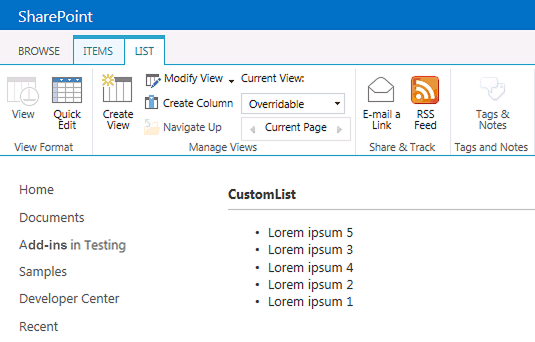

# <a name="customize-a-list-view-in-sharepoint-add-ins-using-client-side-rendering"></a><span data-ttu-id="6c4e4-101">Настройка представления списка в надстройках SharePoint с использованием технологии клиентской обработки</span><span class="sxs-lookup"><span data-stu-id="6c4e4-101">Customize a list view in SharePoint Add-ins using client-side rendering</span></span>
<span data-ttu-id="6c4e4-102">В этой статье рассказывается, как настроить представление списка в надстройке, размещаемой в SharePoint, с использованием технологии клиентской обработки в SharePoint.</span><span class="sxs-lookup"><span data-stu-id="6c4e4-102">Learn how to customize a list view in a SharePoint-hosted app by using the client-side rendering technology in SharePoint.</span></span>
 

 <span data-ttu-id="6c4e4-p101">**Примечание.** В настоящее время идет процесс замены названия "приложения для SharePoint" названием "надстройки SharePoint". Во время этого процесса в документации и пользовательском интерфейсе некоторых продуктов SharePoint и средств Visual Studio может по-прежнему использоваться термин "приложения для SharePoint". Дополнительные сведения см. в статье [Новое название приложений для Office и SharePoint](new-name-for-apps-for-sharepoint#bk_newname).</span><span class="sxs-lookup"><span data-stu-id="6c4e4-p101">The name "apps for SharePoint" is changing to "SharePoint Add-ins". During the transition, the documentation and the UI of some SharePoint products and Visual Studio tools might still use the term "apps for SharePoint". For details, see [New name for apps for Office and SharePoint](new-name-for-apps-for-sharepoint#bk_newname).</span></span>
 

<span data-ttu-id="6c4e4-p102">В SharePoint технология клиентской обработки позволяет вам создавать собственные выходные данные для набора элементов управления, размещенных на странице SharePoint. Благодаря ей вы можете использовать хорошо известные технологии, например HTML и JavaScript, для задания логики отрисовки представлений списков в SharePoint. Технология клиентской обработки дает вам возможность указывать собственные ресурсы JavaScript и размещать их в хранилищах данных, доступных для ваших надстроек, например в библиотеке документов. Надстройка, размещаемая в SharePoint, включает только компоненты SharePoint. Ресурсы надстройки, размещаемой в SharePoint, хранятся на изолированном дочернем сайте хост-сайта, называемом сайтом надстройки.</span><span class="sxs-lookup"><span data-stu-id="6c4e4-p102">In sp15allshort, client-side rendering provides a way for you to produce your own output for a set of controls that are hosted in a SharePoint page. It enables you to use well-known technologies, such as HTML and ecmascriptlong, to define the rendering logic of SharePoint list views. With client-side rendering, you can specify your own ecmascriptshort resources and host them in the data storage options that are available to your add-ins, such as in a document library. A SharePoint-hosted add-in includes only SharePoint components. A SharePoint-hosted add-in has its resources in an isolated subsite of the host web, called the add-in web.</span></span>
 

## <a name="prerequisites-for-using-the-examples-in-this-article"></a><span data-ttu-id="6c4e4-111">Компоненты, необходимые для использования примеров в этой статье</span><span class="sxs-lookup"><span data-stu-id="6c4e4-111">Prerequisites for using the examples in this article</span></span>
<span data-ttu-id="6c4e4-112"><a name="SP15CSRlistview_Prereq"> </a></span><span class="sxs-lookup"><span data-stu-id="6c4e4-112"></span></span>

<span data-ttu-id="6c4e4-113">Чтобы выполнить действия, указанные в этом примере, вам потребуются указанные ниже компоненты.</span><span class="sxs-lookup"><span data-stu-id="6c4e4-113">To follow the steps in this example, you will need the following:</span></span>
 

 

-  <span data-ttu-id="6c4e4-114">[Visual Studio 2015 и Инструменты разработчика Microsoft Office последней версии](https://www.visualstudio.com/features/office-tools-vs).</span><span class="sxs-lookup"><span data-stu-id="6c4e4-114">[Visual Studio 2015 and the latest Microsoft Office Developer Tools ](https://www.visualstudio.com/features/office-tools-vs)</span></span>
    
 
- <span data-ttu-id="6c4e4-115">Среда разработки SharePoint (для локальных сценариев необходимо изолировать надстройку).</span><span class="sxs-lookup"><span data-stu-id="6c4e4-115">A SharePoint development environment (add-in isolation required for on-premises scenarios)</span></span>
    
 
<span data-ttu-id="6c4e4-116">Руководство по настройке среды разработки согласно вашим потребностям см. в статье о том, как [приступить к созданию надстроек Office и SharePoint](http://msdn.microsoft.com/library/187f8c8c-1b15-471c-80b5-69a40e67deea.aspx).</span><span class="sxs-lookup"><span data-stu-id="6c4e4-116">For guidance on how to set up a development environment that fits your needs, see  [Start building Office and SharePoint Add-ins](http://msdn.microsoft.com/library/187f8c8c-1b15-471c-80b5-69a40e67deea.aspx).</span></span>
 

 

### <a name="core-concepts-to-help-you-understand-list-view-customization-with-client-side-rendering"></a><span data-ttu-id="6c4e4-117">Основные понятия, упрощающие понимание процесса настройки представления списка с использованием технологии клиентской обработки</span><span class="sxs-lookup"><span data-stu-id="6c4e4-117">Core concepts to help you understand list view customization with client-side rendering</span></span>

<span data-ttu-id="6c4e4-118">В таблице ниже перечислены полезные статьи, с помощью которых вам будет проще изучить основные понятия, используемые для настройки представлений списков.</span><span class="sxs-lookup"><span data-stu-id="6c4e4-118">The following table lists useful articles that can help you understand the concepts that are involved in a list view customization scenario.</span></span>
 

 

<span data-ttu-id="6c4e4-119">**Табл. 1. Основные понятия для настройки представлений списков в надстройке**</span><span class="sxs-lookup"><span data-stu-id="6c4e4-119">**Table 1. Core concepts for list view customization in an add-in**</span></span>


|<span data-ttu-id="6c4e4-120">**Название статьи**</span><span class="sxs-lookup"><span data-stu-id="6c4e4-120">**Article title**</span></span>|<span data-ttu-id="6c4e4-121">**Описание**</span><span class="sxs-lookup"><span data-stu-id="6c4e4-121">**Description**</span></span>|
|:-----|:-----|
| [<span data-ttu-id="6c4e4-122">Надстройки SharePoint</span><span class="sxs-lookup"><span data-stu-id="6c4e4-122">SharePoint Add-ins</span></span>](sharepoint-add-ins)|<span data-ttu-id="6c4e4-123">Изучите новую модель надстроек в Microsoft SharePoint, с помощью которой можно создавать небольшие и удобные в использовании надстройки для пользователей.</span><span class="sxs-lookup"><span data-stu-id="6c4e4-123">Learn about the new add-in model in Microsoft SharePoint that enables you to create add-ins, which are small, easy-to-use solutions for end users.</span></span>|
| [<span data-ttu-id="6c4e4-124">Разработка пользовательского интерфейса для надстроек SharePoint</span><span class="sxs-lookup"><span data-stu-id="6c4e4-124">UX design for SharePoint Add-ins</span></span>](ux-design-for-sharepoint-add-ins)|<span data-ttu-id="6c4e4-125">Изучите различные варианты пользовательского интерфейса, доступные при создании надстроек SharePoint.</span><span class="sxs-lookup"><span data-stu-id="6c4e4-125">Learn about the UX options that you have when you are building SharePoint Add-ins.</span></span>|
| [<span data-ttu-id="6c4e4-126">Хост-сайты, сайты надстроек и компоненты SharePoint в SharePoint</span><span class="sxs-lookup"><span data-stu-id="6c4e4-126">Host webs, add-in webs, and SharePoint components in SharePoint</span></span>](host-webs-add-in-webs-and-sharepoint-components-in-sharepoint-2013)|<span data-ttu-id="6c4e4-p103">Изучите различия между хост-сайтами и сайтами надстроек. Узнайте, какие компоненты SharePoint можно включать в надстройку для SharePoint, какие компоненты разворачиваются на хост-сайте, какие компоненты разворачиваются на сайте надстройки, и как выполняется развертывание сайта надстройки в изолированном домене.</span><span class="sxs-lookup"><span data-stu-id="6c4e4-p103">Learn about the difference between host webs and add-in webs. Find out which SharePoint components can be included in a SharePoint Add-in, which components are deployed to the host web, which components are deployed to the add-in web, and how the add-in web is deployed in an isolated domain.</span></span>|

## <a name="code-example-customize-a-list-view-by-using-client-side-rendering"></a><span data-ttu-id="6c4e4-129">Пример кода: настройка представления списка с использованием технологии клиентской обработки</span><span class="sxs-lookup"><span data-stu-id="6c4e4-129">Code example: Customize a list view by using client-side rendering</span></span>
<span data-ttu-id="6c4e4-130"><a name="SP15CSRlistview_Codeexample"> </a></span><span class="sxs-lookup"><span data-stu-id="6c4e4-130"></span></span>

<span data-ttu-id="6c4e4-131">Чтобы настроить представление списка, развернутое на сайте надстройки, с помощью технологии клиентской обработки, выполните указанные ниже действия.</span><span class="sxs-lookup"><span data-stu-id="6c4e4-131">To customize a list view that is deployed to the add-in web by using client-side rendering, follow these steps:</span></span>
 

 

1. <span data-ttu-id="6c4e4-132">Создайте проект надстройки для SharePoint.</span><span class="sxs-lookup"><span data-stu-id="6c4e4-132">Create the SharePoint Add-in project.</span></span>
    
 
2. <span data-ttu-id="6c4e4-133">Создайте новое определение списка с настраиваемым представлением.</span><span class="sxs-lookup"><span data-stu-id="6c4e4-133">Create a new list definition with a custom view.</span></span>
    
 
3. <span data-ttu-id="6c4e4-134">Создайте настраиваемую логику обработки в файле JavaScript.</span><span class="sxs-lookup"><span data-stu-id="6c4e4-134">Provide the custom rendering logic in a JavaScript file.</span></span>
    
 
<span data-ttu-id="6c4e4-135">На рис. 1 показано представление списка объявлений, отрисованное с помощью технологии клиентской обработки.</span><span class="sxs-lookup"><span data-stu-id="6c4e4-135">Figure 1 shows a client-side rendered view of an announcements list.</span></span>
 

 

<span data-ttu-id="6c4e4-136">**Рис. 1. Настраиваемое представление списка объявлений**</span><span class="sxs-lookup"><span data-stu-id="6c4e4-136">**Figure 1. Custom view of an announcements list**</span></span>

 

 

 

### <a name="to-create-the-sharepoint-add-in-project"></a><span data-ttu-id="6c4e4-138">Создание проекта надстройки SharePoint</span><span class="sxs-lookup"><span data-stu-id="6c4e4-138">To create the SharePoint Add-in project</span></span>


1. <span data-ttu-id="6c4e4-p104">Запустите Visual Studio 2015 от имени администратора. (Для этого щелкните правой копкой мыши значок **Visual Studio** в меню **Пуск** и выберите пункт **Запуск от имени администратора**.)</span><span class="sxs-lookup"><span data-stu-id="6c4e4-p104">Open Visual Studio 2015 as administrator. (To do this, right-click the **Visual Studio** icon on the **Start** menu, and choose **Run as administrator**.)</span></span>
    
 
2. <span data-ttu-id="6c4e4-141">Создайте проект с использованием шаблона **Надстройка SharePoint**.</span><span class="sxs-lookup"><span data-stu-id="6c4e4-141">Create a new project using the **SharePoint Add-in** template.</span></span>
    
    <span data-ttu-id="6c4e4-142">На рис. 2 показано расположение шаблона **Надстройка SharePoint** в Visual Studio 2015: **Шаблоны** > **Visual C#** > **Office/SharePoint** > **Надстройки Office**.</span><span class="sxs-lookup"><span data-stu-id="6c4e4-142">Figure 2 shows the location of the **SharePoint Add-in** template in Visual Studio 2015, under **Templates**, **Visual C#**, **Office/SharePoint**, **Office Add-ins**.</span></span>
    

    <span data-ttu-id="6c4e4-143">**Рис. 2. Шаблон Visual Studio "Надстройка SharePoint"**</span><span class="sxs-lookup"><span data-stu-id="6c4e4-143">**Figure 2. Add-in for SharePoint Visual Studio template**</span></span>

 

  
 

 

 
3. <span data-ttu-id="6c4e4-145">Укажите URL-адрес веб-сайта SharePoint, который вы хотите использовать для отладки.</span><span class="sxs-lookup"><span data-stu-id="6c4e4-145">Provide the URL of the SharePoint website that you want to use for debugging.</span></span>
    
 
4. <span data-ttu-id="6c4e4-146">В качестве варианта размещения надстройки выберите пункт **Размещение в SharePoint**.</span><span class="sxs-lookup"><span data-stu-id="6c4e4-146">Select **SharePoint-hosted** as the hosting option for your add-in.</span></span>
    
 

### <a name="to-create-a-new-list-definition"></a><span data-ttu-id="6c4e4-147">Создание определения списка</span><span class="sxs-lookup"><span data-stu-id="6c4e4-147">To create a new list definition</span></span>


1. <span data-ttu-id="6c4e4-p105">Щелкните правой кнопкой мыши проект надстройки SharePoint и добавьте новый элемент **Список**. Создайте настраиваемый список на основе объявлений.</span><span class="sxs-lookup"><span data-stu-id="6c4e4-p105">Right-click the SharePoint Add-in project, and add a new **List** item. Create a customizable list based on Announcements.</span></span>
    
 
2. <span data-ttu-id="6c4e4-p106">Скопируйте указанную ниже разметку и вставьте ее в элемент **Views** в файле Schema.xml вашего компонента списка. Эта разметка выполняет перечисленные ниже задачи.</span><span class="sxs-lookup"><span data-stu-id="6c4e4-p106">Copy the following markup and paste it in the **Views** element in the Schema.xml file of your list feature. The markup performs the following tasks:</span></span>
    
      - <span data-ttu-id="6c4e4-152">Объявляет новое представление с именем Overridable и атрибутом BaseViewID=2.</span><span class="sxs-lookup"><span data-stu-id="6c4e4-152">Declares a new view named Overridable with a BaseViewID=2.</span></span>
    
 
  - <span data-ttu-id="6c4e4-153">Предоставляет значение для элемента **JSLink**, которое указывает на файл JavaScript, подготовленный вместе с надстройкой.</span><span class="sxs-lookup"><span data-stu-id="6c4e4-153">Provides a value for the **JSLink** element that points to a JavaScript file that is provisioned with the add-in.</span></span>
    
     <span data-ttu-id="6c4e4-p107">**Примечание.** Свойство JSLink не поддерживается в списках Survey или Events. Календарь SharePoint представляет собой список Events.</span><span class="sxs-lookup"><span data-stu-id="6c4e4-p107">**Note** The JSLink property is not supported on Survey or Events lists. A SharePoint calendar is an Events list.</span></span>

```XML
  <View BaseViewID="2" 
      Name="8d2719f3-c3c3-415b-989d-33840d8e2ddb" 
      DisplayName="Overridable" 
      Type="HTML" 
      WebPartZoneID="Main" 
      SetupPath="pages\viewpage.aspx" 
      Url="Overridable.aspx"
      DefaultView="TRUE">
  <ViewFields>
    <FieldRef Name="Title" />
  </ViewFields>
  <Query />
  <Toolbar Type="Standard" />
  <XslLink>main.xsl</XslLink>
  <JSLink Default="TRUE">~site/Scripts/CSRListView.js</JSLink>
</View>
```


### <a name="to-provide-the-custom-rendering-logic-in-a-javascript-file"></a><span data-ttu-id="6c4e4-156">Создание настраиваемой логики отрисовки в файле JavaScript</span><span class="sxs-lookup"><span data-stu-id="6c4e4-156">To provide the custom rendering logic in a JavaScript file</span></span>


1. <span data-ttu-id="6c4e4-p108">Щелкните правой кнопкой мыши папку **Scripts** и добавьте новый файл JavaScript. Присвойте этому файлу имя fileCSRListView.js.</span><span class="sxs-lookup"><span data-stu-id="6c4e4-p108">Right-click the **Scripts** folder, and add a new JavaScript file. Name the fileCSRListView.js.</span></span>
    
 
2. <span data-ttu-id="6c4e4-p109">Скопируйте указанный ниже код и вставьте его в файл CSRListView.js. Этот код выполняет указанные ниже задачи.</span><span class="sxs-lookup"><span data-stu-id="6c4e4-p109">Copy the following code and paste it in the CSRListView.js file. The code performs the following tasks:</span></span>
    
      - <span data-ttu-id="6c4e4-161">Предоставляет обработчики событий для событий **PreRender** и **PostRender**.</span><span class="sxs-lookup"><span data-stu-id="6c4e4-161">Provides event handlers for the **PreRender** and **PostRender** events.</span></span>
    
 
  - <span data-ttu-id="6c4e4-162">Предоставляет шаблоны для наборов шаблонов Header, Footer и Item.</span><span class="sxs-lookup"><span data-stu-id="6c4e4-162">Provides templates for the Header, Footer, and Item template sets.</span></span>
    
 
  - <span data-ttu-id="6c4e4-163">Регистрирует шаблоны.</span><span class="sxs-lookup"><span data-stu-id="6c4e4-163">Registers the templates.</span></span>
    
 

```
  (function () {
    // Initialize the variable that stores the objects.
    var overrideCtx = {};
    overrideCtx.Templates = {};

    // Assign functions or plain html strings to the templateset objects:
    // header, footer and item.
    overrideCtx.Templates.Header = "<B><#=ctx.ListTitle#></B>" +
        "<hr><ul id='unorderedlist'>";

    // This template is assigned to the CustomItem function.
    overrideCtx.Templates.Item = customItem;
    overrideCtx.Templates.Footer = "</ul>";

    // Set the template to the:
    //  Custom list definition ID
    //  Base view ID
    overrideCtx.BaseViewID = 2;
    overrideCtx.ListTemplateType = 10057;

    // Assign a function to handle the
    // PreRender and PostRender events
    overrideCtx.OnPreRender = preRenderHandler;
    overrideCtx.OnPostRender = postRenderHandler;

    // Register the template overrides.
    SPClientTemplates.TemplateManager.RegisterTemplateOverrides(overrideCtx);
})();

// This function builds the output for the item template.
// It uses the context object to access announcement data.
function customItem(ctx) {

    // Build a listitem entry for every announcement in the list.
    var ret = "<li>" + ctx.CurrentItem.Title + "</li>";
    return ret;
}

// The preRenderHandler attends the OnPreRender event
function preRenderHandler(ctx) {

    // Override the default title with user input.
    ctx.ListTitle = prompt("Type a title", ctx.ListTitle);
}

// The postRenderHandler attends the OnPostRender event
function postRenderHandler(ctx) {

    // You can manipulate the DOM in the postRender event
    var ulObj;
    var i, j;

    ulObj = document.getElementById("unorderedlist");
    
    // Reverse order the list.
    for (i = 1; i < ulObj.children.length; i++) {
        var x = ulObj.children[i];
        for (j = 1; j < ulObj.children.length; j++) {
            var y = ulObj.children[j];
            if(x.innerText<y.innerText){                  
                ulObj.insertBefore(y, x);
            }
        }
    }
}
```


### <a name="to-build-and-run-the-solution"></a><span data-ttu-id="6c4e4-164">Построение и запуск решения</span><span class="sxs-lookup"><span data-stu-id="6c4e4-164">To build and run the solution</span></span>


1. <span data-ttu-id="6c4e4-165">Нажмите клавишу F5.</span><span class="sxs-lookup"><span data-stu-id="6c4e4-165">Press the F5 key.</span></span>
    
     <span data-ttu-id="6c4e4-166">**Примечание.** Когда вы нажимаете клавишу F5, Visual Studio создает решение, развертывает надстройку и открывает страницу разрешений для надстройки.</span><span class="sxs-lookup"><span data-stu-id="6c4e4-166">**Note** When you press F5, Visual Studio builds the solution, deploys the add-in, and opens the permissions page for the add-in.</span></span>
2. <span data-ttu-id="6c4e4-167">Нажмите кнопку **Доверять**.</span><span class="sxs-lookup"><span data-stu-id="6c4e4-167">Choose the **Trust It** button.</span></span>
    
 
3. <span data-ttu-id="6c4e4-p110">Перейдите в свой настраиваемый список, введя адрес _/Lists/<экземпляр_вашего_списка>_, относительный для каталога вашей надстройки в домене сайта надстройки (а не в домене хост-сайта). Добавьте одно или несколько объявлений. На ленте выберите представление **Переопределяемый**.</span><span class="sxs-lookup"><span data-stu-id="6c4e4-p110">Go to your custom List by entering the _/Lists/<your_list_instance>_ address relative to your add-in directory in the add-in web domain (not the host web domain). Add one or two announcements. On the ribbon, choose the **Overridable** view.</span></span>
    
 

## <a name="next-steps"></a><span data-ttu-id="6c4e4-171">Дальнейшие действия</span><span class="sxs-lookup"><span data-stu-id="6c4e4-171">Next steps</span></span>
<span data-ttu-id="6c4e4-172"><a name="SP15CSRlistview_Nextsteps"> </a></span><span class="sxs-lookup"><span data-stu-id="6c4e4-172"></span></span>

<span data-ttu-id="6c4e4-p111">В этой статье демонстрируется настройка представления списка в надстройке для SharePoint с использованием обработки на стороне клиента. Далее вы можете изучить другие компоненты взаимодействия с пользователем, доступные в надстройках для SharePoint. Дополнительные сведения можно найти в следующих источниках.</span><span class="sxs-lookup"><span data-stu-id="6c4e4-p111">This article demonstrated how to customize a list view in a SharePoint Add-in by using client-side rendering. As a next step, you can learn about the other UX components that are available for SharePoint Add-ins. To learn more, see the following:</span></span>
 

 

-  [<span data-ttu-id="6c4e4-176">Пример кода: настройка представления списка в надстройке с использованием технологии клиентской обработки</span><span class="sxs-lookup"><span data-stu-id="6c4e4-176">Code sample: Customize a list view in an add-in using client-side rendering</span></span>](http://code.msdn.microsoft.com/SharePoint-2013-Customize-61761017)
    
 
-  [<span data-ttu-id="6c4e4-177">Использование таблицы стилей веб-сайта SharePoint в надстройках SharePoint</span><span class="sxs-lookup"><span data-stu-id="6c4e4-177">Use a SharePoint website's style sheet in SharePoint Add-ins</span></span>](use-a-sharepoint-website-s-style-sheet-in-sharepoint-add-ins)
    
 
-  [<span data-ttu-id="6c4e4-178">Использование клиентского элемента управления хрома в надстройках SharePoint</span><span class="sxs-lookup"><span data-stu-id="6c4e4-178">Use the client chrome control in SharePoint Add-ins</span></span>](use-the-client-chrome-control-in-sharepoint-add-ins)
    
 
-  [<span data-ttu-id="6c4e4-179">Создание дополнительных действий для развертывания с надстройками SharePoint</span><span class="sxs-lookup"><span data-stu-id="6c4e4-179">Create custom actions to deploy with SharePoint Add-ins</span></span>](create-custom-actions-to-deploy-with-sharepoint-add-ins)
    
 
-  [<span data-ttu-id="6c4e4-180">Создание веб-частей надстроек для установки вместе с надстройкой SharePoint</span><span class="sxs-lookup"><span data-stu-id="6c4e4-180">Create add-in parts to install with your SharePoint Add-in</span></span>](create-add-in-parts-to-install-with-your-sharepoint-add-in)
    
 

## <a name="additional-resources"></a><span data-ttu-id="6c4e4-181">Дополнительные ресурсы</span><span class="sxs-lookup"><span data-stu-id="6c4e4-181">Additional resources</span></span>
<span data-ttu-id="6c4e4-182"><a name="SP15CSRlistview_AddResources"> </a></span><span class="sxs-lookup"><span data-stu-id="6c4e4-182"></span></span>


-  [<span data-ttu-id="6c4e4-183">Настройка локальной среды разработки для надстроек SharePoint</span><span class="sxs-lookup"><span data-stu-id="6c4e4-183">Set up an on-premises development environment for SharePoint Add-ins</span></span>](set-up-an-on-premises-development-environment-for-sharepoint-add-ins)
    
 
-  [<span data-ttu-id="6c4e4-184">Разработка пользовательского интерфейса для надстроек SharePoint</span><span class="sxs-lookup"><span data-stu-id="6c4e4-184">UX design for SharePoint Add-ins</span></span>](ux-design-for-sharepoint-add-ins)
    
 
-  [<span data-ttu-id="6c4e4-185">Создание компонентов пользовательского интерфейса в SharePoint</span><span class="sxs-lookup"><span data-stu-id="6c4e4-185">Create UX components in SharePoint</span></span>](create-ux-components-in-sharepoint-2013)
    
 
-  [<span data-ttu-id="6c4e4-186">Что следует рассмотреть, прежде чем приступать к разработке надстроек SharePoint</span><span class="sxs-lookup"><span data-stu-id="6c4e4-186">Three ways to think about design options for SharePoint Add-ins</span></span>](three-ways-to-think-about-design-options-for-sharepoint-add-ins)
    
 
-  [<span data-ttu-id="6c4e4-187">Важные аспекты разработки и архитектуры для надстроек SharePoint</span><span class="sxs-lookup"><span data-stu-id="6c4e4-187">Important aspects of the SharePoint Add-in architecture and development landscape</span></span>](important-aspects-of-the-sharepoint-add-in-architecture-and-development-landscape)
    
 

