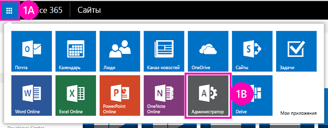

# Развертывание и установка надстроек SharePoint, размещаемых в SharePointDeploy and install a SharePoint-hosted SharePoint Add-in

Это вторая часть серии статей, посвященной основам разработки надстроек SharePoint, размещаемых в SharePoint. Для начала следует ознакомиться со статьей [Надстройки SharePoint](sharepoint-add-ins.md) и предыдущей статьей из этой серии.This is the second in a series of articles about the basics of developing SharePoint-hosted SharePoint Add-ins. You should first be familiar with the topic  [SharePoint Add-ins](sharepoint-add-ins.md) and the preceding topics in the series:

-  [Начало работы по созданию надстроек SharePoint, размещаемых в SharePointGet started creating SharePoint-hosted SharePoint Add-ins](get-started-creating-sharepoint-hosted-sharepoint-add-ins.md)
    
> [!NOTE]
> Если вы изучали предыдущие статьи этой серии о надстройках, размещаемых в SharePoint, то у вас уже есть решение для Visual Studio, которое можно использовать для работы с этой статьей.Note  If you have been working through this series about SharePoint-hosted add-ins, then you have a Visual Studio solution that you can use to continue with this topic. You can also download the repository at  SharePoint_SP-hosted_Add-Ins_Tutorials and open the BeforeClientRenderedControl.sln file. Кроме того, вы можете скачать репозиторий на веб-странице [SharePoint_SP-hosted_Add-Ins_Tutorials](https://github.com/OfficeDev/SharePoint_SP-hosted_Add-Ins_Tutorials) и открыть файл BeforeColumns.sln.You can also download the repository at [SharePoint_SP-hosted_Add-Ins_Tutorials](https://github.com/OfficeDev/SharePoint_SP-hosted_Add-Ins_Tutorials) and open the BeforeColumns.sln file.

Размещаемые в SharePoint Надстройки SharePoint будет намного проще разрабатывать, зная, как пользователи развертывают и устанавливают надстройки. Поэтому в этой статье мы отвлечемся от кода, чтобы создать и использовать каталог надстроек, а затем установим надстройку, над которой вы работали.You'll find it a lot easier to develop SharePoint-hosted SharePoint Add-ins if you are familiar with how users deploy and install your add-ins. So, in this article, we'll take a brief break from coding to create and use an add-in catalog, and then install the add-in you've been working on.

## Создание каталога надстроекCreate an add-in catalog

1. Войдите в учетную запись подписки на Office 365 от имени администратора.Sign in to your Office 365 subscription as an administrator. Щелкните значок средства запуска надстроек, а затем выберите надстройку **Admin** (Администратор).Select the add-in launcher icon, and then select the **Admin** add-in.
    
   *Рис. 1. Средство запуска надстроек в Office 365**Figure 1. Office 365 add-in launcher*

   
 
2. В **Центре администрирования** разверните узел **Администратор** в области задач и выберите пункт **SharePoint**.In the  **Admin Center**, expand the  **Admin** node in the task pane and then choose **SharePoint**.
     
3. В **Центре администрирования SharePoint** выберите пункт **Надстройки** в области задач.In the  **SharePoint Admin Center**, choose  **add-ins** in the task pane.
     
4. На странице **Надстройки** выберите пункт **Каталог надстроек**.On the **add-ins** page, select **Add-in Catalog**. Если в подписке уже есть семейство веб-сайтов каталога надстроек, он откроется, и вам больше не нужно будет ничего делать.(If there is already an add-in catalog site collection in the subscription, it opens and you are finished. Вам не удастся создать более одного каталога в подписке.You cannot create more than one add-in catalog in a subscription.)    
 
5. На странице **Сайт каталога надстроек** нажмите кнопку **ОК**, чтобы принять параметр, используемый по умолчанию, и создать сайт каталога надстроек.On the  **Add-in Catalog Site** page, choose **OK** to accept the default option and create a new add-in catalog site.    
 
6. В диалоговом окне **Создание семейства веб-сайтов каталога надстроек** укажите название и веб-адрес сайта каталога надстроек.In the **Create Add-in Catalog Site Collection** dialog, specify the title and website address of your add-in catalog site. Рекомендуем включить слово "catalog" (каталог) в название и URL-адрес, чтобы было легче запомнить и найти их в **Центре администрирования SharePoint**.On the  Create Add-in Catalog Site Collection dialog, specify the title and web site address of your add-in catalog site. We recommend that you include "catalog" in the title and URL to make it memorable and distinguishable in the **SharePoint Admin Center**.   
 
7. Укажите **часовой пояс** и назначьте себя **администратором**.Specify a  **Time Zone** and set yourself as the **Administrator**.
    
8. Выберите минимально возможное значение для параметра **Квота хранилища** (в настоящее время оно равно 110, но его можно изменить), потому что пакеты надстроек, которые вы будете отправлять в это семейство веб-сайтов, совсем небольшие.Set the  **Storage Quota** to the lowest possible value (currently 110, but that can change), because the add-in packages you upload to this site collection are very small.
    
9. Для параметра **Квота ресурсов сервера** задайте значение 0 (ноль) и нажмите кнопку **ОК**.Set the **Server Resource Quota** to 0 (zero), and then select **OK**. (Квота ресурсов сервера связана с регулированием изолированных решений с низкой производительностью, но вы не будете устанавливать изолированные решения на сайте каталога надстроек.)Set the  Server Resource Quota to 0 (zero). (The server resource quota is related to throttling poorly performing sandboxed solutions, but you won't be installing any sandboxed solutions on your add-in catalog site.) 
 
В процессе создания семейства веб-сайтов SharePoint вернет вас в **Центр администрирования SharePoint**.As the site collection is being created, SharePoint takes you back to the  **SharePoint Admin Center**. After a few minutes, you'll see that the collection has been created. Через некоторое время вы увидите, что семейство веб-сайтов создано.As the site collection is being created, SharePoint takes you back to the  SharePoint Admin Center. After a few minutes, you'll see that the collection has been created.

## Упаковка надстройки и ее отправка в каталогPackage the add-in and upload it to the catalog

1. Откройте решение в Visual Studio, дважды щелкните узел проекта в **обозревателе решений**, а затем нажмите кнопку **Опубликовать**.Open the Visual Studio solution, and then right-click the project node in  **Solution Explorer**. Choose  **Publish**.
     
2. В области **Публикация** выберите пункт **Упаковать надстройку**.In the **Publish** pane, select **Package the add-in**. Надстройка будет упакована и сохранена в виде файла `*.app` в папке решения \bin\debug\web.publish\1.0.0.0.In the  Publish pane, choose Package the add-in. The add-in is packaged and saved as an *.app file in the solution's \bin\debug\web.publish\1.0.0.0 folder.  
 
3. Откройте сайт каталога надстроек в браузере и выберите пункт **Надстройки SharePoint** на панели навигации.Open your add-in catalog site in a browser and choose  **SharePoint Add-ins** in the navigation bar.

4. Каталог **Надстройки SharePoint** представляет собой стандартную библиотеку ресурсов SharePoint.The **SharePoint Add-ins** catalog is a standard SharePoint asset library. Отправьте в него пакет надстройки с помощью любого метода отправки файлов в библиотеки SharePoint.The spapppluralcap catalog is a standard SharePoint asset library. Upload the add-in package to it using any of the methods of uploading files to SharePoint libraries.

## Способ установки надстройки, применяемый пользователямиInstall the add-in as end users do

1. Перейдите на любой веб-сайт в подписке SharePoint Online и откройте страницу **Содержимое сайта**.Navigate to any website in the SharePoint Online subscription and open the  **Site Contents** page.

2. Выберите пункт **Добавить надстройку**. Откроется страница **Ваша надстройка**.Choose  **add an add-in** to open the **Your Add-ins** page.

3. Найдите надстройку **Employee Orientation** (Обучение сотрудников) в разделе **Надстройки, которые можно добавить** и щелкните ее плитку.Find the  **Employee Orientation** add-in in the **Add-ins you can add** section and click its tile.

4. В диалоговом окне запроса согласия щелкните **Сделать доверенным**.Select **Trust It** in the consent dialog. Автоматически откроется страница **Содержимое сайта**, и на ней отобразится надстройка с пометкой о том, что выполняется установка надстройки.Choose  Trust It on the consent dialog. The **Site Contents** page automatically opens and the add-in appears with a notation that it is installing. After it installs, users can choose the tile to run the add-in. По завершении установки пользователи могут щелкнуть плитку, чтобы запустить надстройку.After it installs, users can select the tile to run the add-in.

## Удаление надстройкиRemove the add-in

Чтобы продолжить совершенствовать надстройку SharePoint в Visual Studio (см. раздел [Дальнейшие действия](#Nextsteps)), удалите ее, выполнив указанные ниже действия.In order to continue enhancing the same SharePoint Add-in in Visual Studio (see  [Next steps](#Nextsteps)), remove the add-in with these steps:

1. На странице **Содержимое сайта** наведите курсор на надстройку, чтобы появилась кнопка выноски **…**.In the  **Site Contents** page, move the cursor over the add-in so that the callout button **...** appears.

2. Нажмите кнопку выноски и выберите пункт **Удалить**.Choose the callout button and then choose  **REMOVE** on the callout.

3. Вернитесь на сайт каталога надстроек и на панели навигации выберите пункт **Надстройки SharePoint**.Navigate back to your add-in catalog site and choose  **SharePoint Add-ins** in the navigation bar.

4. Выделите надстройку и выберите команду **управление** на панели задач над списком, а затем нажмите кнопку **Удалить** в меню управления.Highlight the add-in and choose  **manage** on the task bar just above the list, and then choose **Delete** on the manage menu.

## Дальнейшие действияNext steps

Мы настоятельно рекомендуем продолжить изучение этой серии статей о надстройках, размещаемых в SharePoint, прежде чем перейти к более сложным темам.We strongly recommend that you continue with this series about SharePoint-hosted add-ins before you go on to the more advanced topics. Next we get back to coding in  Add custom columns to a SharePoint-hostedSharePoint Add-in. В статье [Добавление настраиваемых столбцов в надстройку SharePoint, размещаемую в SharePoint,](add-custom-columns-to-a-sharepoint-hosted-sharepoint-add-in.md) мы вернемся к написанию кода.We strongly recommend that you continue with this series about SharePoint-hosted add-ins before you go on to the more advanced topics. Next we get back to coding in [Add custom columns to a SharePoint-hosted SharePoint Add-in](add-custom-columns-to-a-sharepoint-hosted-sharepoint-add-in.md).
 

 

